## RUSTSCAN 
PORT   STATE SERVICE REASON         VERSION
21/tcp open  ftp?    syn-ack ttl 63
| fingerprint-strings:
|   GenericLines:
|     220 ProFTPD Server (Debian) [::ffff:10.10.11.186]
|     Invalid command: try being more creative
|_    Invalid command: try being more creative
22/tcp open  ssh     syn-ack ttl 63 OpenSSH 8.4p1 Debian 5+deb11u1 (protocol 2.0)
| ssh-hostkey:
|   3072 c4b44617d2102d8fec1dc927fecd79ee (RSA)
| ssh-rsa AAAAB3NzaC1yc2EAAAADAQABAAABgQDPp9LmBKMOuXu2ZOpw8JorL5ah0sU0kIBXvJB8LX26rpbOhw+1MPdhx6ptZzXwQ8wkQc88xu5h+oB8NGkeHLYhvRqtZmvkTpOsyJiMm+0Udbg+IJCENPiKGSC5J+0tt4QPj92xtTe/f7WV4hbBLDQust46D1xVJVOCNfaloIC40BtWoMWIoEFWnk7U3kwXcM5336LuUnhm69XApDB4y/dt5CgXFoWlDQi45WLLQGbanCNAlT9XwyPnpIyqQdF7mRJ5yRXUOXGeGmoO9+JALVQIEJ/7Ljxts6QuV633wFefpxnmvTu7XX9W8vxUcmInIEIQCmunR5YH4ZgWRclT+6rzwRQw1DH1z/ZYui5Bjn82neoJunhweTJXQcotBp8glpvq3X/rQgZASSyYrOJghBlNVZDqPzp4vBC78gn6TyZyuJXhDxw+lHxF82IMT2fatp240InLVvoWrTWlXlEyPiHraKC0okOVtul6T0VRxsuT+QsyU7pdNFkn2wDVvC25AW8=
|   256 2aea2fcb23e8c529409cab866dcd4411 (ECDSA)
| ecdsa-sha2-nistp256 AAAAE2VjZHNhLXNoYTItbmlzdHAyNTYAAAAIbmlzdHAyNTYAAABBBB1ZmNogWBUF8MwkNsezebQ+0/yPq7RX3/j9s4Qh8jbGlmvAcN0Z/aIBrzbEuTRf3/cHehtaNf9qrF2ehQAeM94=
|   256 fd78c0b0e22016fa050debd83f12a4ab (ED25519)
|_ssh-ed25519 AAAAC3NzaC1lZDI1NTE5AAAAIOP4kxBr9kumAjfplon8fXJpuqhdMJy2rpd3FM7+mGw2
80/tcp open  http    syn-ack ttl 63 nginx 1.18.0
|_http-title: Did not follow redirect to http://metapress.htb/
| http-methods:
|_  Supported Methods: GET HEAD POST OPTIONS
|_http-server-header: nginx/1.18.0
1 service unrecognized despite returning data. If you know the service/version, please submit the following fingerprint at https://nmap.org/cgi-bin/submit.cgi?new-service :
* * *
## HTTP
Trying to open the website get geta redirection towards metapress.htb so let's add it to our host file and coninue with enumeration.

So far no subdomains have been found:
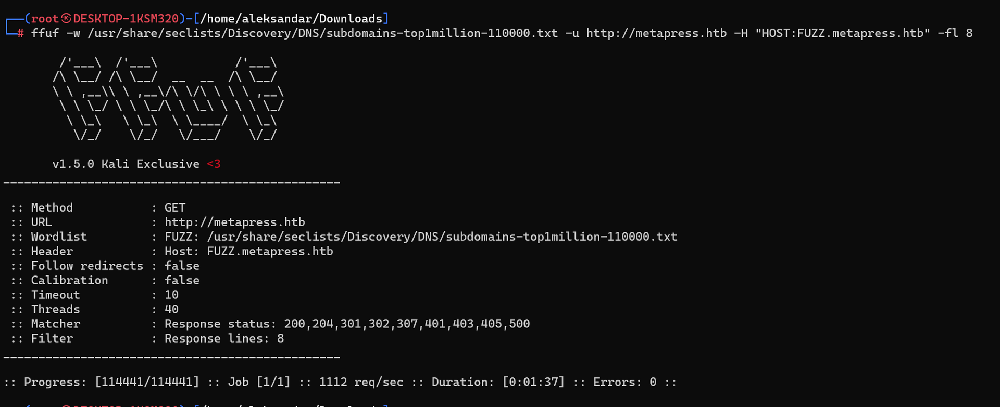

No strange webdirectories or files have been found:
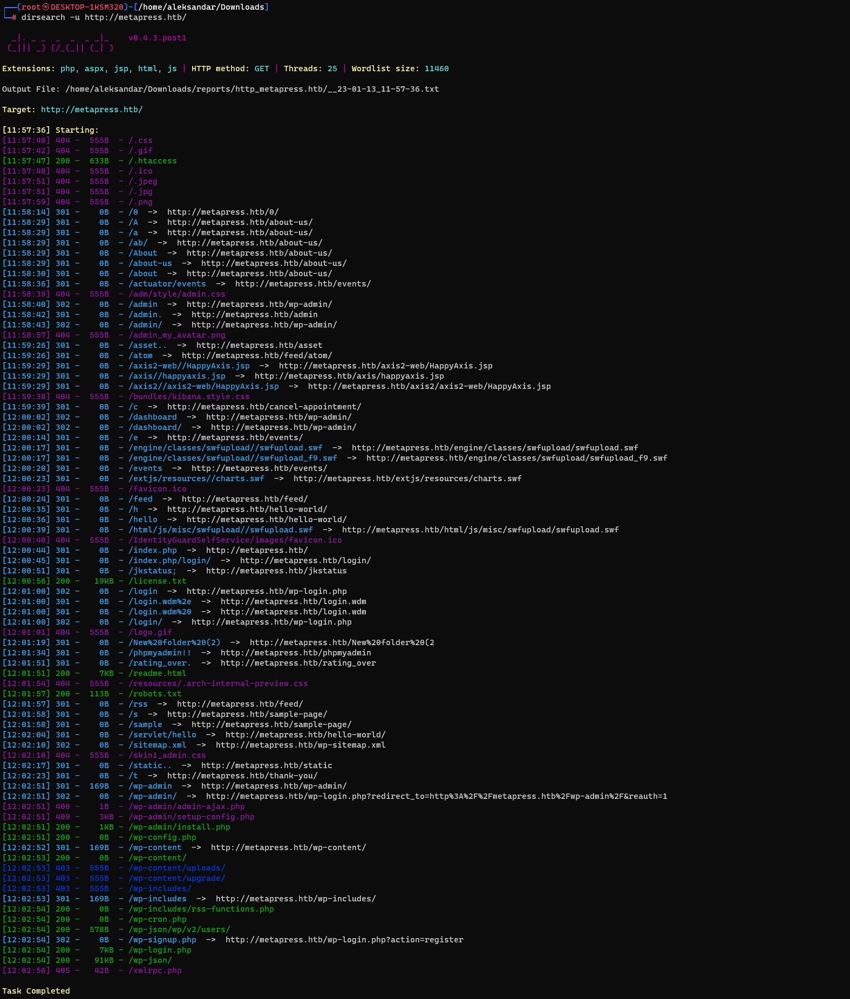

We know it's about a Wordpress CMS so let's run WPscan to check what can we get more:
`
[+] WordPress version 5.6.2 identified (Insecure, released on 2021-02-22).
 | Found By: Rss Generator (Passive Detection)
 |  - http://metapress.htb/feed/, <generator>https://wordpress.org/?v=5.6.2</generator>
 |  - http://metapress.htb/comments/feed/, <generator>https://wordpress.org/?v=5.6.2</generator>
 
 [+] Headers
 | Interesting Entries:
 |  - Server: nginx/1.18.0
 |  - X-Powered-By: PHP/8.0.24
 | Found By: Headers (Passive Detection)
 | Confidence: 100%
 [i] User(s) Identified:

[+] admin
 | Found By: Author Posts - Author Pattern (Passive Detection)
 | Confirmed By:
 |  Rss Generator (Passive Detection)
 |  Wp Json Api (Aggressive Detection)
 |   - http://metapress.htb/wp-json/wp/v2/users/?per_page=100&page=1
 |  Rss Generator (Aggressive Detection)
 |  Author Sitemap (Aggressive Detection)
 |   - http://metapress.htb/wp-sitemap-users-1.xml
 |  Author Id Brute Forcing - Author Pattern (Aggressive Detection)
 |  Login Error Messages (Aggressive Detection)

[+] manager
 | Found By: Author Id Brute Forcing - Author Pattern (Aggressive Detection)
 | Confirmed By: Login Error Messages (Aggressive Detection)
`
Edit: 
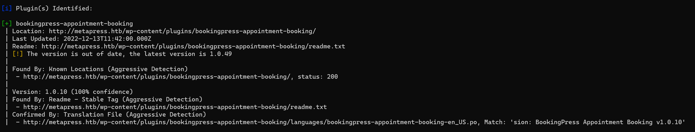

So far nothing about plugins so running the page on Burpsuite we can grab more informations about the Event plugin used by Wordpress:
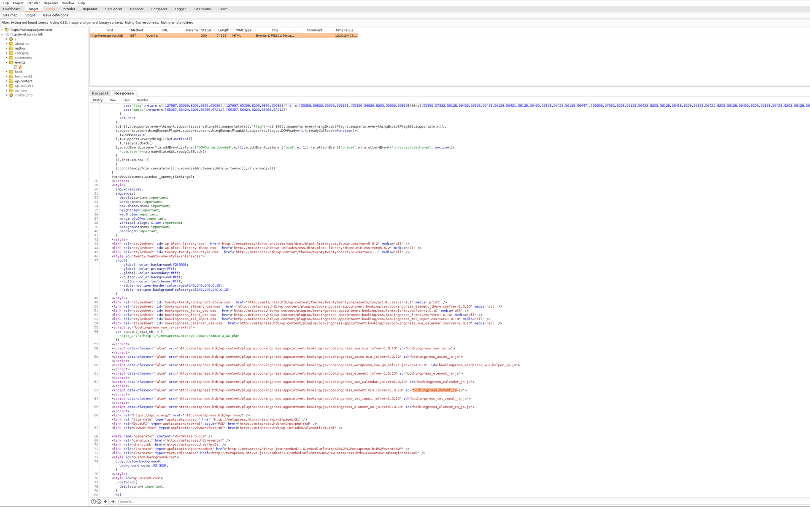

Basically it's the bookingpress_vue.min.js?ver=1.0.10 and searching in the web there is a pretty new exploit about it: https://github.com/destr4ct/CVE-2022-0739
Making our life easier there is a fixed module in Metasploit that we can use, and populating all the informations pointi to /event directory(pointing to the calender plugin) we can get an unauthenticated sqli and get password hashes:
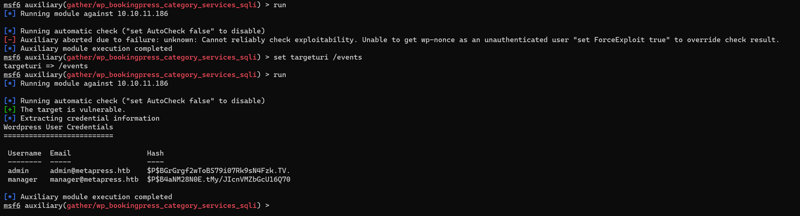

Saving hashes and giving them to Johntheripper will crack a password:
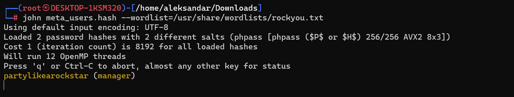
Using managers password we can login into WP-Admin portal, but we are not admins so the only thing we can apparently do is to upload media:
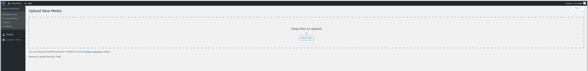

Looking for some priviledge escalation i found something more that could help us leverage a RCE:
https://blog.wpsec.com/wordpress-xxe-in-media-library-cve-2021-29447/
Looking into ExplotDB i found this script: https://www.exploit-db.com/exploits/50304

And successfully read the wp-config.php file:
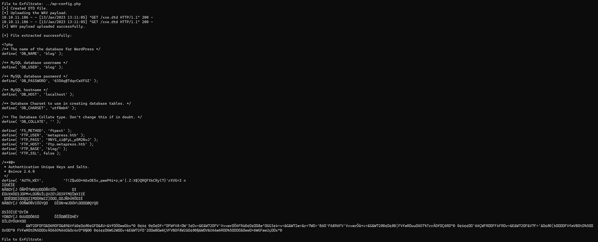

Now we have more informations about DB and FTP.
Now checking /etc/passwd file:
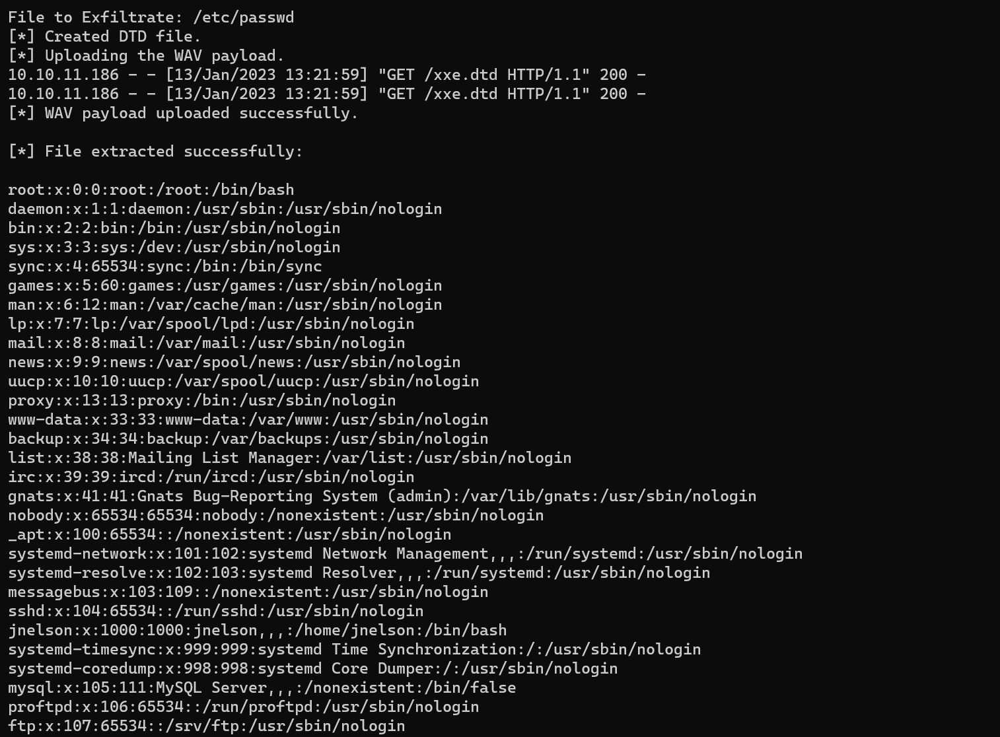

Seems like 2 have only 2 users, one is root and otherone is jnelson. 
Using ftp informations from wp-config we get access to ftp server:
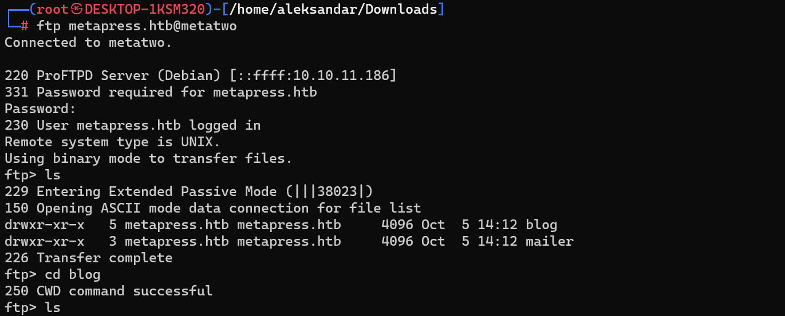

Surfing the ftp, and going into mailer folder we can grab jnelsons password from send_email.php file:
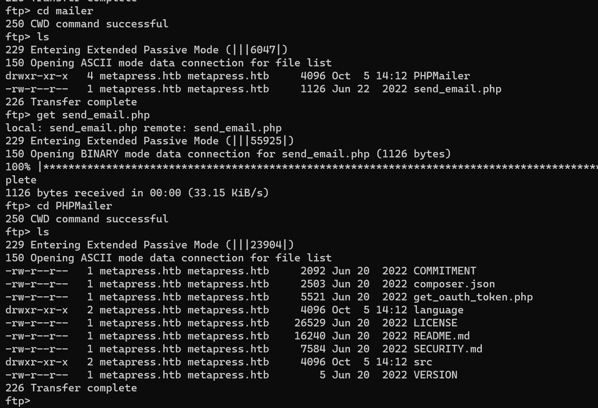
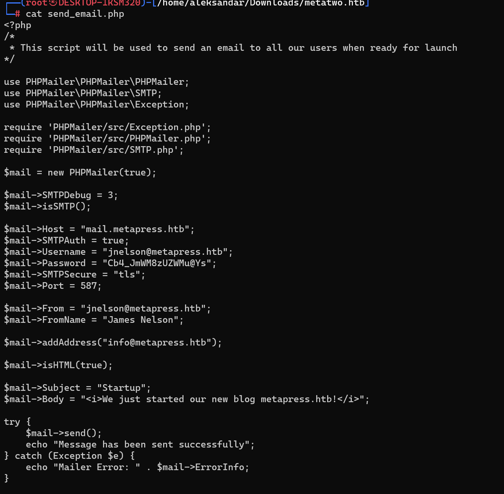
* * *
## User.txt
With credentials found into send_email.php file we can login via SSH and grab our first flag:
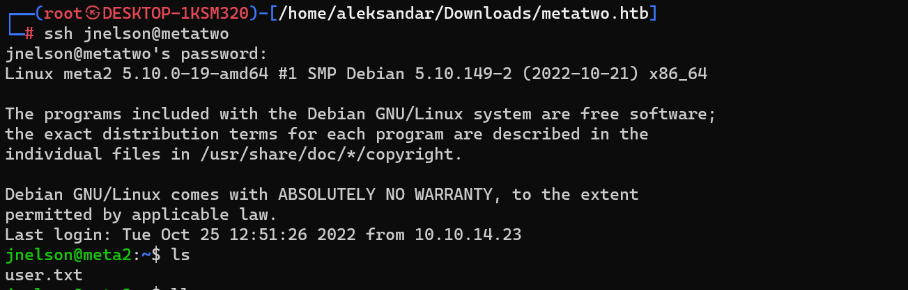
* * *
## Root.txt
Pooking around we know there are no other accountus execpt jnelson's and ofcourse root and trying sudo -l we have no sudo rights.
Listing all files in Jnelson home(including hidden ones) i stubled upon an interesting directory:
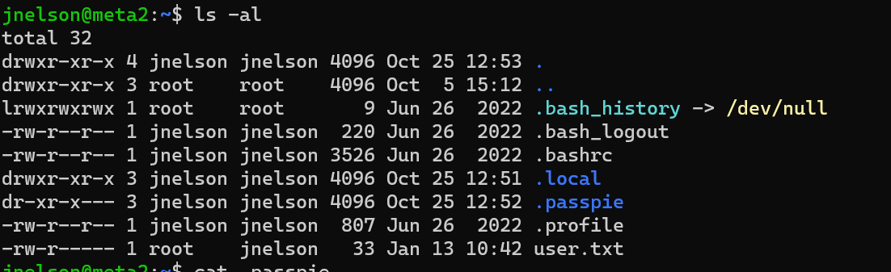

More precisely seems like we have some informations about root user encrypted with pgp keys:
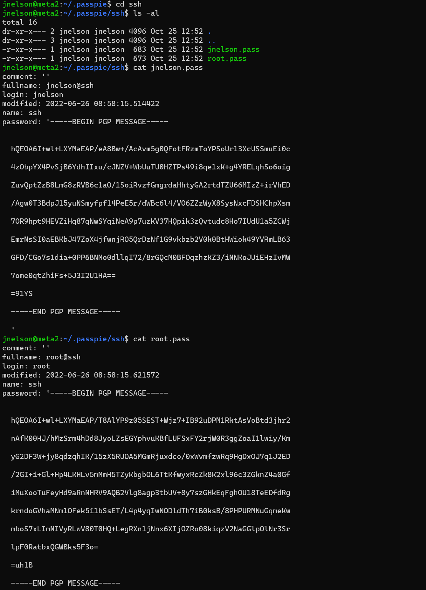

Now we need to know how to decrypt those... Googling around Johntheripper can decrypt PGP keys so we can download the .keys file:
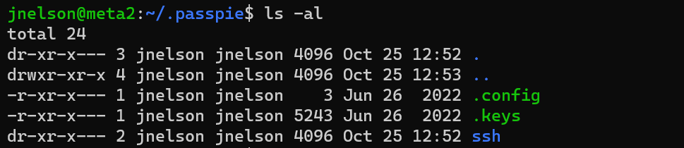

Extract only the PGP Private key and send it to gpg2john for pre-hashing:
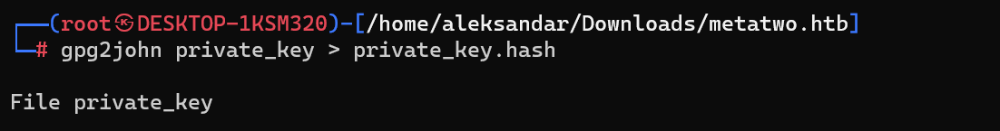

And lastly giving that file to John we get the GPG password used to encript the messages:
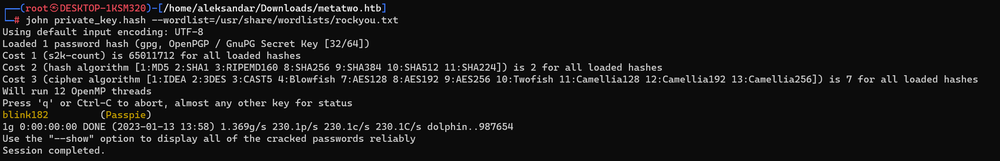

Now i was poking aroung but seems that you can't get password in clear text that easy. 
https://passpie.readthedocs.io/en/latest/configuration.html

Checking it's configuration seems like db is under /tmp/tmpFejLcp:
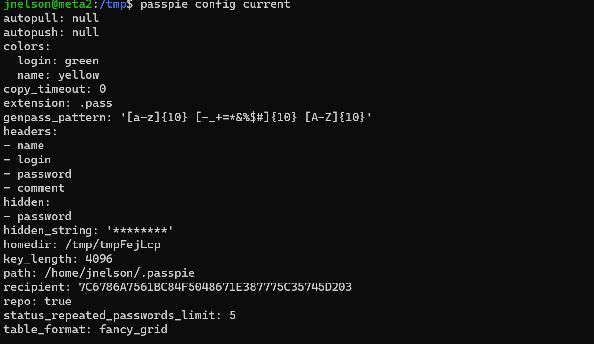

Okay  it was easier that i thought:
https://passpie.readthedocs.io/en/latest/getting_started.html?highlight=export#exporting-credentials

Basically now that we have the masterpassword we could export the db and get all the password in cleartext:
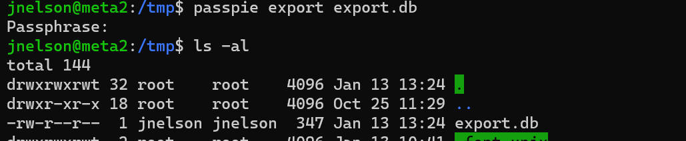

And now we can read all the passwords in cleartext:
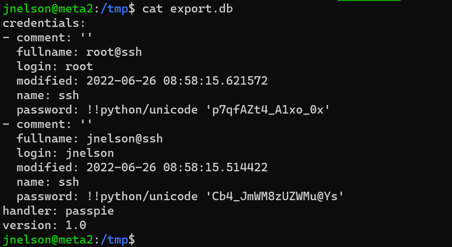

And ssh to grab last flag:
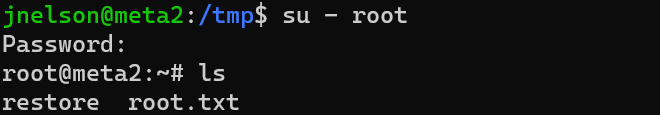

