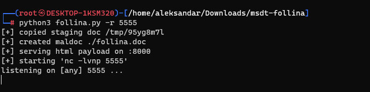
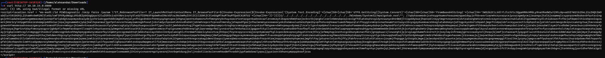
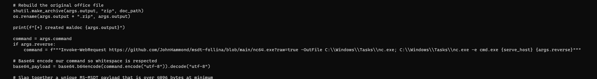
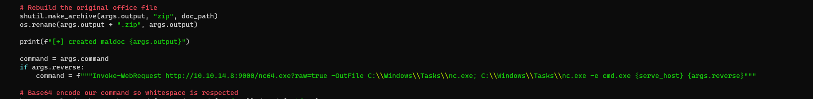
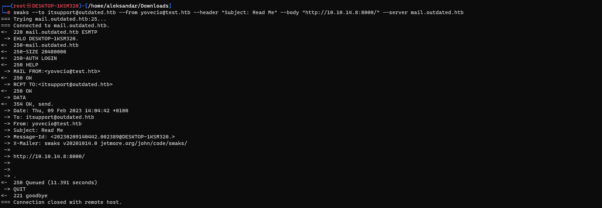
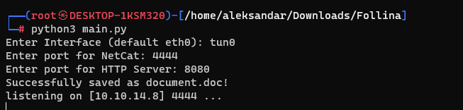

So far all the other enumeration didn't gave us something so let's see what can we find?
`┌──(root㉿DESKTOP-1KSM320)-[/home/aleksandar/Downloads]
└─# nmap -p25 --script smtp-commands 10.10.11.175
Starting Nmap 7.93 ( https://nmap.org ) at 2023-02-09 12:31 CET
Nmap scan report for outdated (10.10.11.175)
Host is up (0.034s latency).
PORT   STATE SERVICE
25/tcp open  smtp
| smtp-commands: mail.outdated.htb, SIZE 20480000, AUTH LOGIN, HELP
|_ 211 DATA HELO EHLO MAIL NOOP QUIT RCPT RSET SAML TURN VRFY
Nmap done: 1 IP address (1 host up) scanned in 0.66 seconds`

Now here I had to check for tips and apparently from the forum the key is to use one of the exploits from the PDF download from the SHARE smb, more specifically the first one(aka Follina).
I will use this one since it seems realiable: https://github.com/JohnHammond/msdt-follina
This will generate a malicious docx that will stage a HTTP server with a html payload. Sending the link of our payload via smtp email to itsupport@outdated.htb will trigger a RCE.

* * *
## Exploit
Now lauching the exploit from Github:

Will create a malicious doc file that will download and run nc64.exe to our IP listening on port 5555. Payload is server thru port 8000 which means we should send a email to click this link: http://ATTACKERS_IP:8000/

To support our theory i will try to see if the file gets served:

it works, nice!! Now let's use this: https://book.hacktricks.xyz/network-services-pentesting/pentesting-smtp#sending-an-email-from-linux-console

`swaks --to itsupport@outdated.htb --from test@outdated.htb --header "Subject: Read Me" --body "please click here http://10.10.14.8:8000/" --server 10.10.11.175`

This code should send a smtp email from a fake mail to itsupport with "Read Me" as subject and a href url to our malicious html payload to be clicked, doing so should trigger the RCE.
Edit: it's not working out of the box, and the reason is in the Python script, more specifically here..

The script tried to get nc64.exe from the Guthub repository and HTB machines have no access to web, which means we need to serve the file in another http server and then modify our python script to get it elsewhere...

Sending the email with our URL, asfter several tries i found that we shouldn't use outdated.htb as domain of our mail but something other:

Edit: I tried on and on and i get no RCE, so let's try to use another exploit instead... Let's try this instead:
https://github.com/CyberTitus/Follina

So creating the script:

Checking the payload... Edit: this is same as Harris script, let's try other ones...
Let's try this instead: https://github.com/Hrishikesh7665/Follina_Exploiter_CLI

* * *

