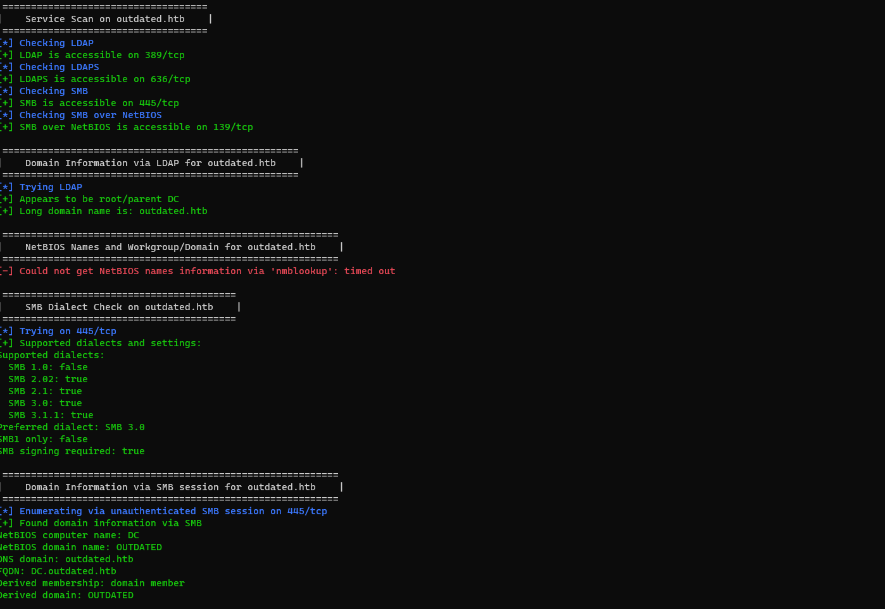
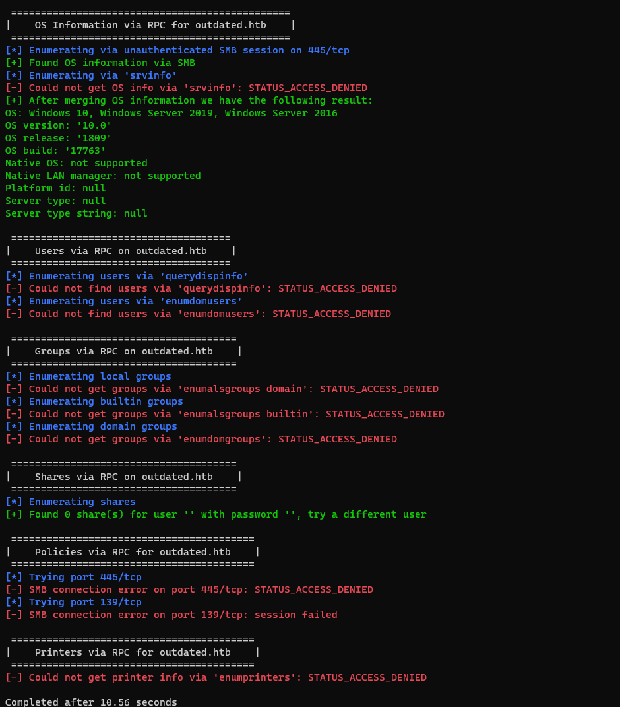
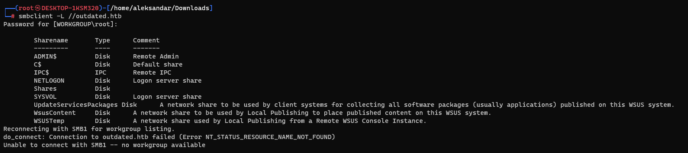
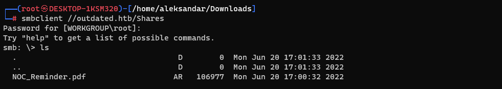
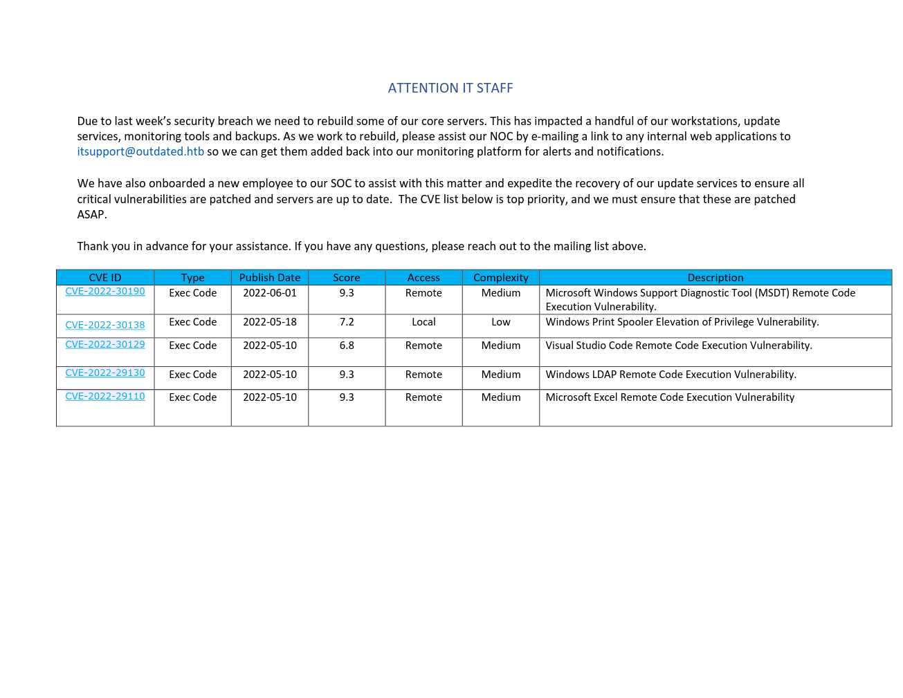

We know we have SMB and RPC so let's try to check what can we grab as informations from those services with Enum4linux:

And seems like we can't enumerate the service with a guest user nor with a random one, we may have to come back when we have some credentials later.

I tried manually to list for SMB shares but again, we can't do much more without a credentials..

The only map that's is working is Shares:

Opening the pdf file shows us a possible username and possible CVEs?
