## RUSTSCAN:
`PORT     STATE SERVICE REASON         VERSION
22/tcp   open  ssh     syn-ack ttl 63 OpenSSH 8.4p1 Debian 5+deb11u1 (protocol 2.0)
| ssh-hostkey:
|   3072 db1d5c65729bc64330a52ba0f01ad5fc (RSA)
| ssh-rsa AAAAB3NzaC1yc2EAAAADAQABAAABgQDMui8XsKyVnrUBcuXeZU88nULgmdJ08nPvDUTXgwL2A1dtQy2YKhqzg4HVQkI8nceWJbCJ/3wKd5PiVeA8L8uBU3DhRpjIMfK3A08aXPtSXpN/lM5GlZztC1AroPGfB8tDce158l5p8vNYkv6my2qxa8CBhiLjO5F2HBVwWY1jHZBPdkigzYKzscvqpbHBk/T4dG64OCEmm79DH01Hq8SA95xLln1xxwuPhQ68s+exCSTB/f/taLnzHoT2qh5wAoWqF912JUMKn1Ojvv5SpJDFNUNBAFgaLHf20GQpO8UxYqw/ZFZfHhKPf7Rz3bhhoKv/ZL0xYN4MleEFxFpej05oADTpHfrABzbkX2C0w6KmzNZIsZaxx1kO9DIDeQprRErTdXKXZD6Ym9CZ1cAPbilwMS945UvZigCLHhFri0iLhoYpdEFBX4kKraqTvxncUQNHibA1Y3rnavpB9XVd/Pdkd5PevNy2UEK253S+Mx/dr4VWB94xwx7C3QCjAQXE5V8=
|   256 4f7956c5bf20f9f14b9238edcefaac78 (ECDSA)
| ecdsa-sha2-nistp256 AAAAE2VjZHNhLXNoYTItbmlzdHAyNTYAAAAIbmlzdHAyNTYAAABBBElwFQd0JPcl/MeO0FRD3rz9Fic4TamcO+q2eUjp2HIDCf6HEE+saKGVUmnue904NvlnyyhJJCAZ3MV3yEJnhds=
|   256 df47554f4ad178a89dcdf8a02fc0fca9 (ED25519)
|_ssh-ed25519 AAAAC3NzaC1lZDI1NTE5AAAAIDnd0IxAYF7SPECTCC3VhgzZJa4ZUpSQ/6DYR6fXIXRz
80/tcp   open  http    syn-ack ttl 63 Apache httpd 2.4.54 ((Debian))
|_http-trane-info: Problem with XML parsing of /evox/about
| http-methods:
|_  Supported Methods: GET HEAD POST OPTIONS
|_http-favicon: Unknown favicon MD5: C797F0B9A0242854B3C20DEC6614399C
| http-cookie-flags:
|   /:
|     PHPSESSID:
|_      httponly flag not set
|_http-server-header: Apache/2.4.54 (Debian)
|_http-title: Home
6379/tcp open  redis   syn-ack ttl 63 Redis key-value store
Warning: OSScan results may be unreliable because we could not find at least 1 open and 1 closed port
OS fingerprint not ideal because: Missing a closed TCP port so results incomplete`
* * *
## REDIS:
Seems like auth is needed:
`┌──(root㉿DESKTOP-1KSM320)-[/home/aleksandar/Downloads]
└─# redis-cli -h pollution
pollution:6379> info
NOAUTH Authentication required.`
* * *
## HTTP:
Possible subdomains:
`forum                   [Status: 200, Size: 14098, Words: 910, Lines: 337, Duration: 98ms]
developers              [Status: 401, Size: 469, Words: 42, Lines: 15, Duration: 94ms]`

Checking website mainpage emerges that the real FQDN is:
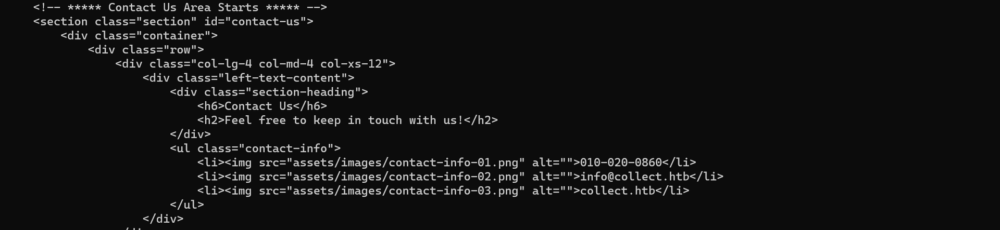
* * *
## Collect.htb:
So far nothing interesting from source code. We can signup with a dummy user:

And then loggin into website we can see something about a API:

Nothing interesting came out of main website scanned as a guest:
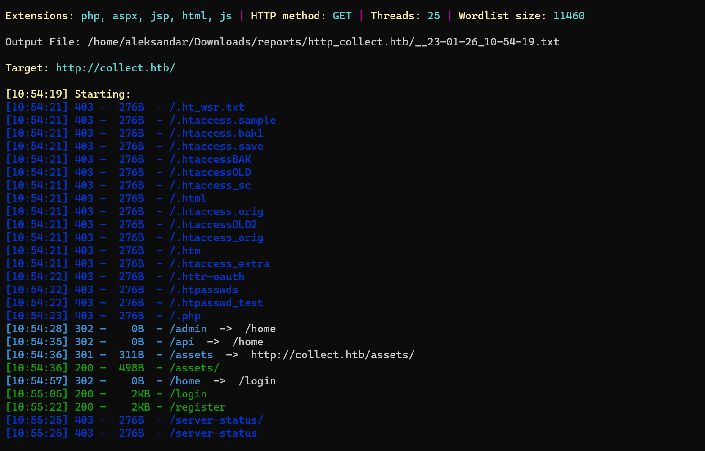
* * *
## Forum.collect.htb
Seems like there is a login and our dummy user is not working.. Seems like we can find something about a webdirectory?
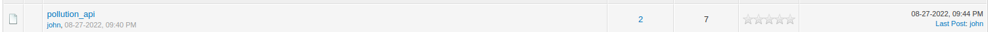
 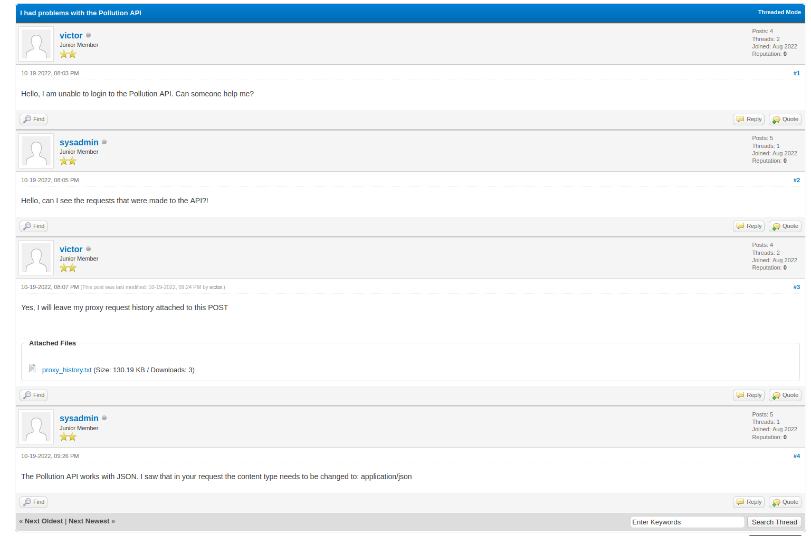
 
 We can download a proxy history about those api.., but first we need to create again a dummy user.
 Forum user list:
 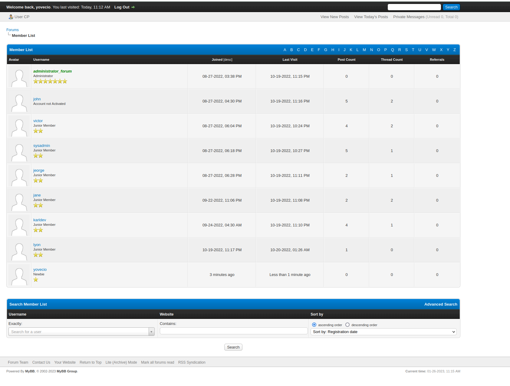
 
 Checking the burpsuite report from victor we can find the URL to the API and a base64 request that need to be decoded:
 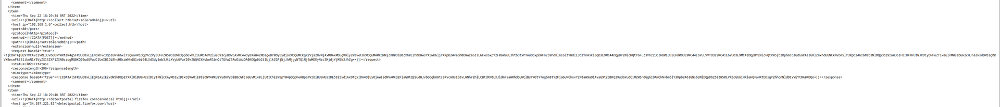
 
 Decoded request:
 `POST /set/role/admin HTTP/1.1
Host: collect.htb
User-Agent: Mozilla/5.0 (Windows NT 10.0; Win64; x64; rv:104.0) Gecko/20100101 Firefox/104.0
Accept: text/html,application/xhtml+xml,application/xml;q=0.9,image/avif,image/webp,*/*;q=0.8
Accept-Language: pt-BR,pt;q=0.8,en-US;q=0.5,en;q=0.3
Accept-Encoding: gzip, deflate
Connection: close
Cookie: PHPSESSID=r8qne20hig1k3li6prgk91t33j
Upgrade-Insecure-Requests: 1
Content-Type: application/x-www-form-urlencoded
Content-Length: 38

token=ddac62a28254561001277727cb397baf`

Can we use that token to set our user(with our cookie) to use victors token?
* * *
## Developers.collect.htb
Seems like we need a user, so nothhing here...
* * *
## Collect.htb(API):
Now having the lgos from victors account we can recycle the code but use insted of his cookie the one fro our user(mine is yovecio, Cookie: PHPSESSID=v5erv4tlftbt8g49b59qkd38p5) and sending the request will convert our user to Admin?
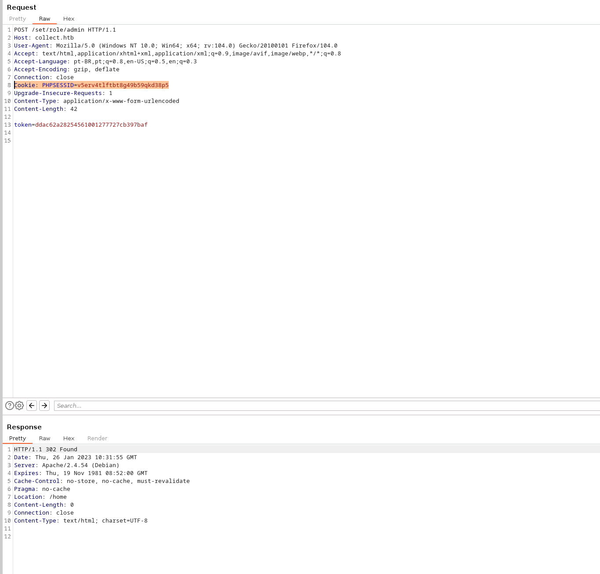
We got a 302 found so maybe it worked?

Now we know we found a webdirectory from first Dirscan on mainwebsite called /admin:
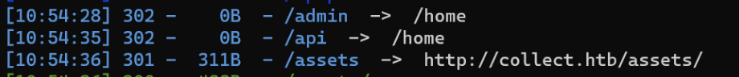

When i tried first time as yovecio, wasn't working, but does it work now?

After our token impersonation we can see that we are admin on the portal..
Shall we try to register a user in the API?

As we see:
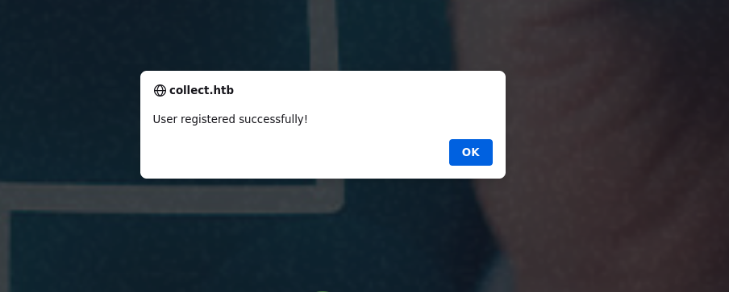
From burp this is a XML request:
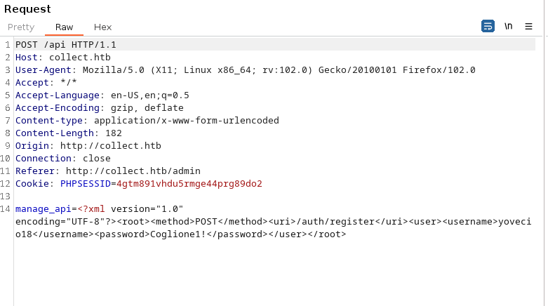
Analyzing what we got, we gained access to /admin portal by forging token from Victors account and by passing it to api that make a user admin we elevated our user to Administrator. Then we gained access to /admin portal in order to be able to add users to the API.
Fetching the request we can see that request are sent to manage_api in XML format, anmd we can see that api answers with something:
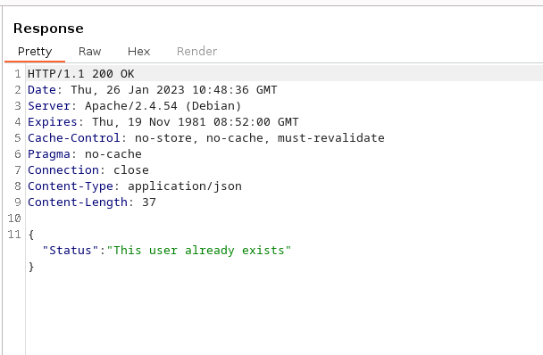

Now we need to see if is XXE exploitable?
Here i had to check for tips since this is a bit out of my scope and apparently XXE is explotable by doing this:
https://book.hacktricks.xyz/pentesting-web/xxe-xee-xml-external-entity#blind-ssrf-exfiltrate-data-out-of-band

Which means we need to create a malicious.dtd(BTW the key to make it work was to use base64 encoding to bypass any filter):
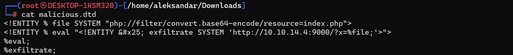

Setup a python http server to serve the dtd file.
And then send the payload in the Burpsuite
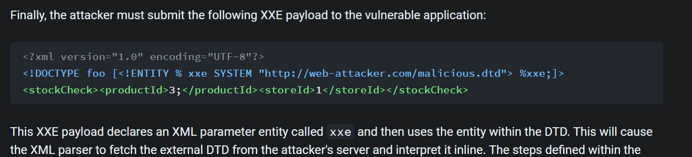
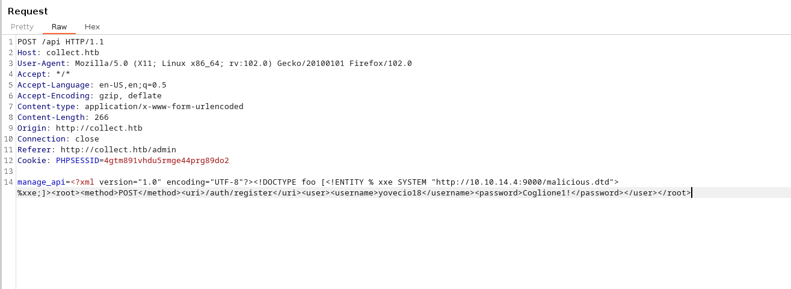

This will give you back a BASE64 encoded result in the python server:
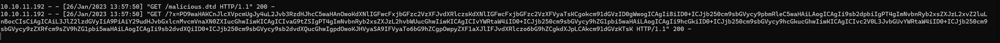

Now checking the file bootstrap.php gives us redis password:
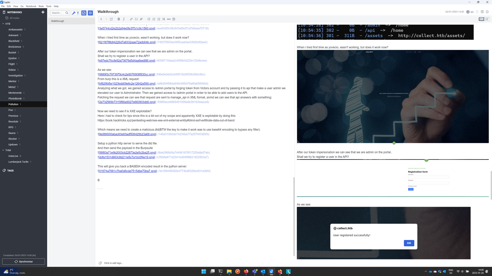
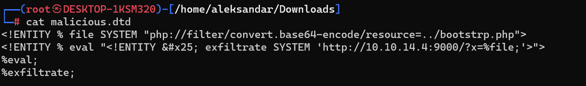

`<?php
ini_set('session.save_handler','redis');
ini_set('session.save_path','tcp://127.0.0.1:6379/?auth=');
session_start();
require '../vendor/autoload.php';
=<?php
require '../bootstrap.php';
use app\classes\Routes;
use app\classes\Uri;
$routes = [
    "/" => "controllers/index.php",
    "/login" => "controllers/login.php",
    "/register" => "controllers/register.php",
    "/home" => "controllers/home.php",
    "/admin" => "controllers/admin.php",
    "/api" => "controllers/api.php",
    "/set/role/admin" => "controllers/set_role_admin.php",
    "/logout" => "controllers/logout.php"
];
$uri = Uri::load();
require Routes::load($uri, $routes);
`

* * *