## Rustscan
`PORT   STATE SERVICE REASON         VERSION
22/tcp open  ssh     syn-ack ttl 63 OpenSSH 8.4p1 Debian 5+deb11u1 (protocol 2.0)
| ssh-hostkey:
|   3072 845e13a8e31e20661d235550f63047d2 (RSA)
| ssh-rsa AAAAB3NzaC1yc2EAAAADAQABAAABgQDEAPxqUubE88njHItE+mjeWJXOLu5reIBmQHCYh2ETYO5zatgel+LjcYdgaa4KLFyw8CfDbRL9swlmGTaf4iUbao4jD73HV9/Vrnby7zP04OH3U/wVbAKbPJrjnva/czuuV6uNz4SVA3qk0bp6wOrxQFzCn5OvY3FTcceH1jrjrJmUKpGZJBZZO6cp0HkZWs/eQi8F7anVoMDKiiuP0VX28q/yR1AFB4vR5ej8iV/X73z3GOs3ZckQMhOiBmu1FF77c7VW1zqln480/AbvHJDULtRdZ5xrYH1nFynnPi6+VU/PIfVMpHbYu7t0mEFeI5HxMPNUvtYRRDC14jEtH6RpZxd7PhwYiBctiybZbonM5UP0lP85OuMMPcSMll65+8hzMMY2aejjHTYqgzd7M6HxcEMrJW7n7s5eCJqMoUXkL8RSBEQSmMUV8iWzHW0XkVUfYT5Ko6Xsnb+DiiLvFNUlFwO6hWz2WG8rlZ3voQ/gv8BLVCU1ziaVGerd61PODck=
|   256 a2ef7b9665ce4161c467ee4e96c7c892 (ECDSA)
| ecdsa-sha2-nistp256 AAAAE2VjZHNhLXNoYTItbmlzdHAyNTYAAAAIbmlzdHAyNTYAAABBBFScv6lLa14Uczimjt1W7qyH6OvXIyJGrznL1JXzgVFdABwi/oWWxUzEvwP5OMki1SW9QKX7kKVznWgFNOp815Y=
|   256 33053dcd7ab798458239e7ae3c91a658 (ED25519)
|_ssh-ed25519 AAAAC3NzaC1lZDI1NTE5AAAAIH+JGiTFGOgn/iJUoLhZeybUvKeADIlm0fHnP/oZ66Qb
80/tcp open  http    syn-ack ttl 63 nginx 1.18.0
|_http-title: Did not follow redirect to http://precious.htb/
|_http-server-header: nginx/1.18.0
| http-methods:
|_  Supported Methods: GET HEAD POST OPTIONS`
* * *
## HTTP
No subdomains have been found so far:
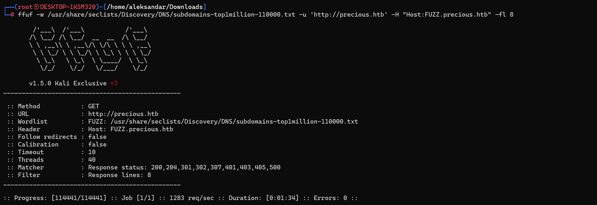

No extra Webdirectories have been discovered so far:
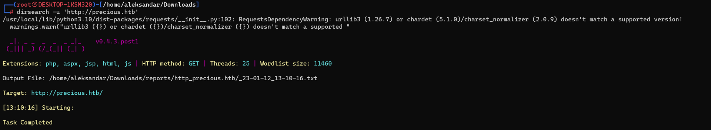

Loggin into main website we are presented with a form that apparently fetch URL and convert them into a pdf, let's see on the magnifier what can we grab more with Burpsuite.
To test the url fetch we need to setup a dummy html page in our machine served by http.server module on python:
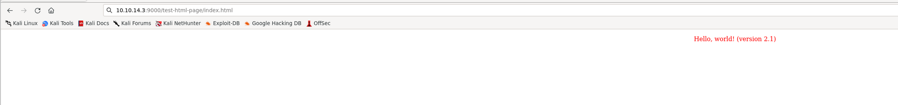

Giving the full URL to the page a pdf is generated:
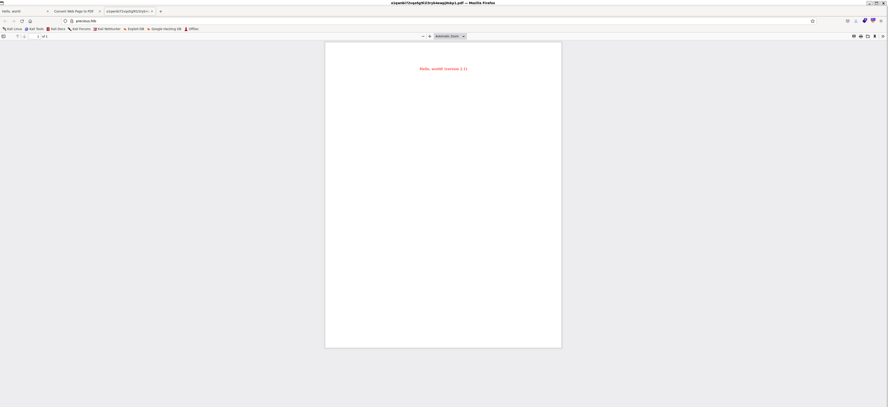

Downloading the pdf and checking it with exiftool we got something important in the creator field:
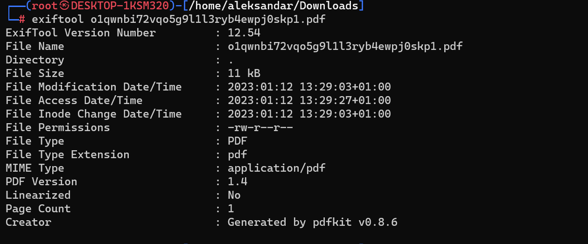

* * *
## REVSHELL
Knowing the plugin used to generate pdfs we can use this as leverage point to our first shell: https://github.com/CyberArchitect1/CVE-2022-25765-pdfkit-Exploit-Reverse-Shell
Setting up a listener and we have everithing ready to invoke our shell:
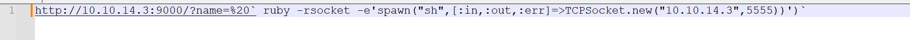

And baam we have a shell:
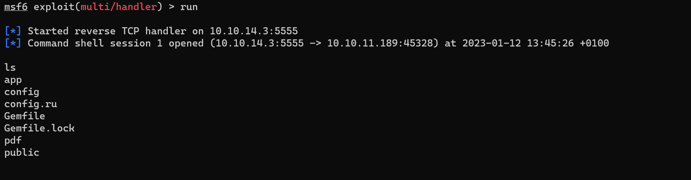
OBS: the code on the website is missing a apostrofe as closing url query otherwise it will not work.

* * *
## SSH as Henry
As soon we get the shell we are presented as ruby user, scrolling thru all the folders seems like user flag is in henry's home and of course we can't read it.
I decided to list all files(included the hidden ones) and found something interesting in .bundle:
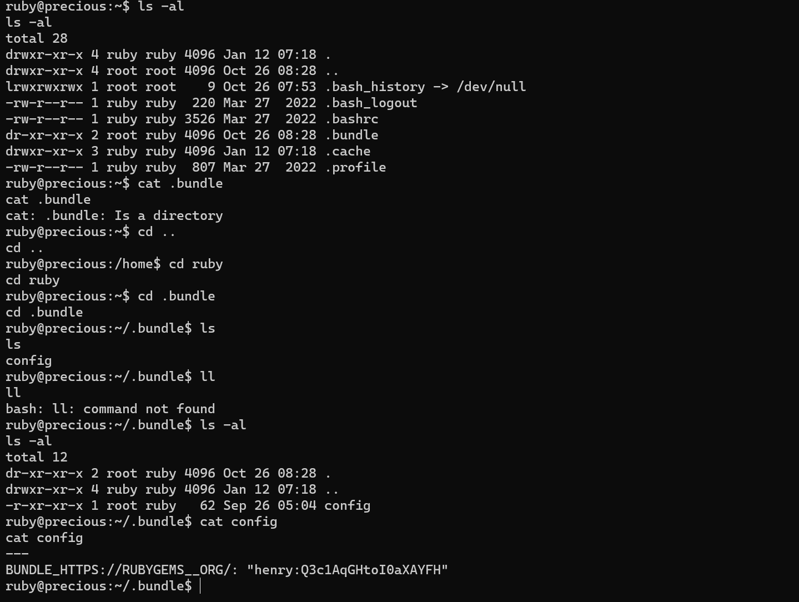

Now that we have henry's password we can ssh and grab out first flag:
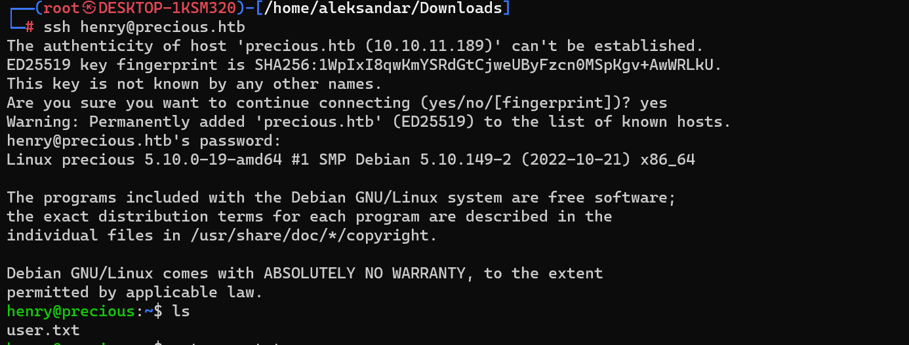
* * *
## PRIVESC
Now comes the fun part, we want to escalate our way up to Root so starting with some standarr manual enumeration we get that henry can run ruby as sudo:
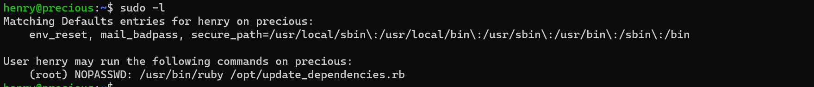

let's check if we have write permissions on that file in /opt:
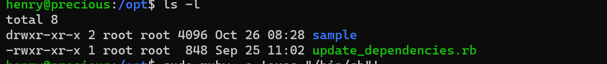

We dont't but let's check source code and see what can we do more:
`henry@precious:/opt$ cat update_dependencies.rb
# Compare installed dependencies with those specified in "dependencies.yml"
require "yaml"
require 'rubygems'

# TODO: update versions automatically
def update_gems()
end

def list_from_file
    YAML.load(File.read("dependencies.yml"))
end

def list_local_gems
    Gem::Specification.sort_by{ |g| [g.name.downcase, g.version] }.map{|g| [g.name, g.version.to_s]}
end

gems_file = list_from_file
gems_local = list_local_gems

gems_file.each do |file_name, file_version|
    gems_local.each do |local_name, local_version|
        if(file_name == local_name)
            if(file_version != local_version)
                puts "Installed version differs from the one specified in file: " + local_name
            else
                puts "Installed version is equals to the one specified in file: " + local_name
            end
        end
    end
end`

In the source code is defined a file called dependecies.yml that is nowhere in the map, we may create that with a malicious ruby revershe shell instead:
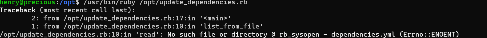

Running the application show us exactly that the file is missing cause it's not using absolute paths we can definitely exploit this.
We don't have write permissions in /opt:
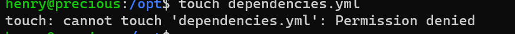

We need to plant this file in /tmp and then add folder to path so it will be loaded from there instead. So adding our shell in ruby:
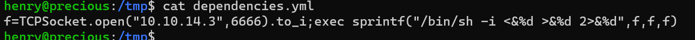
Adding /tmp into $PATH:
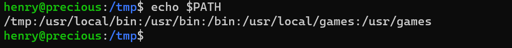

Edit: seems like /tmp gets deleted after a minute or so..
Here i had to check for tips since i was not able to get a revshell to work and apparently i was not on the right track, the solution is callled ruby yaml deserialization: https://blog.stratumsecurity.com/2021/06/09/blind-remote-code-execution-through-yaml-deserialization/
Using this code we will be able to spawn a shell(snippet taken from the article and edited to match our IP):
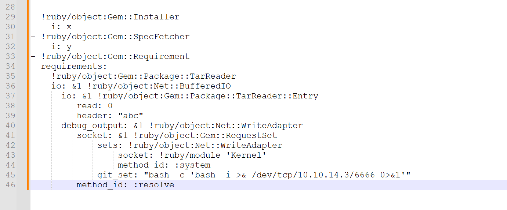

And we have our last flag:
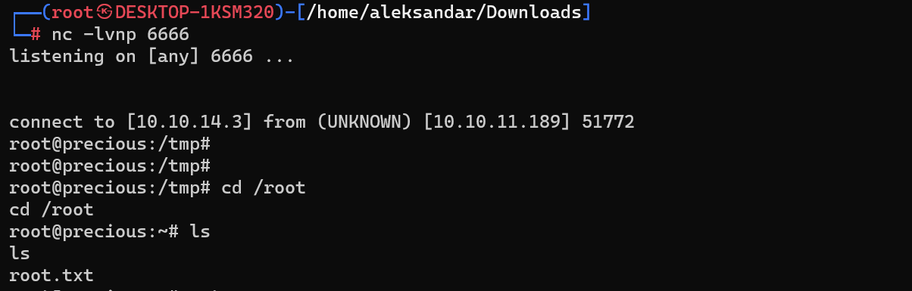

Here we could get more about it: https://github.com/swisskyrepo/PayloadsAllTheThings/blob/master/Insecure%20Deserialization/Ruby.md#yamlload

* * *