## RUSTSCAN:
`PORT      STATE SERVICE       REASON          VERSION
21/tcp    open  ftp           syn-ack ttl 127 Microsoft ftpd
| ftp-syst:
|_  SYST: Windows_NT
|_ftp-anon: Anonymous FTP login allowed (FTP code 230)
80/tcp    open  http          syn-ack ttl 127 Microsoft HTTPAPI httpd 2.0 (SSDP/UPnP)
|_http-title: Home - Acme Widgets
| http-methods:
|_  Supported Methods: GET HEAD POST OPTIONS
111/tcp   open  rpcbind       syn-ack ttl 127 2-4 (RPC #100000)
| rpcinfo:
|   program version    port/proto  service
|   100000  2,3,4        111/tcp   rpcbind
|   100000  2,3,4        111/tcp6  rpcbind
|   100000  2,3,4        111/udp   rpcbind
|   100000  2,3,4        111/udp6  rpcbind
|   100003  2,3         2049/udp   nfs
|   100003  2,3         2049/udp6  nfs
|   100003  2,3,4       2049/tcp   nfs
|   100003  2,3,4       2049/tcp6  nfs
|   100005  1,2,3       2049/tcp   mountd
|   100005  1,2,3       2049/tcp6  mountd
|   100005  1,2,3       2049/udp   mountd
|   100005  1,2,3       2049/udp6  mountd
|   100021  1,2,3,4     2049/tcp   nlockmgr
|   100021  1,2,3,4     2049/tcp6  nlockmgr
|   100021  1,2,3,4     2049/udp   nlockmgr
|   100021  1,2,3,4     2049/udp6  nlockmgr
|   100024  1           2049/tcp   status
|   100024  1           2049/tcp6  status
|   100024  1           2049/udp   status
|_  100024  1           2049/udp6  status
135/tcp   open  msrpc         syn-ack ttl 127 Microsoft Windows RPC
139/tcp   open  netbios-ssn   syn-ack ttl 127 Microsoft Windows netbios-ssn
445/tcp   open  microsoft-ds? syn-ack ttl 127
2049/tcp  open  mountd        syn-ack ttl 127 1-3 (RPC #100005)
5985/tcp  open  http          syn-ack ttl 127 Microsoft HTTPAPI httpd 2.0 (SSDP/UPnP)
|_http-server-header: Microsoft-HTTPAPI/2.0
|_http-title: Not Found
47001/tcp open  http          syn-ack ttl 127 Microsoft HTTPAPI httpd 2.0 (SSDP/UPnP)
|_http-title: Not Found
|_http-server-header: Microsoft-HTTPAPI/2.0
49664/tcp open  msrpc         syn-ack ttl 127 Microsoft Windows RPC
49665/tcp open  msrpc         syn-ack ttl 127 Microsoft Windows RPC
49666/tcp open  msrpc         syn-ack ttl 127 Microsoft Windows RPC
49667/tcp open  msrpc         syn-ack ttl 127 Microsoft Windows RPC
49678/tcp open  msrpc         syn-ack ttl 127 Microsoft Windows RPC
49679/tcp open  msrpc         syn-ack ttl 127 Microsoft Windows RPC
49680/tcp open  msrpc         syn-ack ttl 127 Microsoft Windows RPC`
* * *
## FTP:
Seems like anonymous login is allowed, let's see what can we get:
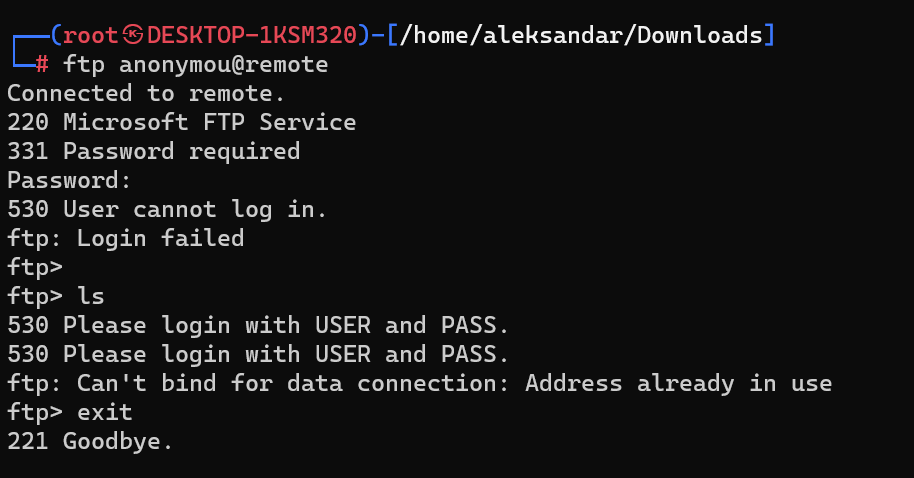

Seems like it's not really true?
* * *
## SMB:
` =========================================================
|    NetBIOS Names and Workgroup/Domain for remote.htb    |
 =========================================================
[-] Could not get NetBIOS names information via nmblookup: timed out
 =======================================
|    SMB Dialect Check on remote.htb    |
 =======================================
[*] Trying on 445/tcp
[+] Supported dialects and settings:
Supported dialects:
  SMB 1.0: false
  SMB 2.02: true
  SMB 2.1: true
  SMB 3.0: true
  SMB 3.1.1: true
Preferred dialect: SMB 3.0
SMB1 only: false
SMB signing required: false
 =========================================================
|    Domain Information via SMB session for remote.htb    |
 =========================================================
[*] Enumerating via unauthenticated SMB session on 445/tcp
[+] Found domain information via SMB
NetBIOS computer name: REMOTE
NetBIOS domain name: 
DNS domain: remote
FQDN: remote
Derived membership: workgroup member
Derived domain: unknown
[!] Aborting remainder of tests since sessions failed, rerun with valid credentials
`
* * *
## NFS:
Seems like there is a share on NFS:
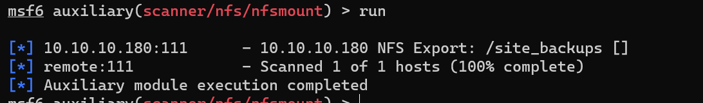
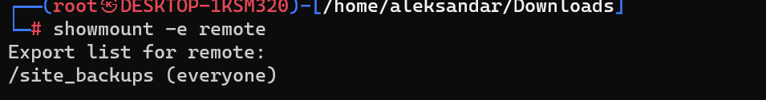

Let's try to mount it:
`┌──(root㉿DESKTOP-1KSM320)-[/home/aleksandar/Downloads]
└─# mount -t nfs remote:site_backups remote.htb/ -o nolock`

And we can get website config:
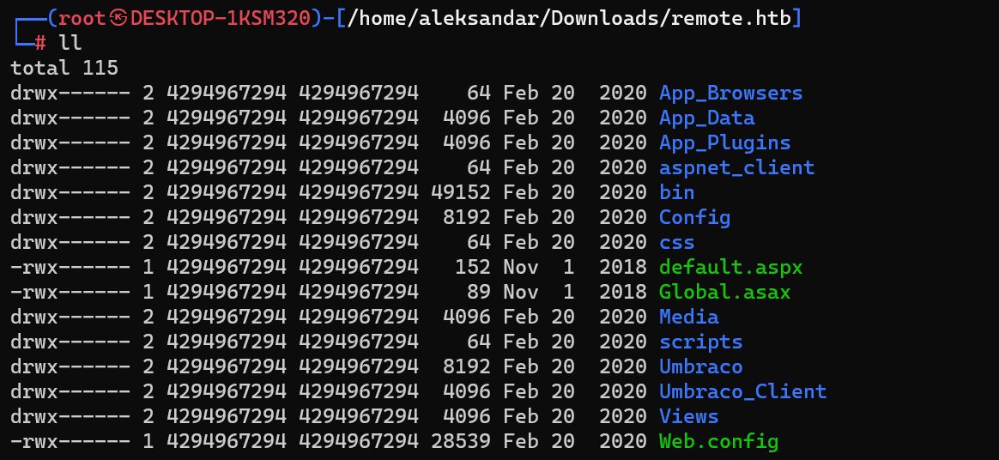

Seems like we don't have write permissions(tought to upload a aspx revshel).
We must see if we can grab any password from Website backup files later.

Running a tree on the folders something may be interesting?
`
│   ├── Logs
│   │   ├── UmbracoTraceLog.intranet.txt
│   │   ├── UmbracoTraceLog.intranet.txt.2020-02-19
│   │   └── UmbracoTraceLog.remote.txt
`

Now reading the logs we get the Umbraco Version:
`┌──(aleksandar㉿DESKTOP-1KSM320)-[~/Downloads/remote.htb/App_Data/Logs]
└─$ cat  UmbracoTraceLog.remote.txt
2020-02-20 02:36:39,294 [P4392/D2/T1] INFO  Umbraco.Core.CoreBootManager - Umbraco 7.12.4 application starting on REMOTE
 2020-02-20 02:36:39,576 [P4392/D2/T1] INFO  Umbraco.Core.PluginManager - Determining hash of code files on disk
 2020-02-20 02:36:39,701 [P4392/D2/T1] INFO  Umbraco.Core.PluginManager - Hash determined (took 119ms)`
 
 And a username(UmbracoTraceLog.intranet.txt.2020-02-19):
 ` 2020-02-20 00:14:42,175 [P4408/D20/T42] INFO  Umbraco.Web.Editors.AuthenticationController - User admin@htb.local from IP address 192.168.195.1 has logged out
 2020-02-20 00:14:57,412 [P4408/D19/T37] INFO  Umbraco.Core.UmbracoApplicationBase - Application shutdown. Details: ConfigurationChange`
 
 And even password(UmbracoTraceLog.intranet.txt.2020-02-19)? 
 ` 2020-02-20 00:21:36,660 [P4408/D20/T37] INFO  Umbraco.Core.Security.BackOfficeSignInManager - Event Id: 0, state: Login attempt failed for username Umbracoadmin123!! from IP address 192.168.195.1
 2020-02-20 00:21:42,642 [P4408/D20/T16] INFO  Umbraco.Core.Security.BackOfficeSignInManager - Event Id: 0, state: Login attempt succeeded for username admin@htb.local from IP address 192.168.195.1
 2020-02-20 00:21:42,642 [P4408/D20/T16] INFO  Umbraco.Core.Security.BackOfficeSignInManager - Event Id: 0, state: User: admin@htb.local logged in from IP address 192.168.195.1`
 
 And another user(UmbracoTraceLog.intranet.txt.2020-02-19):
 ` 2020-02-20 00:39:00,708 [P5428/D2/T14] INFO  Umbraco.Core.Security.BackOfficeSignInManager - Event Id: 0, state: Login attempt succeeded for username ssmith@htb.local from IP address 192.168.195.1
 2020-02-20 00:39:00,708 [P5428/D2/T14] INFO  Umbraco.Core.Security.BackOfficeSignInManager - Event Id: 0, state: User: ssmith@htb.local logged in from IP address 192.168.195.1`
 
 Could have been filtered by:
 `┌──(aleksandar㉿DESKTOP-1KSM320)-[~/Downloads/remote.htb/App_Data/Logs]
└─$ cat UmbracoTraceLog.intranet.txt | grep failed
 2020-02-20 00:21:36,660 [P4408/D20/T37] INFO  Umbraco.Core.Security.BackOfficeSignInManager - Event Id: 0, state: Login attempt failed for username Umbracoadmin123!! from IP address 192.168.195.1
 2020-02-20 00:27:31,767 [P4408/D20/T45] INFO  Umbraco.Core.Security.BackOfficeSignInManager - Event Id: 0, state: Login attempt failed for username ssmith@htb.local from IP address 192.168.195.1
 2020-02-20 00:27:38,043 [P4408/D20/T41] INFO  Umbraco.Core.Security.BackOfficeSignInManager - Event Id: 0, state: Login attempt failed for username ssmith@htb.local from IP address 192.168.195.1
 2020-02-20 00:28:28,366 [P4408/D20/T6] INFO  Umbraco.Core.Security.BackOfficeSignInManager - Event Id: 0, state: Login attempt failed for username ssmith from IP address 192.168.195.1
 2020-02-20 00:28:38,020 [P4408/D20/T16] INFO  Umbraco.Core.Security.BackOfficeSignInManager - Event Id: 0, state: Login attempt failed for username ssmith from IP address 192.168.195.1
 2020-02-20 00:28:40,785 [P4408/D20/T39] INFO  Umbraco.Core.Security.BackOfficeSignInManager - Event Id: 0, state: Login attempt failed for username ssmith from IP address 192.168.195.1
 2020-02-20 00:28:43,644 [P4408/D20/T45] INFO  Umbraco.Core.Security.BackOfficeSignInManager - Event Id: 0, state: Login attempt failed for username ssmith@htb.local from IP address 192.168.195.1
 2020-02-20 00:29:36,233 [P4408/D20/T11] INFO  Umbraco.Core.Security.BackOfficeSignInManager - Event Id: 0, state: Login attempt failed for username ssmith from IP address 192.168.195.1
 2020-02-20 00:29:39,250 [P4408/D20/T39] INFO  Umbraco.Core.Security.BackOfficeSignInManager - Event Id: 0, state: Login attempt failed for username ssmith@htb.local from IP address 192.168.195.1
 2020-02-20 00:29:45,006 [P4408/D20/T43] INFO  Umbraco.Core.Security.BackOfficeSignInManager - Event Id: 0, state: Login attempt failed for username ssmith@htb.local from IP address 192.168.195.1
 2020-02-20 00:29:52,714 [P4408/D20/T16] INFO  Umbraco.Core.Security.BackOfficeSignInManager - Event Id: 0, state: Login attempt failed for username smith from IP address 192.168.195.1
 2020-02-20 00:32:24,323 [P4408/D20/T11] INFO  Umbraco.Core.Security.BackOfficeSignInManager - Event Id: 0, state: Login attempt failed for username ssmith@htb.local from IP address 192.168.195.137
 2020-02-20 00:32:55,906 [P4408/D20/T41] INFO  Umbraco.Core.Security.BackOfficeSignInManager - Event Id: 0, state: Login attempt failed for username ssmith from IP address 192.168.195.1
 2020-02-20 00:32:58,686 [P4408/D20/T37] INFO  Umbraco.Core.Security.BackOfficeSignInManager - Event Id: 0, state: Login attempt failed for username smith from IP address 192.168.195.1
 2020-02-20 00:33:02,607 [P4408/D20/T41] INFO  Umbraco.Core.Security.BackOfficeSignInManager - Event Id: 0, state: Login attempt failed for username ssmith@htb.local from IP address 192.168.195.1
 2020-02-20 00:33:08,136 [P4408/D20/T43] INFO  Umbraco.Core.Security.BackOfficeSignInManager - Event Id: 0, state: Login attempt failed for username smith@htb.local from IP address 192.168.195.1
 2020-02-20 00:38:56,821 [P5428/D2/T14] INFO  Umbraco.Core.Security.BackOfficeSignInManager - Event Id: 0, state: Login attempt failed for username ssmith from IP address 192.168.195.1
 2020-02-20 00:54:41,051 [P3592/D2/T20] INFO  Umbraco.Core.Security.BackOfficeSignInManager - Event Id: 0, state: Login attempt failed for username admin@htb.local from IP address 192.168.195.1`

* * *
## HTTP:
Surfin to the website we can see actual users?

Running a FUFF didn't gave any other subdomains:
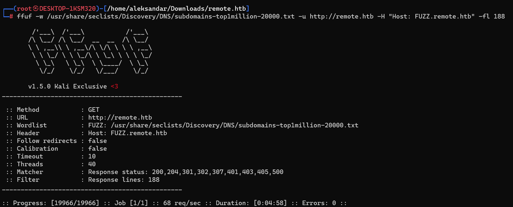

Checking website locally seems like we have a umbraco istance under http://remote.htb/umbraco

* * *
## Exploit:
I was thinking that loggin in with user and password from log was possible but seems like it's a big rabbit hole!
Seems like the only interesting file here is this(last one):
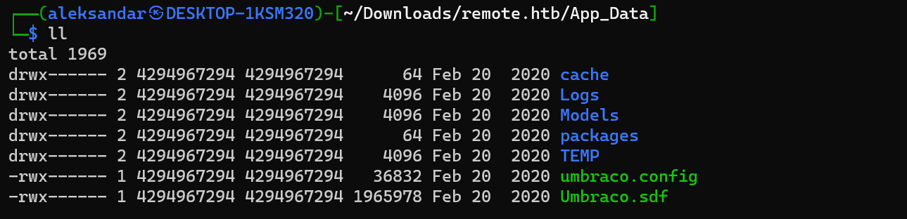

That's a MSSQL Compact file and may have pasword hashes of accounts:
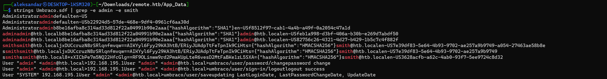

Now we can save Admins SHA-1 hash and try to bruteforce it:
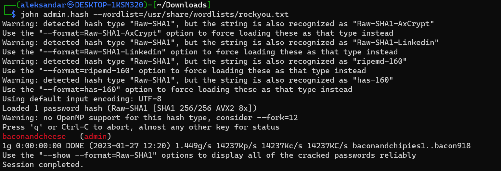

Now that we know the Umbraco version is 7.12.4 and we have Admin credentials we can exploit it and get a RCE:
https://github.com/noraj/Umbraco-RCE

Trying a example commando gives us a response:
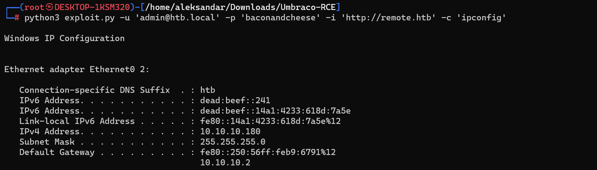

Now that we know that exploit works we can move forward with a PS revshell:
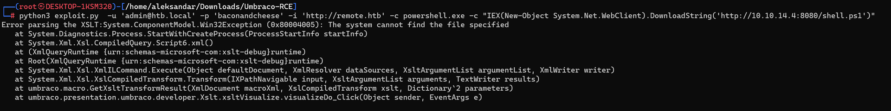
After several tries seems like a ps1 revshell is not working so we may use nc.exe or upload a revshel.exe istead:

Let's create a Temp folder in C disk and download out meterpeter shell as exe:
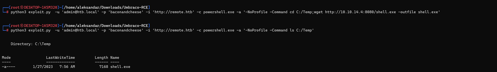

Now running the file should invoke a shell:
''
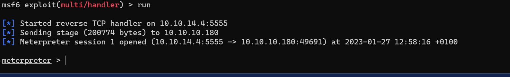

We can find user.txt:
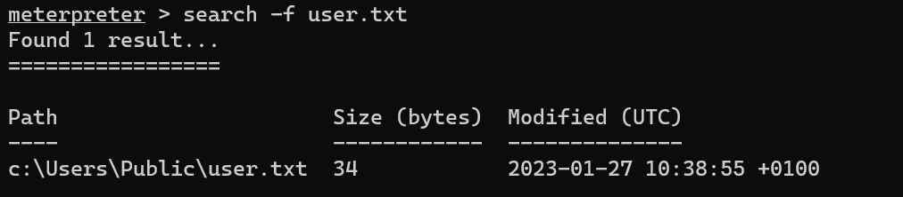
* * *
## Privesc
Now that we got the user.txt we want to grab root.txt that is in Administrator folder.
Which mean we have to escalate from IIS_Pool -> Administrator, and checkin the TAGS we know that is about Teamviwer...
I tried to migrate process but nothing, checked Teamviewer log but didn't found anythig and the soultions was very easy:
https://www.infosecmatter.com/metasploit-module-library/?mm=post/windows/gather/credentials/teamviewer_passwords

or this as well:
https://github.com/mr-r3b00t/CVE-2019-18988

we grab password:
`msf6 post(windows/gather/credentials/teamviewer_passwords) > run

[*] Finding TeamViewer Passwords on REMOTE
[+] Found Unattended Password: !R3m0te!
[+] Passwords stored in: /root/.msf4/loot/20230127132103_default_10.10.10.180_host.teamviewer__157305.txt
[*] <---------------- | Using Window Technique | ---------------->
[*] TeamViewer's language setting options are ''
[*] TeamViewer's version is ''
[-] Unable to find TeamViewer's process
[*] Post module execution completed`

Now we can connect as administrator via Evil-Winrm and grab last flag:
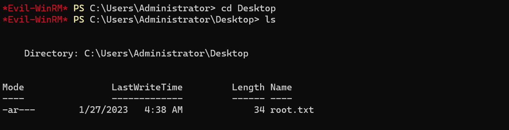