## RUSTSCAN:
`PORT     STATE SERVICE REASON         VERSION
22/tcp   open  ssh     syn-ack ttl 63 OpenSSH 8.2p1 Ubuntu 4 (Ubuntu Linux; protocol 2.0)
| ssh-hostkey:
|   3072 453c341435562395d6834e26dec65bd9 (RSA)
| ssh-rsa AAAAB3NzaC1yc2EAAAADAQABAAABgQDv5dlPNfENa5t2oe/3IuN3fRk9WZkyP83WGvRByWfBtj3aJH1wjpPJMUTuELccEyNDXaUnsbrhgH76eGVQAyF56DnY3QxWlt82MgHTJWDwdt4hKMDLNKlt+i+sElqhYwXPYYWfuApFKiAUr+KGvnk9xJrhZ9/bAp+rW84LyeJOSZ8iqPVAdcjve5As1O+qcSAUfIHlZGRzkVuUuOq2wxUvegKsYnmKWUZW1E/fRq3tJbqJ5Z0JwDklN21HR4dmM7/VTHQ/AaTl/JnQxOLFUlryXAFbjgLa1SDOTBDOG72j2/II2hdeMOKN8YZN9DHgt6qKiyn0wJvSE2nddC2BbnGzamJlnQaXOpSb3+WDHP+JMxQJQrRxFoG4R6X2c0rx+yM5XnYHur9cQXC9fp+lkxQ8TtkMijbPlS2umFYcd9WrMdtEbSeKbaozi9YwbR9MQh8zU2cBc7T9p3395HAWt/wCcK9a61XrQY/XDr5OSF2MI5ESVG9e0t8jG9Q0opFo19U=
|   256 1ee7b955dd258f7256e88e65d519b08d (ED25519)
|_ssh-ed25519 AAAAC3NzaC1lZDI1NTE5AAAAIKHA/3Dphu1SUgMA6qPzqzm6lH2Cuh0exaIRQqi4ST8y
80/tcp   open  http    syn-ack ttl 63 Apache httpd 2.4.41 ((Ubuntu))
| http-methods:
|_  Supported Methods: GET HEAD POST OPTIONS
|_http-title: Mega Hosting
|_http-server-header: Apache/2.4.41 (Ubuntu)
|_http-favicon: Unknown favicon MD5: 338ABBB5EA8D80B9869555ECA253D49D
8080/tcp open  http    syn-ack ttl 63 Apache Tomcat
|_http-open-proxy: Proxy might be redirecting requests
| http-methods:
|_  Supported Methods: OPTIONS GET HEAD POST
|_http-title: Apache Tomcat
Warning: OSScan results may be unreliable because we could not find at least 1 open and 1 closed port
OS fingerprint not ideal because: Missing a closed TCP port so results incomplete`
* * *
## HTTP:
Surfing manuallyb the website we can see that the real FQDN should be:

So let's add it to our list and move forward with other types of enumeration...
No additional subdomains have been found:
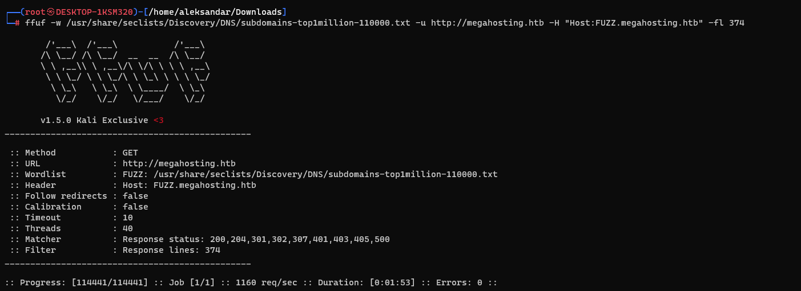

Following web directories have been found(a recurse search have been sent):
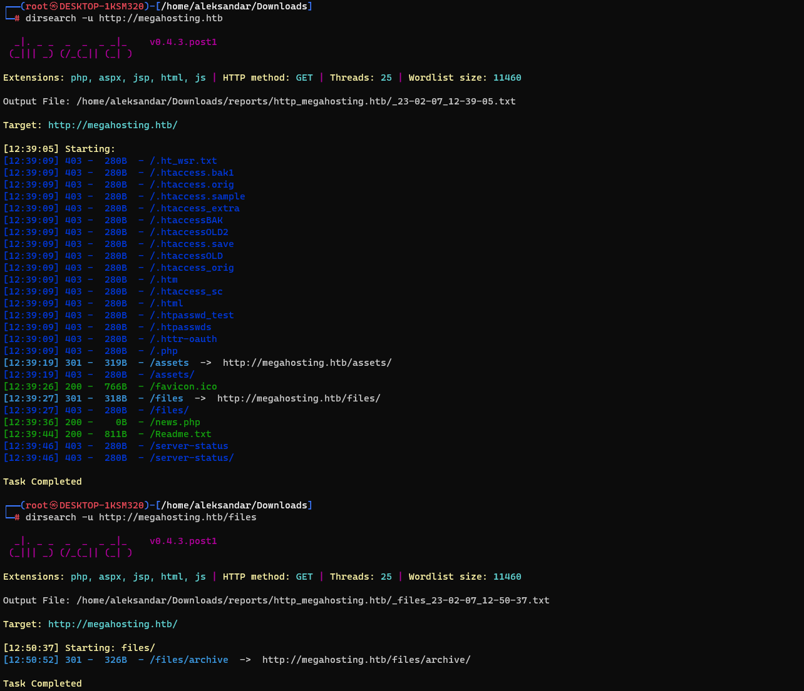

Now moving forward with manual enumeration on the website with burp suite something came upp, a page news.php seems like vulnerable to LFI?
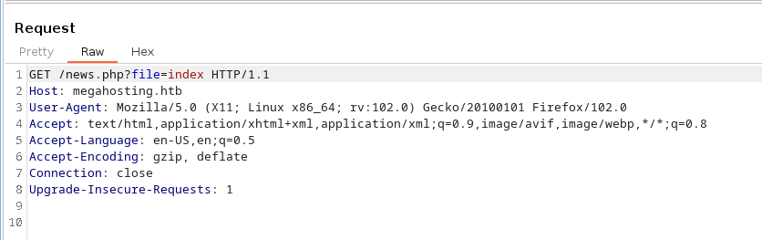

Now trying some manual enumeration we manage to read news.php file:
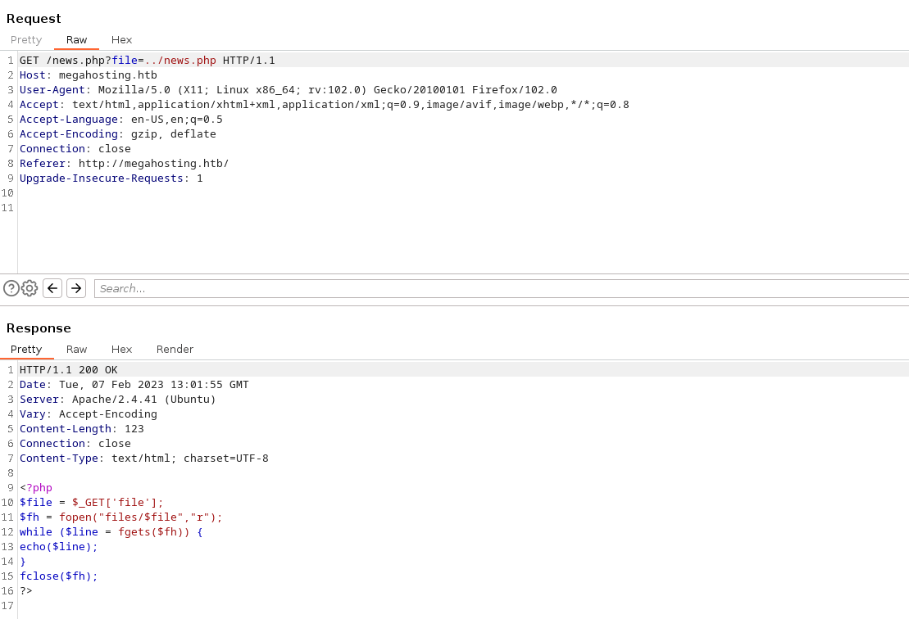

We can read /etc/passwd and see that there is a user named Ash and then root user:
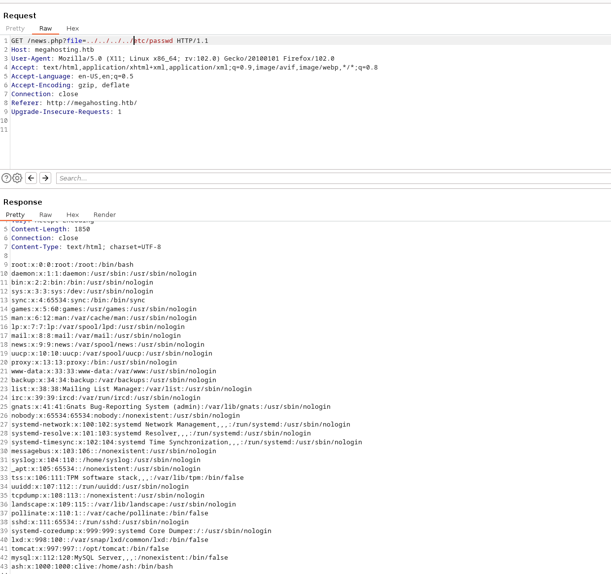

Now we should check if we can find more php files to find possible credentials or if we can to Apache log pollution maybe?
Nothing, seems like the LFI might be a Rabbit hole?
* * *
## PORT 8080:
Now let's see what can we do with this Tomcat?
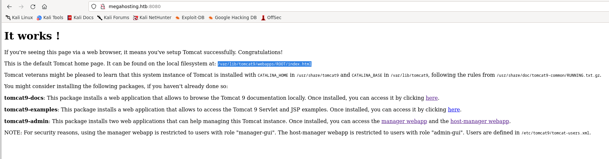

Checking under docs we can see that these is the Tomcat vers. 9.0.31 so I checked for possible Exploits like Ghostcat and so on but we need some credentials for the manager webapp and offcourse no default credentials have been found so i checked for tips and apparently i was on the right way.. we should use the lfi to read confgi files from tomcat.

We know that user of Management is in: `NOTE: For security reasons, using the manager webapp is restricted to users with role "manager-gui". The host-manager webapp is restricted to users with role "admin-gui". Users are defined in /etc/tomcat9/tomcat-users.xml.`

And the install dir is `Tomcat veterans might be pleased to learn that this system instance of Tomcat is installed with CATALINA_HOME in /usr/share/tomcat9 and CATALINA_BASE in /var/lib/tomcat9, following the rules from /usr/share/doc/tomcat9-common/RUNNING.txt.gz.`

We can resume that config tile should be in: `/usr/share/tomcat9/etc/tomcat9/tomcat-users.xml`

But then i had to check back tips since it was not installed on a default folder so the real path was `/usr/share/tomcat9/etc/tomcat-users.xml` (this was just matter of try and fail untill you find it):
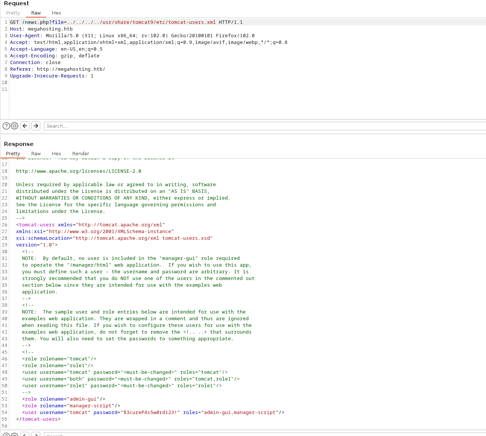

And now we have the credentials:
`  <role rolename="admin-gui"/>
   <role rolename="manager-script"/>
   <user username="tomcat" password="$3cureP4s5w0rd123!" roles="admin-gui,manager-script"/>
</tomcat-users>`

We are in:
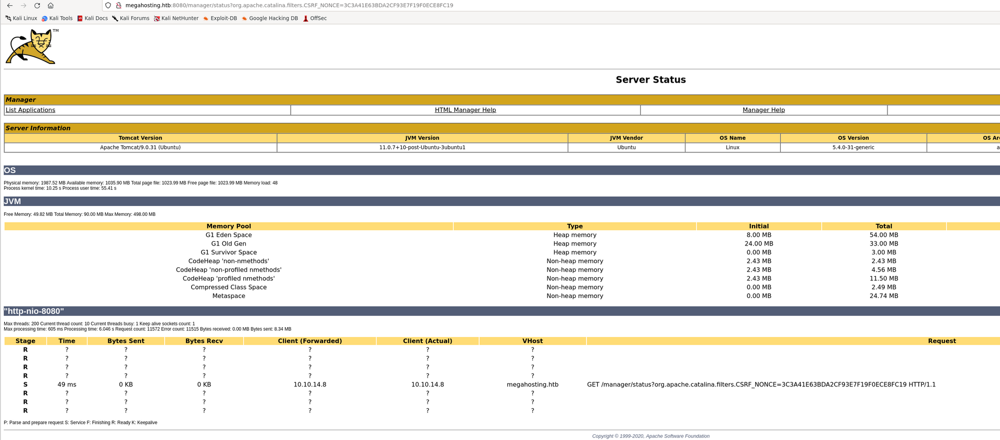

Can we exploit this with Metasploit? 
no we cant! The reason is that we get auth failure with user we got from the LFI:
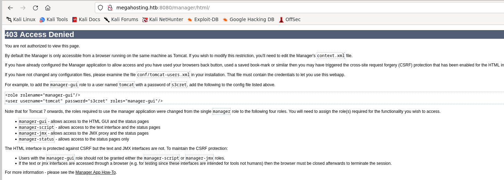

As we see to access the /mamager/html we need to have manager-gui which we don't cause we have only manager-script:
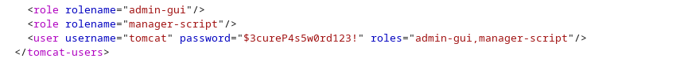

And this mean we have not html access but text access:
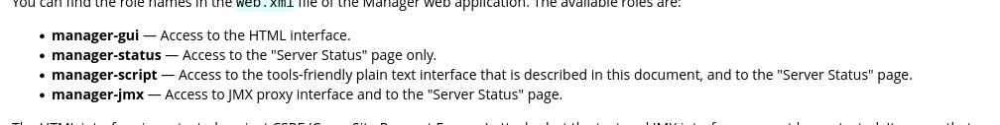

Now after a bit of googling i found this:
https://medium.com/@cyb0rgs/exploiting-apache-tomcat-manager-script-role-974e4307cd00

let's create our payload in MSFVenom and add a listener in MSF:
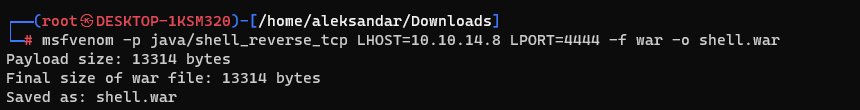
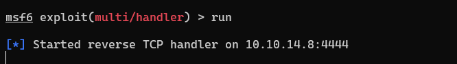

Now let's upload it with CURL:
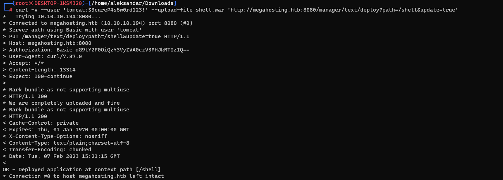

And now curling `http://megahosting.htb:8080/shell` we get a shell in our Metasploit:
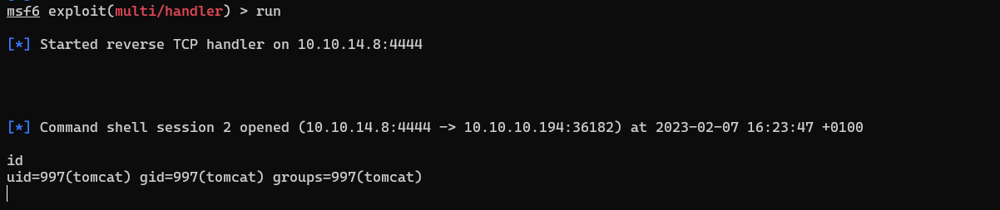

Now we must elevate to Ash user
* * *
## USER.txt:
Checking under var/www/html we find an archive backup from user ash, so download it by using python3 http.server module and by trying to unzip we must have a password. 
Using john we can find it:
`┌──(root㉿DESKTOP-1KSM320)-[/home/aleksandar/Downloads]
└─# john tabby.hash --wordlist=/usr/share/wordlists/rockyou.txt
Using default input encoding: UTF-8
Loaded 1 password hash (PKZIP [32/64])
Will run 12 OpenMP threads
Press 'q' or Ctrl-C to abort, almost any other key for status
admin@it         (16162020_backup.zip)
1g 0:00:00:01 DONE (2023-02-07 16:30) 0.5208g/s 5401Kp/s 5401Kc/s 5401KC/s adzlogan..adamsapple:)1
Use the "--show" option to display all of the cracked passwords reliably
Session completed.`

Unzipping the archive didn't gave us nothing important except that we have a password reuse case where the zip password is the same for the user ash-

So now we can ssh and grab our first flag:
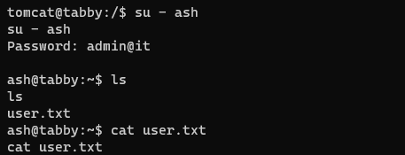
* * *
## ROOT.txt:
Now trying to check if we have any sudo rights as user ASH we find that we don't so let's upload Linpeas and do an enumeration..
`╔══════════╣ Sudo version
╚ https://book.hacktricks.xyz/linux-hardening/privilege-escalation#sudo-version
Sudo version 1.8.31
╔══════════╣ CVEs Check
Vulnerable to CVE-2021-4034
Vulnerable to CVE-2021-3560
Potentially Vulnerable to CVE-2022-2588
╔══════════╣ My user
╚ https://book.hacktricks.xyz/linux-hardening/privilege-escalation#users
uid=1000(ash) gid=1000(ash) groups=1000(ash),4(adm),24(cdrom),30(dip),46(plugdev),116(lxd)`

We can see thar ASH user is part of LXD group so we may want to use that as our PE vector: https://book.hacktricks.xyz/linux-hardening/privilege-escalation/interesting-groups-linux-privesc/lxd-privilege-escalation#method-2

I followed the method 2 since i had already generated an alpine image, so I have uploaded the tar.gz image, initialized the storage pool, created the container and lastly mounted /root in /mnt/root:
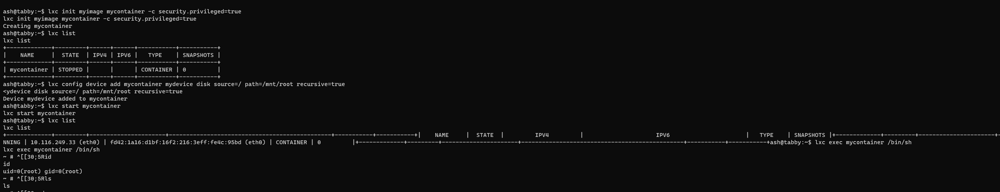

And then going back to root and surfing to /mnt/root/root we can grab the last flag:
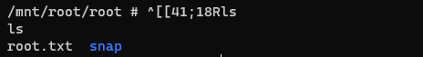
