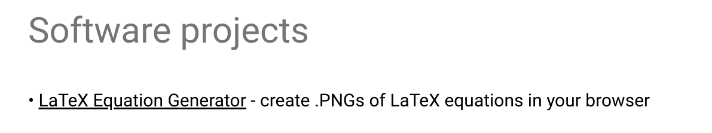
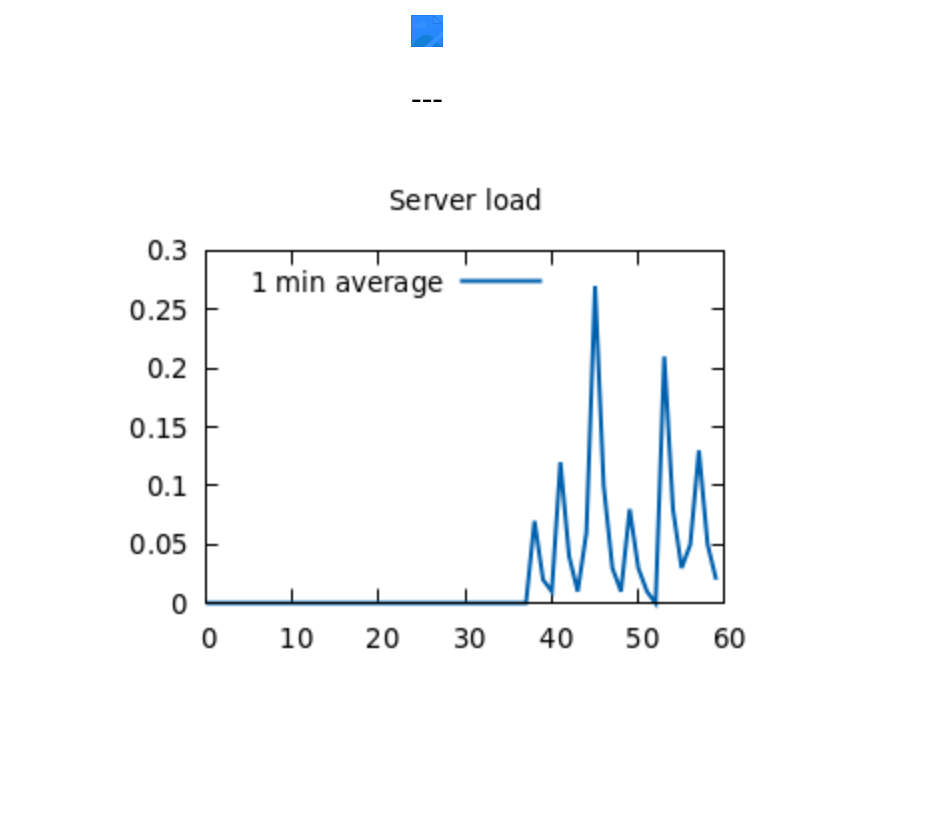
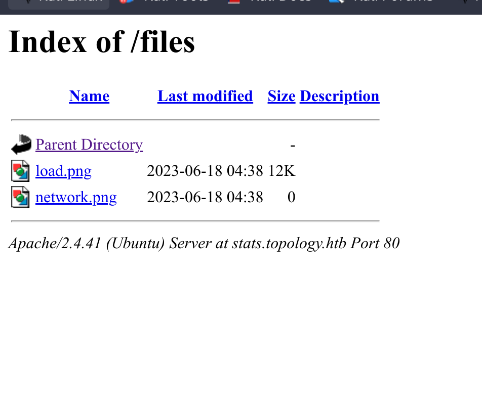
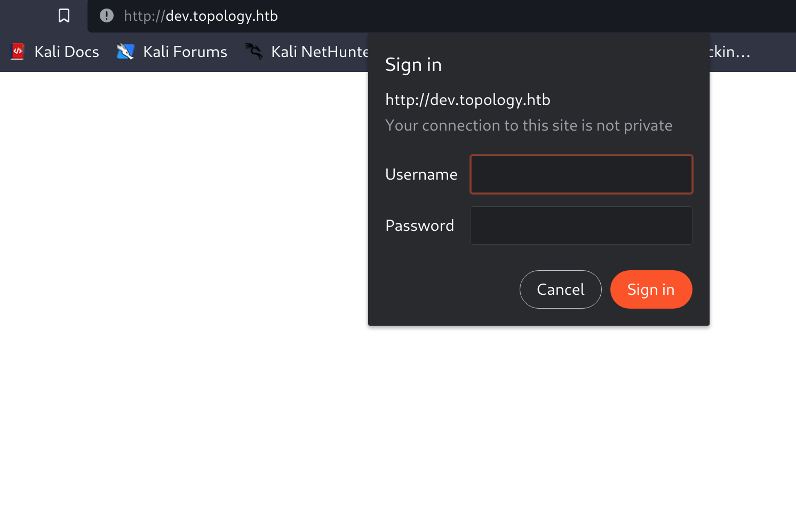
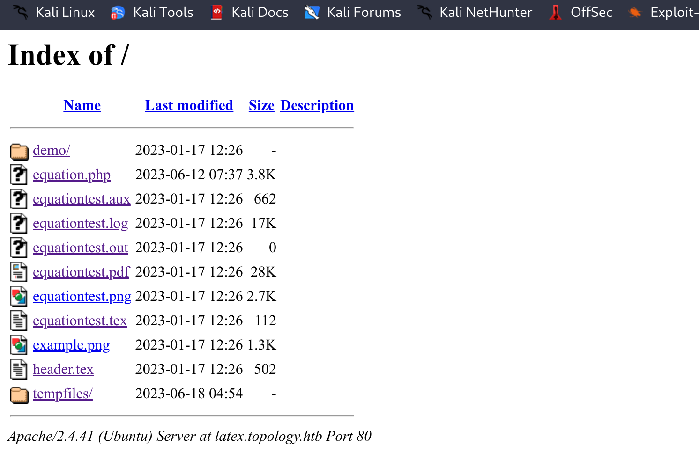
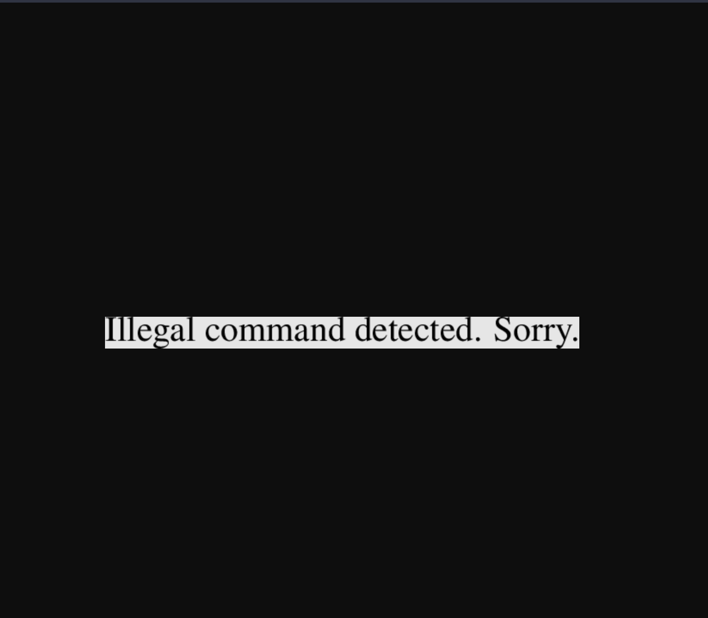

## Rustscan:
`PORT   STATE SERVICE REASON         VERSION
22/tcp open  ssh     syn-ack ttl 63 OpenSSH 8.2p1 Ubuntu 4ubuntu0.7 (Ubuntu Linux; protocol 2.0)
| ssh-hostkey: 
|   3072 dc:bc:32:86:e8:e8:45:78:10:bc:2b:5d:bf:0f:55:c6 (RSA)
| ssh-rsa AAAAB3NzaC1yc2EAAAADAQABAAABgQC65qOGPSRC7ko+vPGrMrUKptY7vMtBZuaDUQTNURCs5lRBkCFZIrXTGf/Xmg9MYZTnwm+0dMjIZTUZnQvbj4kdsmzWUOxg5Leumcy+pR/AhBqLw2wyC4kcX+fr/1mcAgbqZnCczedIcQyjjO9M1BQqUMQ7+rHDpRBxV9+PeI9kmGyF6638DJP7P/R2h1N9MuAlVohfYtgIkEMpvfCUv5g/VIRV4atP9x+11FHKae5/xiK95hsIgKYCQtWXvV7oHLs3rB0M5fayka1vOGgn6/nzQ99pZUMmUxPUrjf4V3Pa1XWkS5TSv2krkLXNnxQHoZOMQNKGmDdk0M8UfuClEYiHt+zDDYWPI672OK/qRNI7azALWU9OfOzhK3WWLKXloUImRiM0lFvp4edffENyiAiu8sWHWTED0tdse2xg8OfZ6jpNVertFTTbnilwrh2P5oWq+iVWGL8yTFeXvaSK5fq9g9ohD8FerF2DjRbj0lVonsbtKS1F0uaDp/IEaedjAeE=
|   256 d9:f3:39:69:2c:6c:27:f1:a9:2d:50:6c:a7:9f:1c:33 (ECDSA)
| ecdsa-sha2-nistp256 AAAAE2VjZHNhLXNoYTItbmlzdHAyNTYAAAAIbmlzdHAyNTYAAABBBIR4Yogc3XXHR1rv03CD80VeuNTF/y2dQcRyZCo4Z3spJ0i+YJVQe/3nTxekStsHk8J8R28Y4CDP7h0h9vnlLWo=
|   256 4c:a6:50:75:d0:93:4f:9c:4a:1b:89:0a:7a:27:08:d7 (ED25519)
|_ssh-ed25519 AAAAC3NzaC1lZDI1NTE5AAAAIOaM68hPSVQXNWZbTV88LsN41odqyoxxgwKEb1SOPm5k
80/tcp open  http    syn-ack ttl 63 Apache httpd 2.4.41 ((Ubuntu))
| http-methods: 
|_  Supported Methods: OPTIONS HEAD GET POST
|_http-server-header: Apache/2.4.41 (Ubuntu)
|_http-title: Miskatonic University | Topology Group
Warning: OSScan results may be unreliable because we could not find at least 1 open and 1 closed port
OS fingerprint not ideal because: Missing a closed TCP port so results incomplete
Aggressive OS guesses: Linux 4.15 - 5.8 (95%), Linux 5.3 - 5.4 (95%), Linux 2.6.32 (95%), Linux 5.0 - 5.5 (95%), Linux 3.1 (95%), Linux 3.2 (95%), AXIS 210A or 211 Network Camera (Linux 2.6.17) (94%), ASUS RT-N56U WAP (Linux 3.4) (93%), Linux 3.16 (93%), Linux 5.0 (93%)
No exact OS matches for host (test conditions non-ideal).
TCP/IP fingerprint:
SCAN(V=7.94%E=4%D=6/18%OT=22%CT=%CU=39343%PV=Y%DS=2%DC=T%G=N%TM=648EB61C%P=x86_64-pc-linux-gnu)
SEQ(SP=105%GCD=1%ISR=10B%TI=Z%CI=Z%TS=A)
OPS(O1=M550ST11NW7%O2=M550ST11NW7%O3=M550NNT11NW7%O4=M550ST11NW7%O5=M550ST11NW7%O6=M550ST11)
WIN(W1=FE88%W2=FE88%W3=FE88%W4=FE88%W5=FE88%W6=FE88)
ECN(R=Y%DF=Y%T=40%W=FAF0%O=M550NNSNW7%CC=Y%Q=)
T1(R=Y%DF=Y%T=40%S=O%A=S+%F=AS%RD=0%Q=)
T2(R=N)
T3(R=N)
T4(R=Y%DF=Y%T=40%W=0%S=A%A=Z%F=R%O=%RD=0%Q=)
T5(R=Y%DF=Y%T=40%W=0%S=Z%A=S+%F=AR%O=%RD=0%Q=)
T6(R=Y%DF=Y%T=40%W=0%S=A%A=Z%F=R%O=%RD=0%Q=)
T7(R=Y%DF=Y%T=40%W=0%S=Z%A=S+%F=AR%O=%RD=0%Q=)
U1(R=Y%DF=N%T=40%IPL=164%UN=0%RIPL=G%RID=G%RIPCK=G%RUCK=G%RUD=G)
IE(R=Y%DFI=N%T=40%CD=S)
`
* * *
## SSH:
As usual ssh service is not our first foothold since the running version is pretty new and we won´t use bruteforce here so i will move forward with the order services.
* * *
## HTTP:
On first check we can see that the website seems like a portal for a University:

And we can see the FQDN from the email links so I suggest to add those to our hosts file and move forward with enumeration of the HTTP service.
As first step I will check for any hint or leftovers comments in the mainsite source code but nothing came out so far.
Next I will do another easy and fast task and I will hunt for possible subdomains, and seems like a throttling solution in on place but I got 2 other possible subdomains:
`┌──(root㉿kali-linux)-[/home/millycash/Downloads]
└─# ffuf -w /usr/share/seclists/Discovery/DNS/subdomains-top1million-20000.txt  -u 'http://topology.htb/' -H 'HOST:FUZZ.topology.htb' -fl 175

        /'___\  /'___\           /'___\       
       /\ \__/ /\ \__/  __  __  /\ \__/       
       \ \ ,__\\ \ ,__\/\ \/\ \ \ \ ,__\      
        \ \ \_/ \ \ \_/\ \ \_\ \ \ \ \_/      
         \ \_\   \ \_\  \ \____/  \ \_\       
          \/_/    \/_/   \/___/    \/_/       

       v2.0.0-dev
________________________________________________

 :: Method           : GET
 :: URL              : http://topology.htb/
 :: Wordlist         : FUZZ: /usr/share/seclists/Discovery/DNS/subdomains-top1million-20000.txt
 :: Header           : Host: FUZZ.topology.htb
 :: Follow redirects : false
 :: Calibration      : false
 :: Timeout          : 10
 :: Threads          : 40
 :: Matcher          : Response status: 200,204,301,302,307,401,403,405,500
 :: Filter           : Response lines: 175
________________________________________________

[Status: 200, Size: 108, Words: 5, Lines: 6, Duration: 76ms]
    * FUZZ: stats

[Status: 401, Size: 463, Words: 42, Lines: 15, Duration: 8609ms]
    * FUZZ: dev
`

I stopped the task after a while cause i guess it's enough for now and I moved forward with web directories fuzzing but even here the speed where so slow so I went back to manual fuzzing and again on the main website we could see some important informations:
1. Possible usernames?

2. Another one?
lklein@topology.htb
3. And another domain?

Clicking on this latex generator is opening a new tab to a subdomain called latex so let's wrap it up and add allo those subdomains to our hosts file and move forward with them!
* * *
## HTTP - stats.topology.htb:
So far what I see seems like only a static page pointing to some static images:

And following the html source code:
`

	

	
---

	

`

And link to files folder:

This one smells like "rabbit hole" so i will move forward!
* * *
## HTTP - dev.topology.htb:
Opening this website seems like we have a login page:

Here I tried to run SQLMap but it's failing on default login page:
`┌──(root㉿kali-linux)-[/home/millycash]
└─# sqlmap -u 'http://dev.topology.htb/' --dbs --batch --forms --ignore-code 401
        ___
       __H__
 ___ ___[']_____ ___ ___  {1.7.6#stable}
|_ -| . [)]     | .'| . |
|___|_  [)]_|_|_|__,|  _|
      |_|V...       |_|   https://sqlmap.org

[!] legal disclaimer: Usage of sqlmap for attacking targets without prior mutual consent is illegal. It is the end user's responsibility to obey all applicable local, state and federal laws. Developers assume no liability and are not responsible for any misuse or damage caused by this program

[*] starting @ 10:42:35 /2023-06-18/

[10:42:35] [INFO] testing connection to the target URL
[10:42:36] [INFO] searching for forms
[10:42:37] [CRITICAL] there were no forms found at the given target URL

[*] ending @ 10:42:37 /2023-06-18/
`

So I will launch burpsuite and catch the login request and the lastly send it via Burpsuite.
Apparently it's using basic auth and login string is Base64 encoded which may not let us use directly SQLMap for this task.
I will try to send some SQLi payloads manually and see if I can make the website respond with some unusual informations.
Edit: Seems like even with manual fuzzing I'm not making this SQLi working I guess even this is not duable without a proper credentials so I will move on and come back as soon I find proper credentials.
* * *
## HTTP - latex.topology.htb:
Here can we surf the website:

And we can see something called Latex where you can write some string and it will generate a pdf/picture of that mathematical string you entered:

Now my guess is that we can use this website to get our foothold, so googling aroud I stubled upon this: https://book.hacktricks.xyz/pentesting-web/formula-doc-latex-injection#latex-injection
Seems like we can exploit this latex to do some LFI and eventually a rce maybe??
Let's start our way up to the top!
But all the commands either are givin blak result or are blocked:

I will drop this shit cause it's non sense this crap!