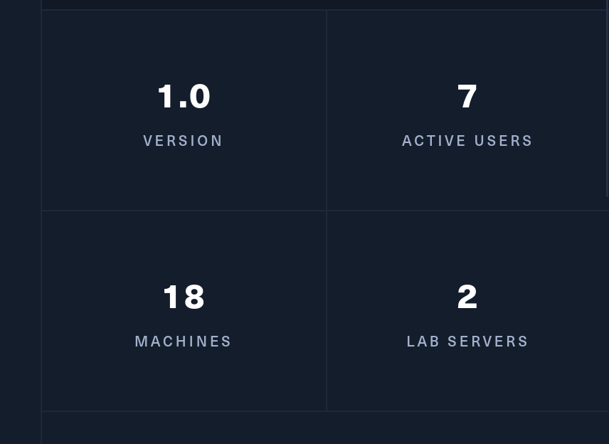
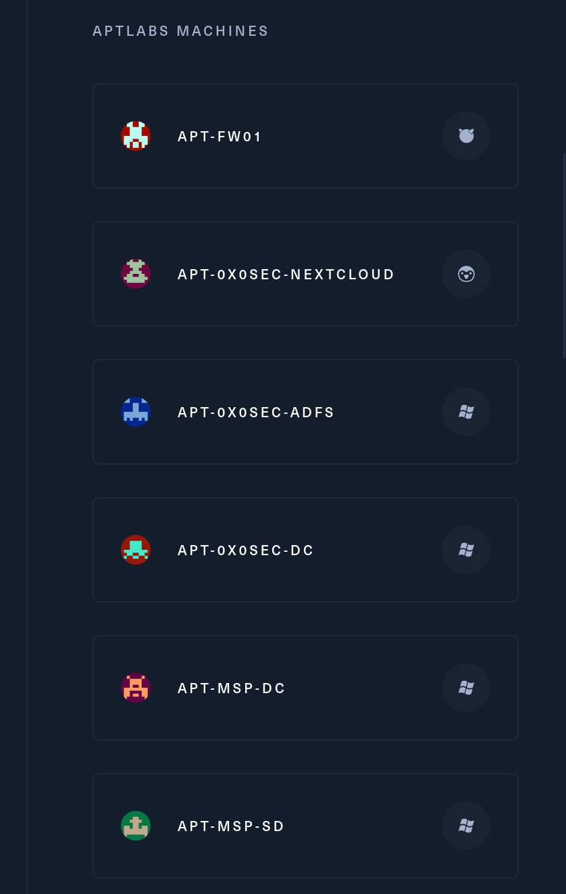
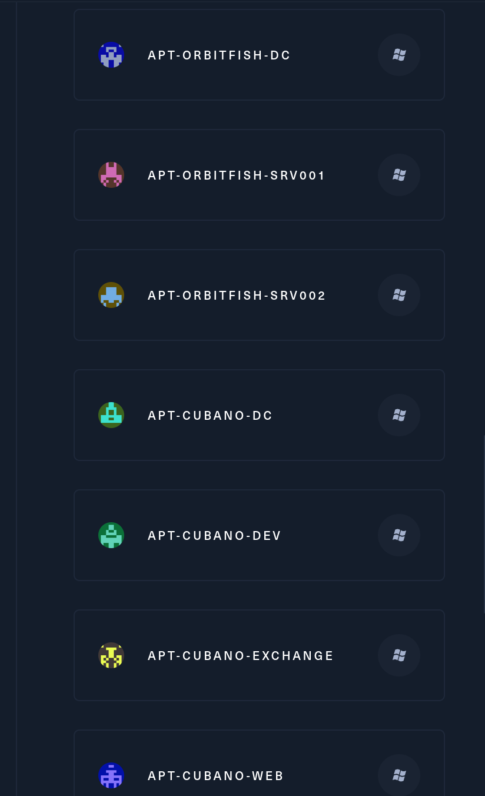

APTLabs simulates a targeted attack by an external threat agent against an MSP (Managed Service Provider). The lab requires prerequisite knowledge of attacking Active Directory networks. APTLabs consists of fully patched servers, prevalent enterprise technologies, a simulated WAN network, and much more!

Your goal is to compromise all client networks and reach Domain Admin wherever possible. On completion of this lab you will be familiar with long-lasting TTPs, how to abuse enterprise technology, and be a true google-ninja.

This is an extremely challenging **Red Team Operator Level III** lab, that will push you to the limit, and put your skills to the test in the following areas:

- Active Directory enumeration and exploitation
- Bypassing security features such as 2FA, JEA and WDAC
- Exploiting interactive users
- Kerberos attacks
- Lateral movement between multiple forests
- Reaching your goals without using any CVEs

&nbsp;

# Scoping

So far we are getting a /24 subnet as entry point: **10.10.110.0/24**.

And we know that it is supposedly beeing mostly Windows based servers with some sprinkles of Unix; I don´t get a denied  list of machines that I am not allowed to "touch" but my guessing is that FW and other sensitive devices are out of scope!

I know there should be 18 virtual servers and several networks:  

I know get to know also all the machines names and the OS used:  

And some more lol:

That was it, it is huge and most likely will fail but we will see.