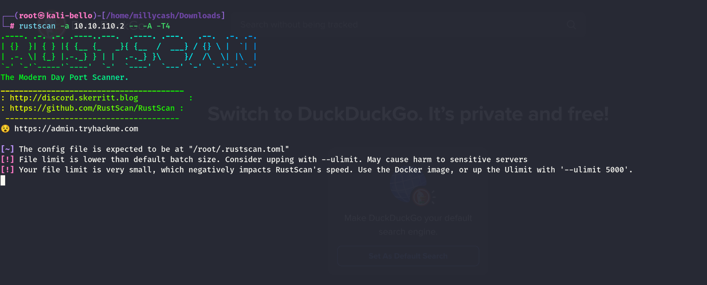
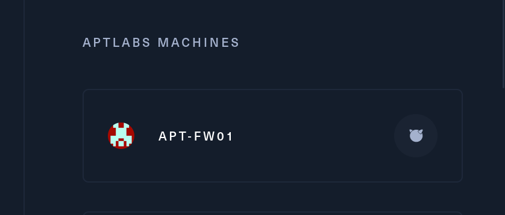

As usual I will engage RUSTSCAN and start by checking all the alive services running on the TCP protocoll.



The tool is not fetching anything, judging by the IP I strongly believe this might be the firewall?



If this is the case, then this is mostl likely out of SCOPE!

I also tried to send a more specific scan, also for UPD services without success:

```
┌──(root㉿kali-bello)-[/home/millycash]
└─# nmap -F 10.10.110.2
Starting Nmap 7.94SVN ( https://nmap.org ) at 2024-06-29 16:36 CEST
Nmap scan report for 10.10.110.2
Host is up (0.031s latency).
All 100 scanned ports on 10.10.110.2 are in ignored states.
Not shown: 100 filtered tcp ports (no-response)

Nmap done: 1 IP address (1 host up) scanned in 4.35 seconds
                                                                                                                                                                                  
┌──(root㉿kali-bello)-[/home/millycash]
└─# nmap -F -sU 10.10.110.2
Starting Nmap 7.94SVN ( https://nmap.org ) at 2024-06-29 16:37 CEST
Nmap scan report for 10.10.110.2
Host is up (0.028s latency).
All 100 scanned ports on 10.10.110.2 are in ignored states.
Not shown: 100 open|filtered udp ports (no-response)

Nmap done: 1 IP address (1 host up) scanned in 4.11 seconds
```

I will move on!