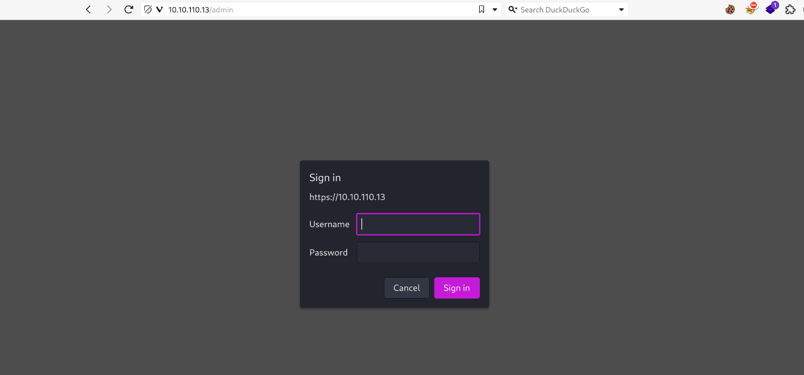
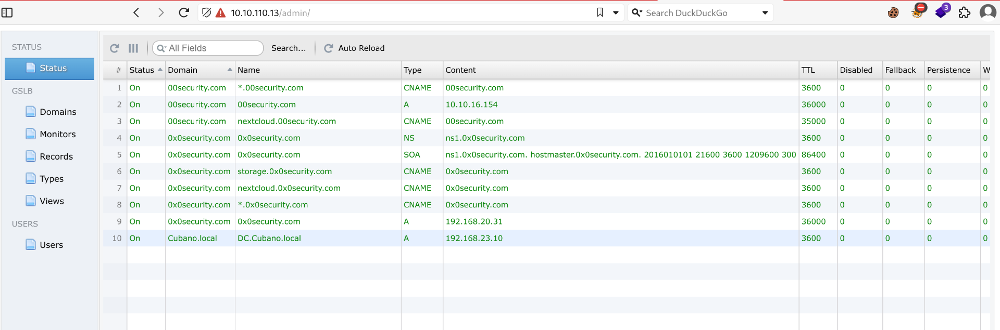
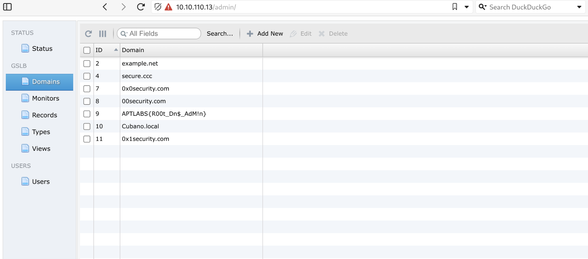

As usual I will engage RUSTSCAN and start by checking all the alive services running on the TCP protocoll.

```
PORT    STATE SERVICE    REASON         VERSION
53/tcp  open  domain     syn-ack ttl 61 PowerDNS Authoritative Server 4.1.11
| dns-nsid: 
|   NSID: powergslb (706f77657267736c62)
|   id.server: powergslb
|_  bind.version: PowerDNS Authoritative Server 4.1.11
443/tcp open  ssl/caldav syn-ack ttl 61 Radicale calendar and contacts server (Python BaseHTTPServer)
|_http-title: Error response
|_http-server-header: PowerGSLB/1.7.3 Python/2.7.5
| http-methods: 
|_  Supported Methods: GET HEAD POST
| ssl-cert: Subject: commonName=localhost.localdomain/organizationName=SomeOrganization/stateOrProvinceName=SomeState/countryName=--/localityName=SomeCity/organizationalUnitName=SomeOrganizationalUnit/emailAddress=root@localhost.localdomain
| Issuer: commonName=localhost.localdomain/organizationName=SomeOrganization/stateOrProvinceName=SomeState/countryName=--/localityName=SomeCity/organizationalUnitName=SomeOrganizationalUnit/emailAddress=root@localhost.localdomain
| Public Key type: rsa
| Public Key bits: 2048
| Signature Algorithm: sha256WithRSAEncryption
| Not valid before: 2020-01-09T12:45:01
| Not valid after:  2021-01-08T12:45:01
| MD5:   fce2:3df5:c601:0285:49b8:5607:6b94:dc58
| SHA-1: 5241:7b4a:9153:bb53:70cb:80dc:6296:69bc:371c:60db
| -----BEGIN CERTIFICATE-----
| MIIESzCCAzOgAwIBAgIJAOwQb9KrUUu0MA0GCSqGSIb3DQEBCwUAMIG7MQswCQYD
| VQQGEwItLTESMBAGA1UECAwJU29tZVN0YXRlMREwDwYDVQQHDAhTb21lQ2l0eTEZ
| MBcGA1UECgwQU29tZU9yZ2FuaXphdGlvbjEfMB0GA1UECwwWU29tZU9yZ2FuaXph
| dGlvbmFsVW5pdDEeMBwGA1UEAwwVbG9jYWxob3N0LmxvY2FsZG9tYWluMSkwJwYJ
| KoZIhvcNAQkBFhpyb290QGxvY2FsaG9zdC5sb2NhbGRvbWFpbjAeFw0yMDAxMDkx
| MjQ1MDFaFw0yMTAxMDgxMjQ1MDFaMIG7MQswCQYDVQQGEwItLTESMBAGA1UECAwJ
| U29tZVN0YXRlMREwDwYDVQQHDAhTb21lQ2l0eTEZMBcGA1UECgwQU29tZU9yZ2Fu
| aXphdGlvbjEfMB0GA1UECwwWU29tZU9yZ2FuaXphdGlvbmFsVW5pdDEeMBwGA1UE
| AwwVbG9jYWxob3N0LmxvY2FsZG9tYWluMSkwJwYJKoZIhvcNAQkBFhpyb290QGxv
| Y2FsaG9zdC5sb2NhbGRvbWFpbjCCASIwDQYJKoZIhvcNAQEBBQADggEPADCCAQoC
| ggEBALG+Tkma8a29rRv4cgZQGxg8uNFEWsUiEWTVkqK4/PhRZAP0P+dIX1G6mg7l
| +o11Le8M/qWpYVGZz8I2qqGw2I6gOb2BJGRgnvzVBS/TW+HRe2Q5W5AKdN6hDtQU
| 16iWlRTEPOMr2lZAPDTp6RpnihvF/nadEJpvTVcrbh4DrjoYxxutNiQjDXfQxLFE
| FnLLm4aMDMBXNb2QXEtI+gBVKahz/hmfqMXvJGg+2r+jOpHId/crwM4YmbSFv54M
| 3uBZEtiAAYy9mK6qHG/QUcORVUAedjK5UYzRLa5vodGrkfYq08+O4JnJEUmIBJFk
| b6upLB0srvoxtf8W+MFKMPwrkmcCAwEAAaNQME4wHQYDVR0OBBYEFLXo2CHmARiG
| TUYI1xFVt89v5tA9MB8GA1UdIwQYMBaAFLXo2CHmARiGTUYI1xFVt89v5tA9MAwG
| A1UdEwQFMAMBAf8wDQYJKoZIhvcNAQELBQADggEBAHOEZNTkHIXAzBAT1aDBnF3n
| d18fhbLcaAmOUoY0irTXTx5UmaLw2S6BnLGVQ7HkhU/SP8qrKV7RXH8Hav1gVv/H
| eL3TSxOQhWWunsVTuNzPp9tz3g/sQdadt58WynuY8YYKpSLjM9ocWgHv9YDhrDkR
| r4Eit9/NBwUBDRea1wD0GdZHqBHg8KL8CK2DpspINm2j+s6inHpepvphJXKsB12B
| rxacCkGrHIvtJvQE3o3QnEzRw47B+mLzktTxX6cQBjaBwr5bjIexAAfl9l/fIlmD
| qLfLwPFBwo3SIecIt1Yv0AHr7HBlZm5dIILPxnB3TunGdrwXb2yF0LKIuY+Rm7M=
|_-----END CERTIFICATE-----
Warning: OSScan results may be unreliable because we could not find at least 1 open and 1 closed port
OS fingerprint not ideal because: Missing a closed TCP port so results incomplete
No OS matches for host
TCP/IP fingerprint:
SCAN(V=7.94SVN%E=4%D=6/29%OT=53%CT=%CU=%PV=Y%DS=2%DC=T%G=N%TM=66801D06%P=x86_64-pc-linux-gnu)
SEQ(SP=104%GCD=1%ISR=107%TI=Z%II=RI%TS=A)
OPS(O1=M550ST11NW7%O2=M550ST11NW7%O3=M550NNT11NW7%O4=M550ST11NW7%O5=M550ST11NW7%O6=M550ST11)
WIN(W1=FE88%W2=FE88%W3=FE88%W4=FE88%W5=FE88%W6=FE88)
ECN(R=Y%DF=Y%TG=40%W=FAF0%O=M550NNSNW7%CC=Y%Q=)
T1(R=Y%DF=Y%TG=40%S=O%A=S+%F=AS%RD=0%Q=)
T2(R=N)
T3(R=N)
T4(R=N)
U1(R=N)
IE(R=Y%DFI=S%TG=40%CD=S)

Uptime guess: 44.270 days (since Thu May 16 10:12:03 2024)
Network Distance: 2 hops
TCP Sequence Prediction: Difficulty=260 (Good luck!)
IP ID Sequence Generation: All zeros
```

And will use NMAP to enumerate all the services alive running on the first 1K UDP ports.

```
┌──(root㉿kali-bello)-[/home/millycash]
└─# nmap -F -sU 10.10.110.13
Starting Nmap 7.94SVN ( https://nmap.org ) at 2024-06-29 16:38 CEST
Nmap scan report for 10.10.110.13
Host is up (0.043s latency).
Not shown: 99 open|filtered udp ports (no-response)
PORT   STATE SERVICE
53/udp open  domain

Nmap done: 1 IP address (1 host up) scanned in 3.58 seconds
```

I will move on to the manual fuzzing of the singular services!

&nbsp;

# DNS

I will try to perform a zone transfer:

```
──(root㉿kali-bello)-[/home/millycash/Downloads/APTLabs]
└─# dig any localhost.localdomain @10.10.110.13

; <<>> DiG 9.19.25-185-g392e7199df2-1-Debian <<>> any localhost.localdomain @10.10.110.13
;; global options: +cmd
;; Got answer:
;; ->>HEADER<<- opcode: QUERY, status: REFUSED, id: 35670
;; flags: qr rd; QUERY: 1, ANSWER: 0, AUTHORITY: 0, ADDITIONAL: 1
;; WARNING: recursion requested but not available

;; OPT PSEUDOSECTION:
; EDNS: version: 0, flags:; udp: 1680
;; QUESTION SECTION:
;localhost.localdomain.		IN	ANY

;; Query time: 47 msec
;; SERVER: 10.10.110.13#53(10.10.110.13) (TCP)
;; WHEN: Sat Jun 29 19:57:16 CEST 2024
;; MSG SIZE  rcvd: 50

                                                                                                                                                                                  
┌──(root㉿kali-bello)-[/home/millycash/Downloads/APTLabs]
└─# dig axfr localhost.localdomain @10.10.110.13

; <<>> DiG 9.19.25-185-g392e7199df2-1-Debian <<>> axfr localhost.localdomain @10.10.110.13
;; global options: +cmd
; Transfer failed.
```

Without success, I can also try to perform a DNS bruteforcing as well.

```
-----   localhost.localdomain   -----


Host's addresses:
__________________


Name Servers:
______________

 localhost.localdomain NS record query failed: REFUSED
                                                                                                                                                                                  
┌──(root㉿kali-bello)-[/home/millycash/Downloads/APTLabs]
└─# dnsenum --dnsserver 10.10.110.13 --enum -p 0 -s 0 -f /usr/share/seclists/Discovery/DNS/subdomains-top1million-20000.txt localhost.localdomain

dnsenum VERSION:1.3.1

-----   localhost.localdomain   -----


Host's addresses:
__________________


Name Servers:
______________

 localhost.localdomain NS record query failed: REFUSED
```

The tool is failing I guess I can move on for now!

&nbsp;

# HTTPS

Next I will check the HTTPS and will use again my fido DIRSEARCH since moving to the page I see blank. I know from the previous scan it footprinted the service as: https://github.com/Kozea/Radicale

Seems like a calendar sharing system so far?

```
┌──(root㉿kali-bello)-[/home/millycash/Downloads/APTLabs]
└─# dirsearch -u "https://10.10.110.13"                                                                                                          
/usr/lib/python3/dist-packages/dirsearch/dirsearch.py:23: DeprecationWarning: pkg_resources is deprecated as an API. See https://setuptools.pypa.io/en/latest/pkg_resources.html
  from pkg_resources import DistributionNotFound, VersionConflict

  _|. _ _  _  _  _ _|_    v0.4.3
 (_||| _) (/_(_|| (_| )

Extensions: php, aspx, jsp, html, js | HTTP method: GET | Threads: 25 | Wordlist size: 11460

Output File: /home/millycash/Downloads/APTLabs/reports/https_10.10.110.13/_24-06-29_20-03-18.txt

Target: https://10.10.110.13/

[20:03:18] Starting: 
[20:04:31] 401 -  206B  - /admin
[20:04:35] 401 -  206B  - /admin/%3bindex/
[20:04:35] 401 -  206B  - /admin/_logs/error.log
[20:04:35] 401 -  206B  - /admin/.config
[20:04:35] 401 -  206B  - /admin/_logs/login.txt
[20:04:35] 401 -  206B  - /admin/access.log
[20:04:35] 401 -  206B  - /admin/access.txt
[20:04:35] 401 -  206B  - /admin/.htaccess
[20:04:35] 401 -  206B  - /admin/access_log
[20:04:35] 401 -  206B  - /admin/account
[20:04:35] 401 -  206B  - /admin/account.php
[20:04:35] 401 -  206B  - /admin/_logs/access.log
[20:04:35] 401 -  206B  - /admin/account.aspx
[20:04:35] 401 -  206B  - /admin/account.jsp
[20:04:35] 401 -  206B  - /admin/_logs/access_log
[20:04:35] 401 -  206B  - /admin/account.html
[20:04:35] 401 -  206B  - /admin/account.js
[20:04:35] 401 -  206B  - /admin/admin
[20:04:35] 401 -  206B  - /admin/admin-login
```

And I see indeed a login page to the admin portal:



Now from their official documentation seems like that we can login with whatever credentials?


But this wasn't true so far but then trying around with **admin:admin** it actually worked:



From here can we see traces of cubano.local? To me this look like a DNS manager.

But then looking around I can see another flag baby!



Now I don't think this machine will allow me going somewhere specifically based on the name of the fourth flag, implies somehow phishing?


But we can see the possible internal IP of other domains:

```
192.168.20.31 - 0x0security.com
192.168.23.10 - DC.Cubano.local
10.10.16.154 - 00security.com
```

I will move on so far!

&nbsp;

&nbsp;

&nbsp;

&nbsp;