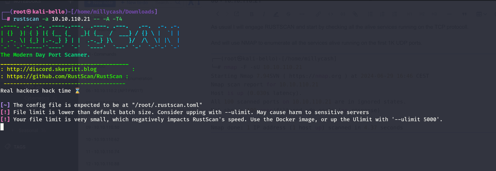

As usual I will engage RUSTSCAN and start by checking all the alive services running on the TCP protocoll.



Same here the scanning is not giving back something?

And will use NMAP to enumerate all the services alive running on the first 1K UDP ports.

```
┌──(root㉿kali-bello)-[/home/millycash]
└─# nmap -F -sU 10.10.110.21
Starting Nmap 7.94SVN ( https://nmap.org ) at 2024-06-29 16:46 CEST
Nmap scan report for 10.10.110.21
Host is up (0.030s latency).
All 100 scanned ports on 10.10.110.21 are in ignored states.
Not shown: 100 open|filtered udp ports (no-response)

Nmap done: 1 IP address (1 host up) scanned in 4.37 seconds
```