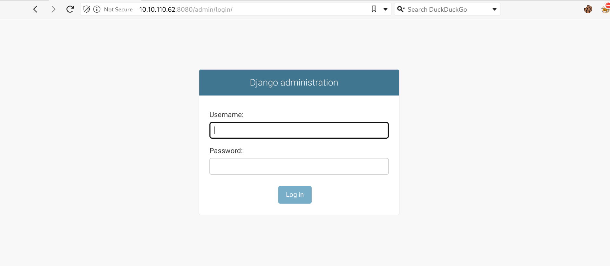
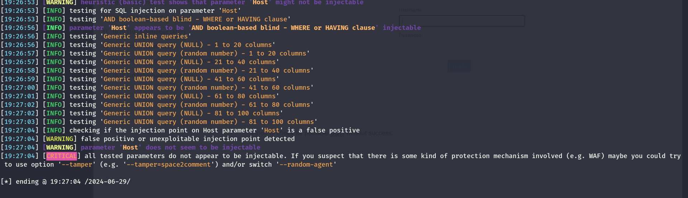
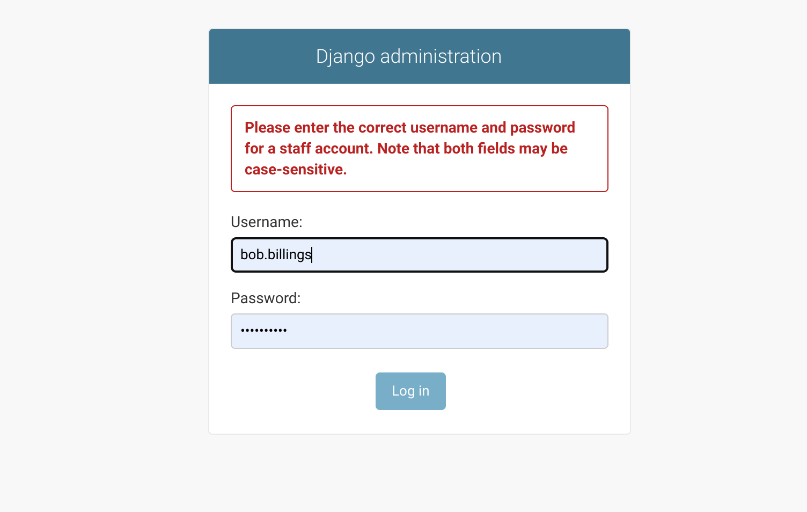
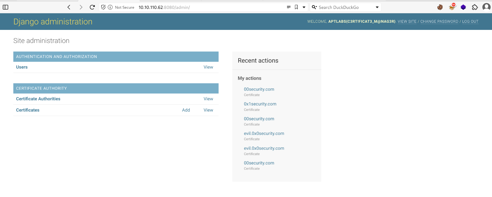
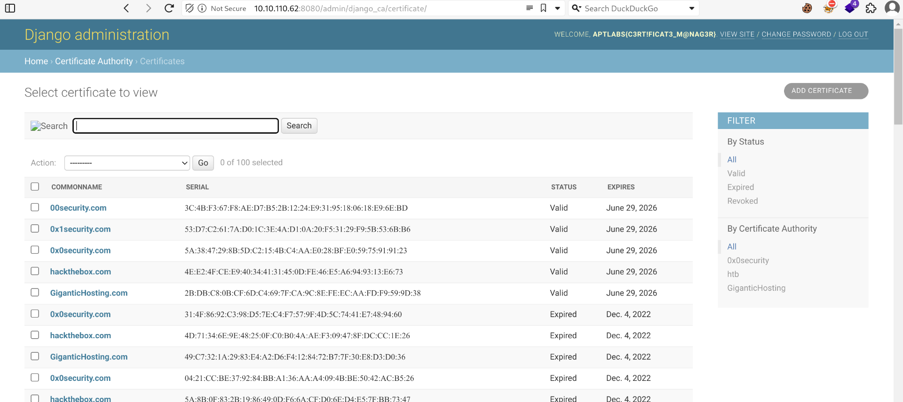
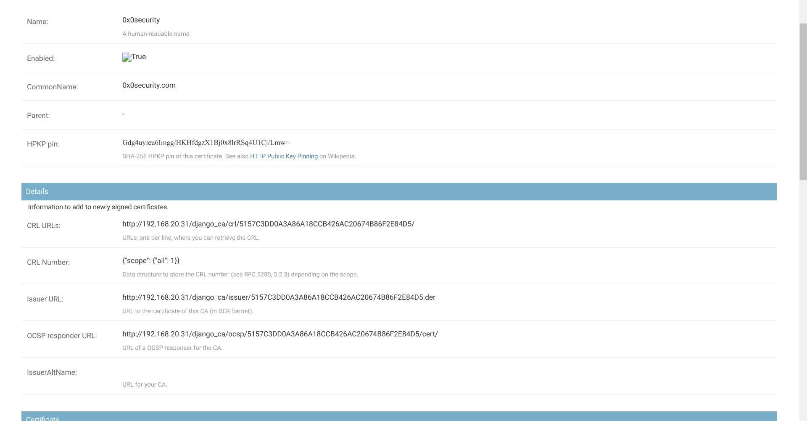

As usual I will engage RUSTSCAN and start by checking all the alive services running on the TCP protocoll.

```
PORT     STATE SERVICE REASON         VERSION
8080/tcp open  rtsp    syn-ack ttl 61
|_http-title: Not Found
|_rtsp-methods: ERROR: Script execution failed (use -d to debug)
| fingerprint-strings: 
|   FourOhFourRequest, GetRequest, HTTPOptions: 
|     HTTP/1.0 404 Not Found
|     Content-Type: text/html
|     X-Frame-Options: DENY
|     Content-Length: 179
|     X-Content-Type-Options: nosniff
|     <!doctype html>
|     <html lang="en">
|     <head>
|     <title>Not Found</title>
|     </head>
|     <body>
|     <h1>Not Found</h1><p>The requested resource was not found on this server.</p>
|     </body>
|     </html>
|   RTSPRequest: 
|     RTSP/1.0 404 Not Found
|     Content-Type: text/html
|     X-Frame-Options: DENY
|     Content-Length: 179
|     X-Content-Type-Options: nosniff
|     <!doctype html>
|     <html lang="en">
|     <head>
|     <title>Not Found</title>
|     </head>
|     <body>
|     <h1>Not Found</h1><p>The requested resource was not found on this server.</p>
|     </body>
|     </html>
|   SIPOptions: 
|     SIP/2.0 404 Not Found
|     Content-Type: text/html
|     X-Frame-Options: DENY
|     Content-Length: 179
|     X-Content-Type-Options: nosniff
|     <!doctype html>
|     <html lang="en">
|     <head>
|     <title>Not Found</title>
|     </head>
|     <body>
|     <h1>Not Found</h1><p>The requested resource was not found on this server.</p>
|     </body>
|_    </html>
1 service unrecognized despite returning data. If you know the service/version, please submit the following fingerprint at https://nmap.org/cgi-bin/submit.cgi?new-service :
SF-Port8080-TCP:V=7.94SVN%I=7%D=6/29%Time=6680201A%P=x86_64-pc-linux-gnu%r
SF:(GetRequest,133,"HTTP/1\.0\x20404\x20Not\x20Found\r\nContent-Type:\x20t
SF:ext/html\r\nX-Frame-Options:\x20DENY\r\nContent-Length:\x20179\r\nX-Con
SF:tent-Type-Options:\x20nosniff\r\n\r\n\n<!doctype\x20html>\n<html\x20lan
SF:g=\"en\">\n<head>\n\x20\x20<title>Not\x20Found</title>\n</head>\n<body>
SF:\n\x20\x20<h1>Not\x20Found</h1><p>The\x20requested\x20resource\x20was\x
SF:20not\x20found\x20on\x20this\x20server\.</p>\n</body>\n</html>\n")%r(HT
SF:TPOptions,133,"HTTP/1\.0\x20404\x20Not\x20Found\r\nContent-Type:\x20tex
SF:t/html\r\nX-Frame-Options:\x20DENY\r\nContent-Length:\x20179\r\nX-Conte
SF:nt-Type-Options:\x20nosniff\r\n\r\n\n<!doctype\x20html>\n<html\x20lang=
SF:\"en\">\n<head>\n\x20\x20<title>Not\x20Found</title>\n</head>\n<body>\n
SF:\x20\x20<h1>Not\x20Found</h1><p>The\x20requested\x20resource\x20was\x20
SF:not\x20found\x20on\x20this\x20server\.</p>\n</body>\n</html>\n")%r(RTSP
SF:Request,133,"RTSP/1\.0\x20404\x20Not\x20Found\r\nContent-Type:\x20text/
SF:html\r\nX-Frame-Options:\x20DENY\r\nContent-Length:\x20179\r\nX-Content
SF:-Type-Options:\x20nosniff\r\n\r\n\n<!doctype\x20html>\n<html\x20lang=\"
SF:en\">\n<head>\n\x20\x20<title>Not\x20Found</title>\n</head>\n<body>\n\x
SF:20\x20<h1>Not\x20Found</h1><p>The\x20requested\x20resource\x20was\x20no
SF:t\x20found\x20on\x20this\x20server\.</p>\n</body>\n</html>\n")%r(FourOh
SF:FourRequest,133,"HTTP/1\.0\x20404\x20Not\x20Found\r\nContent-Type:\x20t
SF:ext/html\r\nX-Frame-Options:\x20DENY\r\nContent-Length:\x20179\r\nX-Con
SF:tent-Type-Options:\x20nosniff\r\n\r\n\n<!doctype\x20html>\n<html\x20lan
SF:g=\"en\">\n<head>\n\x20\x20<title>Not\x20Found</title>\n</head>\n<body>
SF:\n\x20\x20<h1>Not\x20Found</h1><p>The\x20requested\x20resource\x20was\x
SF:20not\x20found\x20on\x20this\x20server\.</p>\n</body>\n</html>\n")%r(SI
SF:POptions,132,"SIP/2\.0\x20404\x20Not\x20Found\r\nContent-Type:\x20text/
SF:html\r\nX-Frame-Options:\x20DENY\r\nContent-Length:\x20179\r\nX-Content
SF:-Type-Options:\x20nosniff\r\n\r\n\n<!doctype\x20html>\n<html\x20lang=\"
SF:en\">\n<head>\n\x20\x20<title>Not\x20Found</title>\n</head>\n<body>\n\x
SF:20\x20<h1>Not\x20Found</h1><p>The\x20requested\x20resource\x20was\x20no
SF:t\x20found\x20on\x20this\x20server\.</p>\n</body>\n</html>\n");
Warning: OSScan results may be unreliable because we could not find at least 1 open and 1 closed port
OS fingerprint not ideal because: Missing a closed TCP port so results incomplete
No OS matches for host
TCP/IP fingerprint:
SCAN(V=7.94SVN%E=4%D=6/29%OT=8080%CT=%CU=%PV=Y%DS=2%DC=T%G=N%TM=66802024%P=x86_64-pc-linux-gnu)
SEQ(SP=FE%GCD=1%ISR=105%TI=Z%II=RI%TS=A)
SEQ(SP=FE%GCD=2%ISR=105%TI=Z%II=RI%TS=A)
OPS(O1=M550ST11NW7%O2=M550ST11NW7%O3=M550NNT11NW7%O4=M550ST11NW7%O5=M550ST11NW7%O6=M550ST11)
WIN(W1=FE88%W2=FE88%W3=FE88%W4=FE88%W5=FE88%W6=FE88)
ECN(R=Y%DF=Y%TG=40%W=FAF0%O=M550NNSNW7%CC=Y%Q=)
T1(R=Y%DF=Y%TG=40%S=O%A=S+%F=AS%RD=0%Q=)
T2(R=N)
T3(R=N)
T4(R=N)
U1(R=N)
IE(R=Y%DFI=S%TG=40%CD=S)
```

And will use NMAP to enumerate all the services alive running on the first 1K UDP ports.

```
┌──(root㉿kali-bello)-[/home/millycash]
└─# nmap -F -sU 10.10.110.62
Starting Nmap 7.94SVN ( https://nmap.org ) at 2024-06-29 16:49 CEST
Nmap scan report for 10.10.110.62
Host is up (0.029s latency).
All 100 scanned ports on 10.10.110.62 are in ignored states.
Not shown: 100 open|filtered udp ports (no-response)

Nmap done: 1 IP address (1 host up) scanned in 4.23 seconds
```

I will move on to manual fuzzing of singular services in the next paragraphs.

&nbsp;

# PORT 8080

I will start by running DIRSEACH and check for possible hidden file and folders since the main port is not pointing anywhere.

```
┌──(root㉿kali-bello)-[/home/millycash/Downloads/APTLabs]
└─# dirsearch -u "http://10.10.110.62:8080"        
/usr/lib/python3/dist-packages/dirsearch/dirsearch.py:23: DeprecationWarning: pkg_resources is deprecated as an API. See https://setuptools.pypa.io/en/latest/pkg_resources.html
  from pkg_resources import DistributionNotFound, VersionConflict

  _|. _ _  _  _  _ _|_    v0.4.3
 (_||| _) (/_(_|| (_| )

Extensions: php, aspx, jsp, html, js | HTTP method: GET | Threads: 25 | Wordlist size: 11460

Output File: /home/millycash/Downloads/APTLabs/reports/http_10.10.110.62_8080/_24-06-29_19-08-20.txt

Target: http://10.10.110.62:8080/

[19:08:20] Starting: 
[19:08:27] 301 -    0B  - /admin  ->  /admin/
[19:08:27] 302 -    0B  - /admin/  ->  /admin/login/?next=/admin/
[19:08:28] 301 -    0B  - /admin/login  ->  /admin/login/

Task Completed
```

Ok, we have an admin page. and pointing to it manually we can see it is a Django Administration portal?



I tried to check for possible SQLi without success:

But then I decided to check for password and users found in the SQLi leakage and seems like Bob.Billing's password actually worked:



And we can see another flag saved in his home?



Now looking around I see some issued certificates, telling me about the presence of another VHOST called 0x1security?



Looking on the Authorities we can see that all of them point to the same internal IP which might be the indication of this machine's private IPv4?



I will move on so far!