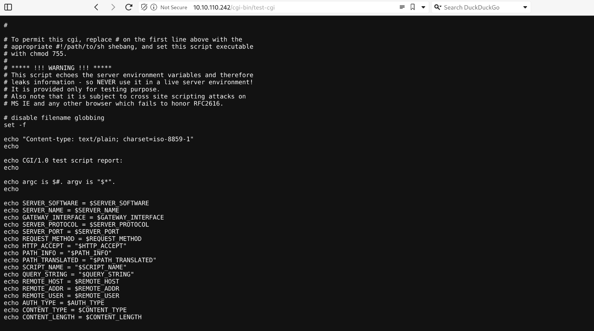

As usual I will engage RUSTSCAN and start by checking all the alive services running on the TCP protocoll.

```
PORT   STATE SERVICE REASON         VERSION
80/tcp open  http    syn-ack ttl 61 Apache httpd 2.4.41 ((Unix))
|_http-server-header: Apache/2.4.41 (Unix)
|_http-title: Gigantic Hosting | Home
| http-methods: 
|   Supported Methods: OPTIONS HEAD GET POST TRACE
|_  Potentially risky methods: TRACE
Warning: OSScan results may be unreliable because we could not find at least 1 open and 1 closed port
OS fingerprint not ideal because: Missing a closed TCP port so results incomplete
No OS matches for host
TCP/IP fingerprint:
SCAN(V=7.94SVN%E=4%D=6/29%OT=80%CT=%CU=%PV=Y%DS=2%DC=T%G=N%TM=66802527%P=x86_64-pc-linux-gnu)
SEQ(SP=FD%GCD=1%ISR=103%TI=Z%II=RI%TS=A)
OPS(O1=M550ST11NW7%O2=M550ST11NW7%O3=M550NNT11NW7%O4=M550ST11NW7%O5=M550ST11NW7%O6=M550ST11)
WIN(W1=FE88%W2=FE88%W3=FE88%W4=FE88%W5=FE88%W6=FE88)
ECN(R=Y%DF=Y%TG=40%W=FAF0%O=M550NNSNW7%CC=Y%Q=)
T1(R=Y%DF=Y%TG=40%S=O%A=S+%F=AS%RD=0%Q=)
T2(R=N)
T3(R=N)
T4(R=N)
U1(R=N)
IE(R=Y%DFI=S%TG=40%CD=S)

Uptime guess: 7.271 days (since Sat Jun 22 10:45:16 2024)
Network Distance: 2 hops
TCP Sequence Prediction: Difficulty=253 (Good luck!)
IP ID Sequence Generation: All zeros

TRACEROUTE (using port 80/tcp)
HOP RTT      ADDRESS
1   30.28 ms 10.10.14.1
2   30.33 ms 10.10.110.242
```

And will use NMAP to enumerate all the services alive running on the first 1K UDP ports.

```
┌──(root㉿kali-bello)-[/home/millycash]
└─# nmap -F -sU 10.10.110.242
Starting Nmap 7.94SVN ( https://nmap.org ) at 2024-06-29 17:04 CEST
Nmap scan report for 10.10.110.242
Host is up (0.028s latency).
All 100 scanned ports on 10.10.110.242 are in ignored states.
Not shown: 100 open|filtered udp ports (no-response)

Nmap done: 1 IP address (1 host up) scanned in 4.19 seconds
```

&nbsp;

# HTTP

Now looking around seems like we are in front of a IT Hosting company:


I don't see that much from website except 2 possible emails:

```
sales@gigantichosting.com
bob@gigantichosting.com
```

And we come back to Bob's email again.


I remember in another CTF the website had a SSLchecker tool that was vulnerable to command injections, but from the news seems like it over?

I will run DIRSEACH and check for possible other stuff on the machine.

```
Target: http://10.10.110.242/

[18:33:31] Starting: 
[18:33:32] 301 -  232B  - /js  ->  http://10.10.110.242/js/
[18:33:33] 403 -  199B  - /.ht_wsr.txt
[18:33:33] 403 -  199B  - /.htaccess.bak1
[18:33:33] 403 -  199B  - /.htaccess.orig
[18:33:33] 403 -  199B  - /.htaccess.sample
[18:33:33] 403 -  199B  - /.htaccess.save
[18:33:33] 403 -  199B  - /.htaccess_extra
[18:33:33] 403 -  199B  - /.htaccess_orig
[18:33:33] 403 -  199B  - /.htaccess_sc
[18:33:33] 403 -  199B  - /.htaccessOLD2
[18:33:33] 403 -  199B  - /.htaccessOLD
[18:33:33] 403 -  199B  - /.htaccessBAK
[18:33:33] 403 -  199B  - /.htm
[18:33:33] 403 -  199B  - /.html
[18:33:33] 403 -  199B  - /.htpasswds
[18:33:33] 403 -  199B  - /.httr-oauth
[18:33:33] 403 -  199B  - /.htpasswd_test
[18:33:35] 200 -    9KB - /about.html
[18:33:42] 200 -    1KB - /cgi-bin/test-cgi
[18:33:42] 200 -  820B  - /cgi-bin/printenv
[18:33:42] 200 -   12KB - /clients.html
[18:33:43] 301 -  233B  - /css  ->  http://10.10.110.242/css/
[18:33:46] 301 -  235B  - /fonts  ->  http://10.10.110.242/fonts/
[18:33:47] 301 -  236B  - /images  ->  http://10.10.110.242/images/
[18:33:47] 200 -    1KB - /images/
[18:33:48] 200 -  422B  - /js/
[18:33:51] 200 -    6KB - /news.html
[18:33:58] 200 -    6KB - /support.html
```

I see some some cgi bins but it might not be useful.



I was right, now I will check as well for possible hidden VHOSTS on the machine:

```
<pre><font color="#9B6BDF">┌──(</font><font color="#FF79C6"><b>root㉿kali-bello</b></font><font color="#9B6BDF">)-[</font><font color="#6E46A4"><b>/home/millycash/Downloads/APTLabs</b></font><font color="#9B6BDF">]</font>
<font color="#9B6BDF">└─</font><font color="#FF79C6"><b>#</b></font> <font color="#75D7EC">ffuf</font> <font color="#42E66C">-w</font> <font color="#6E46A4"><b>/usr/share/seclists/Discovery/DNS/subdomains-top1million-20000.txt</b></font> <font color="#42E66C">-u</font> http://gigantichosting.com <font color="#42E66C">-H</font> <font color="#E4F34A">&quot;Host:FUZZ.gigantichosting.com&quot;</font> <font color="#42E66C">-fl</font> 348 

        /&apos;___\  /&apos;___\           /&apos;___\       
       /\ \__/ /\ \__/  __  __  /\ \__/       
       \ \ ,__\\ \ ,__\/\ \/\ \ \ \ ,__\      
        \ \ \_/ \ \ \_/\ \ \_\ \ \ \ \_/      
         \ \_\   \ \_\  \ \____/  \ \_\       
          \/_/    \/_/   \/___/    \/_/       

       v2.1.0-dev
________________________________________________

 :: Method           : GET
 :: URL              : http://gigantichosting.com
 :: Wordlist         : FUZZ: /usr/share/seclists/Discovery/DNS/subdomains-top1million-20000.txt
 :: Header           : Host: FUZZ.gigantichosting.com
 :: Follow redirects : false
 :: Calibration      : false
 :: Timeout          : 10
 :: Threads          : 40
 :: Matcher          : Response status: 200-299,301,302,307,401,403,405,500
 :: Filter           : Response lines: 348
________________________________________________

:: Progress: [19966/19966] :: Job [1/1] :: 573 req/sec :: Duration: [0:00:17] :: Errors: 0 ::
                                                                                                                  </pre>
```

But nothing came out and lastly I will check for possible attack vectors via contact function on the site, if this is true maybe we can get Bob's mail?


Seems like a placeholder so we can move on, I don't think I will be findinng other stuff here!

&nbsp;