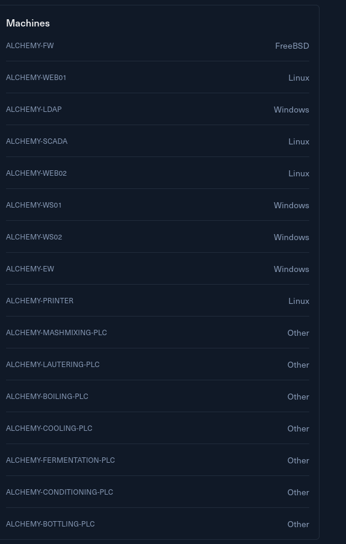

# Introduction

Alchemy LLC has been contracted by Sogard Brewing Co. to evaluate the security of their recently established brewery factory. The primary aim of this collaboration is to fortify the factory against potential cyber threats, ensuring the safety, security, and reliability of its operations. A crucial aspect of this initiative is the integration of Information Technology (IT) networks with Operational Technology (OT) infrastructure. A move aimed at enhancing the oversight, control, and efficiency of the brewery's operations.  
<br/>This new Industrial Control Systems (ICS) environment is equipped with a set of proprietary Programmable Logic Controllers (PLCs). Each PLC is accompanied by a Human Machine Interface (HMI) and an alarm monitoring system, which warns the operators when the system detects process anomalies.  
<br/>The team's main objective is to determine whether brewery operations can be disrupted based on current architecture. The team should assess the company's public interface (i.e., the IT network) and emphasize the weaknesses allowing an adversary to impact the physical process or steal the brewery's Intellectual Property (IP).  
<br/>Rules of Engagement:

- This environment does not require brute forcing or unreasonable guessing. All the required information is readily available within the lab, provided through comprehensive documentation and various files.
- When assessing the OT side, avoid fuzzing the PLCs. This practice is strongly discouraged in real OT environments due to the risk of causing instability and undefined behaviour.

This **Red Team Operator Level 2** lab will expose players to:  
<br/>

- Enumeration of IT and OT networks
- Exploiting misconfigurations
- Lateral movement
- Privilege escalation
- Tunneling and pivoting
- Documentation analysis
- Modbus network analysis
- Web application attacks
- In-depth understanding of Modbus protocol
- Structured Text PLC code review
- Dynamic Analysis of Ladder Logic

&nbsp;

# Entry Points

Same as usual the challenge proposes a **/24** subnet as entry point for the challenge.


And I can also see a quick peek at the tech stack used by the infrastructure with a mix of both WIndows and Linux machines, plus some PLCs here and there.



Now without further do I will enumerate all the alive hosts on this network.

# Fuzzing Alive hosts

I like to start by using FPING to check all the alive hosts that answer to ping.

```bash
└─$ fping -asqg 10.10.110.0/24
10.10.110.1
10.10.110.2
10.10.110.21
10.10.110.100

     254 targets
       4 alive
     250 unreachable
       0 unknown addresses

    1000 timeouts (waiting for response)
    1004 ICMP Echos sent
       4 ICMP Echo Replies received
      11 other ICMP received

 23.2 ms (min round trip time)
 67.8 ms (avg round trip time)
 199 ms (max round trip time)
        9.844 sec (elapsed real time)


```

Now If i guess that the first 2 were part of the network stack and it should not be involved at all.

&nbsp;

&nbsp;