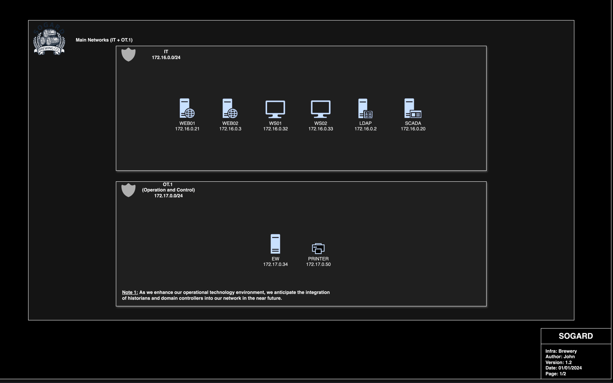
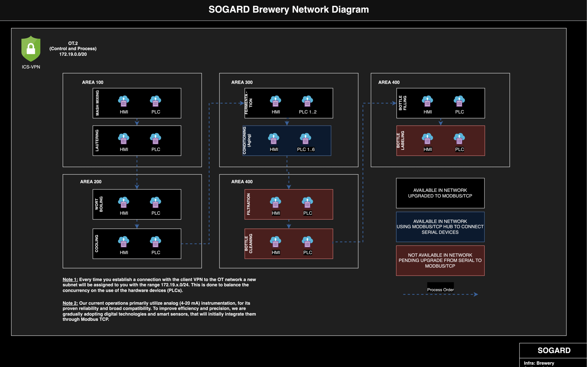
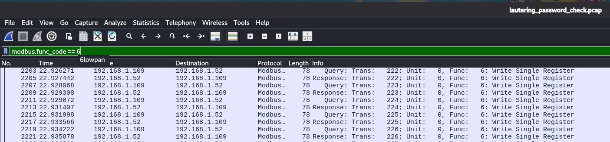
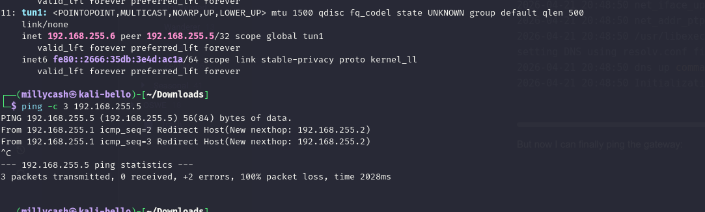

As usual I will start by checking for all the alive services over all the TCP protocol:

```bash
PORT     STATE SERVICE    REASON         VERSION
22/tcp   open  ssh        syn-ack ttl 64 OpenSSH 8.4p1 Debian 5+deb11u3 (protocol 2.0)
| ssh-hostkey: 
|   3072 9a:87:07:c6:bf:b1:2a:17:ed:3e:f1:83:a7:06:82:f8 (RSA)
| ssh-rsa AAAAB3NzaC1yc2EAAAADAQABAAABgQDdjkpOpM7WQdyGVnvOpucgUxiIb0NIOyxrTve+gi0MnOJJNxAuiqbp2JdMbxg0NVh7/pFP4nOSbgpaoAw0oAYIObo75B+mPUwWZfzhv1eo9MBJmrNd8e5RRF1ReUBfBBZQ/tcptO4mIE3wzxW8JFtaJSG1jyJE+N+F/yLR7m4ezGZZ7jldGQjv+s80X686aMYDqhwpQfHxfDKJLymPxqvvZGihdKsEsL76Ar1rt+dXh54oS6jxN7nyysR2XiBX7Nrt3FTdQKq9R8Lcm27jaCjSt19OUAPiodFdRI0url+zlBQMsdC33tTFLmFU5hMPuqKOysXnWWzauBIgdCLjvhK8tGVUXOhu6iyaNAojAo8kfHeYEyQhiGM38rfIQsFLz1QOB5ThjOort0iESZj1mgwTNmF6ARYygcxbmZ8n0xZjV7fiag5p+l/MGae9hlpcEVBHrMq8l2uEylF1NP3PVoyctRumyU3c8Z8Tyxc8HsZoi/UAJhf0M76kYz0xo/KnAmM=
|   256 7f:fc:43:34:25:54:8b:3e:a7:68:f7:3f:d8:3c:49:72 (ED25519)
|_ssh-ed25519 AAAAC3NzaC1lZDI1NTE5AAAAIGCuFka1YKISO3J2pmTFj7keLEGzuMhTSNjkJHzF5Bt8
9100/tcp open  jetdirect? syn-ack ttl 64
Warning: OSScan results may be unreliable because we could not find at least 1 open and 1 closed port
Device type: specialized|general purpose
Running (JUST GUESSING): Google Fuchsia (87%), IBM z/OS 1.12.X (85%)
OS CPE: cpe:/o:google:fuchsia cpe:/o:ibm:zos:1.12
OS fingerprint not ideal because: Missing a closed TCP port so results incomplete
Aggressive OS guesses: Google Fuchsia (87%), IBM z/OS 1.12 (85%)
No exact OS matches for host (test conditions non-ideal).
TCP/IP fingerprint:
SCAN(V=7.99%E=4%D=4/21%OT=22%CT=%CU=%PV=Y%G=N%TM=69E73183%P=x86_64-pc-linux-gnu)
SEQ(SP=105%GCD=1%ISR=109%TI=I%CI=RD%II=RI%TS=A)
SEQ(SP=107%GCD=1%ISR=10A%TI=I%CI=RD%II=RI%TS=A)
OPS(O1=M5B4NNT11NW7%O2=M5B4NNT11NW7%O3=M5B4NNT11NW7%O4=M5B4NNT11NW7%O5=M5B4NNT11NW7%O6=M5B4NNT11)
WIN(W1=7200%W2=7200%W3=7200%W4=7200%W5=7200%W6=7200)
ECN(R=Y%DF=N%TG=40%W=7200%O=M5B4NW7%CC=N%Q=)
T1(R=Y%DF=N%TG=40%S=O%A=S+%F=AS%RD=0%Q=)
T2(R=Y%DF=N%TG=40%W=0%S=Z%A=S%F=AR%O=%RD=0%Q=)
T3(R=Y%DF=N%TG=40%W=7200%S=O%A=S+%F=AS%O=M5B4NNT11NW7%RD=0%Q=)
T4(R=Y%DF=N%TG=40%W=0%S=A%A=Z%F=R%O=%RD=0%Q=)
T5(R=Y%DF=N%TG=40%W=0%S=Z%A=S+%F=AR%O=%RD=0%Q=)
T6(R=Y%DF=N%TG=40%W=0%S=A%A=Z%F=R%O=%RD=0%Q=)
T7(R=Y%DF=N%TG=40%W=0%S=Z%A=S+%F=AR%O=%RD=0%Q=)
U1(R=N)
IE(R=Y%DFI=S%TG=40%CD=S)

```

# Printer

```bash
72.17.0.50:/webServer/default> cat csconfig
%
% ChaiServer configuration file
%
% This file contains the csconfig file for the laserjet ChaiServer
%
Port 80 timeout 0
%
% Document Root
%  Our document root points to a link on RAM disk.  This link will either point
%  to the default webServer directory on the ROM disk or to a directory on
%  some permanant storage device if it is installed
%
DocumentRoot "file:////hpmnt/webServer/home/"
% ExtraPath Information 
ExtraPath hp/device
% Platform Type
PlatformType Vectra
% Number of typers to start
StartTypers 4
% Keep-Alive parameters
KeepAlive Timeout 1 MaxConnections 5
% Keystore implementation class
KEYSTORE_IMPL hp.laserjet.keystoremanager.DeviceKeyStoreImpl
% The following packages exist
Worker "hp/chaiserver/webserver/WebServer"
{
    StartWorkers 2 
    MimeType hp/webserver webserver
    MimeType text/html html
    MimeType text/plain txt java
    MimeType image/gif gif
    MimeType image/jpeg jpg jpeg
    MimeType application/zip zip
    MimeType text/css css
    MimeType application/x-javascript js
    MimeType application/java-archive jar
    Param "HOMEPAGE_OBJECT" "this.LCDispatcher" 
}

Worker "hp/chaiservice/basicgatekeeper/GateKeeperStub"
{ 
    StartWorkers 1 
    MimeType hp/gatekeeper gk 
    Object
    { 
        Name "Master" 
        LinkID master.gk 
        Description "Basic GateKeeper" 
        Preload 
    } 
}

% StartWorkers was reset to 1 by Al Youngwerth to resolve
% defect 45006. The real solution to this problem is to
% make ChaiServices thread-safe. The easiest solution to 
% that problem is to have each Stub create an instance of
% the worker's object(s) in the constructor, and then have
% the stub's ceateObject function return the handle to the
% object (instead of instantiating a new one). An example 
% of this can be found in: 
% /fw/subsystems/jvm/chaiserver/tests/ChaiTestService/ChaiTestServiceStub.java. % The only other issue is initWorkerArgs will only be called for the
% first worker in the list of workers. To remedy this problem
% (without additional changes to chaiserver), move the initialization
% code in initWorkerArgs to the worker object's constructor (as long 
% as the initWorkerArgs code is not dependent on any of the parameters
% that are passed to initWorkerArgs. If object is dependent on the
% args passed into initWorkerArgs, then we've got to make some changes
% to how initObject works in Handler.java (may have some backwards
% compatibility issues to deal with)).

Worker "hp/solutions/navigation/LCDispatcherStub"
{
    StartWorkers 1
    MimeType LCDispatcher LCDispatcher
    Object
    {
        Name "LCDispatcher"
        LinkID this.LCDispatcher
        Description "Draw the Lochsa navigation and home page"
        CreateLink
        Preload
    }
}

Worker "hp/solutions/rcp/GIFServerStub"
{
    StartWorkers 1 
    MimeType GIFServer GIFServer
    Object
    {
        Name "GIFServer"
        LinkID this.GIFServer
        Description "Serves up GIF Files"
        CreateLink
        Preload
    }
}

Worker "hp/solutions/emailpages/EmailPagesStub"
{
    StartWorkers 1
    MimeType configpage configpage
    Object
    {
        Name "EmailPages"
        LinkID this.configpage
        Description "Emails a config or status page from an email message"
        Preload
    }
}

Worker "hp/solutions/pages/LCLinkedPageStub"
{
    StartWorkers 1
    MimeType LCLinkedPageImpl LCLinkedPageImpl
    Object
    {
        Name "LCLinkedPageImpl"
        LinkID this.LCLinkedPageImpl
        Description "."
        CreateLink
        Preload
    }
}

Worker hp/chaiserver/loader/LoaderStub
{
    StartWorkers 1
    MimeType hp/loader loader
    Object
    {
        Name "Loader"
        LinkID this.loader
        Description "Use this object to load new packages onto this server"
        Preload
    }
}

Worker "hp/solutions/navigation/Tab_InfoStub"
{
    StartWorkers 1
    MimeType hpx hpx
    Object
    {
        Name "Tab_Info"
        LinkID tab_info.hpx
        Description "Serves up information for dynamic category tabs"
        CreateLink
        Preload
    }
}

Worker "hp/deviceinfo/Device_InfoStub"
{
    StartWorkers 1
    MimeType hp/deviceInfo deviceInfo
    Object
    {
        Name "Device_InfoImpl"
        LinkID hp.deviceInfo
        Description "serves up device configuration"
        CreateLink
        Preload
    }
}
172.17.0.50:/webServer/default
```

That port TCP/9100 is an indicator that this is most definitely a printer of some sort.

```bash
msf auxiliary(scanner/printer/printer_list_dir) >  use auxiliary/scanner/printer/printer_version_info
msf auxiliary(scanner/printer/printer_version_info) > run
[*] 172.17.0.50:9100      - Scanned 1 of 1 hosts (100% complete)
[*] Auxiliary module execution completed
msf auxiliary(scanner/printer/printer_version_info) > 

```

Is this a printer or what? But seems pdj was the protocoll to use:

```bash
python3 pret.py 172.17.0.50 pjl
/home/user/Downloads/Tools/PRET/pret.py:55: SyntaxWarning: invalid escape sequence '\|'
  print("  |-||/_____\||-.  | |´         dumpster diving obsolete‥ 」       ")
      ________________                                             
    _/_______________/|                                            
   /___________/___//||   PRET | Printer Exploitation Toolkit v0.40
  |===        |----| ||    by Jens Mueller <jens.a.mueller@rub.de> 
  |           |   ô| ||                                            
  |___________|   ô| ||                                            
  | ||/.´---.||    | ||      「 pentesting tool that made          
  |-||/_____\||-.  | |´         dumpster diving obsolete‥ 」       
  |_||=L==H==||_|__|/                                              
                                                                   
     (ASCII art by                                                 
     Jan Foerster)                                                 
                                                                   
Connection to 172.17.0.50 established
Device:   hp LaserJet 4200


Welcome to the pret shell. Type help or ? to list commands.
172.17.0.50:/> help

Available commands (type help <topic>):
=======================================
append  delete    edit    free  info    mkdir      printenv  set        unlock 
cat     destroy   env     fuzz  load    nvram      put       site       version
cd      df        exit    get   lock    offline    pwd       status   
chvol   disable   find    help  loop    open       reset     timeout  
close   discover  flood   hold  ls      pagecount  restart   touch    
debug   display   format  id    mirror  print      selftest  traversal

172.17.0.50:/> 


```

From the printjob queue I was able to obtain some interesting documents:

```bash
172.17.0.50:/saveDevice/SavedJobs> cd InProgress/
172.17.0.50:/saveDevice/SavedJobs/InProgress> ls
-   229593   Axel_Operator_Orientation_Document.pdf
-  2397037   brewery_network_diagram.pdf
172.17.0.50:/saveDevice/SavedJobs/InProgress> get Axel_Operator_Orientation_Document.pdf
229593 bytes received.
172.17.0.50:/saveDevice/SavedJobs/InProgress> get brewery_network_diagram.pdf
2397037 bytes received. 
172.17.0.50:/saveDevice/SavedJobs/InProgress> 


```

I don't see any possibility of path trasversal:

```bash
Path traversal set.
172.17.0.50:/> ls ../../../
d        -   PJL
d        -   PostScript
d        -   saveDevice
d        -   webServer
172.17.0.50:/> 


```

Now the files seems base64 encoded:

```bash
cat Axel_Operator_Orientation_Document.pdf| base64 -d > Axel_Operator_Orientation_Document.pdf
                                                                                                                                                               
┌──(user㉿kali-almi)-[~/Downloads/Alchemy]
└─$ cat brewery_network_diagram.pdf| base64 -d > brewery_network_diagram.pdf
                                                                                                                                                               
┌──(user㉿kali-almi)-[~/Downloads/Alchemy]
└─$ file brewery_network_diagram.pdf           
brewery_network_diagram.pdf: PDF document, version 1.3
                                                                                                                                                               
file Axel_Operator_Orientation_Document.pdf brewery_network_diagram.pdf
Axel_Operator_Orientation_Document.pdf: PDF document, version 1.4, 5 page(s)
brewery_network_diagram.pdf:            PDF document, version 1.3, 2 page(s)

```

Now from the diagram i can see the following machines:  




Now another flag is in the other pdf:


I can also see traces on another set of credentials?


# Getting the pivoting

Now since I am not able to find the way to get into this machine I start to think that root is not required here? I a know there are 7 different plc machines:


And I am missing 7 flags this must mean I can move on.

But before it is time to parse the password of the Lauthering plc so ai suggested to fiter out the modbus in wireshark with this flag:



Now when parsing the tcp data, might this one be the password?

```bash
00000000  00 dc 00 00 00 06 00 06  0f 7c 00 38               ........ .|.8
    00000000  00 dc 00 00 00 06 00 06  0f 7c 00 38               ........ .|.8
0000000C  00 dd 00 00 00 06 00 06  0f 4f 00 5a               ........ .O.Z
    0000000C  00 dd 00 00 00 06 00 06  0f 4f 00 5a               ........ .O.Z
00000018  00 de 00 00 00 06 00 06  0f 4c 00 41               ........ .L.A
    00000018  00 de 00 00 00 06 00 06  0f 4c 00 41               ........ .L.A
00000024  00 df 00 00 00 06 00 06  0f 35 00 6e               ........ .5.n
    00000024  00 df 00 00 00 06 00 06  0f 35 00 6e               ........ .5.n
00000030  00 e0 00 00 00 06 00 06  0f fa 00 33               ........ ...3
    00000030  00 e0 00 00 00 06 00 06  0f fa 00 33               ........ ...3
0000003C  00 e1 00 00 00 06 00 06  0f 57 00 54               ........ .W.T
    0000003C  00 e1 00 00 00 06 00 06  0f 57 00 54               ........ .W.T
00000048  00 e2 00 00 00 06 00 06  0f 99 00 4d               ........ ...M
    00000048  00 e2 00 00 00 06 00 06  0f 99 00 4d               ........ ...M
00000054  00 e3 00 00 00 06 00 06  0f f2 00 7a               ........ ...z
    00000054  00 e3 00 00 00 06 00 06  0f f2 00 7a               ........ ...z
00000060  00 e4 00 00 00 06 00 06  0f b3 00 43               ........ ...C
    00000060  00 e4 00 00 00 06 00 06  0f b3 00 43               ........ ...C
0000006C  00 e5 00 00 00 06 00 06  0f 8e 00 31               ........ ...1
    0000006C  00 e5 00 00 00 06 00 06  0f 8e 00 31               ........ ...1
00000078  00 e6 00 00 00 06 00 06  0f f8 00 40               ........ ...@
    00000078  00 e6 00 00 00 06 00 06  0f f8 00 40               ........ ...@
00000084  00 e7 00 00 00 06 00 06  0f 5c 00 6a               ........ .\.j
    00000084  00 e7 00 00 00 06 00 06  0f 5c 00 6a               ........ .\.j
00000090  00 e8 00 00 00 06 00 06  0f 6f 00 2a               ........ .o.*
    00000090  00 e8 00 00 00 06 00 06  0f 6f 00 2a               ........ .o.*
0000009C  00 e9 00 00 00 06 00 06  0f fe 00 4b               ........ ...K
    0000009C  00 e9 00 00 00 06 00 06  0f fe 00 4b               ........ ...K
000000A8  00 ea 00 00 00 06 00 06  0f 60 00 55               ........ .`.U
    000000A8  00 ea 00 00 00 06 00 06  0f 60 00 55               ........ .`.U
000000B4  00 eb 00 00 00 06 00 06  0f d9 00 21               ........ ...!
    000000B4  00 eb 00 00 00 06 00 06  0f d9 00 21               ........ ...!
000000C0  00 ec 00 00 00 06 00 03  00 00 00 0a               ........ ....
    000000C0  00 ec 00 00 00 17 00 03  14 00 00 00 00 00 00 00   ........ ........
    000000D0  00 00 00 00 00 00 00 00  00 00 00 00 00            ........ .....
000000CC  00 ed 00 00 00 06 00 04  00 00 00 0a               ........ ....
    000000DD  00 ed 00 00 00 17 00 04  14 00 00 00 00 00 00 00   ........ ........
    000000ED  00 00 00 00 00 00 00 00  00 00 00 00 00            ........ .....
000000D8  00 ee 00 00 00 06 00 06  04 0a 00 0c               ........ ....

```

On the side I had to ask AI to use a specific openvpn command that allows the use of old and insecure cyphers:

```bash
 sudo openvpn --config client.ovpn --allow-compression yes --data-ciphers-fallback BF-CBC
2026-04-21 20:48:47 DEPRECATED OPTION: "--allow-compression yes" has been removed. We will use "asym" mode instead. See the manual page for more information.
2026-04-21 20:48:47 OpenVPN 2.7.1 x86_64-pc-linux-gnu [SSL (OpenSSL)] [LZO] [LZ4] [EPOLL] [PKCS11] [MH/PKTINFO] [AEAD] [DCO]
2026-04-21 20:48:47 library versions: OpenSSL 3.6.1 27 Jan 2026, LZO 2.10
2026-04-21 20:48:47 DCO version: 6.19.11+kali-amd64 #1 SMP PREEMPT_DYNAMIC Kali 6.19.11-1kali1 (2026-04-09)
2026-04-21 20:48:47 WARNING: INSECURE cipher (BF-CBC) with block size less than 128 bit (64 bit).  This allows attacks like SWEET32.  Mitigate by using a --cipher with a larger block size (e.g. AES-256-CBC). Support for these insecure ciphers will be removed in OpenVPN 2.8.
2026-04-21 20:48:47 TCP/UDP: Preserving recently used remote address: [AF_INET]10.10.110.100:1194
2026-04-21 20:48:47 Attempting to establish TCP connection with [AF_INET]10.10.110.100:1194
2026-04-21 20:48:47 TCP connection established with [AF_INET]10.10.110.100:1194
2026-04-21 20:48:47 TCPv4_CLIENT link local: (not bound)
2026-04-21 20:48:47 TCPv4_CLIENT link remote: [AF_INET]10.10.110.100:1194
2026-04-21 20:48:49 [10.10.110.100] Peer Connection Initiated with [AF_INET]10.10.110.100:1194
2026-04-21 20:48:50 Options error: Unrecognized option or missing or extra parameter(s) in [PUSH-OPTIONS]:1: block-outside-dns (2.7.1)
2026-04-21 20:48:50 TUN/TAP device tun1 opened
2026-04-21 20:48:50 tun/tap device [tun1] opened
2026-04-21 20:48:50 net_iface_mtu_set: mtu 1500 for tun1
2026-04-21 20:48:50 net_iface_up: set tun1 up
2026-04-21 20:48:50 net_addr_ptp_v4_add: 192.168.255.6 peer 192.168.255.5 dev tun1
2026-04-21 20:48:50 /usr/libexec/openvpn/dns-updown
setting DNS using resolv.conf file
2026-04-21 20:48:50 dns up command exited with status 0
2026-04-21 20:48:50 Initialization Sequence Completed


```

But now I can finally ping the gateway:



Which means how I can perform a ping-sweep scan to discover the IPs?

```bash
─$ fping -asqg 172.19.0.0/20
172.19.1.1
172.19.1.2
172.19.1.3
172.19.1.4
172.19.1.5
172.19.1.6
172.19.1.7
172.19.1.8
172.19.1.9
172.19.1.10
172.19.1.11
172.19.1.12
172.19.1.13
172.19.1.14
172.19.1.254
172.19.2.1
172.19.3.1
172.19.4.1
172.19.5.1
172.19.6.1
172.19.7.1
172.19.8.1
172.19.9.1
172.19.10.1

    4094 targets
      24 alive
    4070 unreachable
       0 unknown addresses

   16280 timeouts (waiting for response)
   16304 ICMP Echos sent
      24 ICMP Echo Replies received
     799 other ICMP received

 43.7 ms (min round trip time)
 270 ms (avg round trip time)
 405 ms (max round trip time)
       84.107 sec (elapsed real time)

```

At the same time a quick scan shows the following open services:  
<br/>