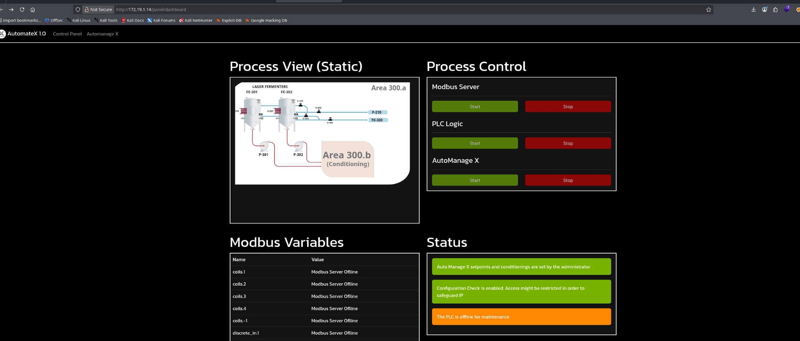

Same as usual I will perform a full scan of all the TCP ports open on the machine.

```bash
PORT   STATE SERVICE REASON         VERSION
80/tcp open  http    syn-ack ttl 63 Werkzeug httpd 3.0.1 (Python 3.9.18)
| http-methods: 
|_  Supported Methods: HEAD OPTIONS GET
| http-title: AutomateX v1.0 - Log-in
|_Requested resource was /panel/login
|_http-server-header: Werkzeug/3.0.1 Python/3.9.18
|_http-favicon: Unknown favicon MD5: 0F3DE871EF03C6DEFBC30A9950F28C6C
Warning: OSScan results may be unreliable because we could not find at least 1 open and 1 closed port
Device type: general purpose
Running: Linux 4.X|5.X
OS CPE: cpe:/o:linux:linux_kernel:4 cpe:/o:linux:linux_kernel:5
OS details: Linux 4.15 - 5.19
TCP/IP fingerprint:
OS:SCAN(V=7.99%E=4%D=4/21%OT=80%CT=%CU=34423%PV=Y%DS=2%DC=T%G=N%TM=69E7D26C
OS:%P=x86_64-pc-linux-gnu)SEQ(SP=106%GCD=1%ISR=109%TI=Z%CI=Z%II=I%TS=9)OPS(
OS:O1=M54EST11NW7%O2=M54EST11NW7%O3=M54ENNT11NW7%O4=M54EST11NW7%O5=M54EST11
OS:NW7%O6=M54EST11)WIN(W1=FE88%W2=FE88%W3=FE88%W4=FE88%W5=FE88%W6=FE88)ECN(
OS:R=Y%DF=Y%T=40%W=FAF0%O=M54ENNSNW7%CC=Y%Q=)T1(R=Y%DF=Y%T=40%S=O%A=S+%F=AS
OS:%RD=0%Q=)T2(R=N)T3(R=N)T4(R=Y%DF=Y%T=40%W=0%S=A%A=Z%F=R%O=%RD=0%Q=)T5(R=
OS:Y%DF=Y%T=40%W=0%S=Z%A=S+%F=AR%O=%RD=0%Q=)T6(R=Y%DF=Y%T=40%W=0%S=A%A=Z%F=
OS:R%O=%RD=0%Q=)U1(R=Y%DF=N%T=40%IPL=164%UN=0%RIPL=G%RID=G%RIPCK=G%RUCK=G%R
OS:UD=G)IE(R=Y%DFI=N%T=40%CD=S)

Uptime guess: 37.103 days (since Sun Mar 15 18:10:48 2026)
Network Distance: 2 hops
TCP Sequence Prediction: Difficulty=262 (Good luck!)
IP ID Sequence Generation: All zeros

TRACEROUTE (using port 80/tcp)
HOP RTT       ADDRESS
1   600.17 ms 192.168.255.1
2   600.18 ms 172.19.1.14
```

# HTTP

Same story goes here but the PLC seems offline?

