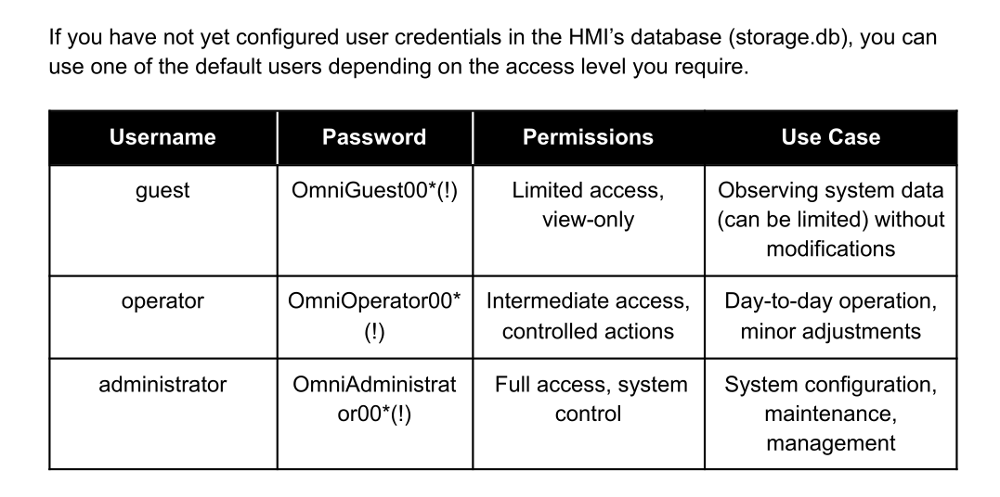
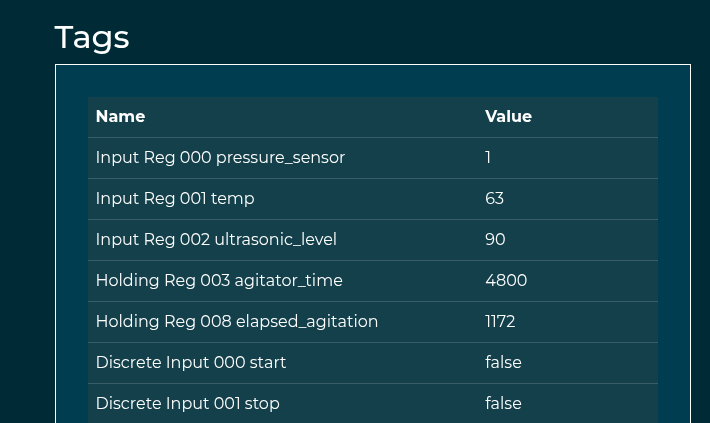
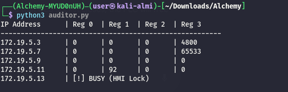

Same as usual I will perform a full scan of all the TCP ports open on the machine.

```bash
PORT   STATE SERVICE REASON         VERSION
80/tcp open  http    syn-ack ttl 63 Werkzeug httpd 3.0.1 (Python 3.9.18)
|_http-favicon: Unknown favicon MD5: F50F5CED9F5595CD8474030308510D7B
| http-title: OmniPLC v1.0 - Log-in
|_Requested resource was /panel/login
|_http-server-header: Werkzeug/3.0.1 Python/3.9.18
| http-methods: 
|_  Supported Methods: GET OPTIONS HEAD
Warning: OSScan results may be unreliable because we could not find at least 1 open and 1 closed port
Device type: general purpose|router
Running: Linux 4.X|5.X, MikroTik RouterOS 7.X
OS CPE: cpe:/o:linux:linux_kernel:4 cpe:/o:linux:linux_kernel:5 cpe:/o:mikrotik:routeros:7 cpe:/o:linux:linux_kernel:5.6.3
OS details: Linux 4.15 - 5.19, Linux 5.0 - 5.14, MikroTik RouterOS 7.2 - 7.5 (Linux 5.6.3)
TCP/IP fingerprint:
OS:SCAN(V=7.99%E=4%D=4/21%OT=80%CT=%CU=30919%PV=Y%DS=2%DC=T%G=N%TM=69E7C9F1
OS:%P=x86_64-pc-linux-gnu)SEQ(SP=103%GCD=1%ISR=106%TI=Z%CI=Z%II=I%TS=B)SEQ(
OS:SP=104%GCD=1%ISR=108%TI=Z%CI=Z%II=I%TS=A)OPS(O1=M54EST11NW7%O2=M54EST11N
OS:W7%O3=M54ENNT11NW7%O4=M54EST11NW7%O5=M54EST11NW7%O6=M54EST11)WIN(W1=FE88
OS:%W2=FE88%W3=FE88%W4=FE88%W5=FE88%W6=FE88)ECN(R=Y%DF=Y%T=40%W=FAF0%O=M54E
OS:NNSNW7%CC=Y%Q=)T1(R=Y%DF=Y%T=40%S=O%A=S+%F=AS%RD=0%Q=)T2(R=N)T3(R=N)T4(R
OS:=Y%DF=Y%T=40%W=0%S=A%A=Z%F=R%O=%RD=0%Q=)T5(R=Y%DF=Y%T=40%W=0%S=Z%A=S+%F=
OS:AR%O=%RD=0%Q=)T6(R=Y%DF=Y%T=40%W=0%S=A%A=Z%F=R%O=%RD=0%Q=)U1(R=Y%DF=N%T=
OS:40%IPL=164%UN=0%RIPL=G%RID=G%RIPCK=G%RUCK=G%RUD=G)IE(R=Y%DFI=N%T=40%CD=S
OS:)

Uptime guess: 32.761 days (since Fri Mar 20 01:47:14 2026)
Network Distance: 2 hops
TCP Sequence Prediction: Difficulty=260 (Good luck!)
IP ID Sequence Generation: All zeros


```

# HTTP

From the frontend I can see this should be a portal to the OmniPLC login page?


Now from the guide I found this default credentials:



And the only user that worked was guest so my idea was not to fooprint which HMI is tied to which PLC and the (OmniPLC HMI on .2) has this particulat registry golder:



Here I asked Gemini to make me a quick strcito that enumerates the registy and as you see the .3 is the PLC attached to this one:

```bash
import socket
import struct
import time

targets = ["172.19.5.3", "172.19.5.7", "172.19.5.9", "172.19.5.11", "172.19.5.13"]

# CONFIGURATION
START_ADDR = 0
REG_COUNT = 50 

def get_modbus_data(ip, fc):
    # FC 03 = Holding, FC 04 = Input
    payload = struct.pack(">HHHBBHH", 0x0001, 0x0000, 0x0006, 0x01, fc, START_ADDR, REG_COUNT)
    try:
        s = socket.socket(socket.AF_INET, socket.SOCK_STREAM)
        s.settimeout(0.8)
        s.connect((ip, 502))
        s.send(payload)
        response = s.recv(2048)
        s.close()
        if len(response) >= 9:
            data_bytes = response[9:]
            return struct.unpack(f">{len(data_bytes)//2}H", data_bytes)
    except:
        return None
    return None

for ip in targets:
    print(f"\nAUDIT REPORT: {ip}")
    print(f"{'Address':<8} | {'Holding (FC03)':<15} | {'Input (FC04)':<15}")
    print("-" * 45)
    
    holdings = get_modbus_data(ip, 3)
    inputs = get_modbus_data(ip, 4)
    
    if holdings or inputs:
        # Loop through the range
        for i in range(REG_COUNT):
            h_val = holdings[i] if holdings and i < len(holdings) else 0
            i_val = inputs[i] if inputs and i < len(inputs) else 0
            
            # Only print if there is actual data in one of them
            if h_val != 0 or i_val != 0:
                marker = ""
                if h_val == 11100 or i_val == 11100: marker = " <--- BOIL_TIME"
                if h_val == 4800 or i_val == 4800: marker = " <--- AGITATOR"
                
                print(f"{i + START_ADDR:<8} | {h_val:<15} | {i_val:<15}{marker}")
    else:
        print(f"{' ':^45} [!] DEVICE BUSY / OFFLINE")
    
    time.sleep(0.1)
```

