Same as usual I will perform a full scan of all the TCP ports open on the machine.

```bash
PORT   STATE SERVICE REASON         VERSION
80/tcp open  http    syn-ack ttl 63 Werkzeug httpd 3.0.1 (Python 3.9.18)
|_http-favicon: Unknown favicon MD5: 309D35C9DFD67E652C06B2A79425B50F
| http-methods: 
|_  Supported Methods: HEAD GET OPTIONS
| http-title: SimplePLC v2.1 - Log-in
|_Requested resource was /panel/login
|_http-server-header: Werkzeug/3.0.1 Python/3.9.18
Warning: OSScan results may be unreliable because we could not find at least 1 open and 1 closed port
Device type: general purpose|router
Running: Linux 4.X|5.X, MikroTik RouterOS 7.X
OS CPE: cpe:/o:linux:linux_kernel:4 cpe:/o:linux:linux_kernel:5 cpe:/o:mikrotik:routeros:7 cpe:/o:linux:linux_kernel:5.6.3
OS details: Linux 4.15 - 5.19, Linux 5.0 - 5.14, MikroTik RouterOS 7.2 - 7.5 (Linux 5.6.3)
TCP/IP fingerprint:
OS:SCAN(V=7.99%E=4%D=4/21%OT=80%CT=%CU=32526%PV=Y%DS=2%DC=T%G=N%TM=69E7CCA9
OS:%P=x86_64-pc-linux-gnu)SEQ(SP=101%GCD=1%ISR=10B%TI=Z%CI=Z%II=I%TS=A)OPS(
OS:O1=M54EST11NW7%O2=M54EST11NW7%O3=M54ENNT11NW7%O4=M54EST11NW7%O5=M54EST11
OS:NW7%O6=M54EST11)WIN(W1=FE88%W2=FE88%W3=FE88%W4=FE88%W5=FE88%W6=FE88)ECN(
OS:R=Y%DF=Y%T=40%W=FAF0%O=M54ENNSNW7%CC=Y%Q=)T1(R=Y%DF=Y%T=40%S=O%A=S+%F=AS
OS:%RD=0%Q=)T2(R=N)T3(R=N)T4(R=Y%DF=Y%T=40%W=0%S=A%A=Z%F=R%O=%RD=0%Q=)T5(R=
OS:Y%DF=Y%T=40%W=0%S=Z%A=S+%F=AR%O=%RD=0%Q=)T6(R=Y%DF=Y%T=40%W=0%S=A%A=Z%F=
OS:R%O=%RD=0%Q=)U1(R=Y%DF=N%T=40%IPL=164%UN=0%RIPL=G%RID=G%RIPCK=G%RUCK=G%R
OS:UD=G)IE(R=Y%DFI=N%T=40%CD=S)

Uptime guess: 41.799 days (since Wed Mar 11 01:03:37 2026)
Network Distance: 2 hops
TCP Sequence Prediction: Difficulty=257 (Good luck!)
IP ID Sequence Generation: All zeros

TRACEROUTE (using port 80/tcp)
HOP RTT       ADDRESS
1   235.94 ms 192.168.255.1
2   235.98 ms 172.19.1.6

```

# HTTP

Here again I can see another portal to a login page, this time from a third provider called simple plc:  


ow here while using the same script to enumerate the holding registries I see that these values:

```
┌──(Alchemy-MYUD0nUH)─(user㉿kali-almi)-[~/Downloads/Alchemy]
└─$ python3 auditor.py
IP Address      | Reg 0  | Reg 1  | Reg 2  | Reg 3 
-------------------------------------------------------
172.19.5.3      | 0      | 0      | 0      | 4800  
172.19.5.7      | 0      | 0      | 0      | 65533 
172.19.5.9      | 0      | 0      | 0      | 0     
172.19.5.11     | 0      | 92     | 0      | 0     
172.19.5.13     | [!] BUSY (HMI Lock)
```

Are defined in the HMI with IP .6:  


Now while this still uses the same PLC version it is not using the same password , but I think the write protection is not in place but instead i see 3 different units?

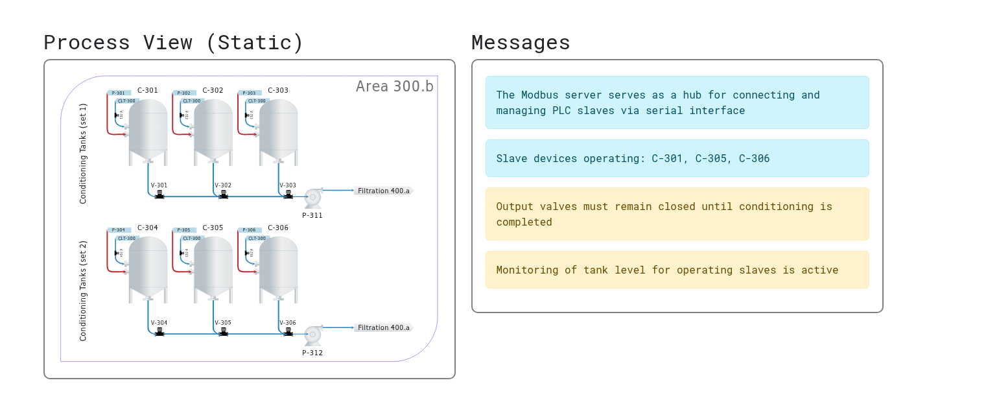

Now the challenge is clear:

- I need to flip the output_valve to true, while the conditioning is still false(aka still on going), this should result in a spillage?

Now I think the pass is this:  
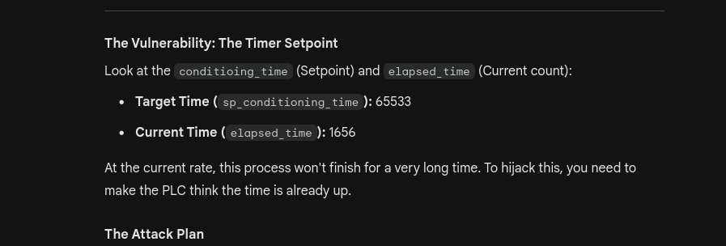

The interesting code is here:

```st
  cycle_on := NOT(stop) AND (cycle_on OR start);
  master := NOT(stop) AND (cycle_on OR start);
  intake_pump_material_a := NOT(stop_intake_a) AND cycle_on;
  _TMP_GE15_OUT := GE(ultrasonic_level, sp_material_a);
  stop_intake_a := cycle_on AND _TMP_GE15_OUT;
  _TMP_INT_TO_TIME67_OUT := INT_TO_TIME(sp_conditioning_time);
  conditioing_time := _TMP_INT_TO_TIME67_OUT;
  TON0(IN := stop_intake_a AND cycle_on, PT := conditioing_time);
  conditioning_completed := TON0.Q;
  elapsed_time_t := TON0.ET;
  _TMP_TIME_TO_INT68_OUT := TIME_TO_INT(elapsed_time_t);
  elapsed_time := _TMP_TIME_TO_INT68_OUT;
  output_valve := open_output_valve AND conditioning_completed AND cycle_on;
END_PROGRAM


```

Basically I need to:

- Lowering the Condition time to a low number that is lower that the elapsed time(for all the 3 units), should flip the conditioning_completed to true.
- This allows then to open the value for all of them 3 resulting in a spillage?

But i also  noticed that when i set a new conditioning time with the HR 3(1400 in the example) I see that a new HR 5 is cloned and the value of the elapsed timer gets hr 5 + 1, and this is not invoking the conditioning true  
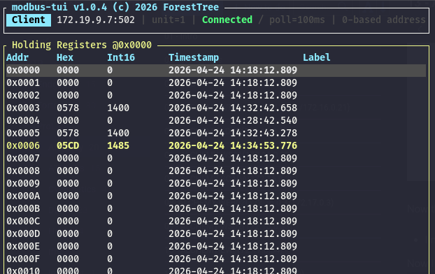

So setting something that is higher than the current elapsed timer works:  
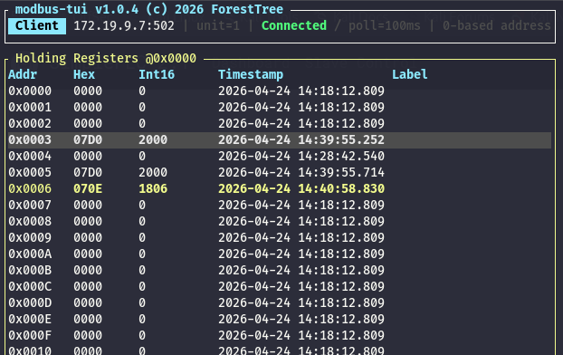

But here I was wrong apparently one of the pocs foud in the EW is the key here:  
<br/>

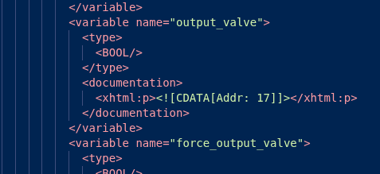

Apparently there is a force out put valve?

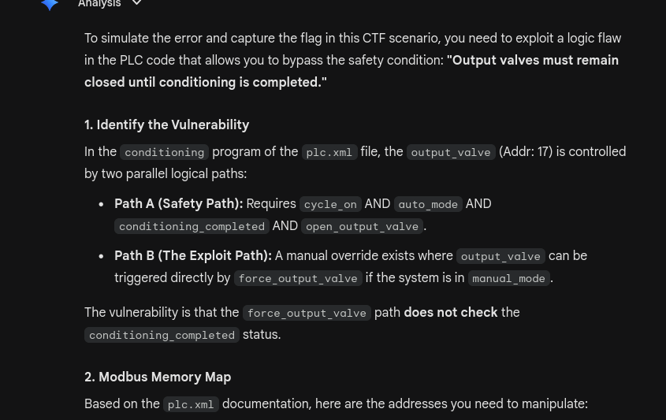

And this is the manual mode:  
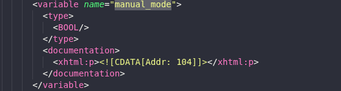

And when the manual mode is active you can perform a forceful spillage:  
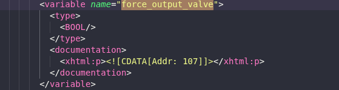

And again since the conditioning time by default is set to 24h it need to be lowerer to a number that is lower than the current elapsed time, that will invoke the end of the contioning time allowing to invoke the spillage.

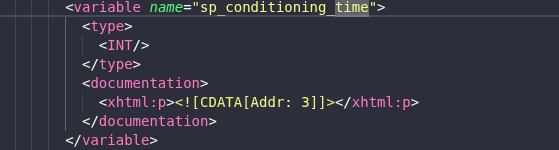

So first i enabled the manual mode across all 3 units:  
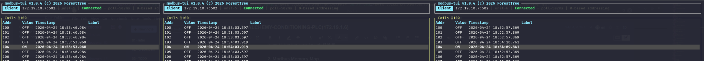Then do same for the force the opening of the valve:


But apparently, this was enough to invoke the spillage and grab another flag!

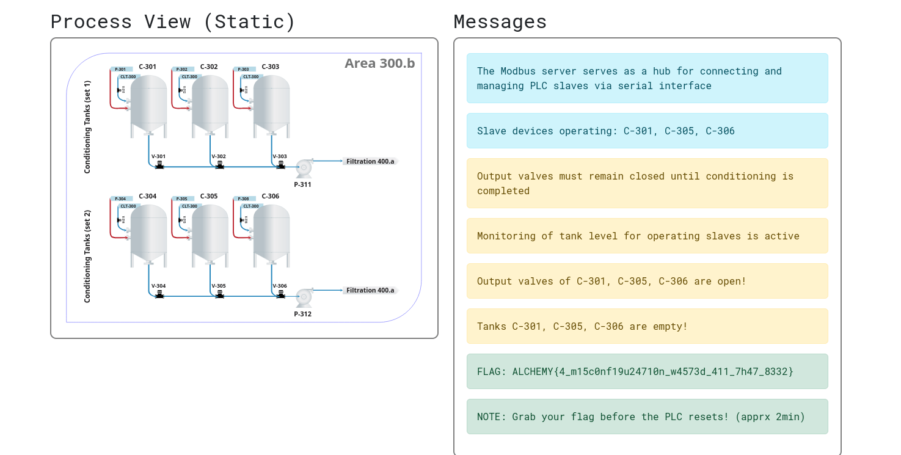