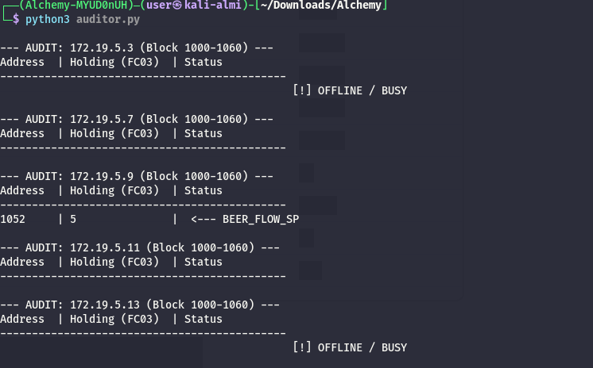
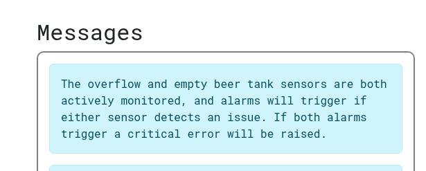
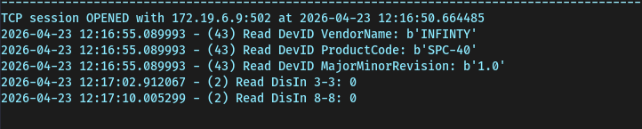

Same as usual I will perform a full scan of all the TCP ports open on the machine.

```bash
PORT   STATE SERVICE REASON         VERSION
80/tcp open  http    syn-ack ttl 63 Werkzeug httpd 3.0.1 (Python 3.9.18)
|_http-server-header: Werkzeug/3.0.1 Python/3.9.18
| http-methods: 
|_  Supported Methods: OPTIONS GET HEAD
|_http-favicon: Unknown favicon MD5: 309D35C9DFD67E652C06B2A79425B50F
| http-title: SimplePLC v1.0 - Log-in
|_Requested resource was /panel/login
Warning: OSScan results may be unreliable because we could not find at least 1 open and 1 closed port
Device type: general purpose
Running: Linux 4.X|5.X
OS CPE: cpe:/o:linux:linux_kernel:4 cpe:/o:linux:linux_kernel:5
OS details: Linux 4.15 - 5.19
TCP/IP fingerprint:
OS:SCAN(V=7.99%E=4%D=4/21%OT=80%CT=%CU=43095%PV=Y%DS=2%DC=T%G=N%TM=69E7CEE5
OS:%P=x86_64-pc-linux-gnu)SEQ(SP=101%GCD=1%ISR=105%TI=Z%CI=Z%II=I%TS=9)OPS(
OS:O1=M54EST11NW7%O2=M54EST11NW7%O3=M54ENNT11NW7%O4=M54EST11NW7%O5=M54EST11
OS:NW7%O6=M54EST11)WIN(W1=FE88%W2=FE88%W3=FE88%W4=FE88%W5=FE88%W6=FE88)ECN(
OS:R=Y%DF=Y%T=40%W=FAF0%O=M54ENNSNW7%CC=Y%Q=)T1(R=Y%DF=Y%T=40%S=O%A=S+%F=AS
OS:%RD=0%Q=)T2(R=N)T3(R=N)T4(R=Y%DF=Y%T=40%W=0%S=A%A=Z%F=R%O=%RD=0%Q=)T5(R=
OS:Y%DF=Y%T=40%W=0%S=Z%A=S+%F=AR%O=%RD=0%Q=)T6(R=Y%DF=Y%T=40%W=0%S=A%A=Z%F=
OS:R%O=%RD=0%Q=)U1(R=Y%DF=N%T=40%IPL=164%UN=0%RIPL=G%RID=G%RIPCK=G%RUCK=G%R
OS:UD=G)IE(R=Y%DFI=N%T=40%CD=S)

Uptime guess: 71.855 days (since Sun Feb  8 23:53:48 2026)
Network Distance: 2 hops
TCP Sequence Prediction: Difficulty=257 (Good luck!)
IP ID Sequence Generation: All zeros

TRACEROUTE (using port 80/tcp)
HOP RTT       ADDRESS
1   861.43 ms 192.168.255.1
2   861.44 ms 172.19.1.8


```

# HTTP

My enumeration script shows that the PLC tied to this HMI is on the IP .9:



```python
import socket
import struct
import time

targets = ["172.19.5.3", "172.19.5.7", "172.19.5.9", "172.19.5.11", "172.19.5.13"]

# Focus on the block identified in the .9 dashboard
START_ADDR = 1000
REG_COUNT = 60 

def get_modbus(ip, fc, addr, count):
    # FC 01=Coils, 02=Discrete In, 03=Holding, 04=Input
    payload = struct.pack(">HHHBBHH", 0x0001, 0x0000, 0x0006, 0x01, fc, addr, count)
    try:
        s = socket.socket(socket.AF_INET, socket.SOCK_STREAM)
        s.settimeout(0.6)
        s.connect((ip, 502))
        s.send(payload)
        response = s.recv(2048)
        s.close()
        if len(response) >= 9:
            data_bytes = response[9:]
            if fc in [1, 2]: # Bit-based
                return list(bin(int.from_bytes(data_bytes, 'big'))[2:].zfill(count))[::-1]
            return struct.unpack(f">{len(data_bytes)//2}H", data_bytes)
    except: return None
    return None

for ip in targets:
    print(f"\n--- AUDIT: {ip} (Block {START_ADDR}-{START_ADDR+REG_COUNT}) ---")
    print(f"{'Address':<8} | {'Holding (FC03)':<15} | {'Status'}")
    print("-" * 45)
    
    h_regs = get_modbus(ip, 3, START_ADDR, REG_COUNT)
    
    if h_regs:
        for i, val in enumerate(h_regs):
            if val != 0:
                addr = i + START_ADDR
                marker = ""
                if val == 11100: marker = " <--- TARGET: BOIL_TIME"
                if val == 5 and addr == 1052: marker = " <--- BEER_FLOW_SP"
                print(f"{addr:<8} | {val:<15} | {marker}")
    else:
        print(f"{' ':^45} [!] OFFLINE / BUSY")
    time.sleep(0.05)
```

Now I suspect the challenge is well described here:



Now the goal I guess is to flip **both discrete_in.03 overflow_sensor** & **discrete_in.08 empty_tank_sensor** to true and that will print the message error.

Now to be sure I am not talking shit I interrogated the discrete input 3 & 8 that right now shows 0 aka false:

