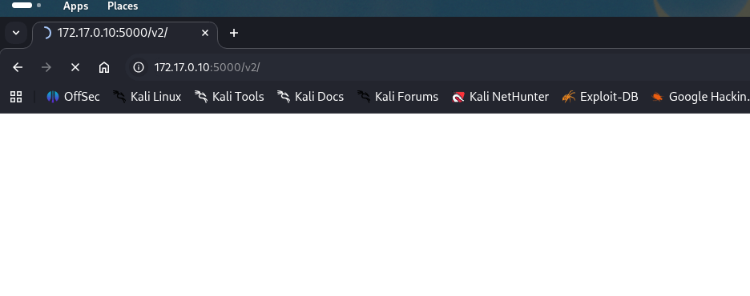

As usual I will start by checking for all the alive services over all the TCP protocol:

```bash
PORT     STATE SERVICE  REASON         VERSION
22/tcp   open  ssh      syn-ack ttl 64 OpenSSH 8.4p1 Debian 5+deb11u3 (protocol 2.0)
| ssh-hostkey: 
|   256 b2:9b:a6:04:75:21:49:0d:89:9d:31:f3:e1:f2:28:0b (ECDSA)
| ecdsa-sha2-nistp256 AAAAE2VjZHNhLXNoYTItbmlzdHAyNTYAAAAIbmlzdHAyNTYAAABBBELSpLWd0V5/uw9A7YeqVHXfpq2he6zyy00ZksGP4ogP3rSruETrfqaRPYBzV8XzHsffMryurwH1fkLtCopusV8=
|   256 7f:fc:43:34:25:54:8b:3e:a7:68:f7:3f:d8:3c:49:72 (ED25519)
|_ssh-ed25519 AAAAC3NzaC1lZDI1NTE5AAAAIGCuFka1YKISO3J2pmTFj7keLEGzuMhTSNjkJHzF5Bt8
5000/tcp open  ssl/http syn-ack ttl 64 Docker Registry (API: 2.0)
|_http-title: Site doesn't have a title.
| http-methods: 
|_  Supported Methods: GET HEAD POST OPTIONS
| ssl-cert: Subject: commonName=*.sogard.brew/organizationName=SOGARD/stateOrProvinceName=Kent/countryName=GB/localityName=Folkestone/emailAddress=info@sogard.brew/organizationalUnitName=SOGARD
| Subject Alternative Name: DNS:registry.sogard.brew
| Issuer: commonName=*.sogard.brew/organizationName=SOGARD/stateOrProvinceName=Kent/countryName=GB/localityName=Folkestone/emailAddress=info@sogard.brew/organizationalUnitName=SOGARD
| Public Key type: rsa
| Public Key bits: 4096
| Signature Algorithm: sha256WithRSAEncryption
| Not valid before: 2022-08-24T12:16:35
| Not valid after:  7022-10-01T12:16:35
| MD5:     09d4 0d58 4b6e 0527 ac3e ffe6 5d27 75a5
| SHA-1:   3835 0765 df6a 5ad0 ecda 7539 0e69 25fa b815 3ae4
| SHA-256: f7c2 d2c6 d974 6610 0d08 8f5e 520d e231 75cd 4f71 b223 a69f 221d b9ff d715 7911
| -----BEGIN CERTIFICATE-----
| MIIGHjCCBAagAwIBAgIUdMtft8c7+7HcxMdgX22Z1t3NVEkwDQYJKoZIhvcNAQEL
| BQAwgYwxCzAJBgNVBAYTAkdCMQ0wCwYDVQQIDARLZW50MRMwEQYDVQQHDApGb2xr
| ZXN0b25lMQ8wDQYDVQQKDAZTT0dBUkQxDzANBgNVBAsMBlNPR0FSRDEWMBQGA1UE
| AwwNKi5zb2dhcmQuYnJldzEfMB0GCSqGSIb3DQEJARYQaW5mb0Bzb2dhcmQuYnJl
| dzAgFw0yMjA4MjQxMjE2MzVaGA83MDIyMTAwMTEyMTYzNVowgYwxCzAJBgNVBAYT
| AkdCMQ0wCwYDVQQIDARLZW50MRMwEQYDVQQHDApGb2xrZXN0b25lMQ8wDQYDVQQK
| DAZTT0dBUkQxDzANBgNVBAsMBlNPR0FSRDEWMBQGA1UEAwwNKi5zb2dhcmQuYnJl
| dzEfMB0GCSqGSIb3DQEJARYQaW5mb0Bzb2dhcmQuYnJldzCCAiIwDQYJKoZIhvcN
| AQEBBQADggIPADCCAgoCggIBAOHLzUtC2/7M+rJ0lmKs/qNPYO9P4m9g3FSy8uL9
| W8POVqabuevGhIsLsEZ6nUwNNLeAYdfuooNnqvFbfYEccXqKem7NzQS2PBPDKdnQ
| ZxStT3DfOfjvyxWutH+vnl/AC3p6/6F34tR7ltwuNge7uYaEan2PpgsfTqNKmXmz
| BXSbOL0OBzH+GT+dh/itmvVPZR7inrGoV8akD4sLUUsafjljKu7MmQaazJicGV5R
| 6OrEkR0oisure8JPrXd8ie+BCu61DSdZSUzAt9qITtIj1MTQpbMifEBEMI2ZdZl5
| pWkAHOMct8re6c1HqMrMqd0ov/8CYn5DNsXTdXoBvjvPxaQsXjMvqUaZu5dzL/xs
| SijHJLlVGl4GjzfLxbvkuo/xmYiW4BM/cHCowIm+89lD39F1sJbu7TBjv5McNrY5
| oQfDDtAVdq7t5EBkiXNnrN809MDRlPshCE964ZrOhK3UdNkSDZbtpDBrRSeMV8Az
| uJcKRG5ZCng9nV3FE6n+Z/5MS2zMI5hFXHQrXWbqUTQmt7A7PQjNdHmy/nnsIJ8c
| YgTcnDw5NA2SkUVDX76et1KFfLEZQPxasjr/4OdJP08cke/3yE6Th/HPMB2IleFx
| kf7HadYF3d5E5DxUyQPE3EJH/9EHo3vGM61wMJuu1Axm9RYG1Y7/LIuiuP/op12m
| pVDZAgMBAAGjdDByMB0GA1UdDgQWBBQqztAWEDGOVd7fMopqIg8QYpOzIjAfBgNV
| HSMEGDAWgBQqztAWEDGOVd7fMopqIg8QYpOzIjAPBgNVHRMBAf8EBTADAQH/MB8G
| A1UdEQQYMBaCFHJlZ2lzdHJ5LnNvZ2FyZC5icmV3MA0GCSqGSIb3DQEBCwUAA4IC
| AQBT1JUvrcID0PvLIdBKt/J60weEcov+EiPfP6LSSIqXQuNHy7yxhtZeUORUfyXU
| LJj5bn0lNdAxM2HLH2cqdHpomRvHNYhnbGL3BBucWNJJstXttVgx23ZbzHwloODl
| 1U0AWqeFDSR2Xw5d7b5/O7P236HSXxvHr6uZq46XI51mB/Zi93TJrg/V9PMDa1I+
| OGyZiFKT3xBtKicCOgT6gJ90VFjG2p6rryFmrUnhLbsqxoM5SQ9QuI7WVyprCAWL
| 6lzniFMXGEW1SpvQnX52dG6hVq4d3Mv+DRRmq4QOAqwF0l1nurcDUsBtMuAlMzZC
| LPNAxk7LIALPjd8L9WUqljuLcuh8Tj/GZt6kp2/llIEaA7CSBO5G22irWhjPJmHQ
| LNtBwVRmdk+dKKf6buswwV3N9ti4ivrFAIyRxRNsTFKq+1njqAP+1ioFiBqgXyew
| YQI9LcPQ8KXaEt0BrHDv/9l/FUqzNwJ7c3a/FxYmUcxZ1rhssaNcCr2ZOgVGEA+z
| geNTxZAtqO2SVWK3+8Sz57X9GLZN/0gR/+GCGIMUBF/xMiobrU7DKHGYnPtJGneT
| XiGOOYpDC7mbSYxEYtyq3aq5I71C3qWCdU+8j+WHwOKx4ZuF+yf8pLZD8hcKqpBP
| 0ELYK8KBfKCZGCHDhdtaRP8zvWSFDoSxduJIkLtii3z0UA==
|_-----END CERTIFICATE-----
|_ssl-date: TLS randomness does not represent time
Warning: OSScan results may be unreliable because we could not find at least 1 open and 1 closed port
Device type: specialized|general purpose
Running (JUST GUESSING): Google Fuchsia (87%), IBM z/OS 1.12.X (85%)
OS CPE: cpe:/o:google:fuchsia cpe:/o:ibm:zos:1.12
OS fingerprint not ideal because: Missing a closed TCP port so results incomplete
Aggressive OS guesses: Google Fuchsia (87%), IBM z/OS 1.12 (85%)
No exact OS matches for host (test conditions non-ideal).
TCP/IP fingerprint:
SCAN(V=7.99%E=4%D=4/21%OT=22%CT=%CU=%PV=Y%G=N%TM=69E730AF%P=x86_64-pc-linux-gnu)
SEQ(SP=100%GCD=1%ISR=101%TI=I%CI=RD%II=RI%TS=A)
SEQ(SP=106%GCD=1%ISR=109%TI=I%CI=RD%II=RI%TS=A)
OPS(O1=M5B4NNT11NW7%O2=M5B4NNT11NW7%O3=M5B4NNT11NW7%O4=M5B4NNT11NW7%O5=M5B4NNT11NW7%O6=M5B4NNT11)
WIN(W1=7200%W2=7200%W3=7200%W4=7200%W5=7200%W6=7200)
ECN(R=Y%DF=N%TG=40%W=7200%O=M5B4NW7%CC=N%Q=)
T1(R=Y%DF=N%TG=40%S=O%A=S+%F=AS%RD=0%Q=)
T2(R=Y%DF=N%TG=40%W=0%S=Z%A=S%F=AR%O=%RD=0%Q=)
T3(R=Y%DF=N%TG=40%W=7200%S=O%A=S+%F=AS%O=M5B4NNT11NW7%RD=0%Q=)
T4(R=Y%DF=N%TG=40%W=0%S=A%A=Z%F=R%O=%RD=0%Q=)
T5(R=Y%DF=N%TG=40%W=0%S=Z%A=S+%F=AR%O=%RD=0%Q=)
T6(R=Y%DF=N%TG=40%W=0%S=A%A=Z%F=R%O=%RD=0%Q=)
T7(R=Y%DF=N%TG=40%W=0%S=Z%A=S+%F=AR%O=%RD=0%Q=)
U1(R=N)
IE(R=Y%DFI=S%TG=40%CD=S)

Uptime guess: 19.293 days (since Thu Apr  2 03:07:29 2026)
TCP Sequence Prediction: Difficulty=262 (Good luck!)
IP ID Sequence Generation: Incrementing by 2
Service Info: OS: Linux; CPE: cpe:/o:linux:linux_kernel

```

# HTTPS

The custom port TCP/5000 requires an login and specifically i was able to run a dirsearch scan showing the following folders:

```bash
dirsearch -u "https://172.17.0.10:5000/"                   
/usr/lib/python3/dist-packages/dirsearch/dirsearch.py:23: DeprecationWarning: pkg_resources is deprecated as an API. See https://setuptools.pypa.io/en/latest/pkg_resources.html
  from pkg_resources import DistributionNotFound, VersionConflict

  _|. _ _  _  _  _ _|_    v0.4.3
 (_||| _) (/_(_|| (_| )

Extensions: php, aspx, jsp, html, js | HTTP method: GET | Threads: 25 | Wordlist size: 11460

Output File: /home/user/Downloads/Alchemy/reports/https_172.17.0.10_5000/__26-04-21_13-59-04.txt

Target: https://172.17.0.10:5000/

[13:59:04] Starting: 
[13:59:04] 301 -    0B  - /%2e%2e//google.com  ->  /google.com
[13:59:05] 301 -    0B  - /.%2e/%2e%2e/%2e%2e/%2e%2e/etc/passwd  ->  /etc/passwd
[13:59:16] 301 -    0B  - /axis//happyaxis.jsp  ->  /axis/happyaxis.jsp
[13:59:16] 301 -    0B  - /axis2//axis2-web/HappyAxis.jsp  ->  /axis2/axis2-web/HappyAxis.jsp
[13:59:16] 301 -    0B  - /axis2-web//HappyAxis.jsp  ->  /axis2-web/HappyAxis.jsp
[13:59:17] 301 -    0B  - /cgi-bin/.%2e/%2e%2e/%2e%2e/%2e%2e/etc/passwd  ->  /etc/passwd
[13:59:17] 301 -    0B  - /Citrix//AccessPlatform/auth/clientscripts/cookies.js  ->  /Citrix/AccessPlatform/auth/clientscripts/cookies.js
[13:59:21] 301 -    0B  - /engine/classes/swfupload//swfupload_f9.swf  ->  /engine/classes/swfupload/swfupload_f9.swf
[13:59:21] 301 -    0B  - /engine/classes/swfupload//swfupload.swf  ->  /engine/classes/swfupload/swfupload.swf
[13:59:21] 301 -    0B  - /extjs/resources//charts.swf  ->  /extjs/resources/charts.swf
[13:59:23] 301 -    0B  - /html/js/misc/swfupload//swfupload.swf  ->  /html/js/misc/swfupload/swfupload.swf
[13:59:41] 301 -   39B  - /v2  ->  /v2/
[13:59:41] 401 -  145B  - /v2/_catalog
[13:59:41] 401 -   87B  - /v2/

Task Completed

```

And the Aepike credentials works for this login:



But I see the issue, this is a docker registtry damn it!

```bash
HTTP/2 401 Unauthorized
Content-Type: application/json; charset=utf-8
Docker-Distribution-Api-Version: registry/2.0
Www-Authenticate: Basic realm="Registry Realm"
X-Content-Type-Options: nosniff
Content-Length: 145
Date: Tue, 21 Apr 2026 12:14:28 GMT

{"errors":[{"code":"UNAUTHORIZED","message":"authentication required","detail":[{"Type":"registry","Class":"","Name":"catalog","Action":"*"}]}]}

```

And since none of the crentials i own right now works, then it means I need to wait with this machine-