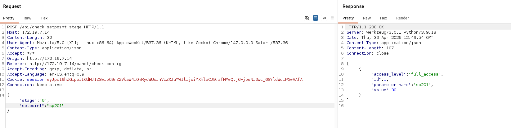
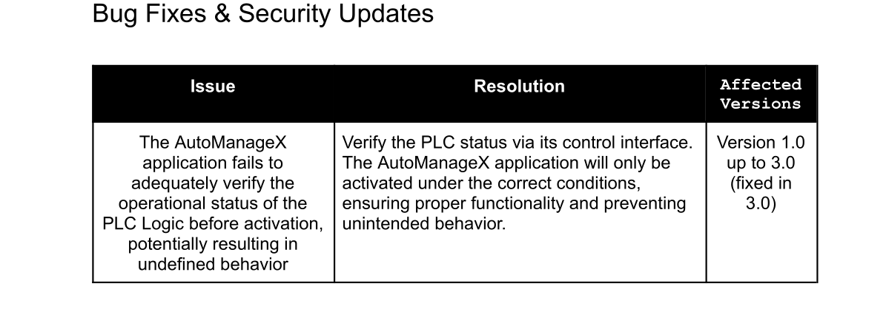
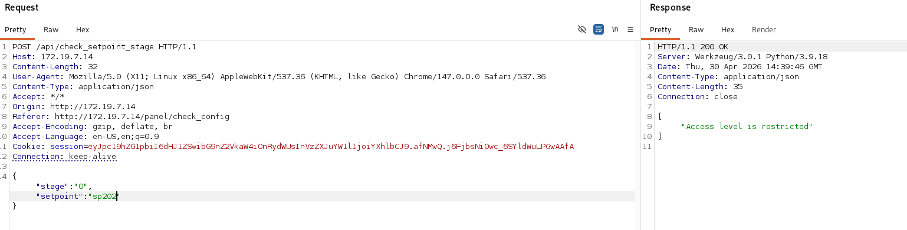

Same as usual I will perform a full scan of all the TCP ports open on the machine.

```bash
PORT   STATE SERVICE REASON         VERSION
80/tcp open  http    syn-ack ttl 63 Werkzeug httpd 3.0.1 (Python 3.9.18)
| http-methods: 
|_  Supported Methods: HEAD OPTIONS GET
| http-title: AutomateX v1.0 - Log-in
|_Requested resource was /panel/login
|_http-server-header: Werkzeug/3.0.1 Python/3.9.18
|_http-favicon: Unknown favicon MD5: 0F3DE871EF03C6DEFBC30A9950F28C6C
Warning: OSScan results may be unreliable because we could not find at least 1 open and 1 closed port
Device type: general purpose
Running: Linux 4.X|5.X
OS CPE: cpe:/o:linux:linux_kernel:4 cpe:/o:linux:linux_kernel:5
OS details: Linux 4.15 - 5.19
TCP/IP fingerprint:
OS:SCAN(V=7.99%E=4%D=4/21%OT=80%CT=%CU=34423%PV=Y%DS=2%DC=T%G=N%TM=69E7D26C
OS:%P=x86_64-pc-linux-gnu)SEQ(SP=106%GCD=1%ISR=109%TI=Z%CI=Z%II=I%TS=9)OPS(
OS:O1=M54EST11NW7%O2=M54EST11NW7%O3=M54ENNT11NW7%O4=M54EST11NW7%O5=M54EST11
OS:NW7%O6=M54EST11)WIN(W1=FE88%W2=FE88%W3=FE88%W4=FE88%W5=FE88%W6=FE88)ECN(
OS:R=Y%DF=Y%T=40%W=FAF0%O=M54ENNSNW7%CC=Y%Q=)T1(R=Y%DF=Y%T=40%S=O%A=S+%F=AS
OS:%RD=0%Q=)T2(R=N)T3(R=N)T4(R=Y%DF=Y%T=40%W=0%S=A%A=Z%F=R%O=%RD=0%Q=)T5(R=
OS:Y%DF=Y%T=40%W=0%S=Z%A=S+%F=AR%O=%RD=0%Q=)T6(R=Y%DF=Y%T=40%W=0%S=A%A=Z%F=
OS:R%O=%RD=0%Q=)U1(R=Y%DF=N%T=40%IPL=164%UN=0%RIPL=G%RID=G%RIPCK=G%RUCK=G%R
OS:UD=G)IE(R=Y%DFI=N%T=40%CD=S)

Uptime guess: 37.103 days (since Sun Mar 15 18:10:48 2026)
Network Distance: 2 hops
TCP Sequence Prediction: Difficulty=262 (Good luck!)
IP ID Sequence Generation: All zeros

TRACEROUTE (using port 80/tcp)
HOP RTT       ADDRESS
1   600.17 ms 192.168.255.1
2   600.18 ms 172.19.1.14
```

# HTTP

Same story goes here but the PLC seems offline?


Now from the Axel PDF intro document, thus hidden endpoint is crafted where the "hidden" endpoints can be checked:

```txt
AutomanageX
The AutomanageX Dashboard will be restricted by default and will only be accessible by
the administrator. If access is required contact your supervisor to enable limited access.
To perform a Configuration Check and verify setpoints you will need to navigate to
/panel/check_config. Critical setpoints that contain intellectual property (IP) might have
restricted access.
```

Now all the fermentation steps can be obtained here:

\# Fermentation Process SetpointConfig V1

| Setpoint Name | Description | Physical Location | Equipment | Operational Range | Units | Category |
| --- | --- | --- | --- | --- | --- | --- |
| sp201 | Setpoint for Material A Tank Fill Percentage | Fermentation Area | Material A Tank | 0-100 | %   | Fill Level |
| sp202 | Setpoint for Material B Tank Fill Percentage | Fermentation Area | Material B Tank | 0-100 | %   | Fill Level |
| sp203 | Yeast Pitch Rate | Fermentation Area | Yeast Dispenser | 0.5-5 | kg/batch | Dispensing |
| sp204 | State Timer for Process Stages | Fermentation Area | PLC Timer | 0-60000 | Minutes | Timer |
| sp205 | Heater Activation Temperature Setpoint | Fermentation Area | Heater/ Temperature Sensor | Defined by process needs | °C  | Temperature Control |
| sp206 | Cooler Activation Temperature Setpoint | Fermentation Area | Cooler/ Temperature Sensor | Defined by process needs | °C  | Temperature Control |
| sp207 | Temperature Tolerance for Processes | Fermentation Area | Heater/ Cooler Temperature Sensor | Defined by process needs | °C  | Tolerance for Temperature Control |
| sp208 | Pressure Setpoint | Fermentation Area | Pressure Sensor | 1-5 | Bar | Pressure |
| sp209 | Pressure Tolerance | Fermentation Area | Pressure Sensor | Defined by process needs | Bar | Tolerance |
| sp210 | pH Level Setpoint | Fermentation Area | pH Meter | 4.5-6.5 | pH  | Quality Control |
| sp211 | Base Tolerance in pH Adjustment | Fermentation Area | pH Meter | Defined by process needs | pH  | Tolerance |
| sp212 | Acid Tolerance in pH Adjustment | Fermentation Area | pH Meter | Defined by process needs | pH  | Tolerance |
| sp213 | Dissolved Oxygen Setpoint | Fermentation Area | DO Sensor | 2-10 | ppm | Quality Control |
| sp214 | Dissolved Oxygen Tolerance | Fermentation Area | DO Sensor | Defined by process needs | ppm | Tolerance |

And this is an example query:  


But now I can parse it and get a SQLi?

```bash
<current>
[8 tables]
+----------------------------+
| BatchTracking              |
| FLAG_FORMAT                |
| IngredientInventory        |
| PitchingYeastStage         |
| PrimaryFermentationStage   |
| SanitationProcedures       |
| SecondaryFermentationStage |
| sqlite_sequence            |
+----------------------------+

```

Now the PLC uses a old 1.0 version which is vulnerable to this one:  


Now the export will take a "while"...

```bash
Database: <current>
Table: FLAG_FORMAT
[1 entry]
+----+-------------------------------------------------------------------------------------------------------------------------------------------------------------------------------------------------------------------------------------------------------------------------------------------------------------------------------------------------------------------------------------------------------------------------------------------------------------------------------------------------------------------------------------------------------------------------------------------------------------------------------------------------------------------------------------------------------------------------------------------------------------------------------------------------------------------------------------------------------------------------------------------------------------+
| id | format_of_flag                                                                                                                                                                                                                                                                                                                                                                                                                                                                                                                                                                                                                                                                                                                                                                                                                                                                                              |
+----+-------------------------------------------------------------------------------------------------------------------------------------------------------------------------------------------------------------------------------------------------------------------------------------------------------------------------------------------------------------------------------------------------------------------------------------------------------------------------------------------------------------------------------------------------------------------------------------------------------------------------------------------------------------------------------------------------------------------------------------------------------------------------------------------------------------------------------------------------------------------------------------------------------------+
| 1  | Flag format: ALCHEMY{1n53cu23_qu32135_134k_IP_[ph_setpoint_stage2]_[do_tolerance_stage2]_[sp_material_b_stage1]_[do_tolerance_stage3]_[sp_temp_tolerance_stage2]_[ph_setpoint_stage1]_[sp_state_timer_stage1]_[sp_tolerance_pressure_stage2]_[do_setpoint_stage1]_[sp_state_timer_stage2]_[sp_tolerance_pressure_stage3]_[acid_tolerance_stage3]_[sp_material_a_stage1]_[base_tolerance_stage2]_[sp_pressure_stage3]_[base_tolerance_stage1]_[sp_temp_tolerance_stage3]_[sp_temp_tolerance_stage1]_[do_setpoint_stage2]_[sp_pressure_stage1]_[sp_cooler_stage2]_[sp_tolerance_pressure_stage1]_[sp_heater_stage3]_[sp_heater_stage2]_[sp_cooler_stage1]_[sp_pressure_stage2]_[do_setpoint_stage3]_[sp_heater_stage1]_[ph_setpoint_stage3]_[sp_cooler_stage3]_[sp_yeast_pitch_stage1]_[base_tolerance_stage3]_[do_tolerance_stage1]_[sp_state_timer_stage3]_[acid_tolerance_stage1]_[acid_tolerance_stage2]} |
+----+-------------------------------------------------------------------------------------------------------------------------------------------------------------------------------------------------------------------------------------------------------------------------------------------------------------------------------------------------------------------------------------------------------------------------------------------------------------------------------------------------------------------------------------------------------------------------------------------------------------------------------------------------------------------------------------------------------------------------------------------------------------------------------------------------------------------------------------------------------------------------------------------------------------+


```

I asked AI to map it for me ant this is What i got:

```txt
ph_setpoint_stage2: sp210_stage2

do_tolerance_stage2: sp214_stage2

sp_material_b_stage1: sp202_stage1

do_tolerance_stage3: sp214_stage3

sp_temp_tolerance_stage2: sp207_stage2

ph_setpoint_stage1: sp210_stage1

sp_state_timer_stage1: sp204_stage1

sp_tolerance_pressure_stage2: sp209_stage2

do_setpoint_stage1: sp213_stage1

sp_state_timer_stage2: sp204_stage2

sp_tolerance_pressure_stage3: sp209_stage3

acid_tolerance_stage3: sp212_stage3

sp_material_a_stage1: sp201_stage1

base_tolerance_stage2: sp211_stage2

sp_pressure_stage3: sp208_stage3

base_tolerance_stage1: sp211_stage1

sp_temp_tolerance_stage3: sp207_stage3

sp_temp_tolerance_stage1: sp207_stage1

do_setpoint_stage2: sp213_stage2

sp_pressure_stage1: sp208_stage1

sp_cooler_stage2: sp206_stage2

sp_tolerance_pressure_stage1: sp209_stage1

sp_heater_stage3: sp205_stage3

sp_heater_stage2: sp205_stage2

sp_cooler_stage1: sp206_stage1

sp_pressure_stage2: sp208_stage2

do_setpoint_stage3: sp213_stage3

sp_heater_stage1: sp205_stage1

ph_setpoint_stage3: sp210_stage3

sp_cooler_stage3: sp206_stage3

sp_yeast_pitch_stage1: sp203_stage1

base_tolerance_stage3: sp211_stage3

do_tolerance_stage1: sp214_stage1

sp_state_timer_stage3: sp204_stage3

acid_tolerance_stage1: sp212_stage1

acid_tolerance_stage2: sp212_stage2
```

Now it is tedious as you need to dump both the Primare and secondary stage tables:

```bash
[8 tables]
+----------------------------+
| BatchTracking              |
| FLAG_FORMAT                |
| IngredientInventory        |
| PitchingYeastStage         |
| PrimaryFermentationStage   |
| SanitationProcedures       |
| SecondaryFermentationStage |
| sqlite_sequence            |
+----------------------------+


```

The reason i need to do this is that I can query the Stage0 but some values of Stage 1 and Stage 2 requries an admin level that i do not posses.



But evetually this is all the data i needed:

```sql
Database: <current>
Table: PitchingYeastStage
[14 entries]
+---------+----------------+
| value   | parameter_name |
+---------+----------------+
| 30      | sp201          |
| 70      | sp202          |
| 4       | sp203          |
| 40      | sp204          |
| 18      | sp205          |
| 20      | sp206          |
| 4       | sp207          |
| 3       | sp208          |
| 1       | sp209          |
| 5       | sp210          |
| 1       | sp211          |
| 2       | sp212          |
| 10      | sp213          |
| 2       | sp214          |
+---------+----------------+

Database: <current>
Table: PrimaryFermentationStage
[11 entries]
+---------+----------------+
| value   | parameter_name |
+---------+----------------+
| 4320    | sp204          |
| 11      | sp205          |
| 14      | sp206          |
| 2       | sp207          |
| 1       | sp208          |
| 1       | sp209          |
| 5       | sp210          |
| 1       | sp211          |
| 1       | sp212          |
| 7       | sp213          |
| 3       | sp214          |
+---------+----------------+

Database: <current>
Table: SecondaryFermentationStage
[11 entries]
+---------+----------------+
| value   | parameter_name |
+---------+----------------+
| 10080   | sp204          |
| 10      | sp205          |
| 13      | sp206          |
| 4       | sp207          |
| 3       | sp208          |
| 1       | sp209          |
| 5       | sp210          |
| 1       | sp211          |
| 2       | sp212          |
| 7       | sp213          |
| 3       | sp214          |
+---------+----------------+


```

Now again manual papping result in this table:

<div class="joplin-table-wrapper"><table data-path-to-node="3" style="margin-bottom: 32px; font-family: 'Google Sans Text', sans-serif !important; line-height: 1.15 !important; margin-top: 0px !important; width: 36.6837%; height: 279.25px;" class="jop-noMdConv"><thead style="font-family: Google Sans Text, sans-serif !important; line-height: 1.15 !important; margin-top: 0px !important;" class="jop-noMdConv"><tr style="font-family: 'Google Sans Text', sans-serif !important; line-height: 1.15 !important; margin-top: 0px !important; height: 34.5px;" class="jop-noMdConv"><td style="border: 1px solid; font-family: 'Google Sans Text', sans-serif !important; line-height: 1.15 !important; margin-top: 0px !important; width: 30.5003%; height: 34.5px;" class="jop-noMdConv"><strong style="font-family: Google Sans Text, sans-serif !important; line-height: 1.15 !important; margin-top: 0px !important; margin-bottom: 0px !important;" class="jop-noMdConv">Parameter</strong></td><td style="border: 1px solid; font-family: 'Google Sans Text', sans-serif !important; line-height: 1.15 !important; margin-top: 0px !important; width: 14.8427%; height: 34.5px;" class="jop-noMdConv"><strong style="font-family: Google Sans Text, sans-serif !important; line-height: 1.15 !important; margin-top: 0px !important; margin-bottom: 0px !important;" class="jop-noMdConv">Stage 1 (Yeast)</strong></td><td style="border: 1px solid; font-family: 'Google Sans Text', sans-serif !important; line-height: 1.15 !important; margin-top: 0px !important; width: 17.1615%; height: 34.5px;" class="jop-noMdConv"><strong style="font-family: Google Sans Text, sans-serif !important; line-height: 1.15 !important; margin-top: 0px !important; margin-bottom: 0px !important;" class="jop-noMdConv">Stage 2 (Primary)</strong></td><td style="border: 1px solid; font-family: 'Google Sans Text', sans-serif !important; line-height: 1.15 !important; margin-top: 0px !important; width: 20.0583%; height: 34.5px;" class="jop-noMdConv"><strong style="font-family: Google Sans Text, sans-serif !important; line-height: 1.15 !important; margin-top: 0px !important; margin-bottom: 0px !important;" class="jop-noMdConv">Stage 3 (Secondary)</strong></td></tr></thead><tbody style="font-family: Google Sans Text, sans-serif !important; line-height: 1.15 !important; margin-top: 0px !important;" class="jop-noMdConv"><tr style="font-family: 'Google Sans Text', sans-serif !important; line-height: 1.15 !important; margin-top: 0px !important; height: 17.25px;" class="jop-noMdConv"><td style="border: 1px solid; font-family: 'Google Sans Text', sans-serif !important; line-height: 1.15 !important; margin-top: 0px !important; width: 30.5003%; height: 17.25px;" class="jop-noMdConv"><span data-path-to-node="3,1,0,0" style="font-family: Google Sans Text, sans-serif !important; line-height: 1.15 !important; margin-top: 0px !important;" class=""><b data-path-to-node="3,1,0,0" data-index-in-node="0" style="font-family: Google Sans Text, sans-serif !important; line-height: 1.15 !important; margin-top: 0px !important;" class="jop-noMdConv">sp_material_a</b> (sp201)</span></td><td style="border: 1px solid; font-family: 'Google Sans Text', sans-serif !important; line-height: 1.15 !important; margin-top: 0px !important; width: 14.8427%; height: 17.25px;" class="jop-noMdConv"><span data-path-to-node="3,1,1,0" style="font-family: Google Sans Text, sans-serif !important; line-height: 1.15 !important; margin-top: 0px !important;" class="">30</span></td><td style="border: 1px solid; font-family: 'Google Sans Text', sans-serif !important; line-height: 1.15 !important; margin-top: 0px !important; width: 17.1615%; height: 17.25px;" class="jop-noMdConv"><span data-path-to-node="3,1,2,0" style="font-family: Google Sans Text, sans-serif !important; line-height: 1.15 !important; margin-top: 0px !important;" class="">—</span></td><td style="border: 1px solid; font-family: 'Google Sans Text', sans-serif !important; line-height: 1.15 !important; margin-top: 0px !important; width: 20.0583%; height: 17.25px;" class="jop-noMdConv"><span data-path-to-node="3,1,3,0" style="font-family: Google Sans Text, sans-serif !important; line-height: 1.15 !important; margin-top: 0px !important;" class="">—</span></td></tr><tr style="font-family: 'Google Sans Text', sans-serif !important; line-height: 1.15 !important; margin-top: 0px !important; height: 17.25px;" class="jop-noMdConv"><td style="border: 1px solid; font-family: 'Google Sans Text', sans-serif !important; line-height: 1.15 !important; margin-top: 0px !important; width: 30.5003%; height: 17.25px;" class="jop-noMdConv"><span data-path-to-node="3,2,0,0" style="font-family: Google Sans Text, sans-serif !important; line-height: 1.15 !important; margin-top: 0px !important;" class=""><b data-path-to-node="3,2,0,0" data-index-in-node="0" style="font-family: Google Sans Text, sans-serif !important; line-height: 1.15 !important; margin-top: 0px !important;" class="jop-noMdConv">sp_material_b</b> (sp202)</span></td><td style="border: 1px solid; font-family: 'Google Sans Text', sans-serif !important; line-height: 1.15 !important; margin-top: 0px !important; width: 14.8427%; height: 17.25px;" class="jop-noMdConv"><span data-path-to-node="3,2,1,0" style="font-family: Google Sans Text, sans-serif !important; line-height: 1.15 !important; margin-top: 0px !important;" class="">70</span></td><td style="border: 1px solid; font-family: 'Google Sans Text', sans-serif !important; line-height: 1.15 !important; margin-top: 0px !important; width: 17.1615%; height: 17.25px;" class="jop-noMdConv"><span data-path-to-node="3,2,2,0" style="font-family: Google Sans Text, sans-serif !important; line-height: 1.15 !important; margin-top: 0px !important;" class="">—</span></td><td style="border: 1px solid; font-family: 'Google Sans Text', sans-serif !important; line-height: 1.15 !important; margin-top: 0px !important; width: 20.0583%; height: 17.25px;" class="jop-noMdConv"><span data-path-to-node="3,2,3,0" style="font-family: Google Sans Text, sans-serif !important; line-height: 1.15 !important; margin-top: 0px !important;" class="">—</span></td></tr><tr style="font-family: 'Google Sans Text', sans-serif !important; line-height: 1.15 !important; margin-top: 0px !important; height: 17.25px;" class="jop-noMdConv"><td style="border: 1px solid; font-family: 'Google Sans Text', sans-serif !important; line-height: 1.15 !important; margin-top: 0px !important; width: 30.5003%; height: 17.25px;" class="jop-noMdConv"><span data-path-to-node="3,3,0,0" style="font-family: Google Sans Text, sans-serif !important; line-height: 1.15 !important; margin-top: 0px !important;" class=""><b data-path-to-node="3,3,0,0" data-index-in-node="0" style="font-family: Google Sans Text, sans-serif !important; line-height: 1.15 !important; margin-top: 0px !important;" class="jop-noMdConv">sp_yeast_pitch</b> (sp203)</span></td><td style="border: 1px solid; font-family: 'Google Sans Text', sans-serif !important; line-height: 1.15 !important; margin-top: 0px !important; width: 14.8427%; height: 17.25px;" class="jop-noMdConv"><span data-path-to-node="3,3,1,0" style="font-family: Google Sans Text, sans-serif !important; line-height: 1.15 !important; margin-top: 0px !important;" class="">4</span></td><td style="border: 1px solid; font-family: 'Google Sans Text', sans-serif !important; line-height: 1.15 !important; margin-top: 0px !important; width: 17.1615%; height: 17.25px;" class="jop-noMdConv"><span data-path-to-node="3,3,2,0" style="font-family: Google Sans Text, sans-serif !important; line-height: 1.15 !important; margin-top: 0px !important;" class="">—</span></td><td style="border: 1px solid; font-family: 'Google Sans Text', sans-serif !important; line-height: 1.15 !important; margin-top: 0px !important; width: 20.0583%; height: 17.25px;" class="jop-noMdConv"><span data-path-to-node="3,3,3,0" style="font-family: Google Sans Text, sans-serif !important; line-height: 1.15 !important; margin-top: 0px !important;" class="">—</span></td></tr><tr style="font-family: 'Google Sans Text', sans-serif !important; line-height: 1.15 !important; margin-top: 0px !important; height: 17.25px;" class="jop-noMdConv"><td style="border: 1px solid; font-family: 'Google Sans Text', sans-serif !important; line-height: 1.15 !important; margin-top: 0px !important; width: 30.5003%; height: 17.25px;" class="jop-noMdConv"><span data-path-to-node="3,4,0,0" style="font-family: Google Sans Text, sans-serif !important; line-height: 1.15 !important; margin-top: 0px !important;" class=""><b data-path-to-node="3,4,0,0" data-index-in-node="0" style="font-family: Google Sans Text, sans-serif !important; line-height: 1.15 !important; margin-top: 0px !important;" class="jop-noMdConv">sp_state_timer</b> (sp204)</span></td><td style="border: 1px solid; font-family: 'Google Sans Text', sans-serif !important; line-height: 1.15 !important; margin-top: 0px !important; width: 14.8427%; height: 17.25px;" class="jop-noMdConv"><span data-path-to-node="3,4,1,0" style="font-family: Google Sans Text, sans-serif !important; line-height: 1.15 !important; margin-top: 0px !important;" class="">40</span></td><td style="border: 1px solid; font-family: 'Google Sans Text', sans-serif !important; line-height: 1.15 !important; margin-top: 0px !important; width: 17.1615%; height: 17.25px;" class="jop-noMdConv"><span data-path-to-node="3,4,2,0" style="font-family: Google Sans Text, sans-serif !important; line-height: 1.15 !important; margin-top: 0px !important;" class="">4320</span></td><td style="border: 1px solid; font-family: 'Google Sans Text', sans-serif !important; line-height: 1.15 !important; margin-top: 0px !important; width: 20.0583%; height: 17.25px;" class="jop-noMdConv"><span data-path-to-node="3,4,3,0" style="font-family: Google Sans Text, sans-serif !important; line-height: 1.15 !important; margin-top: 0px !important;" class="">10080</span></td></tr><tr style="font-family: 'Google Sans Text', sans-serif !important; line-height: 1.15 !important; margin-top: 0px !important; height: 17.25px;" class="jop-noMdConv"><td style="border: 1px solid; font-family: 'Google Sans Text', sans-serif !important; line-height: 1.15 !important; margin-top: 0px !important; width: 30.5003%; height: 17.25px;" class="jop-noMdConv"><span data-path-to-node="3,5,0,0" style="font-family: Google Sans Text, sans-serif !important; line-height: 1.15 !important; margin-top: 0px !important;" class=""><b data-path-to-node="3,5,0,0" data-index-in-node="0" style="font-family: Google Sans Text, sans-serif !important; line-height: 1.15 !important; margin-top: 0px !important;" class="jop-noMdConv">sp_heater</b> (sp205)</span></td><td style="border: 1px solid; font-family: 'Google Sans Text', sans-serif !important; line-height: 1.15 !important; margin-top: 0px !important; width: 14.8427%; height: 17.25px;" class="jop-noMdConv"><span data-path-to-node="3,5,1,0" style="font-family: Google Sans Text, sans-serif !important; line-height: 1.15 !important; margin-top: 0px !important;" class="">18</span></td><td style="border: 1px solid; font-family: 'Google Sans Text', sans-serif !important; line-height: 1.15 !important; margin-top: 0px !important; width: 17.1615%; height: 17.25px;" class="jop-noMdConv"><span data-path-to-node="3,5,2,0" style="font-family: Google Sans Text, sans-serif !important; line-height: 1.15 !important; margin-top: 0px !important;" class="">11</span></td><td style="border: 1px solid; font-family: 'Google Sans Text', sans-serif !important; line-height: 1.15 !important; margin-top: 0px !important; width: 20.0583%; height: 17.25px;" class="jop-noMdConv"><span data-path-to-node="3,5,3,0" style="font-family: Google Sans Text, sans-serif !important; line-height: 1.15 !important; margin-top: 0px !important;" class="">10</span></td></tr><tr style="font-family: 'Google Sans Text', sans-serif !important; line-height: 1.15 !important; margin-top: 0px !important; height: 17.25px;" class="jop-noMdConv"><td style="border: 1px solid; font-family: 'Google Sans Text', sans-serif !important; line-height: 1.15 !important; margin-top: 0px !important; width: 30.5003%; height: 17.25px;" class="jop-noMdConv"><span data-path-to-node="3,6,0,0" style="font-family: Google Sans Text, sans-serif !important; line-height: 1.15 !important; margin-top: 0px !important;" class=""><b data-path-to-node="3,6,0,0" data-index-in-node="0" style="font-family: Google Sans Text, sans-serif !important; line-height: 1.15 !important; margin-top: 0px !important;" class="jop-noMdConv">sp_cooler</b> (sp206)</span></td><td style="border: 1px solid; font-family: 'Google Sans Text', sans-serif !important; line-height: 1.15 !important; margin-top: 0px !important; width: 14.8427%; height: 17.25px;" class="jop-noMdConv"><span data-path-to-node="3,6,1,0" style="font-family: Google Sans Text, sans-serif !important; line-height: 1.15 !important; margin-top: 0px !important;" class="">20</span></td><td style="border: 1px solid; font-family: 'Google Sans Text', sans-serif !important; line-height: 1.15 !important; margin-top: 0px !important; width: 17.1615%; height: 17.25px;" class="jop-noMdConv"><span data-path-to-node="3,6,2,0" style="font-family: Google Sans Text, sans-serif !important; line-height: 1.15 !important; margin-top: 0px !important;" class="">14</span></td><td style="border: 1px solid; font-family: 'Google Sans Text', sans-serif !important; line-height: 1.15 !important; margin-top: 0px !important; width: 20.0583%; height: 17.25px;" class="jop-noMdConv"><span data-path-to-node="3,6,3,0" style="font-family: Google Sans Text, sans-serif !important; line-height: 1.15 !important; margin-top: 0px !important;" class="">13</span></td></tr><tr style="font-family: 'Google Sans Text', sans-serif !important; line-height: 1.15 !important; margin-top: 0px !important; height: 17.25px;" class="jop-noMdConv"><td style="border: 1px solid; font-family: 'Google Sans Text', sans-serif !important; line-height: 1.15 !important; margin-top: 0px !important; width: 30.5003%; height: 17.25px;" class="jop-noMdConv"><span data-path-to-node="3,7,0,0" style="font-family: Google Sans Text, sans-serif !important; line-height: 1.15 !important; margin-top: 0px !important;" class=""><b data-path-to-node="3,7,0,0" data-index-in-node="0" style="font-family: Google Sans Text, sans-serif !important; line-height: 1.15 !important; margin-top: 0px !important;" class="jop-noMdConv">sp_temp_tolerance</b> (sp207)</span></td><td style="border: 1px solid; font-family: 'Google Sans Text', sans-serif !important; line-height: 1.15 !important; margin-top: 0px !important; width: 14.8427%; height: 17.25px;" class="jop-noMdConv"><span data-path-to-node="3,7,1,0" style="font-family: Google Sans Text, sans-serif !important; line-height: 1.15 !important; margin-top: 0px !important;" class="">4</span></td><td style="border: 1px solid; font-family: 'Google Sans Text', sans-serif !important; line-height: 1.15 !important; margin-top: 0px !important; width: 17.1615%; height: 17.25px;" class="jop-noMdConv"><span data-path-to-node="3,7,2,0" style="font-family: Google Sans Text, sans-serif !important; line-height: 1.15 !important; margin-top: 0px !important;" class="">2</span></td><td style="border: 1px solid; font-family: 'Google Sans Text', sans-serif !important; line-height: 1.15 !important; margin-top: 0px !important; width: 20.0583%; height: 17.25px;" class="jop-noMdConv"><span data-path-to-node="3,7,3,0" style="font-family: Google Sans Text, sans-serif !important; line-height: 1.15 !important; margin-top: 0px !important;" class="">4</span></td></tr><tr style="font-family: 'Google Sans Text', sans-serif !important; line-height: 1.15 !important; margin-top: 0px !important; height: 17.25px;" class="jop-noMdConv"><td style="border: 1px solid; font-family: 'Google Sans Text', sans-serif !important; line-height: 1.15 !important; margin-top: 0px !important; width: 30.5003%; height: 17.25px;" class="jop-noMdConv"><span data-path-to-node="3,8,0,0" style="font-family: Google Sans Text, sans-serif !important; line-height: 1.15 !important; margin-top: 0px !important;" class=""><b data-path-to-node="3,8,0,0" data-index-in-node="0" style="font-family: Google Sans Text, sans-serif !important; line-height: 1.15 !important; margin-top: 0px !important;" class="jop-noMdConv">sp_pressure</b> (sp208)</span></td><td style="border: 1px solid; font-family: 'Google Sans Text', sans-serif !important; line-height: 1.15 !important; margin-top: 0px !important; width: 14.8427%; height: 17.25px;" class="jop-noMdConv"><span data-path-to-node="3,8,1,0" style="font-family: Google Sans Text, sans-serif !important; line-height: 1.15 !important; margin-top: 0px !important;" class="">3</span></td><td style="border: 1px solid; font-family: 'Google Sans Text', sans-serif !important; line-height: 1.15 !important; margin-top: 0px !important; width: 17.1615%; height: 17.25px;" class="jop-noMdConv"><span data-path-to-node="3,8,2,0" style="font-family: Google Sans Text, sans-serif !important; line-height: 1.15 !important; margin-top: 0px !important;" class="">1</span></td><td style="border: 1px solid; font-family: 'Google Sans Text', sans-serif !important; line-height: 1.15 !important; margin-top: 0px !important; width: 20.0583%; height: 17.25px;" class="jop-noMdConv"><span data-path-to-node="3,8,3,0" style="font-family: Google Sans Text, sans-serif !important; line-height: 1.15 !important; margin-top: 0px !important;" class="">3</span></td></tr><tr style="font-family: 'Google Sans Text', sans-serif !important; line-height: 1.15 !important; margin-top: 0px !important; height: 17.25px;" class="jop-noMdConv"><td style="border: 1px solid; font-family: 'Google Sans Text', sans-serif !important; line-height: 1.15 !important; margin-top: 0px !important; width: 30.5003%; height: 17.25px;" class="jop-noMdConv"><span data-path-to-node="3,9,0,0" style="font-family: Google Sans Text, sans-serif !important; line-height: 1.15 !important; margin-top: 0px !important;" class=""><b data-path-to-node="3,9,0,0" data-index-in-node="0" style="font-family: Google Sans Text, sans-serif !important; line-height: 1.15 !important; margin-top: 0px !important;" class="jop-noMdConv">sp_tolerance_pressure</b> (sp209)</span></td><td style="border: 1px solid; font-family: 'Google Sans Text', sans-serif !important; line-height: 1.15 !important; margin-top: 0px !important; width: 14.8427%; height: 17.25px;" class="jop-noMdConv"><span data-path-to-node="3,9,1,0" style="font-family: Google Sans Text, sans-serif !important; line-height: 1.15 !important; margin-top: 0px !important;" class="">1</span></td><td style="border: 1px solid; font-family: 'Google Sans Text', sans-serif !important; line-height: 1.15 !important; margin-top: 0px !important; width: 17.1615%; height: 17.25px;" class="jop-noMdConv"><span data-path-to-node="3,9,2,0" style="font-family: Google Sans Text, sans-serif !important; line-height: 1.15 !important; margin-top: 0px !important;" class="">1</span></td><td style="border: 1px solid; font-family: 'Google Sans Text', sans-serif !important; line-height: 1.15 !important; margin-top: 0px !important; width: 20.0583%; height: 17.25px;" class="jop-noMdConv"><span data-path-to-node="3,9,3,0" style="font-family: Google Sans Text, sans-serif !important; line-height: 1.15 !important; margin-top: 0px !important;" class="">1</span></td></tr><tr style="font-family: 'Google Sans Text', sans-serif !important; line-height: 1.15 !important; margin-top: 0px !important; height: 17.25px;" class="jop-noMdConv"><td style="border: 1px solid; font-family: 'Google Sans Text', sans-serif !important; line-height: 1.15 !important; margin-top: 0px !important; width: 30.5003%; height: 17.25px;" class="jop-noMdConv"><span data-path-to-node="3,10,0,0" style="font-family: Google Sans Text, sans-serif !important; line-height: 1.15 !important; margin-top: 0px !important;" class=""><b data-path-to-node="3,10,0,0" data-index-in-node="0" style="font-family: Google Sans Text, sans-serif !important; line-height: 1.15 !important; margin-top: 0px !important;" class="jop-noMdConv">ph_setpoint</b> (sp210)</span></td><td style="border: 1px solid; font-family: 'Google Sans Text', sans-serif !important; line-height: 1.15 !important; margin-top: 0px !important; width: 14.8427%; height: 17.25px;" class="jop-noMdConv"><span data-path-to-node="3,10,1,0" style="font-family: Google Sans Text, sans-serif !important; line-height: 1.15 !important; margin-top: 0px !important;" class="">5</span></td><td style="border: 1px solid; font-family: 'Google Sans Text', sans-serif !important; line-height: 1.15 !important; margin-top: 0px !important; width: 17.1615%; height: 17.25px;" class="jop-noMdConv"><span data-path-to-node="3,10,2,0" style="font-family: Google Sans Text, sans-serif !important; line-height: 1.15 !important; margin-top: 0px !important;" class="">5</span></td><td style="border: 1px solid; font-family: 'Google Sans Text', sans-serif !important; line-height: 1.15 !important; margin-top: 0px !important; width: 20.0583%; height: 17.25px;" class="jop-noMdConv"><span data-path-to-node="3,10,3,0" style="font-family: Google Sans Text, sans-serif !important; line-height: 1.15 !important; margin-top: 0px !important;" class="">5</span></td></tr><tr style="font-family: 'Google Sans Text', sans-serif !important; line-height: 1.15 !important; margin-top: 0px !important; height: 17.25px;" class="jop-noMdConv"><td style="border: 1px solid; font-family: 'Google Sans Text', sans-serif !important; line-height: 1.15 !important; margin-top: 0px !important; width: 30.5003%; height: 17.25px;" class="jop-noMdConv"><span data-path-to-node="3,11,0,0" style="font-family: Google Sans Text, sans-serif !important; line-height: 1.15 !important; margin-top: 0px !important;" class=""><b data-path-to-node="3,11,0,0" data-index-in-node="0" style="font-family: Google Sans Text, sans-serif !important; line-height: 1.15 !important; margin-top: 0px !important;" class="jop-noMdConv">base_tolerance</b> (sp211)</span></td><td style="border: 1px solid; font-family: 'Google Sans Text', sans-serif !important; line-height: 1.15 !important; margin-top: 0px !important; width: 14.8427%; height: 17.25px;" class="jop-noMdConv"><span data-path-to-node="3,11,1,0" style="font-family: Google Sans Text, sans-serif !important; line-height: 1.15 !important; margin-top: 0px !important;" class="">1</span></td><td style="border: 1px solid; font-family: 'Google Sans Text', sans-serif !important; line-height: 1.15 !important; margin-top: 0px !important; width: 17.1615%; height: 17.25px;" class="jop-noMdConv"><span data-path-to-node="3,11,2,0" style="font-family: Google Sans Text, sans-serif !important; line-height: 1.15 !important; margin-top: 0px !important;" class="">1</span></td><td style="border: 1px solid; font-family: 'Google Sans Text', sans-serif !important; line-height: 1.15 !important; margin-top: 0px !important; width: 20.0583%; height: 17.25px;" class="jop-noMdConv"><span data-path-to-node="3,11,3,0" style="font-family: Google Sans Text, sans-serif !important; line-height: 1.15 !important; margin-top: 0px !important;" class="">1</span></td></tr><tr style="font-family: 'Google Sans Text', sans-serif !important; line-height: 1.15 !important; margin-top: 0px !important; height: 17.25px;" class="jop-noMdConv"><td style="border: 1px solid; font-family: 'Google Sans Text', sans-serif !important; line-height: 1.15 !important; margin-top: 0px !important; width: 30.5003%; height: 17.25px;" class="jop-noMdConv"><span data-path-to-node="3,12,0,0" style="font-family: Google Sans Text, sans-serif !important; line-height: 1.15 !important; margin-top: 0px !important;" class=""><b data-path-to-node="3,12,0,0" data-index-in-node="0" style="font-family: Google Sans Text, sans-serif !important; line-height: 1.15 !important; margin-top: 0px !important;" class="jop-noMdConv">acid_tolerance</b> (sp212)</span></td><td style="border: 1px solid; font-family: 'Google Sans Text', sans-serif !important; line-height: 1.15 !important; margin-top: 0px !important; width: 14.8427%; height: 17.25px;" class="jop-noMdConv"><span data-path-to-node="3,12,1,0" style="font-family: Google Sans Text, sans-serif !important; line-height: 1.15 !important; margin-top: 0px !important;" class="">2</span></td><td style="border: 1px solid; font-family: 'Google Sans Text', sans-serif !important; line-height: 1.15 !important; margin-top: 0px !important; width: 17.1615%; height: 17.25px;" class="jop-noMdConv"><span data-path-to-node="3,12,2,0" style="font-family: Google Sans Text, sans-serif !important; line-height: 1.15 !important; margin-top: 0px !important;" class="">1</span></td><td style="border: 1px solid; font-family: 'Google Sans Text', sans-serif !important; line-height: 1.15 !important; margin-top: 0px !important; width: 20.0583%; height: 17.25px;" class="jop-noMdConv"><span data-path-to-node="3,12,3,0" style="font-family: Google Sans Text, sans-serif !important; line-height: 1.15 !important; margin-top: 0px !important;" class="">2</span></td></tr><tr style="font-family: 'Google Sans Text', sans-serif !important; line-height: 1.15 !important; margin-top: 0px !important; height: 17.25px;" class="jop-noMdConv"><td style="border: 1px solid; font-family: 'Google Sans Text', sans-serif !important; line-height: 1.15 !important; margin-top: 0px !important; width: 30.5003%; height: 17.25px;" class="jop-noMdConv"><span data-path-to-node="3,13,0,0" style="font-family: Google Sans Text, sans-serif !important; line-height: 1.15 !important; margin-top: 0px !important;" class=""><b data-path-to-node="3,13,0,0" data-index-in-node="0" style="font-family: Google Sans Text, sans-serif !important; line-height: 1.15 !important; margin-top: 0px !important;" class="jop-noMdConv">do_setpoint</b> (sp213)</span></td><td style="border: 1px solid; font-family: 'Google Sans Text', sans-serif !important; line-height: 1.15 !important; margin-top: 0px !important; width: 14.8427%; height: 17.25px;" class="jop-noMdConv"><span data-path-to-node="3,13,1,0" style="font-family: Google Sans Text, sans-serif !important; line-height: 1.15 !important; margin-top: 0px !important;" class="">10</span></td><td style="border: 1px solid; font-family: 'Google Sans Text', sans-serif !important; line-height: 1.15 !important; margin-top: 0px !important; width: 17.1615%; height: 17.25px;" class="jop-noMdConv"><span data-path-to-node="3,13,2,0" style="font-family: Google Sans Text, sans-serif !important; line-height: 1.15 !important; margin-top: 0px !important;" class="">7</span></td><td style="border: 1px solid; font-family: 'Google Sans Text', sans-serif !important; line-height: 1.15 !important; margin-top: 0px !important; width: 20.0583%; height: 17.25px;" class="jop-noMdConv"><span data-path-to-node="3,13,3,0" style="font-family: Google Sans Text, sans-serif !important; line-height: 1.15 !important; margin-top: 0px !important;" class="">7</span></td></tr><tr style="font-family: 'Google Sans Text', sans-serif !important; line-height: 1.15 !important; margin-top: 0px !important; height: 20.5px;" class="jop-noMdConv"><td style="border: 1px solid; font-family: 'Google Sans Text', sans-serif !important; line-height: 1.15 !important; margin-top: 0px !important; width: 30.5003%; height: 20.5px;" class="jop-noMdConv"><span data-path-to-node="3,14,0,0" style="font-family: Google Sans Text, sans-serif !important; line-height: 1.15 !important; margin-top: 0px !important;" class=""><b data-path-to-node="3,14,0,0" data-index-in-node="0" style="font-family: Google Sans Text, sans-serif !important; line-height: 1.15 !important; margin-top: 0px !important;" class="jop-noMdConv">do_tolerance</b> (sp214)</span></td><td style="border: 1px solid; font-family: 'Google Sans Text', sans-serif !important; line-height: 1.15 !important; margin-top: 0px !important; width: 14.8427%; height: 20.5px;" class="jop-noMdConv"><span data-path-to-node="3,14,1,0" style="font-family: Google Sans Text, sans-serif !important; line-height: 1.15 !important; margin-top: 0px !important;" class="">2</span></td><td style="border: 1px solid; font-family: 'Google Sans Text', sans-serif !important; line-height: 1.15 !important; margin-top: 0px !important; width: 17.1615%; height: 20.5px;" class="jop-noMdConv"><span data-path-to-node="3,14,2,0" style="font-family: Google Sans Text, sans-serif !important; line-height: 1.15 !important; margin-top: 0px !important;" class="">3</span></td><td style="border: 1px solid; font-family: 'Google Sans Text', sans-serif !important; line-height: 1.15 !important; margin-top: 0px !important; width: 20.0583%; height: 20.5px;" class="jop-noMdConv"><p><span data-path-to-node="3,14,3,0" style="font-family: Google Sans Text, sans-serif !important; line-height: 1.15 !important; margin-top: 0px !important;" class="">3</span><span data-path-to-node="3,14,3,0" style="font-family: Google Sans Text, sans-serif !important; line-height: 1.15 !important; margin-top: 0px !important;" class="jop-noMdConv"></span></p></td></tr></tbody></table>

Which means this is the flag:

```bash
ALCHEMY{1n53cu23_qu32135_134k_IP_5_3_70_3_2_5_40_1_10_4320_1_2_30_1_3_1_4_4_7_3_14_1_10_11_20_1_7_18_5_13_4_1_2_10080_2_1}
```

</div>