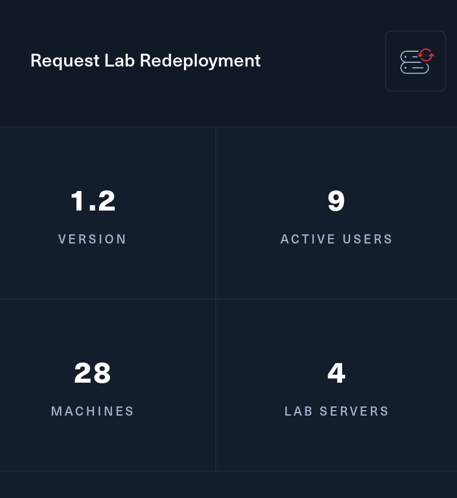

This challenge is a huge one, the customer provided us one entry point on the subnet: **10.10.110.0/24**

From the challenge we know there should be about 28 machines.



```
CYBERNETICS-FW
CYBERNETICS-CYDC
CYBERNETICS-CYADFS
CYBERNETICS-CYWAP
CYBERNETICS-CYMX
CYBERNETICS-CYFS
CYBERNETICS-CYWEBDW
CYBERNETICS-CYMONITOR
CYBERNETICS-CYAPP
CYBERNETICS-CYGW
CYBERNETICS-COREDC
CYBERNETICS-COREWEBTW
CYBERNETICS-COREWKT001
CYBERNETICS-COREWKT002
CYBERNETICS-COREWEBDL
CYBERNETICS-M3DC
CYBERNETICS-M3SQLW
CYBERNETICS-M3WEBAW
CYBERNETICS-D3DC
CYBERNETICS-D3WKT001
CYBERNETICS-D3WEBJW
CYBERNETICS-D3WEBVW
CYBERNETICS-D3WEBAL
CYBERNETICS-INDC
CYBERNETICS-INWEBJW
CYBERNETICS-INWEBGL
CYBERNETICS-INWKT001
CYBERNETICS-INWKT002
```

And with a mix of both Windows and Linux osses.

Without further do, let's dig into the challenge.

&nbsp;