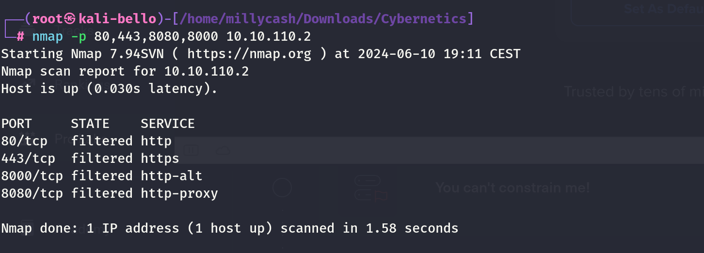

Now we can start Nmap and check how can we footprint this machine? Judging by the IP I guess that this might be the Firewall?


Seems like the WAF is blocking my scans?

```
┌──(root㉿kali-bello)-[/home/millycash/Downloads/Cybernetics]
└─# nmap 10.10.110.2                 
Starting Nmap 7.94SVN ( https://nmap.org ) at 2024-06-10 19:09 CEST
Stats: 0:00:01 elapsed; 0 hosts completed (1 up), 1 undergoing SYN Stealth Scan
SYN Stealth Scan Timing: About 0.50% done
Stats: 0:00:02 elapsed; 0 hosts completed (1 up), 1 undergoing SYN Stealth Scan
SYN Stealth Scan Timing: About 5.50% done; ETC: 19:10 (0:00:52 remaining)
Stats: 0:00:13 elapsed; 0 hosts completed (1 up), 1 undergoing SYN Stealth Scan
SYN Stealth Scan Timing: About 38.50% done; ETC: 19:10 (0:00:21 remaining)
Stats: 0:00:14 elapsed; 0 hosts completed (1 up), 1 undergoing SYN Stealth Scan
SYN Stealth Scan Timing: About 42.50% done; ETC: 19:10 (0:00:19 remaining)
Nmap scan report for 10.10.110.2
Host is up (0.031s latency).
All 1000 scanned ports on 10.10.110.2 are in ignored states.
Not shown: 1000 filtered tcp ports (no-response)

Nmap done: 1 IP address (1 host up) scanned in 32.67 seconds
```

Even guessing some HTTP based port are filtered:



This makes me thinking about moving forward with the enumeration.

A usefull step is if this would be a windows machine to use tools like NetExec/Enum4Linux-ng to footprint the SMB/NETBIOS services and with that we can know the hostname as well.

# Moving on

For the reasons described under the machine .10 i feel like this is just a rabbit hole and this machine might still be legit, but non-reachable from the inside. My theory could make sense since the .10 had no NIC on the DMZ subnet which means that this might be only a VirtualIP pointer from firewall.