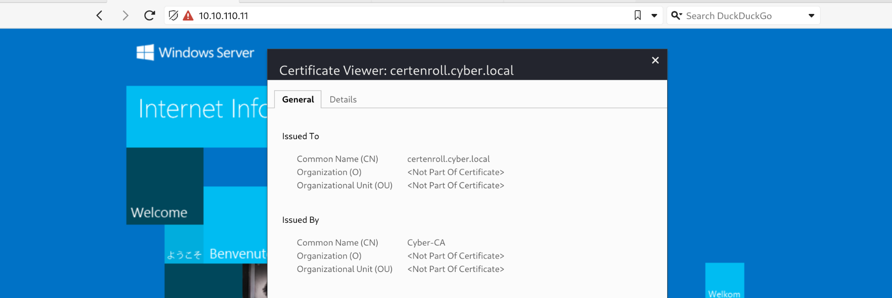
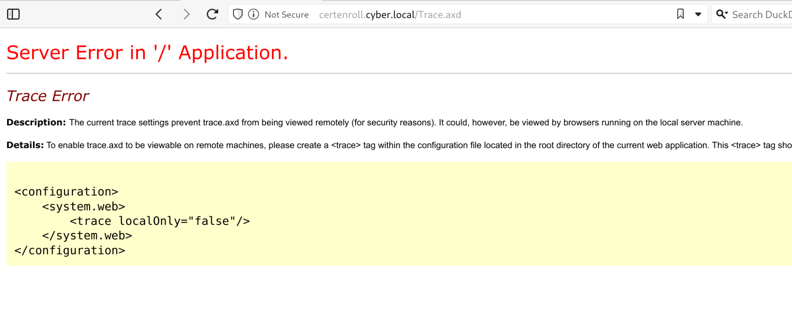

Now here we can run our beloved Rustscan and check all the available ports over the TCP protocoll. It isn't finding anything?

```
┌──(root㉿kali-bello)-[/home/millycash/Downloads/Cybernetics]  
└─# rustscan -a 10.10.11.11 -- -A -T4  
.----. .-. .-. .----..---. .----. .---. .--. .-. .-.  
| {} }| { } |{ {__ {_ _}{ {__ / _**} / {} \ | `| |  
| .-. \| {_} |.-._} } | | .-._} }\ }/ /\ \| |\ |  
`-' `-'`-----'`----' `-' `----' `---' `-' `-'`-' `-'  
The Modern Day Port Scanner.  
_**_**_**_**_**_**_**_**_**_**_**_**_**_  
: http://discord.skerritt.blog :  
: https://github.com/RustScan/RustScan :  
--------------------------------------  
Nmap? More like slowmap.🐢

[~] The config file is expected to be at "/root/.rustscan.toml"  
[!] File limit is lower than default batch size. Consider upping with --ulimit. May cause harm to sensitive servers  
[!] Your file limit is very small, which negatively impacts RustScan's speed. Use the Docker image, or up the Ulimit with '--ulimit 5000'.  
[!] Looks like I didn't find any open ports for 10.10.11.11. This is usually caused by a high batch size.

*I used 4500 batch size, consider lowering it with 'rustscan -b <batch_size> -a <ip address>' or a comfortable number for your system.

Alternatively, increase the timeout if your ping is high. Rustscan -t 2000 for 2000 milliseconds (2s) timeout.

&nbsp;
```

But if we check for the common port 443 we can see that there is indeed a Windows server and it might be the CA?



What about the UDP services instead?

```
┌──(root㉿kali-bello)-[/home/millycash/Downloads/Cybernetics]
└─# nmap -sU -F 10.10.110.11
Starting Nmap 7.94SVN ( https://nmap.org ) at 2024-06-10 19:35 CEST
Nmap scan report for certenroll.cyber.local (10.10.110.11)
Host is up (0.031s latency).
Not shown: 98 open|filtered udp ports (no-response)
PORT    STATE  SERVICE
80/udp  closed http
443/udp closed https

Nmap done: 1 IP address (1 host up) scanned in 20.99 seconds
```

Nothing special again... But even if we know that this is supposedly a windows server the Enum4linux-ng isn't able to footprint the machine!

```
┌──(root㉿kali-bello)-[/home/millycash/Downloads/Cybernetics]
└─# enum4linux-ng -A 10.10.11.11
/usr/local/bin/enum4linux-ng:4: DeprecationWarning: pkg_resources is deprecated as an API. See https://setuptools.pypa.io/en/latest/pkg_resources.html
  __import__('pkg_resources').run_script('enum4linux-ng==1.3.3', 'enum4linux-ng')
ENUM4LINUX - next generation (v1.3.3)

 ==========================
|    Target Information    |
 ==========================
[*] Target ........... 10.10.11.11
[*] Username ......... ''
[*] Random Username .. 'sdvazixe'
[*] Password ......... ''
[*] Timeout .......... 5 second(s)

 ====================================
|    Listener Scan on 10.10.11.11    |
 ====================================
[*] Checking LDAP
[-] Could not connect to LDAP on 389/tcp: timed out
[*] Checking LDAPS
[-] Could not connect to LDAPS on 636/tcp: timed out
[*] Checking SMB
[-] Could not connect to SMB on 445/tcp: timed out
[*] Checking SMB over NetBIOS
[-] Could not connect to SMB over NetBIOS on 139/tcp: timed out

 ==========================================================
|    NetBIOS Names and Workgroup/Domain for 10.10.11.11    |
 ==========================================================
[-] Could not get NetBIOS names information via 'nmblookup': timed out

[!] Aborting remainder of tests since neither SMB nor LDAP are accessible

Completed after 25.03 seconds
```

Next we can try executing Dirsearch and checking for possible hidden files/folders:

```
Target: http://10.10.110.11/

[19:56:18] Starting: 
[19:56:19] 403 -  312B  - /%2e%2e//google.com
[19:56:19] 403 -  312B  - /.%2e/%2e%2e/%2e%2e/%2e%2e/etc/passwd
[19:56:19] 404 -    2KB - /.ashx
[19:56:19] 404 -    2KB - /.asmx
[19:56:22] 403 -  312B  - /\..\..\..\..\..\..\..\..\..\etc\passwd
[19:56:23] 404 -    2KB - /admin%20/
[19:56:23] 404 -    2KB - /admin.
[19:56:28] 301 -  157B  - /aspnet_client  ->  http://10.10.110.11/aspnet_client/
[19:56:28] 404 -    2KB - /asset..
[19:56:28] 403 -    1KB - /aspnet_client/
[19:56:29] 403 -  312B  - /cgi-bin/.%2e/%2e%2e/%2e%2e/%2e%2e/etc/passwd
[19:56:32] 400 -    3KB - /docpicker/internal_proxy/https/127.0.0.1:9043/ibm/console
[19:56:35] 404 -    2KB - /index.php.
[19:56:36] 404 -    2KB - /javax.faces.resource.../
[19:56:36] 400 -    3KB - /jolokia/exec/com.sun.management:type=DiagnosticCommand/compilerDirectivesAdd/!/etc!/passwd
[19:56:36] 400 -    3KB - /jolokia/exec/com.sun.management:type=DiagnosticCommand/help/*
[19:56:36] 400 -    3KB - /jolokia/exec/com.sun.management:type=DiagnosticCommand/jvmtiAgentLoad/!/etc!/passwd
[19:56:36] 400 -    3KB - /jolokia/exec/com.sun.management:type=DiagnosticCommand/vmLog/disable
[19:56:36] 400 -    3KB - /jolokia/exec/com.sun.management:type=DiagnosticCommand/jfrStart/filename=!/tmp!/foo
[19:56:36] 400 -    3KB - /jolokia/write/java.lang:type=Memory/Verbose/true
[19:56:36] 400 -    3KB - /jolokia/exec/com.sun.management:type=DiagnosticCommand/vmSystemProperties
[19:56:36] 400 -    3KB - /jolokia/search/*:j2eeType=J2EEServer,*
[19:56:36] 400 -    3KB - /jolokia/exec/java.lang:type=Memory/gc
[19:56:36] 400 -    3KB - /jolokia/read/java.lang:type=Memory/HeapMemoryUsage/used
[19:56:36] 400 -    3KB - /jolokia/read/java.lang:type=*/HeapMemoryUsage
[19:56:36] 400 -    3KB - /jolokia/exec/com.sun.management:type=DiagnosticCommand/vmLog/output=!/tmp!/pwned
[19:56:37] 404 -    2KB - /login.wdm%2e
[19:56:38] 404 -    2KB - /mcx/mcxservice.svc
[19:56:43] 404 -    2KB - /rating_over.
[19:56:43] 404 -    2KB - /reach/sip.svc
[19:56:44] 404 -    2KB - /service.asmx
[19:56:46] 404 -    2KB - /static..
[19:56:48] 403 -    2KB - /Trace.axd
[19:56:48] 404 -    2KB - /umbraco/webservices/codeEditorSave.asmx
[19:56:49] 404 -    2KB - /WEB-INF./
[19:56:50] 404 -    2KB - /WebResource.axd?d=LER8t9aS
[19:56:50] 404 -    2KB - /webticket/webticketservice.svc

Task Completed
```

And that Trace.axd can only beeing seen from the inside, right now I don't see that much that could be done here:



&nbsp;

# Moving on

For the reasons described under the machine .10 i feel like this is just a rabbit hole and this machine might still be legit, but non-reachable from the inside. My theory could make sense since the .10 had no NIC on the DMZ subnet which means that this might be only a VirtualIP pointer from firewall.