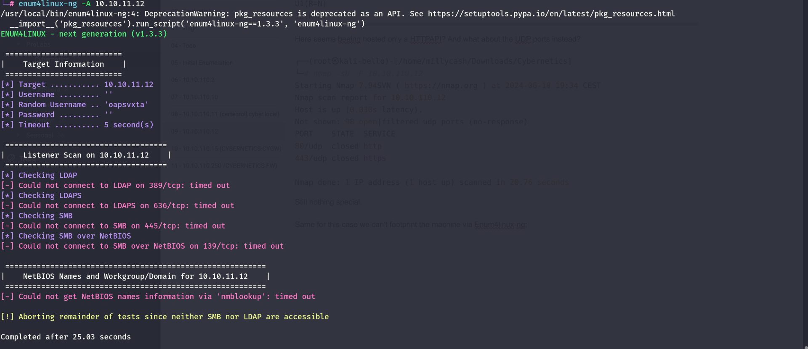
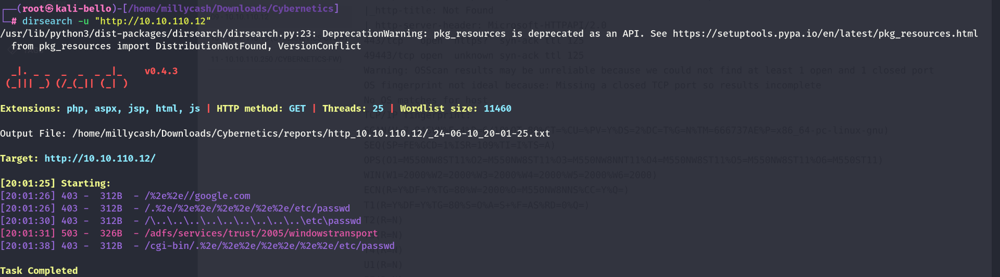
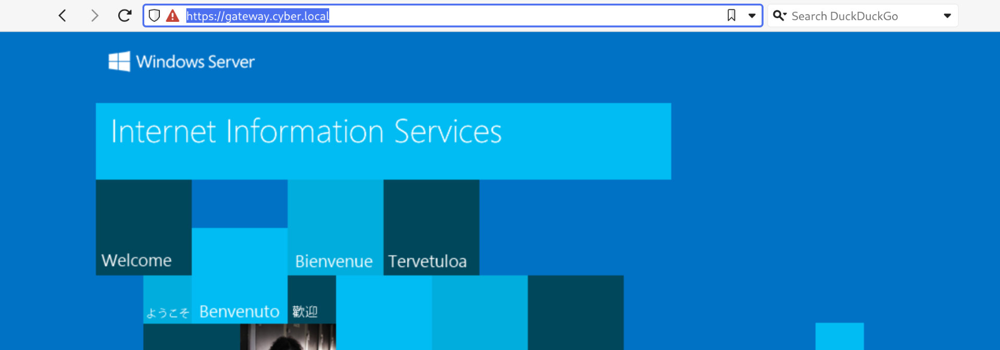
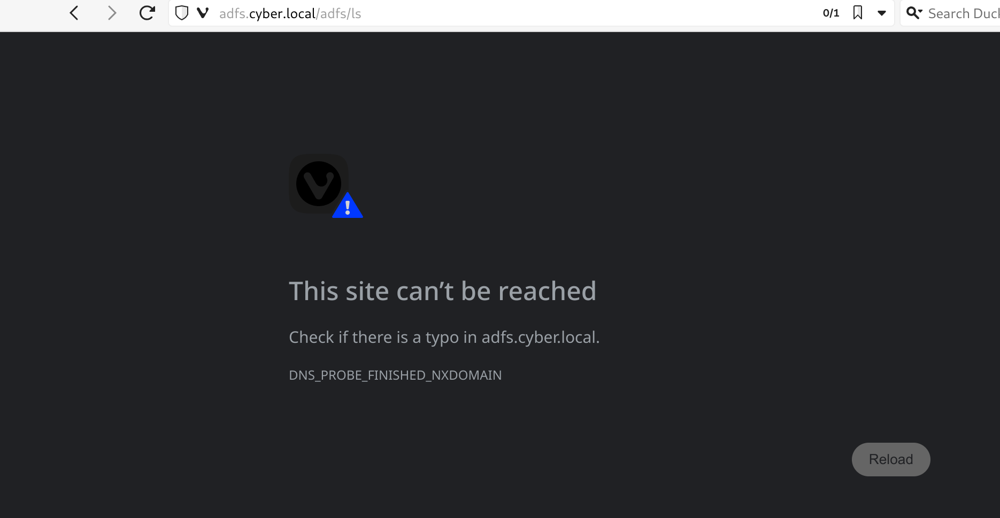
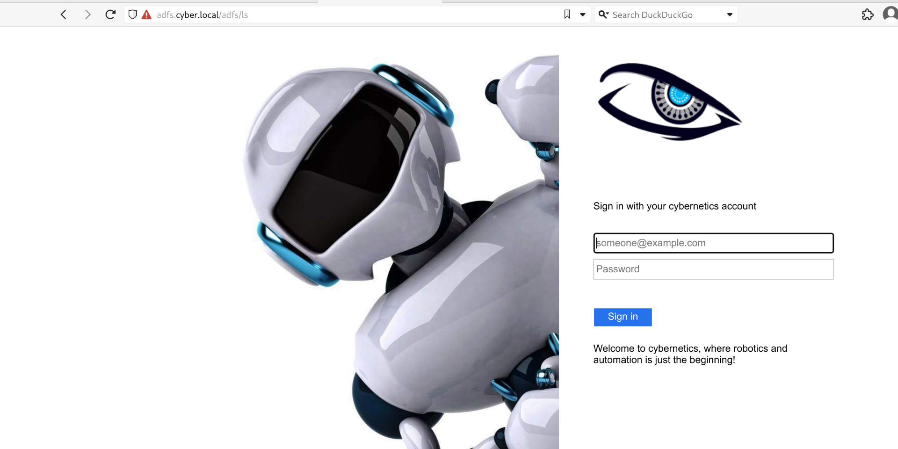

Now here we can run our beloved Rustscan and check all the available ports over the TCP protocoll.

```
──(root㉿kali-bello)-[/home/millycash/Downloads/Cybernetics]
└─# rustscan -a 10.10.110.12 -- -A -T4
.----. .-. .-. .----..---.  .----. .---.   .--.  .-. .-.
| {}  }| { } |{ {__ {_   _}{ {__  /  ___} / {} \ |  `| |
| .-. \| {_} |.-._} } | |  .-._} }\     }/  /\  \| |\  |
`-' `-'`-----'`----'  `-'  `----'  `---' `-'  `-'`-' `-'
The Modern Day Port Scanner.
________________________________________
: http://discord.skerritt.blog           :
: https://github.com/RustScan/RustScan :
 --------------------------------------
Real hackers hack time ⌛

[~] The config file is expected to be at "/root/.rustscan.toml"
[!] File limit is lower than default batch size. Consider upping with --ulimit. May cause harm to sensitive servers
[!] Your file limit is very small, which negatively impacts RustScan's speed. Use the Docker image, or up the Ulimit with '--ulimit 5000'. 
Open 10.10.110.12:80
Open 10.10.110.12:443
Open 10.10.110.12:49443
[~] Starting Script(s)
[>] Running script "nmap -vvv -p {{port}} {{ip}} -A -T4" on ip 10.10.110.12
Depending on the complexity of the script, results may take some time to appear.
[~] Starting Nmap 7.94SVN ( https://nmap.org ) at 2024-06-10 19:27 CEST
NSE: Loaded 156 scripts for scanning.
NSE: Script Pre-scanning.
NSE: Starting runlevel 1 (of 3) scan.
Initiating NSE at 19:27
Completed NSE at 19:27, 0.00s elapsed
NSE: Starting runlevel 2 (of 3) scan.
Initiating NSE at 19:27
Completed NSE at 19:27, 0.00s elapsed
NSE: Starting runlevel 3 (of 3) scan.
Initiating NSE at 19:27
Completed NSE at 19:27, 0.00s elapsed
Initiating Ping Scan at 19:27
Scanning 10.10.110.12 [4 ports]
Completed Ping Scan at 19:27, 0.08s elapsed (1 total hosts)
Initiating Parallel DNS resolution of 1 host. at 19:27
Completed Parallel DNS resolution of 1 host. at 19:27, 0.00s elapsed
DNS resolution of 1 IPs took 0.00s. Mode: Async [#: 1, OK: 0, NX: 1, DR: 0, SF: 0, TR: 1, CN: 0]
Initiating SYN Stealth Scan at 19:27
Scanning 10.10.110.12 [3 ports]
Discovered open port 443/tcp on 10.10.110.12
Discovered open port 49443/tcp on 10.10.110.12
Discovered open port 80/tcp on 10.10.110.12
Completed SYN Stealth Scan at 19:27, 0.06s elapsed (3 total ports)
Initiating Service scan at 19:27
Scanning 3 services on 10.10.110.12
Completed Service scan at 19:28, 12.67s elapsed (3 services on 1 host)
Initiating OS detection (try #1) against 10.10.110.12
Retrying OS detection (try #2) against 10.10.110.12
Initiating Traceroute at 19:28
Completed Traceroute at 19:28, 0.04s elapsed
Initiating Parallel DNS resolution of 2 hosts. at 19:28
Completed Parallel DNS resolution of 2 hosts. at 19:28, 0.00s elapsed
DNS resolution of 2 IPs took 0.00s. Mode: Async [#: 1, OK: 0, NX: 2, DR: 0, SF: 0, TR: 2, CN: 0]
NSE: Script scanning 10.10.110.12.
NSE: Starting runlevel 1 (of 3) scan.
Initiating NSE at 19:28
Completed NSE at 19:28, 5.10s elapsed
NSE: Starting runlevel 2 (of 3) scan.
Initiating NSE at 19:28
Completed NSE at 19:28, 0.28s elapsed
NSE: Starting runlevel 3 (of 3) scan.
Initiating NSE at 19:28
Completed NSE at 19:28, 0.00s elapsed
Nmap scan report for 10.10.110.12
Host is up, received syn-ack ttl 125 (0.029s latency).
Scanned at 2024-06-10 19:27:52 CEST for 22s

PORT      STATE SERVICE REASON          VERSION
80/tcp    open  http    syn-ack ttl 125 Microsoft HTTPAPI httpd 2.0 (SSDP/UPnP)
|_http-title: Not Found
|_http-server-header: Microsoft-HTTPAPI/2.0
443/tcp   open  https?  syn-ack ttl 125
49443/tcp open  unknown syn-ack ttl 125
Warning: OSScan results may be unreliable because we could not find at least 1 open and 1 closed port
OS fingerprint not ideal because: Missing a closed TCP port so results incomplete
No OS matches for host
TCP/IP fingerprint:
SCAN(V=7.94SVN%E=4%D=6/10%OT=80%CT=%CU=%PV=Y%DS=2%DC=T%G=N%TM=666737AE%P=x86_64-pc-linux-gnu)
SEQ(SP=FE%GCD=1%ISR=109%TI=I%TS=A)
OPS(O1=M550NW8ST11%O2=M550NW8ST11%O3=M550NW8NNT11%O4=M550NW8ST11%O5=M550NW8ST11%O6=M550ST11)
WIN(W1=2000%W2=2000%W3=2000%W4=2000%W5=2000%W6=2000)
ECN(R=Y%DF=Y%TG=80%W=2000%O=M550NW8NNS%CC=Y%Q=)
T1(R=Y%DF=Y%TG=80%S=O%A=S+%F=AS%RD=0%Q=)
T2(R=N)
T3(R=N)
T4(R=N)
U1(R=N)
IE(R=N)
```

Here seems beeing hosted only a HTTPAPI? And what about the UDP ports instead?

```
┌──(root㉿kali-bello)-[/home/millycash/Downloads/Cybernetics]
└─# nmap -sU -F 10.10.110.12
Starting Nmap 7.94SVN ( https://nmap.org ) at 2024-06-10 19:34 CEST
Nmap scan report for 10.10.110.12
Host is up (0.030s latency).
Not shown: 98 open|filtered udp ports (no-response)
PORT    STATE  SERVICE
80/udp  closed http
443/udp closed https

Nmap done: 1 IP address (1 host up) scanned in 20.76 seconds
```

Still nothing special.

Same for this case we can't footprint the machine via Enum4linux-ng:



If we run dirsearch we can't find anything so far...



# Moving on

For the reasons described under the machine .10 i feel like this is just a rabbit hole and this machine might still be legit, but non-reachable from the inside. My theory could make sense since the .10 had no NIC on the DMZ subnet which means that this might be only a VirtualIP pointer from firewall.

Getting back from the information found in the worpress site we can see that we have the gateway.cyber.local that isn't answering?



But when I click on the apps.cyber.local I can see that it redirects to the ADFS?



What id we add that as well on the same network?



Nice we have an access!

But we have also Jenkins and OWA which we require the certificate installed before gaining access?

&nbsp;

&nbsp;