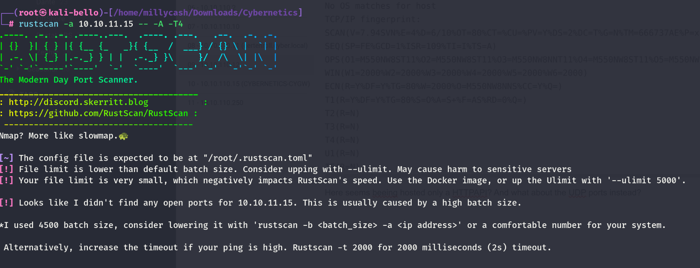
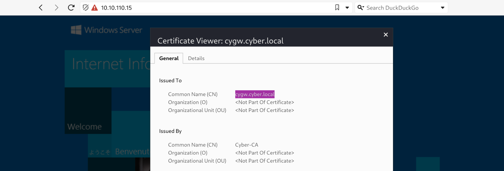
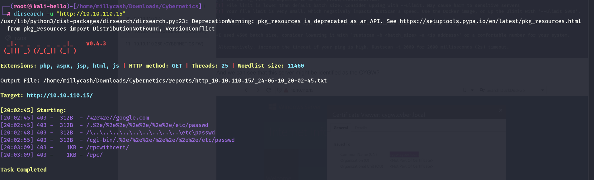

Now here we can run our beloved Rustscan and check all the available ports over the TCP protocoll. But it is failing?



And we can see that this server might be identified as the CYGW?



And nothing fancy under the UDP protocoll:

```
┌──(root㉿kali-bello)-[/home/millycash/Downloads/Cybernetics]
└─# nmap -sU -F 10.10.110.15
Starting Nmap 7.94SVN ( https://nmap.org ) at 2024-06-10 19:32 CEST
Nmap scan report for cygw.cyber.local (10.10.110.15)
Host is up (0.030s latency).
Not shown: 98 open|filtered udp ports (no-response)
PORT    STATE  SERVICE
80/udp  closed http
443/udp closed https

Nmap done: 1 IP address (1 host up) scanned in 18.46 seconds
```

Same here for SMB which is most likely blocked by the firewall and it isn't letting us check the hostname?

```
┌──(root㉿kali-bello)-[/home/millycash/Downloads/Cybernetics]
└─# enum4linux-ng -A 10.10.11.15
/usr/local/bin/enum4linux-ng:4: DeprecationWarning: pkg_resources is deprecated as an API. See https://setuptools.pypa.io/en/latest/pkg_resources.html
  __import__('pkg_resources').run_script('enum4linux-ng==1.3.3', 'enum4linux-ng')
ENUM4LINUX - next generation (v1.3.3)

 ==========================
|    Target Information    |
 ==========================
[*] Target ........... 10.10.11.15
[*] Username ......... ''
[*] Random Username .. 'orihzova'
[*] Password ......... ''
[*] Timeout .......... 5 second(s)

 ====================================
|    Listener Scan on 10.10.11.15    |
 ====================================
[*] Checking LDAP
[-] Could not connect to LDAP on 389/tcp: timed out
[*] Checking LDAPS
[-] Could not connect to LDAPS on 636/tcp: timed out
[*] Checking SMB
[-] Could not connect to SMB on 445/tcp: timed out
[*] Checking SMB over NetBIOS
[-] Could not connect to SMB over NetBIOS on 139/tcp: timed out

 ==========================================================
|    NetBIOS Names and Workgroup/Domain for 10.10.11.15    |
 ==========================================================
[-] Could not get NetBIOS names information via 'nmblookup': timed out

[!] Aborting remainder of tests since neither SMB nor LDAP are accessible

Completed after 25.02 seconds
```

Dirsearch isn't able to find anything juicy so far:



# Moving on

For the reasons described under the machine .10 i feel like this is just a rabbit hole and this machine might still be legit, but non-reachable from the inside. My theory could make sense since the .10 had no NIC on the DMZ subnet which means that this might be only a VirtualIP pointer from firewall.