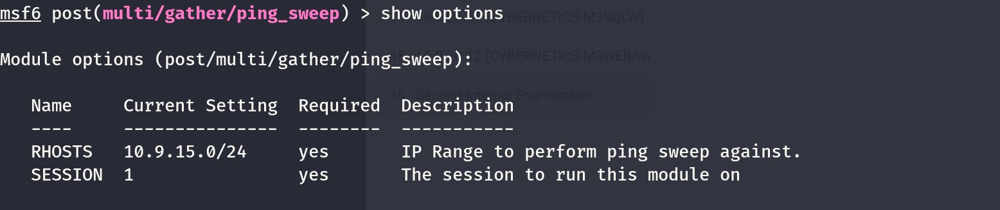
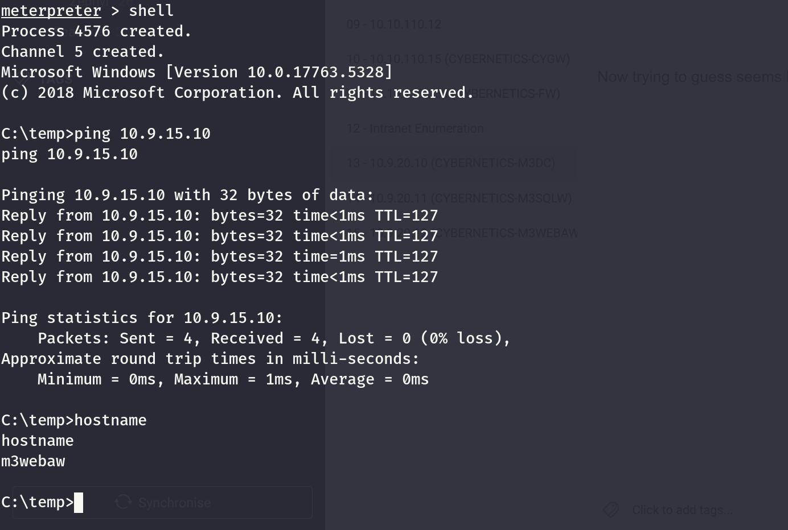
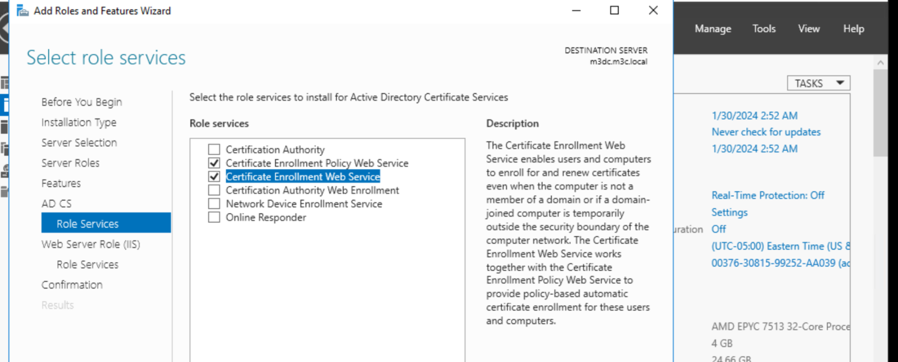
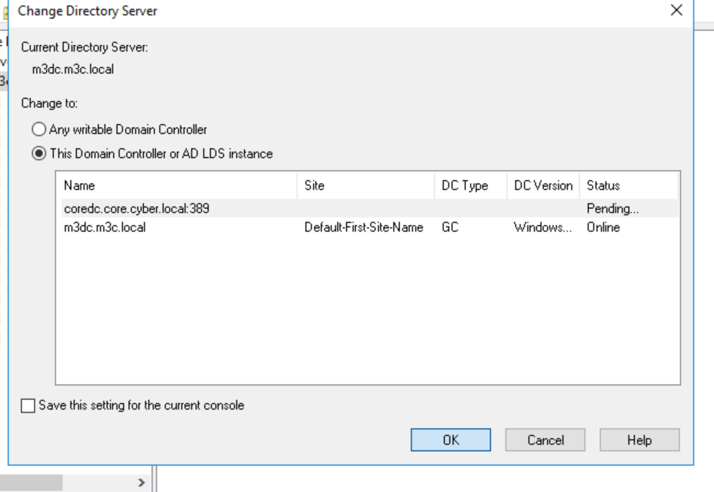
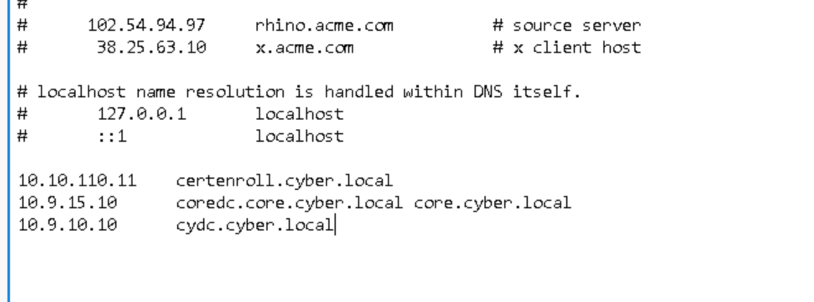
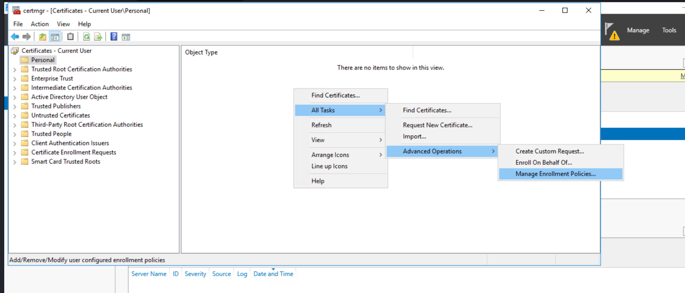
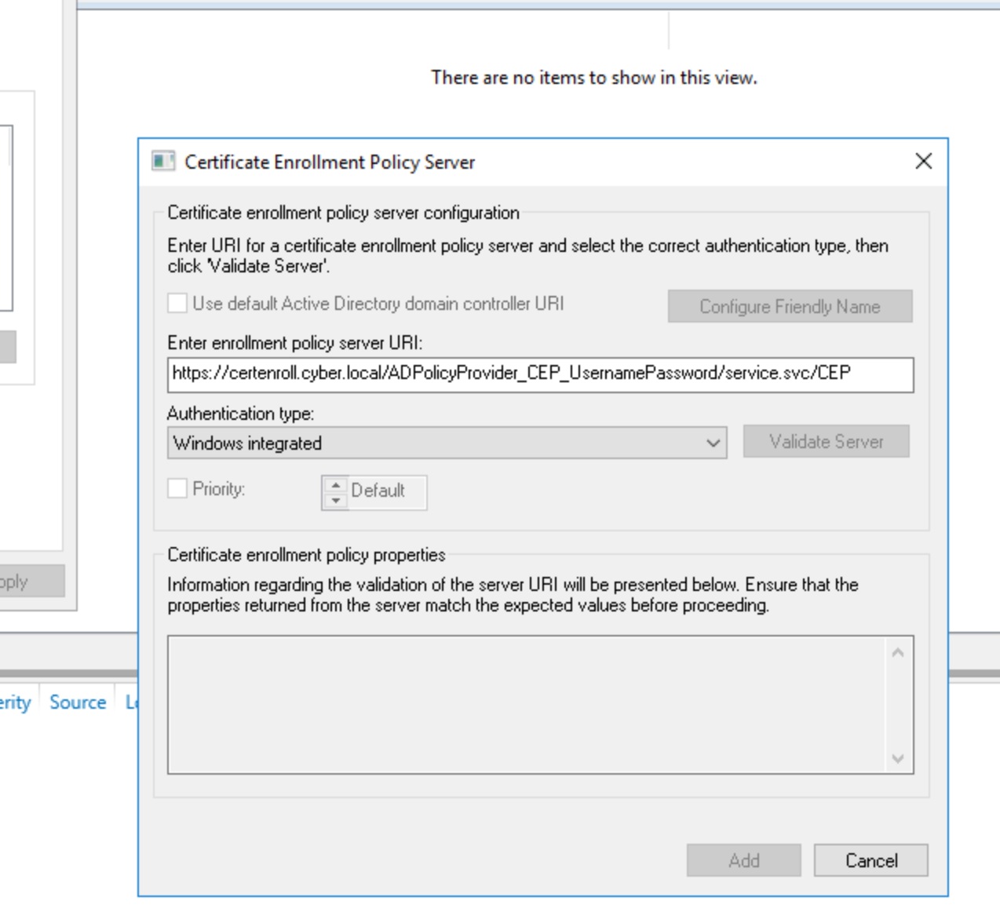

Now I will need to enumerate again the network 10  and 15 and will do both from Meterpreter session via "Ping Sweep" module and also via the RDP session in DC and compare the resutls.



But seems like the module is failing? I am sure the 15.10 exist as i tried before manually



But before adding the routes so Ligolo can to its job.


And now it works from our machine, which allows us to use fping.

```
──(millycash㉿kali-bello)-[~/Downloads/Cybernetics]
└─$ ping 10.9.15.10 -c3
PING 10.9.15.10 (10.9.15.10) 56(84) bytes of data.
64 bytes from 10.9.15.10: icmp_seq=1 ttl=64 time=35.1 ms
64 bytes from 10.9.15.10: icmp_seq=2 ttl=64 time=38.5 ms
64 bytes from 10.9.15.10: icmp_seq=3 ttl=64 time=102 ms

--- 10.9.15.10 ping statistics ---
3 packets transmitted, 3 received, 0% packet loss, time 2003ms
rtt min/avg/max/mdev = 35.070/58.406/101.671/30.624 ms
```

And we have several of them (don't count in the 1 which usually is the router):

```
┌──(root㉿kali-bello)-[/home/millycash/Downloads/Cybernetics]
└─# fping -asgq 10.9.15.0/24  
10.9.15.1
10.9.15.10
10.9.15.11
10.9.15.12
10.9.15.200
10.9.15.201

     254 targets
       6 alive
     248 unreachable
       0 unknown addresses

     992 timeouts (waiting for response)
     998 ICMP Echos sent
       6 ICMP Echo Replies received
       0 other ICMP received

 35.0 ms (min round trip time)
 76.0 ms (avg round trip time)
 106 ms (max round trip time)
        9.148 sec (elapsed real time)
```

And we can do same for .10 and again here not counting the .1:

```
┌──(root㉿kali-bello)-[/home/millycash/Downloads/Cybernetics]
└─# fping -asgq 10.9.10.0/24
10.9.10.1
10.9.10.14
10.9.10.10
10.9.10.11
10.9.10.12
10.9.10.13
10.9.10.16
10.9.10.17

     254 targets
       8 alive
     246 unreachable
       0 unknown addresses

     984 timeouts (waiting for response)
     992 ICMP Echos sent
       8 ICMP Echo Replies received
       0 other ICMP received

 38.5 ms (min round trip time)
 57.5 ms (avg round trip time)
 83.8 ms (max round trip time)
        9.184 sec (elapsed real time)
```

I tried to do same in powershell but it gave me exact same results for both networks!

Now seems like the networks answers to ping but nmap fails somehow? I will upload a static binary of nmap.exe on the dc and test there...

&nbsp;

# Enrolling the cert

If we go back to the message on the intranet we need to enroll a certificat ethat will gain us access to the email and the jenkins.

We need a Windows server and we have this as reference: https://learn.microsoft.com/en-us/archive/blogs/askds/enabling-cep-and-ces-for-enrolling-non-domain-joined-computers-for-certificates

I hope I can use the M3DC so this task!

Adding the ADCS role:



But i am having some issues  so i am trying to add a new dc to ADSD:



But I forgot to add the DNS entries:  


But it wasnt working so here I had to look around and seems it can be done easily from the default Certmngr.exe:





And it isn't pasing the check but we can use the certificate option? But now the issue is that we can't reach the xternal network om 10.10.110.x so I guess we need to find the right server on the internal network 10.9.10.x and guessign that this is the internal cydc.cyber.local?

Seems like no, but since when we try to login into adfs might it be the adfs server?

But here I am missing something, apparently talking to an user I need to find some credentials saved in user descriptioon filelds?

So My guessing is I need to see how is actually federated the m3c.local to cyber.local

```
(LDAP)-[10.9.20.10]-[M3C\yovecio]
PV > Get-DomainTrust 
name                   : cyber.local
objectGUID             : {d68cff32-97bc-4880-9a7f-158153e03545}
securityIdentifier     : S-1-5-21-2011815209-557191040-1566801441
trustDirection         : Outbound
trustPartner           : cyber.local
trustType              : WINDOWS_ACTIVE_DIRECTORY
trustAttributes        : FOREST_TRANSITIVE
flatName               : CYBER

(LDAP)-[10.9.20.10]-[M3C\yovecio]
PV >
```

It isnt't bidirectional, but then i am wondering if I can check the resurces from other side

&nbsp;

&nbsp;

&nbsp;

&nbsp;

&nbsp;

&nbsp;